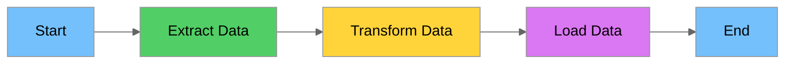
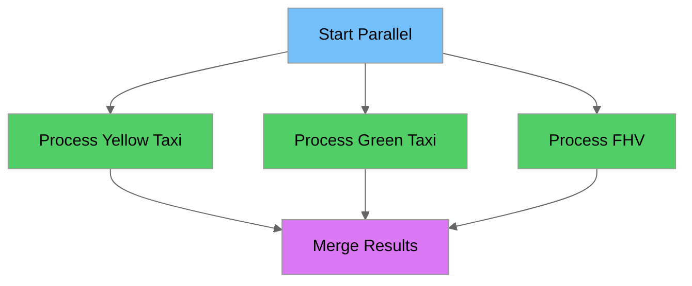
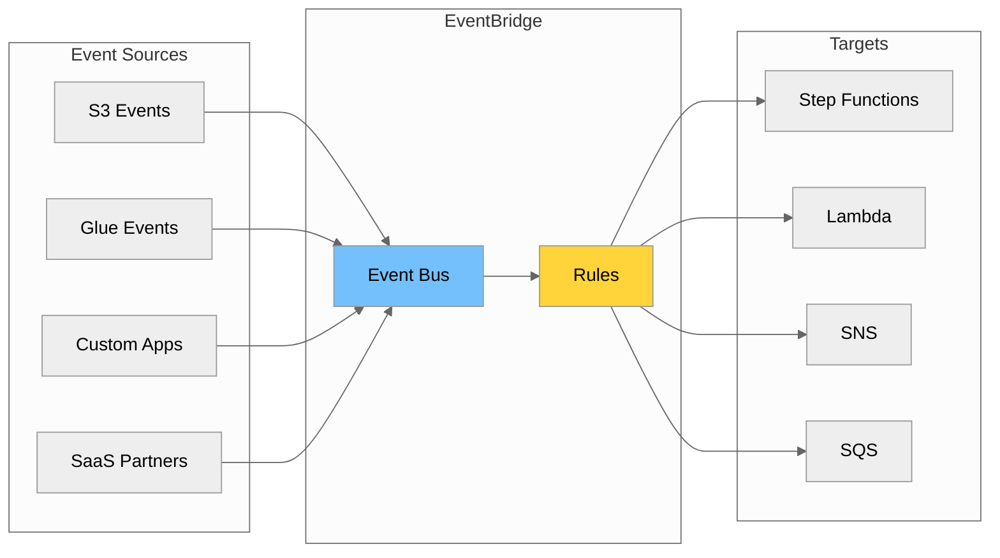
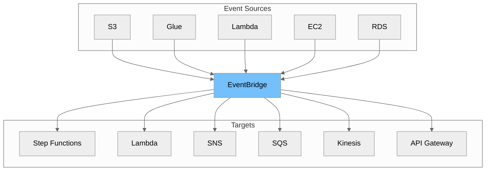
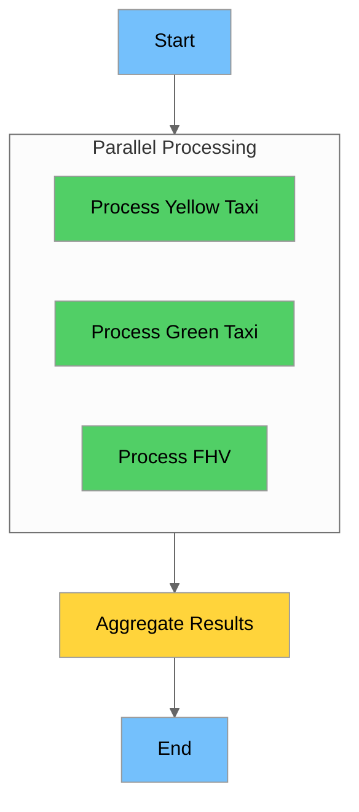
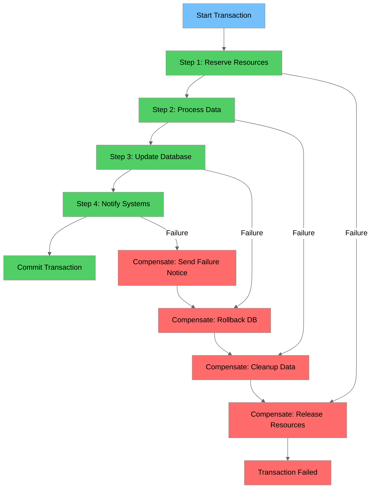
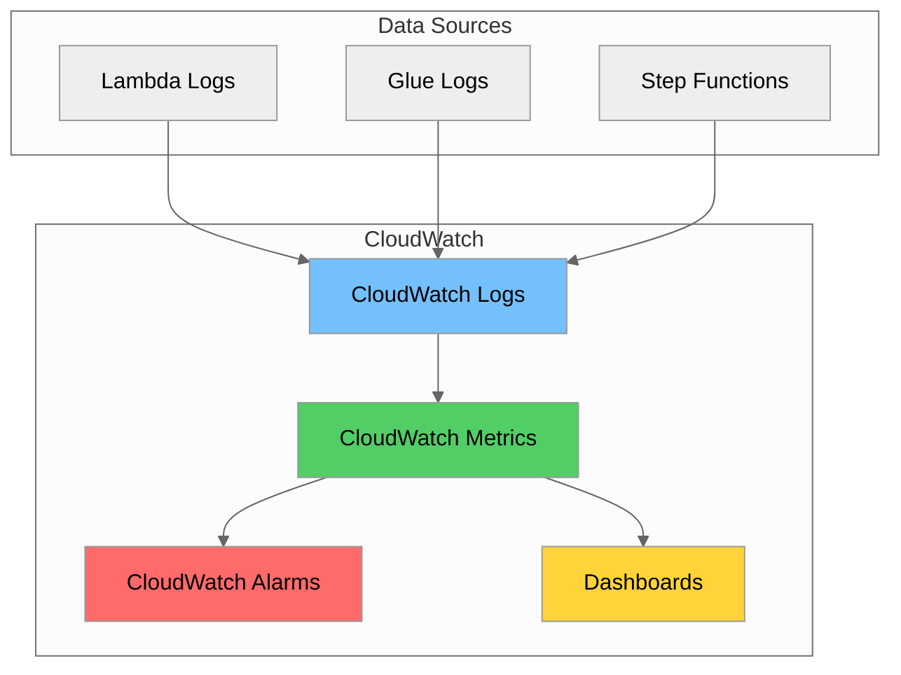
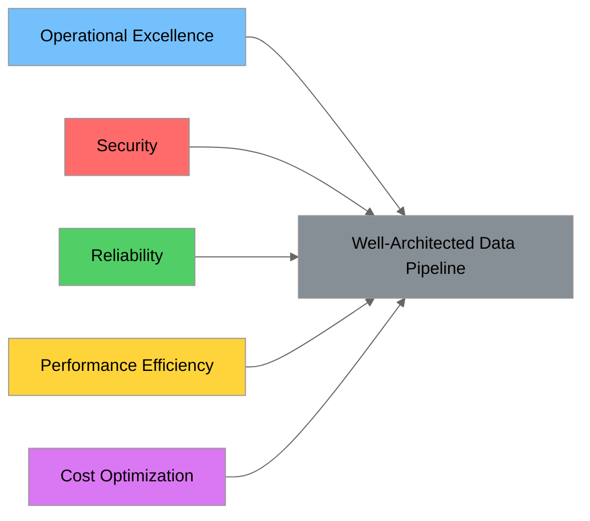

# Day 11: Data Pipeline Orchestration & Monitoring

## Week 3 - Building Production-Ready Data Pipelines

---

## 📋 Learning Objectives

By the end of this tutorial, you will be able to:

1. **Design and implement AWS Step Functions** state machines to orchestrate complex data pipelines
2. **Configure AWS EventBridge** for event-driven pipeline triggers and scheduling
3. **Apply workflow orchestration patterns** including error handling, retries, and saga patterns
4. **Set up comprehensive monitoring** using CloudWatch Logs, Metrics, and Alarms
5. **Implement structured logging strategies** for better observability
6. **Apply cost optimization techniques** across your data pipeline infrastructure
7. **Understand the AWS Well-Architected Framework** pillars as they apply to data engineering

---

## 📚 Prerequisites

Before starting this tutorial, ensure you have:

- Completed Days 1-10 of the training plan
- AWS account with appropriate permissions
- AWS CLI configured locally
- Basic understanding of:
  - AWS Lambda functions
  - AWS Glue jobs
  - Amazon S3 operations
  - Amazon RDS basics

---

## Table of Contents

1. [AWS Step Functions](#1-aws-step-functions)
2. [AWS EventBridge](#2-aws-eventbridge)
3. [Workflow Orchestration Patterns](#3-workflow-orchestration-patterns)
4. [CloudWatch for Monitoring](#4-cloudwatch-for-monitoring)
5. [Logging Strategies](#5-logging-strategies)
6. [Cost Optimization Techniques](#6-cost-optimization-techniques)
7. [AWS Well-Architected Framework for Data](#7-aws-well-architected-framework-for-data)
8. [Hands-On Labs](#8-hands-on-labs)
9. [Summary and Key Takeaways](#9-summary-and-key-takeaways)
10. [References](#10-references)

---

## 1. AWS Step Functions

### 1.1 What are Step Functions and State Machines?

AWS Step Functions is a serverless orchestration service that lets you combine AWS Lambda functions and other AWS services to build business-critical applications. At its core, Step Functions uses **state machines** to define workflows.



**Key Concepts:**

| Concept | Description |
|---------|-------------|
| **State Machine** | A workflow defined as a series of states that perform work, make decisions, and manage data flow |
| **State** | A single step in your workflow that can perform a task, make a choice, or control flow |
| **Execution** | A running instance of your state machine |
| **Amazon States Language (ASL)** | JSON-based language used to define state machines |

**Why Use Step Functions for Data Pipelines?**

1. **Visual Workflow**: See your entire pipeline at a glance
2. **Built-in Error Handling**: Automatic retries and catch blocks
3. **State Management**: Track exactly where each execution is
4. **Integration**: Native support for 200+ AWS services
5. **Audit Trail**: Complete execution history for compliance

### 1.2 State Types

Step Functions provides seven state types to build your workflows:

#### 1.2.1 Task State

The **Task** state performs work by invoking an AWS service or activity.

```json
{
  "ExtractTaxiData": {
    "Type": "Task",
    "Resource": "arn:aws:lambda:us-east-1:123456789012:function:extract-taxi-data",
    "Parameters": {
      "bucket": "nyc-taxi-data",
      "key.$": "$.input_file"
    },
    "ResultPath": "$.extraction_result",
    "Next": "TransformData"
  }
}
```

**Common Task Resources:**

| Service | Resource ARN Pattern |
|---------|---------------------|
| Lambda | `arn:aws:lambda:REGION:ACCOUNT:function:FUNCTION_NAME` |
| Glue | `arn:aws:states:::glue:startJobRun.sync` |
| ECS | `arn:aws:states:::ecs:runTask.sync` |
| SNS | `arn:aws:states:::sns:publish` |
| DynamoDB | `arn:aws:states:::dynamodb:putItem` |

#### 1.2.2 Choice State

The **Choice** state adds branching logic to your workflow.

```json
{
  "CheckDataQuality": {
    "Type": "Choice",
    "Choices": [
      {
        "Variable": "$.quality_score",
        "NumericGreaterThanEquals": 95,
        "Next": "LoadToProduction"
      },
      {
        "Variable": "$.quality_score",
        "NumericGreaterThanEquals": 80,
        "Next": "LoadToStaging"
      }
    ],
    "Default": "QuarantineData"
  }
}
```

**Choice Operators:**

| Category | Operators |
|----------|-----------|
| String | `StringEquals`, `StringLessThan`, `StringGreaterThan`, `StringMatches` |
| Numeric | `NumericEquals`, `NumericLessThan`, `NumericGreaterThan` |
| Boolean | `BooleanEquals` |
| Timestamp | `TimestampEquals`, `TimestampLessThan`, `TimestampGreaterThan` |
| Existence | `IsPresent`, `IsNull`, `IsString`, `IsNumeric`, `IsBoolean` |
| Logical | `And`, `Or`, `Not` |

#### 1.2.3 Parallel State

The **Parallel** state executes multiple branches concurrently.

```json
{
  "ProcessMultipleDatasets": {
    "Type": "Parallel",
    "Branches": [
      {
        "StartAt": "ProcessYellowTaxi",
        "States": {
          "ProcessYellowTaxi": {
            "Type": "Task",
            "Resource": "arn:aws:lambda:us-east-1:123456789012:function:process-yellow-taxi",
            "End": true
          }
        }
      },
      {
        "StartAt": "ProcessGreenTaxi",
        "States": {
          "ProcessGreenTaxi": {
            "Type": "Task",
            "Resource": "arn:aws:lambda:us-east-1:123456789012:function:process-green-taxi",
            "End": true
          }
        }
      }
    ],
    "Next": "MergeResults"
  }
}
```



#### 1.2.4 Wait State

The **Wait** state delays the workflow for a specified time.

```json
{
  "WaitForGlueJob": {
    "Type": "Wait",
    "Seconds": 60,
    "Next": "CheckJobStatus"
  }
}
```

**Wait Options:**

Wait for a specific number of seconds:
```json
{ "Seconds": 300 }
```

Wait until a specific timestamp:
```json
{ "Timestamp": "2024-01-15T12:00:00Z" }
```

Wait using a value from input:
```json
{ "SecondsPath": "$.wait_time" }
```

Wait until timestamp from input:
```json
{ "TimestampPath": "$.scheduled_time" }
```

#### 1.2.5 Pass State

The **Pass** state passes input to output, optionally adding or modifying data.

```json
{
  "SetDefaults": {
    "Type": "Pass",
    "Result": {
      "environment": "production",
      "retry_count": 3,
      "timeout_seconds": 300
    },
    "ResultPath": "$.config",
    "Next": "StartProcessing"
  }
}
```

#### 1.2.6 Fail State

The **Fail** state stops execution and marks it as failed.

```json
{
  "DataQualityFailed": {
    "Type": "Fail",
    "Error": "DataQualityError",
    "Cause": "Data quality score below minimum threshold of 80%"
  }
}
```

#### 1.2.7 Succeed State

The **Succeed** state stops execution and marks it as successful.

```json
{
  "PipelineComplete": {
    "Type": "Succeed"
  }
}
```

### 1.3 Amazon States Language (ASL) Basics

ASL is the JSON-based language used to define Step Functions state machines.

#### Complete State Machine Example

```json
{
  "Comment": "NYC Taxi Data Pipeline - Daily ETL Process",
  "StartAt": "ValidateInput",
  "States": {
    "ValidateInput": {
      "Type": "Task",
      "Resource": "arn:aws:lambda:us-east-1:123456789012:function:validate-input",
      "Next": "ExtractData",
      "Catch": [
        {
          "ErrorEquals": ["ValidationError"],
          "Next": "NotifyValidationFailure"
        }
      ]
    },
    "ExtractData": {
      "Type": "Task",
      "Resource": "arn:aws:states:::glue:startJobRun.sync",
      "Parameters": {
        "JobName": "taxi-data-extraction",
        "Arguments": {
          "--source_bucket.$": "$.source_bucket",
          "--source_key.$": "$.source_key"
        }
      },
      "Next": "TransformData",
      "Retry": [
        {
          "ErrorEquals": ["Glue.AWSGlueException"],
          "IntervalSeconds": 60,
          "MaxAttempts": 3,
          "BackoffRate": 2.0
        }
      ]
    },
    "TransformData": {
      "Type": "Task",
      "Resource": "arn:aws:states:::glue:startJobRun.sync",
      "Parameters": {
        "JobName": "taxi-data-transformation"
      },
      "Next": "CheckDataQuality"
    },
    "CheckDataQuality": {
      "Type": "Choice",
      "Choices": [
        {
          "Variable": "$.quality_passed",
          "BooleanEquals": true,
          "Next": "LoadData"
        }
      ],
      "Default": "QuarantineData"
    },
    "LoadData": {
      "Type": "Task",
      "Resource": "arn:aws:states:::glue:startJobRun.sync",
      "Parameters": {
        "JobName": "taxi-data-load"
      },
      "Next": "NotifySuccess"
    },
    "QuarantineData": {
      "Type": "Task",
      "Resource": "arn:aws:lambda:us-east-1:123456789012:function:quarantine-data",
      "Next": "NotifyDataQualityIssue"
    },
    "NotifySuccess": {
      "Type": "Task",
      "Resource": "arn:aws:states:::sns:publish",
      "Parameters": {
        "TopicArn": "arn:aws:sns:us-east-1:123456789012:pipeline-notifications",
        "Message": "Pipeline completed successfully"
      },
      "End": true
    },
    "NotifyValidationFailure": {
      "Type": "Task",
      "Resource": "arn:aws:states:::sns:publish",
      "Parameters": {
        "TopicArn": "arn:aws:sns:us-east-1:123456789012:pipeline-alerts",
        "Message": "Input validation failed"
      },
      "Next": "PipelineFailed"
    },
    "NotifyDataQualityIssue": {
      "Type": "Task",
      "Resource": "arn:aws:states:::sns:publish",
      "Parameters": {
        "TopicArn": "arn:aws:sns:us-east-1:123456789012:pipeline-alerts",
        "Message": "Data quality check failed - data quarantined"
      },
      "Next": "PipelineFailed"
    },
    "PipelineFailed": {
      "Type": "Fail",
      "Error": "PipelineError",
      "Cause": "Pipeline execution failed"
    }
  }
}
```

#### Input/Output Processing

ASL provides powerful data manipulation capabilities:

| Field | Purpose | Example |
|-------|---------|---------|
| `InputPath` | Select portion of input to pass to state | `"$.data"` |
| `Parameters` | Construct new input using static values and input | `{"bucket.$": "$.s3.bucket"}` |
| `ResultSelector` | Transform the result before applying ResultPath | `{"status.$": "$.Payload.status"}` |
| `ResultPath` | Where to place the result in the input | `"$.task_result"` |
| `OutputPath` | Select portion of output to pass to next state | `"$.processed"` |

```json
{
  "ProcessData": {
    "Type": "Task",
    "Resource": "arn:aws:lambda:us-east-1:123456789012:function:process",
    "InputPath": "$.raw_data",
    "Parameters": {
      "records.$": "$.items",
      "config": {
        "format": "parquet",
        "compression": "snappy"
      }
    },
    "ResultSelector": {
      "processed_count.$": "$.Payload.count",
      "output_path.$": "$.Payload.s3_path"
    },
    "ResultPath": "$.processing_result",
    "OutputPath": "$",
    "Next": "NextState"
  }
}
```

### 1.4 Visual Workflow Designer

AWS provides a visual designer in the Step Functions console that allows you to:

1. **Drag and drop** states to build workflows
2. **Configure states** using forms instead of JSON
3. **Visualize execution** in real-time
4. **Debug failures** by clicking on failed states

**Best Practices for Visual Design:**

- Start with the visual designer for prototyping
- Export to ASL for version control
- Use meaningful state names (they appear in the visual)
- Group related states logically

---

## 2. AWS EventBridge

### 2.1 Event-Driven Architecture Concepts

AWS EventBridge is a serverless event bus that enables event-driven architectures. It allows you to build loosely coupled, scalable systems.



**Key Concepts:**

| Concept | Description |
|---------|-------------|
| **Event** | A JSON object representing a change in state or occurrence |
| **Event Bus** | A router that receives events and delivers them to rules |
| **Rule** | Matches incoming events and routes them to targets |
| **Target** | The AWS service or resource that processes the event |

### 2.2 Event Buses, Rules, and Targets

#### Event Bus Types

| Type | Description | Use Case |
|------|-------------|----------|
| **Default** | Receives events from AWS services | AWS service integration |
| **Custom** | Created for your applications | Application events |
| **Partner** | Receives events from SaaS partners | Third-party integration |

#### Creating a Custom Event Bus

```bash
# Create a custom event bus for data pipeline events
aws events create-event-bus \
    --name data-pipeline-events \
    --tags Key=Environment,Value=Production

# List event buses
aws events list-event-buses
```

#### Event Structure

```json
{
  "version": "0",
  "id": "12345678-1234-1234-1234-123456789012",
  "detail-type": "Taxi Data Processing Complete",
  "source": "com.company.data-pipeline",
  "account": "123456789012",
  "time": "2024-01-15T10:30:00Z",
  "region": "us-east-1",
  "resources": [],
  "detail": {
    "pipeline_id": "taxi-etl-001",
    "status": "SUCCESS",
    "records_processed": 1500000,
    "output_location": "s3://processed-data/taxi/2024/01/15/"
  }
}
```

#### Creating Rules

```bash
# Create a rule to trigger Step Functions when S3 object is created
aws events put-rule \
    --name "trigger-taxi-pipeline" \
    --event-pattern '{
        "source": ["aws.s3"],
        "detail-type": ["Object Created"],
        "detail": {
            "bucket": {
                "name": ["nyc-taxi-raw-data"]
            },
            "object": {
                "key": [{
                    "prefix": "yellow_tripdata_"
                }]
            }
        }
    }' \
    --state ENABLED \
    --description "Trigger taxi data pipeline when new data arrives"
```

#### Adding Targets

```bash
# Add Step Functions as a target
aws events put-targets \
    --rule "trigger-taxi-pipeline" \
    --targets '[{
        "Id": "TaxiPipelineStateMachine",
        "Arn": "arn:aws:states:us-east-1:123456789012:stateMachine:taxi-data-pipeline",
        "RoleArn": "arn:aws:iam::123456789012:role/EventBridgeStepFunctionsRole",
        "InputTransformer": {
            "InputPathsMap": {
                "bucket": "$.detail.bucket.name",
                "key": "$.detail.object.key"
            },
            "InputTemplate": "{\"source_bucket\": <bucket>, \"source_key\": <key>}"
        }
    }]'
```

### 2.3 Scheduling with EventBridge (Cron Expressions)

EventBridge supports both rate expressions and cron expressions for scheduling.

#### Rate Expressions

```bash
# Run every 5 minutes
aws events put-rule \
    --name "run-every-5-minutes" \
    --schedule-expression "rate(5 minutes)"

# Run every hour
aws events put-rule \
    --name "run-hourly" \
    --schedule-expression "rate(1 hour)"

# Run every day
aws events put-rule \
    --name "run-daily" \
    --schedule-expression "rate(1 day)"
```

#### Cron Expressions

EventBridge cron format: `cron(minutes hours day-of-month month day-of-week year)`

| Field | Values | Wildcards |
|-------|--------|-----------|
| Minutes | 0-59 | , - * / |
| Hours | 0-23 | , - * / |
| Day-of-month | 1-31 | , - * ? / L W |
| Month | 1-12 or JAN-DEC | , - * / |
| Day-of-week | 1-7 or SUN-SAT | , - * ? L # |
| Year | 1970-2199 | , - * / |

**Common Cron Examples:**

```bash
# Run at 6:00 AM UTC every day
aws events put-rule \
    --name "daily-6am-pipeline" \
    --schedule-expression "cron(0 6 * * ? *)"

# Run at 8:00 AM UTC Monday through Friday
aws events put-rule \
    --name "weekday-morning-pipeline" \
    --schedule-expression "cron(0 8 ? * MON-FRI *)"

# Run at midnight on the first day of every month
aws events put-rule \
    --name "monthly-pipeline" \
    --schedule-expression "cron(0 0 1 * ? *)"

# Run every 15 minutes during business hours (9 AM - 5 PM UTC)
aws events put-rule \
    --name "business-hours-pipeline" \
    --schedule-expression "cron(0/15 9-17 ? * MON-FRI *)"
```

### 2.4 Integration with Other AWS Services

EventBridge integrates natively with many AWS services:



#### Sending Custom Events

```python
import boto3
import json
from datetime import datetime

def send_pipeline_event(pipeline_id: str, status: str, details: dict):
    """Send a custom event to EventBridge."""
    client = boto3.client('events')
    
    event = {
        'Source': 'com.company.data-pipeline',
        'DetailType': 'Pipeline Status Change',
        'Detail': json.dumps({
            'pipeline_id': pipeline_id,
            'status': status,
            'timestamp': datetime.utcnow().isoformat(),
            **details
        }),
        'EventBusName': 'data-pipeline-events'
    }
    
    response = client.put_events(Entries=[event])
    
    if response['FailedEntryCount'] > 0:
        raise Exception(f"Failed to send event: {response['Entries']}")
    
    return response

# Usage
send_pipeline_event(
    pipeline_id='taxi-etl-001',
    status='COMPLETED',
    details={
        'records_processed': 1500000,
        'duration_seconds': 342,
        'output_location': 's3://processed-data/taxi/2024/01/15/'
    }
)
```

---

## 3. Workflow Orchestration Patterns

### 3.1 Sequential vs Parallel Execution

#### Sequential Execution

Best for workflows where each step depends on the previous step's output.


```json
{
  "StartAt": "Extract",
  "States": {
    "Extract": {
      "Type": "Task",
      "Resource": "arn:aws:lambda:...:extract",
      "Next": "Validate"
    },
    "Validate": {
      "Type": "Task",
      "Resource": "arn:aws:lambda:...:validate",
      "Next": "Transform"
    },
    "Transform": {
      "Type": "Task",
      "Resource": "arn:aws:lambda:...:transform",
      "Next": "Load"
    },
    "Load": {
      "Type": "Task",
      "Resource": "arn:aws:lambda:...:load",
      "Next": "Notify"
    },
    "Notify": {
      "Type": "Task",
      "Resource": "arn:aws:lambda:...:notify",
      "End": true
    }
  }
}
```

#### Parallel Execution

Best for independent tasks that can run concurrently.



```json
{
  "StartAt": "ParallelProcessing",
  "States": {
    "ParallelProcessing": {
      "Type": "Parallel",
      "Branches": [
        {
          "StartAt": "ProcessYellowTaxi",
          "States": {
            "ProcessYellowTaxi": {
              "Type": "Task",
              "Resource": "arn:aws:lambda:...:process-yellow",
              "End": true
            }
          }
        },
        {
          "StartAt": "ProcessGreenTaxi",
          "States": {
            "ProcessGreenTaxi": {
              "Type": "Task",
              "Resource": "arn:aws:lambda:...:process-green",
              "End": true
            }
          }
        },
        {
          "StartAt": "ProcessFHV",
          "States": {
            "ProcessFHV": {
              "Type": "Task",
              "Resource": "arn:aws:lambda:...:process-fhv",
              "End": true
            }
          }
        }
      ],
      "Next": "AggregateResults"
    },
    "AggregateResults": {
      "Type": "Task",
      "Resource": "arn:aws:lambda:...:aggregate",
      "End": true
    }
  }
}
```

#### Map State for Dynamic Parallelism

Use the **Map** state when you need to process a dynamic number of items in parallel.

```json
{
  "ProcessAllFiles": {
    "Type": "Map",
    "ItemsPath": "$.files",
    "MaxConcurrency": 10,
    "Iterator": {
      "StartAt": "ProcessFile",
      "States": {
        "ProcessFile": {
          "Type": "Task",
          "Resource": "arn:aws:lambda:...:process-file",
          "End": true
        }
      }
    },
    "Next": "Consolidate"
  }
}
```

### 3.2 Error Handling and Retry Strategies

#### Retry Configuration

```json
{
  "ProcessData": {
    "Type": "Task",
    "Resource": "arn:aws:lambda:...:process",
    "Retry": [
      {
        "ErrorEquals": ["Lambda.ServiceException", "Lambda.TooManyRequestsException"],
        "IntervalSeconds": 2,
        "MaxAttempts": 6,
        "BackoffRate": 2.0,
        "MaxDelaySeconds": 300,
        "JitterStrategy": "FULL"
      },
      {
        "ErrorEquals": ["States.Timeout"],
        "IntervalSeconds": 10,
        "MaxAttempts": 3,
        "BackoffRate": 1.5
      },
      {
        "ErrorEquals": ["States.ALL"],
        "IntervalSeconds": 5,
        "MaxAttempts": 2,
        "BackoffRate": 2.0
      }
    ],
    "Next": "NextState"
  }
}
```

**Retry Parameters:**

| Parameter | Description | Default |
|-----------|-------------|---------|
| `ErrorEquals` | Array of error names to match | Required |
| `IntervalSeconds` | Initial wait before first retry | 1 |
| `MaxAttempts` | Maximum number of retry attempts | 3 |
| `BackoffRate` | Multiplier for wait time between retries | 2.0 |
| `MaxDelaySeconds` | Maximum wait time between retries | None |
| `JitterStrategy` | Add randomness to prevent thundering herd | None |

#### Catch Configuration

```json
{
  "ProcessData": {
    "Type": "Task",
    "Resource": "arn:aws:lambda:...:process",
    "Catch": [
      {
        "ErrorEquals": ["DataValidationError"],
        "ResultPath": "$.error",
        "Next": "HandleValidationError"
      },
      {
        "ErrorEquals": ["ResourceNotFoundException"],
        "ResultPath": "$.error",
        "Next": "HandleMissingResource"
      },
      {
        "ErrorEquals": ["States.ALL"],
        "ResultPath": "$.error",
        "Next": "HandleGenericError"
      }
    ],
    "Next": "NextState"
  }
}
```

**Common Error Types:**

| Error | Description |
|-------|-------------|
| `States.ALL` | Matches any error |
| `States.Timeout` | Task timed out |
| `States.TaskFailed` | Task failed during execution |
| `States.Permissions` | Insufficient permissions |
| `States.ResultPathMatchFailure` | ResultPath couldn't be applied |
| `States.ParameterPathFailure` | Parameter path couldn't be resolved |
| `States.BranchFailed` | Branch in Parallel state failed |
| `States.NoChoiceMatched` | No choice rule matched |
| `States.IntrinsicFailure` | Intrinsic function failed |

### 3.3 Compensation Patterns (Saga Pattern)

The Saga pattern handles distributed transactions by defining compensating actions for each step.



#### Saga Pattern Implementation

```json
{
  "Comment": "Saga Pattern - Data Pipeline with Compensation",
  "StartAt": "ReserveResources",
  "States": {
    "ReserveResources": {
      "Type": "Task",
      "Resource": "arn:aws:lambda:...:reserve-resources",
      "ResultPath": "$.reservation",
      "Next": "ProcessData",
      "Catch": [{ "ErrorEquals": ["States.ALL"], "ResultPath": "$.error", "Next": "CompensateReservation" }]
    },
    "ProcessData": {
      "Type": "Task",
      "Resource": "arn:aws:lambda:...:process-data",
      "ResultPath": "$.processing",
      "Next": "UpdateDatabase",
      "Catch": [{ "ErrorEquals": ["States.ALL"], "ResultPath": "$.error", "Next": "CompensateProcessing" }]
    },
    "UpdateDatabase": {
      "Type": "Task",
      "Resource": "arn:aws:lambda:...:update-database",
      "ResultPath": "$.database",
      "Next": "NotifySystems",
      "Catch": [{ "ErrorEquals": ["States.ALL"], "ResultPath": "$.error", "Next": "CompensateDatabase" }]
    },
    "NotifySystems": {
      "Type": "Task",
      "Resource": "arn:aws:lambda:...:notify-systems",
      "End": true,
      "Catch": [{ "ErrorEquals": ["States.ALL"], "ResultPath": "$.error", "Next": "CompensateNotification" }]
    },
    "CompensateNotification": { "Type": "Task", "Resource": "arn:aws:lambda:...:compensate-notification", "Next": "CompensateDatabase" },
    "CompensateDatabase": { "Type": "Task", "Resource": "arn:aws:lambda:...:compensate-database", "Next": "CompensateProcessing" },
    "CompensateProcessing": { "Type": "Task", "Resource": "arn:aws:lambda:...:compensate-processing", "Next": "CompensateReservation" },
    "CompensateReservation": { "Type": "Task", "Resource": "arn:aws:lambda:...:compensate-reservation", "Next": "SagaFailed" },
    "SagaFailed": { "Type": "Fail", "Error": "SagaCompensated", "Cause": "Transaction was rolled back" }
  }
}
```

### 3.4 Idempotency in Workflows

Idempotency ensures that running the same operation multiple times produces the same result.

| Scenario | Without Idempotency | With Idempotency |
|----------|---------------------|------------------|
| Retry after failure | Duplicate records | Same result |
| Concurrent executions | Data corruption | Consistent state |
| Manual re-runs | Unpredictable results | Predictable results |

**Implementing Idempotency with DynamoDB:**

```python
import boto3
import hashlib
from datetime import datetime
from botocore.exceptions import ClientError

dynamodb = boto3.resource('dynamodb')

def generate_idempotency_key(source_file: str, processing_date: str) -> str:
    """Generate a unique idempotency key for a processing job."""
    key_string = f"{source_file}:{processing_date}"
    return hashlib.sha256(key_string.encode()).hexdigest()

def perform_processing(payload: dict) -> dict:
    """Placeholder for actual data processing logic."""
    # Your actual processing logic here
    return {"status": "success", "records_processed": 1000}

def process_with_idempotency(event_id: str, payload: dict) -> dict:
    """Process with idempotency check using DynamoDB."""
    table = dynamodb.Table('idempotency_keys')
    
    try:
        # Check if already processed - attempt to claim the event
        table.put_item(
            Item={
                'event_id': event_id,
                'status': 'processing',
                'created_at': datetime.utcnow().isoformat(),
                'payload': payload
            },
            ConditionExpression='attribute_not_exists(event_id)'
        )
    except ClientError as e:
        if e.response['Error']['Code'] == 'ConditionalCheckFailedException':
            # Already processed - return cached result
            existing = table.get_item(Key={'event_id': event_id})
            return existing.get('Item', {}).get('result', {'status': 'duplicate'})
        raise
    
    try:
        # Perform actual processing
        result = perform_processing(payload)
        
        # Update status to completed
        table.update_item(
            Key={'event_id': event_id},
            UpdateExpression='SET #status = :status, #result = :result, completed_at = :completed',
            ExpressionAttributeNames={'#status': 'status', '#result': 'result'},
            ExpressionAttributeValues={
                ':status': 'completed',
                ':result': result,
                ':completed': datetime.utcnow().isoformat()
            }
        )
        return result
    except Exception as e:
        # Update status to failed
        table.update_item(
            Key={'event_id': event_id},
            UpdateExpression='SET #status = :status, error = :error',
            ExpressionAttributeNames={'#status': 'status'},
            ExpressionAttributeValues={':status': 'failed', ':error': str(e)}
        )
        raise

# Usage example
def lambda_handler(event, context):
    """Lambda handler with idempotency."""
    event_id = event.get('event_id') or generate_idempotency_key(
        event.get('source_file', ''),
        event.get('processing_date', datetime.utcnow().strftime('%Y-%m-%d'))
    )
    
    return process_with_idempotency(event_id, event)
```

---

## 4. CloudWatch for Monitoring

### 4.1 CloudWatch Components Overview



### 4.2 Log Groups and Log Streams

| Component | Log Group Pattern | Example |
|-----------|-------------------|---------|
| Lambda | `/aws/lambda/<function-name>` | `/aws/lambda/taxi-data-processor` |
| Glue | `/aws-glue/jobs/output` | `/aws-glue/jobs/output` |
| Step Functions | `/aws/vendedlogs/states/<name>` | `/aws/vendedlogs/states/taxi-pipeline` |

```bash
# Create a log group with retention
aws logs create-log-group --log-group-name "/application/taxi-pipeline/production"

# Set retention policy (30 days)
aws logs put-retention-policy \
    --log-group-name "/application/taxi-pipeline/production" \
    --retention-in-days 30
```

### 4.3 CloudWatch Logs Insights Queries

```sql
-- Find all errors in the last hour
fields @timestamp, @message
| filter @message like /ERROR/
| sort @timestamp desc
| limit 100

-- Analyze Lambda cold starts
fields @timestamp, @message, @duration
| filter @type = "REPORT"
| stats avg(@duration), max(@duration), count(*) by bin(1h)

-- Track Step Functions execution times
fields @timestamp, execution_arn, status, duration_ms
| filter ispresent(execution_arn)
| stats avg(duration_ms), percentile(duration_ms, 95) by bin(1h)
```

### 4.4 Custom Metrics

```python
import boto3
from datetime import datetime

def publish_pipeline_metrics(pipeline_name: str, metrics: dict):
    """Publish custom metrics for a data pipeline."""
    cloudwatch = boto3.client('cloudwatch')
    
    metric_data = []
    timestamp = datetime.utcnow()
    
    if 'records_processed' in metrics:
        metric_data.append({
            'MetricName': 'RecordsProcessed',
            'Dimensions': [{'Name': 'PipelineName', 'Value': pipeline_name}],
            'Timestamp': timestamp,
            'Value': metrics['records_processed'],
            'Unit': 'Count'
        })
    
    if 'duration_seconds' in metrics:
        metric_data.append({
            'MetricName': 'ProcessingDuration',
            'Dimensions': [{'Name': 'PipelineName', 'Value': pipeline_name}],
            'Timestamp': timestamp,
            'Value': metrics['duration_seconds'],
            'Unit': 'Seconds'
        })
    
    cloudwatch.put_metric_data(Namespace='DataPipeline/TaxiETL', MetricData=metric_data)
```

### 4.5 CloudWatch Alarms

```bash
# Alarm for high error rate
aws cloudwatch put-metric-alarm \
    --alarm-name "TaxiPipeline-HighErrorRate" \
    --alarm-description "Alert when error rate exceeds threshold" \
    --namespace "DataPipeline/TaxiETL" \
    --metric-name "ErrorCount" \
    --dimensions Name=PipelineName,Value=taxi-daily-etl \
    --statistic Sum \
    --period 300 \
    --threshold 50 \
    --comparison-operator GreaterThanThreshold \
    --evaluation-periods 2 \
    --alarm-actions arn:aws:sns:us-east-1:123456789012:pipeline-alerts

# Composite alarm for critical failures
aws cloudwatch put-composite-alarm \
    --alarm-name "TaxiPipeline-CriticalFailure" \
    --alarm-rule "ALARM(TaxiPipeline-HighErrorRate) AND ALARM(TaxiPipeline-LowDataQuality)" \
    --alarm-actions arn:aws:sns:us-east-1:123456789012:critical-alerts
```

---

## 5. Logging Strategies

### 5.1 Structured Logging Best Practices

**Unstructured (Bad):**
```
2024-01-15 10:30:45 INFO Processing file yellow_tripdata_2024-01.parquet, found 1500000 records
```

**Structured (Good):**
```json
{
    "timestamp": "2024-01-15T10:30:45.123Z",
    "level": "INFO",
    "message": "Processing file",
    "context": {
        "file_name": "yellow_tripdata_2024-01.parquet",
        "record_count": 1500000,
        "pipeline_id": "taxi-etl-001",
        "execution_id": "exec-abc123"
    }
}
```

### 5.2 Python Structured Logger

```python
import json
import logging
from datetime import datetime
from typing import Any, Dict, Optional

class StructuredLogger:
    def __init__(self, pipeline_name: str, execution_id: str):
        self.pipeline_name = pipeline_name
        self.execution_id = execution_id
        self.logger = logging.getLogger(pipeline_name)
        self.logger.setLevel(logging.DEBUG)
        handler = logging.StreamHandler()
        handler.setFormatter(logging.Formatter('%(message)s'))
        self.logger.addHandler(handler)
    
    def _format_log(self, level: str, message: str, context: Optional[Dict] = None) -> str:
        log_entry = {
            "timestamp": datetime.utcnow().isoformat() + "Z",
            "level": level,
            "message": message,
            "pipeline": self.pipeline_name,
            "execution_id": self.execution_id
        }
        if context:
            log_entry["context"] = context
        return json.dumps(log_entry)
    
    def info(self, message: str, **context):
        self.logger.info(self._format_log("INFO", message, context))
    
    def error(self, message: str, **context):
        self.logger.error(self._format_log("ERROR", message, context))

# Usage
logger = StructuredLogger("taxi-daily-etl", "exec-abc123")
logger.info("Processing started", file_name="yellow_tripdata_2024-01.parquet")
```

### 5.3 Log Levels Guide

| Level | When to Use | Example |
|-------|-------------|---------|
| **DEBUG** | Detailed diagnostic info | Variable values, function entry/exit |
| **INFO** | Normal operational events | Pipeline started, file processed |
| **WARNING** | Unexpected but handled situations | Retry triggered, fallback used |
| **ERROR** | Errors preventing specific operation | File not found, validation error |
| **CRITICAL** | Severe errors that may crash app | Database connection lost |

---

## 6. Cost Optimization Techniques

### 6.1 Step Functions Pricing

| Workflow Type | Pricing | Best For |
|---------------|---------|----------|
| **Standard** | $0.025 per 1,000 state transitions | Long-running workflows, audit trails |
| **Express** | $1.00 per 1M requests + duration | High-volume, short-duration workflows |

**Optimization Strategies:**

1. **Use Express Workflows** for high-volume processing
2. **Minimize state transitions** by combining related operations
3. **Use Map state** instead of multiple parallel branches

### 6.2 Lambda Cost Optimization

```python
# Right-size memory allocation
# Test with different memory sizes to find optimal cost/performance

# Use ARM64 architecture (20% cheaper)
# In serverless.yml or SAM template:
# Architecture: arm64

# Minimize cold starts with provisioned concurrency for critical functions
aws lambda put-provisioned-concurrency-config \
    --function-name taxi-data-processor \
    --qualifier prod \
    --provisioned-concurrent-executions 5
```

### 6.3 S3 Storage Optimization

| Storage Class | Use Case | Cost Savings |
|---------------|----------|--------------|
| S3 Standard | Frequently accessed data | Baseline |
| S3 Intelligent-Tiering | Unknown access patterns | Up to 40% |
| S3 Standard-IA | Infrequent access (30+ days) | ~45% |
| S3 Glacier | Archive (90+ days) | ~68% |
| S3 Glacier Deep Archive | Long-term archive | ~95% |

```bash
# Create lifecycle policy for automatic tiering
aws s3api put-bucket-lifecycle-configuration \
    --bucket nyc-taxi-processed \
    --lifecycle-configuration '{
        "Rules": [
            {
                "ID": "ArchiveOldData",
                "Status": "Enabled",
                "Filter": {"Prefix": "processed/"},
                "Transitions": [
                    {"Days": 30, "StorageClass": "STANDARD_IA"},
                    {"Days": 90, "StorageClass": "GLACIER"},
                    {"Days": 365, "StorageClass": "DEEP_ARCHIVE"}
                ]
            }
        ]
    }'
```

### 6.4 Glue Cost Optimization

> **DPU (Data Processing Unit)**: A DPU is a relative measure of processing power in AWS Glue. One DPU provides 4 vCPUs and 16 GB of memory. Glue jobs are billed per DPU-hour, so optimizing DPU usage directly impacts cost. Standard Glue jobs default to 10 DPUs, while Glue ETL jobs can use between 2-100 DPUs.

**Optimization Strategies:**

- Use **Glue 4.0** for better performance and lower costs
- Enable **Auto Scaling** to adjust DPUs dynamically (min 2 to max 10 DPUs recommended for most jobs)
- Use **job bookmarks** to process only new data incrementally
- Schedule jobs during off-peak hours when possible
- Use **Glue Flex execution** for non-urgent jobs (up to 35% cost savings)
- Monitor DPU utilization with CloudWatch metrics and right-size accordingly

```python
# Example: Glue job with auto-scaling configuration
import sys
from awsglue.utils import getResolvedOptions
from pyspark.context import SparkContext
from awsglue.context import GlueContext

# Auto-scaling is configured in the job parameters:
# --enable-auto-scaling true
# --min-workers 2
# --max-workers 10

args = getResolvedOptions(sys.argv, ['JOB_NAME'])
sc = SparkContext()
glueContext = GlueContext(sc)

# Your ETL logic here...
```

---

## 7. AWS Well-Architected Framework for Data

### 7.1 The Five Pillars



### 7.2 Operational Excellence

| Practice | Implementation |
|----------|----------------|
| Infrastructure as Code | Use CloudFormation/Terraform for all resources |
| Automated deployments | CI/CD pipelines for Glue jobs and Lambda |
| Runbooks | Document common operational procedures |
| Observability | CloudWatch dashboards, alarms, and logs |

### 7.3 Security

| Practice | Implementation |
|----------|----------------|
| Least privilege | IAM roles with minimal required permissions |
| Encryption at rest | S3 SSE, RDS encryption |
| Encryption in transit | TLS for all connections |
| Data classification | Tag sensitive data, apply appropriate controls |
| Audit logging | CloudTrail for API calls, S3 access logs |

### 7.4 Reliability

| Practice | Implementation |
|----------|----------------|
| Retry with backoff | Step Functions retry configuration |
| Dead letter queues | SQS DLQ for failed messages |
| Multi-AZ deployment | RDS Multi-AZ, cross-region replication |
| Data validation | Quality checks at each pipeline stage |
| Backup and recovery | Automated backups, tested restore procedures |

### 7.5 Performance Efficiency

| Practice | Implementation |
|----------|----------------|
| Right-sizing | Appropriate Glue DPUs, Lambda memory |
| Partitioning | Partition data by date/region for faster queries |
| Caching | Use ElastiCache for frequently accessed data |
| Compression | Parquet with Snappy compression |
| Parallel processing | Map state, Glue parallel reads |

### 7.6 Cost Optimization

| Practice | Implementation |
|----------|----------------|
| Reserved capacity | Reserved Instances for RDS |
| Spot instances | Glue Flex execution for non-critical jobs |
| Storage tiering | S3 lifecycle policies |
| Right-sizing | Regular review of resource utilization |
| Tagging | Cost allocation tags for tracking |

---

## 8. Hands-On Labs

### Lab 1: Create a Step Functions State Machine

**Objective:** Build a state machine that orchestrates a taxi data ETL pipeline.

**Step 1: Create the State Machine Definition**

Save as `taxi-pipeline.asl.json`:

```json
{
  "Comment": "NYC Taxi Data Pipeline",
  "StartAt": "ValidateInput",
  "States": {
    "ValidateInput": {
      "Type": "Task",
      "Resource": "arn:aws:states:::lambda:invoke",
      "Parameters": {
        "FunctionName": "validate-taxi-input",
        "Payload.$": "$"
      },
      "ResultPath": "$.validation",
      "Next": "CheckValidation",
      "Retry": [{"ErrorEquals": ["States.ALL"], "MaxAttempts": 2}]
    },
    "CheckValidation": {
      "Type": "Choice",
      "Choices": [
        {"Variable": "$.validation.Payload.valid", "BooleanEquals": true, "Next": "ProcessData"}
      ],
      "Default": "ValidationFailed"
    },
    "ProcessData": {
      "Type": "Task",
      "Resource": "arn:aws:states:::glue:startJobRun.sync",
      "Parameters": {"JobName": "taxi-data-processor"},
      "Next": "NotifySuccess"
    },
    "NotifySuccess": {
      "Type": "Task",
      "Resource": "arn:aws:states:::sns:publish",
      "Parameters": {
        "TopicArn": "arn:aws:sns:us-east-1:123456789012:pipeline-notifications",
        "Message": "Pipeline completed successfully"
      },
      "End": true
    },
    "ValidationFailed": {
      "Type": "Fail",
      "Error": "ValidationError",
      "Cause": "Input validation failed"
    }
  }
}
```

**Step 2: Create the State Machine**

```bash
aws stepfunctions create-state-machine \
    --name taxi-data-pipeline \
    --definition file://taxi-pipeline.asl.json \
    --role-arn arn:aws:iam::123456789012:role/StepFunctionsExecutionRole
```

**Step 3: Execute the State Machine**

```bash
aws stepfunctions start-execution \
    --state-machine-arn arn:aws:states:us-east-1:123456789012:stateMachine:taxi-data-pipeline \
    --input '{"source_bucket": "nyc-taxi-raw", "source_key": "yellow_tripdata_2024-01.parquet"}'
```

### Lab 2: Implement Error Handling and Retries

**Objective:** Add comprehensive error handling to the pipeline.

```json
{
  "ProcessWithRetry": {
    "Type": "Task",
    "Resource": "arn:aws:states:::glue:startJobRun.sync",
    "Parameters": {"JobName": "taxi-processor"},
    "Retry": [
      {
        "ErrorEquals": ["Glue.ConcurrentRunsExceededException"],
        "IntervalSeconds": 60,
        "MaxAttempts": 5,
        "BackoffRate": 2.0
      },
      {
        "ErrorEquals": ["States.Timeout"],
        "IntervalSeconds": 30,
        "MaxAttempts": 3
      }
    ],
    "Catch": [
      {
        "ErrorEquals": ["Glue.EntityNotFoundException"],
        "ResultPath": "$.error",
        "Next": "HandleMissingJob"
      },
      {
        "ErrorEquals": ["States.ALL"],
        "ResultPath": "$.error",
        "Next": "HandleGenericError"
      }
    ],
    "Next": "Success"
  }
}
```

### Lab 3: Set Up CloudWatch Monitoring

**Objective:** Create a comprehensive monitoring dashboard.

**Step 1: Create Custom Metrics**

```python
import boto3
from datetime import datetime

def publish_metrics(pipeline_name: str, records: int, duration: float, errors: int):
    cloudwatch = boto3.client('cloudwatch')
    
    cloudwatch.put_metric_data(
        Namespace='DataPipeline/TaxiETL',
        MetricData=[
            {
                'MetricName': 'RecordsProcessed',
                'Dimensions': [{'Name': 'PipelineName', 'Value': pipeline_name}],
                'Value': records,
                'Unit': 'Count'
            },
            {
                'MetricName': 'ProcessingDuration',
                'Dimensions': [{'Name': 'PipelineName', 'Value': pipeline_name}],
                'Value': duration,
                'Unit': 'Seconds'
            },
            {
                'MetricName': 'ErrorCount',
                'Dimensions': [{'Name': 'PipelineName', 'Value': pipeline_name}],
                'Value': errors,
                'Unit': 'Count'
            }
        ]
    )
```

**Step 2: Create Alarms**

```bash
# High error rate alarm
aws cloudwatch put-metric-alarm \
    --alarm-name "TaxiPipeline-HighErrors" \
    --namespace "DataPipeline/TaxiETL" \
    --metric-name "ErrorCount" \
    --dimensions Name=PipelineName,Value=taxi-daily-etl \
    --statistic Sum \
    --period 300 \
    --threshold 10 \
    --comparison-operator GreaterThanThreshold \
    --evaluation-periods 1 \
    --alarm-actions arn:aws:sns:us-east-1:123456789012:alerts

# Slow processing alarm
aws cloudwatch put-metric-alarm \
    --alarm-name "TaxiPipeline-SlowProcessing" \
    --namespace "DataPipeline/TaxiETL" \
    --metric-name "ProcessingDuration" \
    --dimensions Name=PipelineName,Value=taxi-daily-etl \
    --statistic Maximum \
    --period 300 \
    --threshold 1800 \
    --comparison-operator GreaterThanThreshold \
    --evaluation-periods 1 \
    --alarm-actions arn:aws:sns:us-east-1:123456789012:alerts
```

**Step 3: Create Dashboard**

```bash
aws cloudwatch put-dashboard \
    --dashboard-name "TaxiPipelineMonitoring" \
    --dashboard-body '{
        "widgets": [
            {
                "type": "metric",
                "x": 0, "y": 0, "width": 12, "height": 6,
                "properties": {
                    "title": "Records Processed",
                    "metrics": [["DataPipeline/TaxiETL", "RecordsProcessed", "PipelineName", "taxi-daily-etl"]],
                    "period": 3600, "stat": "Sum"
                }
            },
            {
                "type": "metric",
                "x": 12, "y": 0, "width": 12, "height": 6,
                "properties": {
                    "title": "Error Count",
                    "metrics": [["DataPipeline/TaxiETL", "ErrorCount", "PipelineName", "taxi-daily-etl"]],
                    "period": 3600, "stat": "Sum"
                }
            }
        ]
    }'
```

---

## 9. Summary and Key Takeaways

### What We Learned

1. **AWS Step Functions** provide visual workflow orchestration with built-in error handling
2. **EventBridge** enables event-driven architectures with flexible scheduling
3. **Workflow patterns** like saga and idempotency ensure reliable data processing
4. **CloudWatch** offers comprehensive monitoring through logs, metrics, and alarms
5. **Structured logging** improves observability and debugging
6. **Cost optimization** requires understanding pricing models and right-sizing resources
7. **Well-Architected Framework** provides best practices across five pillars

### Key Best Practices

| Area | Best Practice |
|------|---------------|
| Orchestration | Use Step Functions for complex workflows |
| Scheduling | Use EventBridge for cron-based triggers |
| Error Handling | Implement retries with exponential backoff |
| Monitoring | Create dashboards with key pipeline metrics |
| Logging | Use structured JSON logging |
| Cost | Right-size resources and use appropriate storage tiers |
| Security | Apply least privilege and encrypt data |

### Next Steps

- **Day 12:** Advanced data quality and testing strategies
- **Day 13-14:** Capstone project implementation
- Practice building end-to-end pipelines with the NYC Taxi dataset

---

## 10. References

### AWS Documentation

- [AWS Step Functions Developer Guide](https://docs.aws.amazon.com/step-functions/latest/dg/)
- [Amazon EventBridge User Guide](https://docs.aws.amazon.com/eventbridge/latest/userguide/)
- [Amazon CloudWatch User Guide](https://docs.aws.amazon.com/AmazonCloudWatch/latest/monitoring/)
- [AWS Well-Architected Framework](https://docs.aws.amazon.com/wellarchitected/latest/framework/)

### Tutorials and Workshops

- [Step Functions Workshop](https://catalog.workshops.aws/stepfunctions/en-US)
- [Serverless Data Processing on AWS](https://catalog.workshops.aws/serverless-data-processing/en-US)
- [AWS Observability Workshop](https://catalog.workshops.aws/observability/en-US)

### Additional Resources

- [Amazon States Language Specification](https://states-language.net/spec.html)
- [EventBridge Scheduler](https://docs.aws.amazon.com/scheduler/latest/UserGuide/)
- [CloudWatch Logs Insights Query Syntax](https://docs.aws.amazon.com/AmazonCloudWatch/latest/logs/CWL_QuerySyntax.html)

---

*This tutorial is part of the Data Engineering Intern Training Plan - Week 3*