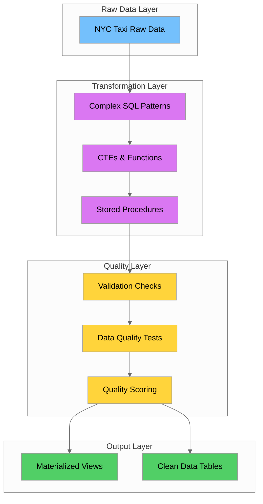
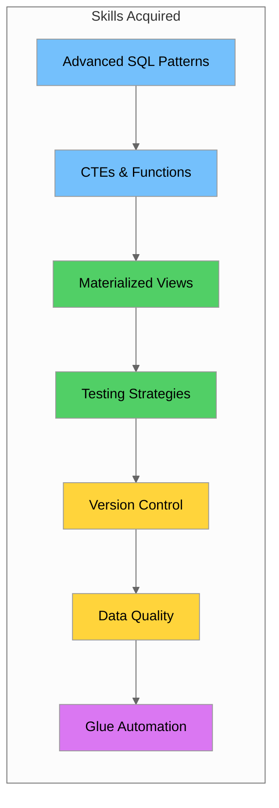

# Day 12-13: Advanced SQL Transformations & Data Quality

## Table of Contents
1. [Introduction](#introduction)
2. [Learning Objectives](#learning-objectives)
3. [Complex SQL Patterns for Data Transformations](#complex-sql-patterns-for-data-transformations)
4. [CTEs (Common Table Expressions) for Modularity](#ctes-common-table-expressions-for-modularity)
5. [SQL Functions and Stored Procedures](#sql-functions-and-stored-procedures)
6. [Materialized Views for Performance](#materialized-views-for-performance)
7. [SQL Testing Strategies](#sql-testing-strategies)
8. [Version Controlling SQL Scripts](#version-controlling-sql-scripts)
9. [Data Validation Patterns in SQL](#data-validation-patterns-in-sql)
10. [Implementing Data Quality Checks](#implementing-data-quality-checks)
11. [Creating Reusable SQL Quality Functions](#creating-reusable-sql-quality-functions)
12. [Scheduling SQL Transformations with Glue](#scheduling-sql-transformations-with-glue)
13. [Documenting SQL Transformations](#documenting-sql-transformations)
14. [Hands-on Labs](#hands-on-labs)
15. [Summary](#summary)
16. [Additional Resources](#additional-resources)

---

## Introduction

Welcome to Days 12-13 of the Data Engineering training program! Over these two days, you'll master advanced SQL transformations and data quality techniques essential for building robust data pipelines. We'll use the NYC Yellow Taxi Trip dataset to demonstrate real-world applications of these concepts.

Data quality is the foundation of trustworthy analytics. As a data engineer, you'll spend significant time ensuring data is accurate, complete, and consistent. This tutorial covers the SQL patterns, testing strategies, and quality frameworks you need to build production-grade data transformations.



---

## Learning Objectives

By the end of Days 12-13, you will be able to:

| Objective | Description |
|-----------|-------------|
| **Master Advanced SQL** | Write complex queries using advanced JOINs, CTEs, and window functions |
| **Build Modular SQL** | Create reusable SQL components with CTEs and functions |
| **Implement Quality Checks** | Design and implement comprehensive data quality validation |
| **Test SQL Transformations** | Apply testing strategies to ensure transformation correctness |
| **Version Control SQL** | Manage SQL scripts with proper versioning and migration strategies |
| **Optimize Performance** | Use materialized views and indexing for query optimization |
| **Document Transformations** | Create clear documentation for SQL transformations |
| **Automate with Glue** | Schedule and orchestrate SQL transformations using AWS Glue |

---

## Complex SQL Patterns for Data Transformations

### Advanced JOIN Patterns

Understanding advanced JOIN patterns is crucial for complex data transformations.

#### Self-Joins

```sql
-- Find trips that started from the same location within 5 minutes of each other
SELECT 
    t1.trip_id AS trip_1,
    t2.trip_id AS trip_2,
    t1.PULocationID,
    t1.tpep_pickup_datetime AS pickup_1,
    t2.tpep_pickup_datetime AS pickup_2
FROM yellow_taxi_trips t1
INNER JOIN yellow_taxi_trips t2 
    ON t1.PULocationID = t2.PULocationID
    AND t1.trip_id < t2.trip_id
    AND ABS(EXTRACT(EPOCH FROM (t1.tpep_pickup_datetime - t2.tpep_pickup_datetime))) <= 300
WHERE t1.tpep_pickup_datetime >= '2025-08-01'
    AND t1.tpep_pickup_datetime < '2025-08-02';
```

#### Anti-Joins

```sql
-- Find pickup locations that never had any dropoffs
SELECT DISTINCT t.PULocationID, z.Zone, z.Borough
FROM yellow_taxi_trips t
LEFT JOIN (
    SELECT DISTINCT DOLocationID FROM yellow_taxi_trips
    WHERE tpep_dropoff_datetime >= '2025-08-01'
) dropoffs ON t.PULocationID = dropoffs.DOLocationID
INNER JOIN taxi_zones z ON t.PULocationID = z.LocationID
WHERE dropoffs.DOLocationID IS NULL
    AND t.tpep_pickup_datetime >= '2025-08-01';

-- Alternative using NOT EXISTS
SELECT DISTINCT t.PULocationID, z.Zone, z.Borough
FROM yellow_taxi_trips t
INNER JOIN taxi_zones z ON t.PULocationID = z.LocationID
WHERE t.tpep_pickup_datetime >= '2025-08-01'
    AND NOT EXISTS (
        SELECT 1 FROM yellow_taxi_trips t2 
        WHERE t2.DOLocationID = t.PULocationID
            AND t2.tpep_dropoff_datetime >= '2025-08-01'
    );
```

#### Cross Joins

```sql
-- Generate hourly time slots for a date range
SELECT date_trunc('hour', generate_series) AS hour_slot
FROM generate_series(
    '2025-08-01 00:00:00'::timestamp,
    '2025-08-31 23:00:00'::timestamp,
    '1 hour'::interval
);
```

### Set Operations: UNION, INTERSECT, EXCEPT

```sql
-- UNION: Combine pickup and dropoff locations
SELECT PULocationID AS location_id, 'pickup' AS location_type
FROM yellow_taxi_trips WHERE tpep_pickup_datetime >= '2025-08-01'
UNION
SELECT DOLocationID AS location_id, 'dropoff' AS location_type
FROM yellow_taxi_trips WHERE tpep_dropoff_datetime >= '2025-08-01';

-- INTERSECT: Find locations that serve as both pickup AND dropoff
SELECT DISTINCT PULocationID AS location_id
FROM yellow_taxi_trips WHERE tpep_pickup_datetime >= '2025-08-01'
INTERSECT
SELECT DISTINCT DOLocationID AS location_id
FROM yellow_taxi_trips WHERE tpep_dropoff_datetime >= '2025-08-01';

-- EXCEPT: Find pickup-only locations
SELECT DISTINCT PULocationID AS location_id
FROM yellow_taxi_trips WHERE tpep_pickup_datetime >= '2025-08-01'
EXCEPT
SELECT DISTINCT DOLocationID AS location_id
FROM yellow_taxi_trips WHERE tpep_dropoff_datetime >= '2025-08-01';
```

### CASE Expressions and Conditional Logic

```sql
-- Categorize trips by various dimensions
SELECT 
    trip_id,
    trip_distance,
    fare_amount,
    CASE 
        WHEN trip_distance < 1 THEN 'Very Short (<1 mi)'
        WHEN trip_distance < 3 THEN 'Short (1-3 mi)'
        WHEN trip_distance < 10 THEN 'Medium (3-10 mi)'
        ELSE 'Long (>10 mi)'
    END AS distance_category,
    CASE 
        WHEN EXTRACT(HOUR FROM tpep_pickup_datetime) BETWEEN 6 AND 9 THEN 'Morning Rush'
        WHEN EXTRACT(HOUR FROM tpep_pickup_datetime) BETWEEN 16 AND 19 THEN 'Evening Rush'
        ELSE 'Off-Peak'
    END AS time_period
FROM yellow_taxi_trips
WHERE tpep_pickup_datetime >= '2025-08-01';
```

### Summary: JOIN Pattern Selection

| Pattern | Use Case | Performance Consideration |
|---------|----------|---------------------------|
| **Self-Join** | Compare rows within same table | Index on join columns essential |
| **Anti-Join (NOT EXISTS)** | Find non-matching rows | Often faster with proper indexes |
| **Cross Join** | Generate combinations | Limit result set size |
| **UNION** | Combine result sets | Removes duplicates (use UNION ALL if not needed) |
| **INTERSECT** | Find common rows | Both sets must have same columns |
| **EXCEPT** | Find differences | Order matters |

---

## CTEs (Common Table Expressions) for Modularity

### Basic CTE Syntax

```sql
WITH daily_stats AS (
    SELECT 
        DATE(tpep_pickup_datetime) AS trip_date,
        COUNT(*) AS total_trips,
        SUM(fare_amount) AS total_fare,
        AVG(trip_distance) AS avg_distance
    FROM yellow_taxi_trips
    WHERE tpep_pickup_datetime >= '2025-08-01'
    GROUP BY DATE(tpep_pickup_datetime)
)
SELECT 
    trip_date,
    total_trips,
    total_fare,
    total_fare / NULLIF(total_trips, 0) AS avg_fare_per_trip
FROM daily_stats
ORDER BY trip_date;
```

### Multiple CTEs in a Single Query

```sql
WITH 
hourly_trips AS (
    SELECT 
        DATE(tpep_pickup_datetime) AS trip_date,
        EXTRACT(HOUR FROM tpep_pickup_datetime) AS hour,
        COUNT(*) AS trip_count
    FROM yellow_taxi_trips
    WHERE tpep_pickup_datetime >= '2025-08-01'
    GROUP BY DATE(tpep_pickup_datetime), EXTRACT(HOUR FROM tpep_pickup_datetime)
),
daily_totals AS (
    SELECT trip_date, SUM(trip_count) AS daily_trips
    FROM hourly_trips
    GROUP BY trip_date
),
peak_hours AS (
    SELECT DISTINCT ON (trip_date)
        trip_date, hour AS peak_hour, trip_count AS peak_hour_trips
    FROM hourly_trips
    ORDER BY trip_date, trip_count DESC
)
SELECT 
    dt.trip_date,
    dt.daily_trips,
    ph.peak_hour,
    ph.peak_hour_trips
FROM daily_totals dt
INNER JOIN peak_hours ph ON dt.trip_date = ph.trip_date
ORDER BY dt.trip_date;
```

### Recursive CTEs

```sql
-- Generate a date series using recursive CTE
WITH RECURSIVE date_series AS (
    SELECT DATE '2025-08-01' AS date_value
    UNION ALL
    SELECT date_value + INTERVAL '1 day'
    FROM date_series
    WHERE date_value < DATE '2025-08-31'
)
SELECT date_value FROM date_series;
```

### CTE vs Subquery Performance

| Aspect | CTE | Subquery |
|--------|-----|----------|
| **Readability** | Better for complex queries | Can become nested |
| **Reusability** | Can reference multiple times | Must repeat |
| **Optimization** | PostgreSQL may materialize | Optimizer can inline |
| **Recursion** | Supports recursive queries | No recursion support |

---

## SQL Functions and Stored Procedures

### Scalar Functions

```sql
-- Function to calculate fare per mile
CREATE OR REPLACE FUNCTION calculate_fare_per_mile(
    fare NUMERIC,
    distance NUMERIC
) RETURNS NUMERIC AS $$
BEGIN
    IF distance IS NULL OR distance <= 0 THEN
        RETURN NULL;
    END IF;
    RETURN ROUND(fare / distance, 2);
END;
$$ LANGUAGE plpgsql IMMUTABLE;

-- Usage
SELECT trip_id, fare_amount, trip_distance,
    calculate_fare_per_mile(fare_amount, trip_distance) AS fare_per_mile
FROM yellow_taxi_trips LIMIT 10;

-- Function to categorize trip distance
CREATE OR REPLACE FUNCTION categorize_distance(distance NUMERIC) RETURNS TEXT AS $$
BEGIN
    RETURN CASE 
        WHEN distance IS NULL THEN 'Unknown'
        WHEN distance < 1 THEN 'Very Short'
        WHEN distance < 3 THEN 'Short'
        WHEN distance < 10 THEN 'Medium'
        ELSE 'Long'
    END;
END;
$$ LANGUAGE plpgsql IMMUTABLE;
```

### Table-Valued Functions

```sql
-- Function to get trip statistics for a date range
CREATE OR REPLACE FUNCTION get_trip_statistics(start_date DATE, end_date DATE)
RETURNS TABLE (
    trip_date DATE,
    total_trips BIGINT,
    total_fare NUMERIC,
    avg_distance NUMERIC
) AS $$
BEGIN
    RETURN QUERY
    SELECT 
        DATE(tpep_pickup_datetime),
        COUNT(*),
        SUM(fare_amount),
        ROUND(AVG(trip_distance), 2)
    FROM yellow_taxi_trips
    WHERE tpep_pickup_datetime >= start_date
        AND tpep_pickup_datetime < end_date + INTERVAL '1 day'
    GROUP BY DATE(tpep_pickup_datetime)
    ORDER BY DATE(tpep_pickup_datetime);
END;
$$ LANGUAGE plpgsql;

-- Usage
SELECT * FROM get_trip_statistics('2025-08-01', '2025-08-07');
```

### Stored Procedures

```sql
-- Procedure to archive old trips
CREATE OR REPLACE PROCEDURE archive_old_trips(cutoff_date DATE, batch_size INTEGER DEFAULT 10000)
LANGUAGE plpgsql AS $$
DECLARE
    rows_moved INTEGER := 0;
    total_moved INTEGER := 0;
BEGIN
    CREATE TABLE IF NOT EXISTS yellow_taxi_trips_archive (LIKE yellow_taxi_trips INCLUDING ALL);
    
    LOOP
        WITH moved AS (
            DELETE FROM yellow_taxi_trips
            WHERE trip_id IN (
                SELECT trip_id FROM yellow_taxi_trips
                WHERE tpep_pickup_datetime < cutoff_date LIMIT batch_size
            )
            RETURNING *
        )
        INSERT INTO yellow_taxi_trips_archive SELECT * FROM moved;
        
        GET DIAGNOSTICS rows_moved = ROW_COUNT;
        total_moved := total_moved + rows_moved;
        
        EXIT WHEN rows_moved = 0;
        COMMIT;
    END LOOP;
    
    RAISE NOTICE 'Archive complete. Total rows moved: %', total_moved;
END;
$$;
```

### Error Handling

```sql
-- Procedure with error handling
CREATE OR REPLACE PROCEDURE process_daily_aggregation(process_date DATE)
LANGUAGE plpgsql AS $$
DECLARE
    v_row_count INTEGER;
    v_error_message TEXT;
BEGIN
    BEGIN
        DELETE FROM daily_trip_summary WHERE trip_date = process_date;
        
        INSERT INTO daily_trip_summary (trip_date, total_trips, total_fare)
        SELECT DATE(tpep_pickup_datetime), COUNT(*), SUM(fare_amount)
        FROM yellow_taxi_trips
        WHERE DATE(tpep_pickup_datetime) = process_date;
        
        GET DIAGNOSTICS v_row_count = ROW_COUNT;
        RAISE NOTICE 'Processed % rows for %', v_row_count, process_date;
        
    EXCEPTION WHEN OTHERS THEN
        GET STACKED DIAGNOSTICS v_error_message = MESSAGE_TEXT;
        RAISE EXCEPTION 'Failed: %', v_error_message;
    END;
END;
$$;
```

### Function Types Summary

| Function Type | Returns | Use Case | Example |
|---------------|---------|----------|---------|
| **Scalar** | Single value | Calculations | `calculate_fare_per_mile()` |
| **Table-Valued** | Set of rows | Reports | `get_trip_statistics()` |
| **Procedure** | Nothing | ETL operations | `archive_old_trips()` |

---

## Materialized Views for Performance

### Creating Materialized Views

```sql
-- Daily statistics materialized view
CREATE MATERIALIZED VIEW mv_daily_trip_stats AS
SELECT 
    DATE(tpep_pickup_datetime) AS trip_date,
    COUNT(*) AS total_trips,
    SUM(fare_amount) AS total_fare,
    AVG(trip_distance) AS avg_distance,
    AVG(fare_amount) AS avg_fare
FROM yellow_taxi_trips
GROUP BY DATE(tpep_pickup_datetime)
WITH DATA;

CREATE UNIQUE INDEX idx_mv_daily_stats_date ON mv_daily_trip_stats(trip_date);

-- Hourly patterns materialized view
CREATE MATERIALIZED VIEW mv_hourly_patterns AS
SELECT 
    EXTRACT(DOW FROM tpep_pickup_datetime) AS day_of_week,
    EXTRACT(HOUR FROM tpep_pickup_datetime) AS hour_of_day,
    COUNT(*) AS trip_count,
    AVG(fare_amount) AS avg_fare
FROM yellow_taxi_trips
GROUP BY EXTRACT(DOW FROM tpep_pickup_datetime), EXTRACT(HOUR FROM tpep_pickup_datetime)
WITH DATA;

-- Location analytics materialized view
CREATE MATERIALIZED VIEW mv_location_analytics AS
SELECT 
    t.PULocationID,
    z.Zone AS pickup_zone,
    z.Borough AS pickup_borough,
    COUNT(*) AS pickup_count,
    SUM(t.fare_amount) AS total_fare,
    AVG(t.fare_amount) AS avg_fare
FROM yellow_taxi_trips t
INNER JOIN taxi_zones z ON t.PULocationID = z.LocationID
GROUP BY t.PULocationID, z.Zone, z.Borough
WITH DATA;

CREATE UNIQUE INDEX idx_mv_location_id ON mv_location_analytics(PULocationID);
```

### Refreshing Materialized Views

```sql
-- Full refresh
REFRESH MATERIALIZED VIEW mv_daily_trip_stats;

-- Concurrent refresh (requires unique index)
REFRESH MATERIALIZED VIEW CONCURRENTLY mv_daily_trip_stats;

-- Procedure to refresh all materialized views
CREATE OR REPLACE PROCEDURE refresh_all_materialized_views()
LANGUAGE plpgsql AS $$
DECLARE
    v_view_name TEXT;
BEGIN
    FOR v_view_name IN 
        SELECT matviewname FROM pg_matviews WHERE schemaname = 'public'
    LOOP
        EXECUTE format('REFRESH MATERIALIZED VIEW CONCURRENTLY %I', v_view_name);
        RAISE NOTICE 'Refreshed %', v_view_name;
    END LOOP;
END;
$$;
```

### When to Use Materialized Views

| Aspect | Regular View | Materialized View |
|--------|--------------|-------------------|
| **Storage** | No storage | Stores query results |
| **Performance** | Executes each time | Pre-computed |
| **Data Freshness** | Always current | Stale until refreshed |
| **Indexing** | Cannot index | Can create indexes |
| **Use Case** | Simple queries | Complex aggregations |

---

## SQL Testing Strategies

### Unit Testing SQL Transformations

```sql
-- Create test schema
CREATE SCHEMA IF NOT EXISTS test_schema;

-- Test helper function
CREATE OR REPLACE FUNCTION test_schema.assert_equals(
    expected ANYELEMENT, actual ANYELEMENT, test_name TEXT
) RETURNS BOOLEAN AS $$
BEGIN
    IF expected IS DISTINCT FROM actual THEN
        RAISE EXCEPTION 'Test failed: %. Expected: %, Actual: %', test_name, expected, actual;
    END IF;
    RAISE NOTICE 'Test passed: %', test_name;
    RETURN TRUE;
END;
$$ LANGUAGE plpgsql;

-- Test the calculate_fare_per_mile function
DO $$
BEGIN
    PERFORM test_schema.assert_equals(2.50::NUMERIC, calculate_fare_per_mile(25.00, 10.0),
        'fare_per_mile: normal calculation');
    PERFORM test_schema.assert_equals(NULL::NUMERIC, calculate_fare_per_mile(25.00, 0),
        'fare_per_mile: zero distance returns NULL');
    RAISE NOTICE 'All tests passed!';
END;
$$;
```

### Data Validation Tests

```sql
-- Test results table
CREATE TABLE IF NOT EXISTS test_schema.test_results (
    test_id SERIAL PRIMARY KEY,
    test_suite VARCHAR(100),
    test_name VARCHAR(200),
    status VARCHAR(20),
    message TEXT,
    executed_at TIMESTAMP DEFAULT NOW()
);

-- Data validation test suite
CREATE OR REPLACE PROCEDURE test_schema.run_data_validation_tests()
LANGUAGE plpgsql AS $$
DECLARE
    v_count INTEGER;
BEGIN
    DELETE FROM test_schema.test_results WHERE test_suite = 'data_validation';
    
    -- Test: No null pickup times
    SELECT COUNT(*) INTO v_count FROM yellow_taxi_trips WHERE tpep_pickup_datetime IS NULL;
    INSERT INTO test_schema.test_results (test_suite, test_name, status, message)
    VALUES ('data_validation', 'no_null_pickup_times',
        CASE WHEN v_count = 0 THEN 'PASS' ELSE 'FAIL' END,
        format('Found %s null pickup times', v_count));
    
    -- Test: Pickup before dropoff
    SELECT COUNT(*) INTO v_count FROM yellow_taxi_trips 
    WHERE tpep_dropoff_datetime < tpep_pickup_datetime;
    INSERT INTO test_schema.test_results (test_suite, test_name, status, message)
    VALUES ('data_validation', 'pickup_before_dropoff',
        CASE WHEN v_count = 0 THEN 'PASS' ELSE 'FAIL' END,
        format('Found %s invalid time sequences', v_count));
    
    COMMIT;
END;
$$;

-- Run and view results
CALL test_schema.run_data_validation_tests();
SELECT * FROM test_schema.test_results;
```

### Testing with pgTAP

```sql
-- Example pgTAP test
BEGIN;
SELECT plan(4);

SELECT has_function('public', 'calculate_fare_per_mile', ARRAY['numeric', 'numeric'],
    'Function should exist');
SELECT is(calculate_fare_per_mile(25.00, 10.0), 2.50::NUMERIC, 'Normal calculation');
SELECT is(calculate_fare_per_mile(25.00, 0), NULL::NUMERIC, 'Zero distance returns NULL');
SELECT has_table('public', 'yellow_taxi_trips', 'Table should exist');

SELECT * FROM finish();
ROLLBACK;
```

---

## Version Controlling SQL Scripts

### SQL File Organization

```
sql/
├── migrations/
│   ├── V001__create_taxi_tables.sql
│   ├── V002__add_indexes.sql
│   └── V003__create_functions.sql
├── functions/
│   ├── calculate_fare_per_mile.sql
│   └── get_trip_statistics.sql
├── procedures/
│   └── archive_old_trips.sql
├── views/
│   └── mv_daily_trip_stats.sql
├── tests/
│   └── test_functions.sql
└── seeds/
    └── taxi_zones.sql
```

### Migration Scripts

```sql
-- V001__create_taxi_tables.sql
CREATE TABLE IF NOT EXISTS yellow_taxi_trips (
    trip_id BIGSERIAL PRIMARY KEY,
    tpep_pickup_datetime TIMESTAMP NOT NULL,
    tpep_dropoff_datetime TIMESTAMP NOT NULL,
    passenger_count INTEGER,
    trip_distance NUMERIC(10,2),
    PULocationID INTEGER NOT NULL,
    DOLocationID INTEGER NOT NULL,
    fare_amount NUMERIC(10,2),
    total_amount NUMERIC(10,2),
    created_at TIMESTAMP DEFAULT NOW()
);

-- V002__add_indexes.sql
CREATE INDEX IF NOT EXISTS idx_trips_pickup_datetime ON yellow_taxi_trips(tpep_pickup_datetime);
CREATE INDEX IF NOT EXISTS idx_trips_pickup_location ON yellow_taxi_trips(PULocationID);
```

### Schema Change Management

```sql
-- Schema version tracking
CREATE TABLE IF NOT EXISTS schema_migrations (
    version VARCHAR(50) PRIMARY KEY,
    description TEXT,
    script_name VARCHAR(200) NOT NULL,
    applied_at TIMESTAMP DEFAULT NOW()
);

-- Apply migration function
CREATE OR REPLACE FUNCTION apply_migration(
    p_version VARCHAR(50), p_description TEXT, p_script_name VARCHAR(200), p_sql TEXT
) RETURNS VOID AS $$
BEGIN
    IF EXISTS (SELECT 1 FROM schema_migrations WHERE version = p_version) THEN
        RAISE NOTICE 'Migration % already applied', p_version;
        RETURN;
    END IF;
    
    EXECUTE p_sql;
    INSERT INTO schema_migrations (version, description, script_name)
    VALUES (p_version, p_description, p_script_name);
    RAISE NOTICE 'Applied migration %', p_version;
END;
$$ LANGUAGE plpgsql;
```

### Flyway Commands

```bash
flyway migrate          # Apply pending migrations
flyway info             # Show migration status
flyway validate         # Validate applied migrations
flyway repair           # Repair migration history
```

---

## Data Validation Patterns in SQL

### Constraint-Based Validation

```sql
-- Add constraints
ALTER TABLE yellow_taxi_trips
ADD CONSTRAINT chk_positive_fare CHECK (fare_amount >= 0),
ADD CONSTRAINT chk_positive_distance CHECK (trip_distance >= 0),
ADD CONSTRAINT chk_valid_passenger_count CHECK (passenger_count >= 0 AND passenger_count <= 9),
ADD CONSTRAINT chk_pickup_before_dropoff CHECK (tpep_dropoff_datetime >= tpep_pickup_datetime);

-- Foreign key constraints
ALTER TABLE yellow_taxi_trips
ADD CONSTRAINT fk_pickup_location FOREIGN KEY (PULocationID) REFERENCES taxi_zones(LocationID),
ADD CONSTRAINT fk_dropoff_location FOREIGN KEY (DOLocationID) REFERENCES taxi_zones(LocationID);
```

### Validation Triggers

```sql
-- Trigger for complex validation
CREATE OR REPLACE FUNCTION validate_trip_insert() RETURNS TRIGGER AS $$
BEGIN
    IF EXTRACT(EPOCH FROM (NEW.tpep_dropoff_datetime - NEW.tpep_pickup_datetime)) > 86400 THEN
        RAISE EXCEPTION 'Trip duration exceeds 24 hours';
    END IF;
    
    IF NEW.trip_distance > 0 AND NEW.fare_amount / NEW.trip_distance > 100 THEN
        RAISE WARNING 'Unusually high fare per mile: %', NEW.fare_amount / NEW.trip_distance;
    END IF;
    
    NEW.created_at := COALESCE(NEW.created_at, NOW());
    RETURN NEW;
END;
$$ LANGUAGE plpgsql;

CREATE TRIGGER trg_validate_trip
    BEFORE INSERT OR UPDATE ON yellow_taxi_trips
    FOR EACH ROW EXECUTE FUNCTION validate_trip_insert();
```

### Data Profiling

```sql
-- Comprehensive data profiling
WITH profile AS (
    SELECT
        COUNT(*) AS total_rows,
        COUNT(DISTINCT trip_id) AS unique_trips,
        COUNT(*) - COUNT(fare_amount) AS null_fares,
        MIN(fare_amount) AS min_fare,
        MAX(fare_amount) AS max_fare,
        AVG(fare_amount) AS avg_fare,
        COUNT(*) FILTER (WHERE fare_amount < 0) AS negative_fares,
        COUNT(*) FILTER (WHERE tpep_dropoff_datetime < tpep_pickup_datetime) AS invalid_times
    FROM yellow_taxi_trips
)
SELECT * FROM profile;
```

---

## Implementing Data Quality Checks

### Completeness Checks

```sql
-- Check completeness across columns
CREATE OR REPLACE FUNCTION check_completeness(table_name TEXT)
RETURNS TABLE (column_name TEXT, total_rows BIGINT, null_count BIGINT, completeness_pct NUMERIC) AS $$
DECLARE
    col RECORD;
    query TEXT;
BEGIN
    FOR col IN 
        SELECT c.column_name FROM information_schema.columns c
        WHERE c.table_name = check_completeness.table_name AND c.table_schema = 'public'
    LOOP
        query := format(
            'SELECT %L, COUNT(*), COUNT(*) - COUNT(%I), ROUND(100.0 * COUNT(%I) / NULLIF(COUNT(*), 0), 2) FROM %I',
            col.column_name, col.column_name, col.column_name, table_name
        );
        RETURN QUERY EXECUTE query;
    END LOOP;
END;
$$ LANGUAGE plpgsql;

-- Usage
SELECT * FROM check_completeness('yellow_taxi_trips');
```

### Uniqueness Validation

```sql
-- Check for duplicates
CREATE OR REPLACE FUNCTION check_uniqueness(table_name TEXT, key_columns TEXT[])
RETURNS TABLE (duplicate_count BIGINT, sample_keys TEXT) AS $$
DECLARE
    key_list TEXT;
BEGIN
    key_list := array_to_string(key_columns, ', ');
    RETURN QUERY EXECUTE format(
        'WITH duplicates AS (
            SELECT %s, COUNT(*) as cnt FROM %I GROUP BY %s HAVING COUNT(*) > 1
        )
        SELECT SUM(cnt - 1), string_agg((%s)::text, '', '' LIMIT 5) FROM duplicates',
        key_list, table_name, key_list, key_list
    );
END;
$$ LANGUAGE plpgsql;

-- Usage
SELECT * FROM check_uniqueness('yellow_taxi_trips', ARRAY['trip_id']);
```

### Business Rule Validation

```sql
-- Validate business rules
CREATE OR REPLACE FUNCTION validate_business_rules(check_date DATE)
RETURNS TABLE (rule_name TEXT, violations BIGINT, sample_ids TEXT) AS $$
BEGIN
    -- Rule 1: Positive fare for completed trips
    RETURN QUERY
    SELECT 'positive_fare'::TEXT, COUNT(*)::BIGINT,
        string_agg(trip_id::TEXT, ',' ORDER BY trip_id LIMIT 5)
    FROM yellow_taxi_trips
    WHERE DATE(tpep_pickup_datetime) = check_date AND fare_amount <= 0 AND trip_distance > 0;
    
    -- Rule 2: Valid passenger count
    RETURN QUERY
    SELECT 'valid_passengers'::TEXT, COUNT(*)::BIGINT,
        string_agg(trip_id::TEXT, ',' ORDER BY trip_id LIMIT 5)
    FROM yellow_taxi_trips
    WHERE DATE(tpep_pickup_datetime) = check_date AND (passenger_count <= 0 OR passenger_count > 6);
END;
$$ LANGUAGE plpgsql;

-- Usage
SELECT * FROM validate_business_rules('2025-08-01');
```

---

## Creating Reusable SQL Quality Functions

### Generic Validation Functions

```sql
-- Generic null check
CREATE OR REPLACE FUNCTION dq_check_nulls(
    p_table_name TEXT, p_column_name TEXT, p_threshold_pct NUMERIC DEFAULT 0
) RETURNS TABLE (check_name TEXT, status TEXT, null_count BIGINT, total_count BIGINT, null_pct NUMERIC) AS $$
DECLARE
    v_null_count BIGINT;
    v_total_count BIGINT;
    v_null_pct NUMERIC;
BEGIN
    EXECUTE format('SELECT COUNT(*) - COUNT(%I), COUNT(*) FROM %I',
        p_column_name, p_table_name) INTO v_null_count, v_total_count;
    
    v_null_pct := ROUND(100.0 * v_null_count / NULLIF(v_total_count, 0), 2);
    
    RETURN QUERY SELECT
        format('null_check_%s.%s', p_table_name, p_column_name),
        CASE WHEN v_null_pct <= p_threshold_pct THEN 'PASS' ELSE 'FAIL' END,
        v_null_count, v_total_count, v_null_pct;
END;
$$ LANGUAGE plpgsql;

-- Usage
SELECT * FROM dq_check_nulls('yellow_taxi_trips', 'fare_amount', 1.0);
```

### Quality Scoring Functions

```sql
-- Calculate overall data quality score
CREATE OR REPLACE FUNCTION calculate_quality_score(p_table_name TEXT)
RETURNS TABLE (dimension TEXT, score NUMERIC, weight NUMERIC, weighted_score NUMERIC) AS $$
BEGIN
    RETURN QUERY VALUES
        ('Completeness'::TEXT, 95.0::NUMERIC, 0.4::NUMERIC, 95.0 * 0.4),
        ('Validity'::TEXT, 98.0::NUMERIC, 0.35::NUMERIC, 98.0 * 0.35),
        ('Uniqueness'::TEXT, 100.0::NUMERIC, 0.25::NUMERIC, 100.0 * 0.25);
END;
$$ LANGUAGE plpgsql;

-- Usage with total
SELECT dimension, score, weight, weighted_score
FROM calculate_quality_score('yellow_taxi_trips')
UNION ALL
SELECT 'TOTAL', NULL, 1.0, SUM(weighted_score)
FROM calculate_quality_score('yellow_taxi_trips');
```

### Audit Logging Functions

```sql
-- Create audit log table
CREATE TABLE IF NOT EXISTS dq_audit_log (
    audit_id SERIAL PRIMARY KEY,
    check_date DATE NOT NULL,
    table_name VARCHAR(100) NOT NULL,
    check_type VARCHAR(50) NOT NULL,
    check_name VARCHAR(200) NOT NULL,
    status VARCHAR(20) NOT NULL,
    metric_value NUMERIC,
    details JSONB,
    created_at TIMESTAMP DEFAULT NOW()
);

-- Function to log quality check results
CREATE OR REPLACE FUNCTION log_quality_check(
    p_check_date DATE, p_table_name TEXT, p_check_type TEXT,
    p_check_name TEXT, p_status TEXT, p_metric_value NUMERIC DEFAULT NULL
) RETURNS VOID AS $$
BEGIN
    INSERT INTO dq_audit_log (check_date, table_name, check_type, check_name, status, metric_value)
    VALUES (p_check_date, p_table_name, p_check_type, p_check_name, p_status, p_metric_value);
END;
$$ LANGUAGE plpgsql;
```

---

## Scheduling SQL Transformations with Glue

### Glue Jobs for SQL Execution

```python
# glue_sql_job.py - AWS Glue job for SQL transformations
import sys
from awsglue.utils import getResolvedOptions
import pg8000

args = getResolvedOptions(sys.argv, ['JOB_NAME', 'db_host', 'db_name', 'db_user', 'db_password', 'process_date'])

def execute_sql(connection, sql):
    cursor = connection.cursor()
    cursor.execute(sql)
    connection.commit()
    return cursor

def run_daily_aggregation(process_date):
    conn = pg8000.connect(
        host=args['db_host'],
        database=args['db_name'],
        user=args['db_user'],
        password=args['db_password']
    )
    
    try:
        execute_sql(conn, f"CALL process_daily_aggregation('{process_date}')")
        print(f"Successfully processed aggregation for {process_date}")
        
        execute_sql(conn, "CALL refresh_all_materialized_views()")
        print("Successfully refreshed materialized views")
    except Exception as e:
        print(f"Error: {str(e)}")
        raise
    finally:
        conn.close()

run_daily_aggregation(args['process_date'])
```

### AWS CLI Commands for Glue

```bash
# Create a Glue job
aws glue create-job \
    --name "taxi-daily-aggregation" \
    --role "arn:aws:iam::123456789012:role/GlueServiceRole" \
    --command '{
        "Name": "pythonshell",
        "ScriptLocation": "s3://my-bucket/scripts/glue_sql_job.py",
        "PythonVersion": "3"
    }' \
    --default-arguments '{
        "--db_host": "taxi-db.cluster-xxx.us-east-1.rds.amazonaws.com",
        "--db_name": "taxi_analytics",
        "--db_user": "glue_user"
    }'

# Start a job run
aws glue start-job-run \
    --job-name "taxi-daily-aggregation" \
    --arguments '{"--process_date": "2025-08-01"}'

# Create a schedule trigger
aws glue create-trigger \
    --name "daily-aggregation-trigger" \
    --type SCHEDULED \
    --schedule "cron(0 6 * * ? *)" \
    --actions '[{"JobName": "taxi-daily-aggregation"}]' \
    --start-on-creation

# Check job status
aws glue get-job-runs --job-name "taxi-daily-aggregation" --max-results 5
```

---

## Documenting SQL Transformations

### Inline Documentation Standards

```sql
/*
 * Function: calculate_fare_per_mile
 *
 * Description:
 *   Calculates the fare per mile for a taxi trip, handling edge cases.
 *
 * Parameters:
 *   @fare     NUMERIC - The total fare amount in dollars
 *   @distance NUMERIC - The trip distance in miles
 *
 * Returns:
 *   NUMERIC - The fare per mile, rounded to 2 decimal places
 *            Returns NULL if distance is zero, negative, or null
 *
 * Example:
 *   SELECT calculate_fare_per_mile(25.00, 10.0);  -- Returns 2.50
 *
 * Author: Data Engineering Team
 * Created: 2025-08-01
 */
CREATE OR REPLACE FUNCTION calculate_fare_per_mile(fare NUMERIC, distance NUMERIC)
RETURNS NUMERIC AS $$
BEGIN
    IF distance IS NULL OR distance <= 0 THEN RETURN NULL; END IF;
    RETURN ROUND(fare / distance, 2);
END;
$$ LANGUAGE plpgsql IMMUTABLE;
```

### Data Dictionary

```sql
-- Create a data dictionary table
CREATE TABLE IF NOT EXISTS data_dictionary (
    dict_id SERIAL PRIMARY KEY,
    schema_name VARCHAR(100) NOT NULL,
    table_name VARCHAR(100) NOT NULL,
    column_name VARCHAR(100),
    object_type VARCHAR(50) NOT NULL,
    description TEXT,
    data_type VARCHAR(100),
    created_at TIMESTAMP DEFAULT NOW(),
    UNIQUE(schema_name, table_name, column_name)
);

-- Populate data dictionary
INSERT INTO data_dictionary (schema_name, table_name, column_name, object_type, description, data_type)
VALUES
    ('public', 'yellow_taxi_trips', NULL, 'table', 'NYC Yellow Taxi trip records', NULL),
    ('public', 'yellow_taxi_trips', 'trip_id', 'column', 'Unique trip identifier', 'BIGSERIAL'),
    ('public', 'yellow_taxi_trips', 'fare_amount', 'column', 'Base fare in dollars', 'NUMERIC(10,2)'),
    ('public', 'yellow_taxi_trips', 'trip_distance', 'column', 'Trip distance in miles', 'NUMERIC(10,2)');
```

### Transformation Lineage

```sql
-- Create transformation lineage table
CREATE TABLE IF NOT EXISTS transformation_lineage (
    lineage_id SERIAL PRIMARY KEY,
    target_table VARCHAR(100) NOT NULL,
    target_column VARCHAR(100),
    source_tables TEXT[] NOT NULL,
    transformation_logic TEXT NOT NULL,
    description TEXT,
    created_at TIMESTAMP DEFAULT NOW()
);

-- Document lineage
INSERT INTO transformation_lineage (target_table, target_column, source_tables, transformation_logic, description)
VALUES
    ('mv_daily_trip_stats', 'total_trips', ARRAY['yellow_taxi_trips'],
     'COUNT(*) GROUP BY DATE(tpep_pickup_datetime)', 'Daily count of all trips'),
    ('mv_daily_trip_stats', 'avg_fare', ARRAY['yellow_taxi_trips'],
     'AVG(fare_amount) GROUP BY DATE(tpep_pickup_datetime)', 'Average fare per day');
```

---

## Hands-on Labs

### Lab 1: Create Modular SQL Transformation Scripts

**Objective**: Build a modular SQL transformation pipeline for NYC taxi data.

**Tasks**:
1. Create a CTE-based query that calculates daily, weekly, and monthly statistics
2. Implement a stored procedure for incremental data processing
3. Create helper functions for common calculations

```sql
-- Lab 1 Solution Template
-- Step 1: Create helper function
CREATE OR REPLACE FUNCTION lab_categorize_trip(distance NUMERIC, fare NUMERIC)
RETURNS TEXT AS $$
BEGIN
    RETURN CASE
        WHEN distance < 2 AND fare < 10 THEN 'Short-Cheap'
        WHEN distance < 2 AND fare >= 10 THEN 'Short-Expensive'
        WHEN distance >= 2 AND fare < 20 THEN 'Long-Cheap'
        ELSE 'Long-Expensive'
    END;
END;
$$ LANGUAGE plpgsql IMMUTABLE;

-- Step 2: Create modular CTE query
WITH daily_metrics AS (
    SELECT DATE(tpep_pickup_datetime) AS trip_date, COUNT(*) AS trips, SUM(fare_amount) AS revenue
    FROM yellow_taxi_trips WHERE tpep_pickup_datetime >= '2025-08-01'
    GROUP BY DATE(tpep_pickup_datetime)
),
weekly_metrics AS (
    SELECT DATE_TRUNC('week', trip_date) AS week_start, SUM(trips) AS weekly_trips, SUM(revenue) AS weekly_revenue
    FROM daily_metrics GROUP BY DATE_TRUNC('week', trip_date)
)
SELECT * FROM weekly_metrics ORDER BY week_start;
```

### Lab 2: Build Data Quality Validation Queries

**Objective**: Implement comprehensive data quality checks.

**Tasks**:
1. Create completeness checks for all required columns
2. Implement validity checks for business rules
3. Build a quality scoring function

```sql
-- Lab 2 Solution Template
CREATE OR REPLACE PROCEDURE lab_run_quality_checks(check_date DATE)
LANGUAGE plpgsql AS $$
DECLARE
    v_total_rows BIGINT;
    v_null_count BIGINT;
    v_invalid_count BIGINT;
BEGIN
    SELECT COUNT(*) INTO v_total_rows FROM yellow_taxi_trips
    WHERE DATE(tpep_pickup_datetime) = check_date;
    
    SELECT COUNT(*) INTO v_null_count FROM yellow_taxi_trips
    WHERE DATE(tpep_pickup_datetime) = check_date
        AND (fare_amount IS NULL OR trip_distance IS NULL);
    
    SELECT COUNT(*) INTO v_invalid_count FROM yellow_taxi_trips
    WHERE DATE(tpep_pickup_datetime) = check_date
        AND (fare_amount < 0 OR trip_distance < 0);
    
    RAISE NOTICE 'Date: %, Total: %, Nulls: %, Invalid: %',
        check_date, v_total_rows, v_null_count, v_invalid_count;
END;
$$;

CALL lab_run_quality_checks('2025-08-01');
```

### Lab 3: Implement SQL-Based Tests

**Objective**: Create a test suite for SQL transformations.

```sql
-- Lab 3 Solution Template
CREATE OR REPLACE PROCEDURE lab_run_test_suite()
LANGUAGE plpgsql AS $$
DECLARE
    v_passed INTEGER := 0;
    v_failed INTEGER := 0;
BEGIN
    IF calculate_fare_per_mile(25.00, 10.0) = 2.50 THEN
        v_passed := v_passed + 1;
        RAISE NOTICE 'PASS: fare_per_mile normal case';
    ELSE
        v_failed := v_failed + 1;
        RAISE NOTICE 'FAIL: fare_per_mile normal case';
    END IF;
    
    IF calculate_fare_per_mile(25.00, 0) IS NULL THEN
        v_passed := v_passed + 1;
        RAISE NOTICE 'PASS: fare_per_mile zero distance';
    ELSE
        v_failed := v_failed + 1;
        RAISE NOTICE 'FAIL: fare_per_mile zero distance';
    END IF;
    
    RAISE NOTICE '=== Test Summary: Passed: %, Failed: % ===', v_passed, v_failed;
END;
$$;

CALL lab_run_test_suite();
```

### Lab 4: Create Documentation for Transformations

**Objective**: Document SQL transformations following best practices.

### Lab 5: Implement SQL Workflows in Glue

**Objective**: Schedule and orchestrate SQL transformations using AWS Glue.

### Lab 6: Version Control SQL Scripts in Git

**Objective**: Set up proper version control for SQL scripts.

---

## Summary

In Days 12-13, you've learned essential skills for advanced SQL transformations and data quality:



### Key Takeaways

| Topic | Key Learning |
|-------|--------------|
| **Advanced SQL** | Self-joins, anti-joins, correlated subqueries enable complex transformations |
| **CTEs** | Break complex queries into readable, maintainable components |
| **Functions** | Encapsulate reusable logic for consistency and testing |
| **Materialized Views** | Pre-compute expensive aggregations for performance |
| **Testing** | Unit tests, validation tests, and regression tests ensure quality |
| **Version Control** | Migration scripts and proper organization enable collaboration |
| **Data Quality** | Completeness, validity, and uniqueness checks catch issues early |
| **Automation** | AWS Glue enables scheduled, reliable SQL transformations |

### Best Practices Checklist

- [ ] Use CTEs for complex queries to improve readability
- [ ] Create functions for reusable calculations
- [ ] Implement stored procedures for ETL operations
- [ ] Use materialized views for frequently-accessed aggregations
- [ ] Write tests for all SQL transformations
- [ ] Version control all SQL scripts with proper naming
- [ ] Implement comprehensive data quality checks
- [ ] Document all transformations with inline comments
- [ ] Schedule transformations with proper error handling
- [ ] Monitor and log all data quality metrics

---

## Additional Resources

### Documentation
- [PostgreSQL Documentation](https://www.postgresql.org/docs/)
- [AWS Glue Developer Guide](https://docs.aws.amazon.com/glue/latest/dg/)
- [pgTAP Documentation](https://pgtap.org/documentation.html)
- [Flyway Documentation](https://flywaydb.org/documentation/)

### Books
- "SQL Performance Explained" by Markus Winand
- "The Data Warehouse Toolkit" by Ralph Kimball
- "Fundamentals of Data Engineering" by Joe Reis & Matt Housley

### Online Courses
- PostgreSQL for Data Engineers (Coursera)
- AWS Data Engineering (AWS Skill Builder)
- Advanced SQL for Data Scientists (DataCamp)

### Tools
- [DBeaver](https://dbeaver.io/) - Universal database tool
- [pgAdmin](https://www.pgadmin.org/) - PostgreSQL administration
- [SQLFluff](https://sqlfluff.com/) - SQL linter
- [dbt](https://www.getdbt.com/) - Data transformation tool

### Related Tutorials
- [Day 11: Data Modeling & Schema Design](../day-11/day-11-tutorial.md)
- [Day 9-10: AWS Data Services](../day-9-10/day-9-10-tutorial.md)

---

*Tutorial completed. Continue to Day 14-15 for Data Pipeline Orchestration with Apache Airflow.*