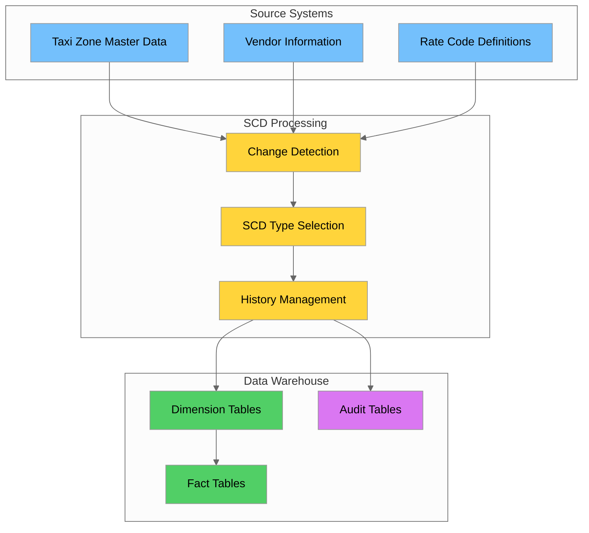
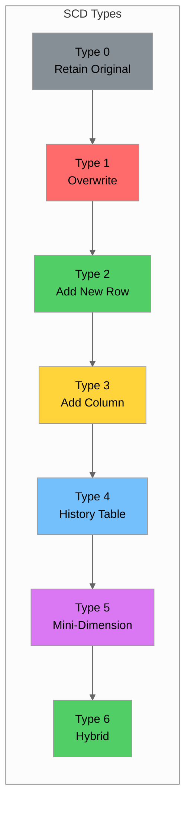
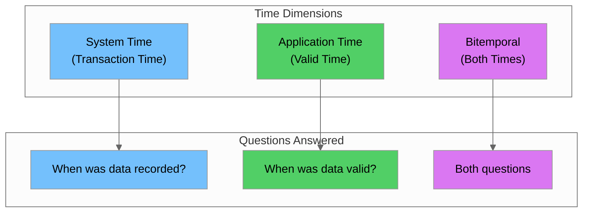
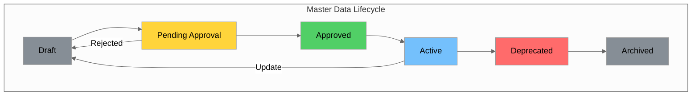
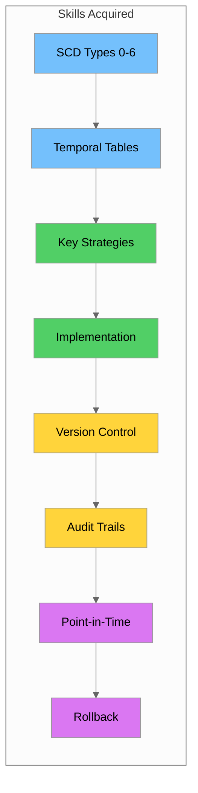

# Day 14-15: SCD Deep Dive & Master Data Versioning

## Table of Contents
1. [Introduction](#introduction)
2. [Learning Objectives](#learning-objectives)
3. [SCD Types 0-6 Detailed](#scd-types-0-6-detailed)
4. [Temporal Tables and Bitemporal Modeling](#temporal-tables-and-bitemporal-modeling)
5. [Surrogate Keys vs Natural Keys](#surrogate-keys-vs-natural-keys)
6. [Implementation Patterns](#implementation-patterns)
7. [Version Control for Master Data](#version-control-for-master-data)
8. [Audit Trails and Change Tracking](#audit-trails-and-change-tracking)
9. [Point-in-Time Queries](#point-in-time-queries)
10. [Rollback Strategies](#rollback-strategies)
11. [Hands-on Labs](#hands-on-labs)
12. [Summary](#summary)
13. [Additional Resources](#additional-resources)

---

## Introduction

Welcome to Days 14-15 of the Data Engineering training program! Over these two days, you'll master Slowly Changing Dimensions (SCD) and master data versioning—critical concepts for maintaining historical accuracy in data warehouses. We'll use the NYC Yellow Taxi Trip dataset to demonstrate real-world applications of these concepts.

In data warehousing, dimensions change over time. A taxi zone might be renamed, a vendor might merge with another company, or rate codes might be updated. How you handle these changes determines whether your historical reports remain accurate and whether you can answer questions like "What was the fare structure when this trip occurred?"



---

## Learning Objectives

By the end of Days 14-15, you will be able to:

| Objective | Description |
|-----------|-------------|
| **Understand SCD Types** | Explain and implement all SCD types (0-6) with appropriate use cases |
| **Design Temporal Tables** | Create system-time, application-time, and bitemporal tables |
| **Choose Key Strategies** | Select between surrogate and natural keys based on requirements |
| **Implement SCD Patterns** | Write MERGE/UPSERT operations for various SCD types |
| **Version Master Data** | Design version control systems for master data |
| **Build Audit Trails** | Implement comprehensive change tracking and auditing |
| **Query Historical Data** | Write point-in-time and AS OF queries |
| **Design Rollback Systems** | Implement data recovery and rollback procedures |

---

## SCD Types 0-6 Detailed

Slowly Changing Dimensions (SCD) describe how dimension data changes over time and how those changes are managed in a data warehouse.

### SCD Type Overview



### SCD Type 0: Retain Original (No Changes)

Type 0 dimensions never change after initial load. The original value is retained forever.

**Use Cases:** Original customer signup date, first purchase date, account creation timestamp

```sql
-- Type 0: Taxi Zone Original Assignment
CREATE TABLE dim_taxi_zone_type0 (
    zone_sk SERIAL PRIMARY KEY,
    location_id INTEGER NOT NULL UNIQUE,
    borough VARCHAR(50) NOT NULL,
    zone_name VARCHAR(100) NOT NULL,
    service_zone VARCHAR(50) NOT NULL,
    created_at TIMESTAMP DEFAULT NOW()
);

-- Initial load only - no updates allowed
INSERT INTO dim_taxi_zone_type0 (location_id, borough, zone_name, service_zone)
SELECT LocationID, Borough, Zone, service_zone
FROM staging_taxi_zones
ON CONFLICT (location_id) DO NOTHING;
```

### SCD Type 1: Overwrite (No History)

Type 1 overwrites the old value with the new value. No history is maintained.

**Use Cases:** Correcting data entry errors, updating non-critical attributes

```sql
-- Type 1: Vendor Dimension with Overwrite
CREATE TABLE dim_vendor_type1 (
    vendor_sk SERIAL PRIMARY KEY,
    vendor_id INTEGER NOT NULL UNIQUE,
    vendor_name VARCHAR(100) NOT NULL,
    vendor_address VARCHAR(200),
    updated_at TIMESTAMP DEFAULT NOW()
);

-- Using MERGE (PostgreSQL 15+)
MERGE INTO dim_vendor_type1 AS target
USING staging_vendors AS source
ON target.vendor_id = source.vendor_id
WHEN MATCHED THEN
    UPDATE SET vendor_name = source.vendor_name, updated_at = NOW()
WHEN NOT MATCHED THEN
    INSERT (vendor_id, vendor_name) VALUES (source.vendor_id, source.vendor_name);
```

### SCD Type 2: Add New Row (Full History)

Type 2 creates a new row for each change, preserving complete history.

**Use Cases:** Tracking customer address changes, recording price changes over time

```sql
-- Type 2: Taxi Zone Dimension with Full History
CREATE TABLE dim_taxi_zone_type2 (
    zone_sk SERIAL PRIMARY KEY,
    location_id INTEGER NOT NULL,
    borough VARCHAR(50) NOT NULL,
    zone_name VARCHAR(100) NOT NULL,
    service_zone VARCHAR(50) NOT NULL,
    effective_start_date TIMESTAMP NOT NULL DEFAULT NOW(),
    effective_end_date TIMESTAMP DEFAULT '9999-12-31 23:59:59',
    is_current BOOLEAN DEFAULT TRUE,
    version_number INTEGER DEFAULT 1
);

-- Indexes for Type 2 queries
CREATE INDEX idx_zone_type2_current ON dim_taxi_zone_type2(location_id, is_current) 
    WHERE is_current = TRUE;
CREATE INDEX idx_zone_type2_dates ON dim_taxi_zone_type2(location_id, effective_start_date, effective_end_date);

-- Type 2 SCD Procedure
CREATE OR REPLACE PROCEDURE scd_type2_zone_update(
    p_location_id INTEGER,
    p_borough VARCHAR(50),
    p_zone_name VARCHAR(100),
    p_service_zone VARCHAR(50)
)
LANGUAGE plpgsql AS $$
DECLARE
    v_current_record RECORD;
    v_has_changes BOOLEAN := FALSE;
BEGIN
    SELECT * INTO v_current_record
    FROM dim_taxi_zone_type2
    WHERE location_id = p_location_id AND is_current = TRUE;
    
    IF NOT FOUND THEN
        INSERT INTO dim_taxi_zone_type2 (location_id, borough, zone_name, service_zone)
        VALUES (p_location_id, p_borough, p_zone_name, p_service_zone);
        RETURN;
    END IF;
    
    IF v_current_record.borough != p_borough OR
       v_current_record.zone_name != p_zone_name OR
       v_current_record.service_zone != p_service_zone THEN
        v_has_changes := TRUE;
    END IF;
    
    IF v_has_changes THEN
        UPDATE dim_taxi_zone_type2
        SET effective_end_date = NOW(), is_current = FALSE
        WHERE zone_sk = v_current_record.zone_sk;
        
        INSERT INTO dim_taxi_zone_type2 (
            location_id, borough, zone_name, service_zone,
            version_number
        ) VALUES (
            p_location_id, p_borough, p_zone_name, p_service_zone,
            v_current_record.version_number + 1
        );
    END IF;
END;
$$;
```

### SCD Type 3: Add New Column (Limited History)

Type 3 adds columns to track the previous value. Only one level of history is maintained.

```sql
-- Type 3: Rate Code Dimension with Previous Value
CREATE TABLE dim_rate_code_type3 (
    rate_code_sk SERIAL PRIMARY KEY,
    rate_code_id INTEGER NOT NULL UNIQUE,
    rate_code_name VARCHAR(100) NOT NULL,
    base_fare NUMERIC(10,2) NOT NULL,
    previous_rate_code_name VARCHAR(100),
    previous_base_fare NUMERIC(10,2),
    last_change_date TIMESTAMP
);
```

### SCD Type 4: Add History Table (Separate History)

Type 4 maintains current data in the main table and historical data in a separate history table.

```sql
-- Type 4: Current Vendor Table
CREATE TABLE dim_vendor_current (
    vendor_sk SERIAL PRIMARY KEY,
    vendor_id INTEGER NOT NULL UNIQUE,
    vendor_name VARCHAR(100) NOT NULL,
    updated_at TIMESTAMP DEFAULT NOW()
);

-- Type 4: Vendor History Table
CREATE TABLE dim_vendor_history (
    history_sk SERIAL PRIMARY KEY,
    vendor_sk INTEGER NOT NULL,
    vendor_id INTEGER NOT NULL,
    vendor_name VARCHAR(100) NOT NULL,
    effective_start_date TIMESTAMP NOT NULL,
    effective_end_date TIMESTAMP NOT NULL,
    change_type VARCHAR(20) NOT NULL
);
```

### SCD Type 5: Type 4 + Type 1 (Mini-Dimension)

Type 5 combines Type 4 with Type 1 using a mini-dimension for frequently changing attributes.

### SCD Type 6: Type 1 + Type 2 + Type 3 (Hybrid)

Type 6 combines Types 1, 2, and 3 to provide current values, full history, and previous values.

### SCD Type Comparison Summary

| Type | History | Storage | Complexity | Use Case |
|------|---------|---------|------------|----------|
| **Type 0** | None | Minimal | Very Low | Immutable attributes |
| **Type 1** | None | Minimal | Low | Error corrections |
| **Type 2** | Full | High | Medium | Complete audit trail |
| **Type 3** | Limited (1 level) | Low | Low | Before/after comparison |
| **Type 4** | Full (separate) | High | Medium | Fast current queries |
| **Type 5** | Full + Mini-dim | High | High | Rapidly changing attributes |
| **Type 6** | Full + Current + Previous | Very High | Very High | Complex analytics |

---

## Temporal Tables and Bitemporal Modeling

Temporal tables track data changes over time. Understanding the difference between system time and application time is crucial for accurate historical analysis.

### Time Dimensions in Data



### System-Time Temporal Tables (Transaction Time)

System time tracks when data was recorded in the database.

```sql
-- PostgreSQL Implementation (simulated with triggers)
CREATE TABLE rate_code_system_temporal (
    rate_code_id INTEGER NOT NULL,
    rate_code_name VARCHAR(100) NOT NULL,
    base_fare NUMERIC(10,2) NOT NULL,
    sys_start TIMESTAMP NOT NULL DEFAULT NOW(),
    sys_end TIMESTAMP NOT NULL DEFAULT '9999-12-31 23:59:59',
    PRIMARY KEY (rate_code_id, sys_start)
);

-- History table for system versioning
CREATE TABLE rate_code_system_temporal_history (
    LIKE rate_code_system_temporal INCLUDING ALL
);

-- Trigger to maintain system time
CREATE OR REPLACE FUNCTION maintain_system_time()
RETURNS TRIGGER AS $$
BEGIN
    IF TG_OP = 'UPDATE' THEN
        INSERT INTO rate_code_system_temporal_history SELECT OLD.*;
        NEW.sys_start := NOW();
        NEW.sys_end := '9999-12-31 23:59:59';
        RETURN NEW;
    ELSIF TG_OP = 'DELETE' THEN
        INSERT INTO rate_code_system_temporal_history
        VALUES (OLD.rate_code_id, OLD.rate_code_name, OLD.base_fare, OLD.sys_start, NOW());
        RETURN OLD;
    END IF;
    RETURN NEW;
END;
$$ LANGUAGE plpgsql;

CREATE TRIGGER trg_rate_code_system_time
    BEFORE UPDATE OR DELETE ON rate_code_system_temporal
    FOR EACH ROW EXECUTE FUNCTION maintain_system_time();
```

### Application-Time Temporal Tables (Valid Time)

Application time tracks when data is valid in the real world.

```sql
-- Application-time temporal table for taxi zone boundaries
CREATE TABLE taxi_zone_valid_time (
    zone_id SERIAL PRIMARY KEY,
    location_id INTEGER NOT NULL,
    borough VARCHAR(50) NOT NULL,
    zone_name VARCHAR(100) NOT NULL,
    valid_from DATE NOT NULL,
    valid_to DATE NOT NULL DEFAULT '9999-12-31',
    CONSTRAINT chk_valid_period CHECK (valid_to > valid_from)
);

-- Query valid at a specific business date
SELECT * FROM taxi_zone_valid_time
WHERE location_id = 132
  AND valid_from <= '2025-05-15'
  AND valid_to > '2025-05-15';
```

### Bitemporal Tables (Both Times)

Bitemporal tables track both system time and application time.

```sql
-- Bitemporal table for vendor contracts
CREATE TABLE vendor_contract_bitemporal (
    contract_sk SERIAL PRIMARY KEY,
    vendor_id INTEGER NOT NULL,
    contract_type VARCHAR(50) NOT NULL,
    commission_rate NUMERIC(5,2) NOT NULL,
    valid_from DATE NOT NULL,
    valid_to DATE NOT NULL DEFAULT '9999-12-31',
    sys_start TIMESTAMP NOT NULL DEFAULT NOW(),
    sys_end TIMESTAMP NOT NULL DEFAULT '9999-12-31 23:59:59'
);

-- Current state (now valid, now in system)
SELECT * FROM vendor_contract_bitemporal
WHERE vendor_id = 1
  AND valid_from <= CURRENT_DATE AND valid_to > CURRENT_DATE
  AND sys_end = '9999-12-31 23:59:59';
```

### Temporal Table Comparison

| Aspect | System Time | Application Time | Bitemporal |
|--------|-------------|------------------|------------|
| **Tracks** | When recorded | When valid | Both |
| **Managed by** | Database | Application | Both |
| **Use case** | Audit trail | Business validity | Complete history |
| **Complexity** | Medium | Medium | High |

---

## Surrogate Keys vs Natural Keys

### Natural Keys

Natural keys are business identifiers that exist in the source system.

```sql
-- Natural key example
CREATE TABLE dim_taxi_zone_natural (
    location_id INTEGER PRIMARY KEY,  -- Natural key from source
    borough VARCHAR(50) NOT NULL,
    zone_name VARCHAR(100) NOT NULL
);
```

**Pros:** Meaningful to business users, no lookup needed
**Cons:** May change, cannot support SCD Type 2

### Surrogate Keys

Surrogate keys are system-generated identifiers with no business meaning.

```sql
-- Surrogate key example
CREATE TABLE dim_taxi_zone_surrogate (
    zone_sk SERIAL PRIMARY KEY,        -- Surrogate key
    location_id INTEGER NOT NULL,       -- Natural key (for lookups)
    borough VARCHAR(50) NOT NULL,
    effective_start_date TIMESTAMP DEFAULT NOW(),
    effective_end_date TIMESTAMP DEFAULT '9999-12-31 23:59:59',
    is_current BOOLEAN DEFAULT TRUE
);
```

**Pros:** Stable, support SCD Type 2, efficient joins
**Cons:** No business meaning, requires lookup during ETL

### Key Generation Strategies

```sql
-- Strategy 1: SERIAL/SEQUENCE
CREATE SEQUENCE zone_sk_seq START 1;

-- Strategy 2: UUID
CREATE EXTENSION IF NOT EXISTS "uuid-ossp";
CREATE TABLE dim_zone_uuid (
    zone_sk UUID PRIMARY KEY DEFAULT uuid_generate_v4(),
    location_id INTEGER NOT NULL
);

-- Strategy 3: Hash Key (deterministic)
CREATE OR REPLACE FUNCTION generate_hash_key(p_location_id INTEGER, p_effective_date TIMESTAMP)
RETURNS BIGINT AS $$
BEGIN
    RETURN abs(hashtext(p_location_id::TEXT || '|' || p_effective_date::TEXT));
END;
$$ LANGUAGE plpgsql IMMUTABLE;
```

| Strategy | Uniqueness | Performance | Distributed | SCD Support |
|----------|------------|-------------|-------------|-------------|
| **SERIAL** | Guaranteed | Excellent | Poor | Yes |
| **UUID** | Practically unique | Good | Excellent | Yes |
| **Hash** | Collision possible | Excellent | Excellent | Yes |

---

## Implementation Patterns

### MERGE/UPSERT Patterns

```sql
-- MERGE for SCD Type 1 (PostgreSQL 15+)
MERGE INTO dim_vendor_type1 AS target
USING staging_vendors AS source
ON target.vendor_id = source.vendor_id
WHEN MATCHED AND target.vendor_name != source.vendor_name THEN
    UPDATE SET vendor_name = source.vendor_name, updated_at = NOW()
WHEN NOT MATCHED THEN
    INSERT (vendor_id, vendor_name) VALUES (source.vendor_id, source.vendor_name);

-- UPSERT for older PostgreSQL versions
INSERT INTO dim_vendor_type1 (vendor_id, vendor_name)
SELECT vendor_id, vendor_name FROM staging_vendors
ON CONFLICT (vendor_id) DO UPDATE SET
    vendor_name = EXCLUDED.vendor_name,
    updated_at = NOW();
```

### Incremental Loading with Watermarks

```sql
-- Watermark table
CREATE TABLE etl_watermarks (
    table_name VARCHAR(100) PRIMARY KEY,
    last_processed_timestamp TIMESTAMP NOT NULL,
    updated_at TIMESTAMP DEFAULT NOW()
);

-- Incremental load procedure
CREATE OR REPLACE PROCEDURE incremental_load_zones()
LANGUAGE plpgsql AS $$
DECLARE
    v_watermark TIMESTAMP;
    v_new_watermark TIMESTAMP;
BEGIN
    SELECT last_processed_timestamp INTO v_watermark
    FROM etl_watermarks WHERE table_name = 'dim_taxi_zone';
    
    SELECT MAX(updated_at) INTO v_new_watermark
    FROM source_taxi_zones WHERE updated_at > v_watermark;
    
    IF v_new_watermark IS NOT NULL THEN
        -- Process changed records
        -- ... SCD logic here ...
        
        UPDATE etl_watermarks
        SET last_processed_timestamp = v_new_watermark, updated_at = NOW()
        WHERE table_name = 'dim_taxi_zone';
    END IF;
END;
$$;
```

### Handling Late-Arriving Data

```sql
-- Late-arriving dimension handling
CREATE OR REPLACE PROCEDURE handle_late_arriving_dimension(
    p_location_id INTEGER,
    p_borough VARCHAR(50),
    p_zone_name VARCHAR(100),
    p_effective_date TIMESTAMP
)
LANGUAGE plpgsql AS $$
DECLARE
    v_affected_record RECORD;
BEGIN
    SELECT * INTO v_affected_record
    FROM dim_taxi_zone_type2
    WHERE location_id = p_location_id
      AND effective_start_date <= p_effective_date
      AND effective_end_date > p_effective_date;
    
    IF FOUND THEN
        -- Split the existing record
        UPDATE dim_taxi_zone_type2
        SET effective_end_date = p_effective_date
        WHERE zone_sk = v_affected_record.zone_sk;
        
        INSERT INTO dim_taxi_zone_type2 (
            location_id, borough, zone_name, service_zone,
            effective_start_date, effective_end_date, is_current
        ) VALUES (
            p_location_id, p_borough, p_zone_name, v_affected_record.service_zone,
            p_effective_date, v_affected_record.effective_end_date, v_affected_record.is_current
        );
    END IF;
END;
$$;
```

### Handling Deleted Records

```sql
-- Soft delete pattern
ALTER TABLE dim_taxi_zone_type2 
ADD COLUMN is_deleted BOOLEAN DEFAULT FALSE,
ADD COLUMN deleted_at TIMESTAMP;

CREATE OR REPLACE PROCEDURE soft_delete_zone(p_location_id INTEGER)
LANGUAGE plpgsql AS $$
BEGIN
    UPDATE dim_taxi_zone_type2
    SET is_deleted = TRUE, deleted_at = NOW(),
        effective_end_date = NOW(), is_current = FALSE
    WHERE location_id = p_location_id AND is_current = TRUE;
END;
$$;
```

---

## Version Control for Master Data

### Master Data Lifecycle



### Master Data Version Control Schema

```sql
-- Master data with version control
CREATE TABLE master_data_taxi_zones (
    master_id SERIAL PRIMARY KEY,
    location_id INTEGER NOT NULL,
    borough VARCHAR(50) NOT NULL,
    zone_name VARCHAR(100) NOT NULL,
    service_zone VARCHAR(50) NOT NULL,
    version_number INTEGER NOT NULL DEFAULT 1,
    version_status VARCHAR(20) NOT NULL DEFAULT 'DRAFT',
    effective_from DATE,
    effective_to DATE DEFAULT '9999-12-31',
    created_by VARCHAR(50) DEFAULT CURRENT_USER,
    created_at TIMESTAMP DEFAULT NOW(),
    approved_by VARCHAR(50),
    approved_at TIMESTAMP,
    CONSTRAINT chk_status CHECK (version_status IN ('DRAFT', 'PENDING', 'APPROVED', 'ACTIVE', 'DEPRECATED', 'ARCHIVED'))
);

-- Change request tracking
CREATE TABLE master_data_change_requests (
    request_id SERIAL PRIMARY KEY,
    master_id INTEGER REFERENCES master_data_taxi_zones(master_id),
    change_type VARCHAR(20) NOT NULL,
    change_description TEXT,
    requested_by VARCHAR(50) DEFAULT CURRENT_USER,
    requested_at TIMESTAMP DEFAULT NOW(),
    reviewed_by VARCHAR(50),
    reviewed_at TIMESTAMP,
    review_status VARCHAR(20) DEFAULT 'PENDING',
    review_comments TEXT
);

-- Approval workflow procedure
CREATE OR REPLACE PROCEDURE approve_master_data_change(
    p_request_id INTEGER,
    p_reviewer VARCHAR(50),
    p_approved BOOLEAN,
    p_comments TEXT DEFAULT NULL
)
LANGUAGE plpgsql AS $$
DECLARE
    v_master_id INTEGER;
BEGIN
    SELECT master_id INTO v_master_id
    FROM master_data_change_requests WHERE request_id = p_request_id;
    
    UPDATE master_data_change_requests
    SET reviewed_by = p_reviewer,
        reviewed_at = NOW(),
        review_status = CASE WHEN p_approved THEN 'APPROVED' ELSE 'REJECTED' END,
        review_comments = p_comments
    WHERE request_id = p_request_id;
    
    IF p_approved THEN
        UPDATE master_data_taxi_zones
        SET version_status = 'APPROVED',
            approved_by = p_reviewer,
            approved_at = NOW()
        WHERE master_id = v_master_id;
    END IF;
END;
$$;
```

---

## Audit Trails and Change Tracking

### Audit Table Design

```sql
-- Generic audit log table
CREATE TABLE audit_log (
    audit_id BIGSERIAL PRIMARY KEY,
    table_name VARCHAR(100) NOT NULL,
    record_id BIGINT NOT NULL,
    operation VARCHAR(10) NOT NULL,
    old_values JSONB,
    new_values JSONB,
    changed_columns TEXT[],
    changed_by VARCHAR(50) DEFAULT CURRENT_USER,
    changed_at TIMESTAMP DEFAULT NOW(),
    client_ip INET,
    application_name VARCHAR(100)
);

CREATE INDEX idx_audit_table_record ON audit_log(table_name, record_id);
CREATE INDEX idx_audit_changed_at ON audit_log(changed_at);

-- Trigger-based auditing
CREATE OR REPLACE FUNCTION audit_trigger_function()
RETURNS TRIGGER AS $$
DECLARE
    v_old_values JSONB;
    v_new_values JSONB;
    v_changed_columns TEXT[];
BEGIN
    IF TG_OP = 'DELETE' THEN
        v_old_values := to_jsonb(OLD);
        INSERT INTO audit_log (table_name, record_id, operation, old_values, changed_by)
        VALUES (TG_TABLE_NAME, OLD.zone_sk, 'DELETE', v_old_values, CURRENT_USER);
        RETURN OLD;
    ELSIF TG_OP = 'UPDATE' THEN
        v_old_values := to_jsonb(OLD);
        v_new_values := to_jsonb(NEW);
        SELECT array_agg(key) INTO v_changed_columns
        FROM jsonb_each(v_old_values) o
        FULL OUTER JOIN jsonb_each(v_new_values) n USING (key)
        WHERE o.value IS DISTINCT FROM n.value;
        
        INSERT INTO audit_log (table_name, record_id, operation, old_values, new_values, changed_columns)
        VALUES (TG_TABLE_NAME, NEW.zone_sk, 'UPDATE', v_old_values, v_new_values, v_changed_columns);
        RETURN NEW;
    ELSIF TG_OP = 'INSERT' THEN
        v_new_values := to_jsonb(NEW);
        INSERT INTO audit_log (table_name, record_id, operation, new_values)
        VALUES (TG_TABLE_NAME, NEW.zone_sk, 'INSERT', v_new_values);
        RETURN NEW;
    END IF;
    RETURN NULL;
END;
$$ LANGUAGE plpgsql;

-- Apply audit trigger
CREATE TRIGGER trg_audit_taxi_zones
    AFTER INSERT OR UPDATE OR DELETE ON dim_taxi_zone_type2
    FOR EACH ROW EXECUTE FUNCTION audit_trigger_function();
```

### Change Data Capture (CDC) for Auditing

```sql
-- CDC-style change tracking table
CREATE TABLE cdc_taxi_zones (
    cdc_id BIGSERIAL PRIMARY KEY,
    operation CHAR(1) NOT NULL,  -- I=Insert, U=Update, D=Delete
    captured_at TIMESTAMP DEFAULT NOW(),
    transaction_id BIGINT DEFAULT txid_current(),
    zone_sk INTEGER,
    location_id INTEGER,
    borough VARCHAR(50),
    zone_name VARCHAR(100),
    service_zone VARCHAR(50)
);

-- CDC trigger
CREATE OR REPLACE FUNCTION cdc_capture_function()
RETURNS TRIGGER AS $$
BEGIN
    IF TG_OP = 'DELETE' THEN
        INSERT INTO cdc_taxi_zones (operation, zone_sk, location_id, borough, zone_name, service_zone)
        VALUES ('D', OLD.zone_sk, OLD.location_id, OLD.borough, OLD.zone_name, OLD.service_zone);
        RETURN OLD;
    ELSIF TG_OP = 'UPDATE' THEN
        INSERT INTO cdc_taxi_zones (operation, zone_sk, location_id, borough, zone_name, service_zone)
        VALUES ('U', NEW.zone_sk, NEW.location_id, NEW.borough, NEW.zone_name, NEW.service_zone);
        RETURN NEW;
    ELSIF TG_OP = 'INSERT' THEN
        INSERT INTO cdc_taxi_zones (operation, zone_sk, location_id, borough, zone_name, service_zone)
        VALUES ('I', NEW.zone_sk, NEW.location_id, NEW.borough, NEW.zone_name, NEW.service_zone);
        RETURN NEW;
    END IF;
    RETURN NULL;
END;
$$ LANGUAGE plpgsql;
```

### Audit Log Retention

```sql
-- Partition audit log by month
CREATE TABLE audit_log_partitioned (
    audit_id BIGSERIAL,
    table_name VARCHAR(100) NOT NULL,
    record_id BIGINT NOT NULL,
    operation VARCHAR(10) NOT NULL,
    old_values JSONB,
    new_values JSONB,
    changed_at TIMESTAMP DEFAULT NOW(),
    PRIMARY KEY (audit_id, changed_at)
) PARTITION BY RANGE (changed_at);

-- Create monthly partitions
CREATE TABLE audit_log_2025_01 PARTITION OF audit_log_partitioned
    FOR VALUES FROM ('2025-01-01') TO ('2025-02-01');

-- Retention procedure
CREATE OR REPLACE PROCEDURE purge_old_audit_logs(retention_months INTEGER DEFAULT 12)
LANGUAGE plpgsql AS $$
DECLARE
    v_cutoff_date DATE;
BEGIN
    v_cutoff_date := CURRENT_DATE - (retention_months || ' months')::INTERVAL;
    DELETE FROM audit_log WHERE changed_at < v_cutoff_date;
    RAISE NOTICE 'Purged audit logs older than %', v_cutoff_date;
END;
$$;
```

---

## Point-in-Time Queries

Point-in-time queries allow you to see data as it existed at a specific moment in history.

### AS OF Queries

```sql
-- Query zone as it was on a specific date
SELECT zone_sk, location_id, borough, zone_name, service_zone
FROM dim_taxi_zone_type2
WHERE location_id = 132  -- JFK Airport
  AND effective_start_date <= '2025-06-15 12:00:00'
  AND effective_end_date > '2025-06-15 12:00:00';

-- Function for AS OF queries
CREATE OR REPLACE FUNCTION get_zone_as_of(
    p_location_id INTEGER,
    p_as_of_date TIMESTAMP
) RETURNS TABLE (
    zone_sk INTEGER,
    location_id INTEGER,
    borough VARCHAR,
    zone_name VARCHAR,
    service_zone VARCHAR
) AS $$
BEGIN
    RETURN QUERY
    SELECT d.zone_sk, d.location_id, d.borough, d.zone_name, d.service_zone
    FROM dim_taxi_zone_type2 d
    WHERE d.location_id = p_location_id
      AND d.effective_start_date <= p_as_of_date
      AND d.effective_end_date > p_as_of_date;
END;
$$ LANGUAGE plpgsql;

-- Usage
SELECT * FROM get_zone_as_of(132, '2025-06-15 12:00:00');
```

### BETWEEN Queries for Time Ranges

```sql
-- Query all versions of a zone within a time range
SELECT zone_sk, location_id, zone_name, effective_start_date, effective_end_date, version_number
FROM dim_taxi_zone_type2
WHERE location_id = 132
  AND effective_start_date < '2025-12-31'
  AND effective_end_date > '2025-01-01'
ORDER BY effective_start_date;
```

### Reconstructing Historical State

```sql
-- Join fact table with historical dimension
SELECT f.trip_id, f.pickup_datetime, f.fare_amount, d.zone_name AS pickup_zone_at_trip_time
FROM fact_taxi_trips f
JOIN dim_taxi_zone_type2 d
    ON f.pickup_location_id = d.location_id
    AND f.pickup_datetime >= d.effective_start_date
    AND f.pickup_datetime < d.effective_end_date
WHERE f.trip_date = '2025-08-15';
```

---

## Rollback Strategies

### Soft Deletes vs Hard Deletes

```sql
-- Soft delete procedure
CREATE OR REPLACE PROCEDURE soft_delete_zone(p_location_id INTEGER)
LANGUAGE plpgsql AS $$
BEGIN
    UPDATE dim_taxi_zone_type2
    SET is_deleted = TRUE, deleted_at = NOW(),
        effective_end_date = NOW(), is_current = FALSE
    WHERE location_id = p_location_id AND is_current = TRUE;
END;
$$;
```

### Reverting to Previous Versions

```sql
-- Revert to a specific version
CREATE OR REPLACE PROCEDURE revert_zone_to_version(
    p_location_id INTEGER,
    p_target_version INTEGER
)
LANGUAGE plpgsql AS $$
DECLARE
    v_target RECORD;
    v_current RECORD;
BEGIN
    SELECT * INTO v_target FROM dim_taxi_zone_type2
    WHERE location_id = p_location_id AND version_number = p_target_version;
    
    SELECT * INTO v_current FROM dim_taxi_zone_type2
    WHERE location_id = p_location_id AND is_current = TRUE;
    
    UPDATE dim_taxi_zone_type2
    SET effective_end_date = NOW(), is_current = FALSE
    WHERE zone_sk = v_current.zone_sk;
    
    INSERT INTO dim_taxi_zone_type2 (
        location_id, borough, zone_name, service_zone, version_number
    ) VALUES (
        v_target.location_id, v_target.borough, v_target.zone_name,
        v_target.service_zone, v_current.version_number + 1
    );
END;
$$;
```

---

## Hands-on Labs

### Lab 1: Implement SCD Type 2 in PostgreSQL RDS

**Objective:** Create a complete SCD Type 2 implementation for taxi zones.

```sql
-- Step 1: Create the dimension table
CREATE TABLE lab_dim_taxi_zone (
    zone_sk SERIAL PRIMARY KEY,
    location_id INTEGER NOT NULL,
    borough VARCHAR(50) NOT NULL,
    zone_name VARCHAR(100) NOT NULL,
    service_zone VARCHAR(50) NOT NULL,
    effective_start_date TIMESTAMP NOT NULL DEFAULT NOW(),
    effective_end_date TIMESTAMP DEFAULT '9999-12-31 23:59:59',
    is_current BOOLEAN DEFAULT TRUE,
    version_number INTEGER DEFAULT 1
);

-- Step 2: Create indexes
CREATE INDEX idx_lab_zone_current ON lab_dim_taxi_zone(location_id) WHERE is_current = TRUE;

-- Step 3: Load initial data
INSERT INTO lab_dim_taxi_zone (location_id, borough, zone_name, service_zone)
VALUES
    (132, 'Queens', 'JFK Airport', 'Airports'),
    (138, 'Queens', 'LaGuardia Airport', 'Airports'),
    (161, 'Manhattan', 'Midtown Center', 'Yellow Zone');

-- Step 4: Test SCD Type 2 update
CALL scd_type2_zone_update(132, 'Queens', 'JFK International Airport', 'Airports');
SELECT * FROM lab_dim_taxi_zone WHERE location_id = 132 ORDER BY version_number;
```

### Lab 2: Write Stored Procedures for SCD Operations

**Objective:** Create reusable stored procedures for common SCD operations.

See the [`scd_type2_zone_update()`](day-14-15-tutorial.md:193) procedure above for reference.

### Lab 3: Create PySpark Script for SCD with Delta Lake

**Objective:** Implement SCD Type 2 using PySpark and Delta Lake.

```python
# PySpark SCD Type 2 with Delta Lake
from pyspark.sql import SparkSession
from pyspark.sql.functions import *
from delta.tables import DeltaTable

spark = SparkSession.builder \
    .appName("SCD_Type2_Delta") \
    .config("spark.sql.extensions", "io.delta.sql.DeltaSparkSessionExtension") \
    .getOrCreate()

# Create initial dimension
initial_data = [
    (132, "Queens", "JFK Airport", "Airports"),
    (138, "Queens", "LaGuardia Airport", "Airports")
]
columns = ["location_id", "borough", "zone_name", "service_zone"]

df = spark.createDataFrame(initial_data, columns) \
    .withColumn("effective_start_date", current_timestamp()) \
    .withColumn("effective_end_date", lit("9999-12-31").cast("timestamp")) \
    .withColumn("is_current", lit(True)) \
    .withColumn("version_number", lit(1))

# Write as Delta table
df.write.format("delta").mode("overwrite").save("/tmp/delta/dim_taxi_zone")

# SCD Type 2 merge with Delta Lake
delta_table = DeltaTable.forPath(spark, "/tmp/delta/dim_taxi_zone")

updates = spark.createDataFrame([
    (132, "Queens", "JFK International Airport", "Airports")
], columns)

# Merge logic
delta_table.alias("target").merge(
    updates.alias("source"),
    "target.location_id = source.location_id AND target.is_current = true"
).whenMatchedUpdate(
    condition="target.zone_name != source.zone_name",
    set={"effective_end_date": "current_timestamp()", "is_current": "false"}
).execute()

# Insert new version
updates.withColumn("effective_start_date", current_timestamp()) \
    .withColumn("effective_end_date", lit("9999-12-31").cast("timestamp")) \
    .withColumn("is_current", lit(True)) \
    .withColumn("version_number", lit(2)) \
    .write.format("delta").mode("append").save("/tmp/delta/dim_taxi_zone")
```

### Lab 4: Implement SQL with Version Control

**Objective:** Create a version-controlled master data system.

See the [`master_data_taxi_zones`](day-14-15-tutorial.md:648) table and [`approve_master_data_change()`](day-14-15-tutorial.md:680) procedure above.

### Lab 5: Query Historical Data

**Objective:** Practice point-in-time and historical queries.

```sql
-- Query 1: Get zone as of specific date
SELECT * FROM get_zone_as_of(132, '2025-06-15 12:00:00');

-- Query 2: Get all versions of a zone
SELECT zone_sk, zone_name, version_number, effective_start_date, effective_end_date
FROM dim_taxi_zone_type2
WHERE location_id = 132
ORDER BY version_number;

-- Query 3: Join trips with historical zones
SELECT t.trip_id, t.fare_amount, z.zone_name
FROM fact_taxi_trips t
JOIN dim_taxi_zone_type2 z ON t.pickup_location_id = z.location_id
    AND t.pickup_datetime BETWEEN z.effective_start_date AND z.effective_end_date
WHERE t.trip_date = '2025-08-15';
```

---

## Summary

In Days 14-15, you've learned essential skills for SCD and master data versioning:



### Key Takeaways

| Topic | Key Learning |
|-------|--------------|
| **SCD Types** | Choose the right type based on history requirements and query patterns |
| **Temporal Tables** | System time for auditing, application time for business validity |
| **Surrogate Keys** | Essential for SCD Type 2 and historical tracking |
| **MERGE Patterns** | Use PostgreSQL 15+ MERGE or ON CONFLICT for efficient updates |
| **Version Control** | Implement approval workflows for master data changes |
| **Audit Trails** | Use triggers and CDC for comprehensive change tracking |
| **Point-in-Time** | Design indexes and queries for efficient historical lookups |
| **Rollback** | Prefer soft deletes and maintain version history for recovery |

### Best Practices Checklist

- [ ] Use SCD Type 2 for dimensions requiring full history
- [ ] Implement surrogate keys for all dimension tables
- [ ] Create appropriate indexes for point-in-time queries
- [ ] Set up audit triggers on critical tables
- [ ] Design approval workflows for master data changes
- [ ] Implement soft deletes instead of hard deletes
- [ ] Create procedures for common SCD operations
- [ ] Test rollback procedures regularly
- [ ] Monitor dimension table growth
- [ ] Document SCD type choices for each dimension

---

## Additional Resources

### Documentation
- [PostgreSQL Documentation](https://www.postgresql.org/docs/)
- [Delta Lake Documentation](https://docs.delta.io/)
- [AWS RDS PostgreSQL](https://docs.aws.amazon.com/AmazonRDS/latest/UserGuide/CHAP_PostgreSQL.html)

### Books
- "The Data Warehouse Toolkit" by Ralph Kimball
- "Building a Scalable Data Warehouse with Data Vault 2.0" by Dan Linstedt
- "Fundamentals of Data Engineering" by Joe Reis & Matt Housley

### Online Courses
- Kimball Dimensional Modeling (Kimball Group)
- Data Warehousing on AWS (AWS Skill Builder)
- Delta Lake Fundamentals (Databricks)

### Related Tutorials
- [Day 11: Data Modeling & Schema Design](../day-11/day-11-tutorial.md)
- [Day 12-13: Advanced SQL Transformations](../day-12-13/day-12-13-tutorial.md)

---

*Tutorial completed. Continue to Day 16-17 for Data Pipeline Orchestration with Apache Airflow.*