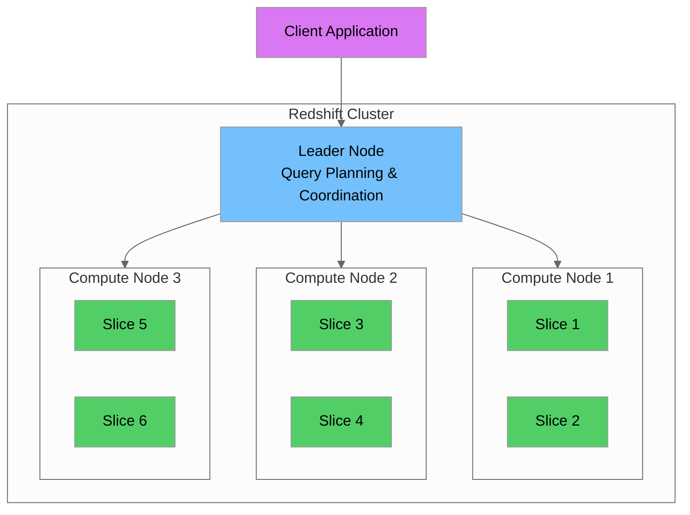
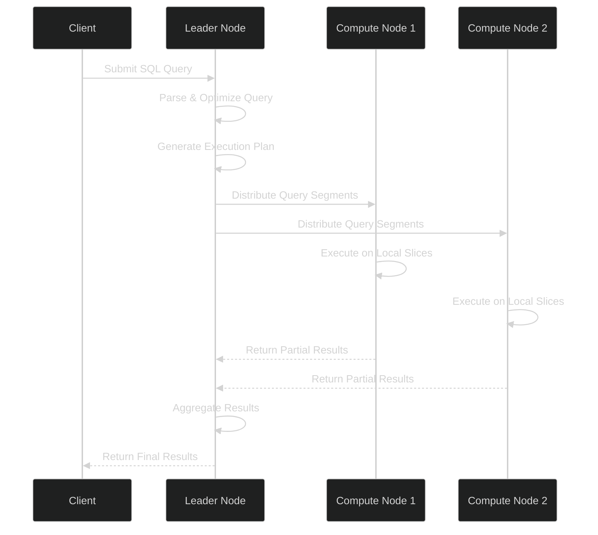
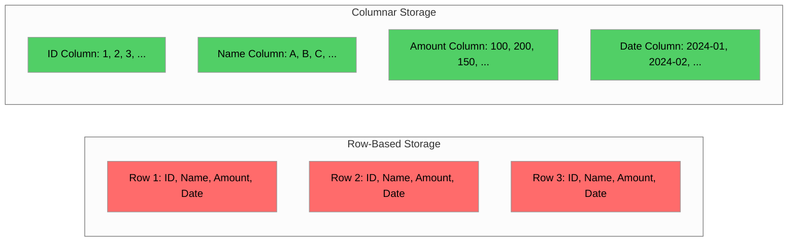
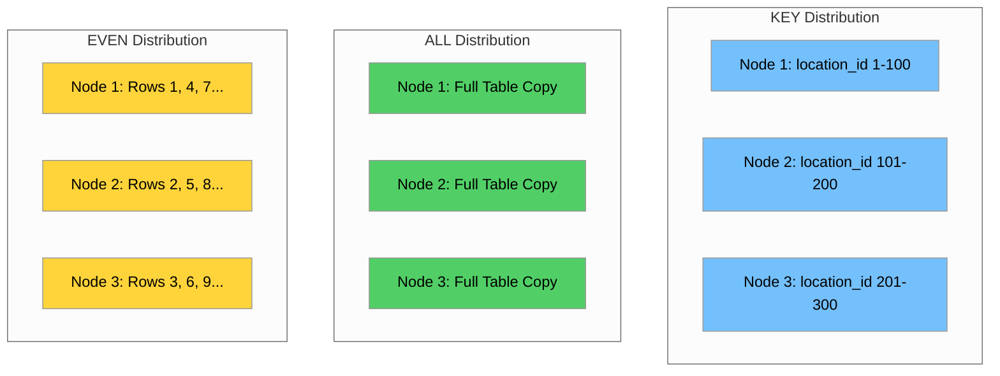
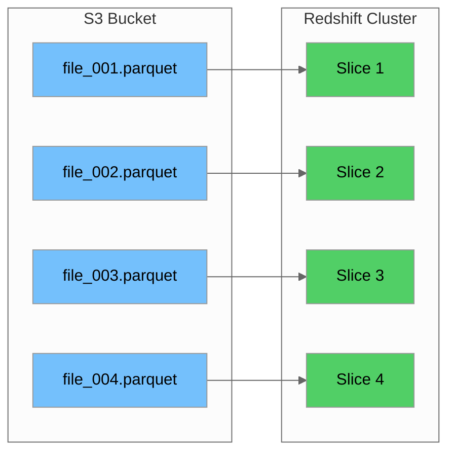
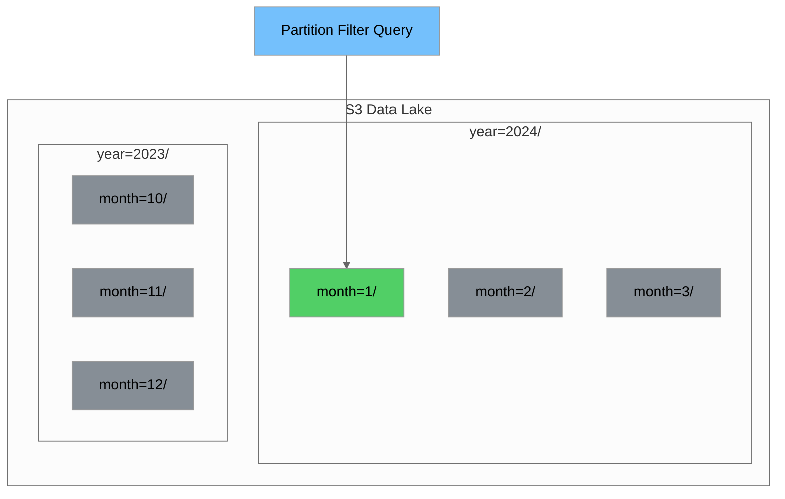
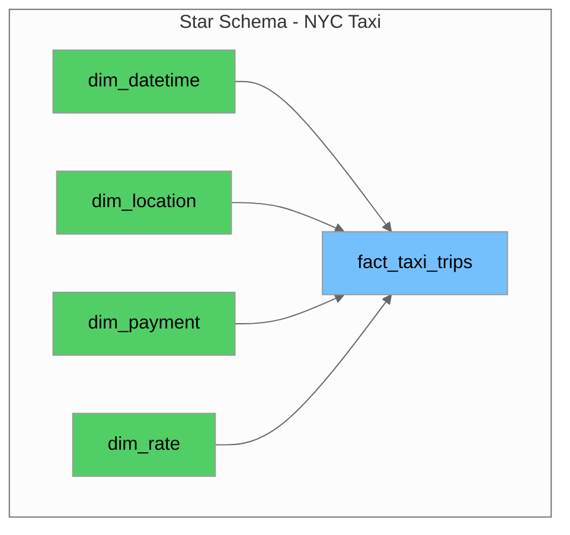
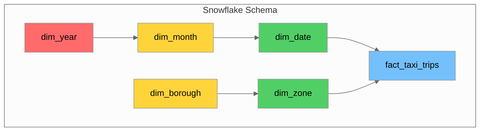
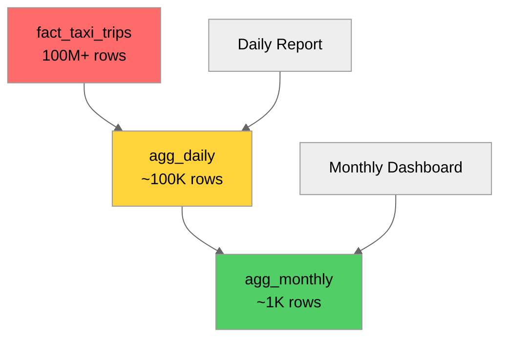
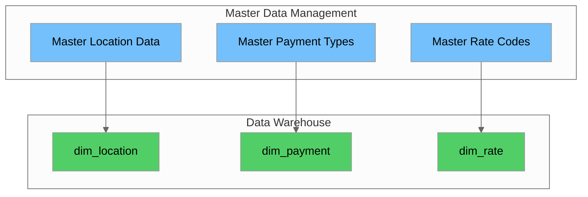

# Day 16: Amazon Redshift & Dimensional Modeling

## Table of Contents
1. [Introduction](#introduction)
2. [Redshift Architecture](#redshift-architecture)
3. [Distribution Styles](#distribution-styles)
4. [Sort Keys and Compression](#sort-keys-and-compression)
5. [COPY Commands for Bulk Loading](#copy-commands-for-bulk-loading)
6. [Redshift Spectrum for S3](#redshift-spectrum-for-s3)
7. [Star Schema and Snowflake Schema Design](#star-schema-and-snowflake-schema-design)
8. [Fact and Dimension Tables](#fact-and-dimension-tables)
9. [Conformed Dimensions](#conformed-dimensions)
10. [Aggregate Tables](#aggregate-tables)
11. [MDM in Analytics](#mdm-in-analytics)
12. [Hands-on Labs](#hands-on-labs)
13. [Summary](#summary)

---

## Introduction

Amazon Redshift is a fully managed, petabyte-scale data warehouse service in the cloud. Combined with dimensional modeling techniques, it provides a powerful platform for analytics and business intelligence. This tutorial covers Redshift's architecture, optimization techniques, and dimensional modeling principles using NYC Yellow Taxi data as our primary example.

### Learning Objectives

By the end of this tutorial, you will be able to:
- Understand Redshift's architecture and how it processes queries
- Choose appropriate distribution styles and sort keys for optimal performance
- Load data efficiently using COPY commands
- Query external data in S3 using Redshift Spectrum
- Design star and snowflake schemas for analytical workloads
- Implement fact and dimension tables with proper grain definition
- Create conformed dimensions for cross-functional reporting
- Build aggregate tables for improved query performance

---

## Redshift Architecture

Amazon Redshift uses a massively parallel processing (MPP) architecture to deliver fast query performance on large datasets.

### Clusters, Nodes, and Slices



| Component | Description | Responsibilities |
|-----------|-------------|------------------|
| **Cluster** | Collection of nodes working together | Houses the entire data warehouse |
| **Leader Node** | Single node that manages client connections | SQL parsing, query planning, result aggregation |
| **Compute Nodes** | Worker nodes that store and process data | Data storage, query execution, local aggregation |
| **Slices** | Partitions within each compute node | Parallel processing units, each with dedicated memory and disk |

### Leader Node vs Compute Nodes



**Leader Node Functions:**
- Receives and parses SQL queries
- Develops query execution plans
- Coordinates parallel execution across compute nodes
- Aggregates intermediate results
- Returns final results to the client

**Compute Node Functions:**
- Store data in columnar format
- Execute query segments in parallel
- Perform local joins and aggregations
- Return intermediate results to leader node

### Columnar Storage Architecture

Redshift stores data in a columnar format, which provides significant advantages for analytical workloads:



| Aspect | Row-Based | Columnar (Redshift) |
|--------|-----------|---------------------|
| **Read Pattern** | Reads entire rows | Reads only needed columns |
| **Compression** | Limited (mixed data types) | Excellent (same data type per column) |
| **Aggregations** | Slower (reads all columns) | Faster (reads only aggregated columns) |
| **OLTP Workloads** | Optimized | Not optimized |
| **OLAP Workloads** | Not optimized | Optimized |

### Massively Parallel Processing (MPP)

MPP distributes data and query processing across all nodes simultaneously:

```sql
-- Example: This query runs in parallel across all slices
SELECT 
    pickup_location_id,
    COUNT(*) as trip_count,
    AVG(total_amount) as avg_fare
FROM nyc_taxi_trips
WHERE pickup_datetime >= '2024-01-01'
GROUP BY pickup_location_id;
```

**How MPP Works:**
1. Data is distributed across slices based on distribution style
2. Each slice processes its portion of data independently
3. Partial results are aggregated by the leader node
4. Linear scalability as you add more nodes

### Redshift Serverless vs Provisioned

| Feature | Redshift Serverless | Redshift Provisioned |
|---------|---------------------|----------------------|
| **Management** | Fully managed, auto-scaling | Manual cluster management |
| **Pricing** | Pay per query (RPU-hours) | Pay per node-hour |
| **Scaling** | Automatic | Manual resize required |
| **Best For** | Variable workloads, development | Predictable, steady workloads |
| **Startup Time** | Seconds | Minutes |
| **Minimum Cost** | Pay only when querying | Always-on cluster cost |

**Creating a Serverless Workgroup (AWS CLI):**

```bash
# Create a Redshift Serverless namespace
aws redshift-serverless create-namespace \
    --namespace-name nyc-taxi-namespace \
    --admin-username admin \
    --admin-user-password 'YourSecurePassword123!' \
    --db-name nyc_taxi_db

# Create a workgroup
aws redshift-serverless create-workgroup \
    --workgroup-name nyc-taxi-workgroup \
    --namespace-name nyc-taxi-namespace \
    --base-capacity 32
```

**Creating a Provisioned Cluster (AWS CLI):**

```bash
# Create a provisioned Redshift cluster
aws redshift create-cluster \
    --cluster-identifier nyc-taxi-cluster \
    --node-type dc2.large \
    --number-of-nodes 2 \
    --master-username admin \
    --master-user-password 'YourSecurePassword123!' \
    --db-name nyc_taxi_db \
    --cluster-subnet-group-name my-subnet-group \
    --vpc-security-group-ids sg-xxxxxxxx
```

---

## Distribution Styles

Distribution style determines how Redshift distributes table data across compute nodes. Choosing the right distribution style is critical for query performance.

### Distribution Style Overview



### KEY Distribution

Distributes rows based on the values in a specified column. Rows with the same key value are stored on the same slice.

```sql
-- Create fact table with KEY distribution on frequently joined column
CREATE TABLE fact_taxi_trips (
    trip_id BIGINT IDENTITY(1,1),
    pickup_datetime TIMESTAMP,
    dropoff_datetime TIMESTAMP,
    pickup_location_id INTEGER,
    dropoff_location_id INTEGER,
    passenger_count INTEGER,
    trip_distance DECIMAL(10,2),
    fare_amount DECIMAL(10,2),
    total_amount DECIMAL(10,2)
)
DISTSTYLE KEY
DISTKEY (pickup_location_id);
```

**When to Use KEY:**
- Large fact tables frequently joined with dimension tables
- The distribution key column has high cardinality
- Joins are commonly performed on this column

### ALL Distribution

Copies the entire table to every node. Best for small, slowly changing dimension tables.

```sql
-- Create dimension table with ALL distribution
CREATE TABLE dim_taxi_zones (
    location_id INTEGER PRIMARY KEY,
    borough VARCHAR(50),
    zone_name VARCHAR(100),
    service_zone VARCHAR(50)
)
DISTSTYLE ALL;

-- **Note:** Redshift does not enforce PRIMARY KEY constraints - they are informational
-- only and used by the query optimizer for better execution plans. You must ensure
-- uniqueness through your ETL process or use MERGE/UPSERT patterns.
```

**When to Use ALL:**
- Small dimension tables (< 3 million rows)
- Tables frequently joined with large fact tables
- Tables that don't change frequently

### EVEN Distribution

Distributes rows round-robin across all slices. Provides uniform distribution but may require data redistribution during joins.

```sql
-- Create staging table with EVEN distribution
CREATE TABLE stg_taxi_trips (
    vendorid INTEGER,
    tpep_pickup_datetime TIMESTAMP,
    tpep_dropoff_datetime TIMESTAMP,
    passenger_count INTEGER,
    trip_distance DECIMAL(10,2),
    pickup_longitude DECIMAL(18,14),
    pickup_latitude DECIMAL(18,14),
    ratecodeid INTEGER,
    store_and_fwd_flag VARCHAR(1),
    dropoff_longitude DECIMAL(18,14),
    dropoff_latitude DECIMAL(18,14),
    payment_type INTEGER,
    fare_amount DECIMAL(10,2),
    extra DECIMAL(10,2),
    mta_tax DECIMAL(10,2),
    tip_amount DECIMAL(10,2),
    tolls_amount DECIMAL(10,2),
    improvement_surcharge DECIMAL(10,2),
    total_amount DECIMAL(10,2)
)
DISTSTYLE EVEN;
```

**When to Use EVEN:**
- Tables not frequently joined with other tables
- Staging tables for data loading
- When no clear distribution key exists

### AUTO Distribution

Lets Redshift choose the optimal distribution style based on table size.

```sql
-- Let Redshift decide the distribution style
CREATE TABLE dim_payment_types (
    payment_type_id INTEGER PRIMARY KEY,
    payment_type_name VARCHAR(50),
    description VARCHAR(200)
)
DISTSTYLE AUTO;
```

**AUTO Behavior:**
- Small tables → ALL distribution
- Large tables → EVEN distribution
- Redshift may change distribution as table grows

### Choosing the Right Distribution Style

| Table Type | Size | Join Frequency | Recommended Style |
|------------|------|----------------|-------------------|
| Large Fact Table | Millions+ rows | High | KEY (on join column) |
| Small Dimension | < 3M rows | High | ALL |
| Large Dimension | > 3M rows | High | KEY (on join column) |
| Staging Table | Variable | Low | EVEN |
| Uncertain | Any | Any | AUTO |

### Impact on Query Performance

```sql
-- Check distribution style of existing tables
SELECT 
    "table" as table_name,
    diststyle,
    sortkey1
FROM svv_table_info
WHERE schema = 'public'
ORDER BY "table";

-- Analyze query execution to see data movement
EXPLAIN
SELECT 
    z.borough,
    COUNT(*) as trip_count
FROM fact_taxi_trips t
JOIN dim_taxi_zones z ON t.pickup_location_id = z.location_id
GROUP BY z.borough;
```

**Signs of Poor Distribution:**
- `DS_BCAST_INNER` or `DS_DIST_BOTH` in EXPLAIN output (data redistribution)
- Uneven slice utilization
- Long query times for simple joins

---

## Sort Keys and Compression

Sort keys and compression are essential for optimizing storage and query performance in Redshift.

### Compound Sort Keys

Compound sort keys sort data by multiple columns in the order specified. Most effective when queries filter on the leading columns.

```sql
-- Create table with compound sort key
CREATE TABLE fact_taxi_trips_sorted (
    trip_id BIGINT IDENTITY(1,1),
    pickup_datetime TIMESTAMP,
    dropoff_datetime TIMESTAMP,
    pickup_location_id INTEGER,
    dropoff_location_id INTEGER,
    passenger_count INTEGER,
    trip_distance DECIMAL(10,2),
    fare_amount DECIMAL(10,2),
    total_amount DECIMAL(10,2)
)
DISTSTYLE KEY
DISTKEY (pickup_location_id)
COMPOUND SORTKEY (pickup_datetime, pickup_location_id);
```

**Compound Sort Key Characteristics:**
- Data sorted by first column, then second, etc.
- Most effective for range queries on leading columns
- Zone maps enable efficient block skipping
- Best for queries with predictable filter patterns

```sql
-- This query benefits from compound sort key (filters on leading column)
SELECT 
    pickup_location_id,
    SUM(total_amount) as revenue
FROM fact_taxi_trips_sorted
WHERE pickup_datetime BETWEEN '2024-01-01' AND '2024-01-31'
GROUP BY pickup_location_id;
```

### Interleaved Sort Keys

Interleaved sort keys give equal weight to each column in the sort key. Useful when queries filter on different columns unpredictably.

```sql
-- Create table with interleaved sort key
CREATE TABLE fact_taxi_trips_interleaved (
    trip_id BIGINT IDENTITY(1,1),
    pickup_datetime TIMESTAMP,
    dropoff_datetime TIMESTAMP,
    pickup_location_id INTEGER,
    dropoff_location_id INTEGER,
    passenger_count INTEGER,
    trip_distance DECIMAL(10,2),
    fare_amount DECIMAL(10,2),
    total_amount DECIMAL(10,2)
)
DISTSTYLE KEY
DISTKEY (pickup_location_id)
INTERLEAVED SORTKEY (pickup_datetime, pickup_location_id, dropoff_location_id);
```

**Interleaved Sort Key Characteristics:**
- Equal weight to all sort key columns
- Effective for ad-hoc queries with varying filters
- Higher maintenance overhead (VACUUM REINDEX required)
- Not recommended for tables with frequent updates

### Compound vs Interleaved Sort Keys

| Aspect | Compound | Interleaved |
|--------|----------|-------------|
| **Query Pattern** | Predictable, leading column filters | Ad-hoc, varying column filters |
| **Maintenance** | Low (standard VACUUM) | High (VACUUM REINDEX) |
| **Load Performance** | Faster | Slower |
| **Best For** | Time-series data, known query patterns | Exploratory analytics |
| **Column Limit** | 400 columns | 8 columns |

### Automatic Compression Encoding

Redshift automatically analyzes and applies compression when loading data with COPY:

```sql
-- Load data with automatic compression
COPY fact_taxi_trips
FROM 's3://nyc-taxi-data/yellow_tripdata_2024.parquet'
IAM_ROLE 'arn:aws:iam::123456789012:role/RedshiftLoadRole'
FORMAT AS PARQUET
COMPUPDATE ON;  -- Enable automatic compression analysis
```

### Manual Compression Selection

You can specify compression encoding for each column:

```sql
-- Create table with explicit compression encodings
CREATE TABLE fact_taxi_trips_compressed (
    trip_id BIGINT IDENTITY(1,1) ENCODE az64,
    pickup_datetime TIMESTAMP ENCODE az64,
    dropoff_datetime TIMESTAMP ENCODE az64,
    pickup_location_id INTEGER ENCODE az64,
    dropoff_location_id INTEGER ENCODE az64,
    passenger_count SMALLINT ENCODE az64,
    trip_distance DECIMAL(10,2) ENCODE az64,
    fare_amount DECIMAL(10,2) ENCODE az64,
    extra DECIMAL(10,2) ENCODE runlength,  -- Many repeated values
    mta_tax DECIMAL(10,2) ENCODE runlength,  -- Fixed value
    tip_amount DECIMAL(10,2) ENCODE az64,
    tolls_amount DECIMAL(10,2) ENCODE mostly8,  -- Many zeros
    total_amount DECIMAL(10,2) ENCODE az64,
    payment_type SMALLINT ENCODE bytedict,  -- Few distinct values
    rate_code SMALLINT ENCODE bytedict
)
DISTSTYLE KEY
DISTKEY (pickup_location_id)
SORTKEY (pickup_datetime);
```

### Compression Encoding Types

| Encoding | Best For | Description |
|----------|----------|-------------|
| **AZ64** | Numeric, datetime | Amazon's proprietary algorithm, best general-purpose |
| **LZO** | VARCHAR, large strings | Good compression for text data |
| **ZSTD** | VARCHAR, mixed data | High compression ratio |
| **BYTEDICT** | Low cardinality columns | Dictionary encoding for few distinct values |
| **RUNLENGTH** | Sorted columns with repeats | Consecutive identical values |
| **DELTA** | Datetime, sequential numbers | Stores differences between values |
| **MOSTLY8/16/32** | Numeric with outliers | Compresses most values, stores outliers separately |
| **RAW** | None | No compression (sort key columns) |

### ANALYZE COMPRESSION Command

Use ANALYZE COMPRESSION to get compression recommendations:

```sql
-- Analyze compression for an existing table
ANALYZE COMPRESSION fact_taxi_trips;

-- Results show recommended encoding for each column
-- Column          | Encoding | Est_reduction_pct
-- ----------------+----------+------------------
-- trip_id         | az64     | 75.00
-- pickup_datetime | az64     | 60.00
-- fare_amount     | az64     | 55.00
-- payment_type    | bytedict | 90.00
```

---

## COPY Commands for Bulk Loading

The COPY command is the most efficient way to load data into Redshift, leveraging parallel processing across all nodes.

### Loading from S3

```sql
-- Basic COPY from S3 (Parquet format)
COPY fact_taxi_trips
FROM 's3://nyc-taxi-data/yellow_tripdata_2024.parquet'
IAM_ROLE 'arn:aws:iam::123456789012:role/RedshiftLoadRole'
FORMAT AS PARQUET;

-- COPY from S3 (CSV format)
COPY stg_taxi_trips
FROM 's3://nyc-taxi-data/yellow_tripdata_2024.csv'
IAM_ROLE 'arn:aws:iam::123456789012:role/RedshiftLoadRole'
DELIMITER ','
IGNOREHEADER 1
DATEFORMAT 'auto'
TIMEFORMAT 'auto'
REGION 'us-east-1';
```

### COPY Command Options and Best Practices

```sql
-- Comprehensive COPY with best practice options
COPY fact_taxi_trips (
    pickup_datetime,
    dropoff_datetime,
    pickup_location_id,
    dropoff_location_id,
    passenger_count,
    trip_distance,
    fare_amount,
    total_amount
)
FROM 's3://nyc-taxi-data/yellow_tripdata_2024/'
IAM_ROLE 'arn:aws:iam::123456789012:role/RedshiftLoadRole'
FORMAT AS PARQUET
COMPUPDATE ON           -- Analyze and apply compression
STATUPDATE ON           -- Update table statistics
MAXERROR 100            -- Allow up to 100 errors
ACCEPTINVCHARS '?'      -- Replace invalid UTF-8 with ?
TRUNCATECOLUMNS;        -- Truncate data exceeding column width
```

| Option | Description | Recommendation |
|--------|-------------|----------------|
| `COMPUPDATE` | Analyze compression | ON for initial load, OFF for incremental |
| `STATUPDATE` | Update statistics | ON for better query planning |
| `MAXERROR` | Error tolerance | Set based on data quality expectations |
| `ACCEPTINVCHARS` | Handle invalid characters | Use for dirty data |
| `TRUNCATECOLUMNS` | Handle oversized data | Use cautiously, may lose data |
| `BLANKSASNULL` | Treat blanks as NULL | Useful for CSV files |
| `EMPTYASNULL` | Treat empty strings as NULL | Useful for CSV files |

### Manifest Files for Loading

Manifest files provide explicit control over which files to load:

```json
{
  "entries": [
    {"url": "s3://nyc-taxi-data/2024/01/yellow_tripdata_2024-01.parquet", "mandatory": true},
    {"url": "s3://nyc-taxi-data/2024/02/yellow_tripdata_2024-02.parquet", "mandatory": true},
    {"url": "s3://nyc-taxi-data/2024/03/yellow_tripdata_2024-03.parquet", "mandatory": true}
  ]
}
```

```sql
-- Load using manifest file
COPY fact_taxi_trips
FROM 's3://nyc-taxi-data/manifests/q1_2024_manifest.json'
IAM_ROLE 'arn:aws:iam::123456789012:role/RedshiftLoadRole'
FORMAT AS PARQUET
MANIFEST;
```

**Benefits of Manifest Files:**
- Explicit file list (no pattern matching issues)
- Mandatory flag ensures all files are present
- Atomic loads (all or nothing)
- Version control for load configurations

### Error Handling and Validation

```sql
-- Check for load errors
SELECT 
    query,
    filename,
    line_number,
    colname,
    type,
    raw_field_value,
    err_reason
FROM stl_load_errors
WHERE query = pg_last_copy_id()
ORDER BY query DESC
LIMIT 20;

-- Check load commit status
SELECT 
    query,
    filename,
    lines_scanned,
    lines_loaded,
    bytes_loaded,
    status
FROM stl_load_commits
WHERE query = pg_last_copy_id();

-- Validate data after load
SELECT 
    COUNT(*) as total_rows,
    COUNT(DISTINCT pickup_location_id) as unique_locations,
    MIN(pickup_datetime) as earliest_trip,
    MAX(pickup_datetime) as latest_trip,
    SUM(CASE WHEN total_amount < 0 THEN 1 ELSE 0 END) as negative_amounts
FROM fact_taxi_trips;
```

### Loading Different File Formats

**CSV Format:**
```sql
COPY stg_taxi_trips
FROM 's3://nyc-taxi-data/csv/yellow_tripdata.csv'
IAM_ROLE 'arn:aws:iam::123456789012:role/RedshiftLoadRole'
DELIMITER ','
IGNOREHEADER 1
DATEFORMAT 'YYYY-MM-DD'
TIMEFORMAT 'YYYY-MM-DD HH:MI:SS'
NULL AS 'NULL'
ESCAPE
REMOVEQUOTES;
```

**Parquet Format (Recommended):**
```sql
COPY fact_taxi_trips
FROM 's3://nyc-taxi-data/parquet/yellow_tripdata.parquet'
IAM_ROLE 'arn:aws:iam::123456789012:role/RedshiftLoadRole'
FORMAT AS PARQUET;
```

**JSON Format:**
```sql
COPY dim_taxi_zones
FROM 's3://nyc-taxi-data/json/taxi_zones.json'
IAM_ROLE 'arn:aws:iam::123456789012:role/RedshiftLoadRole'
FORMAT AS JSON 'auto';

-- Or with JSONPaths file for complex JSON
COPY dim_taxi_zones
FROM 's3://nyc-taxi-data/json/taxi_zones.json'
IAM_ROLE 'arn:aws:iam::123456789012:role/RedshiftLoadRole'
FORMAT AS JSON 's3://nyc-taxi-data/json/taxi_zones_jsonpaths.json';
```

**Gzip Compressed Files:**
```sql
COPY fact_taxi_trips
FROM 's3://nyc-taxi-data/compressed/yellow_tripdata.csv.gz'
IAM_ROLE 'arn:aws:iam::123456789012:role/RedshiftLoadRole'
DELIMITER ','
GZIP
IGNOREHEADER 1;
```

### Parallel Loading Best Practices



**Best Practices:**
1. **Split files**: Number of files should be a multiple of slices
2. **Uniform file sizes**: Each file should be 1MB - 1GB
3. **Use compression**: Gzip or Snappy for faster transfers
4. **Parquet format**: Best performance and automatic schema detection

---

## Redshift Spectrum for S3

Redshift Spectrum allows you to query data directly in S3 without loading it into Redshift tables.

### External Schemas and Tables

```sql
-- Create external schema pointing to AWS Glue Data Catalog
CREATE EXTERNAL SCHEMA spectrum_schema
FROM DATA CATALOG
DATABASE 'nyc_taxi_db'
IAM_ROLE 'arn:aws:iam::123456789012:role/RedshiftSpectrumRole'
CREATE EXTERNAL DATABASE IF NOT EXISTS;

-- Create external table for S3 data
CREATE EXTERNAL TABLE spectrum_schema.ext_taxi_trips (
    vendorid INTEGER,
    tpep_pickup_datetime TIMESTAMP,
    tpep_dropoff_datetime TIMESTAMP,
    passenger_count INTEGER,
    trip_distance DOUBLE PRECISION,
    ratecodeid INTEGER,
    store_and_fwd_flag VARCHAR(1),
    pulocationid INTEGER,
    dolocationid INTEGER,
    payment_type INTEGER,
    fare_amount DOUBLE PRECISION,
    extra DOUBLE PRECISION,
    mta_tax DOUBLE PRECISION,
    tip_amount DOUBLE PRECISION,
    tolls_amount DOUBLE PRECISION,
    improvement_surcharge DOUBLE PRECISION,
    total_amount DOUBLE PRECISION
)
PARTITIONED BY (year INTEGER, month INTEGER)
STORED AS PARQUET
LOCATION 's3://nyc-taxi-data/parquet/';
```

### Querying Data in S3 Directly

```sql
-- Add partitions to external table
ALTER TABLE spectrum_schema.ext_taxi_trips
ADD PARTITION (year=2024, month=1)
LOCATION 's3://nyc-taxi-data/parquet/year=2024/month=1/';

ALTER TABLE spectrum_schema.ext_taxi_trips
ADD PARTITION (year=2024, month=2)
LOCATION 's3://nyc-taxi-data/parquet/year=2024/month=2/';

-- Query external table (data stays in S3)
SELECT 
    year,
    month,
    COUNT(*) as trip_count,
    AVG(total_amount) as avg_fare
FROM spectrum_schema.ext_taxi_trips
WHERE year = 2024
GROUP BY year, month
ORDER BY year, month;

-- Join external table with local dimension table
SELECT 
    z.borough,
    z.zone_name,
    COUNT(*) as trip_count,
    SUM(e.total_amount) as total_revenue
FROM spectrum_schema.ext_taxi_trips e
JOIN dim_taxi_zones z ON e.pulocationid = z.location_id
WHERE e.year = 2024 AND e.month = 1
GROUP BY z.borough, z.zone_name
ORDER BY total_revenue DESC
LIMIT 10;
```

### Partitioning External Tables



**Partition Pruning Benefits:**
- Only scans relevant partitions
- Dramatically reduces data scanned
- Lower costs (Spectrum charges per TB scanned)
- Faster query execution

```sql
-- Query with partition pruning
SELECT
    pulocationid,
    COUNT(*) as trips,
    AVG(total_amount) as avg_fare
FROM spectrum_schema.ext_taxi_trips
WHERE year = 2024
  AND month BETWEEN 1 AND 3
GROUP BY pulocationid;
```

### Performance Optimization

| Optimization | Description | Impact |
|--------------|-------------|--------|
| **Partition Pruning** | Filter on partition columns | Reduces data scanned |
| **Column Projection** | Select only needed columns | Reduces data transferred |
| **Predicate Pushdown** | Filter early in S3 | Reduces data processed |
| **File Format** | Use Parquet or ORC | Better compression |
| **File Size** | 100MB - 1GB per file | Optimal parallelism |

### Cost Considerations

| Factor | Cost Impact | Optimization |
|--------|-------------|--------------|
| **Data Scanned** | $5 per TB scanned | Use partitioning |
| **File Format** | Parquet ~10x cheaper than CSV | Convert to Parquet |
| **Compression** | Reduces bytes scanned | Use Snappy or Gzip |

---

## Star Schema and Snowflake Schema Design

Dimensional modeling organizes data into facts and dimensions for optimal analytical query performance.

### Star Schema Principles



**Star Schema Characteristics:**
- Denormalized dimension tables
- Single join between fact and dimension
- Optimized for query performance
- Easy to understand and navigate

```sql
-- Dimension: Date/Time
CREATE TABLE dim_datetime (
    date_key INTEGER PRIMARY KEY ENCODE az64,
    full_date DATE NOT NULL,
    year SMALLINT NOT NULL ENCODE az64,
    quarter SMALLINT NOT NULL ENCODE az64,
    month SMALLINT NOT NULL ENCODE az64,
    month_name VARCHAR(10) NOT NULL ENCODE lzo,
    day_of_week SMALLINT NOT NULL ENCODE az64,
    day_name VARCHAR(10) NOT NULL ENCODE lzo,
    is_weekend BOOLEAN NOT NULL,
    is_holiday BOOLEAN NOT NULL
)
DISTSTYLE ALL
SORTKEY (date_key);

-- Dimension: Location
CREATE TABLE dim_location (
    location_id INTEGER PRIMARY KEY ENCODE az64,
    borough VARCHAR(50) NOT NULL ENCODE lzo,
    zone_name VARCHAR(100) NOT NULL ENCODE lzo,
    service_zone VARCHAR(50) NOT NULL ENCODE lzo
)
DISTSTYLE ALL
SORTKEY (location_id);

-- Fact: Taxi Trips
CREATE TABLE fact_taxi_trips (
    trip_id BIGINT IDENTITY(1,1) ENCODE az64,
    date_key INTEGER NOT NULL ENCODE az64,
    pickup_location_id INTEGER NOT NULL ENCODE az64,
    dropoff_location_id INTEGER NOT NULL ENCODE az64,
    payment_id INTEGER NOT NULL ENCODE az64,
    passenger_count SMALLINT ENCODE az64,
    trip_distance DECIMAL(10,2) ENCODE az64,
    fare_amount DECIMAL(10,2) ENCODE az64,
    tip_amount DECIMAL(10,2) ENCODE az64,
    total_amount DECIMAL(10,2) ENCODE az64
)
DISTSTYLE KEY
DISTKEY (pickup_location_id)
SORTKEY (date_key, pickup_location_id);
```

### Snowflake Schema Principles



**Snowflake Schema Characteristics:**
- Normalized dimension tables
- Multiple joins required
- Reduced storage (less redundancy)
- More complex queries

### When to Use Each Approach

| Criteria | Star Schema | Snowflake Schema |
|----------|-------------|------------------|
| **Query Performance** | Faster (fewer joins) | Slower (more joins) |
| **Storage** | More (denormalized) | Less (normalized) |
| **Complexity** | Simpler | More complex |
| **Best For** | Most analytics | Storage-constrained |

**Recommendation:** Use **Star Schema** for Redshift - it's optimized for denormalized data.

---

## Fact and Dimension Tables

### Types of Fact Tables

| Type | Description | Example |
|------|-------------|---------|
| **Transaction** | Individual events | Each taxi trip |
| **Periodic Snapshot** | Regular intervals | Daily trip summary |
| **Accumulating Snapshot** | Process milestones | Trip lifecycle |

```sql
-- Transaction Fact: Each taxi trip
CREATE TABLE fact_taxi_trips_transaction (
    trip_id BIGINT IDENTITY(1,1),
    pickup_datetime TIMESTAMP NOT NULL,
    dropoff_datetime TIMESTAMP NOT NULL,
    pickup_location_id INTEGER NOT NULL,
    dropoff_location_id INTEGER NOT NULL,
    passenger_count SMALLINT,
    trip_distance DECIMAL(10,2),
    fare_amount DECIMAL(10,2),
    total_amount DECIMAL(10,2)
)
DISTSTYLE KEY
DISTKEY (pickup_location_id)
SORTKEY (pickup_datetime);

-- Periodic Snapshot: Daily summary
CREATE TABLE fact_daily_location_summary (
    snapshot_date DATE NOT NULL,
    location_id INTEGER NOT NULL,
    total_trips INTEGER,
    total_passengers INTEGER,
    total_revenue DECIMAL(12,2),
    avg_fare DECIMAL(10,2),
    PRIMARY KEY (snapshot_date, location_id)
)
DISTSTYLE KEY
DISTKEY (location_id)
SORTKEY (snapshot_date);
```

### Types of Dimensions

| Type | Description | Example |
|------|-------------|---------|
| **Conformed** | Shared across fact tables | dim_location |
| **Role-Playing** | Same dimension, multiple roles | pickup/dropoff location |
| **Junk** | Combines low-cardinality flags | Trip flags |
| **Degenerate** | Attribute in fact table | Trip ID |

```sql
-- Role-Playing Dimension Example
SELECT
    f.trip_id,
    pickup.zone_name as pickup_zone,
    pickup.borough as pickup_borough,
    dropoff.zone_name as dropoff_zone,
    dropoff.borough as dropoff_borough,
    f.total_amount
FROM fact_taxi_trips f
JOIN dim_location pickup ON f.pickup_location_id = pickup.location_id
JOIN dim_location dropoff ON f.dropoff_location_id = dropoff.location_id
WHERE pickup.borough = 'Manhattan'
  AND dropoff.borough = 'Brooklyn';

-- Junk Dimension
CREATE TABLE dim_trip_flags (
    flag_key INTEGER PRIMARY KEY,
    store_and_fwd_flag VARCHAR(1),
    is_shared_ride BOOLEAN,
    is_airport_trip BOOLEAN,
    is_rush_hour BOOLEAN
)
DISTSTYLE ALL;
```

### Grain Definition

The grain defines what one row represents in a fact table.

```sql
-- Atomic grain: One row = One taxi trip
CREATE TABLE fact_taxi_trips_atomic (
    trip_id BIGINT PRIMARY KEY,
    pickup_datetime TIMESTAMP,
    pickup_location_id INTEGER,
    passenger_count SMALLINT,
    total_amount DECIMAL(10,2)
);

-- Aggregated grain: One row = One location + One day
CREATE TABLE fact_location_daily (
    date_key INTEGER,
    location_id INTEGER,
    trip_count INTEGER,
    total_revenue DECIMAL(12,2),
    PRIMARY KEY (date_key, location_id)
);
```

### Measure Types

| Type | Description | Example | Aggregation |
|------|-------------|---------|-------------|
| **Additive** | Sum across all dimensions | fare_amount | SUM() |
| **Semi-Additive** | Sum across some dimensions | account_balance | AVG() over time |
| **Non-Additive** | Cannot be summed | avg_speed | Must recalculate |

```sql
-- Additive measures
SELECT
    l.borough,
    SUM(f.fare_amount) as total_fares,
    COUNT(*) as trip_count
FROM fact_taxi_trips f
JOIN dim_location l ON f.pickup_location_id = l.location_id
GROUP BY l.borough;

-- Non-additive: Must recalculate
SELECT
    l.borough,
    SUM(f.trip_distance) / NULLIF(SUM(f.trip_duration_hours), 0) as avg_speed
FROM fact_taxi_trips f
JOIN dim_location l ON f.pickup_location_id = l.location_id
GROUP BY l.borough;
```

---

## Conformed Dimensions

Conformed dimensions are shared across multiple fact tables, ensuring consistent analysis.

### Benefits

| Benefit | Description |
|---------|-------------|
| **Consistency** | Same values across all reports |
| **Drill-Across** | Query multiple fact tables together |
| **Single Source** | One place to update |
| **Cross-Functional** | Compare metrics across domains |

### Implementation

```sql
-- Create conformed dimension in central schema
CREATE SCHEMA conformed;

CREATE TABLE conformed.dim_location (
    location_id INTEGER PRIMARY KEY,
    zone_name VARCHAR(100) NOT NULL,
    borough VARCHAR(50) NOT NULL,
    service_zone VARCHAR(50) NOT NULL,
    is_current BOOLEAN DEFAULT TRUE,
    effective_date DATE DEFAULT CURRENT_DATE
)
DISTSTYLE ALL;

-- Create views in data mart schemas
CREATE SCHEMA trip_mart;
CREATE VIEW trip_mart.dim_location AS
SELECT * FROM conformed.dim_location;

-- Cross-functional query
WITH trip_metrics AS (
    SELECT
        l.borough,
        COUNT(*) as trip_count,
        SUM(f.total_amount) as trip_revenue
    FROM trip_mart.fact_taxi_trips f
    JOIN conformed.dim_location l ON f.pickup_location_id = l.location_id
    GROUP BY l.borough
)
SELECT * FROM trip_metrics ORDER BY trip_revenue DESC;
```

---

## Aggregate Tables

Aggregate tables store pre-computed summaries for faster queries.

### Pre-Aggregation Strategy



```sql
-- Daily aggregate
CREATE TABLE agg_daily_location (
    date_key INTEGER NOT NULL,
    location_id INTEGER NOT NULL,
    trip_count INTEGER,
    total_revenue DECIMAL(12,2),
    avg_fare DECIMAL(10,2),
    PRIMARY KEY (date_key, location_id)
)
DISTSTYLE KEY
DISTKEY (location_id)
SORTKEY (date_key);

-- Populate aggregate
INSERT INTO agg_daily_location
SELECT
    d.date_key,
    f.pickup_location_id,
    COUNT(*) as trip_count,
    SUM(f.total_amount) as total_revenue,
    AVG(f.fare_amount) as avg_fare
FROM fact_taxi_trips f
JOIN dim_datetime d ON DATE(f.pickup_datetime) = d.full_date
GROUP BY d.date_key, f.pickup_location_id;
```

### Materialized Views

```sql
-- Create materialized view
CREATE MATERIALIZED VIEW mv_daily_borough_summary
DISTSTYLE ALL
SORTKEY (snapshot_date)
AUTO REFRESH YES
AS
SELECT
    DATE(f.pickup_datetime) as snapshot_date,
    l.borough,
    COUNT(*) as trip_count,
    SUM(f.total_amount) as total_revenue,
    AVG(f.total_amount) as avg_fare
FROM fact_taxi_trips f
JOIN dim_location l ON f.pickup_location_id = l.location_id
GROUP BY DATE(f.pickup_datetime), l.borough;

-- Query materialized view
SELECT
    borough,
    SUM(trip_count) as monthly_trips,
    SUM(total_revenue) as monthly_revenue
FROM mv_daily_borough_summary
WHERE snapshot_date BETWEEN '2024-01-01' AND '2024-01-31'
GROUP BY borough;

-- Manual refresh
REFRESH MATERIALIZED VIEW mv_daily_borough_summary;
```

---

## MDM in Analytics

Master Data Management (MDM) ensures consistent, accurate dimension data across the analytics platform.

### Dimension Tables as Master Data



### Data Quality in Dimensional Models

```sql
-- Data quality checks for dimension tables
-- Check for duplicate keys
SELECT location_id, COUNT(*) as cnt
FROM dim_location
GROUP BY location_id
HAVING COUNT(*) > 1;

-- Check for NULL required fields
SELECT COUNT(*) as null_boroughs
FROM dim_location
WHERE borough IS NULL;

-- Check referential integrity
SELECT f.pickup_location_id, COUNT(*) as orphan_trips
FROM fact_taxi_trips f
LEFT JOIN dim_location l ON f.pickup_location_id = l.location_id
WHERE l.location_id IS NULL
GROUP BY f.pickup_location_id;

-- SCD Type 2 for tracking changes
CREATE TABLE dim_location_scd2 (
    location_sk BIGINT IDENTITY(1,1) PRIMARY KEY,
    location_id INTEGER NOT NULL,
    zone_name VARCHAR(100) NOT NULL,
    borough VARCHAR(50) NOT NULL,
    service_zone VARCHAR(50) NOT NULL,
    effective_date DATE NOT NULL,
    expiration_date DATE DEFAULT '9999-12-31',
    is_current BOOLEAN DEFAULT TRUE
)
DISTSTYLE ALL;
```

### Conforming Dimensions Across Data Marts

| Principle | Implementation |
|-----------|----------------|
| **Single Source** | Central conformed schema |
| **Consistent Keys** | Same surrogate keys everywhere |
| **Synchronized Updates** | Coordinated refresh process |
| **Version Control** | Track dimension changes |

---

## Hands-on Labs

### Lab 1: Provision Redshift Cluster

```bash
# Option A: Create Redshift Serverless (recommended for learning)
aws redshift-serverless create-namespace \
    --namespace-name nyc-taxi-ns \
    --admin-username admin \
    --admin-user-password 'SecurePass123!' \
    --db-name nyc_taxi

aws redshift-serverless create-workgroup \
    --workgroup-name nyc-taxi-wg \
    --namespace-name nyc-taxi-ns \
    --base-capacity 8

# Option B: Create Provisioned Cluster
aws redshift create-cluster \
    --cluster-identifier nyc-taxi-cluster \
    --node-type dc2.large \
    --number-of-nodes 2 \
    --master-username admin \
    --master-user-password 'SecurePass123!' \
    --db-name nyc_taxi

# Check cluster status
aws redshift describe-clusters \
    --cluster-identifier nyc-taxi-cluster \
    --query 'Clusters[0].ClusterStatus'
```

### Lab 2: Design Dimensional Model for NYC Taxi Data

```sql
-- Step 1: Create dimension tables
CREATE TABLE dim_datetime (
    date_key INTEGER PRIMARY KEY,
    full_date DATE NOT NULL,
    year SMALLINT NOT NULL,
    month SMALLINT NOT NULL,
    month_name VARCHAR(10) NOT NULL,
    day_of_week SMALLINT NOT NULL,
    day_name VARCHAR(10) NOT NULL,
    is_weekend BOOLEAN NOT NULL
)
DISTSTYLE ALL;

CREATE TABLE dim_location (
    location_id INTEGER PRIMARY KEY,
    borough VARCHAR(50),
    zone_name VARCHAR(100),
    service_zone VARCHAR(50)
)
DISTSTYLE ALL;

CREATE TABLE dim_payment (
    payment_id INTEGER PRIMARY KEY,
    payment_name VARCHAR(50)
)
DISTSTYLE ALL;

CREATE TABLE dim_rate (
    rate_id INTEGER PRIMARY KEY,
    rate_name VARCHAR(50)
)
DISTSTYLE ALL;

-- Step 2: Create fact table
CREATE TABLE fact_taxi_trips (
    trip_id BIGINT IDENTITY(1,1),
    date_key INTEGER NOT NULL,
    pickup_hour SMALLINT NOT NULL,
    pickup_location_id INTEGER NOT NULL,
    dropoff_location_id INTEGER NOT NULL,
    payment_id INTEGER NOT NULL,
    rate_id INTEGER NOT NULL,
    passenger_count SMALLINT,
    trip_distance DECIMAL(10,2),
    fare_amount DECIMAL(10,2),
    tip_amount DECIMAL(10,2),
    tolls_amount DECIMAL(10,2),
    total_amount DECIMAL(10,2)
)
DISTSTYLE KEY
DISTKEY (pickup_location_id)
SORTKEY (date_key, pickup_location_id);
```

### Lab 3: Load Data from S3 Using COPY

```sql
-- Step 1: Create IAM role for Redshift (done in AWS Console or CLI)
-- Step 2: Load dimension data

-- Load location dimension from CSV
COPY dim_location
FROM 's3://your-bucket/taxi_zone_lookup.csv'
IAM_ROLE 'arn:aws:iam::123456789012:role/RedshiftLoadRole'
DELIMITER ','
IGNOREHEADER 1;

-- Load payment dimension
INSERT INTO dim_payment VALUES
(1, 'Credit card'),
(2, 'Cash'),
(3, 'No charge'),
(4, 'Dispute'),
(5, 'Unknown'),
(6, 'Voided trip');

-- Load rate dimension
INSERT INTO dim_rate VALUES
(1, 'Standard rate'),
(2, 'JFK'),
(3, 'Newark'),
(4, 'Nassau or Westchester'),
(5, 'Negotiated fare'),
(6, 'Group ride');

-- Populate date dimension (Redshift-compatible syntax)
INSERT INTO dim_datetime
WITH RECURSIVE date_series AS (
    -- Base case: start date
    SELECT '2024-01-01'::DATE AS d
    UNION ALL
    -- Recursive case: add one day using DATEADD (Redshift function)
    SELECT DATEADD(day, 1, d)
    FROM date_series
    WHERE d < '2024-12-31'
)
SELECT
    TO_CHAR(d, 'YYYYMMDD')::INTEGER AS date_key,
    d AS full_date,
    EXTRACT(YEAR FROM d)::SMALLINT AS year,
    EXTRACT(MONTH FROM d)::SMALLINT AS month,
    TO_CHAR(d, 'Month') AS month_name,
    EXTRACT(DOW FROM d)::SMALLINT AS day_of_week,
    TO_CHAR(d, 'Day') AS day_name,
    CASE WHEN EXTRACT(DOW FROM d) IN (0, 6) THEN TRUE ELSE FALSE END AS is_weekend
FROM date_series;

-- Alternative approach using generate_series (if available in your Redshift version)
-- Note: generate_series is available in Redshift Serverless and recent provisioned versions
/*
INSERT INTO dim_datetime
SELECT
    TO_CHAR(d::DATE, 'YYYYMMDD')::INTEGER AS date_key,
    d::DATE AS full_date,
    EXTRACT(YEAR FROM d)::SMALLINT AS year,
    EXTRACT(MONTH FROM d)::SMALLINT AS month,
    TO_CHAR(d::DATE, 'Month') AS month_name,
    EXTRACT(DOW FROM d)::SMALLINT AS day_of_week,
    TO_CHAR(d::DATE, 'Day') AS day_name,
    CASE WHEN EXTRACT(DOW FROM d) IN (0, 6) THEN TRUE ELSE FALSE END AS is_weekend
FROM generate_series('2024-01-01'::DATE, '2024-12-31'::DATE, '1 day'::INTERVAL) AS d;
*/

-- Load fact data from Parquet
COPY fact_taxi_trips (
    date_key, pickup_hour, pickup_location_id, dropoff_location_id,
    payment_id, rate_id, passenger_count, trip_distance,
    fare_amount, tip_amount, tolls_amount, total_amount
)
FROM 's3://your-bucket/yellow_tripdata_2024.parquet'
IAM_ROLE 'arn:aws:iam::123456789012:role/RedshiftLoadRole'
FORMAT AS PARQUET;
```

### Lab 4: Optimize with Distribution/Sort Keys

```sql
-- Check current table design
SELECT
    "table",
    diststyle,
    sortkey1,
    size as size_mb,
    tbl_rows
FROM svv_table_info
WHERE schema = 'public'
ORDER BY size DESC;

-- Analyze query performance
EXPLAIN
SELECT
    l.borough,
    d.month_name,
    COUNT(*) as trips,
    SUM(f.total_amount) as revenue
FROM fact_taxi_trips f
JOIN dim_location l ON f.pickup_location_id = l.location_id
JOIN dim_datetime d ON f.date_key = d.date_key
WHERE d.year = 2024
GROUP BY l.borough, d.month_name;

-- Check for data skew
SELECT
    slice,
    COUNT(*) as rows
FROM stv_blocklist b
JOIN stv_tbl_perm t ON b.tbl = t.id
WHERE t.name = 'fact_taxi_trips'
GROUP BY slice
ORDER BY slice;

-- Vacuum and analyze after loading
VACUUM fact_taxi_trips;
ANALYZE fact_taxi_trips;
```

### Lab 5: Run Analytical Queries

```sql
-- Query 1: Revenue by borough and month
SELECT
    l.borough,
    d.month_name,
    COUNT(*) as trip_count,
    SUM(f.total_amount) as total_revenue,
    AVG(f.total_amount) as avg_fare,
    AVG(f.tip_amount) as avg_tip
FROM fact_taxi_trips f
JOIN dim_location l ON f.pickup_location_id = l.location_id
JOIN dim_datetime d ON f.date_key = d.date_key
WHERE d.year = 2024
GROUP BY l.borough, d.month_name
ORDER BY l.borough, d.month;

-- Query 2: Peak hours analysis
SELECT
    f.pickup_hour,
    CASE
        WHEN f.pickup_hour BETWEEN 7 AND 9 THEN 'Morning Rush'
        WHEN f.pickup_hour BETWEEN 17 AND 19 THEN 'Evening Rush'
        WHEN f.pickup_hour BETWEEN 22 AND 23 OR f.pickup_hour BETWEEN 0 AND 5 THEN 'Night'
        ELSE 'Off-Peak'
    END as time_period,
    COUNT(*) as trips,
    AVG(f.trip_distance) as avg_distance,
    AVG(f.total_amount) as avg_fare
FROM fact_taxi_trips f
GROUP BY f.pickup_hour
ORDER BY f.pickup_hour;

-- Query 3: Top routes
SELECT
    pickup.zone_name as pickup_zone,
    dropoff.zone_name as dropoff_zone,
    COUNT(*) as trip_count,
    AVG(f.total_amount) as avg_fare,
    AVG(f.trip_distance) as avg_distance
FROM fact_taxi_trips f
JOIN dim_location pickup ON f.pickup_location_id = pickup.location_id
JOIN dim_location dropoff ON f.dropoff_location_id = dropoff.location_id
GROUP BY pickup.zone_name, dropoff.zone_name
ORDER BY trip_count DESC
LIMIT 20;

-- Query 4: Payment method analysis
SELECT
    p.payment_name,
    COUNT(*) as trip_count,
    SUM(f.total_amount) as total_revenue,
    AVG(f.tip_amount) as avg_tip,
    AVG(CASE WHEN f.fare_amount > 0
        THEN f.tip_amount / f.fare_amount * 100
        ELSE 0 END) as tip_percentage
FROM fact_taxi_trips f
JOIN dim_payment p ON f.payment_id = p.payment_id
GROUP BY p.payment_name
ORDER BY trip_count DESC;

-- Query 5: Weekend vs Weekday comparison
SELECT
    CASE WHEN d.is_weekend THEN 'Weekend' ELSE 'Weekday' END as day_type,
    l.borough,
    COUNT(*) as trips,
    AVG(f.total_amount) as avg_fare,
    AVG(f.trip_distance) as avg_distance
FROM fact_taxi_trips f
JOIN dim_datetime d ON f.date_key = d.date_key
JOIN dim_location l ON f.pickup_location_id = l.location_id
GROUP BY d.is_weekend, l.borough
ORDER BY day_type, trips DESC;
```

---

## Summary

### Key Takeaways

| Topic | Key Points |
|-------|------------|
| **Redshift Architecture** | MPP, columnar storage, leader + compute nodes |
| **Distribution Styles** | KEY for large facts, ALL for small dims, EVEN for staging |
| **Sort Keys** | Compound for predictable queries, interleaved for ad-hoc |
| **COPY Command** | Parallel loading, use Parquet, split files |
| **Spectrum** | Query S3 directly, partition for cost savings |
| **Star Schema** | Denormalized dims, single joins, best for Redshift |
| **Fact Tables** | Transaction, periodic snapshot, accumulating snapshot |
| **Dimensions** | Conformed, role-playing, junk, degenerate |
| **Aggregates** | Pre-compute summaries, use materialized views |
| **MDM** | Consistent dimensions, data quality, SCD tracking |

### Best Practices Checklist

- [ ] Choose appropriate distribution style for each table
- [ ] Define sort keys based on query patterns
- [ ] Use COPY command for bulk loading
- [ ] Partition external tables for Spectrum
- [ ] Design star schema for analytical workloads
- [ ] Define clear grain for fact tables
- [ ] Create conformed dimensions for consistency
- [ ] Build aggregate tables for common queries
- [ ] Implement data quality checks
- [ ] Monitor query performance with EXPLAIN

### Next Steps

1. Practice with the hands-on labs
2. Experiment with different distribution styles
3. Build a complete dimensional model for your use case
4. Optimize queries using EXPLAIN analysis
5. Explore Redshift ML for predictive analytics

---

## Additional Resources

- [Amazon Redshift Documentation](https://docs.aws.amazon.com/redshift/)
- [Redshift Best Practices](https://docs.aws.amazon.com/redshift/latest/dg/best-practices.html)
- [The Data Warehouse Toolkit by Ralph Kimball](https://www.kimballgroup.com/data-warehouse-business-intelligence-resources/books/)
- [NYC TLC Trip Record Data](https://www.nyc.gov/site/tlc/about/tlc-trip-record-data.page)