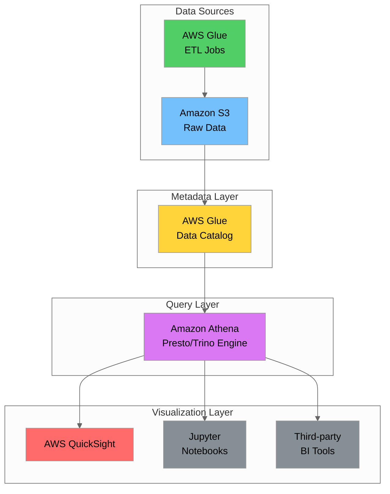
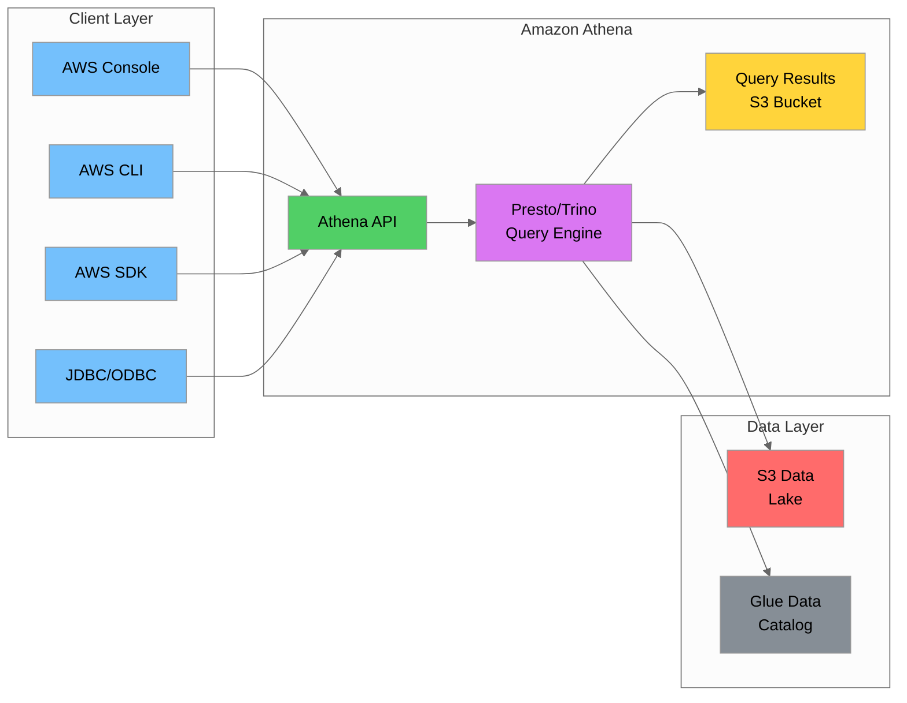
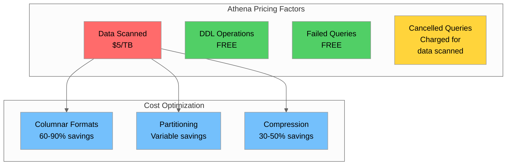
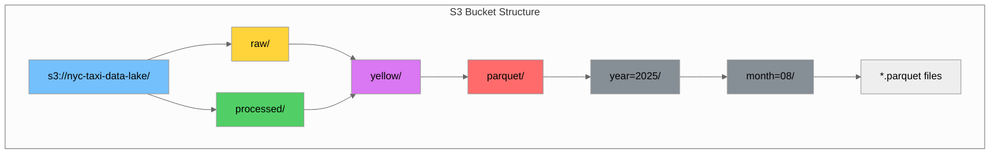
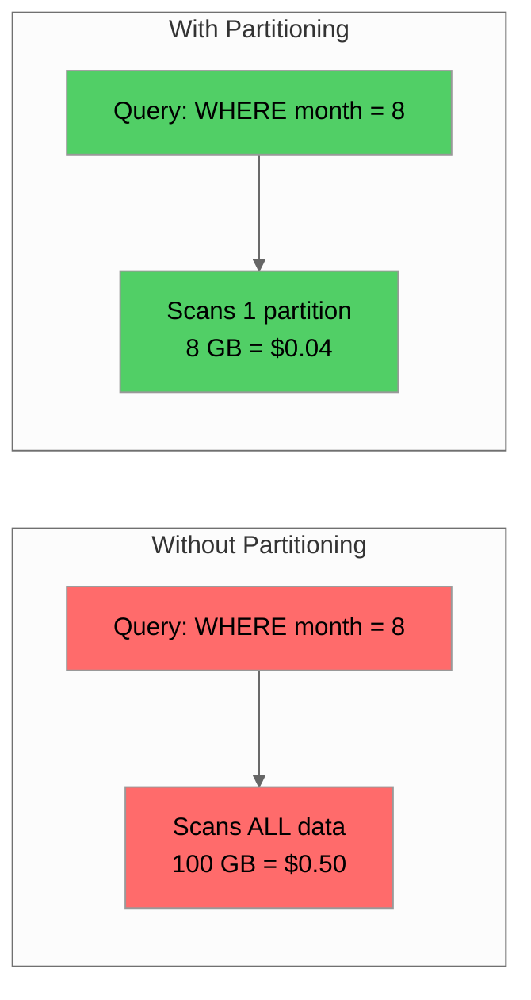

# Day 17: Athena & Serverless Analytics

## Table of Contents
1. [Introduction](#introduction)
2. [Learning Objectives](#learning-objectives)
3. [Serverless Querying with Presto/Trino](#serverless-querying-with-prestotrino)
4. [Creating External Tables](#creating-external-tables)
5. [Partitioning Strategies](#partitioning-strategies)
6. [Query Optimization and Cost Management](#query-optimization-and-cost-management)
7. [Integration with Glue Catalog](#integration-with-glue-catalog)
8. [Query Performance Tuning](#query-performance-tuning)
9. [Columnar Format Optimization](#columnar-format-optimization)
10. [AWS QuickSight for Visualization](#aws-quicksight-for-visualization)
11. [Dashboard Design Best Practices](#dashboard-design-best-practices)
12. [Hands-on Labs](#hands-on-labs)
13. [Summary](#summary)
14. [Additional Resources](#additional-resources)

---

## Introduction

Welcome to Day 17 of the Data Engineering training program! Today we dive into **Amazon Athena**, AWS's serverless interactive query service that enables you to analyze data directly in Amazon S3 using standard SQL. Athena is built on **Presto/Trino**, an open-source distributed SQL query engine designed for fast analytic queries against data of any size.

Serverless analytics represents a paradigm shift in how we approach data analysis. Instead of provisioning and managing infrastructure, you simply point Athena at your data in S3 and start querying. You pay only for the queries you run, making it an incredibly cost-effective solution for ad-hoc analysis and exploration.

We'll also explore **AWS QuickSight**, a cloud-native business intelligence service that integrates seamlessly with Athena to create interactive dashboards and visualizations.



---

## Learning Objectives

By the end of this tutorial, you will be able to:

| # | Objective | Skill Level |
|---|-----------|-------------|
| 1 | Understand Athena's serverless architecture and Presto/Trino engine | Foundational |
| 2 | Create external tables with proper DDL syntax and SerDe configurations | Intermediate |
| 3 | Implement effective partitioning strategies for cost optimization | Intermediate |
| 4 | Optimize queries to minimize costs and maximize performance | Advanced |
| 5 | Integrate Athena with AWS Glue Data Catalog | Intermediate |
| 6 | Analyze query execution plans using EXPLAIN | Advanced |
| 7 | Choose and configure columnar formats (Parquet, ORC) | Intermediate |
| 8 | Build interactive dashboards with AWS QuickSight | Intermediate |
| 9 | Apply dashboard design best practices | Intermediate |

---

## Serverless Querying with Presto/Trino

### What is Amazon Athena?

Amazon Athena is an interactive query service that makes it easy to analyze data directly in Amazon S3 using standard SQL. Athena is **serverless**, meaning there's no infrastructure to set up or manage—you simply point to your data in S3, define the schema, and start querying.



### Athena Engine Versions

Athena offers two engine versions with different underlying technologies. Understanding these versions is important for compatibility and performance optimization.

| Feature | Engine Version 2 | Engine Version 3 |
|---------|------------------|------------------|
| **Query Engine** | Presto 0.217 | Trino 388 |
| **Performance** | Baseline | Up to 2x faster for many queries |
| **LIMIT Optimization** | No (scans all data) | Yes (in some cases with sorted data) |
| **New Functions** | Limited | Expanded (200+ new functions) |
| **MERGE Support** | No | Yes |
| **Default** | Legacy | Recommended for new workgroups |
| **Iceberg Support** | Limited | Full support |

**Checking and Changing Engine Version:**

```sql
-- Check current engine version (run in Athena console)
-- The engine version is shown in the query results metadata

-- To check via AWS CLI:
-- aws athena get-work-group --work-group primary
```

```bash
# Set engine version for workgroup (via AWS CLI)
aws athena update-work-group \
    --work-group primary \
    --configuration-updates '{
        "EngineVersion": {
            "SelectedEngineVersion": "Athena engine version 3"
        }
    }'

# Create a new workgroup with Engine Version 3
aws athena create-work-group \
    --name "analytics-team" \
    --configuration '{
        "ResultConfiguration": {
            "OutputLocation": "s3://my-athena-results/analytics/"
        },
        "EngineVersion": {
            "SelectedEngineVersion": "Athena engine version 3"
        }
    }'
```

**Engine Version 3 Benefits:**

- **Improved Performance**: Query execution is up to 2x faster for many workloads
- **MERGE Statement**: Supports MERGE INTO for upsert operations (useful for SCD Type 1)
- **Better LIMIT Handling**: Can short-circuit queries with LIMIT in some scenarios
- **Enhanced Functions**: Access to 200+ new SQL functions
- **Apache Iceberg**: Full support for Iceberg table format

### Presto/Trino SQL Engine Overview

Athena uses **Trino** (formerly PrestoSQL) as its underlying query engine. Trino is a distributed SQL query engine designed for fast analytic queries against data sources of all sizes.

| Feature | Description |
|---------|-------------|
| **Distributed Processing** | Queries are distributed across multiple nodes for parallel execution |
| **In-Memory Processing** | Data is processed in memory for fast query execution |
| **ANSI SQL** | Supports standard SQL with extensions for analytics |
| **Federated Queries** | Can query data across multiple data sources |
| **Connector Architecture** | Pluggable connectors for various data sources |

**Key Trino/Presto Concepts:**

```sql
-- Trino uses a coordinator-worker architecture
-- Coordinator: Parses queries, plans execution, manages workers
-- Workers: Execute tasks and process data

-- Athena abstracts this complexity - you just write SQL!
SELECT 
    vendor_id,
    COUNT(*) as trip_count,
    AVG(trip_distance) as avg_distance,
    SUM(total_amount) as total_revenue
FROM nyc_taxi.yellow_trips
WHERE pickup_datetime >= DATE '2025-08-01'
GROUP BY vendor_id;
```

### Serverless Architecture Benefits

| Benefit | Traditional Data Warehouse | Amazon Athena |
|---------|---------------------------|---------------|
| **Infrastructure** | Provision and manage clusters | No infrastructure to manage |
| **Scaling** | Manual or auto-scaling configuration | Automatic, transparent scaling |
| **Availability** | Configure for HA | Built-in high availability |
| **Maintenance** | Patches, upgrades, backups | Fully managed by AWS |
| **Cost Model** | Pay for provisioned capacity | Pay per query (data scanned) |
| **Time to Query** | Hours to days for setup | Minutes to start querying |

### Athena Pricing Model

Athena charges **$5.00 per TB of data scanned**. This pricing model makes cost optimization crucial.



**Cost Calculation Examples:**

| Scenario | Data Scanned | Cost |
|----------|--------------|------|
| Query 100 GB CSV file | 100 GB | $0.50 |
| Query 100 GB Parquet file | ~20 GB (columnar) | $0.10 |
| Query partitioned data (1 partition) | ~5 GB | $0.025 |
| DDL statement (CREATE TABLE) | 0 GB | $0.00 |

### Athena Workgroups for Cost Management

Workgroups allow you to separate users, teams, or applications and set data usage controls.

**AWS CLI to create a workgroup:**

```bash
# Create a workgroup with query result location and cost controls
aws athena create-work-group \
    --name "data-engineering-team" \
    --configuration '{
        "ResultConfiguration": {
            "OutputLocation": "s3://my-athena-results/data-engineering/"
        },
        "EnforceWorkGroupConfiguration": true,
        "PublishCloudWatchMetricsEnabled": true,
        "BytesScannedCutoffPerQuery": 10737418240
    }' \
    --description "Workgroup for data engineering team"

# List workgroups
aws athena list-work-groups

# Get workgroup details
aws athena get-work-group --work-group "data-engineering-team"
```

**Workgroup Configuration Options:**

| Setting | Description | Use Case |
|---------|-------------|----------|
| `BytesScannedCutoffPerQuery` | Maximum bytes a query can scan | Prevent runaway queries |
| `EnforceWorkGroupConfiguration` | Override client-side settings | Ensure compliance |
| `PublishCloudWatchMetricsEnabled` | Send metrics to CloudWatch | Monitoring and alerting |
| `RequesterPaysEnabled` | Enable requester pays for S3 | Cross-account data access |

---

## Creating External Tables

### DDL Syntax for External Tables

External tables in Athena define the schema and location of data stored in S3. The data remains in S3—Athena only stores metadata.

```sql
-- Basic external table creation syntax
CREATE EXTERNAL TABLE [IF NOT EXISTS] database_name.table_name (
    column1 data_type [COMMENT 'column comment'],
    column2 data_type,
    ...
)
[PARTITIONED BY (partition_column data_type, ...)]
[ROW FORMAT row_format]
[STORED AS file_format]
[LOCATION 's3://bucket/path/']
[TBLPROPERTIES ('property_name'='property_value', ...)]
```

**NYC Yellow Taxi External Table Example:**

```sql
-- Create database for NYC taxi data
CREATE DATABASE IF NOT EXISTS nyc_taxi
COMMENT 'NYC Taxi Trip Data'
LOCATION 's3://nyc-taxi-data-lake/';

-- Create external table for yellow taxi trips (CSV format)
CREATE EXTERNAL TABLE IF NOT EXISTS nyc_taxi.yellow_trips_csv (
    vendor_id INT COMMENT 'TPEP provider code',
    pickup_datetime TIMESTAMP COMMENT 'Meter engaged timestamp',
    dropoff_datetime TIMESTAMP COMMENT 'Meter disengaged timestamp',
    passenger_count INT COMMENT 'Number of passengers',
    trip_distance DOUBLE COMMENT 'Trip distance in miles',
    rate_code_id INT COMMENT 'Rate code in effect',
    store_and_fwd_flag STRING COMMENT 'Store and forward flag',
    pickup_location_id INT COMMENT 'TLC Taxi Zone pickup',
    dropoff_location_id INT COMMENT 'TLC Taxi Zone dropoff',
    payment_type INT COMMENT 'Payment type code',
    fare_amount DOUBLE COMMENT 'Time-and-distance fare',
    extra DOUBLE COMMENT 'Miscellaneous extras',
    mta_tax DOUBLE COMMENT 'MTA tax',
    tip_amount DOUBLE COMMENT 'Tip amount',
    tolls_amount DOUBLE COMMENT 'Tolls amount',
    improvement_surcharge DOUBLE COMMENT 'Improvement surcharge',
    total_amount DOUBLE COMMENT 'Total charged to passenger',
    congestion_surcharge DOUBLE COMMENT 'Congestion surcharge',
    airport_fee DOUBLE COMMENT 'Airport fee'
)
ROW FORMAT DELIMITED
    FIELDS TERMINATED BY ','
    LINES TERMINATED BY '\n'
STORED AS TEXTFILE
LOCATION 's3://nyc-taxi-data-lake/raw/yellow/csv/'
TBLPROPERTIES (
    'skip.header.line.count'='1',
    'classification'='csv'
);
```

### Data Types Mapping

| Source Type | Athena Type | Notes |
|-------------|-------------|-------|
| Integer | `INT`, `BIGINT`, `SMALLINT`, `TINYINT` | Choose based on value range |
| Decimal | `DOUBLE`, `FLOAT`, `DECIMAL(p,s)` | Use DECIMAL for financial data |
| String | `STRING`, `VARCHAR(n)`, `CHAR(n)` | STRING is most flexible |
| Boolean | `BOOLEAN` | true/false values |
| Date/Time | `DATE`, `TIMESTAMP`, `TIMESTAMP WITH TIME ZONE` | TIMESTAMP for datetime |
| Binary | `BINARY`, `VARBINARY` | For binary data |
| Complex | `ARRAY<type>`, `MAP<key,value>`, `STRUCT<...>` | Nested data structures |

**Complex Type Examples:**

```sql
-- Table with complex types
CREATE EXTERNAL TABLE nyc_taxi.trip_details (
    trip_id STRING,
    pickup_datetime TIMESTAMP,
    passenger_ids ARRAY<STRING>,
    surcharges MAP<STRING, DOUBLE>,
    pickup_location STRUCT<
        zone_id: INT,
        borough: STRING,
        zone_name: STRING,
        latitude: DOUBLE,
        longitude: DOUBLE
    >,
    dropoff_location STRUCT<
        zone_id: INT,
        borough: STRING,
        zone_name: STRING,
        latitude: DOUBLE,
        longitude: DOUBLE
    >
)
STORED AS PARQUET
LOCATION 's3://nyc-taxi-data-lake/processed/trip_details/';

-- Querying complex types
SELECT 
    trip_id,
    pickup_location.borough as pickup_borough,
    dropoff_location.zone_name as dropoff_zone,
    surcharges['congestion'] as congestion_fee,
    cardinality(passenger_ids) as passenger_count
FROM nyc_taxi.trip_details
WHERE pickup_location.borough = 'Manhattan';
```

### SerDe (Serializer/Deserializer) Options

SerDe defines how Athena reads and writes data. Different file formats require different SerDes.

| File Format | SerDe | Use Case |
|-------------|-------|----------|
| CSV | `org.apache.hadoop.hive.serde2.lazy.LazySimpleSerDe` | Simple delimited files |
| CSV (OpenCSV) | `org.apache.hadoop.hive.serde2.OpenCSVSerde` | CSV with quoted fields |
| JSON | `org.openx.data.jsonserde.JsonSerDe` | JSON files |
| JSON (Hive) | `org.apache.hive.hcatalog.data.JsonSerDe` | Alternative JSON SerDe |
| Parquet | `org.apache.hadoop.hive.ql.io.parquet.serde.ParquetHiveSerDe` | Columnar Parquet |
| ORC | `org.apache.hadoop.hive.ql.io.orc.OrcSerde` | Columnar ORC |
| Avro | `org.apache.hadoop.hive.serde2.avro.AvroSerDe` | Avro format |
| Regex | `org.apache.hadoop.hive.serde2.RegexSerDe` | Custom regex parsing |

**SerDe Examples:**

```sql
-- CSV with OpenCSV SerDe (handles quoted fields)
CREATE EXTERNAL TABLE nyc_taxi.yellow_trips_quoted_csv (
    vendor_id INT,
    pickup_datetime STRING,
    dropoff_datetime STRING,
    passenger_count INT,
    trip_distance DOUBLE,
    pickup_location_id INT,
    dropoff_location_id INT,
    payment_type INT,
    fare_amount DOUBLE,
    total_amount DOUBLE
)
ROW FORMAT SERDE 'org.apache.hadoop.hive.serde2.OpenCSVSerde'
WITH SERDEPROPERTIES (
    'separatorChar' = ',',
    'quoteChar' = '"',
    'escapeChar' = '\\'
)
STORED AS TEXTFILE
LOCATION 's3://nyc-taxi-data-lake/raw/yellow/quoted_csv/'
TBLPROPERTIES ('skip.header.line.count'='1');

-- JSON SerDe
CREATE EXTERNAL TABLE nyc_taxi.yellow_trips_json (
    vendor_id INT,
    pickup_datetime STRING,
    dropoff_datetime STRING,
    passenger_count INT,
    trip_distance DOUBLE,
    pickup_location_id INT,
    dropoff_location_id INT,
    payment_type INT,
    fare_amount DOUBLE,
    total_amount DOUBLE
)
ROW FORMAT SERDE 'org.openx.data.jsonserde.JsonSerDe'
WITH SERDEPROPERTIES (
    'ignore.malformed.json' = 'true',
    'case.insensitive' = 'true'
)
STORED AS TEXTFILE
LOCATION 's3://nyc-taxi-data-lake/raw/yellow/json/';

-- Regex SerDe for log files
CREATE EXTERNAL TABLE nyc_taxi.access_logs (
    request_ip STRING,
    request_time STRING,
    request_method STRING,
    request_path STRING,
    response_code INT,
    response_size BIGINT
)
ROW FORMAT SERDE 'org.apache.hadoop.hive.serde2.RegexSerDe'
WITH SERDEPROPERTIES (
    'input.regex' = '([^ ]*) - - \\[([^\\]]*)\\] "([A-Z]+) ([^ ]*) HTTP/[0-9.]*" ([0-9]*) ([0-9]*)'
)
STORED AS TEXTFILE
LOCATION 's3://nyc-taxi-data-lake/logs/access/';
```

### Table Properties and Configurations

```sql
-- Parquet table with comprehensive properties
CREATE EXTERNAL TABLE nyc_taxi.yellow_trips_parquet (
    vendor_id INT,
    pickup_datetime TIMESTAMP,
    dropoff_datetime TIMESTAMP,
    passenger_count INT,
    trip_distance DOUBLE,
    rate_code_id INT,
    store_and_fwd_flag STRING,
    pickup_location_id INT,
    dropoff_location_id INT,
    payment_type INT,
    fare_amount DOUBLE,
    extra DOUBLE,
    mta_tax DOUBLE,
    tip_amount DOUBLE,
    tolls_amount DOUBLE,
    improvement_surcharge DOUBLE,
    total_amount DOUBLE,
    congestion_surcharge DOUBLE,
    airport_fee DOUBLE
)
PARTITIONED BY (year INT, month INT)
STORED AS PARQUET
LOCATION 's3://nyc-taxi-data-lake/processed/yellow/parquet/'
TBLPROPERTIES (
    'parquet.compression'='SNAPPY',
    'classification'='parquet',
    'has_encrypted_data'='false',
    'projection.enabled'='true',
    'projection.year.type'='integer',
    'projection.year.range'='2020,2030',
    'projection.month.type'='integer',
    'projection.month.range'='1,12',
    'storage.location.template'='s3://nyc-taxi-data-lake/processed/yellow/parquet/year=${year}/month=${month}/'
);
```

### LOCATION Clause and S3 Paths

The LOCATION clause specifies where data is stored in S3. Understanding path conventions is crucial.



**Path Best Practices:**

```sql
-- Good: Trailing slash indicates directory
LOCATION 's3://nyc-taxi-data-lake/processed/yellow/parquet/'

-- Bad: No trailing slash (may cause issues)
LOCATION 's3://nyc-taxi-data-lake/processed/yellow/parquet'

-- Good: Hive-style partitioning
LOCATION 's3://nyc-taxi-data-lake/processed/yellow/parquet/year=2025/month=08/'

-- Good: Using consistent naming conventions
LOCATION 's3://nyc-taxi-data-lake/bronze/yellow_taxi/'
LOCATION 's3://nyc-taxi-data-lake/silver/yellow_taxi_cleaned/'
LOCATION 's3://nyc-taxi-data-lake/gold/yellow_taxi_aggregated/'
```

---

## Partitioning Strategies

### Why Partition Data?

Partitioning divides your data into smaller, manageable chunks based on column values. This dramatically reduces the amount of data scanned, lowering costs and improving query performance.



**Partitioning Benefits:**

| Benefit | Description | Impact |
|---------|-------------|--------|
| **Cost Reduction** | Scan only relevant partitions | 50-99% cost savings |
| **Query Performance** | Less data to process | 10-100x faster queries |
| **Data Organization** | Logical data structure | Easier data management |
| **Parallel Processing** | Each partition processed independently | Better scalability |

### Partition Projection vs MSCK REPAIR TABLE

There are two main approaches to managing partitions in Athena:

**1. MSCK REPAIR TABLE (Traditional)**

```sql
-- Create partitioned table
CREATE EXTERNAL TABLE nyc_taxi.yellow_trips_partitioned (
    vendor_id INT,
    pickup_datetime TIMESTAMP,
    dropoff_datetime TIMESTAMP,
    passenger_count INT,
    trip_distance DOUBLE,
    fare_amount DOUBLE,
    total_amount DOUBLE
)
PARTITIONED BY (year INT, month INT)
STORED AS PARQUET
LOCATION 's3://nyc-taxi-data-lake/processed/yellow/parquet/';

-- Discover and add partitions from S3
MSCK REPAIR TABLE nyc_taxi.yellow_trips_partitioned;

-- Or add partitions manually
ALTER TABLE nyc_taxi.yellow_trips_partitioned 
ADD PARTITION (year=2025, month=8) 
LOCATION 's3://nyc-taxi-data-lake/processed/yellow/parquet/year=2025/month=8/';
```

**2. Partition Projection (Recommended)**

```sql
-- Create table with partition projection
CREATE EXTERNAL TABLE nyc_taxi.yellow_trips_projected (
    vendor_id INT,
    pickup_datetime TIMESTAMP,
    dropoff_datetime TIMESTAMP,
    passenger_count INT,
    trip_distance DOUBLE,
    fare_amount DOUBLE,
    total_amount DOUBLE
)
PARTITIONED BY (year INT, month INT, day INT)
STORED AS PARQUET
LOCATION 's3://nyc-taxi-data-lake/processed/yellow/parquet/'
TBLPROPERTIES (
    'projection.enabled'='true',
    'projection.year.type'='integer',
    'projection.year.range'='2020,2030',
    'projection.month.type'='integer',
    'projection.month.range'='1,12',
    'projection.day.type'='integer',
    'projection.day.range'='1,31',
    'storage.location.template'='s3://nyc-taxi-data-lake/processed/yellow/parquet/year=${year}/month=${month}/day=${day}/'
);
```

**Comparison:**

| Feature | MSCK REPAIR TABLE | Partition Projection |
|---------|-------------------|---------------------|
| **Partition Discovery** | Scans S3 (slow for many partitions) | Calculated at query time |
| **New Partitions** | Requires MSCK or ALTER TABLE | Automatic |
| **Glue Catalog** | Stores partition metadata | No metadata storage |
| **Query Planning** | Reads from catalog | Generates partitions dynamically |
| **Best For** | Irregular partition schemes | Regular, predictable partitions |

### Hive-Style Partitioning

Hive-style partitioning uses `key=value` directory naming convention.

```
s3://nyc-taxi-data-lake/processed/yellow/parquet/
├── year=2024/
│   ├── month=1/
│   │   ├── day=1/
│   │   │   └── data_001.parquet
│   │   └── day=2/
│   │       └── data_001.parquet
│   └── month=2/
│       └── ...
└── year=2025/
    ├── month=7/
    └── month=8/
        ├── day=1/
        ├── day=2/
        └── ...
```

**Partition Projection Types:**

| Type | Description | Example |
|------|-------------|---------|
| `integer` | Integer range | `'projection.year.range'='2020,2030'` |
| `date` | Date range | `'projection.date.range'='2020-01-01,NOW'` |
| `enum` | List of values | `'projection.status.values'='active,inactive'` |
| `injected` | Value from query | Used for dynamic partitions |

**Date Partition Projection Example:**

```sql
-- Using date type for partition projection
CREATE EXTERNAL TABLE nyc_taxi.yellow_trips_daily (
    vendor_id INT,
    pickup_datetime TIMESTAMP,
    passenger_count INT,
    trip_distance DOUBLE,
    total_amount DOUBLE
)
PARTITIONED BY (trip_date STRING)
STORED AS PARQUET
LOCATION 's3://nyc-taxi-data-lake/processed/yellow/daily/'
TBLPROPERTIES (
    'projection.enabled'='true',
    'projection.trip_date.type'='date',
    'projection.trip_date.format'='yyyy-MM-dd',
    'projection.trip_date.range'='2020-01-01,NOW',
    'projection.trip_date.interval'='1',
    'projection.trip_date.interval.unit'='DAYS',
    'storage.location.template'='s3://nyc-taxi-data-lake/processed/yellow/daily/trip_date=${trip_date}/'
);

-- Query with date partition
SELECT 
    trip_date,
    COUNT(*) as trip_count,
    SUM(total_amount) as daily_revenue
FROM nyc_taxi.yellow_trips_daily
WHERE trip_date BETWEEN '2025-08-01' AND '2025-08-31'
GROUP BY trip_date
ORDER BY trip_date;
```

### Adding and Dropping Partitions

```sql
-- Add a single partition
ALTER TABLE nyc_taxi.yellow_trips_partitioned 
ADD IF NOT EXISTS PARTITION (year=2025, month=9) 
LOCATION 's3://nyc-taxi-data-lake/processed/yellow/parquet/year=2025/month=9/';

-- Add multiple partitions
ALTER TABLE nyc_taxi.yellow_trips_partitioned ADD IF NOT EXISTS
    PARTITION (year=2025, month=10) 
    LOCATION 's3://nyc-taxi-data-lake/processed/yellow/parquet/year=2025/month=10/'
    PARTITION (year=2025, month=11) 
    LOCATION 's3://nyc-taxi-data-lake/processed/yellow/parquet/year=2025/month=11/'
    PARTITION (year=2025, month=12) 
    LOCATION 's3://nyc-taxi-data-lake/processed/yellow/parquet/year=2025/month=12/';

-- Drop a partition (metadata only, data remains in S3)
ALTER TABLE nyc_taxi.yellow_trips_partitioned 
DROP IF EXISTS PARTITION (year=2020, month=1);

-- Show partitions
SHOW PARTITIONS nyc_taxi.yellow_trips_partitioned;
```

---

## Query Optimization and Cost Management

### Columnar Formats for Cost Reduction

Using columnar formats is the single most effective way to reduce Athena costs.

**Cost Comparison Example:**

| Format | File Size | Query: SELECT * | Query: SELECT 2 columns |
|--------|-----------|-----------------|------------------------|
| CSV | 100 GB | $0.50 (100 GB) | $0.50 (100 GB) |
| JSON | 150 GB | $0.75 (150 GB) | $0.75 (150 GB) |
| Parquet | 20 GB | $0.10 (20 GB) | $0.02 (4 GB) |
| ORC | 18 GB | $0.09 (18 GB) | $0.018 (3.6 GB) |

### Compression Benefits

Compression reduces file size, directly lowering costs.

| Compression | Ratio | Speed | Splittable | Best For |
|-------------|-------|-------|------------|----------|
| **SNAPPY** | Medium (2-4x) | Fast | Yes (Parquet/ORC) | General use |
| **GZIP** | High (5-8x) | Slow | No | Archival, infrequent queries |
| **LZ4** | Low (2-3x) | Very Fast | Yes | Real-time analytics |
| **ZSTD** | High (4-6x) | Medium | Yes | Balance of size/speed |

```sql
-- Create table with SNAPPY compression (recommended)
CREATE EXTERNAL TABLE nyc_taxi.yellow_trips_snappy (
    vendor_id INT,
    pickup_datetime TIMESTAMP,
    trip_distance DOUBLE,
    total_amount DOUBLE
)
STORED AS PARQUET
LOCATION 's3://nyc-taxi-data-lake/processed/yellow/snappy/'
TBLPROPERTIES ('parquet.compression'='SNAPPY');
```

### Partition Pruning

Partition pruning eliminates partitions from query execution based on filter predicates.

```sql
-- Good: Partition pruning occurs (only scans August 2025)
SELECT COUNT(*), SUM(total_amount)
FROM nyc_taxi.yellow_trips_partitioned
WHERE year = 2025 AND month = 8;

-- Bad: No partition pruning (scans all partitions)
SELECT COUNT(*), SUM(total_amount)
FROM nyc_taxi.yellow_trips_partitioned
WHERE CAST(year AS VARCHAR) || '-' || CAST(month AS VARCHAR) = '2025-8';
```

### Predicate Pushdown

Predicate pushdown filters data at the storage level before reading into memory.

```sql
-- Predicate pushdown works with Parquet/ORC
SELECT
    pickup_location_id,
    COUNT(*) as trip_count
FROM nyc_taxi.yellow_trips_parquet
WHERE
    trip_distance > 10  -- Pushed down to Parquet reader
    AND payment_type = 1  -- Pushed down to Parquet reader
    AND year = 2025  -- Partition pruning
    AND month = 8  -- Partition pruning
GROUP BY pickup_location_id;
```

### LIMIT Clause Behavior

**Important:** LIMIT does NOT reduce data scanned in Athena!

```sql
-- This still scans ALL data, then returns 10 rows
SELECT *
FROM nyc_taxi.yellow_trips_parquet
LIMIT 10;

-- To reduce costs, always use WHERE clauses
SELECT *
FROM nyc_taxi.yellow_trips_parquet
WHERE year = 2025 AND month = 8
LIMIT 10;
```

### Query Result Caching

Athena caches query results for 24 hours. Repeated identical queries are free.

| Factor | Impact on Caching |
|--------|-------------------|
| Query text must be identical | Even whitespace differences create new cache entry |
| Underlying data changes | Cache invalidated if S3 data modified |
| 24-hour TTL | Results expire after 24 hours |
| Workgroup settings | Can disable caching per workgroup |

---

## Integration with Glue Catalog

### Glue Data Catalog as Metastore

AWS Glue Data Catalog serves as the central metadata repository for Athena.

**Glue Catalog Benefits:**

| Benefit | Description |
|---------|-------------|
| **Unified Metadata** | Single source of truth for all AWS analytics services |
| **Schema Management** | Centralized schema definitions |
| **Partition Management** | Automatic partition discovery and management |
| **Access Control** | IAM-based access control for databases and tables |
| **Versioning** | Schema version history |

### Crawlers for Schema Discovery

Glue Crawlers automatically discover schemas and create/update table definitions.

```bash
# Create a Glue Crawler using AWS CLI
aws glue create-crawler \
    --name "nyc-taxi-crawler" \
    --role "arn:aws:iam::123456789012:role/GlueCrawlerRole" \
    --database-name "nyc_taxi" \
    --targets '{
        "S3Targets": [
            {
                "Path": "s3://nyc-taxi-data-lake/processed/yellow/parquet/",
                "Exclusions": ["_temporary/**", "_spark_metadata/**"]
            }
        ]
    }' \
    --schema-change-policy '{
        "UpdateBehavior": "UPDATE_IN_DATABASE",
        "DeleteBehavior": "LOG"
    }'

# Start the crawler
aws glue start-crawler --name "nyc-taxi-crawler"

# Check crawler status
aws glue get-crawler --name "nyc-taxi-crawler"
```

### Catalog Databases and Tables

```sql
-- Create a database in Glue Catalog
CREATE DATABASE IF NOT EXISTS nyc_taxi_analytics
COMMENT 'Analytics database for NYC Taxi data'
LOCATION 's3://nyc-taxi-data-lake/analytics/';

-- List databases
SHOW DATABASES;

-- Describe table
DESCRIBE nyc_taxi.yellow_trips_parquet;

-- Show create table statement
SHOW CREATE TABLE nyc_taxi.yellow_trips_parquet;

-- Drop table (metadata only, data remains in S3)
DROP TABLE IF EXISTS nyc_taxi.yellow_trips_temp;
```

---

## Query Performance Tuning

### EXPLAIN and EXPLAIN ANALYZE

Use EXPLAIN to understand query execution plans.

```sql
-- Basic EXPLAIN shows the query plan
EXPLAIN
SELECT
    vendor_id,
    COUNT(*) as trip_count,
    AVG(total_amount) as avg_fare
FROM nyc_taxi.yellow_trips_parquet
WHERE year = 2025 AND month = 8
GROUP BY vendor_id;

-- EXPLAIN ANALYZE runs the query and shows runtime statistics
EXPLAIN ANALYZE
SELECT
    vendor_id,
    COUNT(*) as trip_count
FROM nyc_taxi.yellow_trips_parquet
WHERE year = 2025 AND month = 8
GROUP BY vendor_id;
```

### Join Optimization

```sql
-- Good: Smaller table on the right (broadcast join)
SELECT
    t.pickup_datetime,
    t.total_amount,
    z.borough,
    z.zone
FROM nyc_taxi.yellow_trips_parquet t
JOIN nyc_taxi.taxi_zones z
    ON t.pickup_location_id = z.location_id
WHERE t.year = 2025 AND t.month = 8;

-- Good: Use explicit join hints for large tables
SELECT /*+ BROADCAST(z) */
    t.pickup_datetime,
    t.total_amount,
    z.borough
FROM nyc_taxi.yellow_trips_parquet t
JOIN nyc_taxi.taxi_zones z
    ON t.pickup_location_id = z.location_id
WHERE t.year = 2025 AND t.month = 8;
```

**Join Best Practices:**

| Practice | Description |
|----------|-------------|
| Filter before join | Reduce data size before joining |
| Smaller table on right | Enables broadcast join |
| Join on partition columns | Enables partition-wise join |
| Avoid cross joins | Exponential data explosion |

### Approximate Functions

For large datasets, approximate functions provide fast results with acceptable accuracy.

```sql
-- Approximate count distinct (fast, ~2% error)
SELECT approx_distinct(pickup_location_id) as approx_unique_locations
FROM nyc_taxi.yellow_trips_parquet
WHERE year = 2025;

-- Approximate percentile (fast)
SELECT
    approx_percentile(total_amount, 0.5) as median_fare,
    approx_percentile(total_amount, 0.95) as p95_fare,
    approx_percentile(total_amount, 0.99) as p99_fare
FROM nyc_taxi.yellow_trips_parquet
WHERE year = 2025 AND month = 8;
```

**Approximate Functions Available:**

| Function | Description | Error Rate |
|----------|-------------|------------|
| `approx_distinct(x)` | Approximate COUNT(DISTINCT) | ~2.3% |
| `approx_percentile(x, p)` | Approximate percentile | ~1% |
| `approx_most_frequent(x, k)` | Top k frequent values | Varies |

---

## Columnar Format Optimization

### Parquet File Structure

Apache Parquet is a columnar storage format optimized for analytics workloads.

**Parquet Features:**

| Feature | Description | Benefit |
|---------|-------------|---------|
| **Columnar Storage** | Data stored by column | Read only needed columns |
| **Row Groups** | Horizontal partitions | Parallel processing |
| **Column Chunks** | Column data within row group | Efficient compression |
| **Statistics** | Min/max per column chunk | Predicate pushdown |
| **Dictionary Encoding** | Compress repeated values | Smaller file size |

### Parquet vs ORC Comparison

| Feature | Parquet | ORC |
|---------|---------|-----|
| **Origin** | Twitter/Cloudera | Facebook/Hortonworks |
| **Default Block Size** | 128 MB | 250 MB |
| **Nested Data** | Excellent | Good |
| **Compression** | Snappy, GZIP, LZ4, ZSTD | ZLIB, Snappy, LZ4, ZSTD |
| **Predicate Pushdown** | Yes | Yes |
| **Ecosystem** | Spark, Athena, most tools | Hive, Presto, Athena |

### File Sizing Best Practices

Optimal file sizes for Athena are **128 MB to 1 GB**.

| Scenario | Recommended Size | Reasoning |
|----------|------------------|-----------|
| Daily partitions | 128-256 MB | Balance between parallelism and overhead |
| Hourly partitions | 64-128 MB | Smaller partitions need smaller files |
| Large tables | 256 MB - 1 GB | Reduce file count |

### Converting Data to Columnar Formats

**Using Athena CTAS (Create Table As Select):**

```sql
-- Convert CSV to Parquet using CTAS
CREATE TABLE nyc_taxi.yellow_trips_parquet_converted
WITH (
    format = 'PARQUET',
    parquet_compression = 'SNAPPY',
    external_location = 's3://nyc-taxi-data-lake/converted/yellow/parquet/',
    partitioned_by = ARRAY['year', 'month']
) AS
SELECT
    vendor_id,
    pickup_datetime,
    dropoff_datetime,
    passenger_count,
    trip_distance,
    pickup_location_id,
    dropoff_location_id,
    payment_type,
    fare_amount,
    total_amount,
    YEAR(pickup_datetime) as year,
    MONTH(pickup_datetime) as month
FROM nyc_taxi.yellow_trips_csv;
```

### Implementing SCD Type 2 with Athena

While Athena is primarily for querying, you can implement SCD Type 2 patterns using CTAS and UNION operations. For a comprehensive guide on SCD implementations, see [Day 14-15: SCD Deep Dive & Master Data Versioning](../day-14-15/day-14-15-tutorial.md).

**SCD Type 2 Pattern with Athena CTAS:**

```sql
-- Step 1: Create a staging table with new/updated records
CREATE TABLE nyc_taxi.dim_zones_staging
WITH (format = 'PARQUET', external_location = 's3://bucket/staging/zones/')
AS SELECT * FROM nyc_taxi.source_zones;

-- Step 2: Expire existing records that have changes
CREATE TABLE nyc_taxi.dim_zones_expired
WITH (format = 'PARQUET', external_location = 's3://bucket/temp/zones_expired/')
AS
SELECT
    d.zone_sk,
    d.location_id,
    d.borough,
    d.zone_name,
    d.service_zone,
    d.effective_start_date,
    CASE
        WHEN s.location_id IS NOT NULL
             AND (d.borough != s.borough OR d.zone_name != s.zone_name)
        THEN CURRENT_TIMESTAMP
        ELSE d.effective_end_date
    END AS effective_end_date,
    CASE
        WHEN s.location_id IS NOT NULL
             AND (d.borough != s.borough OR d.zone_name != s.zone_name)
        THEN FALSE
        ELSE d.is_current
    END AS is_current
FROM nyc_taxi.dim_zones d
LEFT JOIN nyc_taxi.dim_zones_staging s
    ON d.location_id = s.location_id AND d.is_current = TRUE;

-- Step 3: Insert new versions for changed records
CREATE TABLE nyc_taxi.dim_zones_new_versions
WITH (format = 'PARQUET', external_location = 's3://bucket/temp/zones_new/')
AS
SELECT
    ROW_NUMBER() OVER () + (SELECT MAX(zone_sk) FROM nyc_taxi.dim_zones) AS zone_sk,
    s.location_id,
    s.borough,
    s.zone_name,
    s.service_zone,
    CURRENT_TIMESTAMP AS effective_start_date,
    TIMESTAMP '9999-12-31 23:59:59' AS effective_end_date,
    TRUE AS is_current
FROM nyc_taxi.dim_zones_staging s
JOIN nyc_taxi.dim_zones d
    ON s.location_id = d.location_id AND d.is_current = TRUE
WHERE s.borough != d.borough OR s.zone_name != d.zone_name;

-- Step 4: Combine expired records with new versions
CREATE TABLE nyc_taxi.dim_zones_updated
WITH (format = 'PARQUET', external_location = 's3://bucket/processed/zones/')
AS
SELECT * FROM nyc_taxi.dim_zones_expired
UNION ALL
SELECT * FROM nyc_taxi.dim_zones_new_versions;

-- Note: For production SCD Type 2, consider using AWS Glue or Spark
-- which provide better support for MERGE operations
```

---

## AWS QuickSight for Visualization

### QuickSight Overview

AWS QuickSight is a cloud-native, serverless business intelligence service.

**QuickSight Features:**

| Feature | Description |
|---------|-------------|
| **SPICE** | Super-fast, Parallel, In-memory Calculation Engine |
| **ML Insights** | Anomaly detection, forecasting, narratives |
| **Embedded Analytics** | Embed dashboards in applications |
| **Row-Level Security** | Control data access per user |
| **Pay-per-Session** | Cost-effective pricing for readers |

### Connecting to Athena

**Step 1: Create a Data Source**

```
1. Open QuickSight Console
2. Click "Datasets" → "New dataset"
3. Select "Athena" as the data source
4. Configure connection:
   - Data source name: nyc-taxi-athena
   - Athena workgroup: primary
   - Database: nyc_taxi
5. Click "Create data source"
```

**Step 2: Create a Dataset**

```sql
-- Custom SQL for QuickSight dataset
SELECT
    DATE(pickup_datetime) as trip_date,
    HOUR(pickup_datetime) as trip_hour,
    pickup_location_id,
    dropoff_location_id,
    passenger_count,
    trip_distance,
    fare_amount,
    tip_amount,
    total_amount,
    payment_type,
    CASE payment_type
        WHEN 1 THEN 'Credit Card'
        WHEN 2 THEN 'Cash'
        WHEN 3 THEN 'No Charge'
        WHEN 4 THEN 'Dispute'
        ELSE 'Unknown'
    END as payment_type_name
FROM nyc_taxi.yellow_trips_parquet
WHERE year = 2025 AND month = 8
```

### SPICE vs Direct Query

| Feature | SPICE | Direct Query |
|---------|-------|--------------|
| **Performance** | Very fast (in-memory) | Depends on data source |
| **Cost** | SPICE capacity charges | Query charges (Athena) |
| **Data Freshness** | Scheduled refresh | Real-time |
| **Data Size** | Limited by SPICE capacity | Unlimited |
| **Best For** | Dashboards, frequent access | Ad-hoc analysis |

### Building Visualizations

**Common Chart Types for Taxi Data:**

| Chart Type | Use Case | Example |
|------------|----------|---------|
| **Line Chart** | Trends over time | Daily revenue trend |
| **Bar Chart** | Comparisons | Revenue by borough |
| **Pie/Donut** | Proportions | Payment type distribution |
| **Heat Map** | Two-dimensional patterns | Trips by hour and day |
| **KPI** | Key metrics | Total revenue, trip count |
| **Table** | Detailed data | Top pickup locations |

---

## Dashboard Design Best Practices

### Visual Hierarchy

Design dashboards with a clear visual hierarchy to guide users through the data.

**Layout Principles:**

| Principle | Description |
|-----------|-------------|
| **Top-to-Bottom** | Most important metrics at top |
| **Left-to-Right** | Primary content on left |
| **Grouping** | Related visuals together |
| **White Space** | Don't overcrowd |
| **Consistent Sizing** | Similar visuals same size |

### Choosing the Right Chart Types

| Data Type | Recommended Chart | Avoid |
|-----------|-------------------|-------|
| **Trend over time** | Line chart | Pie chart |
| **Comparison** | Bar chart | 3D charts |
| **Proportion** | Pie/Donut (≤5 categories) | Pie with many slices |
| **Distribution** | Histogram, Box plot | Line chart |
| **Correlation** | Scatter plot | Bar chart |
| **KPIs** | KPI visual, Gauge | Complex charts |

### Calculated Fields

```sql
-- Calculated fields in QuickSight

-- Revenue per mile
{total_amount} / NULLIF({trip_distance}, 0)

-- Tip percentage
{tip_amount} / NULLIF({fare_amount}, 0) * 100

-- Trip duration category
ifelse(
    {trip_distance} < 2, 'Short',
    {trip_distance} < 5, 'Medium',
    {trip_distance} < 10, 'Long',
    'Very Long'
)
```

---

## Hands-on Labs

### Lab 1: Creating External Tables in Athena for NYC Taxi Data

**Objective:** Create external tables for NYC Yellow Taxi data in both CSV and Parquet formats.

**Prerequisites:**
- AWS account with Athena access
- S3 bucket with NYC taxi data

**Steps:**

```sql
-- Step 1: Create database
CREATE DATABASE IF NOT EXISTS nyc_taxi_lab
COMMENT 'Lab database for NYC Taxi data';

-- Step 2: Create external table for Parquet data
CREATE EXTERNAL TABLE nyc_taxi_lab.yellow_trips (
    vendor_id INT,
    pickup_datetime TIMESTAMP,
    dropoff_datetime TIMESTAMP,
    passenger_count INT,
    trip_distance DOUBLE,
    rate_code_id INT,
    store_and_fwd_flag STRING,
    pickup_location_id INT,
    dropoff_location_id INT,
    payment_type INT,
    fare_amount DOUBLE,
    extra DOUBLE,
    mta_tax DOUBLE,
    tip_amount DOUBLE,
    tolls_amount DOUBLE,
    improvement_surcharge DOUBLE,
    total_amount DOUBLE,
    congestion_surcharge DOUBLE,
    airport_fee DOUBLE
)
STORED AS PARQUET
LOCATION 's3://your-bucket/nyc-taxi/yellow/parquet/';

-- Step 3: Verify table creation
SELECT COUNT(*) FROM nyc_taxi_lab.yellow_trips;

-- Step 4: Query sample data
SELECT
    vendor_id,
    pickup_datetime,
    trip_distance,
    total_amount
FROM nyc_taxi_lab.yellow_trips
LIMIT 10;
```

### Lab 2: Implementing Partitioning Strategies

**Objective:** Create partitioned tables and compare query performance.

**Steps:**

```sql
-- Step 1: Create partitioned table with projection
CREATE EXTERNAL TABLE nyc_taxi_lab.yellow_trips_partitioned (
    vendor_id INT,
    pickup_datetime TIMESTAMP,
    dropoff_datetime TIMESTAMP,
    passenger_count INT,
    trip_distance DOUBLE,
    pickup_location_id INT,
    dropoff_location_id INT,
    payment_type INT,
    fare_amount DOUBLE,
    total_amount DOUBLE
)
PARTITIONED BY (year INT, month INT)
STORED AS PARQUET
LOCATION 's3://your-bucket/nyc-taxi/yellow/partitioned/'
TBLPROPERTIES (
    'projection.enabled'='true',
    'projection.year.type'='integer',
    'projection.year.range'='2020,2030',
    'projection.month.type'='integer',
    'projection.month.range'='1,12',
    'storage.location.template'='s3://your-bucket/nyc-taxi/yellow/partitioned/year=${year}/month=${month}/'
);

-- Step 2: Compare query costs
-- Query without partition filter (expensive)
SELECT COUNT(*), SUM(total_amount)
FROM nyc_taxi_lab.yellow_trips_partitioned;

-- Query with partition filter (cheap)
SELECT COUNT(*), SUM(total_amount)
FROM nyc_taxi_lab.yellow_trips_partitioned
WHERE year = 2025 AND month = 8;

-- Step 3: Check data scanned in query history
-- Go to Athena Console → Query History → Check "Data scanned"
```

### Lab 3: Running Optimized Queries

**Objective:** Practice query optimization techniques.

**Steps:**

```sql
-- Step 1: Use columnar projection
-- Bad: SELECT *
SELECT * FROM nyc_taxi_lab.yellow_trips_partitioned
WHERE year = 2025 AND month = 8
LIMIT 100;

-- Good: Select only needed columns
SELECT
    pickup_datetime,
    trip_distance,
    total_amount
FROM nyc_taxi_lab.yellow_trips_partitioned
WHERE year = 2025 AND month = 8
LIMIT 100;

-- Step 2: Use approximate functions
-- Exact (slow)
SELECT COUNT(DISTINCT pickup_location_id)
FROM nyc_taxi_lab.yellow_trips_partitioned
WHERE year = 2025;

-- Approximate (fast)
SELECT approx_distinct(pickup_location_id)
FROM nyc_taxi_lab.yellow_trips_partitioned
WHERE year = 2025;

-- Step 3: Optimize joins
-- Create zone lookup table
CREATE EXTERNAL TABLE nyc_taxi_lab.taxi_zones (
    location_id INT,
    borough STRING,
    zone STRING,
    service_zone STRING
)
ROW FORMAT DELIMITED
FIELDS TERMINATED BY ','
STORED AS TEXTFILE
LOCATION 's3://your-bucket/nyc-taxi/zones/'
TBLPROPERTIES ('skip.header.line.count'='1');

-- Optimized join query
SELECT /*+ BROADCAST(z) */
    z.borough,
    COUNT(*) as trip_count,
    AVG(t.total_amount) as avg_fare
FROM nyc_taxi_lab.yellow_trips_partitioned t
JOIN nyc_taxi_lab.taxi_zones z
    ON t.pickup_location_id = z.location_id
WHERE t.year = 2025 AND t.month = 8
GROUP BY z.borough
ORDER BY trip_count DESC;
```

### Lab 4: Building a QuickSight Dashboard

**Objective:** Create an interactive dashboard for NYC taxi analytics.

**Steps:**

1. **Create Dataset in QuickSight**
   - Navigate to QuickSight Console
   - Create new dataset from Athena
   - Use custom SQL:

```sql
SELECT
    DATE(pickup_datetime) as trip_date,
    HOUR(pickup_datetime) as trip_hour,
    DAYOFWEEK(pickup_datetime) as day_of_week,
    pickup_location_id,
    dropoff_location_id,
    passenger_count,
    trip_distance,
    fare_amount,
    tip_amount,
    total_amount,
    CASE payment_type
        WHEN 1 THEN 'Credit Card'
        WHEN 2 THEN 'Cash'
        ELSE 'Other'
    END as payment_method
FROM nyc_taxi_lab.yellow_trips_partitioned
WHERE year = 2025 AND month = 8
```

2. **Create Visualizations**
   - KPI: Total Trips, Total Revenue, Average Fare
   - Line Chart: Daily revenue trend
   - Bar Chart: Trips by hour of day
   - Pie Chart: Payment method distribution
   - Heat Map: Trips by hour and day of week

3. **Add Filters**
   - Date range filter
   - Payment method filter
   - Trip distance filter

4. **Publish Dashboard**
   - Click "Publish" → "Publish dashboard"
   - Set permissions for viewers

---

## Summary

### Key Takeaways

| Topic | Key Points |
|-------|------------|
| **Athena Architecture** | Serverless, Presto/Trino engine, $5/TB scanned |
| **External Tables** | DDL syntax, SerDe options, LOCATION clause |
| **Partitioning** | Partition projection recommended, Hive-style paths |
| **Cost Optimization** | Columnar formats, compression, partition pruning |
| **Glue Catalog** | Central metadata, crawlers, cross-account access |
| **Performance Tuning** | EXPLAIN, join optimization, approximate functions |
| **Columnar Formats** | Parquet preferred, 128MB-1GB file sizes |
| **QuickSight** | SPICE for performance, calculated fields |

### Cost Optimization Checklist

- [ ] Use Parquet or ORC format
- [ ] Enable SNAPPY compression
- [ ] Implement partitioning on frequently filtered columns
- [ ] Use partition projection for regular partition schemes
- [ ] Select only needed columns (avoid SELECT *)
- [ ] Use approximate functions for large datasets
- [ ] Set workgroup query limits
- [ ] Monitor query costs in CloudWatch

### Best Practices Summary

1. **Data Format:** Always use Parquet with SNAPPY compression
2. **Partitioning:** Partition by date columns (year/month/day)
3. **File Size:** Target 128MB-1GB per file
4. **Queries:** Filter on partition columns, select specific columns
5. **Joins:** Broadcast small tables, filter before joining
6. **Monitoring:** Use workgroups and CloudWatch for cost tracking

---

## Additional Resources

### AWS Documentation
- [Amazon Athena User Guide](https://docs.aws.amazon.com/athena/latest/ug/)
- [AWS Glue Data Catalog](https://docs.aws.amazon.com/glue/latest/dg/catalog-and-crawler.html)
- [Amazon QuickSight User Guide](https://docs.aws.amazon.com/quicksight/latest/user/)
- [Athena Performance Tuning](https://docs.aws.amazon.com/athena/latest/ug/performance-tuning.html)

### Trino/Presto Resources
- [Trino Documentation](https://trino.io/docs/current/)
- [Trino SQL Functions](https://trino.io/docs/current/functions.html)
- [Presto SQL Reference](https://prestodb.io/docs/current/sql.html)

### File Format Documentation
- [Apache Parquet](https://parquet.apache.org/docs/)
- [Apache ORC](https://orc.apache.org/docs/)

### Related Training Days
- [Day 16: Data Warehousing with Redshift](../day-16/day-16-tutorial.md) - Complementary data warehouse concepts
- [Day 11: Apache Spark Fundamentals](../day-11/day-11-tutorial.md) - Data processing for Athena
- [Day 14-15: Data Modeling](../day-14-15/day-14-15-tutorial.md) - Schema design principles

---

*Tutorial created for the Data Engineering Intern Training Program - Day 17*