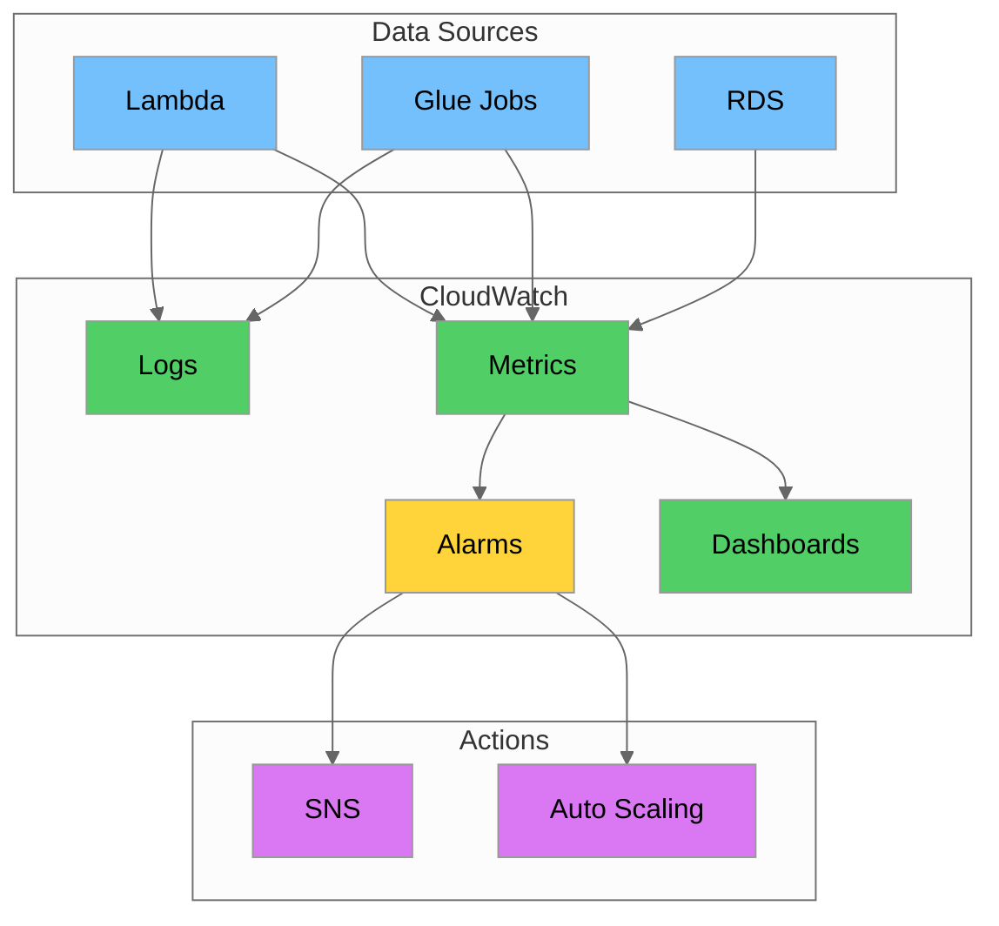
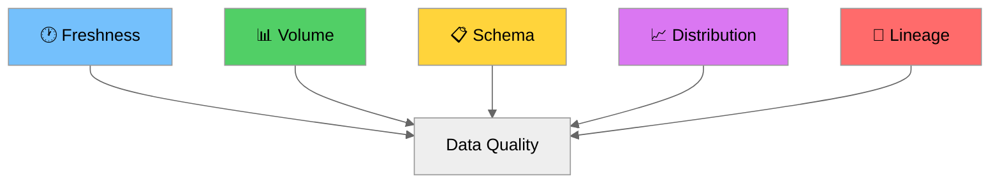
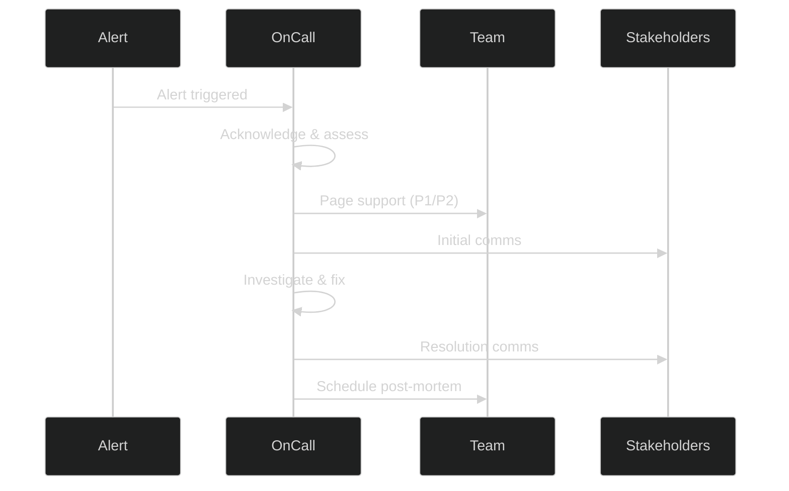

# Day 18: Monitoring, Observability & Performance

## Introduction

Welcome to Day 18 of the Data Engineering training program! Today we dive deep into **monitoring, observability, and performance optimization** - critical skills for maintaining reliable data pipelines in production.

By the end of this tutorial, you'll be able to:
- Set up comprehensive monitoring with CloudWatch
- Implement audit logging with CloudTrail
- Use X-Ray for distributed tracing
- Track data lineage across pipelines
- Apply data observability best practices
- Respond to data incidents effectively
- Optimize queries, Spark jobs, and storage

---

## Table of Contents

1. [CloudWatch: Logs, Metrics, Alarms, Dashboards](#1-cloudwatch-logs-metrics-alarms-dashboards)
2. [CloudTrail for Audit Logging](#2-cloudtrail-for-audit-logging)
3. [AWS X-Ray for Distributed Tracing](#3-aws-x-ray-for-distributed-tracing)
4. [Data Lineage Tracking](#4-data-lineage-tracking)
5. [Data Observability Best Practices](#5-data-observability-best-practices)
6. [Incident Response for Data Issues](#6-incident-response-for-data-issues)
7. [Query Optimization and EXPLAIN Plans](#7-query-optimization-and-explain-plans)
8. [Spark Optimization](#8-spark-optimization)
9. [Storage Optimization](#9-storage-optimization)
10. [Troubleshooting](#10-troubleshooting)
11. [Hands-on Labs](#11-hands-on-labs)
12. [Summary](#12-summary)

---

## 1. CloudWatch: Logs, Metrics, Alarms, Dashboards

Amazon CloudWatch is the primary monitoring and observability service for AWS resources.

### CloudWatch Architecture



### 1.1 CloudWatch Logs

| Concept | Description | Example |
|---------|-------------|---------|
| **Log Group** | Container for log streams | `/aws/glue/jobs/taxi-etl` |
| **Log Stream** | Sequence of events from same source | `jr_abc123_attempt_1` |
| **Log Event** | Single log entry | `INFO: Processing 1M records` |
| **Retention** | How long logs are kept | 30 days |

#### AWS CLI Commands

```bash
# Create log group
aws logs create-log-group \
    --log-group-name /data-pipeline/taxi-etl

# Set retention
aws logs put-retention-policy \
    --log-group-name /data-pipeline/taxi-etl \
    --retention-in-days 30

# List log groups
aws logs describe-log-groups \
    --log-group-name-prefix /data-pipeline/
```

#### Python Logger

```python
import boto3
import json
import time
from datetime import datetime

class CloudWatchLogger:
    def __init__(self, log_group: str, log_stream: str):
        self.client = boto3.client('logs')
        self.log_group = log_group
        self.log_stream = log_stream
        self.sequence_token = None
        self._ensure_log_group()
        self._ensure_log_stream()
    
    def _ensure_log_group(self):
        try:
            self.client.create_log_group(logGroupName=self.log_group)
        except self.client.exceptions.ResourceAlreadyExistsException:
            pass
    
    def _ensure_log_stream(self):
        try:
            self.client.create_log_stream(
                logGroupName=self.log_group,
                logStreamName=self.log_stream
            )
        except self.client.exceptions.ResourceAlreadyExistsException:
            pass
    
    def log(self, level: str, message: str, **kwargs):
        log_event = {
            'level': level,
            'message': message,
            'timestamp': datetime.utcnow().isoformat(),
            **kwargs
        }
        
        params = {
            'logGroupName': self.log_group,
            'logStreamName': self.log_stream,
            'logEvents': [{
                'timestamp': int(time.time() * 1000),
                'message': json.dumps(log_event)
            }]
        }
        
        if self.sequence_token:
            params['sequenceToken'] = self.sequence_token
        
        response = self.client.put_log_events(**params)
        self.sequence_token = response.get('nextSequenceToken')
    
    def info(self, message: str, **kwargs):
        self.log('INFO', message, **kwargs)
    
    def error(self, message: str, **kwargs):
        self.log('ERROR', message, **kwargs)

# Usage
logger = CloudWatchLogger('/data-pipeline/taxi-etl', 'taxi-etl-2025-01-06')
logger.info('Starting ETL job', job_id='job_123')
logger.info('Records processed', count=1500000)
logger.error('Job failed', error='OutOfMemoryError')
```

### 1.2 CloudWatch Metrics

| Concept | Description | Example |
|---------|-------------|---------|
| **Namespace** | Container for metrics | `TaxiPipeline/ETL` |
| **Metric Name** | Name of the metric | `RecordsProcessed` |
| **Dimension** | Key-value identifier | `JobName=taxi-etl` |
| **Statistic** | Aggregation type | Sum, Average, Max |

```python
import boto3
from datetime import datetime

class MetricsPublisher:
    def __init__(self, namespace: str):
        self.client = boto3.client('cloudwatch')
        self.namespace = namespace
    
    def put_metric(self, name: str, value: float, unit: str = 'Count', dimensions: list = None):
        metric_data = {
            'MetricName': name,
            'Value': value,
            'Unit': unit,
            'Timestamp': datetime.utcnow()
        }
        
        if dimensions:
            metric_data['Dimensions'] = [
                {'Name': k, 'Value': v} for d in dimensions for k, v in d.items()
            ]
        
        self.client.put_metric_data(
            Namespace=self.namespace,
            MetricData=[metric_data]
        )

# Usage
metrics = MetricsPublisher('TaxiPipeline/ETL')
metrics.put_metric('RecordsProcessed', 1500000, 'Count', [{'JobName': 'taxi-daily-etl'}])
metrics.put_metric('JobDuration', 245.5, 'Seconds', [{'JobName': 'taxi-daily-etl'}])
metrics.put_metric('DataQualityScore', 98.5, 'Percent', [{'Dataset': 'yellow_taxi_trips'}])
```

```bash
# Put metric via CLI
aws cloudwatch put-metric-data \
    --namespace "TaxiPipeline/ETL" \
    --metric-name "RecordsProcessed" \
    --value 1500000 \
    --unit Count \
    --dimensions JobName=taxi-daily-etl

# Get metric statistics
aws cloudwatch get-metric-statistics \
    --namespace "TaxiPipeline/ETL" \
    --metric-name "RecordsProcessed" \
    --start-time 2025-01-05T00:00:00Z \
    --end-time 2025-01-06T00:00:00Z \
    --period 3600 \
    --statistics Sum Average Maximum
```

### 1.3 CloudWatch Alarms

```python
import boto3

def create_pipeline_alarms(job_name: str, sns_topic_arn: str):
    cloudwatch = boto3.client('cloudwatch')
    
    # Job failure alarm
    cloudwatch.put_metric_alarm(
        AlarmName=f'{job_name}-failure-alarm',
        AlarmDescription=f'Alarm when {job_name} fails',
        MetricName='glue.driver.aggregate.numFailedTasks',
        Namespace='AWS/Glue',
        Statistic='Sum',
        Period=300,
        EvaluationPeriods=1,
        Threshold=1,
        ComparisonOperator='GreaterThanOrEqualToThreshold',
        Dimensions=[{'Name': 'JobName', 'Value': job_name}],
        AlarmActions=[sns_topic_arn]
    )
    
    # Low records alarm
    cloudwatch.put_metric_alarm(
        AlarmName=f'{job_name}-low-records-alarm',
        MetricName='RecordsProcessed',
        Namespace='TaxiPipeline/ETL',
        Statistic='Sum',
        Period=3600,
        EvaluationPeriods=1,
        Threshold=100000,
        ComparisonOperator='LessThanThreshold',
        Dimensions=[{'Name': 'JobName', 'Value': job_name}],
        AlarmActions=[sns_topic_arn],
        TreatMissingData='breaching'
    )

create_pipeline_alarms('taxi-daily-etl', 'arn:aws:sns:us-east-1:123456789012:alerts')
```

### 1.4 CloudWatch Logs Insights

```sql
-- Find errors
fields @timestamp, @message
| filter @message like /ERROR/
| sort @timestamp desc
| limit 50

-- Count errors by type
fields @message
| filter @message like /ERROR/
| parse @message /ERROR: (?<error_type>\w+)/
| stats count(*) as error_count by error_type

-- Analyze job duration
fields @timestamp, @message
| filter @message like /Job completed/
| parse @message /duration: (?<duration>\d+)/
| stats avg(duration), max(duration)
```

---

## 2. CloudTrail for Audit Logging

CloudTrail records API calls for governance and compliance.

### 2.1 Event Types

| Event Type | Description | Examples |
|------------|-------------|----------|
| **Management Events** | Control plane operations | CreateBucket, StartJobRun |
| **Data Events** | Data plane operations | GetObject, PutObject |
| **Insights Events** | Unusual API activity | Spike in API calls |

### 2.2 Creating a Trail

```bash
# Create trail
aws cloudtrail create-trail \
    --name taxi-data-pipeline-trail \
    --s3-bucket-name taxi-pipeline-cloudtrail-logs \
    --is-multi-region-trail \
    --enable-log-file-validation

# Start logging
aws cloudtrail start-logging --name taxi-data-pipeline-trail

# Add S3 data events
aws cloudtrail put-event-selectors \
    --trail-name taxi-data-pipeline-trail \
    --event-selectors '[{
        "ReadWriteType": "All",
        "IncludeManagementEvents": true,
        "DataResources": [
            {"Type": "AWS::S3::Object", "Values": ["arn:aws:s3:::taxi-data-raw/"]}
        ]
    }]'

# Look up events
aws cloudtrail lookup-events \
    --lookup-attributes AttributeKey=EventName,AttributeValue=StartJobRun

# Validate logs
aws cloudtrail validate-logs \
    --trail-arn arn:aws:cloudtrail:us-east-1:123456789012:trail/taxi-data-pipeline-trail \
    --start-time 2025-01-05T00:00:00Z
```

### 2.3 CloudTrail Lake Queries

```sql
-- Who accessed taxi data?
SELECT userIdentity.userName, eventName, eventTime
FROM taxi-pipeline-events
WHERE eventSource = 's3.amazonaws.com'
    AND requestParameters.bucketName LIKE 'taxi-data%'
ORDER BY eventTime DESC

-- Glue job executions
SELECT userIdentity.userName, eventName, requestParameters.jobName
FROM taxi-pipeline-events
WHERE eventSource = 'glue.amazonaws.com'
    AND eventName = 'StartJobRun'

-- Failed API calls
SELECT eventTime, eventSource, eventName, errorCode, errorMessage
FROM taxi-pipeline-events
WHERE errorCode IS NOT NULL
```

---

## 3. AWS X-Ray for Distributed Tracing

X-Ray provides end-to-end request tracing across distributed systems.

### 3.1 Key Concepts

| Concept | Description | Example |
|---------|-------------|---------|
| **Trace** | End-to-end request path | Complete ETL execution |
| **Segment** | Work by single service | Lambda execution |
| **Subsegment** | Granular timing | S3 GetObject call |
| **Annotation** | Indexed key-value pairs | `job_name=taxi-etl` |
| **Metadata** | Non-indexed debug data | Request body |

### 3.2 Instrumenting Python

```python
from aws_xray_sdk.core import xray_recorder, patch_all
import boto3

patch_all()

xray_recorder.configure(
    service='taxi-data-pipeline',
    sampling=True
)

class TaxiProcessor:
    def __init__(self):
        self.s3 = boto3.client('s3')
    
    @xray_recorder.capture('process_taxi_data')
    def process(self, bucket: str, key: str):
        xray_recorder.current_segment().put_annotation('bucket', bucket)
        
        with xray_recorder.in_subsegment('read_data') as subseg:
            data = self._read_data(bucket, key)
            subseg.put_metadata('count', len(data))
        
        with xray_recorder.in_subsegment('transform') as subseg:
            result = self._transform(data)
        
        return result
    
    def _read_data(self, bucket, key):
        return self.s3.get_object(Bucket=bucket, Key=key)
    
    def _transform(self, data):
        return data
```

### 3.3 X-Ray CLI

```bash
# Create sampling rule
aws xray create-sampling-rule --cli-input-json '{
    "SamplingRule": {
        "RuleName": "taxi-pipeline",
        "Priority": 100,
        "FixedRate": 0.1,
        "ReservoirSize": 5,
        "ServiceName": "taxi-*",
        "ServiceType": "*",
        "Host": "*",
        "HTTPMethod": "*",
        "URLPath": "*",
        "Version": 1
    }
}'

# Get service graph
aws xray get-service-graph \
    --start-time $(date -d '1 hour ago' +%s) \
    --end-time $(date +%s)

# Get trace summaries
aws xray get-trace-summaries \
    --start-time $(date -d '1 hour ago' +%s) \
    --end-time $(date +%s) \
    --filter-expression 'service("taxi-data-pipeline")'
```

---

## 4. Data Lineage Tracking

Data lineage tracks data origin, movement, and transformation.

### 4.1 Lineage Flow


### 4.2 Lineage Levels

| Level | Description | Example |
|-------|-------------|---------|
| **Table-Level** | Table dependencies | `bronze.trips` → `silver.trips` |
| **Column-Level** | Column derivations | `total = fare + tip + tolls` |
| **Row-Level** | Record tracking | Record ID 12345 from source A |

### 4.3 OpenLineage Implementation

```python
from openlineage.client import OpenLineageClient
from openlineage.client.run import Run, RunEvent, RunState, Job, Dataset
from openlineage.client.facet import SchemaDatasetFacet, SchemaField
import uuid
from datetime import datetime

class LineageTracker:
    def __init__(self, namespace: str):
        self.client = OpenLineageClient(url="http://localhost:5000")
        self.namespace = namespace
    
    def emit_start(self, job_name: str, inputs: list, outputs: list):
        run_id = str(uuid.uuid4())
        
        event = RunEvent(
            eventType=RunState.START,
            eventTime=datetime.utcnow().isoformat() + "Z",
            run=Run(runId=run_id),
            job=Job(namespace=self.namespace, name=job_name),
            producer="taxi-etl",
            inputs=inputs,
            outputs=outputs
        )
        
        self.client.emit(event)
        return run_id
    
    def emit_complete(self, job_name: str, run_id: str, inputs: list, outputs: list):
        event = RunEvent(
            eventType=RunState.COMPLETE,
            eventTime=datetime.utcnow().isoformat() + "Z",
            run=Run(runId=run_id),
            job=Job(namespace=self.namespace, name=job_name),
            producer="taxi-etl",
            inputs=inputs,
            outputs=outputs
        )
        
        self.client.emit(event)

# Usage
lineage = LineageTracker("taxi-pipeline")

input_ds = Dataset(
    namespace="s3://taxi-data-raw",
    name="yellow_tripdata",
    facets={
        "schema": SchemaDatasetFacet(fields=[
            SchemaField(name="VendorID", type="long"),
            SchemaField(name="fare_amount", type="double")
        ])
    }
)

output_ds = Dataset(
    namespace="s3://taxi-data-processed",
    name="trips_cleaned"
)

run_id = lineage.emit_start("taxi-etl", [input_ds], [output_ds])
# ... job execution ...
lineage.emit_complete("taxi-etl", run_id, [input_ds], [output_ds])
```

---

## 5. Data Observability Best Practices

### 5.1 Five Pillars



| Pillar | Question | Check |
|--------|----------|-------|
| **Freshness** | Is data up-to-date? | Last update < 4 hours |
| **Volume** | Is data complete? | Record count within range |
| **Schema** | Has structure changed? | No unexpected columns |
| **Distribution** | Are values normal? | Mean within 3 std |
| **Lineage** | Where did data come from? | Source tracked |

### 5.2 Data Observer Implementation

```python
import pandas as pd
from datetime import datetime
import boto3

class DataObserver:
    def __init__(self, namespace: str):
        self.cloudwatch = boto3.client('cloudwatch')
        self.namespace = namespace
    
    def check_freshness(self, df: pd.DataFrame, ts_col: str) -> float:
        latest = pd.to_datetime(df[ts_col]).max()
        hours_old = (datetime.utcnow() - latest).total_seconds() / 3600
        self._publish('DataFreshness', hours_old, 'Hours')
        return hours_old
    
    def check_volume(self, df: pd.DataFrame, min_rows: int, max_rows: int) -> dict:
        count = len(df)
        status = 'OK' if min_rows <= count <= max_rows else 'ANOMALY'
        self._publish('RecordCount', count, 'Count')
        return {'count': count, 'status': status}
    
    def check_schema(self, df: pd.DataFrame, expected: list) -> dict:
        actual = set(df.columns)
        expected_set = set(expected)
        missing = expected_set - actual
        extra = actual - expected_set
        status = 'OK' if not missing and not extra else 'CHANGED'
        return {'missing': list(missing), 'extra': list(extra), 'status': status}
    
    def check_nulls(self, df: pd.DataFrame, thresholds: dict) -> dict:
        results = {}
        for col, max_pct in thresholds.items():
            if col in df.columns:
                null_pct = (df[col].isnull().sum() / len(df)) * 100
                results[col] = {
                    'null_pct': null_pct,
                    'status': 'OK' if null_pct <= max_pct else 'EXCEEDED'
                }
                self._publish(f'NullPct_{col}', null_pct, 'Percent')
        return results
    
    def _publish(self, name: str, value: float, unit: str):
        self.cloudwatch.put_metric_data(
            Namespace=self.namespace,
            MetricData=[{'MetricName': name, 'Value': value, 'Unit': unit}]
        )

# Usage
observer = DataObserver('TaxiPipeline/DataQuality')
df = pd.read_parquet('s3://taxi-data/yellow_tripdata.parquet')

freshness = observer.check_freshness(df, 'tpep_pickup_datetime')
volume = observer.check_volume(df, 1000000, 2000000)
schema = observer.check_schema(df, ['VendorID', 'fare_amount', 'total_amount'])
nulls = observer.check_nulls(df, {'passenger_count': 5.0, 'fare_amount': 1.0})
```

---

## 6. Incident Response for Data Issues

### 6.1 Incident Classification

| Priority | Description | Response Time | Example |
|----------|-------------|---------------|---------|
| **P1** | Complete outage | 15 min | Pipeline down |
| **P2** | Major issue | 1 hour | 50%+ invalid records |
| **P3** | Partial issue | 4 hours | Some columns missing |
| **P4** | Minor issue | 24 hours | Documentation update |

### 6.2 Response Flow



### 6.3 Runbook Template

```markdown
# Runbook: Pipeline Failure

## Detection
- Alarm: `taxi-daily-etl-failure-alarm`

## Immediate Actions
1. Check Glue job status
2. Review CloudWatch logs
3. Check source data in S3

## Diagnosis

### Check Job Status
```bash
aws glue get-job-runs --job-name taxi-daily-etl --max-results 5
```

### Review Logs
```bash
aws logs filter-log-events \
    --log-group-name /aws/glue/jobs/taxi-daily-etl \
    --filter-pattern "ERROR"
```

## Common Fixes

### OOM Error
```bash
aws glue update-job --job-name taxi-daily-etl \
    --job-update '{"NumberOfWorkers": 10}'
```

## Escalation
- 30 min unresolved: Page senior engineer
- SLA at risk: Notify stakeholders
```

---

## 7. Query Optimization and EXPLAIN Plans

### 7.1 Reading EXPLAIN Output

```sql
EXPLAIN ANALYZE
SELECT pickup_zone, COUNT(*), AVG(fare_amount)
FROM taxi_trips t
JOIN taxi_zones z ON t.pickup_location_id = z.location_id
WHERE tpep_pickup_datetime >= '2025-01-01'
GROUP BY pickup_zone
ORDER BY count DESC
LIMIT 10;
```

| Component | Meaning |
|-----------|---------|
| **cost** | Estimated cost (arbitrary units) |
| **rows** | Estimated row count |
| **actual time** | Real execution time (ms) |
| **Seq Scan** | Full table scan |
| **Index Scan** | Using index |
| **Hash Join** | Join via hash table |

### 7.2 Query Anti-Patterns

```sql
-- BAD: SELECT *
SELECT * FROM taxi_trips WHERE fare_amount > 50;

-- GOOD: Select needed columns
SELECT trip_id, fare_amount FROM taxi_trips WHERE fare_amount > 50;

-- BAD: Function on indexed column
SELECT * FROM taxi_trips WHERE DATE(tpep_pickup_datetime) = '2025-01-01';

-- GOOD: Range comparison
SELECT * FROM taxi_trips 
WHERE tpep_pickup_datetime >= '2025-01-01' 
  AND tpep_pickup_datetime < '2025-01-02';

-- BAD: OR conditions
SELECT * FROM taxi_trips 
WHERE pickup_location_id = 132 OR dropoff_location_id = 132;

-- GOOD: UNION
SELECT * FROM taxi_trips WHERE pickup_location_id = 132
UNION ALL
SELECT * FROM taxi_trips WHERE dropoff_location_id = 132 
  AND pickup_location_id != 132;
```

### 7.3 Athena Optimization

```sql
-- Use partition pruning
SELECT * FROM taxi_trips WHERE pickup_date = '2025-01-01';

-- Use approximate functions
SELECT approx_distinct(passenger_count) FROM taxi_trips;

-- Limit with ORDER BY
SELECT * FROM taxi_trips ORDER BY fare_amount DESC LIMIT 100;
```

---

## 8. Spark Optimization

### 8.1 Partitioning

```python
from pyspark.sql import SparkSession
from pyspark.sql.functions import col

spark = SparkSession.builder.appName("TaxiOpt").getOrCreate()
df = spark.read.parquet("s3://taxi-data/raw/")

# Check partitions
print(f"Partitions: {df.rdd.getNumPartitions()}")

# Repartition by key
df_repartitioned = df.repartition(200, col("pickup_date"))

# Coalesce (no shuffle)
df_coalesced = df.coalesce(100)

# Write partitioned
df.write.partitionBy("year", "month").parquet("s3://taxi-data/partitioned/")

# Optimal partition size: 128MB - 1GB
data_size_gb = 50
target_mb = 256
optimal_partitions = int((data_size_gb * 1024) / target_mb)
```

### 8.2 Broadcast Joins

```python
from pyspark.sql.functions import broadcast

zones_df = spark.read.parquet("s3://taxi-data/zones/")  # Small
trips_df = spark.read.parquet("s3://taxi-data/trips/")  # Large

# Broadcast small table
result = trips_df.join(
    broadcast(zones_df),
    trips_df.pickup_location_id == zones_df.location_id
)

# Configure threshold
spark.conf.set("spark.sql.autoBroadcastJoinThreshold", 50 * 1024 * 1024)
```

### 8.3 Adaptive Query Execution

```python
# Enable AQE
spark.conf.set("spark.sql.adaptive.enabled", "true")
spark.conf.set("spark.sql.adaptive.coalescePartitions.enabled", "true")
spark.conf.set("spark.sql.adaptive.skewJoin.enabled", "true")

# Skew join threshold
spark.conf.set("spark.sql.adaptive.skewJoin.skewedPartitionThresholdInBytes", "256MB")
```

### 8.4 Caching

```python
# Cache frequently used data
df.cache()  # Memory only
df.persist(StorageLevel.MEMORY_AND_DISK)  # Memory + disk

# Unpersist when done
df.unpersist()

# Check storage
spark.catalog.isCached("taxi_trips")
```

---

## 9. Storage Optimization

### 9.1 File Sizing

| Size | Issue | Solution |
|------|-------|----------|
| < 128MB | Too many small files | Compact files |
| 128MB - 1GB | Optimal | Maintain |
| > 1GB | Large files | Split files |

```python
# Compact small files
df = spark.read.parquet("s3://taxi-data/small-files/")
df.coalesce(10).write.parquet("s3://taxi-data/compacted/")

# Target file size
spark.conf.set("spark.sql.files.maxPartitionBytes", "256MB")
```

### 9.2 Compaction with Delta Lake

```python
from delta.tables import DeltaTable

# Compact files
delta_table = DeltaTable.forPath(spark, "s3://taxi-data/delta/")
delta_table.optimize().executeCompaction()

# Z-order for data skipping
delta_table.optimize().executeZOrderBy("pickup_date", "pickup_location_id")

# Vacuum old files
delta_table.vacuum(168)  # 7 days retention
```

### 9.3 Storage Tiering

```bash
# S3 Lifecycle policy
aws s3api put-bucket-lifecycle-configuration \
    --bucket taxi-data \
    --lifecycle-configuration '{
        "Rules": [{
            "ID": "TierData",
            "Status": "Enabled",
            "Filter": {"Prefix": "processed/"},
            "Transitions": [
                {"Days": 30, "StorageClass": "STANDARD_IA"},
                {"Days": 90, "StorageClass": "GLACIER"}
            ]
        }]
    }'
```

---

## 10. Troubleshooting

### 10.1 OOM (Out of Memory) Errors

**Symptoms:** Job fails with `OutOfMemoryError`, executor lost, container killed

**Solutions:**

```python
# Increase memory
spark.conf.set("spark.driver.memory", "8g")
spark.conf.set("spark.executor.memory", "16g")
spark.conf.set("spark.executor.memoryOverhead", "4g")

# Reduce data per partition
df = df.repartition(500)

# Enable disk spilling
spark.conf.set("spark.memory.fraction", "0.6")
```

### 10.2 Data Skew

**Detection:**

```python
from pyspark.sql.functions import spark_partition_id, count

df.groupBy(spark_partition_id().alias("partition")) \
    .agg(count("*").alias("count")) \
    .orderBy("count", ascending=False) \
    .show()
```

**Solutions:**

```python
# Salting
from pyspark.sql.functions import concat, lit, rand

df_salted = df.withColumn("salted_key",
    concat(col("join_key"), lit("_"), (rand() * 10).cast("int")))

# Enable AQE skew handling
spark.conf.set("spark.sql.adaptive.skewJoin.enabled", "true")
```

### 10.3 Common Glue Job Failures

| Error | Cause | Solution |
|-------|-------|----------|
| `OutOfMemoryError` | Insufficient memory | Increase workers |
| `Connection timeout` | Network issues | Check VPC/security groups |
| `Access Denied` | IAM permissions | Update IAM role |
| `Schema mismatch` | Data format changed | Update schema mapping |

```bash
# Check job run details
aws glue get-job-run --job-name taxi-daily-etl --run-id jr_abc123

# Get logs
aws logs filter-log-events \
    --log-group-name /aws/glue/jobs/taxi-daily-etl \
    --log-stream-name-prefix jr_abc123
```

### 10.4 Lambda Timeout Issues

```python
import boto3

lambda_client = boto3.client('lambda')

# Update timeout and memory
lambda_client.update_function_configuration(
    FunctionName='taxi-processor',
    Timeout=300,  # 5 minutes
    MemorySize=1024  # More memory = more CPU
)
```

---

## 11. Hands-on Labs

### Lab 1: Set Up CloudWatch Dashboard

**Objective:** Create a monitoring dashboard for the taxi data pipeline.

```python
import boto3
import json

def create_monitoring_dashboard():
    cloudwatch = boto3.client('cloudwatch')
    
    dashboard_body = {
        "widgets": [
            {
                "type": "metric",
                "x": 0, "y": 0, "width": 12, "height": 6,
                "properties": {
                    "title": "Records Processed",
                    "metrics": [
                        ["TaxiPipeline/ETL", "RecordsProcessed", "JobName", "taxi-daily-etl"]
                    ],
                    "period": 3600,
                    "stat": "Sum",
                    "region": "us-east-1"
                }
            },
            {
                "type": "metric",
                "x": 12, "y": 0, "width": 12, "height": 6,
                "properties": {
                    "title": "Data Quality Score",
                    "metrics": [
                        ["TaxiPipeline/DataQuality", "DataQualityScore"]
                    ],
                    "period": 3600,
                    "stat": "Average",
                    "yAxis": {"left": {"min": 0, "max": 100}}
                }
            },
            {
                "type": "alarm",
                "x": 0, "y": 6, "width": 12, "height": 4,
                "properties": {
                    "title": "Active Alarms",
                    "alarms": [
                        "arn:aws:cloudwatch:us-east-1:123456789012:alarm:taxi-etl-failure"
                    ]
                }
            }
        ]
    }
    
    cloudwatch.put_dashboard(
        DashboardName='TaxiPipelineMonitoring',
        DashboardBody=json.dumps(dashboard_body)
    )
    print("Dashboard created: TaxiPipelineMonitoring")

create_monitoring_dashboard()
```

### Lab 2: Create Pipeline Alarms

**Objective:** Set up alarms for pipeline failures and data quality issues.

```python
import boto3

def create_pipeline_alarms():
    cloudwatch = boto3.client('cloudwatch')
    sns = boto3.client('sns')
    
    # Create SNS topic
    topic = sns.create_topic(Name='taxi-pipeline-alerts')
    topic_arn = topic['TopicArn']
    
    # Job Failure Alarm
    cloudwatch.put_metric_alarm(
        AlarmName='taxi-etl-job-failure',
        AlarmDescription='Taxi ETL job has failed',
        MetricName='glue.driver.aggregate.numFailedTasks',
        Namespace='AWS/Glue',
        Statistic='Sum',
        Period=300,
        EvaluationPeriods=1,
        Threshold=1,
        ComparisonOperator='GreaterThanOrEqualToThreshold',
        Dimensions=[{'Name': 'JobName', 'Value': 'taxi-daily-etl'}],
        AlarmActions=[topic_arn]
    )
    
    # Data Freshness Alarm
    cloudwatch.put_metric_alarm(
        AlarmName='taxi-data-stale',
        AlarmDescription='Taxi data is more than 4 hours old',
        MetricName='DataFreshness',
        Namespace='TaxiPipeline/DataQuality',
        Statistic='Maximum',
        Period=3600,
        EvaluationPeriods=1,
        Threshold=4,
        ComparisonOperator='GreaterThanThreshold',
        AlarmActions=[topic_arn]
    )
    
    print(f"Alarms created with notifications to: {topic_arn}")

create_pipeline_alarms()
```

### Lab 3: Implement Data Lineage Visualization

**Objective:** Track and visualize data lineage for the taxi pipeline.

```python
from dataclasses import dataclass
from typing import List, Dict

@dataclass
class LineageNode:
    name: str
    type: str  # 'source', 'transform', 'sink'
    columns: List[str]

@dataclass
class LineageEdge:
    source: str
    target: str
    transformation: str

class LineageGraph:
    def __init__(self):
        self.nodes: Dict[str, LineageNode] = {}
        self.edges: List[LineageEdge] = []
    
    def add_node(self, node: LineageNode):
        self.nodes[node.name] = node
    
    def add_edge(self, source: str, target: str, transformation: str):
        self.edges.append(LineageEdge(source, target, transformation))
    
    def to_mermaid(self) -> str:
        lines = ["%%{init: {'theme':'neutral'}}%%", "flowchart LR"]
        
        for name, node in self.nodes.items():
            safe_name = name.replace(".", "_").replace("/", "_")
            lines.append(f'    {safe_name}["{name}"]')
        
        for edge in self.edges:
            src = edge.source.replace(".", "_").replace("/", "_")
            tgt = edge.target.replace(".", "_").replace("/", "_")
            lines.append(f'    {src} -->|{edge.transformation}| {tgt}')
        
        return "\n".join(lines)

# Build taxi pipeline lineage
graph = LineageGraph()

graph.add_node(LineageNode("s3://taxi-raw/yellow_tripdata", "source", ["VendorID", "fare_amount"]))
graph.add_node(LineageNode("bronze.taxi_trips", "transform", ["vendor_id", "fare"]))
graph.add_node(LineageNode("silver.trips_enriched", "transform", ["vendor_id", "fare", "zone"]))
graph.add_node(LineageNode("gold.daily_summary", "sink", ["date", "trip_count", "revenue"]))

graph.add_edge("s3://taxi-raw/yellow_tripdata", "bronze.taxi_trips", "Clean")
graph.add_edge("bronze.taxi_trips", "silver.trips_enriched", "Enrich")
graph.add_edge("silver.trips_enriched", "gold.daily_summary", "Aggregate")

print(graph.to_mermaid())
```

---

## 12. Summary

### Key Takeaways

| Topic | Key Points |
|-------|------------|
| **CloudWatch** | Logs, Metrics, Alarms, Dashboards for monitoring |
| **CloudTrail** | Audit logging for compliance and security |
| **X-Ray** | Distributed tracing for debugging |
| **Data Lineage** | Track data origin and transformations |
| **Observability** | Five pillars: Freshness, Volume, Schema, Distribution, Lineage |
| **Incident Response** | P1-P4 classification, runbooks, post-mortems |
| **Query Optimization** | EXPLAIN plans, avoid anti-patterns |
| **Spark Optimization** | Partitioning, broadcast joins, AQE, caching |
| **Storage Optimization** | File sizing, compaction, tiering |
| **Troubleshooting** | OOM, data skew, slow queries |

### Best Practices Checklist

- [ ] Set up CloudWatch dashboards for all pipelines
- [ ] Create alarms for job failures and data quality
- [ ] Enable CloudTrail for audit logging
- [ ] Implement X-Ray tracing for complex workflows
- [ ] Track data lineage across all transformations
- [ ] Monitor the five pillars of data observability
- [ ] Create runbooks for common issues
- [ ] Optimize queries using EXPLAIN plans
- [ ] Configure Spark for optimal performance
- [ ] Implement storage tiering and compaction

### Additional Resources

- [CloudWatch Documentation](https://docs.aws.amazon.com/cloudwatch/)
- [CloudTrail User Guide](https://docs.aws.amazon.com/cloudtrail/)
- [X-Ray Developer Guide](https://docs.aws.amazon.com/xray/)
- [OpenLineage Specification](https://openlineage.io/)
- [Spark Performance Tuning](https://spark.apache.org/docs/latest/tuning.html)
- [Delta Lake Optimization](https://docs.delta.io/latest/optimizations-oss.html)

---

**Next:** [Day 19: Security & Compliance](../day-19/day-19-tutorial.md)