# Day 19: Security, Compliance & MDM Governance

## Table of Contents
1. [Introduction](#introduction)
2. [AWS KMS and Secrets Manager](#aws-kms-and-secrets-manager)
3. [IAM Policies and Least Privilege](#iam-policies-and-least-privilege)
4. [PII Detection and Masking](#pii-detection-and-masking)
5. [Complete Governance Framework](#complete-governance-framework)
6. [MDM Tools: AWS Solutions](#mdm-tools-aws-solutions)
7. [Multi-Domain MDM Patterns](#multi-domain-mdm-patterns)
8. [Hands-on Labs](#hands-on-labs)
9. [Summary](#summary)
10. [Additional Resources](#additional-resources)

---

## Introduction

Security, compliance, and governance are foundational pillars of any enterprise data platform. As data engineers, we must ensure that sensitive data is protected, access is controlled, and regulatory requirements are met. This tutorial covers the essential security services in AWS, best practices for implementing least privilege access, techniques for detecting and masking PII, and comprehensive governance frameworks for Master Data Management (MDM).

### Learning Objectives

By the end of this tutorial, you will be able to:
- Implement encryption using AWS KMS and manage secrets with AWS Secrets Manager
- Design and implement IAM policies following the principle of least privilege
- Detect and mask PII using AWS Macie and various masking techniques
- Understand and implement a complete data governance framework
- Evaluate and implement MDM tools and patterns for enterprise data management

### NYC Taxi Data Security Context

Throughout this tutorial, we'll use the NYC Yellow Taxi dataset as our example. While the public dataset is anonymized, we'll consider scenarios where the data might contain sensitive information:

| Data Element | Sensitivity Level | Protection Required |
|--------------|-------------------|---------------------|
| Driver License Number | High (PII) | Encryption + Masking |
| Passenger Count | Low | None |
| Pickup/Dropoff Location | Medium | Aggregation/Generalization |
| Payment Card Number | High (PCI-DSS) | Tokenization |
| Trip Fare | Low | None |
| Tip Amount | Low | None |

---

## AWS KMS and Secrets Manager

### Overview of AWS Key Management Service (KMS)

AWS KMS is a managed service that enables you to create and control cryptographic keys used to encrypt your data. It integrates with most AWS services and provides centralized key management.

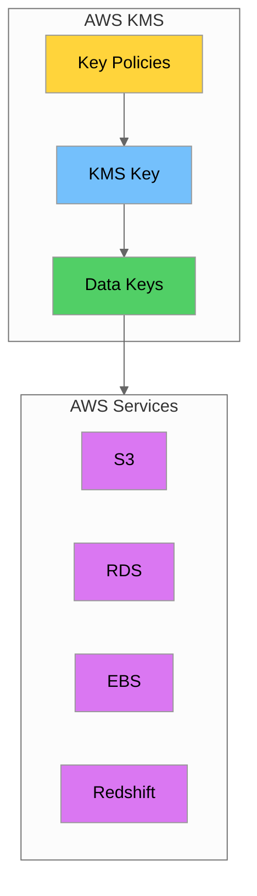

### Key Concepts

#### KMS Keys

> **Note:** AWS deprecated the term "Customer Master Key (CMK)" in favor of "KMS key" in 2022. Throughout this tutorial, we use the current terminology "KMS key" to refer to the primary cryptographic keys managed by AWS KMS.

KMS keys are the primary resources in AWS KMS. They can be:

| KMS Key Type | Description | Use Case |
|--------------|-------------|----------|
| **AWS Managed** | Created and managed by AWS services | Default encryption for S3, EBS |
| **Customer Managed** | Created and managed by you | Custom encryption requirements |
| **AWS Owned** | Owned by AWS, used across accounts | Shared service encryption |

#### Creating a Customer Managed KMS Key

```bash
# Create a symmetric KMS key for encrypting taxi data
aws kms create-key \
    --description "NYC Taxi Data Encryption Key" \
    --key-usage ENCRYPT_DECRYPT \
    --key-spec SYMMETRIC_DEFAULT \
    --tags TagKey=Project,TagValue=NYCTaxi TagKey=Environment,TagValue=Production

# Create an alias for easier reference
aws kms create-alias \
    --alias-name alias/nyc-taxi-key \
    --target-key-id <key-id-from-above>

# List all keys
aws kms list-keys

# Describe a specific key
aws kms describe-key --key-id alias/nyc-taxi-key
```

#### Key Policies

Key policies are resource-based policies that control access to CMKs:

```json
{
    "Version": "2012-10-17",
    "Id": "nyc-taxi-key-policy",
    "Statement": [
        {
            "Sid": "Enable IAM User Permissions",
            "Effect": "Allow",
            "Principal": {
                "AWS": "arn:aws:iam::123456789012:root"
            },
            "Action": "kms:*",
            "Resource": "*"
        },
        {
            "Sid": "Allow Data Engineering Team",
            "Effect": "Allow",
            "Principal": {
                "AWS": "arn:aws:iam::123456789012:role/DataEngineerRole"
            },
            "Action": [
                "kms:Encrypt",
                "kms:Decrypt",
                "kms:GenerateDataKey",
                "kms:DescribeKey"
            ],
            "Resource": "*",
            "Condition": {
                "StringEquals": {
                    "kms:ViaService": "s3.us-east-1.amazonaws.com"
                }
            }
        }
    ]
}
```

### Envelope Encryption

Envelope encryption is a strategy where you encrypt data with a data key, then encrypt the data key with a KMS key. This approach is more efficient for large datasets.

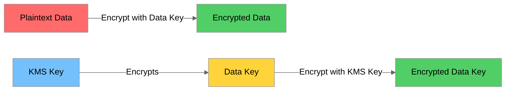

#### Python Implementation of Envelope Encryption

```python
import boto3
import base64
from cryptography.fernet import Fernet
from cryptography.hazmat.primitives.kdf.hkdf import HKDF
from cryptography.hazmat.primitives import hashes
import json

class TaxiDataEncryption:
    """Envelope encryption for NYC Taxi data using AWS KMS."""
    
    def __init__(self, key_id: str, region: str = 'us-east-1'):
        self.kms_client = boto3.client('kms', region_name=region)
        self.key_id = key_id
    
    def generate_data_key(self) -> tuple:
        """Generate a data key using KMS."""
        response = self.kms_client.generate_data_key(
            KeyId=self.key_id,
            KeySpec='AES_256',
            EncryptionContext={
                'purpose': 'taxi-data-encryption',
                'dataset': 'yellow-taxi-trips'
            }
        )
        return response['Plaintext'], response['CiphertextBlob']
    
    def _derive_fernet_key(self, plaintext_key: bytes) -> bytes:
        """
        Derive a Fernet-compatible key using HKDF.
        
        Note: Simple slicing (plaintext_key[:32]) is not cryptographically sound.
        HKDF provides proper key derivation with domain separation.
        """
        hkdf = HKDF(
            algorithm=hashes.SHA256(),
            length=32,
            salt=None,
            info=b'taxi-data-encryption'
        )
        derived_key = hkdf.derive(plaintext_key)
        return base64.urlsafe_b64encode(derived_key)
    
    def encrypt_data(self, data: dict) -> dict:
        """Encrypt taxi trip data using envelope encryption."""
        plaintext_key, encrypted_key = self.generate_data_key()
        
        # Use proper key derivation instead of simple slicing
        fernet_key = self._derive_fernet_key(plaintext_key)
        cipher = Fernet(fernet_key)
        
        json_data = json.dumps(data).encode()
        encrypted_data = cipher.encrypt(json_data)
        
        return {
            'encrypted_data': base64.b64encode(encrypted_data).decode(),
            'encrypted_key': base64.b64encode(encrypted_key).decode(),
            'encryption_context': {
                'purpose': 'taxi-data-encryption',
                'dataset': 'yellow-taxi-trips'
            }
        }
    
    def decrypt_data(self, encrypted_payload: dict) -> dict:
        """Decrypt taxi trip data."""
        encrypted_key = base64.b64decode(encrypted_payload['encrypted_key'])
        
        response = self.kms_client.decrypt(
            CiphertextBlob=encrypted_key,
            EncryptionContext=encrypted_payload['encryption_context']
        )
        
        plaintext_key = response['Plaintext']
        # Use the same key derivation as encryption
        fernet_key = self._derive_fernet_key(plaintext_key)
        cipher = Fernet(fernet_key)
        
        encrypted_data = base64.b64decode(encrypted_payload['encrypted_data'])
        decrypted_data = cipher.decrypt(encrypted_data)
        
        return json.loads(decrypted_data.decode())
```

### Key Rotation

Key rotation is essential for security compliance:

```bash
# Enable automatic key rotation (rotates annually)
aws kms enable-key-rotation --key-id alias/nyc-taxi-key

# Check rotation status
aws kms get-key-rotation-status --key-id alias/nyc-taxi-key

# Manual rotation - create new key and update alias
NEW_KEY_ID=$(aws kms create-key \
    --description "NYC Taxi Data Encryption Key v2" \
    --query 'KeyMetadata.KeyId' \
    --output text)

aws kms update-alias \
    --alias-name alias/nyc-taxi-key \
    --target-key-id $NEW_KEY_ID
```

### AWS Secrets Manager

AWS Secrets Manager helps you protect secrets needed to access your applications and services.

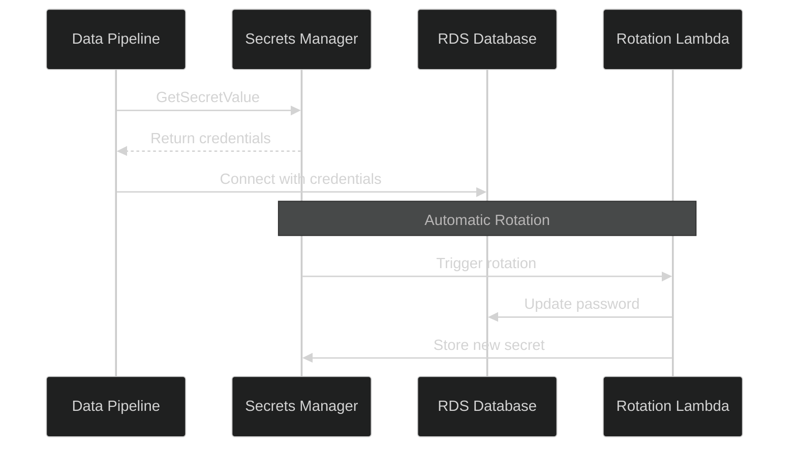

#### Creating and Managing Secrets

```bash
# Create a secret for RDS database credentials
aws secretsmanager create-secret \
    --name "nyc-taxi/rds/master" \
    --description "Master credentials for NYC Taxi RDS database" \
    --secret-string '{"username":"admin","password":"MySecureP@ssw0rd!","host":"taxi-db.us-east-1.rds.amazonaws.com","port":5432,"dbname":"taxi_data"}'

# Retrieve a secret
aws secretsmanager get-secret-value \
    --secret-id "nyc-taxi/rds/master" \
    --query 'SecretString' \
    --output text

# List all secrets
aws secretsmanager list-secrets --filters Key=name,Values=nyc-taxi
```

#### Python Integration with Secrets Manager

```python
import boto3
import json
from botocore.exceptions import ClientError
import psycopg2

class SecretsManagerClient:
    """Client for retrieving secrets from AWS Secrets Manager."""
    
    def __init__(self, region: str = 'us-east-1'):
        self.client = boto3.client('secretsmanager', region_name=region)
        self._cache = {}
    
    def get_secret(self, secret_name: str, use_cache: bool = True) -> dict:
        """Retrieve a secret from Secrets Manager."""
        if use_cache and secret_name in self._cache:
            return self._cache[secret_name]
        
        try:
            response = self.client.get_secret_value(SecretId=secret_name)
            secret = json.loads(response['SecretString'])
            
            if use_cache:
                self._cache[secret_name] = secret
            return secret
            
        except ClientError as e:
            if e.response['Error']['Code'] == 'ResourceNotFoundException':
                raise Exception(f"Secret {secret_name} not found")
            raise
    
    def get_rds_connection(self, secret_name: str):
        """Get a PostgreSQL connection using credentials from Secrets Manager."""
        creds = self.get_secret(secret_name)
        return psycopg2.connect(
            host=creds['host'],
            port=creds['port'],
            database=creds['dbname'],
            user=creds['username'],
            password=creds['password'],
            sslmode='require'
        )
```

#### Terraform Configuration for KMS and Secrets Manager

```hcl
# KMS Key for NYC Taxi Data
resource "aws_kms_key" "taxi_data_key" {
  description             = "KMS key for NYC Taxi data encryption"
  deletion_window_in_days = 30
  enable_key_rotation     = true
  
  tags = {
    Project     = "NYCTaxi"
    Environment = "Production"
  }
}

resource "aws_kms_alias" "taxi_data_key_alias" {
  name          = "alias/nyc-taxi-key"
  target_key_id = aws_kms_key.taxi_data_key.key_id
}

# Secrets Manager Secret for RDS
resource "aws_secretsmanager_secret" "rds_credentials" {
  name        = "nyc-taxi/rds/master"
  description = "Master credentials for NYC Taxi RDS database"
  kms_key_id  = aws_kms_key.taxi_data_key.arn
}

resource "aws_secretsmanager_secret_version" "rds_credentials" {
  secret_id = aws_secretsmanager_secret.rds_credentials.id
  secret_string = jsonencode({
    username = "admin"
    password = random_password.rds_password.result
    host     = aws_db_instance.taxi_db.endpoint
    port     = 5432
    dbname   = "taxi_data"
  })
}

resource "random_password" "rds_password" {
  length  = 32
  special = true
}
```

---

## IAM Policies and Least Privilege

### IAM Policy Structure

IAM policies are JSON documents that define permissions:

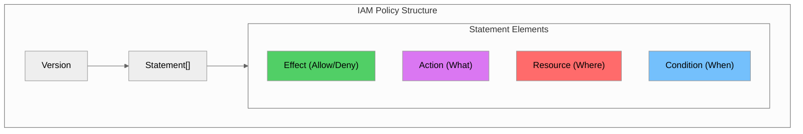

### Policy Elements Explained

| Element | Description | Example |
|---------|-------------|---------|
| **Version** | Policy language version | `"2012-10-17"` |
| **Statement** | Array of permission statements | `[{...}, {...}]` |
| **Sid** | Statement identifier (optional) | `"AllowS3Read"` |
| **Effect** | Allow or Deny | `"Allow"` |
| **Principal** | Who the policy applies to | `{"AWS": "arn:aws:iam::123456789012:user/alice"}` |
| **Action** | What actions are allowed/denied | `["s3:GetObject", "s3:ListBucket"]` |
| **Resource** | Which resources the actions apply to | `"arn:aws:s3:::nyc-taxi-data/*"` |
| **Condition** | When the policy applies | `{"IpAddress": {"aws:SourceIp": "10.0.0.0/8"}}` |

### Identity-Based vs Resource-Based Policies

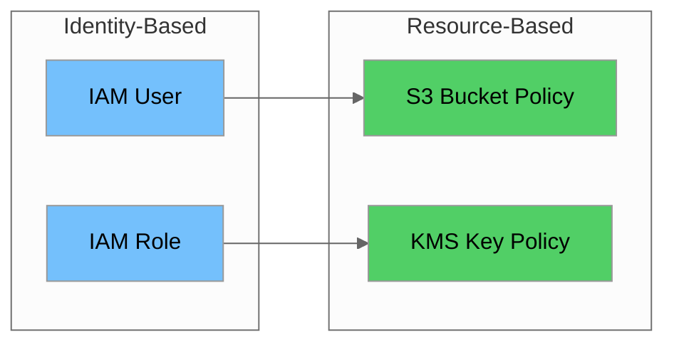

### Example IAM Policies for NYC Taxi Data Platform

#### Data Engineer Role Policy

```json
{
    "Version": "2012-10-17",
    "Statement": [
        {
            "Sid": "S3TaxiDataAccess",
            "Effect": "Allow",
            "Action": [
                "s3:GetObject",
                "s3:PutObject",
                "s3:DeleteObject",
                "s3:ListBucket"
            ],
            "Resource": [
                "arn:aws:s3:::nyc-taxi-raw-data",
                "arn:aws:s3:::nyc-taxi-raw-data/*",
                "arn:aws:s3:::nyc-taxi-processed-data",
                "arn:aws:s3:::nyc-taxi-processed-data/*"
            ],
            "Condition": {
                "StringEquals": {
                    "s3:x-amz-server-side-encryption": "aws:kms"
                }
            }
        },
        {
            "Sid": "GlueJobAccess",
            "Effect": "Allow",
            "Action": [
                "glue:GetJob",
                "glue:StartJobRun",
                "glue:GetJobRun"
            ],
            "Resource": [
                "arn:aws:glue:us-east-1:123456789012:job/nyc-taxi-*"
            ]
        },
        {
            "Sid": "KMSDecrypt",
            "Effect": "Allow",
            "Action": [
                "kms:Decrypt",
                "kms:GenerateDataKey"
            ],
            "Resource": [
                "arn:aws:kms:us-east-1:123456789012:key/taxi-data-key-id"
            ]
        }
    ]
}
```

#### Data Analyst Role Policy (Read-Only)

```json
{
    "Version": "2012-10-17",
    "Statement": [
        {
            "Sid": "S3ReadOnly",
            "Effect": "Allow",
            "Action": [
                "s3:GetObject",
                "s3:ListBucket"
            ],
            "Resource": [
                "arn:aws:s3:::nyc-taxi-processed-data",
                "arn:aws:s3:::nyc-taxi-processed-data/*"
            ]
        },
        {
            "Sid": "DenyPIIAccess",
            "Effect": "Deny",
            "Action": "s3:GetObject",
            "Resource": [
                "arn:aws:s3:::nyc-taxi-processed-data/pii/*"
            ]
        },
        {
            "Sid": "AthenaReadOnly",
            "Effect": "Allow",
            "Action": [
                "athena:StartQueryExecution",
                "athena:GetQueryExecution",
                "athena:GetQueryResults"
            ],
            "Resource": [
                "arn:aws:athena:us-east-1:123456789012:workgroup/analyst-workgroup"
            ]
        }
    ]
}
```

### Permission Boundaries

Permission boundaries set the maximum permissions that an identity-based policy can grant:

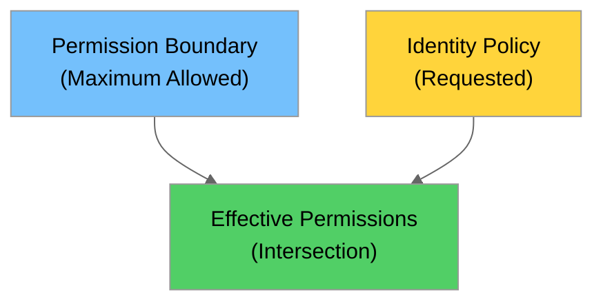

#### Permission Boundary Example

```json
{
    "Version": "2012-10-17",
    "Statement": [
        {
            "Sid": "AllowedServices",
            "Effect": "Allow",
            "Action": [
                "s3:*",
                "glue:*",
                "athena:*",
                "secretsmanager:GetSecretValue",
                "kms:Decrypt",
                "logs:*"
            ],
            "Resource": "*"
        },
        {
            "Sid": "DenyIAMChanges",
            "Effect": "Deny",
            "Action": [
                "iam:CreateUser",
                "iam:DeleteUser",
                "iam:CreateRole",
                "iam:DeleteRole"
            ],
            "Resource": "*"
        }
    ]
}
```

### Service Control Policies (SCPs)

SCPs are organization-level policies that set permission guardrails:

```json
{
    "Version": "2012-10-17",
    "Statement": [
        {
            "Sid": "RequireS3Encryption",
            "Effect": "Deny",
            "Action": "s3:PutObject",
            "Resource": "*",
            "Condition": {
                "Null": {
                    "s3:x-amz-server-side-encryption": "true"
                }
            }
        },
        {
            "Sid": "DenyUnencryptedRDS",
            "Effect": "Deny",
            "Action": [
                "rds:CreateDBInstance",
                "rds:CreateDBCluster"
            ],
            "Resource": "*",
            "Condition": {
                "Bool": {
                    "rds:StorageEncrypted": "false"
                }
            }
        }
    ]
}
```

### IAM Access Analyzer

```bash
# Create an analyzer for the account
aws accessanalyzer create-analyzer \
    --analyzer-name taxi-data-analyzer \
    --type ACCOUNT \
    --tags Project=NYCTaxi

# List findings
aws accessanalyzer list-findings \
    --analyzer-arn arn:aws:access-analyzer:us-east-1:123456789012:analyzer/taxi-data-analyzer

# Validate a policy
aws accessanalyzer validate-policy \
    --policy-document file://policy.json \
    --policy-type IDENTITY_POLICY
```

### Implementing Least Privilege

| Step | Action | Example |
|------|--------|---------|
| 1 | Identify required actions | List all S3, Glue, Athena operations needed |
| 2 | Scope to specific resources | Use ARNs instead of wildcards |
| 3 | Add conditions | Restrict by IP, time, tags, encryption |
| 4 | Use permission boundaries | Set maximum allowed permissions |
| 5 | Regular review | Use Access Analyzer and CloudTrail |

---

## PII Detection and Masking

### What is PII (Personally Identifiable Information)?

PII is any information that can be used to identify an individual:

| PII Category | Examples | Sensitivity |
|--------------|----------|-------------|
| **Direct Identifiers** | Driver license, SSN, Name | High |
| **Quasi-Identifiers** | Pickup/dropoff location + time | Medium |
| **Financial Data** | Credit card numbers | High (PCI-DSS) |
| **Contact Information** | Phone numbers, email | Medium |

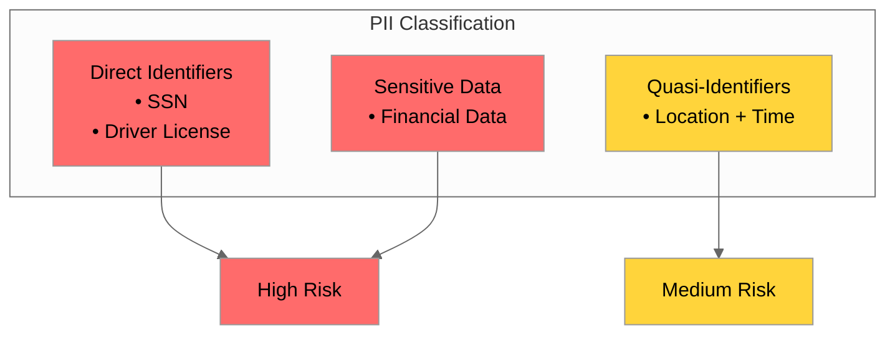

### AWS Macie for Sensitive Data Discovery

Amazon Macie uses machine learning to automatically discover and protect sensitive data:

```bash
# Enable Macie
aws macie2 enable-macie

# Create a classification job for S3 bucket
aws macie2 create-classification-job \
    --job-type ONE_TIME \
    --name "taxi-data-pii-scan" \
    --s3-job-definition '{
        "bucketDefinitions": [
            {
                "accountId": "123456789012",
                "buckets": ["nyc-taxi-raw-data"]
            }
        ]
    }' \
    --managed-data-identifier-selector ALL \
    --description "Scan taxi data for PII"

# Get findings
aws macie2 list-findings \
    --finding-criteria '{
        "criterion": {
            "severity.description": {
                "eq": ["High", "Medium"]
            }
        }
    }'
```

#### Custom Data Identifiers

```bash
# Create custom data identifier for taxi license numbers
aws macie2 create-custom-data-identifier \
    --name "TaxiLicenseNumber" \
    --description "NYC TLC license numbers" \
    --regex "TLC[0-9]{7}" \
    --keywords '["taxi", "license", "TLC", "driver"]'
```

### Data Masking Techniques

| Technique | Description | Reversible | Use Case |
|-----------|-------------|------------|----------|
| **Redaction** | Replace with fixed characters | No | Display masking |
| **Tokenization** | Replace with random token | Yes (with vault) | Payment data |
| **Pseudonymization** | Replace with consistent fake value | Yes (with mapping) | Analytics |
| **Hashing** | One-way cryptographic hash | No | Verification |
| **Encryption** | Encrypt with key | Yes (with key) | Storage |
| **Generalization** | Reduce precision | No | Location data |

#### Python Data Masking Library

```python
import hashlib
import secrets
import re
from typing import Dict, Any, List
from dataclasses import dataclass
from enum import Enum

class MaskingTechnique(Enum):
    REDACT = "redact"
    TOKENIZE = "tokenize"
    HASH = "hash"
    PSEUDONYMIZE = "pseudonymize"
    GENERALIZE = "generalize"

@dataclass
class MaskingRule:
    field_name: str
    technique: MaskingTechnique
    preserve_chars: int = 4

class PIIMasker:
    """Comprehensive PII masking for taxi data."""
    
    def __init__(self):
        self.token_vault: Dict[str, str] = {}
        self.pseudonym_map: Dict[str, str] = {}
        self.patterns = {
            'ssn': r'\d{3}-\d{2}-\d{4}',
            'credit_card': r'\d{4}[\s-]?\d{4}[\s-]?\d{4}[\s-]?\d{4}',
            'phone': r'\(?\d{3}\)?[\s.-]?\d{3}[\s.-]?\d{4}',
            'email': r'[a-zA-Z0-9._%+-]+@[a-zA-Z0-9.-]+\.[a-zA-Z]{2,}',
            'tlc_license': r'TLC\d{7}'
        }
    
    def redact(self, value: str, preserve_last: int = 4) -> str:
        """Redact a value, preserving last N characters."""
        if not value or len(value) <= preserve_last:
            return 'X' * len(value) if value else ''
        return 'X' * (len(value) - preserve_last) + value[-preserve_last:]
    
    def tokenize(self, value: str) -> str:
        """Replace value with a random token."""
        if value in self.token_vault:
            return self.token_vault[value]
        token = f"tok_{secrets.token_hex(16)}"
        self.token_vault[value] = token
        return token
    
    def hash_value(self, value: str, salt: str = None) -> str:
        """Create a one-way hash of the value."""
        salt = salt or secrets.token_hex(8)
        salted_value = f"{salt}{value}"
        hash_digest = hashlib.sha256(salted_value.encode()).hexdigest()
        return f"{salt}${hash_digest}"
    
    def pseudonymize(self, value: str, category: str = 'default') -> str:
        """Replace with a consistent pseudonym."""
        key = f"{category}:{value}"
        if key not in self.pseudonym_map:
            counter = len([k for k in self.pseudonym_map if k.startswith(category)])
            self.pseudonym_map[key] = f"{category.upper()}_{counter + 1:05d}"
        return self.pseudonym_map[key]
    
    def generalize_location(self, lat: float, lon: float, precision: int = 2) -> tuple:
        """Reduce location precision for privacy."""
        return (round(lat, precision), round(lon, precision))
    
    def mask_record(self, record: Dict[str, Any], rules: List[MaskingRule]) -> Dict[str, Any]:
        """Apply masking rules to a record."""
        masked = record.copy()
        
        for rule in rules:
            if rule.field_name not in masked:
                continue
            
            value = str(masked[rule.field_name])
            
            if rule.technique == MaskingTechnique.REDACT:
                masked[rule.field_name] = self.redact(value, rule.preserve_chars)
            elif rule.technique == MaskingTechnique.TOKENIZE:
                masked[rule.field_name] = self.tokenize(value)
            elif rule.technique == MaskingTechnique.HASH:
                masked[rule.field_name] = self.hash_value(value)
            elif rule.technique == MaskingTechnique.PSEUDONYMIZE:
                masked[rule.field_name] = self.pseudonymize(value, rule.field_name)
        
        return masked
    
    def detect_pii(self, text: str) -> Dict[str, List[str]]:
        """Detect PII patterns in text."""
        findings = {}
        for pii_type, pattern in self.patterns.items():
            matches = re.findall(pattern, text)
            if matches:
                findings[pii_type] = matches
        return findings


# Example usage
if __name__ == "__main__":
    masker = PIIMasker()
    
    rules = [
        MaskingRule('driver_license', MaskingTechnique.REDACT, preserve_chars=4),
        MaskingRule('payment_card', MaskingTechnique.TOKENIZE),
        MaskingRule('driver_name', MaskingTechnique.PSEUDONYMIZE),
    ]
    
    trip = {
        'trip_id': 'TXN-2025-001',
        'driver_license': 'NY12345678',
        'driver_name': 'John Smith',
        'payment_card': '4111111111111111',
        'fare_amount': 25.50
    }
    
    masked_trip = masker.mask_record(trip, rules)
    print("Masked:", masked_trip)
```

### Dynamic Data Masking in Redshift

Redshift supports dynamic data masking to protect sensitive data at query time:

```sql
-- Create a masking policy for driver license
CREATE MASKING POLICY mask_driver_license
WITH (driver_license VARCHAR(20))
USING (
    CASE
        WHEN current_user IN ('admin', 'data_engineer') THEN driver_license
        ELSE CONCAT('XXX-XXX-', RIGHT(driver_license, 4))
    END
);

-- Apply masking policy to table
ALTER TABLE taxi_trips
ALTER COLUMN driver_license
SET MASKING POLICY mask_driver_license;

-- View to show masked data for analysts
CREATE VIEW taxi_trips_masked AS
SELECT
    trip_id,
    CONCAT('XXX-XXX-', RIGHT(driver_license, 4)) as driver_license,
    pickup_datetime,
    dropoff_datetime,
    ROUND(pickup_latitude, 2) as pickup_latitude,
    ROUND(pickup_longitude, 2) as pickup_longitude,
    passenger_count,
    trip_distance,
    fare_amount
FROM taxi_trips;

GRANT SELECT ON taxi_trips_masked TO analyst_role;
```

---

## Complete Governance Framework

### Data Governance Pillars

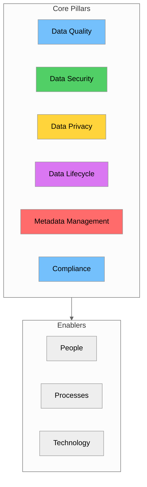

### Roles and Responsibilities

| Role | Responsibilities | NYC Taxi Example |
|------|------------------|------------------|
| **Data Owner** | Business accountability, access decisions | VP of Operations owns trip data |
| **Data Steward** | Day-to-day data quality, metadata management | Data Quality Analyst |
| **Data Custodian** | Technical implementation, security controls | Data Engineer |
| **Data Consumer** | Proper use of data, reporting issues | Business Analysts |
| **Data Protection Officer** | Privacy compliance, GDPR/CCPA oversight | Legal/Compliance Team |

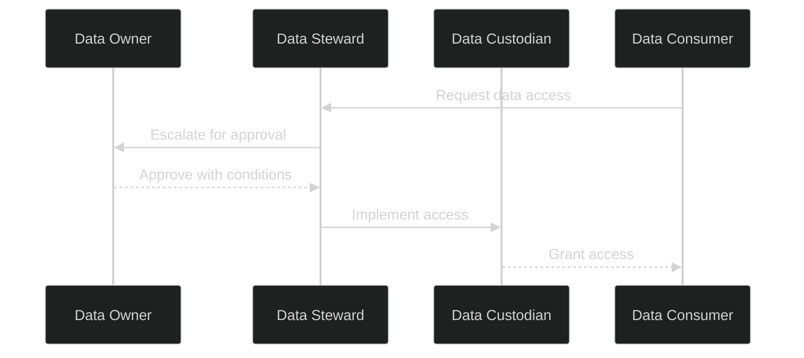

### Data Classification Policy

```yaml
# data_classification_policy.yaml
classification_levels:
  - level: PUBLIC
    description: "Data that can be freely shared"
    controls:
      - encryption_at_rest: optional
      - encryption_in_transit: required
    examples:
      - "Aggregated trip statistics"
      - "Public API responses"

  - level: INTERNAL
    description: "Data for internal use only"
    controls:
      - encryption_at_rest: required
      - encryption_in_transit: required
      - access_review: quarterly
    examples:
      - "Trip details without PII"
      - "Operational metrics"

  - level: CONFIDENTIAL
    description: "Sensitive business data"
    controls:
      - encryption_at_rest: required_kms
      - access_review: monthly
      - data_masking: required_for_non_prod
    examples:
      - "Driver performance data"
      - "Revenue details"

  - level: RESTRICTED
    description: "Highly sensitive PII/PCI data"
    controls:
      - encryption_at_rest: required_kms_cmk
      - access_review: weekly
      - data_masking: required_always
      - retention: 90_days_max
    examples:
      - "Driver license numbers"
      - "Payment card data"

# Note: AWS deprecated "CMK" terminology in 2022
# Use "KMS key" instead of "Customer Master Key (CMK)"
# required_kms_cmk above refers to customer-managed KMS keys
```

### Data Quality Management

```python
from dataclasses import dataclass
from typing import List, Dict, Any
import pandas as pd

@dataclass
class DataQualityRule:
    name: str
    dimension: str  # completeness, accuracy, consistency, timeliness
    check_type: str
    threshold: float
    column: str = None

class DataQualityChecker:
    """Data quality checker for taxi data."""
    
    def __init__(self):
        self.rules = [
            DataQualityRule(
                name="trip_id_not_null",
                dimension="completeness",
                check_type="not_null",
                threshold=1.0,
                column="trip_id"
            ),
            DataQualityRule(
                name="fare_positive",
                dimension="accuracy",
                check_type="positive",
                threshold=0.99,
                column="fare_amount"
            ),
        ]
    
    def check_completeness(self, df: pd.DataFrame, column: str) -> float:
        """Check completeness of a column."""
        return 1 - (df[column].isna().sum() / len(df))
    
    def check_positive(self, df: pd.DataFrame, column: str) -> float:
        """Check if values are positive."""
        return (df[column] > 0).sum() / len(df)
    
    def run_checks(self, df: pd.DataFrame) -> List[Dict[str, Any]]:
        """Run all quality checks."""
        results = []
        for rule in self.rules:
            if rule.check_type == "not_null":
                score = self.check_completeness(df, rule.column)
            elif rule.check_type == "positive":
                score = self.check_positive(df, rule.column)
            else:
                score = 1.0
            
            results.append({
                'rule': rule.name,
                'dimension': rule.dimension,
                'score': score,
                'threshold': rule.threshold,
                'passed': score >= rule.threshold
            })
        return results
```

---

## MDM Tools: AWS Solutions

### AWS Lake Formation for Data Governance

AWS Lake Formation provides centralized governance for data lakes:

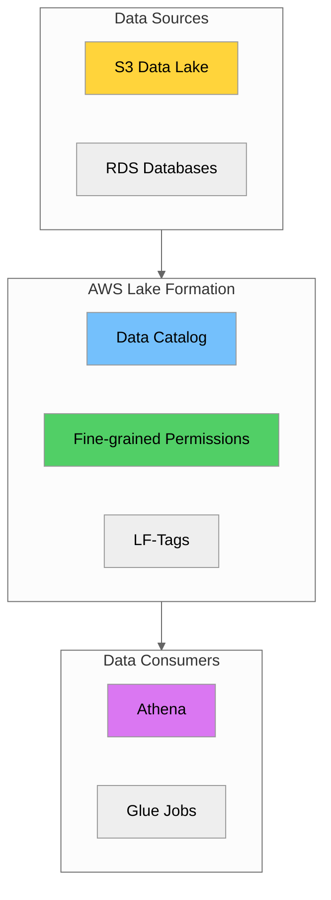

#### Setting Up Lake Formation

```bash
# Register S3 location with Lake Formation
aws lakeformation register-resource \
    --resource-arn arn:aws:s3:::nyc-taxi-data-lake \
    --use-service-linked-role

# Create LF-Tags for classification
aws lakeformation create-lf-tag \
    --tag-key "sensitivity" \
    --tag-values "public" "internal" "confidential" "restricted"

aws lakeformation create-lf-tag \
    --tag-key "domain" \
    --tag-values "trips" "drivers" "payments" "analytics"

# Grant permissions using tags
aws lakeformation grant-permissions \
    --principal '{"DataLakePrincipalIdentifier": "arn:aws:iam::123456789012:role/DataAnalyst"}' \
    --resource '{"LFTagPolicy": {"ResourceType": "TABLE", "Expression": [{"TagKey": "sensitivity", "TagValues": ["public", "internal"]}]}}' \
    --permissions "SELECT" "DESCRIBE"
```

### AWS Glue Data Catalog

The Glue Data Catalog serves as a central metadata repository:

```python
import boto3
from typing import Dict, List

class GlueCatalogManager:
    """Manage AWS Glue Data Catalog for taxi data."""
    
    def __init__(self, region: str = 'us-east-1'):
        self.glue = boto3.client('glue', region_name=region)
    
    def create_database(self, name: str, description: str, location: str):
        """Create a Glue database."""
        self.glue.create_database(
            DatabaseInput={
                'Name': name,
                'Description': description,
                'LocationUri': location,
                'Parameters': {
                    'classification': 'taxi-data',
                    'owner': 'data-engineering'
                }
            }
        )
    
    def create_table(self, database: str, table_name: str,
                     columns: List[Dict], location: str,
                     partition_keys: List[Dict] = None):
        """Create a Glue table."""
        table_input = {
            'Name': table_name,
            'StorageDescriptor': {
                'Columns': columns,
                'Location': location,
                'InputFormat': 'org.apache.hadoop.hive.ql.io.parquet.MapredParquetInputFormat',
                'OutputFormat': 'org.apache.hadoop.hive.ql.io.parquet.MapredParquetOutputFormat',
                'SerdeInfo': {
                    'SerializationLibrary': 'org.apache.hadoop.hive.ql.io.parquet.serde.ParquetHiveSerDe'
                }
            },
            'TableType': 'EXTERNAL_TABLE'
        }
        
        if partition_keys:
            table_input['PartitionKeys'] = partition_keys
        
        self.glue.create_table(
            DatabaseName=database,
            TableInput=table_input
        )
```

### Build vs Buy Considerations

| Factor | Build Custom | AWS Native | Third-Party |
|--------|--------------|------------|-------------|
| **Cost** | High initial, low ongoing | Pay-per-use | License + usage |
| **Time to Value** | 6-12 months | 1-3 months | 2-4 months |
| **Customization** | Full control | Limited | Moderate |
| **Maintenance** | Internal team | AWS managed | Vendor managed |
| **Integration** | Custom development | Native AWS | Connectors needed |

---

## Multi-Domain MDM Patterns

### Single-Domain vs Multi-Domain MDM

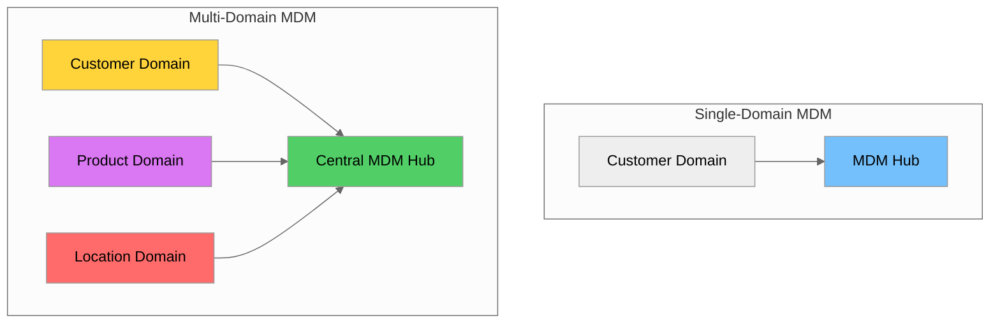

### Hub-and-Spoke Architecture

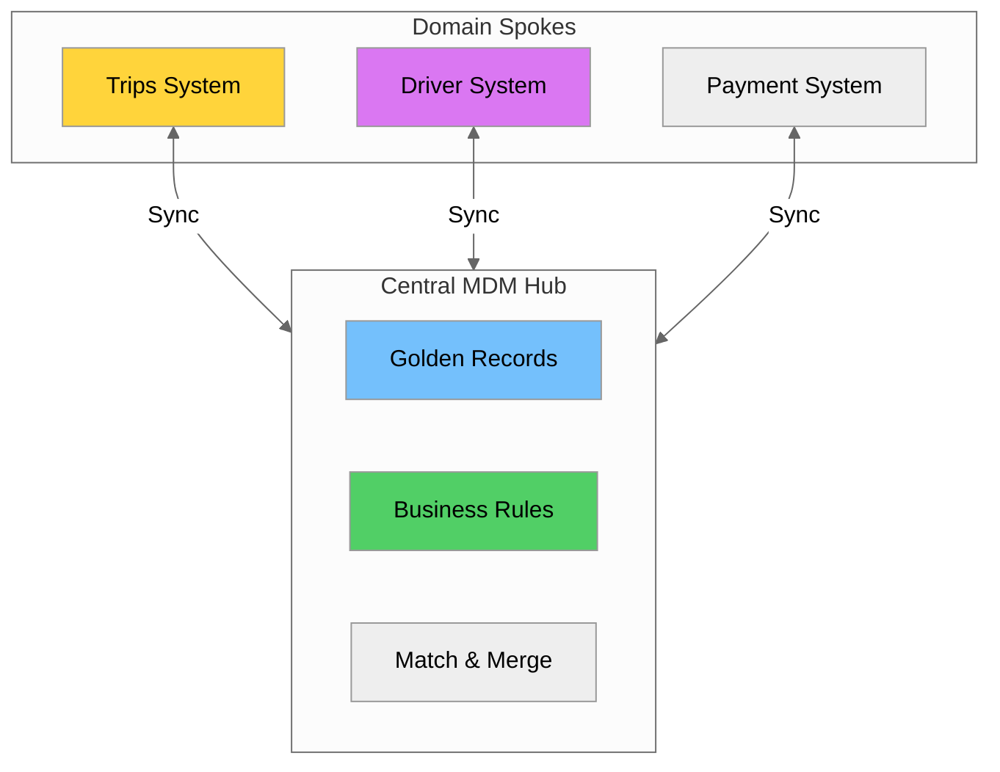

### Federated MDM Pattern

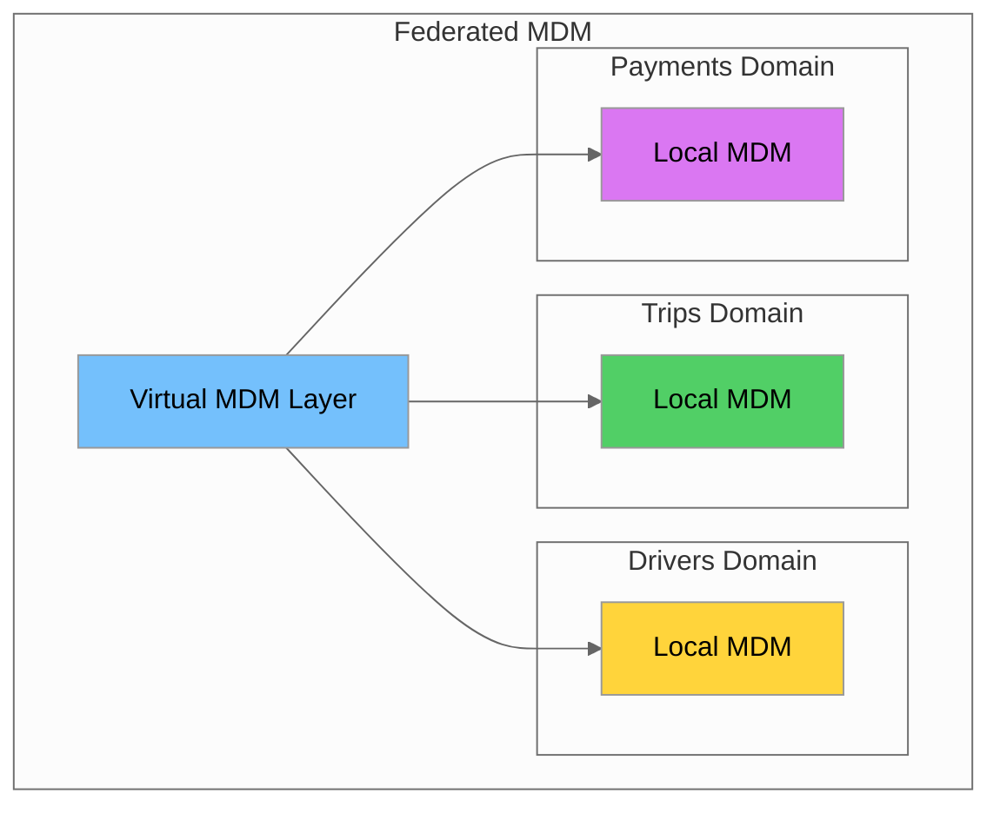

### Cross-Domain Relationships

```python
from dataclasses import dataclass
from typing import List
from enum import Enum

class RelationshipType(Enum):
    ONE_TO_ONE = "1:1"
    ONE_TO_MANY = "1:N"
    MANY_TO_MANY = "N:N"

@dataclass
class DomainEntity:
    domain: str
    entity_type: str
    key_attributes: List[str]

@dataclass
class CrossDomainRelationship:
    source: DomainEntity
    target: DomainEntity
    relationship_type: RelationshipType
    foreign_key: str
    description: str

class MultiDomainMDM:
    """Multi-domain MDM for NYC Taxi data."""
    
    def __init__(self):
        self.domains = {
            'trips': DomainEntity('trips', 'trip', ['trip_id']),
            'drivers': DomainEntity('drivers', 'driver', ['driver_id']),
            'vehicles': DomainEntity('vehicles', 'vehicle', ['vehicle_id']),
            'locations': DomainEntity('locations', 'zone', ['zone_id']),
            'payments': DomainEntity('payments', 'payment', ['payment_id'])
        }
        
        self.relationships = [
            CrossDomainRelationship(
                source=self.domains['trips'],
                target=self.domains['drivers'],
                relationship_type=RelationshipType.MANY_TO_MANY,
                foreign_key='driver_id',
                description='Driver who completed the trip'
            ),
            CrossDomainRelationship(
                source=self.domains['trips'],
                target=self.domains['payments'],
                relationship_type=RelationshipType.ONE_TO_ONE,
                foreign_key='payment_id',
                description='Payment for the trip'
            ),
        ]
    
    def get_domain_relationships(self, domain: str) -> List[CrossDomainRelationship]:
        """Get all relationships for a domain."""
        return [
            r for r in self.relationships
            if r.source.domain == domain or r.target.domain == domain
        ]
```

### Domain Prioritization Matrix

| Domain | Business Impact | Data Volume | Complexity | Priority |
|--------|-----------------|-------------|------------|----------|
| **Trips** | High | Very High | Medium | 1 |
| **Drivers** | High | Medium | High (PII) | 2 |
| **Payments** | Critical | High | High (PCI) | 1 |
| **Vehicles** | Medium | Low | Low | 3 |
| **Locations** | Medium | Low | Low | 4 |

---

## Hands-on Labs

### Lab 1: Implement Encryption for S3 and RDS

#### Objective
Configure server-side encryption for S3 buckets and RDS instances using AWS KMS.

#### Steps

```bash
# Step 1: Create KMS key
KEY_ID=$(aws kms create-key \
    --description "Taxi Data Encryption Key" \
    --query 'KeyMetadata.KeyId' \
    --output text)

aws kms create-alias \
    --alias-name alias/taxi-encryption-key \
    --target-key-id $KEY_ID

# Step 2: Create S3 bucket with encryption
aws s3api create-bucket \
    --bucket nyc-taxi-encrypted-data \
    --region us-east-1

aws s3api put-bucket-encryption \
    --bucket nyc-taxi-encrypted-data \
    --server-side-encryption-configuration '{
        "Rules": [{
            "ApplyServerSideEncryptionByDefault": {
                "SSEAlgorithm": "aws:kms",
                "KMSMasterKeyID": "alias/taxi-encryption-key"
            },
            "BucketKeyEnabled": true
        }]
    }'

# Step 3: Block public access
aws s3api put-public-access-block \
    --bucket nyc-taxi-encrypted-data \
    --public-access-block-configuration '{
        "BlockPublicAcls": true,
        "IgnorePublicAcls": true,
        "BlockPublicPolicy": true,
        "RestrictPublicBuckets": true
    }'

# Step 4: Create encrypted RDS instance
# First, create a DB subnet group (requires existing VPC subnets)
aws rds create-db-subnet-group \
    --db-subnet-group-name taxi-db-subnet-group \
    --db-subnet-group-description "Subnet group for taxi database" \
    --subnet-ids subnet-xxxxxxxx subnet-yyyyyyyy

# Generate a secure password and store in Secrets Manager
DB_PASSWORD=$(aws secretsmanager get-random-password \
    --password-length 32 \
    --exclude-punctuation \
    --query RandomPassword \
    --output text)

aws secretsmanager create-secret \
    --name "nyc-taxi/rds/master-password" \
    --secret-string "$DB_PASSWORD"

# Create encrypted RDS PostgreSQL instance
aws rds create-db-instance \
    --db-instance-identifier taxi-db-encrypted \
    --db-instance-class db.t3.micro \
    --engine postgres \
    --engine-version 15.4 \
    --master-username admin \
    --master-user-password "$DB_PASSWORD" \
    --allocated-storage 20 \
    --storage-type gp3 \
    --storage-encrypted \
    --kms-key-id alias/taxi-encryption-key \
    --vpc-security-group-ids sg-xxxxxxxx \
    --db-subnet-group-name taxi-db-subnet-group \
    --no-publicly-accessible \
    --backup-retention-period 7 \
    --deletion-protection \
    --tags Key=Project,Value=NYCTaxi Key=Environment,Value=Production

# Wait for RDS instance to be available
aws rds wait db-instance-available \
    --db-instance-identifier taxi-db-encrypted

# Verify encryption is enabled
aws rds describe-db-instances \
    --db-instance-identifier taxi-db-encrypted \
    --query 'DBInstances[0].{
        Identifier: DBInstanceIdentifier,
        Encrypted: StorageEncrypted,
        KmsKeyId: KmsKeyId,
        Status: DBInstanceStatus
    }'
```

> **Important:** RDS encryption must be enabled at instance creation time. You cannot encrypt an existing unencrypted RDS instance directly. To encrypt an existing instance, you must create an encrypted snapshot and restore from it.

### Lab 2: Configure VPC with Private Subnets

#### Objective
Set up a secure VPC with private subnets for data workloads.

```hcl
# vpc.tf - Terraform configuration
resource "aws_vpc" "taxi_vpc" {
  cidr_block           = "10.0.0.0/16"
  enable_dns_hostnames = true
  enable_dns_support   = true
  
  tags = {
    Name = "taxi-data-vpc"
  }
}

# Private subnets for data workloads
resource "aws_subnet" "private" {
  count             = 2
  vpc_id            = aws_vpc.taxi_vpc.id
  cidr_block        = "10.0.${count.index + 1}.0/24"
  availability_zone = data.aws_availability_zones.available.names[count.index]
  
  tags = {
    Name = "taxi-private-${count.index + 1}"
  }
}

# Public subnets for NAT Gateway
resource "aws_subnet" "public" {
  count                   = 2
  vpc_id                  = aws_vpc.taxi_vpc.id
  cidr_block              = "10.0.${count.index + 10}.0/24"
  availability_zone       = data.aws_availability_zones.available.names[count.index]
  map_public_ip_on_launch = true
  
  tags = {
    Name = "taxi-public-${count.index + 1}"
  }
}

# NAT Gateway for private subnet internet access
resource "aws_eip" "nat" {
  domain = "vpc"
}

resource "aws_nat_gateway" "main" {
  allocation_id = aws_eip.nat.id
  subnet_id     = aws_subnet.public[0].id
}

# Route table for private subnets
resource "aws_route_table" "private" {
  vpc_id = aws_vpc.taxi_vpc.id
  
  route {
    cidr_block     = "0.0.0.0/0"
    nat_gateway_id = aws_nat_gateway.main.id
  }
}
```

### Lab 3: Set Up IAM with Least Privilege

#### Objective
Create IAM roles and policies following least privilege principles.

```bash
# Create Data Engineer role
aws iam create-role \
    --role-name DataEngineerRole \
    --assume-role-policy-document '{
        "Version": "2012-10-17",
        "Statement": [{
            "Effect": "Allow",
            "Principal": {"AWS": "arn:aws:iam::123456789012:root"},
            "Action": "sts:AssumeRole",
            "Condition": {
                "Bool": {"aws:MultiFactorAuthPresent": "true"}
            }
        }]
    }'

# Create and attach policy
aws iam put-role-policy \
    --role-name DataEngineerRole \
    --policy-name DataEngineerPolicy \
    --policy-document file://data-engineer-policy.json

# Create permission boundary
aws iam create-policy \
    --policy-name DataEngineerBoundary \
    --policy-document file://permission-boundary.json

# Attach permission boundary
aws iam put-role-permissions-boundary \
    --role-name DataEngineerRole \
    --permissions-boundary arn:aws:iam::123456789012:policy/DataEngineerBoundary
```

### Lab 4: Implement PII Masking

#### Objective
Create a data masking pipeline for taxi data.

```python
import pandas as pd
from pii_masker import PIIMasker, MaskingRule, MaskingTechnique

def mask_taxi_data(input_path: str, output_path: str):
    """Mask PII in taxi data before loading to analytics."""
    
    # Read raw data
    df = pd.read_parquet(input_path)
    
    # Initialize masker
    masker = PIIMasker()
    
    # Define masking rules
    rules = [
        MaskingRule('driver_license', MaskingTechnique.REDACT, preserve_chars=4),
        MaskingRule('driver_name', MaskingTechnique.PSEUDONYMIZE),
        MaskingRule('passenger_email', MaskingTechnique.HASH),
        MaskingRule('payment_card', MaskingTechnique.TOKENIZE),
    ]
    
    # Apply masking to each record
    masked_records = []
    for _, row in df.iterrows():
        masked_record = masker.mask_record(row.to_dict(), rules)
        masked_records.append(masked_record)
    
    # Create masked DataFrame
    masked_df = pd.DataFrame(masked_records)
    
    # Generalize location data
    if 'pickup_latitude' in masked_df.columns:
        masked_df['pickup_latitude'] = masked_df['pickup_latitude'].round(2)
        masked_df['pickup_longitude'] = masked_df['pickup_longitude'].round(2)
        masked_df['dropoff_latitude'] = masked_df['dropoff_latitude'].round(2)
        masked_df['dropoff_longitude'] = masked_df['dropoff_longitude'].round(2)
    
    # Save masked data
    masked_df.to_parquet(output_path, index=False)
    
    print(f"Masked {len(masked_df)} records")
    return masked_df

# Run masking
if __name__ == "__main__":
    mask_taxi_data(
        'data/yellow_tripdata_2025-08.parquet',
        'data/yellow_tripdata_2025-08_masked.parquet'
    )
```

### Lab 5: Design Multi-Domain MDM Architecture

#### Objective
Design and document a multi-domain MDM architecture for taxi data.

```python
from multi_domain_mdm import MultiDomainMDM

def design_mdm_architecture():
    """Design multi-domain MDM for NYC Taxi."""
    
    mdm = MultiDomainMDM()
    
    # Generate ER diagram
    er_diagram = """
    erDiagram
        TRIP ||--o{ DRIVER : "driven_by"
        TRIP ||--|| PAYMENT : "paid_with"
        TRIP ||--o{ VEHICLE : "uses"
        TRIP ||--o{ LOCATION : "pickup"
        TRIP ||--o{ LOCATION : "dropoff"
        
        TRIP {
            string trip_id PK
            timestamp pickup_datetime
            timestamp dropoff_datetime
            int passenger_count
            float trip_distance
            float fare_amount
        }
        
        DRIVER {
            string driver_id PK
            string license_number
            string name
            date license_expiry
        }
        
        VEHICLE {
            string vehicle_id PK
            string medallion
            string make
            string model
            int year
        }
        
        LOCATION {
            int zone_id PK
            string borough
            string zone_name
            geometry boundary
        }
        
        PAYMENT {
            string payment_id PK
            string payment_type
            float amount
            float tip_amount
        }
    """
    
    print("MDM Architecture Design:")
    print("=" * 50)
    print(f"Domains: {list(mdm.domains.keys())}")
    print(f"Relationships: {len(mdm.relationships)}")
    print("\nER Diagram (Mermaid):")
    print(er_diagram)
    
    return mdm

if __name__ == "__main__":
    design_mdm_architecture()
```

---

## Summary

### Key Takeaways

1. **AWS KMS and Secrets Manager**
   - Use KMS keys for encryption key management
   - Implement envelope encryption for large datasets
   - Enable automatic key rotation
   - Store credentials in Secrets Manager with rotation

2. **IAM Policies and Least Privilege**
   - Structure policies with Effect, Action, Resource, Condition
   - Use permission boundaries to limit maximum permissions
   - Implement SCPs for organization-wide guardrails
   - Regularly audit with IAM Access Analyzer

3. **PII Detection and Masking**
   - Classify data by sensitivity level
   - Use AWS Macie for automated PII discovery
   - Apply appropriate masking techniques (redaction, tokenization, hashing)
   - Implement dynamic masking for query-time protection

4. **Data Governance Framework**
   - Define clear roles: Owner, Steward, Custodian, Consumer
   - Establish data classification policies
   - Implement data quality checks
   - Manage data lifecycle with retention policies

5. **MDM Tools and Patterns**
   - Use AWS Lake Formation for centralized governance
   - Leverage Glue Data Catalog for metadata management
   - Choose appropriate MDM pattern (hub-and-spoke, federated)
   - Define cross-domain relationships clearly

### Security Checklist

| Category | Item | Status |
|----------|------|--------|
| **Encryption** | S3 bucket encryption enabled | ☐ |
| **Encryption** | RDS storage encryption enabled | ☐ |
| **Encryption** | KMS key rotation enabled | ☐ |
| **Access Control** | IAM policies follow least privilege | ☐ |
| **Access Control** | Permission boundaries configured | ☐ |
| **Access Control** | MFA required for sensitive operations | ☐ |
| **Data Protection** | PII identified and classified | ☐ |
| **Data Protection** | Masking policies implemented | ☐ |
| **Data Protection** | Secrets stored in Secrets Manager | ☐ |
| **Governance** | Data classification policy defined | ☐ |
| **Governance** | Retention policies implemented | ☐ |
| **Governance** | Data quality checks automated | ☐ |

---

## Additional Resources

### AWS Documentation
- [AWS KMS Developer Guide](https://docs.aws.amazon.com/kms/latest/developerguide/)
- [AWS Secrets Manager User Guide](https://docs.aws.amazon.com/secretsmanager/latest/userguide/)
- [IAM Best Practices](https://docs.aws.amazon.com/IAM/latest/UserGuide/best-practices.html)
- [Amazon Macie User Guide](https://docs.aws.amazon.com/macie/latest/user/)
- [AWS Lake Formation Developer Guide](https://docs.aws.amazon.com/lake-formation/latest/dg/)

### Security Frameworks
- [NIST Cybersecurity Framework](https://www.nist.gov/cyberframework)
- [CIS AWS Foundations Benchmark](https://www.cisecurity.org/benchmark/amazon_web_services)
- [AWS Well-Architected Security Pillar](https://docs.aws.amazon.com/wellarchitected/latest/security-pillar/)

### Data Governance Resources
- [DAMA-DMBOK (Data Management Body of Knowledge)](https://www.dama.org/cpages/body-of-knowledge)
- [AWS Data Governance Best Practices](https://aws.amazon.com/big-data/datalakes-and-analytics/data-governance/)

### Compliance Standards
- [GDPR (General Data Protection Regulation)](https://gdpr.eu/)
- [CCPA (California Consumer Privacy Act)](https://oag.ca.gov/privacy/ccpa)
- [PCI-DSS (Payment Card Industry Data Security Standard)](https://www.pcisecuritystandards.org/)
- [HIPAA (Health Insurance Portability and Accountability Act)](https://www.hhs.gov/hipaa/)

---

*Tutorial completed. Next: Day 20 - Capstone Project Planning*