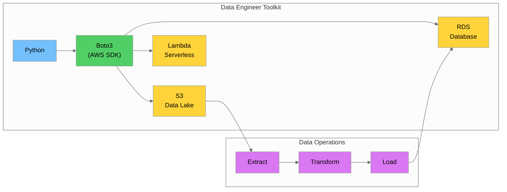
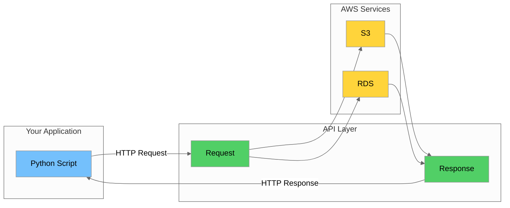
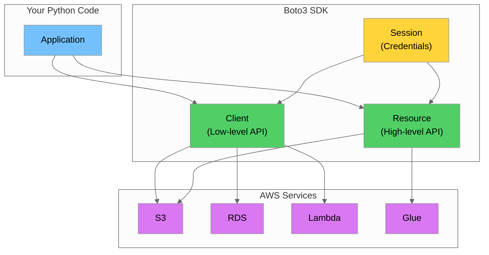
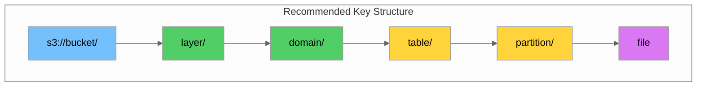
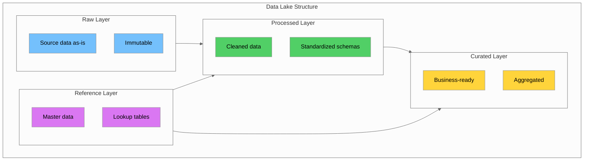

# Day 2: Python & AWS SDK (Boto3) for Data Engineering

## Table of Contents

- [Introduction \& Learning Objectives](#introduction--learning-objectives)
- [Part 1: Python Fundamentals for Data Engineering](#part-1-python-fundamentals-for-data-engineering)
- [Part 2: Introduction to Boto3](#part-2-introduction-to-boto3)
- [Part 3: S3 Operations with Boto3](#part-3-s3-operations-with-boto3)
- [Part 4: Data File Formats](#part-4-data-file-formats)
- [Part 5: Best Practices \& Patterns](#part-5-best-practices--patterns)
- [Part 6: Hands-on Labs](#part-6-hands-on-labs)
- [Summary \& Key Takeaways](#summary--key-takeaways)
- [Additional Resources](#additional-resources)

---

## Introduction & Learning Objectives

### Overview

Day 2 focuses on **Python programming** and the **AWS SDK (Boto3)** for interacting with AWS services programmatically. As a data engineer, you'll use Python extensively for ETL (Extract, Transform, Load) pipelines, data transformations, and automating AWS infrastructure.



### Prerequisites

Before starting Day 2, ensure you have:

- ✅ Day 1 completed (AWS fundamentals, account setup)
- ✅ Python 3.9+ installed
- ✅ AWS CLI configured with credentials
- ✅ IDE or text editor (VS Code recommended)
- ✅ Basic understanding of command-line operations

### Learning Objectives

By the end of Day 2, you will be able to:

1. **Write Python scripts** for data processing and automation
2. **Configure Boto3** for AWS service interactions
3. **Perform S3 operations** (create buckets, upload/download files, manage objects)
4. **Apply bucket policies** and access controls programmatically
5. **Implement tagging strategies** for data governance
6. **Configure lifecycle rules** for cost optimization
7. **Work with data formats** (CSV, Parquet, JSON)
8. **Handle errors** and implement retry logic

---

## Part 1: Python Fundamentals for Data Engineering

### 1.1 Python Environment Setup

#### Virtual Environment

Always use virtual environments to isolate project dependencies:

```bash
# Create virtual environment
python -m venv venv

# Activate (macOS/Linux)
source venv/bin/activate

# Activate (Windows)
venv\Scripts\activate

# Install required packages
pip install boto3 pandas pyarrow python-dotenv
```

#### Project Structure

```
data-engineering-project/
├── venv/
├── src/
│   ├── __init__.py
│   ├── s3_operations.py
│   ├── transformations.py
│   └── utils.py
├── tests/
│   ├── __init__.py
│   └── test_s3_operations.py
├── data/
│   ├── raw/
│   └── processed/
├── requirements.txt
├── .env
└── .gitignore
```

#### Requirements File

```txt
# requirements.txt
boto3>=1.34.0
pandas>=2.0.0
pyarrow>=14.0.0
python-dotenv>=1.0.0
pytest>=7.4.0
```

### 1.2 Python Data Structures for Data Engineering

#### Lists and List Comprehensions

```python
# Processing a list of S3 keys
file_keys = [
    "raw/2024/01/data.parquet",
    "raw/2024/02/data.parquet",
    "raw/2024/03/data.parquet"
]

# Filter for specific month
january_files = [f for f in file_keys if "/01/" in f]

# Transform keys
processed_keys = [f.replace("raw/", "processed/") for f in file_keys]
```

#### Dictionaries

```python
# Metadata dictionary for S3 objects
object_metadata = {
    "ContentType": "application/x-parquet",
    "Metadata": {
        "owner": "data-team",
        "classification": "internal",
        "domain": "transport"
    }
}

# Accessing nested values
owner = object_metadata["Metadata"]["owner"]

# Safe access with .get()
classification = object_metadata.get("Metadata", {}).get("classification", "unknown")
```

#### Working with JSON

```python
import json

# Dictionary to JSON string
config = {
    "bucket": "my-data-lake",
    "prefix": "raw/taxi/",
    "format": "parquet"
}
json_string = json.dumps(config, indent=2)

# JSON string to dictionary
parsed_config = json.loads(json_string)

# Read JSON file
with open("config.json", "r") as f:
    config = json.load(f)

# Write JSON file
with open("output.json", "w") as f:
    json.dump(config, f, indent=2)
```

### 1.3 Error Handling

Proper error handling is crucial for reliable data pipelines:

```python
import logging

# Configure logging
logging.basicConfig(
    level=logging.INFO,
    format='%(asctime)s - %(name)s - %(levelname)s - %(message)s'
)
logger = logging.getLogger(__name__)

def safe_operation(func):
    """Decorator for error handling"""
    def wrapper(*args, **kwargs):
        try:
            return func(*args, **kwargs)
        except FileNotFoundError as e:
            logger.error(f"File not found: {e}")
            raise
        except PermissionError as e:
            logger.error(f"Permission denied: {e}")
            raise
        except Exception as e:
            logger.error(f"Unexpected error: {e}")
            raise
    return wrapper

@safe_operation
def process_file(file_path: str) -> dict:
    """Process a data file with error handling"""
    with open(file_path, 'r') as f:
        return json.load(f)
```

### 1.4 Type Hints

Use type hints for better code documentation and IDE support:

```python
from typing import List, Dict, Optional, Any

def upload_files(
    bucket_name: str,
    file_paths: List[str],
    prefix: Optional[str] = None
) -> Dict[str, Any]:
    """
    Upload multiple files to S3.

    Args:
        bucket_name: Target S3 bucket name
        file_paths: List of local file paths to upload
        prefix: Optional S3 prefix for uploaded files

    Returns:
        Dictionary with upload results
    """
    results = {
        "success": [],
        "failed": []
    }
    # Implementation here
    return results
```

---

## Part 1.5: Understanding APIs

Before diving into Boto3, it's important to understand what APIs are, since Boto3 is essentially a Python wrapper around AWS APIs.

### What is an API?

An **API (Application Programming Interface)** is a set of rules and protocols that allows different software applications to communicate with each other. Think of it as a waiter in a restaurant:

- **You (the client)** tell the waiter what you want
- **The waiter (API)** takes your request to the kitchen
- **The kitchen (server)** prepares your order
- **The waiter (API)** brings back the result



### Types of APIs

| Type | Description | Example |
|------|-------------|---------|
| **REST API** | Uses HTTP methods (GET, POST, PUT, DELETE) | AWS APIs, most web services |
| **GraphQL** | Query language for APIs, client specifies data needed | GitHub API v4 |
| **SOAP** | XML-based protocol, more rigid structure | Legacy enterprise systems |
| **SDK** | Software Development Kit - library wrapping API calls | Boto3 for AWS |

### How Boto3 Uses APIs

When you call a Boto3 method like `s3_client.list_buckets()`, here's what happens:

1. **Boto3** constructs an HTTP request with proper authentication
2. **The request** is sent to AWS's REST API endpoint
3. **AWS** processes the request and returns a response
4. **Boto3** parses the response and returns Python objects

This abstraction means you don't need to manually construct HTTP requests, handle authentication headers, or parse JSON responses—Boto3 does it all for you.

---

## Part 2: Introduction to Boto3

### 2.1 What is Boto3?

**Boto3** is the official AWS SDK (Software Development Kit) for Python. It allows you to create, configure, and manage AWS services programmatically. The name "Boto" comes from a species of freshwater dolphin native to the Amazon River.

> **What is an SDK?** A **Software Development Kit (SDK)** is a collection of software tools, libraries, and documentation that developers use to create applications for a specific platform. Boto3 provides Python classes and methods that map to AWS service APIs, so you can interact with AWS without writing raw HTTP requests.



### 2.2 Client vs Resource

Boto3 provides two ways to interact with AWS services:

| Aspect | Client (Low-level) | Resource (High-level) |
|--------|-------------------|----------------------|
| **API Style** | 1:1 mapping to AWS API | Object-oriented, Pythonic |
| **Response** | Raw dictionary responses | Objects with attributes |
| **Use Case** | Full API access, complex operations | Common operations, cleaner code |
| **Example** | `s3_client.list_objects_v2()` | `bucket.objects.all()` |

```python
import boto3

# Client approach (low-level)
s3_client = boto3.client('s3')
response = s3_client.list_objects_v2(Bucket='my-bucket')
for obj in response.get('Contents', []):
    print(obj['Key'])

# Resource approach (high-level)
s3_resource = boto3.resource('s3')
bucket = s3_resource.Bucket('my-bucket')
for obj in bucket.objects.all():
    print(obj.key)
```

### 2.3 Configuration and Credentials

#### Credential Chain

Boto3 looks for credentials in this order:

1. **Explicitly passed** to `boto3.client()` or `boto3.Session()`
2. **Environment variables** (`AWS_ACCESS_KEY_ID`, `AWS_SECRET_ACCESS_KEY`)
3. **Shared credentials file** (`~/.aws/credentials`)
4. **AWS config file** (`~/.aws/config`)
5. **IAM role** (for EC2, Lambda, etc.)

```python
import boto3
from dotenv import load_dotenv
import os

# Load environment variables from .env file
load_dotenv()

# Method 1: Use default credential chain (recommended)
s3_client = boto3.client('s3')

# Method 2: Explicit credentials (not recommended for production)
s3_client = boto3.client(
    's3',
    aws_access_key_id=os.getenv('AWS_ACCESS_KEY_ID'),
    aws_secret_access_key=os.getenv('AWS_SECRET_ACCESS_KEY'),
    region_name='us-east-1'
)

# Method 3: Using a session (for multiple profiles)
session = boto3.Session(profile_name='dev-profile')
s3_client = session.client('s3')
```

#### Environment File (.env)

```bash
# .env (NEVER commit this file!)
AWS_ACCESS_KEY_ID=your_access_key
AWS_SECRET_ACCESS_KEY=your_secret_key
AWS_DEFAULT_REGION=us-east-1
```

#### .gitignore

```gitignore
# .gitignore
.env
*.pyc
__pycache__/
venv/
.aws/
```

### 2.4 Sessions

Sessions manage state and configuration:

```python
import boto3

# Default session
default_session = boto3.Session()

# Custom session with specific profile and region
custom_session = boto3.Session(
    profile_name='production',
    region_name='us-west-2'
)

# Get available profiles
available_profiles = boto3.Session().available_profiles
print(f"Available profiles: {available_profiles}")

# Get current region
current_region = boto3.Session().region_name
print(f"Current region: {current_region}")
```

---

## Part 3: S3 Operations with Boto3

### 3.1 Bucket Operations

#### Creating a Bucket

```python
import boto3
from botocore.exceptions import ClientError

s3_client = boto3.client('s3')

def create_bucket(bucket_name: str, region: str = 'us-east-1') -> bool:
    """
    Create an S3 bucket.

    Note: Bucket names must be globally unique across all AWS accounts.
    """
    try:
        if region == 'us-east-1':
            # us-east-1 doesn't need LocationConstraint
            s3_client.create_bucket(Bucket=bucket_name)
        else:
            s3_client.create_bucket(
                Bucket=bucket_name,
                CreateBucketConfiguration={'LocationConstraint': region}
            )
        print(f"Bucket '{bucket_name}' created successfully")
        return True
    except ClientError as e:
        error_code = e.response['Error']['Code']
        if error_code == 'BucketAlreadyOwnedByYou':
            print(f"Bucket '{bucket_name}' already exists and is owned by you")
            return True
        elif error_code == 'BucketAlreadyExists':
            print(f"Bucket '{bucket_name}' already exists globally")
            return False
        else:
            print(f"Error creating bucket: {e}")
            raise

# Usage
create_bucket('my-data-lake-bucket-12345')
```

#### Listing Buckets

```python
def list_buckets() -> list:
    """List all S3 buckets in the account"""
    response = s3_client.list_buckets()

    buckets = []
    for bucket in response['Buckets']:
        buckets.append({
            'name': bucket['Name'],
            'created': bucket['CreationDate']
        })
        print(f"  {bucket['Name']} (created: {bucket['CreationDate']})")

    return buckets

# Usage
my_buckets = list_buckets()
```

#### Deleting a Bucket

```python
def delete_bucket(bucket_name: str, force: bool = False) -> bool:
    """
    Delete an S3 bucket.

    Args:
        bucket_name: Name of bucket to delete
        force: If True, delete all objects first (dangerous!)
    """
    try:
        if force:
            # Delete all objects first
            s3_resource = boto3.resource('s3')
            bucket = s3_resource.Bucket(bucket_name)
            bucket.objects.all().delete()
            print(f"Deleted all objects in '{bucket_name}'")

        s3_client.delete_bucket(Bucket=bucket_name)
        print(f"Bucket '{bucket_name}' deleted successfully")
        return True
    except ClientError as e:
        if e.response['Error']['Code'] == 'BucketNotEmpty':
            print(f"Bucket '{bucket_name}' is not empty. Use force=True to delete anyway.")
        else:
            print(f"Error deleting bucket: {e}")
        return False
```

### 3.2 Object Operations

#### Uploading Files

```python
import os
from pathlib import Path

def upload_file(
    file_path: str,
    bucket_name: str,
    object_key: str = None,
    metadata: dict = None
) -> bool:
    """
    Upload a file to S3.

    Args:
        file_path: Local path to the file
        bucket_name: Target S3 bucket
        object_key: S3 object key (defaults to filename)
        metadata: Optional metadata dictionary
    """
    if object_key is None:
        object_key = Path(file_path).name

    extra_args = {}
    if metadata:
        extra_args['Metadata'] = metadata

    try:
        s3_client.upload_file(
            Filename=file_path,
            Bucket=bucket_name,
            Key=object_key,
            ExtraArgs=extra_args if extra_args else None
        )
        print(f"Uploaded '{file_path}' to 's3://{bucket_name}/{object_key}'")
        return True
    except ClientError as e:
        print(f"Error uploading file: {e}")
        return False

# Upload with prefix (folder structure)
def upload_file_with_prefix(
    file_path: str,
    bucket_name: str,
    prefix: str
) -> bool:
    """Upload a file with a prefix (simulating folder structure)"""
    filename = Path(file_path).name
    object_key = f"{prefix.rstrip('/')}/{filename}"
    return upload_file(file_path, bucket_name, object_key)

# Usage
upload_file(
    'data/yellow_tripdata_2025-08.parquet',
    'my-data-lake',
    'raw/taxi/yellow_tripdata_2025-08.parquet',
    metadata={'owner': 'data-team', 'source': 'nyc-tlc'}
)

upload_file_with_prefix(
    'data/taxi_zone_lookup.csv',
    'my-data-lake',
    'reference/zones/'
)
```

#### Downloading Files

```python
def download_file(
    bucket_name: str,
    object_key: str,
    local_path: str = None
) -> str:
    """
    Download a file from S3.

    Args:
        bucket_name: Source S3 bucket
        object_key: S3 object key
        local_path: Local destination path (defaults to current dir)

    Returns:
        Path to downloaded file
    """
    if local_path is None:
        local_path = Path(object_key).name

    # Create directory if needed
    Path(local_path).parent.mkdir(parents=True, exist_ok=True)

    try:
        s3_client.download_file(bucket_name, object_key, local_path)
        print(f"Downloaded 's3://{bucket_name}/{object_key}' to '{local_path}'")
        return local_path
    except ClientError as e:
        print(f"Error downloading file: {e}")
        raise

# Usage
download_file(
    'my-data-lake',
    'raw/taxi/yellow_tripdata_2025-08.parquet',
    'data/downloads/yellow_tripdata_2025-08.parquet'
)
```

#### Listing Objects

```python
def list_objects(
    bucket_name: str,
    prefix: str = '',
    max_keys: int = 1000
) -> list:
    """
    List objects in an S3 bucket.

    Args:
        bucket_name: S3 bucket name
        prefix: Filter by prefix
        max_keys: Maximum number of keys to return
    """
    objects = []
    paginator = s3_client.get_paginator('list_objects_v2')

    for page in paginator.paginate(
        Bucket=bucket_name,
        Prefix=prefix,
        PaginationConfig={'MaxItems': max_keys}
    ):
        for obj in page.get('Contents', []):
            objects.append({
                'key': obj['Key'],
                'size': obj['Size'],
                'last_modified': obj['LastModified'],
                'storage_class': obj.get('StorageClass', 'STANDARD')
            })

    return objects

# Usage
taxi_files = list_objects('my-data-lake', prefix='raw/taxi/')
for f in taxi_files:
    size_mb = f['size'] / (1024 * 1024)
    print(f"  {f['key']} ({size_mb:.2f} MB)")
```

#### Deleting Objects

```python
def delete_object(bucket_name: str, object_key: str) -> bool:
    """Delete a single object from S3"""
    try:
        s3_client.delete_object(Bucket=bucket_name, Key=object_key)
        print(f"Deleted 's3://{bucket_name}/{object_key}'")
        return True
    except ClientError as e:
        print(f"Error deleting object: {e}")
        return False

def delete_objects(bucket_name: str, object_keys: list) -> dict:
    """Delete multiple objects from S3"""
    objects_to_delete = [{'Key': key} for key in object_keys]

    try:
        response = s3_client.delete_objects(
            Bucket=bucket_name,
            Delete={'Objects': objects_to_delete}
        )

        deleted = [obj['Key'] for obj in response.get('Deleted', [])]
        errors = response.get('Errors', [])

        return {'deleted': deleted, 'errors': errors}
    except ClientError as e:
        print(f"Error deleting objects: {e}")
        raise
```

### 3.3 Bucket Policies

Bucket policies control access to S3 buckets and objects:

```python
import json

def set_bucket_policy(bucket_name: str, policy: dict) -> bool:
    """
    Apply a bucket policy.

    Args:
        bucket_name: Target bucket
        policy: Policy document as dictionary
    """
    try:
        policy_string = json.dumps(policy)
        s3_client.put_bucket_policy(Bucket=bucket_name, Policy=policy_string)
        print(f"Policy applied to bucket '{bucket_name}'")
        return True
    except ClientError as e:
        print(f"Error setting bucket policy: {e}")
        return False

def get_bucket_policy(bucket_name: str) -> dict:
    """Get the current bucket policy"""
    try:
        response = s3_client.get_bucket_policy(Bucket=bucket_name)
        return json.loads(response['Policy'])
    except ClientError as e:
        if e.response['Error']['Code'] == 'NoSuchBucketPolicy':
            return None
        raise

# Example: Allow specific IAM user full access
bucket_policy = {
    "Version": "2012-10-17",
    "Statement": [
        {
            "Sid": "AllowSpecificUserAccess",
            "Effect": "Allow",
            "Principal": {
                "AWS": "arn:aws:iam::123456789012:user/data-engineer"
            },
            "Action": "s3:*",
            "Resource": [
                "arn:aws:s3:::my-data-lake",
                "arn:aws:s3:::my-data-lake/*"
            ]
        }
    ]
}

set_bucket_policy('my-data-lake', bucket_policy)
```

### 3.4 Object Tagging

Tags help with organization, cost allocation, and data governance:

```python
def tag_object(
    bucket_name: str,
    object_key: str,
    tags: dict
) -> bool:
    """
    Apply tags to an S3 object.

    Args:
        bucket_name: S3 bucket name
        object_key: Object key
        tags: Dictionary of tag key-value pairs
    """
    tag_set = [{'Key': k, 'Value': v} for k, v in tags.items()]

    try:
        s3_client.put_object_tagging(
            Bucket=bucket_name,
            Key=object_key,
            Tagging={'TagSet': tag_set}
        )
        print(f"Tagged '{object_key}' with {len(tags)} tags")
        return True
    except ClientError as e:
        print(f"Error tagging object: {e}")
        return False

def get_object_tags(bucket_name: str, object_key: str) -> dict:
    """Get tags for an S3 object"""
    try:
        response = s3_client.get_object_tagging(
            Bucket=bucket_name,
            Key=object_key
        )
        return {tag['Key']: tag['Value'] for tag in response['TagSet']}
    except ClientError as e:
        print(f"Error getting tags: {e}")
        return {}

# Usage - Tag data files for governance
tag_object(
    'my-data-lake',
    'raw/taxi/yellow_tripdata_2025-08.parquet',
    {
        'Owner': 'data-team',
        'Classification': 'Internal',
        'Domain': 'Transport',
        'DataSource': 'NYC-TLC',
        'RetentionPolicy': '7-years'
    }
)

# Verify tags
tags = get_object_tags('my-data-lake', 'raw/taxi/yellow_tripdata_2025-08.parquet')
print(f"Tags: {tags}")
```

### 3.5 Lifecycle Configuration

Lifecycle rules automate object transitions and expiration:


```python
def set_lifecycle_configuration(
    bucket_name: str,
    rules: list
) -> bool:
    """
    Set lifecycle configuration for a bucket.

    Args:
        bucket_name: Target bucket
        rules: List of lifecycle rules
    """
    try:
        s3_client.put_bucket_lifecycle_configuration(
            Bucket=bucket_name,
            LifecycleConfiguration={'Rules': rules}
        )
        print(f"Lifecycle configuration applied to '{bucket_name}'")
        return True
    except ClientError as e:
        print(f"Error setting lifecycle configuration: {e}")
        return False

# Example: Different rules for different prefixes
lifecycle_rules = [
    {
        "ID": "archive-raw-data",
        "Status": "Enabled",
        "Filter": {"Prefix": "raw/"},
        "Transitions": [
            {
                "Days": 30,
                "StorageClass": "STANDARD_IA"
            },
            {
                "Days": 90,
                "StorageClass": "GLACIER"
            }
        ],
        "Expiration": {"Days": 365}
    },
    {
        "ID": "expire-temp-files",
        "Status": "Enabled",
        "Filter": {"Prefix": "temp/"},
        "Expiration": {"Days": 7}
    },
    {
        "ID": "keep-processed-longer",
        "Status": "Enabled",
        "Filter": {"Prefix": "processed/"},
        "Transitions": [
            {
                "Days": 90,
                "StorageClass": "STANDARD_IA"
            },
            {
                "Days": 180,
                "StorageClass": "GLACIER"
            }
        ],
        "Expiration": {"Days": 730}  # 2 years
    }
]

set_lifecycle_configuration('my-data-lake', lifecycle_rules)
```

---

## Part 4: Data File Formats

### 4.1 Common Data Formats

| Format | Best For | Compression | Schema | Columnar |
|--------|----------|-------------|--------|----------|
| **CSV** | Simple data, compatibility | No (can gzip) | No | No |
| **JSON** | Semi-structured, APIs | No (can gzip) | No | No |
| **Parquet** | Analytics, big data | Yes (built-in) | Yes | Yes |
| **Avro** | Streaming, schema evolution | Yes | Yes | No |
| **ORC** | Hive/Hadoop ecosystems | Yes | Yes | Yes |

> **Format Deep Dive:**
> - **Avro**: A row-based format developed by Apache. Excellent for streaming data because the schema is stored with the data, making it self-describing. Popular with Apache Kafka.
> - **ORC (Optimized Row Columnar)**: A columnar format optimized for Hive and the Hadoop ecosystem. Provides excellent compression and query performance for large datasets.
> - **Parquet vs ORC**: Both are columnar, but Parquet has broader ecosystem support (Spark, Pandas, AWS services), while ORC is more optimized for Hive workloads.

### 4.2 Working with CSV

CSV (Comma-Separated Values) is a simple text format for tabular data. We use Python's `StringIO` class to work with CSV data in memory.

> **What is StringIO?** `StringIO` is a file-like object that stores text data in memory rather than on disk. It's useful when you need to read/write data without creating actual files—perfect for processing S3 data that arrives as text streams.

```python
import pandas as pd
import boto3
from io import StringIO

s3_client = boto3.client('s3')

def read_csv_from_s3(bucket: str, key: str) -> pd.DataFrame:
    """Read CSV file from S3 into DataFrame"""
    response = s3_client.get_object(Bucket=bucket, Key=key)
    csv_content = response['Body'].read().decode('utf-8')
    return pd.read_csv(StringIO(csv_content))

def write_csv_to_s3(df: pd.DataFrame, bucket: str, key: str) -> bool:
    """Write DataFrame to S3 as CSV"""
    csv_buffer = StringIO()
    df.to_csv(csv_buffer, index=False)

    s3_client.put_object(
        Bucket=bucket,
        Key=key,
        Body=csv_buffer.getvalue(),
        ContentType='text/csv'
    )
    return True

# Usage
zones_df = read_csv_from_s3('my-data-lake', 'reference/taxi_zone_lookup.csv')
print(f"Loaded {len(zones_df)} zones")
```

### 4.3 Working with Parquet

Parquet is the preferred format for analytics workloads. It's a columnar storage format that provides efficient compression and encoding, making queries faster and storage cheaper.

> **What is BytesIO?** Similar to `StringIO`, `BytesIO` is a file-like object that stores binary data in memory. Since Parquet files are binary (not plain text), we use `BytesIO` instead of `StringIO` when working with them.

> **What is PyArrow?** PyArrow is a Python library for working with Apache Arrow, an in-memory columnar data format. Pandas uses PyArrow under the hood to read and write Parquet files efficiently. Install it with `pip install pyarrow`.

```python
import pandas as pd
import pyarrow as pa
import pyarrow.parquet as pq
from io import BytesIO

def read_parquet_from_s3(bucket: str, key: str) -> pd.DataFrame:
    """Read Parquet file from S3 into DataFrame"""
    response = s3_client.get_object(Bucket=bucket, Key=key)
    parquet_content = response['Body'].read()
    return pd.read_parquet(BytesIO(parquet_content))

def write_parquet_to_s3(
    df: pd.DataFrame,
    bucket: str,
    key: str,
    compression: str = 'snappy'
) -> bool:
    """Write DataFrame to S3 as Parquet"""
    parquet_buffer = BytesIO()
    df.to_parquet(parquet_buffer, compression=compression, index=False)

    s3_client.put_object(
        Bucket=bucket,
        Key=key,
        Body=parquet_buffer.getvalue(),
        ContentType='application/x-parquet'
    )
    return True

# Usage
trips_df = read_parquet_from_s3('my-data-lake', 'raw/taxi/yellow_tripdata_2025-08.parquet')
print(f"Loaded {len(trips_df):,} trips")
print(f"Columns: {list(trips_df.columns)}")

# Process and save
processed_df = trips_df[trips_df['fare_amount'] > 0]
write_parquet_to_s3(processed_df, 'my-data-lake', 'processed/taxi/cleaned_trips.parquet')
```

### 4.4 Working with JSON

```python
import json
from io import BytesIO

def read_json_from_s3(bucket: str, key: str) -> dict:
    """Read JSON file from S3"""
    response = s3_client.get_object(Bucket=bucket, Key=key)
    return json.loads(response['Body'].read().decode('utf-8'))

def write_json_to_s3(data: dict, bucket: str, key: str) -> bool:
    """Write dictionary to S3 as JSON"""
    s3_client.put_object(
        Bucket=bucket,
        Key=key,
        Body=json.dumps(data, indent=2),
        ContentType='application/json'
    )
    return True

# JSON Lines (newline-delimited JSON) for large datasets
def read_jsonl_from_s3(bucket: str, key: str) -> list:
    """Read JSON Lines file from S3"""
    response = s3_client.get_object(Bucket=bucket, Key=key)
    content = response['Body'].read().decode('utf-8')
    return [json.loads(line) for line in content.strip().split('\n')]

def write_jsonl_to_s3(records: list, bucket: str, key: str) -> bool:
    """Write list of dicts to S3 as JSON Lines"""
    jsonl_content = '\n'.join(json.dumps(record) for record in records)
    s3_client.put_object(
        Bucket=bucket,
        Key=key,
        Body=jsonl_content,
        ContentType='application/x-ndjson'
    )
    return True
```

---

## Part 5: Best Practices & Patterns

### 5.1 S3 Bucket Naming Conventions

```
<company>-<environment>-<purpose>-<region>

Examples:
- acme-prod-data-lake-us-east-1
- acme-dev-ml-models-us-west-2
- acme-staging-etl-temp-us-east-1
```

### 5.2 S3 Object Key Design



```
# Pattern
s3://<bucket>/<layer>/<domain>/<table>/year=YYYY/month=MM/day=DD/<file>

# Examples
s3://data-lake/raw/transport/yellow_taxi/year=2025/month=08/data.parquet
s3://data-lake/processed/transport/trip_summary/year=2025/month=08/summary.parquet
s3://data-lake/reference/transport/zones/taxi_zone_lookup.csv
```

### 5.3 Error Handling with Retry Logic

```python
import time
from functools import wraps
from botocore.exceptions import ClientError

def retry_with_backoff(max_retries: int = 3, base_delay: float = 1.0):
    """Decorator for retrying AWS operations with exponential backoff"""
    def decorator(func):
        @wraps(func)
        def wrapper(*args, **kwargs):
            last_exception = None

            for attempt in range(max_retries):
                try:
                    return func(*args, **kwargs)
                except ClientError as e:
                    error_code = e.response['Error']['Code']

                    # Don't retry client errors (4xx)
                    if error_code in ['AccessDenied', 'NoSuchBucket', 'NoSuchKey']:
                        raise

                    last_exception = e
                    delay = base_delay * (2 ** attempt)
                    print(f"Attempt {attempt + 1} failed, retrying in {delay}s...")
                    time.sleep(delay)

            raise last_exception
        return wrapper
    return decorator

@retry_with_backoff(max_retries=3)
def reliable_upload(file_path: str, bucket: str, key: str):
    """Upload with automatic retry on transient failures"""
    s3_client.upload_file(file_path, bucket, key)
```

### 5.4 Data Lake Organization



---

## Part 6: Hands-on Labs

### Lab 1: S3 Bucket Setup with Boto3

**Objective**: Create an S3 bucket and configure it for data lake use.

```python
import boto3
import json
from datetime import datetime

# Initialize client
s3_client = boto3.client('s3')

# Configuration
BUCKET_NAME = 'your-name-data-lake-lab'  # Change this!
REGION = 'us-east-1'

def lab1_setup_bucket():
    """Lab 1: Create and configure S3 bucket"""

    print("=" * 50)
    print("LAB 1: S3 BUCKET SETUP")
    print("=" * 50)

    # Step 1: Create bucket
    print("\n1. Creating bucket...")
    try:
        if REGION == 'us-east-1':
            s3_client.create_bucket(Bucket=BUCKET_NAME)
        else:
            s3_client.create_bucket(
                Bucket=BUCKET_NAME,
                CreateBucketConfiguration={'LocationConstraint': REGION}
            )
        print(f"   ✓ Bucket '{BUCKET_NAME}' created")
    except Exception as e:
        print(f"   ✗ Error: {e}")
        return

    # Step 2: Enable versioning
    print("\n2. Enabling versioning...")
    s3_client.put_bucket_versioning(
        Bucket=BUCKET_NAME,
        VersioningConfiguration={'Status': 'Enabled'}
    )
    print("   ✓ Versioning enabled")

    # Step 3: Enable server-side encryption
    print("\n3. Enabling encryption...")
    s3_client.put_bucket_encryption(
        Bucket=BUCKET_NAME,
        ServerSideEncryptionConfiguration={
            'Rules': [{
                'ApplyServerSideEncryptionByDefault': {
                    'SSEAlgorithm': 'AES256'
                }
            }]
        }
    )
    print("   ✓ Server-side encryption enabled (AES256)")

    # Step 4: Block public access
    print("\n4. Blocking public access...")
    s3_client.put_public_access_block(
        Bucket=BUCKET_NAME,
        PublicAccessBlockConfiguration={
            'BlockPublicAcls': True,
            'IgnorePublicAcls': True,
            'BlockPublicPolicy': True,
            'RestrictPublicBuckets': True
        }
    )
    print("   ✓ Public access blocked")

    print(f"\n✓ Bucket '{BUCKET_NAME}' is ready for use!")

# Run the lab
# lab1_setup_bucket()
```

### Lab 2: Upload and Tag Data Files

**Objective**: Upload NYC Taxi data files with proper tagging.

```python
def lab2_upload_and_tag():
    """Lab 2: Upload files with metadata and tags"""

    print("=" * 50)
    print("LAB 2: UPLOAD AND TAG DATA FILES")
    print("=" * 50)

    # Files to upload
    files = [
        {
            'local_path': 'data/yellow_tripdata_2025-08.parquet',
            's3_key': 'raw/taxi/yellow_tripdata_2025-08.parquet',
            'tags': {
                'Owner': 'data-team',
                'Classification': 'Internal',
                'Domain': 'Transport',
                'DataSource': 'NYC-TLC',
                'FileType': 'Parquet'
            }
        },
        {
            'local_path': 'data/taxi_zone_lookup.csv',
            's3_key': 'reference/zones/taxi_zone_lookup.csv',
            'tags': {
                'Owner': 'data-team',
                'Classification': 'Internal',
                'Domain': 'Transport',
                'DataType': 'Reference',
                'FileType': 'CSV'
            }
        }
    ]

    for file_info in files:
        print(f"\nUploading: {file_info['local_path']}")

        # Upload file
        try:
            s3_client.upload_file(
                file_info['local_path'],
                BUCKET_NAME,
                file_info['s3_key']
            )
            print(f"  ✓ Uploaded to s3://{BUCKET_NAME}/{file_info['s3_key']}")
        except FileNotFoundError:
            print(f"  ✗ File not found: {file_info['local_path']}")
            continue

        # Apply tags
        tag_set = [{'Key': k, 'Value': v} for k, v in file_info['tags'].items()]
        s3_client.put_object_tagging(
            Bucket=BUCKET_NAME,
            Key=file_info['s3_key'],
            Tagging={'TagSet': tag_set}
        )
        print(f"  ✓ Applied {len(tag_set)} tags")

# Run the lab
# lab2_upload_and_tag()
```

### Lab 3: Implement Lifecycle Rules

**Objective**: Configure lifecycle rules for cost optimization.

```python
def lab3_lifecycle_rules():
    """Lab 3: Configure lifecycle rules"""

    print("=" * 50)
    print("LAB 3: LIFECYCLE RULES")
    print("=" * 50)

    lifecycle_config = {
        'Rules': [
            {
                'ID': 'archive-raw-data',
                'Status': 'Enabled',
                'Filter': {'Prefix': 'raw/'},
                'Transitions': [
                    {'Days': 30, 'StorageClass': 'STANDARD_IA'},
                    {'Days': 90, 'StorageClass': 'GLACIER'}
                ],
                'Expiration': {'Days': 365}
            },
            {
                'ID': 'expire-temp-files',
                'Status': 'Enabled',
                'Filter': {'Prefix': 'temp/'},
                'Expiration': {'Days': 7}
            },
            {
                'ID': 'manage-processed-data',
                'Status': 'Enabled',
                'Filter': {'Prefix': 'processed/'},
                'Transitions': [
                    {'Days': 60, 'StorageClass': 'STANDARD_IA'},
                    {'Days': 180, 'StorageClass': 'GLACIER'}
                ]
            }
        ]
    }

    print("\nApplying lifecycle rules:")
    for rule in lifecycle_config['Rules']:
        print(f"  - {rule['ID']}: prefix='{rule['Filter']['Prefix']}'")

    s3_client.put_bucket_lifecycle_configuration(
        Bucket=BUCKET_NAME,
        LifecycleConfiguration=lifecycle_config
    )

    print("\n✓ Lifecycle rules configured successfully!")

    # Display cost savings estimate
    print("\nEstimated cost impact:")
    print("  - Raw data (>30 days): ~40% storage cost reduction")
    print("  - Raw data (>90 days): ~80% storage cost reduction")
    print("  - Temp files: Auto-deleted after 7 days")

# Run the lab
# lab3_lifecycle_rules()
```

### Lab 4: Create Bucket Metadata Manifest

**Objective**: Create a metadata manifest file documenting your bucket.

```python
import yaml
from datetime import datetime

def lab4_create_manifest():
    """Lab 4: Create bucket metadata manifest"""

    print("=" * 50)
    print("LAB 4: BUCKET METADATA MANIFEST")
    print("=" * 50)

    manifest = {
        'bucket_name': BUCKET_NAME,
        'region': REGION,
        'environment': 'learning',
        'purpose': 'Learn S3 bucket management through Python/Boto3',
        'owner': {
            'name': 'Your Name',  # Change this!
            'role': 'Data Engineer Intern',
            'contact_email': 'your.email@example.com'
        },
        'data': {
            'classification': 'training',
            'contains_pii': False,
            'encryption': 'SSE-S3 (AES256)',
            'domains': ['transport', 'reference']
        },
        'access': {
            'programmatic_access': True,
            'tools_used': ['boto3', 'python', 'pandas']
        },
        'structure': {
            'raw/': 'Source data as ingested',
            'processed/': 'Cleaned and transformed data',
            'reference/': 'Lookup tables and master data',
            'temp/': 'Temporary processing files'
        },
        'lifecycle_rules': [
            'raw/ -> Standard-IA (30 days) -> Glacier (90 days) -> Delete (365 days)',
            'temp/ -> Delete (7 days)',
            'processed/ -> Standard-IA (60 days) -> Glacier (180 days)'
        ],
        'created_at': datetime.now().isoformat(),
        'created_by': {
            'method': 'boto3',
            'script': 'day-2/boto3-hands-on.py'
        }
    }

    # Save locally
    manifest_path = 'bucket-metadata-manifest.yaml'
    with open(manifest_path, 'w') as f:
        yaml.dump(manifest, f, default_flow_style=False, sort_keys=False)
    print(f"\n✓ Manifest saved to '{manifest_path}'")

    # Upload to S3
    s3_client.upload_file(
        manifest_path,
        BUCKET_NAME,
        'metadata/bucket-manifest.yaml'
    )
    print(f"✓ Manifest uploaded to s3://{BUCKET_NAME}/metadata/bucket-manifest.yaml")

    # Display manifest
    print("\n--- Manifest Contents ---")
    print(yaml.dump(manifest, default_flow_style=False))

# Run the lab
# lab4_create_manifest()
```

### Lab 5: Data Processing Pipeline

**Objective**: Build a simple ETL pipeline using Boto3 and Pandas.

```python
import pandas as pd
from io import BytesIO

def lab5_etl_pipeline():
    """Lab 5: Simple ETL pipeline"""

    print("=" * 50)
    print("LAB 5: ETL PIPELINE")
    print("=" * 50)

    # EXTRACT: Read data from S3
    print("\n1. EXTRACT: Reading data from S3...")

    # Read zones reference data
    response = s3_client.get_object(
        Bucket=BUCKET_NAME,
        Key='reference/zones/taxi_zone_lookup.csv'
    )
    zones_df = pd.read_csv(response['Body'])
    print(f"   ✓ Loaded {len(zones_df)} zones")

    # Read trip data
    response = s3_client.get_object(
        Bucket=BUCKET_NAME,
        Key='raw/taxi/yellow_tripdata_2025-08.parquet'
    )
    trips_df = pd.read_parquet(BytesIO(response['Body'].read()))
    print(f"   ✓ Loaded {len(trips_df):,} trips")

    # TRANSFORM: Clean and enrich data
    print("\n2. TRANSFORM: Processing data...")

    # Remove invalid fares
    valid_trips = trips_df[trips_df['fare_amount'] > 0].copy()
    print(f"   ✓ Filtered to {len(valid_trips):,} valid trips")

    # Add pickup zone names
    valid_trips = valid_trips.merge(
        zones_df[['LocationID', 'Zone', 'Borough']],
        left_on='PULocationID',
        right_on='LocationID',
        how='left'
    ).rename(columns={'Zone': 'pickup_zone', 'Borough': 'pickup_borough'})
    print("   ✓ Added pickup zone information")

    # Calculate trip duration
    valid_trips['pickup_datetime'] = pd.to_datetime(valid_trips['tpep_pickup_datetime'])
    valid_trips['dropoff_datetime'] = pd.to_datetime(valid_trips['tpep_dropoff_datetime'])
    valid_trips['trip_duration_minutes'] = (
        (valid_trips['dropoff_datetime'] - valid_trips['pickup_datetime'])
        .dt.total_seconds() / 60
    )
    print("   ✓ Calculated trip duration")

    # Create summary by zone
    zone_summary = valid_trips.groupby('pickup_zone').agg({
        'fare_amount': ['count', 'sum', 'mean'],
        'trip_distance': 'mean',
        'trip_duration_minutes': 'mean'
    }).round(2)
    zone_summary.columns = ['trip_count', 'total_fare', 'avg_fare', 'avg_distance', 'avg_duration']
    zone_summary = zone_summary.reset_index()
    print(f"   ✓ Created summary for {len(zone_summary)} zones")

    # LOAD: Write results to S3
    print("\n3. LOAD: Writing results to S3...")

    # Save cleaned trips
    parquet_buffer = BytesIO()
    valid_trips.to_parquet(parquet_buffer, index=False)
    s3_client.put_object(
        Bucket=BUCKET_NAME,
        Key='processed/taxi/cleaned_trips.parquet',
        Body=parquet_buffer.getvalue()
    )
    print("   ✓ Saved cleaned trips to processed/taxi/cleaned_trips.parquet")

    # Save zone summary
    csv_buffer = BytesIO()
    zone_summary.to_csv(csv_buffer, index=False)
    s3_client.put_object(
        Bucket=BUCKET_NAME,
        Key='processed/taxi/zone_summary.csv',
        Body=csv_buffer.getvalue()
    )
    print("   ✓ Saved zone summary to processed/taxi/zone_summary.csv")

    # Tag output files
    for key in ['processed/taxi/cleaned_trips.parquet', 'processed/taxi/zone_summary.csv']:
        s3_client.put_object_tagging(
            Bucket=BUCKET_NAME,
            Key=key,
            Tagging={'TagSet': [
                {'Key': 'Pipeline', 'Value': 'day2-etl'},
                {'Key': 'ProcessedDate', 'Value': datetime.now().strftime('%Y-%m-%d')}
            ]}
        )
    print("   ✓ Tagged output files")

    print("\n✓ ETL Pipeline completed successfully!")
    print(f"\nSummary Statistics:")
    print(f"  - Input records: {len(trips_df):,}")
    print(f"  - Output records: {len(valid_trips):,}")
    print(f"  - Records filtered: {len(trips_df) - len(valid_trips):,}")

# Run the lab
# lab5_etl_pipeline()
```

---

## Summary & Key Takeaways

### Key Concepts Learned

| Concept | Description |
|---------|-------------|
| **Boto3 Client** | Low-level API for direct AWS service calls |
| **Boto3 Resource** | High-level, object-oriented API |
| **S3 Buckets** | Containers for objects with global namespace |
| **Object Keys** | Unique identifiers for objects (like file paths) |
| **Bucket Policies** | JSON documents controlling access |
| **Object Tagging** | Key-value metadata for governance |
| **Lifecycle Rules** | Automated transitions and expiration |
| **Parquet Format** | Columnar format optimized for analytics |

### Best Practices Checklist

- [ ] Use virtual environments for Python projects
- [ ] Never hardcode credentials (use environment variables or IAM roles)
- [ ] Implement proper error handling with retries
- [ ] Use meaningful bucket and object key naming conventions
- [ ] Tag all objects for governance and cost tracking
- [ ] Configure lifecycle rules for cost optimization
- [ ] Use Parquet format for analytics workloads
- [ ] Block public access on data lake buckets
- [ ] Enable versioning for important data
- [ ] Create bucket metadata manifests

### Common Boto3 Operations Quick Reference

```python
import boto3

s3 = boto3.client('s3')

# Bucket operations
s3.create_bucket(Bucket='name')
s3.list_buckets()
s3.delete_bucket(Bucket='name')

# Object operations
s3.upload_file('local.txt', 'bucket', 'key.txt')
s3.download_file('bucket', 'key.txt', 'local.txt')
s3.list_objects_v2(Bucket='bucket', Prefix='prefix/')
s3.delete_object(Bucket='bucket', Key='key.txt')

# Metadata & tags
s3.put_object_tagging(Bucket='bucket', Key='key', Tagging={'TagSet': [...]})
s3.get_object_tagging(Bucket='bucket', Key='key')

# Configuration
s3.put_bucket_policy(Bucket='bucket', Policy='json_string')
s3.put_bucket_lifecycle_configuration(Bucket='bucket', LifecycleConfiguration={...})
```

---

## Additional Resources

### Official Documentation

| Resource | Link |
|----------|------|
| **Boto3 Documentation** | https://boto3.amazonaws.com/v1/documentation/api/latest/index.html |
| **AWS S3 Developer Guide** | https://docs.aws.amazon.com/s3/index.html |
| **Python Official Docs** | https://docs.python.org/3/ |
| **Pandas Documentation** | https://pandas.pydata.org/docs/ |

### Recommended Reading

- **"Python for Data Analysis" by Wes McKinney** - Pandas creator's guide
- **"Data Engineering with Python" by Paul Crickard** - Practical data engineering
- **AWS Well-Architected Framework** - Cloud best practices

### Practice Exercises

1. **Extend Lab 5**: Add error handling and logging to the ETL pipeline
2. **Cost Analysis**: Write a script to analyze S3 storage costs by prefix
3. **Data Quality**: Implement data validation checks before upload
4. **Multipart Upload**: Practice uploading large files (>5GB) using multipart upload

### Next Steps

1. Complete all hands-on labs
2. Experiment with different file formats (JSON, Avro)
3. Explore other AWS services with Boto3 (Lambda, Glue, RDS)
4. Review Day 3 materials on Data Modeling

---

*End of Day 2: Python & AWS SDK (Boto3) for Data Engineering*
