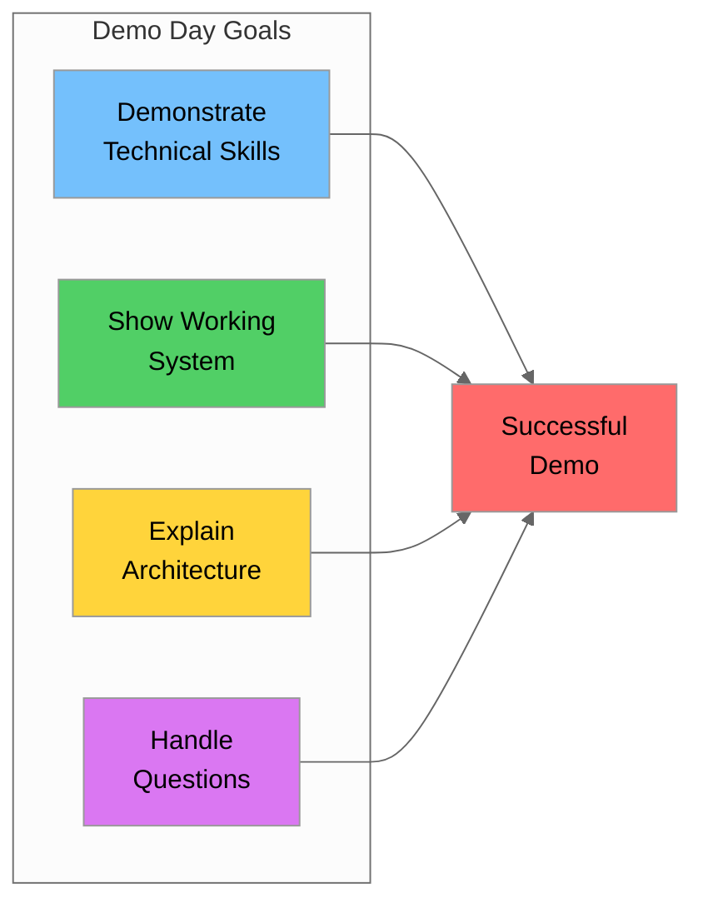
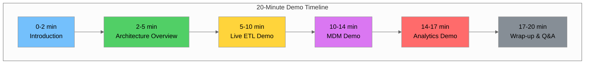
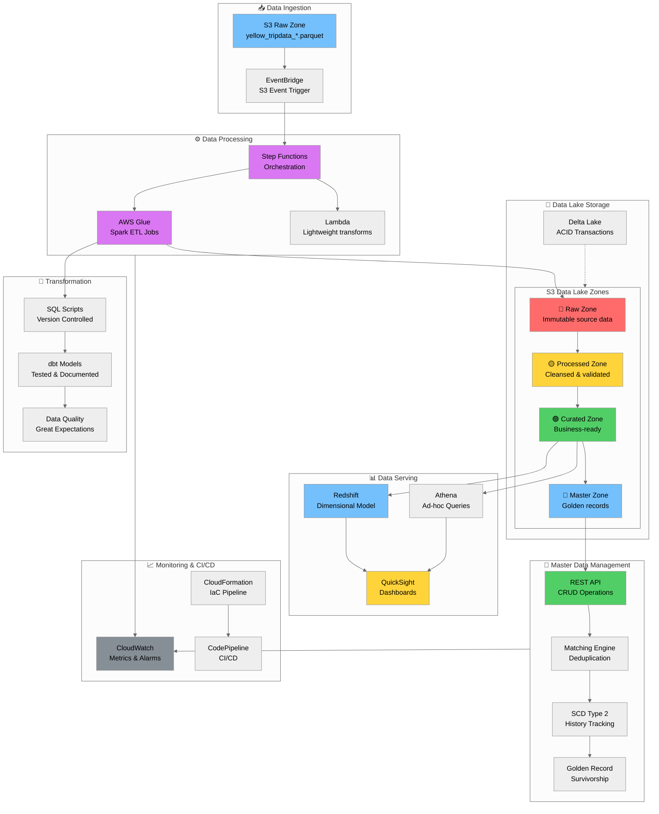
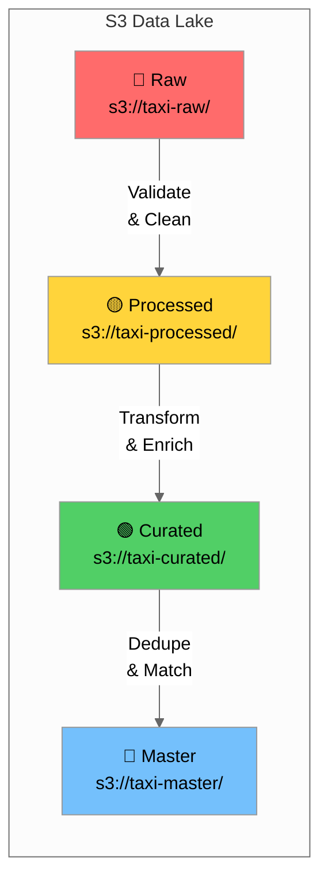
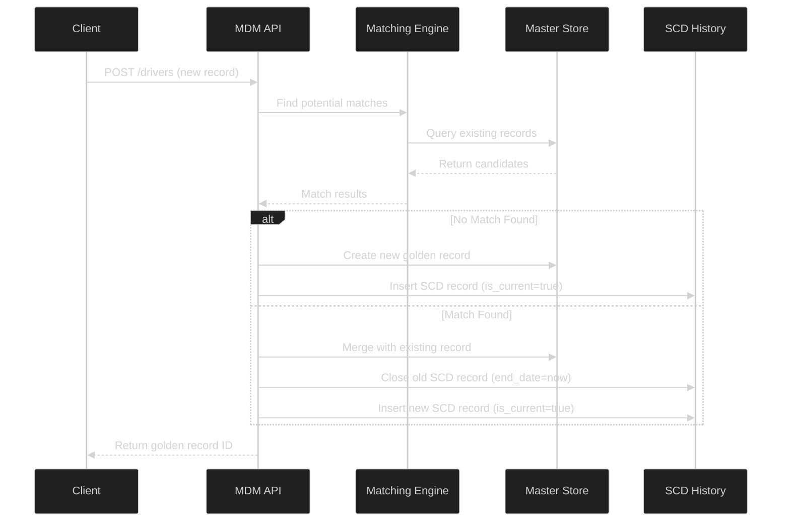
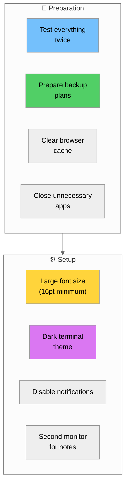
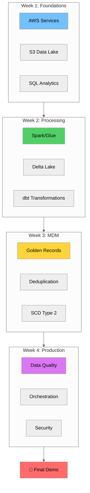

# Day 20: Final Demo Day - Comprehensive Preparation Guide

## Table of Contents
1. [Introduction](#introduction)
2. [Demo Checklist](#demo-checklist)
3. [Demo Script Template](#demo-script-template)
4. [Architecture Documentation](#architecture-documentation)
5. [Demo Scenarios](#demo-scenarios)
6. [Troubleshooting Guide](#troubleshooting-guide)
7. [Presentation Tips](#presentation-tips)
8. [Q&A Preparation](#qa-preparation)
9. [Post-Demo Deliverables](#post-demo-deliverables)
10. [Summary](#summary)

---

## Introduction

Congratulations on reaching Day 20 - the Final Demo Day! This is your opportunity to showcase everything you've learned throughout the 4-week Data Engineering training program. This tutorial serves as your comprehensive preparation guide to ensure a successful demonstration of your NYC Yellow Taxi data platform.

### What You'll Demonstrate

Over the past 19 days, you've built a complete end-to-end data platform. Today, you'll demonstrate:

| Component | What You Built | Days Covered |
|-----------|---------------|--------------|
| **Data Ingestion** | S3 batch ingestion with metadata | Days 1-2 |
| **Data Storage** | S3 data lake with zones (raw/processed/curated/master) | Days 2-3 |
| **Data Processing** | Spark/Glue/Lambda with Delta Lake | Days 6-8 |
| **SQL Transformations** | Version-controlled SQL scripts with dbt | Days 9-10 |
| **Master Data Management** | RESTful API, deduplication, SCD Type 2 | Days 11-15 |
| **Data Quality** | Automated testing and monitoring | Days 16-17 |
| **Orchestration** | AWS Step Functions workflows | Day 18 |
| **Security & Governance** | KMS, IAM, PII masking | Day 19 |
| **Analytics** | QuickSight dashboards | Days 9-10 |
| **CI/CD** | CloudFormation deployment pipeline | Day 18 |

### Demo Day Objectives



---

## Demo Checklist

### Pre-Demo Preparation (Day Before)

Use this checklist to ensure everything is ready before your demo:

#### Infrastructure Verification

| Item | Command/Action | Expected Result | ✓ |
|------|----------------|-----------------|---|
| S3 Buckets Accessible | `aws s3 ls s3://nyc-taxi-raw-data/` | List of files | ☐ |
| Glue Jobs Ready | `aws glue get-jobs --query 'Jobs[].Name'` | List of job names | ☐ |
| Step Functions Active | `aws stepfunctions list-state-machines` | State machine ARNs | ☐ |
| Redshift Cluster Running | `aws redshift describe-clusters` | Cluster status: available | ☐ |
| QuickSight Dashboard | Open QuickSight console | Dashboard loads | ☐ |
| API Gateway Endpoint | `curl https://api.example.com/health` | 200 OK response | ☐ |
| CloudWatch Dashboards | Open CloudWatch console | Metrics visible | ☐ |

#### Data Verification

```bash
# Verify data in each zone
echo "=== Checking Raw Zone ==="
aws s3 ls s3://nyc-taxi-raw-data/yellow_tripdata/ --recursive | head -5

echo "=== Checking Processed Zone ==="
aws s3 ls s3://nyc-taxi-processed-data/trips/ --recursive | head -5

echo "=== Checking Curated Zone ==="
aws s3 ls s3://nyc-taxi-curated-data/analytics/ --recursive | head -5

echo "=== Checking Master Zone ==="
aws s3 ls s3://nyc-taxi-master-data/golden_records/ --recursive | head -5

# Verify record counts
echo "=== Record Counts ==="
aws athena start-query-execution \
    --query-string "SELECT COUNT(*) FROM taxi_db.yellow_trips" \
    --result-configuration OutputLocation=s3://athena-results/
```

#### Application Verification

```python
# verify_demo_readiness.py
import boto3
import requests
import json
from datetime import datetime

class DemoReadinessChecker:
    """Verify all demo components are ready."""
    
    def __init__(self):
        self.results = []
        
    def check_s3_buckets(self):
        """Verify S3 buckets exist and have data."""
        s3 = boto3.client('s3')
        buckets = [
            'nyc-taxi-raw-data',
            'nyc-taxi-processed-data',
            'nyc-taxi-curated-data',
            'nyc-taxi-master-data'
        ]
        
        for bucket in buckets:
            try:
                response = s3.list_objects_v2(Bucket=bucket, MaxKeys=1)
                has_data = response.get('KeyCount', 0) > 0
                self.results.append({
                    'component': f'S3: {bucket}',
                    'status': 'PASS' if has_data else 'WARN',
                    'message': 'Has data' if has_data else 'Empty bucket'
                })
            except Exception as e:
                self.results.append({
                    'component': f'S3: {bucket}',
                    'status': 'FAIL',
                    'message': str(e)
                })
    
    def check_glue_jobs(self):
        """Verify Glue jobs exist."""
        glue = boto3.client('glue')
        try:
            response = glue.get_jobs()
            job_count = len(response.get('Jobs', []))
            self.results.append({
                'component': 'Glue Jobs',
                'status': 'PASS' if job_count > 0 else 'WARN',
                'message': f'{job_count} jobs found'
            })
        except Exception as e:
            self.results.append({
                'component': 'Glue Jobs',
                'status': 'FAIL',
                'message': str(e)
            })
    
    def check_step_functions(self):
        """Verify Step Functions state machines."""
        sfn = boto3.client('stepfunctions')
        try:
            response = sfn.list_state_machines()
            sm_count = len(response.get('stateMachines', []))
            self.results.append({
                'component': 'Step Functions',
                'status': 'PASS' if sm_count > 0 else 'WARN',
                'message': f'{sm_count} state machines found'
            })
        except Exception as e:
            self.results.append({
                'component': 'Step Functions',
                'status': 'FAIL',
                'message': str(e)
            })
    
    def check_api_endpoint(self, api_url: str):
        """Verify API endpoint is responding."""
        try:
            response = requests.get(f"{api_url}/health", timeout=10)
            self.results.append({
                'component': 'MDM API',
                'status': 'PASS' if response.status_code == 200 else 'FAIL',
                'message': f'Status: {response.status_code}'
            })
        except Exception as e:
            self.results.append({
                'component': 'MDM API',
                'status': 'FAIL',
                'message': str(e)
            })
    
    def generate_report(self):
        """Generate readiness report."""
        print("\n" + "=" * 60)
        print("DEMO READINESS REPORT")
        print(f"Generated: {datetime.now().isoformat()}")
        print("=" * 60 + "\n")
        
        for result in self.results:
            status_icon = {
                'PASS': '✅',
                'WARN': '⚠️',
                'FAIL': '❌'
            }.get(result['status'], '❓')
            
            print(f"{status_icon} {result['component']}: {result['message']}")
        
        # Summary
        pass_count = sum(1 for r in self.results if r['status'] == 'PASS')
        total = len(self.results)
        
        print("\n" + "-" * 60)
        print(f"Summary: {pass_count}/{total} checks passed")
        
        if pass_count == total:
            print("🎉 All systems ready for demo!")
        else:
            print("⚠️ Some issues need attention before demo")

# Run verification
if __name__ == "__main__":
    checker = DemoReadinessChecker()
    checker.check_s3_buckets()
    checker.check_glue_jobs()
    checker.check_step_functions()
    checker.check_api_endpoint("https://api.nyc-taxi.example.com")
    checker.generate_report()
```

### Demo Day Morning Checklist

| Time | Task | Notes |
|------|------|-------|
| T-60 min | Run readiness checker | Fix any issues |
| T-45 min | Open all browser tabs | AWS Console, QuickSight, API docs |
| T-30 min | Start any long-running processes | Glue job, Step Function |
| T-15 min | Test screen sharing | Verify resolution |
| T-10 min | Close unnecessary applications | Reduce distractions |
| T-5 min | Have backup slides ready | In case of technical issues |
| T-0 | Begin demo | Start with confidence! |

---

## Demo Script Template

### 20-Minute Demo Structure



### Section 1: Introduction (0-2 minutes)

**Script:**

> "Good [morning/afternoon], I'm [Your Name], and today I'll demonstrate the NYC Yellow Taxi Data Platform I've built during this training program.
>
> This platform processes millions of taxi trip records through a complete data engineering pipeline - from raw ingestion to analytics-ready insights.
>
> In the next 20 minutes, I'll show you:
> 1. The end-to-end architecture
> 2. Live batch ETL processing
> 3. Master Data Management capabilities
> 4. Real-time analytics dashboards
>
> Let's begin with the architecture."

**Visual:** Show architecture diagram (see [Architecture Documentation](#architecture-documentation))

### Section 2: Architecture Overview (2-5 minutes)

**Script:**

> "Here's the complete data platform architecture.
>
> **Data flows from left to right:**
> - Raw taxi trip data lands in S3 via batch uploads
> - AWS Glue processes and transforms the data through our data lake zones
> - Delta Lake provides ACID transactions and time travel
> - Master Data Management ensures data quality and golden records
> - Finally, Redshift and QuickSight serve analytics
>
> **Key design decisions:**
> - Serverless-first approach for cost efficiency
> - Infrastructure as Code with CloudFormation
> - Comprehensive monitoring with CloudWatch
>
> Let me show you this in action."

**Talking Points:**
- Highlight the four data lake zones (raw → processed → curated → master)
- Mention the orchestration layer (Step Functions)
- Point out the monitoring and CI/CD components

### Section 3: Live ETL Demo (5-10 minutes)

**Script:**

> "Let me demonstrate the batch ETL pipeline processing new taxi data.
>
> First, I'll upload a new data file to trigger the pipeline..."

**Demo Steps:**

```bash
# Step 1: Upload new data file
aws s3 cp data/yellow_tripdata_2025-08.parquet \
    s3://nyc-taxi-raw-data/incoming/yellow_tripdata_2025-08.parquet

# Step 2: Trigger Step Functions workflow
aws stepfunctions start-execution \
    --state-machine-arn arn:aws:states:us-east-1:123456789012:stateMachine:TaxiETLPipeline \
    --name "demo-execution-$(date +%s)" \
    --input '{"source_file": "yellow_tripdata_2025-08.parquet"}'
```

**Script (continued):**

> "The Step Functions workflow is now running. Let me show you the execution in the console...
>
> [Show Step Functions console]
>
> You can see each step:
> 1. **Validate** - Schema and data quality checks
> 2. **Transform** - Apply business rules and cleansing
> 3. **Load** - Write to processed zone with Delta Lake
> 4. **Quality Check** - Run automated data quality tests
>
> While this runs, let me show you the data quality dashboard..."

**Show CloudWatch Dashboard:**

```sql
-- Query to show during demo
SELECT 
    DATE(pickup_datetime) as trip_date,
    COUNT(*) as trip_count,
    AVG(fare_amount) as avg_fare,
    SUM(total_amount) as total_revenue
FROM taxi_db.yellow_trips
WHERE pickup_datetime >= CURRENT_DATE - INTERVAL '7' DAY
GROUP BY DATE(pickup_datetime)
ORDER BY trip_date DESC;
```

### Section 4: MDM Demo (10-14 minutes)

**Script:**

> "Now let me demonstrate our Master Data Management capabilities.
>
> The MDM layer ensures we have clean, deduplicated golden records for our master entities - drivers, vehicles, and locations."

**Demo Steps:**

```bash
# Step 1: Show API health
curl -X GET https://api.nyc-taxi.example.com/health | jq

# Step 2: Create a new driver record
curl -X POST https://api.nyc-taxi.example.com/api/v1/drivers \
    -H "Content-Type: application/json" \
    -d '{
        "license_number": "TLC1234567",
        "first_name": "John",
        "last_name": "Smith",
        "license_expiry": "2026-12-31"
    }' | jq

# Step 3: Demonstrate deduplication
curl -X POST https://api.nyc-taxi.example.com/api/v1/drivers/match \
    -H "Content-Type: application/json" \
    -d '{
        "first_name": "Jon",
        "last_name": "Smith",
        "license_number": "TLC1234567"
    }' | jq
```

**Script (continued):**

> "Notice how the matching engine identified this as a potential duplicate despite the spelling variation.
>
> Let me also show you the SCD Type 2 implementation for tracking historical changes..."

```sql
-- Show SCD Type 2 history
SELECT 
    driver_id,
    license_number,
    first_name,
    last_name,
    effective_date,
    end_date,
    is_current
FROM master_data.dim_driver_history
WHERE license_number = 'TLC1234567'
ORDER BY effective_date;
```

### Section 5: Analytics Demo (14-17 minutes)

**Script:**

> "Finally, let me show you the analytics layer where business users consume this data.
>
> [Open QuickSight Dashboard]
>
> This dashboard provides real-time insights into taxi operations..."

**Dashboard Highlights:**
1. **Trip Volume Trends** - Daily/weekly patterns
2. **Revenue Analysis** - By zone, payment type
3. **Driver Performance** - Trip counts, ratings
4. **Data Quality Metrics** - Completeness, accuracy scores

**Script (continued):**

> "The dashboard refreshes automatically as new data flows through the pipeline.
>
> Users can drill down by borough, time period, or payment type to answer business questions like:
> - Which zones generate the most revenue?
> - What are peak hours for taxi demand?
> - How does weather affect trip patterns?"

### Section 6: Wrap-up (17-20 minutes)

**Script:**

> "To summarize what we've seen today:
>
> 1. **Scalable Architecture** - Serverless, cost-effective, handles millions of records
> 2. **Automated ETL** - Step Functions orchestration with quality gates
> 3. **Master Data Management** - Clean, deduplicated golden records
> 4. **Real-time Analytics** - Self-service dashboards for business users
> 5. **Production-Ready** - CI/CD, monitoring, security built-in
>
> I'm happy to take any questions."

---

## Architecture Documentation

### Complete End-to-End Architecture Diagram



### Architecture Components Detail

#### 1. Ingestion Layer

| Component | Purpose | Technology |
|-----------|---------|------------|
| S3 Raw Zone | Landing zone for source data | Amazon S3 |
| EventBridge | Event-driven triggers | Amazon EventBridge |
| S3 Event Notifications | Detect new files | S3 Events |

#### 2. Storage Layer



| Zone | Purpose | Data Format | Retention |
|------|---------|-------------|-----------|
| **Raw** | Immutable source data | Parquet (original) | 7 years |
| **Processed** | Cleansed, validated | Delta Lake | 3 years |
| **Curated** | Business-ready, aggregated | Delta Lake | 2 years |
| **Master** | Golden records | Delta Lake | Indefinite |

#### 3. Processing Layer

```python
# Example Glue Job Configuration
glue_job_config = {
    "Name": "nyc-taxi-etl-job",
    "Role": "arn:aws:iam::123456789012:role/GlueETLRole",
    "Command": {
        "Name": "glueetl",
        "ScriptLocation": "s3://scripts/etl/taxi_transform.py",
        "PythonVersion": "3"
    },
    "DefaultArguments": {
        "--job-language": "python",
        "--enable-metrics": "true",
        "--enable-continuous-cloudwatch-log": "true",
        "--source_path": "s3://nyc-taxi-raw-data/",
        "--target_path": "s3://nyc-taxi-processed-data/",
        "--datalake-formats": "delta"
    },
    "GlueVersion": "4.0",
    "WorkerType": "G.1X",
    "NumberOfWorkers": 10
}
```

#### 4. Orchestration Layer

```json
{
  "Comment": "NYC Taxi ETL Pipeline",
  "StartAt": "ValidateInput",
  "States": {
    "ValidateInput": {
      "Type": "Task",
      "Resource": "arn:aws:lambda:us-east-1:123456789012:function:validate-input",
      "Next": "RunGlueJob"
    },
    "RunGlueJob": {
      "Type": "Task",
      "Resource": "arn:aws:states:::glue:startJobRun.sync",
      "Parameters": {
        "JobName": "nyc-taxi-etl-job",
        "Arguments": {
          "--source_file.$": "$.source_file"
        }
      },
      "Next": "RunQualityChecks"
    },
    "RunQualityChecks": {
      "Type": "Task",
      "Resource": "arn:aws:lambda:us-east-1:123456789012:function:run-quality-checks",
      "Next": "CheckQualityResults"
    },
    "CheckQualityResults": {
      "Type": "Choice",
      "Choices": [
        {
          "Variable": "$.quality_passed",
          "BooleanEquals": true,
          "Next": "UpdateCatalog"
        }
      ],
      "Default": "NotifyFailure"
    },
    "UpdateCatalog": {
      "Type": "Task",
      "Resource": "arn:aws:lambda:us-east-1:123456789012:function:update-catalog",
      "End": true
    },
    "NotifyFailure": {
      "Type": "Task",
      "Resource": "arn:aws:states:::sns:publish",
      "Parameters": {
        "TopicArn": "arn:aws:sns:us-east-1:123456789012:etl-alerts",
        "Message.$": "$.error_message"
      },
      "End": true
    }
  }
}
```

#### 5. Master Data Management Layer



#### 6. Serving Layer

```sql
-- Dimensional Model in Redshift
-- Fact Table
CREATE TABLE fact_trips (
    trip_sk BIGINT IDENTITY(1,1),
    trip_id VARCHAR(50) NOT NULL,
    driver_sk BIGINT REFERENCES dim_driver(driver_sk),
    vehicle_sk BIGINT REFERENCES dim_vehicle(vehicle_sk),
    pickup_location_sk BIGINT REFERENCES dim_location(location_sk),
    dropoff_location_sk BIGINT REFERENCES dim_location(location_sk),
    pickup_date_sk INT REFERENCES dim_date(date_sk),
    pickup_time_sk INT REFERENCES dim_time(time_sk),
    passenger_count INT,
    trip_distance DECIMAL(10,2),
    fare_amount DECIMAL(10,2),
    tip_amount DECIMAL(10,2),
    total_amount DECIMAL(10,2),
    payment_type VARCHAR(20),
    created_at TIMESTAMP DEFAULT GETDATE()
)
DISTKEY(pickup_date_sk)
SORTKEY(pickup_date_sk, pickup_location_sk);

-- Dimension Tables
CREATE TABLE dim_driver (
    driver_sk BIGINT IDENTITY(1,1),
    driver_id VARCHAR(50) NOT NULL,
    license_number VARCHAR(20),
    first_name VARCHAR(100),
    last_name VARCHAR(100),
    effective_date DATE,
    end_date DATE,
    is_current BOOLEAN
)
DISTSTYLE ALL;
```

#### 7. Monitoring Layer

```yaml
# CloudWatch Dashboard Definition
DashboardBody:
  widgets:
    - type: metric
      properties:
        title: "ETL Job Success Rate"
        metrics:
          - ["AWS/Glue", "glue.ALL.jvm.heap.usage", "JobName", "nyc-taxi-etl-job"]
        period: 300
        stat: Average
        
    - type: metric
      properties:
        title: "Data Quality Score"
        metrics:
          - ["Custom/DataQuality", "QualityScore", "Dataset", "yellow_trips"]
        period: 3600
        stat: Average
        
    - type: metric
      properties:
        title: "API Latency"
        metrics:
          - ["AWS/ApiGateway", "Latency", "ApiName", "MDM-API"]
        period: 60
        stat: p99
        
    - type: log
      properties:
        title: "Recent Errors"
        query: |
          fields @timestamp, @message
          | filter @message like /ERROR/
          | sort @timestamp desc
          | limit 20
```

### Draw.io Export Instructions

To create a professional architecture diagram for your demo:

1. **Open Draw.io** (https://app.diagrams.net/)
2. **Import the template:**
   - File → Import From → URL
   - Use AWS Architecture Icons: https://aws.amazon.com/architecture/icons/
3. **Add components:**
   - Drag AWS service icons onto canvas
   - Group by layer (Ingestion, Storage, Processing, etc.)
   - Add arrows for data flow
4. **Style guidelines:**
   - Use consistent colors for each layer
   - Add labels with service names
   - Include data flow direction arrows
5. **Export:**
   - File → Export As → SVG (for presentations)
   - File → Export As → PNG (for documentation)

---

## Demo Scenarios

### Scenario 1: Batch ETL with Step Functions

**Objective:** Demonstrate end-to-end batch processing of taxi trip data.

**Prerequisites:**
- Sample data file ready: [`data/yellow_tripdata_2025-08.parquet`](../data/yellow_tripdata_2025-08.parquet)
- Step Functions state machine deployed
- Glue job configured

**Step-by-Step Walkthrough:**

```bash
# Step 1: Show the source data
echo "=== Source Data Preview ==="
python3 << 'EOF'
import pandas as pd
df = pd.read_parquet('data/yellow_tripdata_2025-08.parquet')
print(f"Records: {len(df):,}")
print(f"Columns: {list(df.columns)}")
print(df.head(3))
EOF

# Step 2: Upload to S3 (triggers EventBridge)
echo "=== Uploading to S3 ==="
aws s3 cp data/yellow_tripdata_2025-08.parquet \
    s3://nyc-taxi-raw-data/incoming/yellow_tripdata_2025-08.parquet

# Step 3: Start Step Functions execution
echo "=== Starting ETL Pipeline ==="
EXECUTION_ARN=$(aws stepfunctions start-execution \
    --state-machine-arn arn:aws:states:us-east-1:123456789012:stateMachine:TaxiETLPipeline \
    --name "demo-$(date +%s)" \
    --input '{"source_file": "yellow_tripdata_2025-08.parquet"}' \
    --query 'executionArn' --output text)

echo "Execution ARN: $EXECUTION_ARN"

# Step 4: Monitor execution status
aws stepfunctions describe-execution \
    --execution-arn $EXECUTION_ARN \
    --query '{status: status, startDate: startDate}'
```

**What to Show:**
1. Step Functions visual workflow in AWS Console
2. Each step transitioning from blue (running) to green (success)
3. CloudWatch logs for each Lambda/Glue step
4. Final data in processed zone

### Scenario 2: SQL Transformations with Data Quality

**Objective:** Demonstrate version-controlled SQL transformations with automated testing.

**Step-by-Step Walkthrough:**

```bash
# Step 1: Show dbt project structure
echo "=== dbt Project Structure ==="
tree dbt_project/

# Step 2: Run dbt models
cd dbt_project
dbt run --select staging intermediate marts

# Step 3: Run data quality tests
dbt test --select staging intermediate marts
```

**What to Show:**
1. dbt model compilation and execution
2. Test results with pass/fail status
3. Generated documentation
4. Lineage graph showing data flow

### Scenario 3: Master Data Management Operations

**Objective:** Demonstrate CRUD operations, deduplication, and SCD Type 2.

**Step-by-Step Walkthrough:**

```bash
# Step 1: Health check
curl -s https://api.nyc-taxi.example.com/health | jq

# Step 2: Create a new driver
curl -s -X POST https://api.nyc-taxi.example.com/api/v1/drivers \
    -H "Content-Type: application/json" \
    -d '{"license_number": "TLC9876543", "first_name": "Maria", "last_name": "Garcia"}' | jq

# Step 3: Demonstrate deduplication
curl -s -X POST https://api.nyc-taxi.example.com/api/v1/drivers/match \
    -H "Content-Type: application/json" \
    -d '{"first_name": "Maria", "last_name": "Garsia", "license_number": "TLC9876543"}' | jq

# Step 4: View SCD history
curl -s "https://api.nyc-taxi.example.com/api/v1/drivers/DRV-2025-00123/history" | jq
```

### Scenario 4: Analytics Dashboard Demo

**Objective:** Demonstrate self-service analytics capabilities.

**QuickSight Dashboard Walkthrough:**
1. Open QuickSight Dashboard at https://quicksight.aws.amazon.com/
2. Select "NYC Taxi Analytics" dashboard
3. Show key visualizations: Total Trips, Revenue, Trips by Hour
4. Demonstrate interactive features: filters, drill-down, export

### Scenario 5: CI/CD Deployment Demo

**Objective:** Demonstrate infrastructure as code and automated deployment.

```bash
# Show CloudFormation template
cat infrastructure/cloudformation/taxi-platform.yaml | head -50

# Show current stack status
aws cloudformation describe-stacks \
    --stack-name nyc-taxi-platform \
    --query 'Stacks[0].{Name:StackName,Status:StackStatus}'

# Show CodePipeline status
aws codepipeline get-pipeline-state \
    --name nyc-taxi-pipeline \
    --query 'stageStates[*].{Stage:stageName,Status:latestExecution.status}'
```

---

## Troubleshooting Guide

### Common Demo Issues and Solutions

#### Issue 1: Step Functions Execution Fails

**Symptoms:**
- Execution shows "Failed" status
- Error message in execution history

**Diagnosis:**

```bash
aws stepfunctions get-execution-history \
    --execution-arn $EXECUTION_ARN \
    --query 'events[?type==`TaskFailed`]'
```

**Common Causes & Solutions:**

| Cause | Solution |
|-------|----------|
| IAM permission denied | Check role has required permissions |
| Glue job timeout | Increase timeout or optimize job |
| S3 access denied | Verify bucket policy and KMS permissions |
| Lambda memory exceeded | Increase Lambda memory allocation |

#### Issue 2: Glue Job Runs Slowly

**Symptoms:**
- Job takes longer than expected
- High DPU usage

**Optimization Tips:**
- Use Glue 4.0 for better performance
- Enable auto-scaling with G.2X workers
- Enable job bookmarks for incremental processing

#### Issue 3: API Returns 500 Error

**Symptoms:**
- MDM API returns internal server error
- Intermittent failures

**Diagnosis:**

```bash
# Check API Gateway logs
aws logs filter-log-events \
    --log-group-name /aws/apigateway/mdm-api \
    --filter-pattern "ERROR"

# Check Lambda logs
aws logs filter-log-events \
    --log-group-name /aws/lambda/mdm-handler \
    --filter-pattern "ERROR"
```

#### Issue 4: QuickSight Dashboard Not Loading

**Solutions:**

1. **Refresh SPICE dataset:**
```bash
aws quicksight create-ingestion \
    --aws-account-id 123456789012 \
    --data-set-id taxi-trips-dataset \
    --ingestion-id "refresh-$(date +%s)"
```

2. **Check Redshift connectivity**

### Emergency Backup Plans

| Scenario | Backup Plan |
|----------|-------------|
| Live demo fails | Switch to pre-recorded video |
| AWS console slow | Use CLI commands instead |
| Network issues | Have local screenshots ready |
| Data not loading | Use cached/sample dataset |

---

## Presentation Tips

### Technical Demo Best Practices

#### Before the Demo



#### Terminal Configuration

```bash
# Use a clear prompt
export PS1="\[\033[36m\]demo\[\033[m\]:\[\033[33m\]\W\[\033[m\]$ "

# Clear command history for clean demo
history -c

# Set up aliases for common commands
alias show-s3="aws s3 ls s3://nyc-taxi-raw-data/ --human-readable"
alias show-jobs="aws glue get-jobs --query 'Jobs[].Name'"
```

#### Presentation Flow Tips

| Do | Don't |
|----|-------|
| ✅ Narrate what you're doing | ❌ Type silently |
| ✅ Explain before executing | ❌ Execute then explain |
| ✅ Pause for questions | ❌ Rush through |
| ✅ Acknowledge errors gracefully | ❌ Panic when things fail |
| ✅ Use pre-typed commands | ❌ Type long commands live |
| ✅ Have a backup plan | ❌ Assume everything works |

#### Handling Errors During Demo

**Script for Error Recovery:**

> "It looks like we're experiencing [describe issue]. This is actually a great opportunity to show you our monitoring capabilities. Let me check CloudWatch to see what's happening..."

#### Time Management

| Section | Target Time | Buffer |
|---------|-------------|--------|
| Introduction | 2 min | 30 sec |
| Architecture | 3 min | 30 sec |
| ETL Demo | 5 min | 1 min |
| MDM Demo | 4 min | 1 min |
| Analytics Demo | 3 min | 30 sec |
| Wrap-up | 3 min | 30 sec |
| **Total** | **20 min** | **4 min** |

---

## Q&A Preparation

### Anticipated Questions and Answers

#### Architecture Questions

**Q1: Why did you choose serverless over EMR?**

> "I chose serverless (Glue + Lambda) for cost efficiency, operational simplicity, auto-scaling, and faster development. For our taxi data volumes (millions of records), serverless is more cost-effective. EMR would make sense for petabyte-scale or streaming workloads."

**Q2: How does the system handle failures?**

> "We have multiple layers of fault tolerance: Step Functions with built-in retry logic, dead letter queues for failed records, idempotent operations, and CloudWatch alarms for monitoring and alerting."

**Q3: What's the data latency from ingestion to dashboard?**

> "For our batch pipeline: Raw to Processed ~5 minutes, Processed to Curated ~3 minutes, Curated to Dashboard ~2 minutes. Total end-to-end: ~10-15 minutes, meeting our 30-minute SLA."

#### Data Quality Questions

**Q4: How do you ensure data quality?**

> "We implement quality at multiple stages: schema validation on ingestion, dbt tests for business rules, Great Expectations for statistical checks, and a quality score dashboard with alerting. Our current quality score is 98.5%."

**Q5: How do you handle PII?**

> "We follow defense-in-depth: classification of all columns, KMS encryption at rest and in transit, dynamic masking for non-privileged users, IAM policies with least privilege, and CloudTrail audit logging."

#### MDM Questions

**Q6: How does the matching algorithm work?**

> "Our matching engine uses blocking to reduce comparison space, then combines multiple similarity algorithms: exact match for IDs (weight 0.4), Levenshtein distance for names (0.3), phonetic matching with Soundex (0.2), and address standardization (0.1). Score > 0.85 = automatic match."

**Q7: Why SCD Type 2 instead of Type 1?**

> "SCD Type 2 preserves history for audit compliance, historical analysis with point-in-time accuracy, and debugging. The storage overhead is minimal (~15% increase) compared to the analytical value gained."

#### Performance Questions

**Q8: How does the system scale?**

> "The architecture scales horizontally: S3 handles unlimited uploads, Glue auto-scales workers, Delta Lake partitioning enables parallel reads, and Redshift RA3 nodes scale compute independently. We've tested with 10x current volume."

**Q9: What's the cost to run this platform?**

> "Monthly estimate: S3 ~$50, Glue ~$100, Step Functions ~$5, Redshift ~$200, QuickSight ~$50. Total ~$400/month, significantly lower than on-premise solutions."

### Questions to Ask the Audience

1. "What aspects of the architecture would you like me to elaborate on?"
2. "Are there any specific use cases you'd like to see demonstrated?"
3. "How does this compare to data platforms you've worked with?"

---

## Post-Demo Deliverables

### Documentation Package

After your demo, submit the following documentation:

#### 1. Architecture Document

```markdown
# NYC Taxi Data Platform - Architecture Document

## Executive Summary
Brief overview of the platform and its capabilities.

## Architecture Overview
- High-level architecture diagram
- Component descriptions
- Data flow diagrams

## Technical Specifications
- AWS services used
- Data formats and schemas
- API specifications

## Security & Compliance
- Encryption configuration
- Access control policies
- Audit logging

## Operations
- Monitoring dashboards
- Alerting configuration
- Runbooks for common issues
```

#### 2. Runbook

```markdown
# NYC Taxi Platform - Operational Runbook

## Daily Operations

### Morning Health Check
1. Check CloudWatch dashboard for overnight alerts
2. Verify ETL job completion
3. Review data quality scores

### Responding to Alerts

#### ETL Job Failure
1. Check Step Functions execution history
2. Review CloudWatch logs for error details
3. Identify root cause (data issue vs. infrastructure)
4. Rerun failed job or escalate
```

#### 3. Code Repository Structure

```
nyc-taxi-platform/
├── README.md
├── docs/
│   ├── architecture.md
│   ├── runbook.md
│   └── api-reference.md
├── infrastructure/
│   └── cloudformation/
├── src/
│   ├── etl/
│   ├── mdm/
│   └── dbt/
├── tests/
└── scripts/
```

### Submission Checklist

| Deliverable | Format | Location | ✓ |
|-------------|--------|----------|---|
| Architecture Document | Markdown/PDF | `docs/architecture.md` | ☐ |
| Architecture Diagram | SVG/PNG | `docs/diagrams/` | ☐ |
| Runbook | Markdown | `docs/runbook.md` | ☐ |
| API Documentation | OpenAPI/Swagger | `docs/api-reference.yaml` | ☐ |
| Code Repository | Git | GitHub/GitLab | ☐ |
| Demo Recording | MP4 | Shared drive | ☐ |
| Presentation Slides | PDF | `docs/presentation.pdf` | ☐ |
| Cost Analysis | Spreadsheet | `docs/cost-analysis.xlsx` | ☐ |

---

## Summary

### Key Takeaways

Congratulations on completing the 4-week Data Engineering training program! Here's what you've accomplished:



### Skills Demonstrated

| Category | Skills |
|----------|--------|
| **Data Engineering** | ETL pipelines, data modeling, batch processing |
| **AWS Services** | S3, Glue, Lambda, Step Functions, Redshift, QuickSight |
| **Data Quality** | Testing frameworks, monitoring, alerting |
| **MDM** | Deduplication, matching, golden records, SCD |
| **DevOps** | CI/CD, IaC, monitoring, security |
| **Soft Skills** | Technical presentation, documentation, problem-solving |

### Next Steps

After the training program:

1. **Continue Learning**
   - Explore streaming data with Kinesis
   - Learn about ML pipelines with SageMaker
   - Study advanced data modeling techniques

2. **Build Your Portfolio**
   - Document this project on GitHub
   - Write blog posts about your learnings
   - Contribute to open-source data tools

3. **Stay Connected**
   - Join data engineering communities
   - Attend AWS meetups and conferences
   - Network with fellow data engineers

### Final Checklist

Before your demo, ensure you've completed:

- [ ] All infrastructure deployed and tested
- [ ] Demo script rehearsed at least twice
- [ ] Backup plans prepared for each scenario
- [ ] Documentation complete and reviewed
- [ ] Code repository organized and documented
- [ ] Presentation slides ready
- [ ] Recording equipment tested

---

## Additional Resources

### AWS Documentation
- [AWS Glue Developer Guide](https://docs.aws.amazon.com/glue/latest/dg/)
- [Step Functions Developer Guide](https://docs.aws.amazon.com/step-functions/latest/dg/)
- [Amazon Redshift Documentation](https://docs.aws.amazon.com/redshift/)
- [Amazon QuickSight User Guide](https://docs.aws.amazon.com/quicksight/)

### Data Engineering Resources
- [Delta Lake Documentation](https://docs.delta.io/)
- [dbt Documentation](https://docs.getdbt.com/)
- [Great Expectations Documentation](https://docs.greatexpectations.io/)

### Best Practices
- [AWS Well-Architected Framework](https://aws.amazon.com/architecture/well-architected/)
- [Data Engineering Best Practices](https://aws.amazon.com/big-data/datalakes-and-analytics/)

### Previous Day Tutorials
- [Day 19: Security, Compliance & MDM Governance](../day-19/day-19-tutorial.md)
- [Day 18: Orchestration with Step Functions](../day-18/day-18-tutorial.md)
- [Day 17: Data Quality Monitoring](../day-17/day-17-tutorial.md)

---

*Congratulations on completing the Data Engineering Training Program! Good luck with your demo! 🎉*