# Day 3: Data Modeling with Governance Lens

## Table of Contents

1. [Introduction & Learning Objectives](#1-introduction--learning-objectives)
2. [SQL Fundamentals Review](#2-sql-fundamentals-review)
3. [Database Fundamentals](#3-database-fundamentals)
4. [Entity-Relationship Modeling](#4-entity-relationship-modeling)
5. [Design Patterns for Data Warehousing](#5-design-patterns-for-data-warehousing)
6. [Data Classification & Governance](#6-data-classification--governance)
7. [Hands-on Labs](#7-hands-on-labs)
8. [Summary & Key Takeaways](#8-summary--key-takeaways)
9. [Additional Resources](#9-additional-resources)

---

## 1. Introduction & Learning Objectives

### Overview

Day 3 focuses on **Data Modeling with a Governance Lens**—the foundation for building robust, scalable, and well-governed data systems. Understanding how to model data effectively is crucial for data engineers, as it directly impacts query performance, data quality, and the ability to derive meaningful insights.

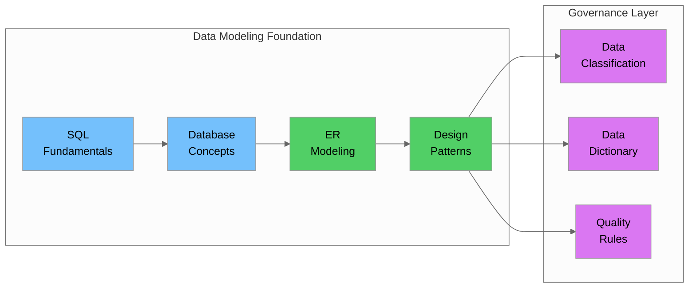

### Prerequisites

Before starting Day 3, ensure you have completed:

- ✅ Day 1: AWS Fundamentals & Core Skills
- ✅ Day 2: Python for Data Engineering & Amazon S3 Deep Dive
- ✅ Basic understanding of databases and SQL
- ✅ NYC Taxi dataset downloaded and accessible

### Learning Objectives

By the end of Day 3, you will be able to:

1. **Review and apply SQL fundamentals** including JOINs, aggregations, window functions, and CTEs (Common Table Expressions)
2. **Understand database fundamentals** including ACID properties and normalization
3. **Create Entity-Relationship diagrams** with proper entities, attributes, and relationships
4. **Apply design patterns** like Star Schema and SCD (Slowly Changing Dimensions)
5. **Classify data types** (Master, Transactional, Reference) with business context
6. **Identify Critical Data Elements (CDEs)** and understand their governance importance
7. **Build a comprehensive data dictionary** with governance attributes

---

## 2. SQL Fundamentals Review

### 2.1 Relational vs Non-Relational Databases

Understanding when to use relational vs non-relational databases is fundamental for data engineering.

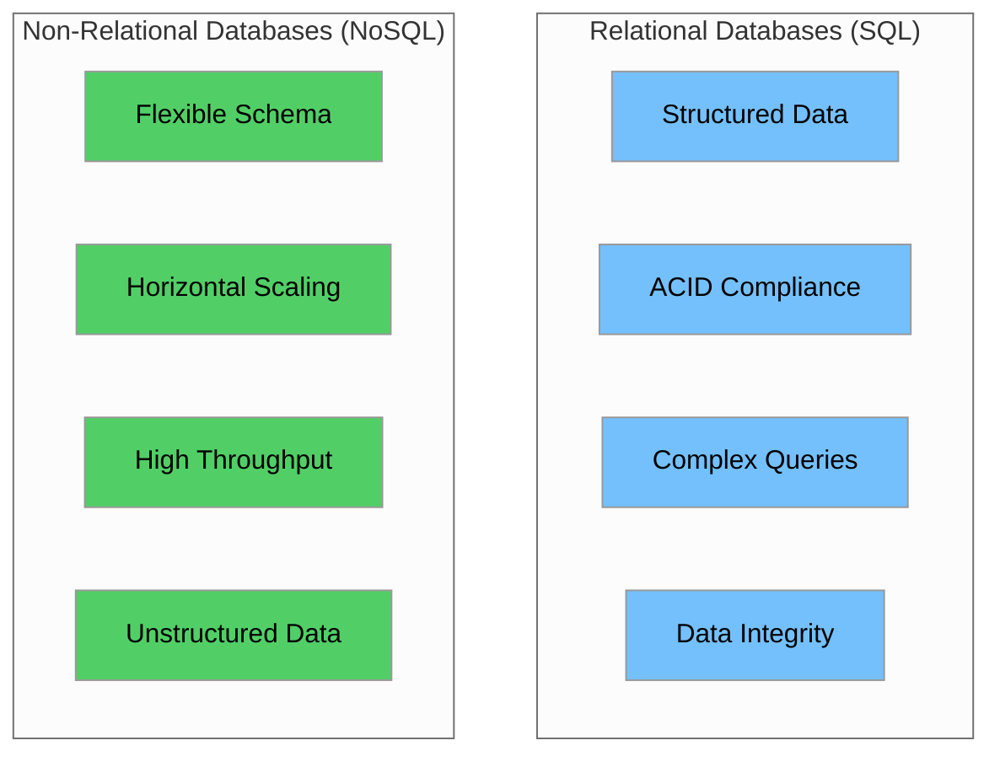

#### Comparison Table

| Aspect | Relational (SQL) | Non-Relational (NoSQL) |
|--------|------------------|------------------------|
| **Data Structure** | Tables with rows and columns | Documents, key-value, graph, column-family |
| **Schema** | Fixed, predefined schema | Dynamic, flexible schema |
| **Scaling** | Vertical (scale up) | Horizontal (scale out) |
| **ACID** | Full ACID compliance | Eventual consistency (typically) |
| **Query Language** | SQL | Varies by database |
| **Best For** | Complex queries, transactions | High volume, flexible data |
| **Examples** | PostgreSQL, MySQL, Oracle | MongoDB, DynamoDB, Cassandra |
| **NYC Taxi Use Case** | Trip analytics, reporting | Real-time trip tracking |

#### When to Use Each

**Use Relational Databases when:**
- Data has clear relationships and structure
- ACID compliance is required (financial transactions)
- Complex queries with JOINs are needed
- Data integrity is critical

**Use Non-Relational Databases when:**
- Schema needs to evolve frequently
- Handling large volumes of unstructured data
- High write throughput is required
- Horizontal scaling is necessary

### 2.2 SQL Operations Deep Dive

#### JOINs

JOINs combine rows from two or more tables based on related columns.


**NYC Taxi Example: Joining Trips with Zones**

```sql
-- INNER JOIN: Get trips with valid pickup zone information
SELECT 
    t.tpep_pickup_datetime,
    t.trip_distance,
    t.fare_amount,
    z.Borough AS pickup_borough,
    z.Zone AS pickup_zone,
    z.service_zone
FROM yellow_taxi_trips t
INNER JOIN taxi_zones z ON t.PULocationID = z.LocationID
WHERE t.tpep_pickup_datetime >= '2025-08-01'
LIMIT 10;

-- LEFT JOIN: Get all trips, including those with unknown zones
SELECT 
    t.tpep_pickup_datetime,
    t.PULocationID,
    COALESCE(z.Zone, 'Unknown Zone') AS pickup_zone,
    COALESCE(z.Borough, 'Unknown Borough') AS pickup_borough
FROM yellow_taxi_trips t
LEFT JOIN taxi_zones z ON t.PULocationID = z.LocationID
WHERE t.tpep_pickup_datetime >= '2025-08-01';

-- Self JOIN: Compare pickup and dropoff zones
SELECT 
    t.tpep_pickup_datetime,
    pz.Zone AS pickup_zone,
    pz.Borough AS pickup_borough,
    dz.Zone AS dropoff_zone,
    dz.Borough AS dropoff_borough,
    t.trip_distance,
    t.fare_amount
FROM yellow_taxi_trips t
INNER JOIN taxi_zones pz ON t.PULocationID = pz.LocationID
INNER JOIN taxi_zones dz ON t.DOLocationID = dz.LocationID
WHERE pz.Borough != dz.Borough  -- Cross-borough trips
LIMIT 10;
```

#### Aggregations

Aggregations summarize data using functions like COUNT, SUM, AVG, MIN, MAX.

```sql
-- Basic aggregations by borough
SELECT 
    z.Borough,
    COUNT(*) AS total_trips,
    ROUND(AVG(t.trip_distance), 2) AS avg_distance,
    ROUND(AVG(t.fare_amount), 2) AS avg_fare,
    ROUND(SUM(t.total_amount), 2) AS total_revenue,
    MIN(t.tpep_pickup_datetime) AS first_trip,
    MAX(t.tpep_pickup_datetime) AS last_trip
FROM yellow_taxi_trips t
INNER JOIN taxi_zones z ON t.PULocationID = z.LocationID
WHERE t.tpep_pickup_datetime >= '2025-08-01'
GROUP BY z.Borough
ORDER BY total_trips DESC;

-- Aggregations with HAVING clause
SELECT 
    z.Zone,
    z.Borough,
    COUNT(*) AS trip_count,
    ROUND(AVG(t.fare_amount), 2) AS avg_fare
FROM yellow_taxi_trips t
INNER JOIN taxi_zones z ON t.PULocationID = z.LocationID
WHERE t.tpep_pickup_datetime >= '2025-08-01'
GROUP BY z.Zone, z.Borough
HAVING COUNT(*) > 1000  -- Only zones with significant traffic
ORDER BY trip_count DESC
LIMIT 20;

-- Multiple aggregations with CASE statements
SELECT 
    z.Borough,
    COUNT(*) AS total_trips,
    COUNT(CASE WHEN t.payment_type = 1 THEN 1 END) AS credit_card_trips,
    COUNT(CASE WHEN t.payment_type = 2 THEN 1 END) AS cash_trips,
    ROUND(100.0 * COUNT(CASE WHEN t.payment_type = 1 THEN 1 END) / COUNT(*), 2) AS credit_card_pct
FROM yellow_taxi_trips t
INNER JOIN taxi_zones z ON t.PULocationID = z.LocationID
GROUP BY z.Borough
ORDER BY total_trips DESC;
```

#### Window Functions

Window functions perform calculations across a set of rows related to the current row.

```sql
-- ROW_NUMBER: Rank trips by fare within each borough
SELECT 
    z.Borough,
    z.Zone,
    t.fare_amount,
    t.trip_distance,
    ROW_NUMBER() OVER (PARTITION BY z.Borough ORDER BY t.fare_amount DESC) AS fare_rank
FROM yellow_taxi_trips t
INNER JOIN taxi_zones z ON t.PULocationID = z.LocationID
WHERE t.tpep_pickup_datetime >= '2025-08-01'
    AND t.fare_amount > 0;

-- RANK and DENSE_RANK: Handle ties differently
SELECT 
    z.Zone,
    COUNT(*) AS trip_count,
    RANK() OVER (ORDER BY COUNT(*) DESC) AS rank_with_gaps,
    DENSE_RANK() OVER (ORDER BY COUNT(*) DESC) AS rank_no_gaps
FROM yellow_taxi_trips t
INNER JOIN taxi_zones z ON t.PULocationID = z.LocationID
GROUP BY z.Zone
ORDER BY trip_count DESC
LIMIT 20;

-- Running totals with SUM() OVER
SELECT 
    DATE(tpep_pickup_datetime) AS trip_date,
    COUNT(*) AS daily_trips,
    SUM(COUNT(*)) OVER (ORDER BY DATE(tpep_pickup_datetime)) AS cumulative_trips,
    ROUND(AVG(fare_amount), 2) AS avg_fare,
    ROUND(AVG(AVG(fare_amount)) OVER (
        ORDER BY DATE(tpep_pickup_datetime)
        ROWS BETWEEN 6 PRECEDING AND CURRENT ROW
    ), 2) AS rolling_7day_avg_fare
    -- Note: "ROWS BETWEEN 6 PRECEDING AND CURRENT ROW" means include the current
    -- row plus the 6 rows before it (7 rows total) for calculating the rolling average
FROM yellow_taxi_trips
WHERE tpep_pickup_datetime >= '2025-08-01'
GROUP BY DATE(tpep_pickup_datetime)
ORDER BY trip_date;

-- LAG and LEAD: Compare with previous/next values
SELECT 
    DATE(tpep_pickup_datetime) AS trip_date,
    COUNT(*) AS daily_trips,
    LAG(COUNT(*), 1) OVER (ORDER BY DATE(tpep_pickup_datetime)) AS prev_day_trips,
    LEAD(COUNT(*), 1) OVER (ORDER BY DATE(tpep_pickup_datetime)) AS next_day_trips,
    COUNT(*) - LAG(COUNT(*), 1) OVER (ORDER BY DATE(tpep_pickup_datetime)) AS day_over_day_change
FROM yellow_taxi_trips
WHERE tpep_pickup_datetime >= '2025-08-01'
GROUP BY DATE(tpep_pickup_datetime)
ORDER BY trip_date;

-- NTILE: Divide trips into quartiles by fare
SELECT 
    fare_quartile,
    MIN(fare_amount) AS min_fare,
    MAX(fare_amount) AS max_fare,
    COUNT(*) AS trip_count,
    ROUND(AVG(fare_amount), 2) AS avg_fare
FROM (
    SELECT 
        fare_amount,
        NTILE(4) OVER (ORDER BY fare_amount) AS fare_quartile
    FROM yellow_taxi_trips
    WHERE fare_amount > 0
        AND tpep_pickup_datetime >= '2025-08-01'
) subq
GROUP BY fare_quartile
ORDER BY fare_quartile;
```

#### Common Table Expressions (CTEs)

A **CTE (Common Table Expression)** is a temporary named result set that you can reference within a SELECT, INSERT, UPDATE, or DELETE statement. CTEs provide a way to write modular, readable SQL queries by breaking complex queries into simpler, named building blocks.

**Key benefits of CTEs:**
- **Readability**: Break complex queries into logical, named steps
- **Reusability**: Reference the same CTE multiple times in a query
- **Recursion**: Enable recursive queries (like generating date series)
- **Maintainability**: Easier to debug and modify than nested subqueries

```sql
-- Basic CTE: Calculate zone statistics
WITH zone_stats AS (
    SELECT 
        z.LocationID,
        z.Zone,
        z.Borough,
        z.service_zone,
        COUNT(*) AS pickup_count,
        ROUND(AVG(t.fare_amount), 2) AS avg_fare,
        ROUND(AVG(t.trip_distance), 2) AS avg_distance
    FROM taxi_zones z
    LEFT JOIN yellow_taxi_trips t ON z.LocationID = t.PULocationID
    WHERE t.tpep_pickup_datetime >= '2025-08-01'
    GROUP BY z.LocationID, z.Zone, z.Borough, z.service_zone
)
SELECT 
    Borough,
    COUNT(*) AS zone_count,
    SUM(pickup_count) AS total_pickups,
    ROUND(AVG(avg_fare), 2) AS borough_avg_fare
FROM zone_stats
GROUP BY Borough
ORDER BY total_pickups DESC;

-- Multiple CTEs: Complex analysis
WITH 
-- CTE 1: Daily trip statistics
daily_stats AS (
    SELECT 
        DATE(tpep_pickup_datetime) AS trip_date,
        COUNT(*) AS trip_count,
        SUM(total_amount) AS daily_revenue,
        AVG(trip_distance) AS avg_distance
    FROM yellow_taxi_trips
    WHERE tpep_pickup_datetime >= '2025-08-01'
    GROUP BY DATE(tpep_pickup_datetime)
),
-- CTE 2: Calculate averages
overall_avg AS (
    SELECT 
        AVG(trip_count) AS avg_daily_trips,
        AVG(daily_revenue) AS avg_daily_revenue
    FROM daily_stats
),
-- CTE 3: Classify days
classified_days AS (
    SELECT 
        d.trip_date,
        d.trip_count,
        d.daily_revenue,
        CASE 
            WHEN d.trip_count > o.avg_daily_trips * 1.2 THEN 'High Volume'
            WHEN d.trip_count < o.avg_daily_trips * 0.8 THEN 'Low Volume'
            ELSE 'Normal'
        END AS volume_classification
    FROM daily_stats d
    CROSS JOIN overall_avg o
)
SELECT 
    volume_classification,
    COUNT(*) AS day_count,
    ROUND(AVG(trip_count), 0) AS avg_trips,
    ROUND(AVG(daily_revenue), 2) AS avg_revenue
FROM classified_days
GROUP BY volume_classification
ORDER BY avg_trips DESC;

-- Recursive CTE: Generate date series (useful for filling gaps)
-- Note: This syntax is PostgreSQL-specific. MySQL uses different syntax,
-- and some databases may not support recursive CTEs at all.
WITH RECURSIVE date_series AS (
    SELECT DATE('2025-08-01') AS date_val
    UNION ALL
    SELECT date_val + INTERVAL '1 day'
    FROM date_series
    WHERE date_val < '2025-08-31'
)
SELECT 
    ds.date_val,
    COALESCE(COUNT(t.tpep_pickup_datetime), 0) AS trip_count
FROM date_series ds
LEFT JOIN yellow_taxi_trips t 
    ON DATE(t.tpep_pickup_datetime) = ds.date_val
GROUP BY ds.date_val
ORDER BY ds.date_val;
```

---

## 3. Database Fundamentals

### 3.1 ACID Properties

**ACID** is an acronym for the four key properties that guarantee reliable database transactions:
- **A**tomicity
- **C**onsistency
- **I**solation
- **D**urability

These properties ensure reliable database transactions.

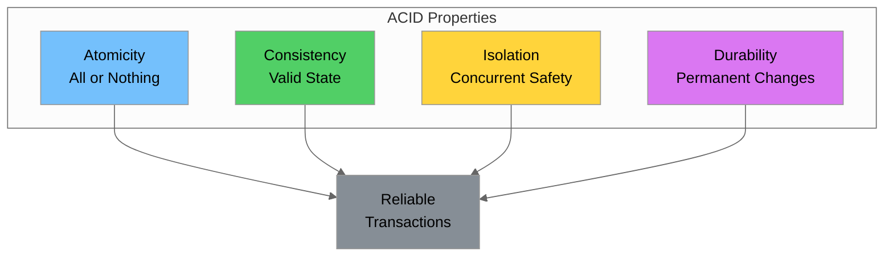

#### Detailed Explanation

| Property | Description | NYC Taxi Example |
|----------|-------------|------------------|
| **Atomicity** | A transaction is all-or-nothing. Either all operations complete successfully, or none do. | When recording a trip, both the trip record and payment must be saved together. If payment fails, the trip record is rolled back. |
| **Consistency** | A transaction brings the database from one valid state to another. All rules and constraints are maintained. | A trip cannot reference a non-existent zone (LocationID must exist in taxi_zones). |
| **Isolation** | Concurrent transactions don't interfere with each other. Each transaction sees a consistent view of data. | Two simultaneous trip recordings don't corrupt each other's data. |
| **Durability** | Once a transaction is committed, it remains so, even in case of system failure. | A recorded trip survives a database restart. |

#### ACID in Practice

```sql
-- Example: Transaction ensuring atomicity
BEGIN TRANSACTION;

-- Insert trip record
INSERT INTO yellow_taxi_trips (
    VendorID, tpep_pickup_datetime, tpep_dropoff_datetime,
    passenger_count, trip_distance, PULocationID, DOLocationID,
    payment_type, fare_amount, total_amount
) VALUES (
    1, '2025-08-15 10:30:00', '2025-08-15 10:45:00',
    2, 3.5, 138, 236,
    1, 15.00, 18.50
);

-- Update zone statistics (hypothetical)
UPDATE zone_statistics 
SET pickup_count = pickup_count + 1,
    last_pickup = '2025-08-15 10:30:00'
WHERE LocationID = 138;

-- If both succeed, commit
COMMIT;

-- If any fails, rollback
-- ROLLBACK;
```

### 3.2 Normalization

Normalization organizes data to reduce redundancy and improve data integrity.

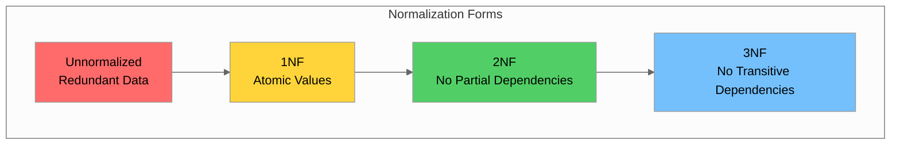

#### First Normal Form (1NF)

**Rule**: Each column contains atomic (indivisible) values, and each row is unique.

**Before 1NF (Unnormalized)**:

| TripID | Zones | Amounts |
|--------|-------|---------|
| 1 | LaGuardia, Midtown | 15.00, 2.50, 17.50 |

**After 1NF**:

| TripID | PickupZone | DropoffZone | Fare | Tax | Total |
|--------|------------|-------------|------|-----|-------|
| 1 | LaGuardia | Midtown | 15.00 | 2.50 | 17.50 |

#### Second Normal Form (2NF)

**Rule**: Must be in 1NF, and all non-key attributes must depend on the entire primary key (no partial dependencies).

**Before 2NF** (Partial dependency on composite key):

| TripID | ZoneID | ZoneName | Borough | Fare |
|--------|--------|----------|---------|------|
| 1 | 138 | LaGuardia | Queens | 15.00 |
| 2 | 138 | LaGuardia | Queens | 22.00 |

*ZoneName and Borough depend only on ZoneID, not the full key (TripID, ZoneID)*

**After 2NF** (Separate tables):

```sql
-- Trips table
-- | TripID | PULocationID | Fare  |
-- |--------|--------------|-------|
-- | 1      | 138          | 15.00 |
-- | 2      | 138          | 22.00 |

-- Zones table
-- | LocationID | Zone      | Borough |
-- |------------|-----------|---------|
-- | 138        | LaGuardia | Queens  |
```

#### Third Normal Form (3NF)

**Rule**: Must be in 2NF, and no transitive dependencies (non-key attributes shouldn't depend on other non-key attributes).

**Before 3NF** (Transitive dependency):

| LocationID | Zone | Borough | BoroughPopulation |
|------------|------|---------|-------------------|
| 138 | LaGuardia | Queens | 2,405,464 |
| 132 | JFK | Queens | 2,405,464 |

*BoroughPopulation depends on Borough, not directly on LocationID*

**After 3NF**:

```sql
-- Zones table
-- | LocationID | Zone      | Borough |
-- |------------|-----------|---------|
-- | 138        | LaGuardia | Queens  |
-- | 132        | JFK       | Queens  |

-- Boroughs table
-- | Borough | Population |
-- |---------|------------|
-- | Queens  | 2,405,464  |
```

#### Normalization Trade-offs

| Aspect | Normalized | Denormalized |
|--------|------------|--------------|
| **Data Redundancy** | Low | High |
| **Storage** | Less | More |
| **Write Performance** | Better | Worse |
| **Read Performance** | May need JOINs | Faster (no JOINs) |
| **Data Integrity** | Higher | Lower |
| **Best For** | OLTP systems | OLAP/Analytics |

> **OLTP vs OLAP Explained:**
> - **OLTP (Online Transaction Processing)**: Systems optimized for fast, real-time transactions like order processing, ATM withdrawals, or booking systems. Uses normalized data for data integrity.
> - **OLAP (Online Analytical Processing)**: Systems optimized for complex analytical queries on large datasets like business intelligence, reporting, and data warehousing. Often uses denormalized data for faster reads.

### 3.3 Data Types and Schema Evolution

#### Common SQL Data Types

| Category | Data Type | Description | NYC Taxi Example |
|----------|-----------|-------------|------------------|
| **Numeric** | INTEGER | Whole numbers | `passenger_count`, `VendorID` |
| **Numeric** | DECIMAL(p,s) | Exact decimal | `fare_amount DECIMAL(10,2)` |
| **Numeric** | FLOAT | Approximate decimal | `trip_distance` |
| **String** | VARCHAR(n) | Variable-length string | `Zone VARCHAR(100)` |
| **String** | TEXT | Unlimited text | `trip_notes` |
| **Date/Time** | TIMESTAMP | Date and time | `tpep_pickup_datetime` |
| **Date/Time** | DATE | Date only | `trip_date` |
| **Boolean** | BOOLEAN | True/False | `is_airport_trip` |

#### Schema Evolution Strategies

Schema evolution handles changes to database structure over time.

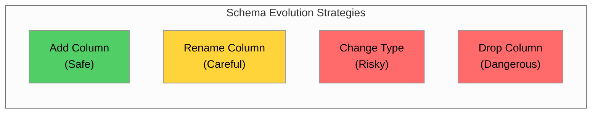

**Safe Schema Changes**:

```sql
-- Adding a new column (backward compatible)
ALTER TABLE yellow_taxi_trips 
ADD COLUMN cbd_congestion_fee DECIMAL(10,2) DEFAULT 0;

-- Adding a new column with NOT NULL requires default
ALTER TABLE taxi_zones 
ADD COLUMN is_active BOOLEAN NOT NULL DEFAULT TRUE;
```

**Careful Schema Changes**:

```sql
-- Renaming a column (may break existing queries)
ALTER TABLE taxi_zones 
RENAME COLUMN Zone TO zone_name;

-- Changing column type (may lose data)
ALTER TABLE yellow_taxi_trips 
ALTER COLUMN passenger_count TYPE SMALLINT;
```

**Migration Best Practices**:
1. Always backup before schema changes
2. Test migrations in non-production first
3. Use versioned migration scripts
4. Plan for rollback scenarios
5. Update application code before/after as needed

---

## 4. Entity-Relationship Modeling

### 4.1 Data Dictionary Concepts

A **Data Dictionary** is a centralized repository of metadata about data elements in a database.

#### Components of a Data Dictionary

| Component | Description | Example |
|-----------|-------------|---------|
| **Field Name** | Technical name of the attribute | `PULocationID` |
| **Business Name** | Human-readable name | Pickup Location ID |
| **Data Type** | Technical data type | INTEGER |
| **Description** | What the field represents | TLC Taxi Zone where meter was engaged |
| **Valid Values** | Allowed values or ranges | 1-265 (references taxi_zones) |
| **Business Owner** | Person responsible | Operations Manager |
| **Sensitivity** | Data classification | Internal |

#### NYC Taxi Data Dictionary Example

```sql
-- Create a data dictionary table
CREATE TABLE data_dictionary (
    dictionary_id SERIAL PRIMARY KEY,
    table_name VARCHAR(100) NOT NULL,
    column_name VARCHAR(100) NOT NULL,
    business_name VARCHAR(200),
    data_type VARCHAR(50),
    description TEXT,
    valid_values TEXT,
    is_nullable BOOLEAN,
    is_primary_key BOOLEAN DEFAULT FALSE,
    is_foreign_key BOOLEAN DEFAULT FALSE,
    references_table VARCHAR(100),
    references_column VARCHAR(100),
    business_owner VARCHAR(100),
    data_steward VARCHAR(100),
    sensitivity_level VARCHAR(50),
    retention_policy VARCHAR(100),
    quality_rules TEXT,
    created_at TIMESTAMP DEFAULT CURRENT_TIMESTAMP,
    updated_at TIMESTAMP DEFAULT CURRENT_TIMESTAMP,
    UNIQUE(table_name, column_name)
);

-- Populate data dictionary for taxi_zones
INSERT INTO data_dictionary (
    table_name, column_name, business_name, data_type, description,
    valid_values, is_nullable, is_primary_key, business_owner,
    data_steward, sensitivity_level, retention_policy, quality_rules
) VALUES
('taxi_zones', 'LocationID', 'Location Identifier', 'INTEGER',
 'Unique identifier for each taxi zone in NYC. TLC (Taxi and Limousine Commission) is the NYC agency that regulates taxis and for-hire vehicles.',
 '1-265', FALSE, TRUE, 'TLC Operations', 'Zone Data Manager',
 'Public', 'Permanent', 'Must be unique, sequential'),

('taxi_zones', 'Borough', 'Borough Name', 'VARCHAR(50)',
 'NYC borough where the zone is located',
 'Manhattan, Brooklyn, Queens, Bronx, Staten Island, EWR, Unknown, N/A',
 FALSE, FALSE, 'TLC Operations', 'Zone Data Manager',
 'Public', 'Permanent', 'Must be valid NYC borough'),

('taxi_zones', 'Zone', 'Zone Name', 'VARCHAR(100)',
 'Descriptive name of the taxi zone',
 'Free text - neighborhood or landmark name',
 FALSE, FALSE, 'TLC Operations', 'Zone Data Manager',
 'Public', 'Permanent', 'Must be non-empty'),

('taxi_zones', 'service_zone', 'Service Zone Type', 'VARCHAR(50)',
 'Classification of zone for taxi service purposes',
 'Yellow Zone, Boro Zone, Airports, EWR, N/A',
 TRUE, FALSE, 'TLC Operations', 'Zone Data Manager',
 'Public', 'Permanent', 'Must be valid service zone type');
```

### 4.2 Entities, Attributes, and Relationships

#### Entity Types

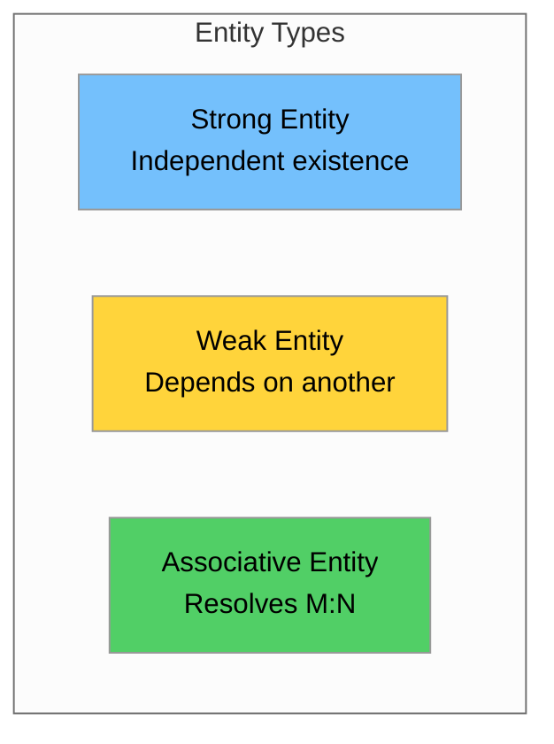

**NYC Taxi Entities**:

| Entity | Type | Description |
|--------|------|-------------|
| **Taxi Zone** | Strong | Independent location entity |
| **Vendor** | Strong | Technology provider entity |
| **Trip** | Strong | Core transaction entity |
| **Rate Code** | Strong | Reference entity for pricing |
| **Payment Type** | Strong | Reference entity for payments |

#### Attributes

| Attribute Type | Description | Example |
|----------------|-------------|---------|
| **Simple** | Atomic, cannot be divided | `fare_amount` |
| **Composite** | Can be divided into parts | `full_address` → street, city, zip |
| **Derived** | Calculated from other attributes | `trip_duration` from pickup/dropoff times |
| **Multi-valued** | Can have multiple values | `phone_numbers` (not in taxi data) |
| **Key** | Uniquely identifies entity | `LocationID`, `TripID` |

#### Cardinality

Cardinality defines the numerical relationship between entities.

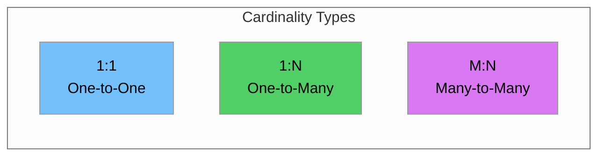

**NYC Taxi Cardinality Examples**:

| Relationship | Cardinality | Description |
|--------------|-------------|-------------|
| Zone → Trips | 1:N | One zone has many pickups |
| Vendor → Trips | 1:N | One vendor records many trips |
| Trip → Pickup Zone | N:1 | Many trips from one zone |
| Trip → Dropoff Zone | N:1 | Many trips to one zone |

### 4.3 ER Diagram for NYC Taxi Data

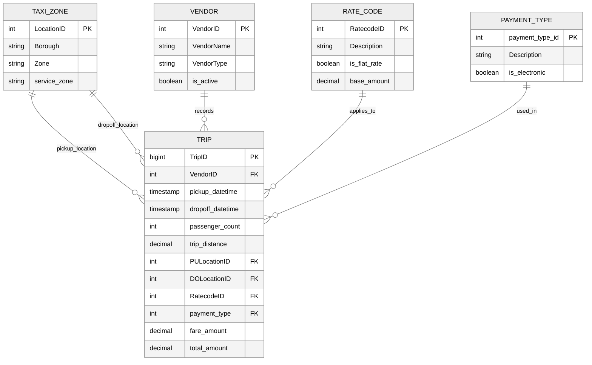

### 4.4 Creating ER Diagrams

**Tools for ER Diagrams**:
- **Draw.io** (diagrams.net) - Free, web-based
- **Lucidchart** - Professional diagramming
- **dbdiagram.io** - Database-specific
- **Mermaid** - Code-based diagrams (used in this document)

**Best Practices**:
1. Start with identifying entities (nouns in requirements)
2. Define primary keys for each entity
3. Identify relationships between entities
4. Determine cardinality for each relationship
5. Add attributes to entities
6. Normalize to appropriate level
7. Document in data dictionary

---

## 5. Design Patterns for Data Warehousing

### 5.1 Star Schema Basics

The **Star Schema** is the most common dimensional modeling pattern for data warehouses.

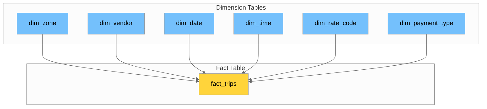

#### Components

| Component | Description | Characteristics |
|-----------|-------------|-----------------|
| **Fact Table** | Contains measurable business events | Numeric measures, foreign keys to dimensions |
| **Dimension Tables** | Contain descriptive attributes | Denormalized, descriptive text, hierarchies |
| **Surrogate Keys** | Artificial keys for dimensions | Integer, auto-increment, stable |
| **Natural Keys** | Business keys from source systems | May change, used for lookups |

#### Star Schema Implementation for NYC Taxi

```sql
-- Dimension: Date
CREATE TABLE dim_date (
    date_key INT PRIMARY KEY,
    full_date DATE NOT NULL,
    year INT,
    quarter INT,
    month INT,
    month_name VARCHAR(20),
    week_of_year INT,
    day_of_month INT,
    day_of_week INT,
    day_name VARCHAR(20),
    is_weekend BOOLEAN,
    is_holiday BOOLEAN
);

-- Dimension: Time
CREATE TABLE dim_time (
    time_key INT PRIMARY KEY,
    full_time TIME NOT NULL,
    hour INT,
    minute INT,
    hour_12 INT,
    am_pm VARCHAR(2),
    time_period VARCHAR(20)  -- Morning, Afternoon, Evening, Night
);

-- Dimension: Zone
CREATE TABLE dim_zone (
    zone_key SERIAL PRIMARY KEY,
    location_id INT NOT NULL,
    zone_name VARCHAR(100),
    borough VARCHAR(50),
    service_zone VARCHAR(50),
    -- SCD Type 2 columns
    effective_date DATE,
    expiration_date DATE,
    is_current BOOLEAN DEFAULT TRUE,
    -- Audit columns
    created_at TIMESTAMP DEFAULT CURRENT_TIMESTAMP,
    updated_at TIMESTAMP DEFAULT CURRENT_TIMESTAMP
);

-- Dimension: Vendor
CREATE TABLE dim_vendor (
    vendor_key SERIAL PRIMARY KEY,
    vendor_id INT NOT NULL,
    vendor_name VARCHAR(100),
    vendor_type VARCHAR(50),
    is_active BOOLEAN DEFAULT TRUE,
    effective_date DATE,
    expiration_date DATE,
    is_current BOOLEAN DEFAULT TRUE
);

-- Dimension: Rate Code
CREATE TABLE dim_rate_code (
    rate_code_key SERIAL PRIMARY KEY,
    rate_code_id INT NOT NULL,
    rate_code_description VARCHAR(100),
    is_flat_rate BOOLEAN,
    base_amount DECIMAL(10,2)
);

-- Dimension: Payment Type
CREATE TABLE dim_payment_type (
    payment_type_key SERIAL PRIMARY KEY,
    payment_type_id INT NOT NULL,
    payment_description VARCHAR(100),
    is_electronic BOOLEAN
);

-- Fact: Trips
CREATE TABLE fact_trips (
    trip_key BIGSERIAL PRIMARY KEY,
    -- Dimension keys
    pickup_date_key INT REFERENCES dim_date(date_key),
    pickup_time_key INT REFERENCES dim_time(time_key),
    dropoff_date_key INT REFERENCES dim_date(date_key),
    dropoff_time_key INT REFERENCES dim_time(time_key),
    pickup_zone_key INT REFERENCES dim_zone(zone_key),
    dropoff_zone_key INT REFERENCES dim_zone(zone_key),
    vendor_key INT REFERENCES dim_vendor(vendor_key),
    rate_code_key INT REFERENCES dim_rate_code(rate_code_key),
    payment_type_key INT REFERENCES dim_payment_type(payment_type_key),
    -- Degenerate dimensions
    store_and_fwd_flag CHAR(1),
    -- Measures
    passenger_count INT,
    trip_distance DECIMAL(10,2),
    fare_amount DECIMAL(10,2),
    extra DECIMAL(10,2),
    mta_tax DECIMAL(10,2),
    tip_amount DECIMAL(10,2),
    tolls_amount DECIMAL(10,2),
    improvement_surcharge DECIMAL(10,2),
    congestion_surcharge DECIMAL(10,2),
    airport_fee DECIMAL(10,2),
    total_amount DECIMAL(10,2),
    -- Derived measures
    trip_duration_minutes INT,
    -- Audit
    etl_load_date TIMESTAMP DEFAULT CURRENT_TIMESTAMP
);

-- Create indexes for common query patterns
CREATE INDEX idx_fact_trips_pickup_date ON fact_trips(pickup_date_key);
CREATE INDEX idx_fact_trips_pickup_zone ON fact_trips(pickup_zone_key);
CREATE INDEX idx_fact_trips_vendor ON fact_trips(vendor_key);
```

### 5.2 Slowly Changing Dimensions (SCD)

Slowly Changing Dimensions handle changes to dimension attributes over time.

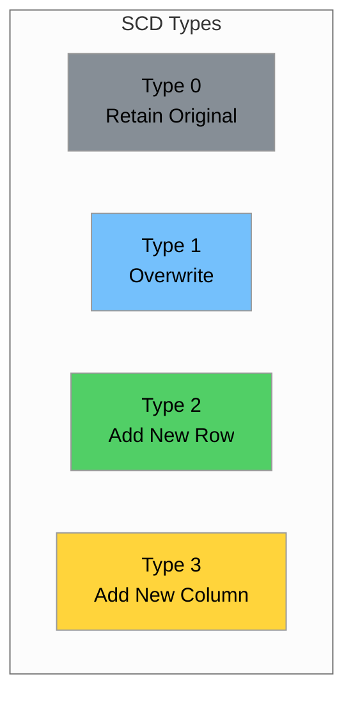

#### SCD Type Comparison

| Type | Description | History | Storage | Use Case |
|------|-------------|---------|---------|----------|
| **Type 0** | Never change | None | Minimal | Fixed reference data |
| **Type 1** | Overwrite old value | Lost | Minimal | Corrections, non-critical |
| **Type 2** | Add new row with versioning | Full | High | Audit requirements |
| **Type 3** | Add column for previous value | Limited | Medium | Track one previous value |

#### SCD Type 1: Overwrite

```sql
-- SCD Type 1: Simply update the existing record
-- Use when history is not important

-- Example: Vendor name correction
UPDATE dim_vendor
SET vendor_name = 'Curb Mobility, LLC',
    updated_at = CURRENT_TIMESTAMP
WHERE vendor_id = 2
  AND is_current = TRUE;
```

#### SCD Type 2: Add New Row (Most Common)

```sql
-- SCD Type 2: Preserve history by adding new rows
-- Use when historical accuracy is required

-- Step 1: Expire the current record
UPDATE dim_zone
SET expiration_date = CURRENT_DATE - 1,
    is_current = FALSE,
    updated_at = CURRENT_TIMESTAMP
WHERE location_id = 138
  AND is_current = TRUE;

-- Step 2: Insert new record with updated values
INSERT INTO dim_zone (
    location_id, zone_name, borough, service_zone,
    effective_date, expiration_date, is_current
) VALUES (
    138, 'LaGuardia Airport Terminal B', 'Queens', 'Airports',
    CURRENT_DATE, '9999-12-31', TRUE
);

-- Query to get current zone information
SELECT * FROM dim_zone
WHERE location_id = 138 AND is_current = TRUE;

-- Query to get zone information at a specific point in time
SELECT * FROM dim_zone
WHERE location_id = 138
  AND effective_date <= '2024-06-15'
  AND expiration_date >= '2024-06-15';
```

---

## 6. Data Classification & Governance

### 6.1 Master Data vs Transactional Data vs Reference Data

Understanding data classification is fundamental for proper governance.

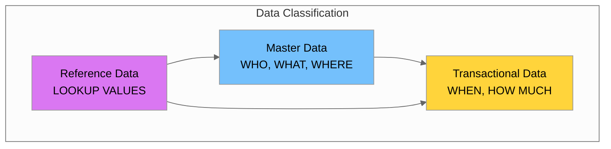

#### Detailed Comparison

| Aspect | Master Data | Transactional Data | Reference Data |
|--------|-------------|-------------------|----------------|
| **Definition** | Core business entities shared across systems | Records of business events | Lookup values for classification |
| **Volume** | Low to Medium | Very High | Very Low |
| **Change Frequency** | Low (infrequent) | Continuous (high) | Rare |
| **Examples** | Customers, Products, Locations | Orders, Trips, Payments | Status codes, Countries |
| **Lifecycle** | Long-lived | Event-based | Permanent |
| **Governance Need** | High | Medium | Medium |
| **NYC Taxi** | Taxi Zones, Vendors | Trip Records | Payment Types, Rate Codes |

### 6.2 Critical Data Elements (CDEs)

**Critical Data Elements** are data fields that are essential for business operations, regulatory compliance, or decision-making.

#### Identifying CDEs in NYC Taxi Data

| Field | CDE? | Reason | Business Impact |
|-------|------|--------|-----------------|
| `PULocationID` | ✅ Yes | Required for fare calculation, zone analysis | Revenue, Operations |
| `DOLocationID` | ✅ Yes | Required for fare calculation, zone analysis | Revenue, Operations |
| `fare_amount` | ✅ Yes | Core revenue metric | Financial Reporting |
| `total_amount` | ✅ Yes | Total transaction value | Financial Reporting |
| `tpep_pickup_datetime` | ✅ Yes | Required for all time-based analysis | Analytics, Compliance |
| `VendorID` | ✅ Yes | Data source identification | Data Quality, Audit |
| `passenger_count` | ⚠️ Maybe | Useful but often missing/inaccurate | Analytics |
| `tip_amount` | ⚠️ Maybe | Only for credit card payments | Analytics |
| `store_and_fwd_flag` | ❌ No | Technical metadata | System Operations |

### 6.3 Business Ownership Examples

Establishing clear data ownership is essential for governance.

#### NYC Taxi Data Ownership Matrix

| Data Domain | Data Owner | Data Steward | Data Custodian | Responsibilities |
|-------------|------------|--------------|----------------|------------------|
| **Zone Master** | Director of Operations | Zone Data Manager | DBA Team | Zone definitions, boundaries |
| **Vendor Master** | Technology Director | Vendor Relations Manager | DBA Team | Vendor onboarding, compliance |
| **Trip Data** | Analytics Director | Trip Data Manager | Data Engineering | Trip quality, completeness |
| **Financial Data** | Finance Director | Revenue Analyst | Data Engineering | Fare accuracy, reconciliation |
| **Reference Data** | Operations Manager | Reference Data Steward | DBA Team | Code maintenance, updates |

---

## 7. Hands-on Labs

### Lab 1: SQL Operations Practice

**Objective**: Practice JOINs, aggregations, window functions, and CTEs using NYC Taxi data.

```python
import pandas as pd
import pyarrow.parquet as pq

# Load the data
trips = pq.read_table('data/yellow_tripdata_2025-08.parquet').to_pandas()
zones = pd.read_csv('data/taxi_zone_lookup.csv')

print(f"Trips loaded: {len(trips):,} records")
print(f"Zones loaded: {len(zones)} records")

# Exercise 1: JOIN - Merge trips with zone information
trips_with_zones = trips.merge(
    zones[['LocationID', 'Zone', 'Borough']],
    left_on='PULocationID',
    right_on='LocationID',
    how='left'
).rename(columns={'Zone': 'pickup_zone', 'Borough': 'pickup_borough'})

print("\n=== Top 10 Pickup Zones ===")
print(trips_with_zones.groupby(['pickup_zone', 'pickup_borough']).size()
      .sort_values(ascending=False).head(10))

# Exercise 2: Aggregations
print("\n=== Borough Statistics ===")
borough_stats = trips_with_zones.groupby('pickup_borough').agg({
    'fare_amount': ['count', 'mean', 'sum'],
    'trip_distance': 'mean',
    'total_amount': 'sum'
}).round(2)
print(borough_stats)

# Exercise 3: Window Function equivalent - Ranking
trips_with_zones['fare_rank'] = trips_with_zones.groupby('pickup_borough')['fare_amount'].rank(
    method='dense', ascending=False
)
print("\n=== Top Fares by Borough ===")
top_fares = trips_with_zones[trips_with_zones['fare_rank'] <= 3][
    ['pickup_borough', 'pickup_zone', 'fare_amount', 'fare_rank']
].sort_values(['pickup_borough', 'fare_rank'])
print(top_fares.head(15))
```

### Lab 2: Identify Master Data Domains in NYC Taxi Dataset

**Objective**: Analyze the NYC Taxi dataset to identify and classify data entities.

```python
import pandas as pd
import pyarrow.parquet as pq

# Load datasets
zones = pd.read_csv('data/taxi_zone_lookup.csv')
trips = pq.read_table('data/yellow_tripdata_2025-08.parquet').to_pandas()

print("=" * 60)
print("LAB 2: IDENTIFY MASTER DATA DOMAINS")
print("=" * 60)

# 1. MASTER DATA: Zone Analysis
print("\n1. MASTER DATA - Taxi Zones")
print(f"   Total zones: {len(zones)}")
print(f"   Boroughs: {zones['Borough'].nunique()}")
print(f"   Service zones: {zones['service_zone'].nunique()}")
print("\n   Zone distribution by borough:")
print(zones.groupby('Borough').size().sort_values(ascending=False))

# 2. REFERENCE DATA: Identify from trip data
print("\n2. REFERENCE DATA")
print(f"   VendorIDs: {sorted(trips['VendorID'].dropna().unique())}")
print(f"   RateCodes: {sorted(trips['RatecodeID'].dropna().unique())}")
print(f"   PaymentTypes: {sorted(trips['payment_type'].dropna().unique())}")

# 3. TRANSACTIONAL DATA: Trip statistics
print("\n3. TRANSACTIONAL DATA - Trip Records")
print(f"   Total trips: {len(trips):,}")
print(f"   Date range: {trips['tpep_pickup_datetime'].min()} to {trips['tpep_pickup_datetime'].max()}")
print(f"   Total revenue: ${trips['total_amount'].sum():,.2f}")

# 4. Data Quality Check
print("\n4. DATA QUALITY CHECK")
print(f"   Missing PULocationID: {trips['PULocationID'].isna().sum()}")
print(f"   Missing DOLocationID: {trips['DOLocationID'].isna().sum()}")
invalid_pu = (~trips['PULocationID'].isin(zones['LocationID'])).sum()
print(f"   Invalid PULocationID (not in zones): {invalid_pu}")
```

### Lab 3: Create a Data Dictionary with Governance Attributes

**Objective**: Build a comprehensive data dictionary for the NYC Taxi dataset.

```python
import pandas as pd
from datetime import datetime

# Create data dictionary entries
data_dictionary = [
    # taxi_zones table
    {
        'table_name': 'taxi_zones',
        'column_name': 'LocationID',
        'business_name': 'Location Identifier',
        'data_type': 'INTEGER',
        'description': 'Unique identifier for each taxi zone in NYC',
        'valid_values': '1-265',
        'is_nullable': False,
        'is_primary_key': True,
        'business_owner': 'TLC Operations',
        'data_steward': 'Zone Data Manager',
        'sensitivity_level': 'Public',
        'retention_policy': 'Permanent',
        'quality_rules': 'Must be unique, sequential integer'
    },
    {
        'table_name': 'taxi_zones',
        'column_name': 'Borough',
        'business_name': 'Borough Name',
        'data_type': 'VARCHAR(50)',
        'description': 'NYC borough where the zone is located',
        'valid_values': 'Manhattan, Brooklyn, Queens, Bronx, Staten Island, EWR, Unknown, N/A',
        'is_nullable': False,
        'is_primary_key': False,
        'business_owner': 'TLC Operations',
        'data_steward': 'Zone Data Manager',
        'sensitivity_level': 'Public',
        'retention_policy': 'Permanent',
        'quality_rules': 'Must be valid NYC borough or special value'
    },
    {
        'table_name': 'yellow_taxi_trips',
        'column_name': 'VendorID',
        'business_name': 'Vendor Identifier',
        'data_type': 'INTEGER',
        'description': 'Code indicating the TPEP provider that provided the record',
        'valid_values': '1=Creative Mobile Technologies, 2=Curb Mobility, 6=Myle Technologies, 7=Helix',
        'is_nullable': False,
        'is_primary_key': False,
        'business_owner': 'TLC Technology',
        'data_steward': 'Vendor Data Manager',
        'sensitivity_level': 'Internal',
        'retention_policy': '7 years',
        'quality_rules': 'Must be valid VendorID (1, 2, 6, 7)'
    },
    {
        'table_name': 'yellow_taxi_trips',
        'column_name': 'fare_amount',
        'business_name': 'Fare Amount',
        'data_type': 'DECIMAL(10,2)',
        'description': 'The time-and-distance fare calculated by the meter',
        'valid_values': '>= 0, typically 2.50 - 500.00',
        'is_nullable': False,
        'is_primary_key': False,
        'business_owner': 'TLC Finance',
        'data_steward': 'Revenue Data Manager',
        'sensitivity_level': 'Confidential',
        'retention_policy': '7 years',
        'quality_rules': 'Must be >= 0, flag outliers > $500'
    }
]

# Create DataFrame and display
dd_df = pd.DataFrame(data_dictionary)

print("=" * 60)
print("LAB 3: DATA DICTIONARY WITH GOVERNANCE ATTRIBUTES")
print("=" * 60)

for table in dd_df['table_name'].unique():
    print(f"\n### Table: {table}")
    table_dd = dd_df[dd_df['table_name'] == table]
    for _, row in table_dd.iterrows():
        print(f"\n  Column: {row['column_name']}")
        print(f"    Business Name: {row['business_name']}")
        print(f"    Data Type: {row['data_type']}")
        print(f"    Description: {row['description']}")
        print(f"    Owner: {row['business_owner']} | Steward: {row['data_steward']}")
        print(f"    Sensitivity: {row['sensitivity_level']} | Retention: {row['retention_policy']}")

# Save to CSV
dd_df.to_csv('data_dictionary_nyc_taxi.csv', index=False)
print("\n\nData dictionary saved to: data_dictionary_nyc_taxi.csv")
```

---

## 8. Summary & Key Takeaways

### Key Concepts Learned

| Concept | Description |
|---------|-------------|
| **SQL Fundamentals** | JOINs, aggregations, window functions, CTEs for data analysis |
| **ACID Properties** | Atomicity, Consistency, Isolation, Durability for reliable transactions |
| **Normalization** | 1NF, 2NF, 3NF to reduce redundancy and improve integrity |
| **ER Modeling** | Entities, attributes, relationships, and cardinality |
| **Star Schema** | Fact and dimension tables for analytics |
| **SCD Types** | Type 1 (overwrite) and Type 2 (versioning) for dimension changes |
| **Data Classification** | Master, Transactional, and Reference data types |
| **CDEs** | Critical Data Elements requiring special governance |
| **Data Dictionary** | Metadata repository with governance attributes |

### Day 3 Checklist

- [ ] Review SQL basics (JOINs, aggregations)
- [ ] Practice window functions and CTEs
- [ ] Understand ACID properties
- [ ] Learn normalization forms (1NF, 2NF, 3NF)
- [ ] Create ER diagrams for NYC Taxi data
- [ ] Understand Star Schema design
- [ ] Learn SCD Type 1 and Type 2 patterns
- [ ] Classify data (Master, Transactional, Reference)
- [ ] Identify Critical Data Elements
- [ ] Build data dictionary with governance attributes
- [ ] Complete hands-on labs
- [ ] Practice SQL on HackerRank/LeetCode

### NYC Taxi Data Model Summary

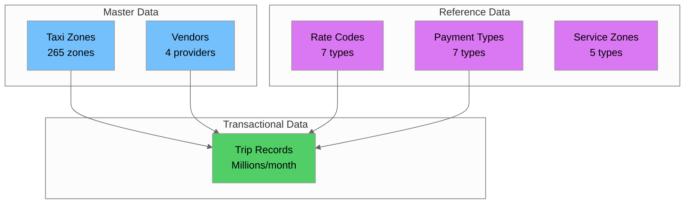

---

## 9. Additional Resources

### SQL Practice Platforms

| Platform | Focus | Link |
|----------|-------|------|
| **HackerRank** | SQL challenges by difficulty | https://www.hackerrank.com/domains/sql |
| **LeetCode** | Database problems | https://leetcode.com/problemset/database/ |
| **SQLZoo** | Interactive tutorials | https://sqlzoo.net/ |
| **Mode Analytics** | SQL tutorial with real data | https://mode.com/sql-tutorial/ |

### Books & Documentation

- **"The Data Warehouse Toolkit"** by Ralph Kimball - Dimensional modeling bible
- **"SQL Performance Explained"** by Markus Winand - Query optimization
- **PostgreSQL Documentation** - https://www.postgresql.org/docs/
- **AWS RDS Documentation** - https://docs.aws.amazon.com/rds/

### Data Modeling Tools

| Tool | Type | Best For |
|------|------|----------|
| **Draw.io** | Free, web-based | Quick diagrams |
| **dbdiagram.io** | Database-specific | ER diagrams from code |
| **Lucidchart** | Professional | Team collaboration |
| **ERDPlus** | Free, educational | Learning ER modeling |

### Next Steps

1. **Practice SQL** on HackerRank or LeetCode (database section)
2. **Create ER diagrams** for the NYC Taxi dataset using Draw.io
3. **Build the Star Schema** in PostgreSQL RDS
4. **Implement SCD Type 2** for zone dimension
5. **Complete the data dictionary** for all tables
6. **Prepare for Day 4**: Master Data Management Fundamentals

---

*End of Day 3: Data Modeling with Governance Lens*