# Day 4: Master Data Management (MDM) Fundamentals

## Table of Contents
1. [Introduction to MDM](#1-introduction-to-mdm)
2. [Understanding Data Types](#2-understanding-data-types)
3. [MDM and Data Warehouse Relationship](#3-mdm-and-data-warehouse-relationship)
4. [Master Data Domains](#4-master-data-domains)
5. [Golden Records & Data Consolidation](#5-golden-records--data-consolidation)
6. [Data Quality Dimensions](#6-data-quality-dimensions)
7. [MDM Implementation Styles](#7-mdm-implementation-styles)
8. [MDM Architecture Components](#8-mdm-architecture-components)
9. [Data Stewardship & Governance](#9-data-stewardship--governance)
10. [Match and Merge Strategies](#10-match-and-merge-strategies)
11. [Data Lineage & Audit Trails](#11-data-lineage--audit-trails)
12. [Hands-on Labs](#12-hands-on-labs)
13. [Summary & Key Takeaways](#13-summary--key-takeaways)
14. [Additional Resources](#14-additional-resources)

---

## 1. Introduction to MDM

### What is Master Data Management?

**Master Data Management (MDM)** is a comprehensive method of enabling an enterprise to link all of its critical data to a single "master" file, providing a common point of reference. MDM streamlines data sharing among personnel and departments, and facilitates computing in multiple system architectures, platforms, and applications.

Think of MDM as the **"single source of truth"** for your organization's most important business entities—customers, products, locations, vendors, and employees.

### Why MDM Matters

In today's data-driven world, organizations face several challenges:

> **Common Business System Acronyms You'll Encounter:**
>
> Before diving into MDM, let's understand the common business systems that typically feed data into MDM solutions:
>
> | Acronym | Full Name | Description | Examples |
> |---------|-----------|-------------|----------|
> | **CRM** | Customer Relationship Management | Software for managing customer interactions, sales pipelines, and customer data | Salesforce, HubSpot, Microsoft Dynamics |
> | **ERP** | Enterprise Resource Planning | Integrated software for managing core business processes like accounting, inventory, HR, and supply chain | SAP, Oracle ERP, Microsoft Dynamics 365 |
> | **POS** | Point of Sale | System where retail transactions occur, including hardware and software for processing payments | Square, Shopify POS, Toast |
> | **BI** | Business Intelligence | Tools and practices for collecting, analyzing, and presenting business data for decision-making | Tableau, Power BI, Looker |
>
> These systems are common **source systems** that feed data into MDM solutions.


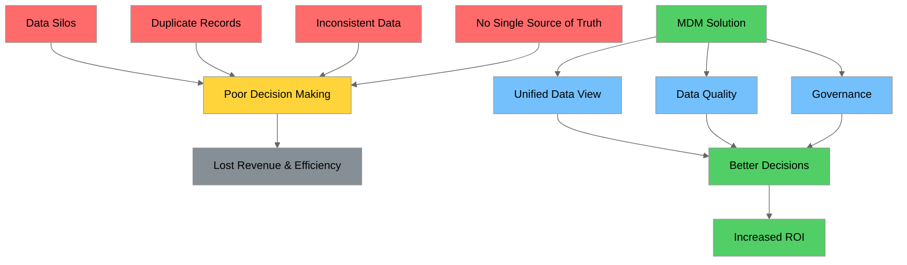

### Business Value & ROI of MDM

> **What is ROI?** ROI stands for **Return on Investment** - a financial metric that measures the profitability of an investment relative to its cost. It's calculated as: `ROI = (Net Benefit - Cost) / Cost × 100%`. In MDM context, ROI measures the financial value gained from implementing MDM compared to the investment made.

| Benefit Category | Impact | Example |
|-----------------|--------|---------|
| **Operational Efficiency** | 20-40% reduction in data management costs | Eliminating duplicate customer records reduces mailing costs |
| **Revenue Growth** | 10-20% increase in cross-sell/upsell | Complete customer view enables targeted marketing |
| **Risk Reduction** | 30-50% reduction in compliance violations | Accurate data ensures regulatory compliance |
| **Decision Quality** | 25-35% faster time-to-insight | Trusted data accelerates analytics |
| **Customer Experience** | 15-25% improvement in satisfaction | Consistent experience across channels |

### Real-World MDM Example: NYC Taxi System

Consider our NYC Yellow Taxi dataset. Without MDM:
- Different systems might have different zone names for the same location
- Vendor information could be inconsistent across databases
- Rate codes might have different meanings in different applications

With MDM:
- **Taxi Zone Master**: Single authoritative list of 265 zones with consistent LocationID, Borough, Zone, and service_zone
- **Vendor Master**: Standardized vendor information (VendorID 1 = Creative Mobile Technologies, VendorID 2 = Curb Mobility, LLC)
- **Rate Code Master**: Unified rate code definitions across all systems

> **What is TLC?** TLC stands for **Taxi and Limousine Commission** - the New York City agency responsible for licensing and regulating medallion (yellow) taxicabs, for-hire vehicles, commuter vans, and paratransit vehicles. The TLC collects and publishes the trip data used in this tutorial.

---

## 2. Understanding Data Types

### The Data Classification Triangle

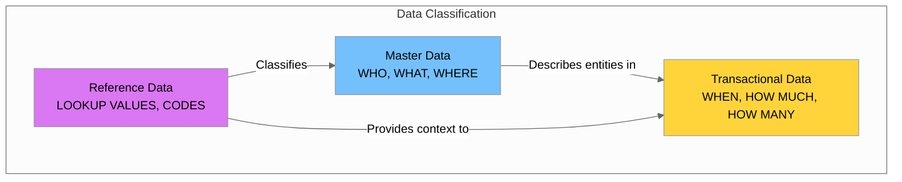

### Master Data

**Definition**: Core business entities that are shared across multiple systems and business processes. Master data answers the questions: **WHO**, **WHAT**, and **WHERE**.

**Characteristics**:
- Relatively static (changes infrequently)
- High business value
- Shared across multiple systems
- Requires governance and stewardship

**Examples from NYC Taxi Dataset**:

| Master Data Entity | Example | Fields |
|-------------------|---------|--------|
| **Taxi Zones** | Zone ID 138 = LaGuardia Airport | LocationID, Borough, Zone, service_zone |
| **Vendors** | VendorID 2 = Curb Mobility, LLC | VendorID, VendorName, ContactInfo |
| **Rate Codes** | RatecodeID 1 = Standard Rate | RatecodeID, Description, BaseRate |

> **What is TPEP?** TPEP stands for **Taxicab Passenger Enhancement Program**. It refers to the technology systems installed in NYC taxis that capture trip data, process payments, and display passenger information. VendorID in the dataset refers to the TPEP technology provider that recorded the trip.
>
> **Note on VendorID 2:** The company originally known as VeriFone Inc. (which you may see in older documentation) has rebranded to **Curb Mobility, LLC**. Both names refer to the same TPEP provider.

```python
# Example: Taxi Zone Master Data
taxi_zone_master = {
    "LocationID": 138,
    "Borough": "Queens",
    "Zone": "LaGuardia Airport",
    "service_zone": "Airports",
    "created_date": "2015-01-01",
    "last_modified": "2024-01-15",
    "is_active": True
}
```

### Transactional Data

**Definition**: Data that records business events or transactions. Transactional data answers: **WHEN**, **HOW MUCH**, and **HOW MANY**.

**Characteristics**:
- High volume
- Time-stamped
- References master data
- Immutable once created (generally)

**Examples from NYC Taxi Dataset**:

```python
# Example: Trip Transaction Record
trip_transaction = {
    "VendorID": 2,                          # References Vendor Master
    "tpep_pickup_datetime": "2025-08-01 00:52:23",
    "tpep_dropoff_datetime": "2025-08-01 01:12:20",
    "passenger_count": 1,
    "trip_distance": 8.44,
    "RatecodeID": 1,                         # References Rate Code Master
    "PULocationID": 138,                     # References Zone Master (LaGuardia)
    "DOLocationID": 141,                     # References Zone Master (Lenox Hill West)
    "payment_type": 1,                       # References Payment Type Reference
    "fare_amount": 33.80,
    "total_amount": 57.49
}
```

### Reference Data

**Definition**: Data used to categorize or classify other data. Reference data provides standardized lookup values.

**Characteristics**:
- Small volume
- Rarely changes
- Used for validation and classification
- Often industry-standard or regulatory

**Examples from NYC Taxi Dataset**:

| Reference Data | Code | Description |
|---------------|------|-------------|
| **Payment Type** | 1 | Credit Card |
| **Payment Type** | 2 | Cash |
| **Payment Type** | 3 | No Charge |
| **Payment Type** | 4 | Dispute |
| **Rate Code** | 1 | Standard Rate |
| **Rate Code** | 2 | JFK |
| **Rate Code** | 3 | Newark |
| **Service Zone** | Yellow Zone | Manhattan Core |
| **Service Zone** | Boro Zone | Outer Boroughs |
| **Service Zone** | Airports | JFK, LaGuardia, Newark |

### How Clickstream/Engagement Data Fits In

**Clickstream and engagement data is primarily transactional behavioral data** that captures user interactions over time.

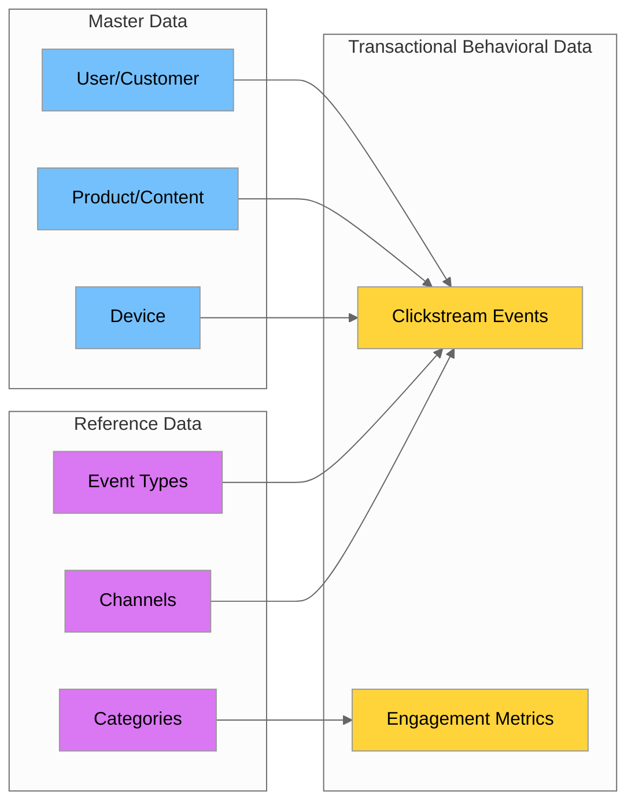

**Clickstream Data Example**:

```python
# Clickstream event (Transactional Behavioral Data)
clickstream_event = {
    "event_id": "evt_12345",
    "timestamp": "2025-08-01T10:30:45Z",
    "user_id": "usr_789",           # References User Master
    "session_id": "sess_456",
    "page_url": "/products/shoes",
    "product_id": "prod_123",       # References Product Master
    "event_type": "page_view",      # References Event Type Reference
    "device_id": "dev_001",         # References Device Master
    "channel": "mobile_app",        # References Channel Reference
    "duration_seconds": 45
}
```

### Comparison Table

| Aspect | Master Data | Transactional Data | Reference Data |
|--------|-------------|-------------------|----------------|
| **Volume** | Low to Medium | Very High | Very Low |
| **Change Frequency** | Low | Continuous | Rare |
| **Examples** | Customers, Products, Locations | Orders, Trips, Clicks | Status Codes, Countries |
| **Lifecycle** | Long-lived | Event-based | Permanent |
| **Governance Need** | High | Medium | Medium |
| **NYC Taxi Example** | Taxi Zones, Vendors | Trip Records | Payment Types, Rate Codes |

---

## 3. MDM and Data Warehouse Relationship

### How MDM Complements Data Warehousing

MDM and Data Warehousing are complementary disciplines that work together to provide trusted, consistent data for analytics and reporting.

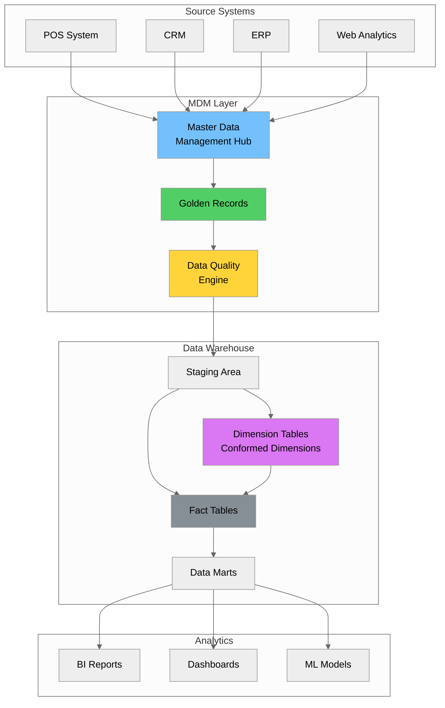

### MDM as the Foundation for Dimension Tables

In a data warehouse, **dimension tables** contain the descriptive attributes used to analyze facts. MDM provides the **authoritative source** for these dimensions.

**Without MDM**:
- Dimension tables may have inconsistent data
- Same entity might appear multiple times with variations
- No clear ownership or governance

**With MDM**:
- Dimension tables are populated from golden records
- Consistent, deduplicated entities
- Clear data lineage and governance

### Conformed Dimensions and Master Data

**Conformed dimensions** are dimensions that have the same meaning across all fact tables and data marts. MDM ensures conformity by:

1. **Standardizing attributes** across all source systems
2. **Resolving duplicates** to create single golden records
3. **Maintaining referential integrity** across the enterprise
4. **Versioning changes** for historical accuracy

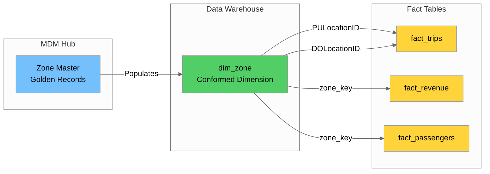

### NYC Taxi Example: Zone Dimension

```sql
-- MDM Golden Record becomes the Dimension Table
CREATE TABLE dim_zone (
    zone_key SERIAL PRIMARY KEY,           -- Surrogate key
    location_id INT NOT NULL,              -- Natural key from MDM
    borough VARCHAR(50),
    zone_name VARCHAR(100),
    service_zone VARCHAR(50),
    
    -- MDM Metadata
    mdm_source_system VARCHAR(50),
    mdm_golden_record_id VARCHAR(100),
    mdm_last_updated TIMESTAMP,
    
    -- SCD Type 2 columns
    effective_date DATE,
    expiration_date DATE,
    is_current BOOLEAN DEFAULT TRUE
);

-- Sample data from MDM
INSERT INTO dim_zone (location_id, borough, zone_name, service_zone, 
                      mdm_source_system, mdm_golden_record_id, mdm_last_updated,
                      effective_date, is_current)
VALUES 
    (138, 'Queens', 'LaGuardia Airport', 'Airports', 
     'TLC_MASTER', 'GR_ZONE_138', '2024-01-15', '2015-01-01', TRUE),
    (132, 'Queens', 'JFK Airport', 'Airports',
     'TLC_MASTER', 'GR_ZONE_132', '2024-01-15', '2015-01-01', TRUE);
```

### Where MDM Fits in the Data Architecture

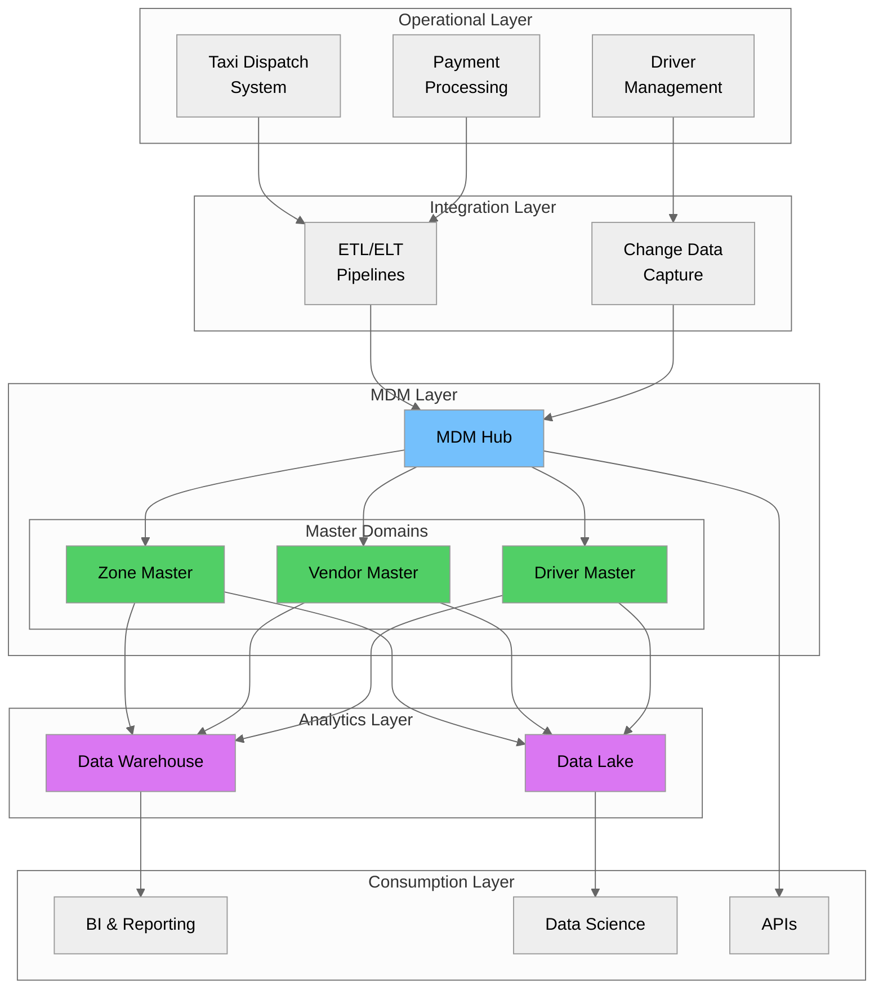

---

## 4. Master Data Domains

### Common Master Data Domains

Master data is typically organized into **domains**—logical groupings of related master data entities.

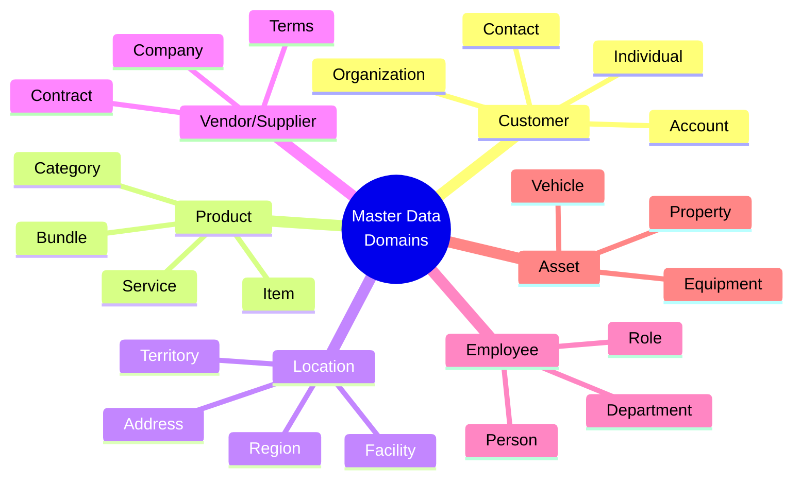

### Domain Deep Dive with NYC Taxi Examples

#### 1. Location Domain (Taxi Zones)

The taxi zone lookup represents a **Location Master** with 265 distinct zones.

```python
import pandas as pd

# Load the taxi zone master data
zones_df = pd.read_csv('data/taxi_zone_lookup.csv')

# Analyze the location domain
print("=== Location Domain Analysis ===")
print(f"Total Zones: {len(zones_df)}")
print(f"\nBoroughs: {zones_df['Borough'].unique()}")
print(f"\nService Zones: {zones_df['service_zone'].unique()}")
print(f"\nZones per Borough:")
print(zones_df.groupby('Borough').size())
```

**Output**:
```
=== Location Domain Analysis ===
Total Zones: 265

Boroughs: ['EWR' 'Queens' 'Bronx' 'Manhattan' 'Staten Island' 'Brooklyn' 'Unknown' 'N/A']

Service Zones: ['EWR' 'Boro Zone' 'Yellow Zone' 'Airports' 'N/A']

Zones per Borough:
Borough
Bronx            43
Brooklyn         41
EWR               1
Manhattan        69
N/A               1
Queens           69
Staten Island    20
Unknown           1
```

#### 2. Vendor Domain

> **What is CDC (Change Data Capture)?** CDC is a design pattern that identifies and captures changes made to data in a database, then delivers those changes in real-time to downstream systems. Instead of reprocessing entire datasets, CDC only processes the records that have changed (inserts, updates, deletes), making data pipelines more efficient.

```python
# Vendor Master Data for NYC Taxi
# Note: VendorID 2 was originally VeriFone Inc., now rebranded as Curb Mobility, LLC
vendor_master = pd.DataFrame({
    'VendorID': [1, 2, 6, 7],
    'VendorName': ['Creative Mobile Technologies, LLC', 'Curb Mobility, LLC', 'Myle Technologies', 'Helix'],
    'VendorType': ['TPEP Provider', 'TPEP Provider', 'TPEP Provider', 'TPEP Provider'],
    'ContractStatus': ['Active', 'Active', 'Active', 'Active'],
    'ContactEmail': ['support@cmt.com', 'support@gocurb.com', 'support@myle.com', None],
    'DataQualityScore': [0.95, 0.98, 0.90, 0.85]
})

print("=== Vendor Domain ===")
print(vendor_master.to_string(index=False))
```

#### 3. Rate Code Domain (Reference Data)

```python
# Rate Code Reference Data
rate_codes = pd.DataFrame({
    'RatecodeID': [1, 2, 3, 4, 5, 6, 99],
    'Description': [
        'Standard rate',
        'JFK',
        'Newark',
        'Nassau or Westchester',
        'Negotiated fare',
        'Group ride',
        'Unknown'
    ],
    'FlatRate': [False, True, True, False, True, False, False],
    'BaseAmount': [None, 70.00, 100.00, None, None, None, None]
})

print("=== Rate Code Reference Data ===")
print(rate_codes.to_string(index=False))
```

#### 4. Payment Type Domain (Reference Data)

```python
# Payment Type Reference Data
payment_types = pd.DataFrame({
    'PaymentTypeID': [1, 2, 3, 4, 5, 6],
    'Description': [
        'Credit card',
        'Cash',
        'No charge',
        'Dispute',
        'Unknown',
        'Voided trip'
    ],
    'IsElectronic': [True, False, False, False, False, False],
    'RequiresReceipt': [True, True, False, True, False, False]
})

print("=== Payment Type Reference Data ===")
print(payment_types.to_string(index=False))
```

### Industry Examples Beyond Taxi Data

| Domain | Retail Example | Healthcare Example | Financial Services |
|--------|---------------|-------------------|-------------------|
| **Customer** | Shopper profiles, loyalty members | Patients, members | Account holders, beneficiaries |
| **Product** | SKUs, categories, brands | Medications, procedures | Financial products, funds |
| **Location** | Stores, warehouses, regions | Facilities, clinics | Branches, ATMs |
| **Vendor** | Suppliers, manufacturers | Pharmaceutical companies | Counterparties, brokers |
| **Employee** | Staff, managers | Physicians, nurses | Advisors, analysts |

---

## 5. Golden Records & Data Consolidation

### What is a Golden Record?

A **Golden Record** (also called a "best version of truth" or "master record") is the single, authoritative version of a data entity that represents the most accurate, complete, and up-to-date information consolidated from multiple sources.

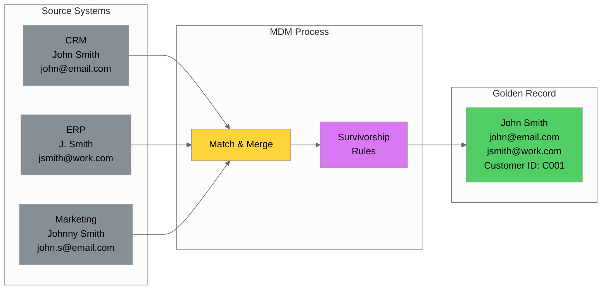

### Survivorship Rules

**Survivorship rules** determine which attribute values from source records should be used in the golden record.

| Rule Type | Description | Example |
|-----------|-------------|---------|
| **Most Recent** | Use the most recently updated value | Last modified timestamp wins |
| **Most Frequent** | Use the value that appears most often | If 3 sources say "NYC" and 1 says "New York", use "NYC" |
| **Source Priority** | Prefer values from trusted sources | CRM > ERP > Marketing |
| **Most Complete** | Use the most complete/longest value | "LaGuardia Airport" > "LGA" |
| **Aggregation** | Combine values from multiple sources | Merge all email addresses |
| **Custom Logic** | Business-specific rules | Use billing address from ERP, shipping from CRM |

### Golden Record Example: Taxi Zone

```python
# Simulating multiple source records for the same zone
source_records = [
    {
        'source': 'TLC_Database',
        'LocationID': 138,
        'Zone': 'LaGuardia Airport',
        'Borough': 'Queens',
        'service_zone': 'Airports',
        'last_updated': '2024-01-15',
        'data_quality_score': 0.95
    },
    {
        'source': 'City_Planning',
        'LocationID': 138,
        'Zone': 'LGA Airport',
        'Borough': 'Queens',
        'service_zone': 'Airport Zone',
        'last_updated': '2023-06-01',
        'data_quality_score': 0.85
    },
    {
        'source': 'Transportation_Dept',
        'LocationID': 138,
        'Zone': 'LaGuardia',
        'Borough': 'Queens County',
        'service_zone': 'Airports',
        'last_updated': '2024-02-01',
        'data_quality_score': 0.90
    }
]

def create_golden_record(records):
    """Apply survivorship rules to create golden record"""
    
    # Rule 1: LocationID - use most frequent (should be same)
    location_id = max(set(r['LocationID'] for r in records), 
                      key=lambda x: sum(1 for r in records if r['LocationID'] == x))
    
    # Rule 2: Zone name - use most complete (longest)
    zone = max((r['Zone'] for r in records), key=len)
    
    # Rule 3: Borough - use from highest quality source
    best_source = max(records, key=lambda r: r['data_quality_score'])
    borough = best_source['Borough']
    
    # Rule 4: service_zone - use most frequent
    service_zones = [r['service_zone'] for r in records]
    service_zone = max(set(service_zones), key=service_zones.count)
    
    # Rule 5: last_updated - use most recent
    last_updated = max(r['last_updated'] for r in records)
    
    return {
        'golden_record_id': f'GR_ZONE_{location_id}',
        'LocationID': location_id,
        'Zone': zone,
        'Borough': borough,
        'service_zone': service_zone,
        'last_updated': last_updated,
        'source_count': len(records),
        'sources': [r['source'] for r in records]
    }

golden_record = create_golden_record(source_records)
print("=== Golden Record ===")
for key, value in golden_record.items():
    print(f"{key}: {value}")
```

**Output**:
```
=== Golden Record ===
golden_record_id: GR_ZONE_138
LocationID: 138
Zone: LaGuardia Airport
Borough: Queens
service_zone: Airports
last_updated: 2024-02-01
source_count: 3
sources: ['TLC_Database', 'City_Planning', 'Transportation_Dept']
```

---

## 6. Data Quality Dimensions

### The Six Core Data Quality Dimensions

Data quality is fundamental to MDM success. The six core dimensions provide a framework for measuring and improving data quality.

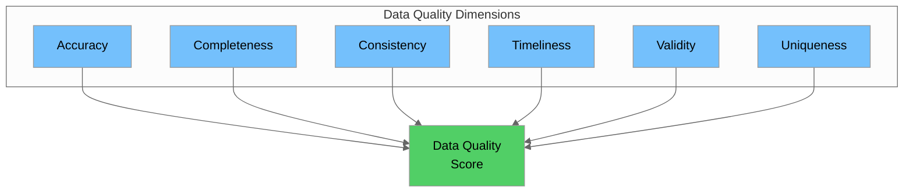

### Dimension Details with NYC Taxi Examples

#### 1. Accuracy
**Definition**: The degree to which data correctly represents the real-world entity.

```python
import pandas as pd
import pyarrow.parquet as pq

# Load trip data
trips = pq.read_table('data/yellow_tripdata_2025-08.parquet').to_pandas()
zones = pd.read_csv('data/taxi_zone_lookup.csv')

# Check accuracy: Are all LocationIDs valid?
valid_location_ids = set(zones['LocationID'])
invalid_pickups = trips[~trips['PULocationID'].isin(valid_location_ids)]
invalid_dropoffs = trips[~trips['DOLocationID'].isin(valid_location_ids)]

accuracy_score = 1 - (len(invalid_pickups) + len(invalid_dropoffs)) / (2 * len(trips))
print(f"Location ID Accuracy Score: {accuracy_score:.2%}")
```

#### 2. Completeness
**Definition**: The degree to which all required data is present.

```python
# Check completeness of zone master data
zones = pd.read_csv('data/taxi_zone_lookup.csv')

completeness_scores = {}
for column in zones.columns:
    non_null = zones[column].notna().sum()
    total = len(zones)
    completeness_scores[column] = non_null / total

print("=== Completeness Scores ===")
for col, score in completeness_scores.items():
    print(f"{col}: {score:.2%}")
```

#### 3. Consistency
**Definition**: The degree to which data is uniform across systems and datasets.

```python
# Check consistency: Borough names should be standardized
zones = pd.read_csv('data/taxi_zone_lookup.csv')

# Check for inconsistent borough naming
borough_variations = zones.groupby('Borough').size()
print("=== Borough Consistency Check ===")
print(borough_variations)

# Identify potential inconsistencies
suspicious_boroughs = [b for b in zones['Borough'].unique() 
                       if b not in ['Manhattan', 'Brooklyn', 'Queens', 'Bronx', 'Staten Island']]
print(f"\nPotential inconsistencies: {suspicious_boroughs}")
```

#### 4. Timeliness
**Definition**: The degree to which data is up-to-date for the task at hand.

```python
from datetime import datetime

# Check timeliness of trip data
trips = pq.read_table('data/yellow_tripdata_2025-08.parquet').to_pandas()

# Calculate data freshness
latest_trip = trips['tpep_pickup_datetime'].max()
data_age = datetime.now() - pd.to_datetime(latest_trip)

print(f"=== Timeliness Check ===")
print(f"Latest trip: {latest_trip}")
print(f"Data age: {data_age.days} days")
```

#### 5. Validity
**Definition**: The degree to which data conforms to defined business rules and formats.

```python
# Check validity of trip data
trips = pq.read_table('data/yellow_tripdata_2025-08.parquet').to_pandas()

validity_checks = {
    'passenger_count_valid': (trips['passenger_count'] >= 0) & (trips['passenger_count'] <= 9),
    'trip_distance_valid': trips['trip_distance'] >= 0,
    'fare_amount_valid': trips['fare_amount'] >= 0,
    'payment_type_valid': trips['payment_type'].isin([1, 2, 3, 4, 5, 6]),
    'rate_code_valid': trips['RatecodeID'].isin([1, 2, 3, 4, 5, 6, 99])
}

print("=== Validity Scores ===")
for check, result in validity_checks.items():
    score = result.sum() / len(trips)
    print(f"{check}: {score:.2%}")
```

#### 6. Uniqueness
**Definition**: The degree to which there are no duplicate records.

```python
# Check uniqueness in zone master data
zones = pd.read_csv('data/taxi_zone_lookup.csv')

# Check for duplicate LocationIDs
duplicate_ids = zones[zones.duplicated(subset=['LocationID'], keep=False)]
uniqueness_score = 1 - len(duplicate_ids) / len(zones)

print(f"=== Uniqueness Check ===")
print(f"Total zones: {len(zones)}")
print(f"Duplicate LocationIDs: {len(duplicate_ids)}")
print(f"Uniqueness score: {uniqueness_score:.2%}")
```

---

## 7. MDM Implementation Styles

### Four MDM Implementation Approaches

Organizations can implement MDM using different architectural styles, each with its own trade-offs.

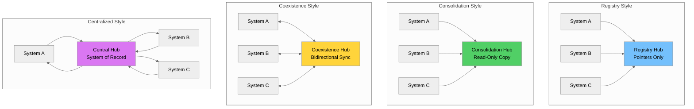

### Comparison Table

| Aspect | Registry | Consolidation | Coexistence | Centralized |
|--------|----------|---------------|-------------|-------------|
| **Data Storage** | Pointers only | Read-only copy | Synchronized copy | Single source |
| **Data Ownership** | Source systems | Source systems | Shared | MDM hub |
| **Implementation Complexity** | Low | Medium | High | Very High |
| **Data Latency** | Real-time | Batch | Near real-time | Real-time |
| **Change Impact** | Minimal | Low | Medium | High |
| **Best For** | Quick wins, reporting | Analytics, BI | Enterprise-wide | New implementations |
| **Cost** | $ | $$ | $$$ | $$$$ |

---

## 8. MDM Architecture Components

### Core MDM Architecture

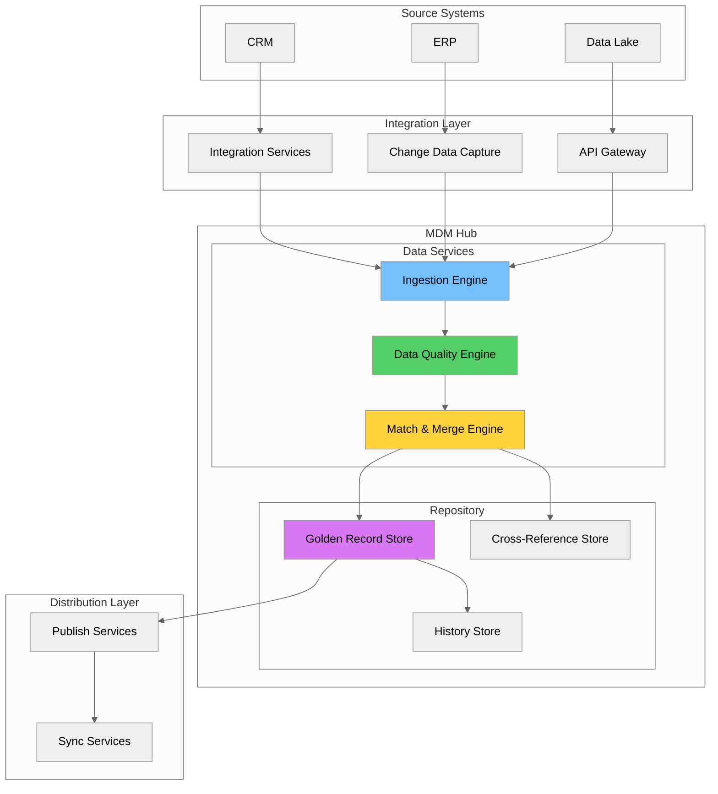

### Component Descriptions

| Component | Purpose | NYC Taxi Example |
|-----------|---------|------------------|
| **Ingestion Engine** | Receives data from source systems | Ingests zone updates from TLC |
| **Data Quality Engine** | Validates and cleanses data | Checks borough names, zone formats |
| **Match & Merge Engine** | Identifies duplicates, creates golden records | Matches zones across systems |
| **Golden Record Store** | Stores authoritative master records | 265 taxi zone golden records |
| **Cross-Reference Store** | Maps source IDs to golden record IDs | TLC_ID → GR_ZONE_ID mapping |
| **History Store** | Tracks all changes over time | Zone name changes, boundary updates |

### Repository Schema Example

```sql
-- Golden Record Store
CREATE TABLE mdm_golden_records (
    golden_record_id VARCHAR(50) PRIMARY KEY,
    entity_type VARCHAR(50) NOT NULL,
    created_at TIMESTAMP DEFAULT CURRENT_TIMESTAMP,
    updated_at TIMESTAMP DEFAULT CURRENT_TIMESTAMP,
    status VARCHAR(20) DEFAULT 'ACTIVE',
    version INT DEFAULT 1,
    data_quality_score DECIMAL(5,4)
);

-- Cross-Reference Store
CREATE TABLE mdm_cross_references (
    xref_id SERIAL PRIMARY KEY,
    golden_record_id VARCHAR(50) REFERENCES mdm_golden_records(golden_record_id),
    source_system VARCHAR(50) NOT NULL,
    source_id VARCHAR(100) NOT NULL,
    match_confidence DECIMAL(5,4),
    UNIQUE(source_system, source_id)
);

-- History Store (SCD Type 2)
CREATE TABLE mdm_golden_record_history (
    history_id SERIAL PRIMARY KEY,
    golden_record_id VARCHAR(50),
    attribute_name VARCHAR(100),
    old_value TEXT,
    new_value TEXT,
    changed_at TIMESTAMP DEFAULT CURRENT_TIMESTAMP,
    changed_by VARCHAR(100)
);
```

---

## 9. Data Stewardship & Governance

### Data Governance Framework

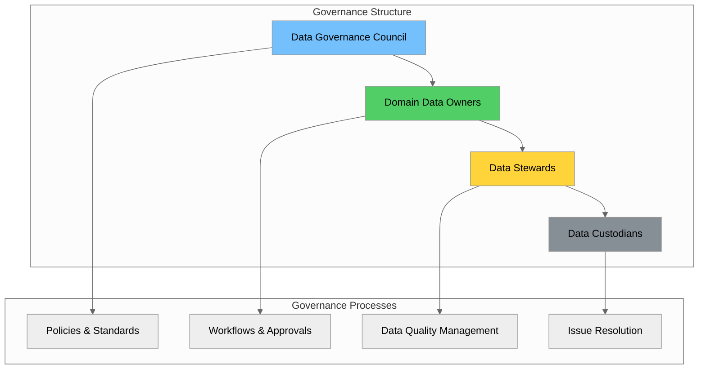

### Roles and Responsibilities

| Role | Responsibilities | NYC Taxi Example |
|------|-----------------|------------------|
| **Data Governance Council** | Strategic direction, policy approval | TLC Commissioner's Office |
| **Domain Data Owner** | Business accountability for data domain | Director of Taxi Operations |
| **Data Steward** | Day-to-day data quality, resolve issues | Zone Data Manager |
| **Data Custodian** | Technical implementation, access control | Database Administrator |

### Stewardship Workflow

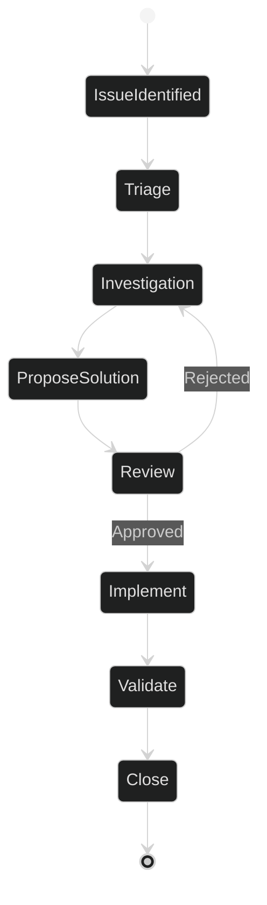

---

## 10. Match and Merge Strategies

### Matching Approaches

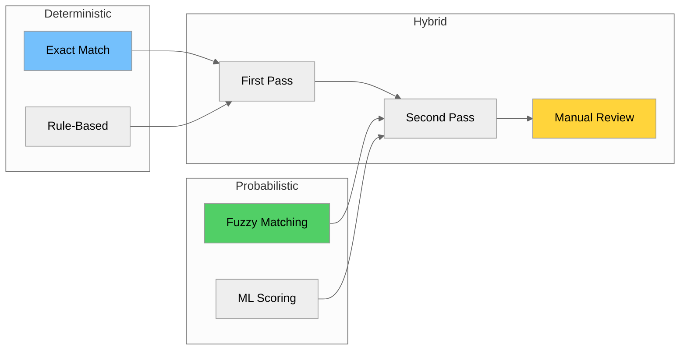

### Deterministic vs Probabilistic Matching

| Aspect | Deterministic | Probabilistic |
|--------|--------------|---------------|
| **Approach** | Exact rules, binary outcome | Statistical scoring |
| **Speed** | Very fast | Slower |
| **Accuracy** | High precision, lower recall | Balanced |
| **Best For** | Clean data, unique IDs | Messy data |

### Matching Implementation

```python
from difflib import SequenceMatcher

class MatchingEngine:
    def __init__(self, threshold: float = 0.85):
        self.threshold = threshold
    
    def fuzzy_match(self, val1: str, val2: str) -> float:
        """Fuzzy string matching"""
        if val1 is None or val2 is None:
            return 0.0
        return SequenceMatcher(None,
                               str(val1).lower(),
                               str(val2).lower()).ratio()
    
    def find_duplicates(self, records, key_field: str):
        """Find potential duplicate records"""
        duplicates = []
        n = len(records)
        
        for i in range(n):
            for j in range(i + 1, n):
                score = self.fuzzy_match(
                    records[i].get(key_field),
                    records[j].get(key_field)
                )
                if score >= self.threshold:
                    duplicates.append({
                        'record1': records[i],
                        'record2': records[j],
                        'similarity': score
                    })
        return duplicates

# Example usage
zones = [
    {'LocationID': 56, 'Zone': 'Corona'},
    {'LocationID': 57, 'Zone': 'Corona'},
    {'LocationID': 138, 'Zone': 'LaGuardia Airport'},
    {'LocationID': 139, 'Zone': 'La Guardia'}
]

engine = MatchingEngine(threshold=0.8)
duplicates = engine.find_duplicates(zones, 'Zone')
for dup in duplicates:
    print(f"Match: {dup['record1']['Zone']} ↔ {dup['record2']['Zone']} ({dup['similarity']:.0%})")
```

---

## 11. Data Lineage & Audit Trails

### What is Data Lineage?

**Data lineage** tracks the origin, movement, and transformation of data throughout its lifecycle.

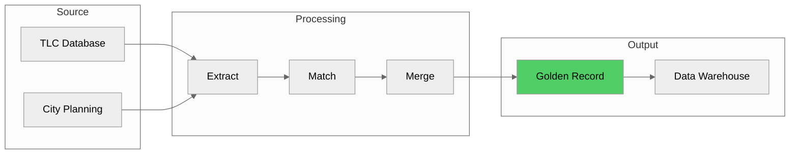

### Audit Trail Implementation

```python
from datetime import datetime
from typing import Any, List, Dict

class AuditTrail:
    def __init__(self):
        self.entries = []
    
    def log_change(self, entity_id: str, action: str,
                   old_value: Any, new_value: Any, user: str):
        """Log a change to the audit trail"""
        entry = {
            'audit_id': f"AUD-{len(self.entries) + 1:08d}",
            'timestamp': datetime.now().isoformat(),
            'entity_id': entity_id,
            'action': action,
            'old_value': old_value,
            'new_value': new_value,
            'user': user
        }
        self.entries.append(entry)
        return entry['audit_id']
    
    def get_history(self, entity_id: str) -> List[Dict]:
        """Get complete history for an entity"""
        return [e for e in self.entries if e['entity_id'] == entity_id]

# Example
audit = AuditTrail()
audit.log_change('GR_ZONE_138', 'UPDATE',
                 {'Zone': 'LGA'}, {'Zone': 'LaGuardia Airport'},
                 'zone_steward')
```

### Lineage SQL Schema

```sql
CREATE TABLE mdm_data_lineage (
    lineage_id SERIAL PRIMARY KEY,
    golden_record_id VARCHAR(50),
    source_system VARCHAR(50),
    source_table VARCHAR(100),
    source_column VARCHAR(100),
    transformation VARCHAR(255),
    created_at TIMESTAMP DEFAULT CURRENT_TIMESTAMP
);
```

---

## 12. Hands-on Labs

### Lab 1: Identify Master Data Entities

**Objective**: Analyze the NYC Taxi dataset to identify and classify data entities.

```python
import pandas as pd
import pyarrow.parquet as pq

# Load datasets
zones = pd.read_csv('data/taxi_zone_lookup.csv')
trips = pq.read_table('data/yellow_tripdata_2025-08.parquet').to_pandas()

print("=" * 50)
print("LAB 1: IDENTIFY MASTER DATA ENTITIES")
print("=" * 50)

# Analyze Zone Master Data
print(f"\n1. ZONE MASTER: {len(zones)} records")
print(f"   Columns: {list(zones.columns)}")

# Identify Reference Data
print(f"\n2. REFERENCE DATA:")
print(f"   - VendorIDs: {sorted(trips['VendorID'].unique())}")
print(f"   - RateCodes: {sorted(trips['RatecodeID'].dropna().unique())}")
print(f"   - PaymentTypes: {sorted(trips['payment_type'].unique())}")

# Transactional Data
print(f"\n3. TRANSACTIONAL DATA:")
print(f"   - Trip Records: {len(trips):,}")
```

### Lab 2: Duplicate Zone Detection

**Objective**: Build a matching algorithm to detect potential duplicate zones.

```python
from difflib import SequenceMatcher
import pandas as pd

zones = pd.read_csv('data/taxi_zone_lookup.csv')

def find_similar_zones(df, threshold=0.8):
    """Find zones with similar names"""
    duplicates = []
    zone_list = df['Zone'].tolist()
    id_list = df['LocationID'].tolist()
    
    for i in range(len(zone_list)):
        for j in range(i + 1, len(zone_list)):
            similarity = SequenceMatcher(
                None,
                zone_list[i].lower(),
                zone_list[j].lower()
            ).ratio()
            
            if similarity >= threshold:
                duplicates.append({
                    'id1': id_list[i], 'zone1': zone_list[i],
                    'id2': id_list[j], 'zone2': zone_list[j],
                    'similarity': similarity
                })
    return duplicates

print("=" * 50)
print("LAB 2: DUPLICATE DETECTION")
print("=" * 50)

duplicates = find_similar_zones(zones, threshold=0.85)
print(f"\nFound {len(duplicates)} potential duplicates:")
for d in duplicates[:5]:
    print(f"  {d['zone1']} (ID:{d['id1']}) ↔ {d['zone2']} (ID:{d['id2']}) - {d['similarity']:.0%}")
```

### Lab 3: Golden Record Strategy

**Objective**: Create golden records from multiple source systems.

```python
from datetime import datetime

# Simulate multiple sources
source_tlc = [
    {'LocationID': 138, 'Zone': 'LaGuardia Airport', 'Borough': 'Queens',
     'source': 'TLC', 'quality': 0.95},
]
source_planning = [
    {'LocationID': 138, 'Zone': 'LGA', 'Borough': 'Queens',
     'source': 'PLANNING', 'quality': 0.80},
]

def create_golden_record(records):
    """Apply survivorship rules"""
    # Use longest zone name
    zone = max([r['Zone'] for r in records], key=len)
    # Use highest quality source for borough
    best = max(records, key=lambda r: r['quality'])
    
    return {
        'golden_id': f"GR_ZONE_{records[0]['LocationID']}",
        'LocationID': records[0]['LocationID'],
        'Zone': zone,
        'Borough': best['Borough'],
        'sources': [r['source'] for r in records],
        'created_at': datetime.now().isoformat()
    }

print("=" * 50)
print("LAB 3: GOLDEN RECORD CREATION")
print("=" * 50)

all_records = source_tlc + source_planning
golden = create_golden_record(all_records)
print("\nGolden Record:")
for k, v in golden.items():
    print(f"  {k}: {v}")
```

### Lab 4: Master Data Tables in PostgreSQL

**Objective**: Design and create master data tables.

```sql
-- Create MDM Schema
CREATE SCHEMA IF NOT EXISTS mdm;

-- Zone Master Table
CREATE TABLE mdm.zone_master (
    zone_key SERIAL PRIMARY KEY,
    location_id INT NOT NULL UNIQUE,
    zone_name VARCHAR(100) NOT NULL,
    borough VARCHAR(50) NOT NULL,
    service_zone VARCHAR(50),
    golden_record_id VARCHAR(50) UNIQUE,
    data_quality_score DECIMAL(5,4),
    created_at TIMESTAMP DEFAULT CURRENT_TIMESTAMP,
    updated_at TIMESTAMP DEFAULT CURRENT_TIMESTAMP,
    is_active BOOLEAN DEFAULT TRUE
);

-- Vendor Master Table
CREATE TABLE mdm.vendor_master (
    vendor_key SERIAL PRIMARY KEY,
    vendor_id INT NOT NULL UNIQUE,
    vendor_name VARCHAR(100) NOT NULL,
    vendor_type VARCHAR(50),
    is_active BOOLEAN DEFAULT TRUE
);

-- Rate Code Reference Table
CREATE TABLE mdm.rate_code_ref (
    rate_code_id INT PRIMARY KEY,
    description VARCHAR(100) NOT NULL,
    is_flat_rate BOOLEAN DEFAULT FALSE,
    base_amount DECIMAL(10,2)
);

-- Payment Type Reference Table
CREATE TABLE mdm.payment_type_ref (
    payment_type_id INT PRIMARY KEY,
    description VARCHAR(100) NOT NULL,
    is_electronic BOOLEAN DEFAULT FALSE
);

-- Insert sample data
INSERT INTO mdm.zone_master (location_id, zone_name, borough, service_zone, golden_record_id)
VALUES
    (138, 'LaGuardia Airport', 'Queens', 'Airports', 'GR_ZONE_138'),
    (132, 'JFK Airport', 'Queens', 'Airports', 'GR_ZONE_132');

INSERT INTO mdm.vendor_master (vendor_id, vendor_name, vendor_type)
VALUES
    (1, 'Creative Mobile Technologies, LLC', 'TPEP Provider'),
    (2, 'Curb Mobility, LLC', 'TPEP Provider'),
    (6, 'Myle Technologies', 'TPEP Provider'),
    (7, 'Helix', 'TPEP Provider');

INSERT INTO mdm.rate_code_ref (rate_code_id, description, is_flat_rate, base_amount)
VALUES
    (1, 'Standard rate', FALSE, NULL),
    (2, 'JFK', TRUE, 70.00),
    (3, 'Newark', TRUE, 100.00);
```

---

## 13. Summary & Key Takeaways

### Key Concepts Learned

| Concept | Description |
|---------|-------------|
| **Master Data** | Core business entities (WHO, WHAT, WHERE) shared across systems |
| **Reference Data** | Lookup values and codes used to classify data |
| **Transactional Data** | Business events that reference master data |
| **Golden Record** | Single authoritative version of a master data entity |
| **Survivorship Rules** | Logic to determine winning values in golden records |
| **Data Quality Dimensions** | Accuracy, Completeness, Consistency, Timeliness, Validity, Uniqueness |

### MDM Implementation Checklist

- [ ] Identify master data domains (Customer, Product, Location, Vendor)
- [ ] Classify data types (Master, Reference, Transactional)
- [ ] Define data quality rules and metrics
- [ ] Design golden record schema
- [ ] Establish survivorship rules
- [ ] Implement match and merge logic
- [ ] Set up data governance structure
- [ ] Create audit trail and lineage tracking
- [ ] Build integration with data warehouse

### NYC Taxi Dataset MDM Summary

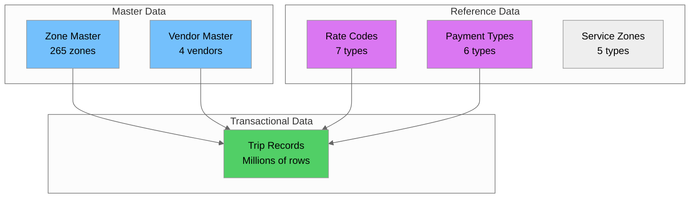

---

## 14. Additional Resources

### Books
- *Master Data Management* by David Loshin
- *The Data Warehouse Toolkit* by Ralph Kimball
- *Data Quality: The Accuracy Dimension* by Jack Olson

### Online Resources
- [DAMA International](https://www.dama.org/) - Data Management Body of Knowledge
- [MDM Institute](https://www.mdm-institute.com/) - MDM best practices
- [AWS Data Lake](https://aws.amazon.com/big-data/datalakes-and-analytics/) - Cloud MDM patterns

### Tools & Platforms
| Category | Tools |
|----------|-------|
| **Enterprise MDM** | Informatica MDM, IBM InfoSphere, SAP Master Data Governance |
| **Cloud MDM** | AWS Lake Formation, Azure Purview, Google Dataplex |
| **Open Source** | Apache Atlas, Amundsen, DataHub |
| **Data Quality** | Great Expectations, dbt, Soda |

### Next Steps
1. Practice the hands-on labs with the NYC Taxi dataset
2. Explore AWS Glue Data Catalog for cloud-based MDM
3. Learn about data mesh and federated data governance
4. Study dimensional modeling for data warehouse integration

---

*End of Day 4: Master Data Management Fundamentals*