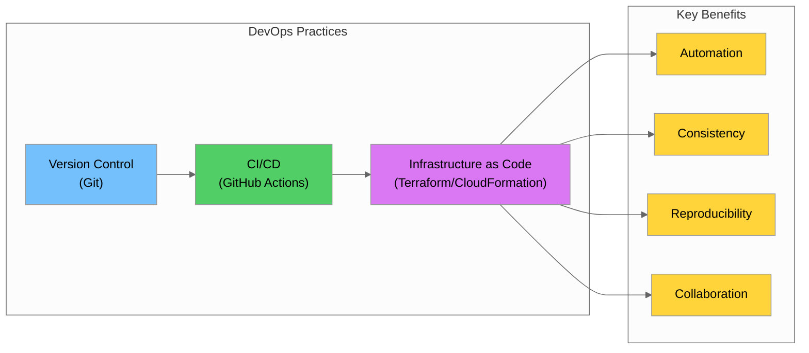
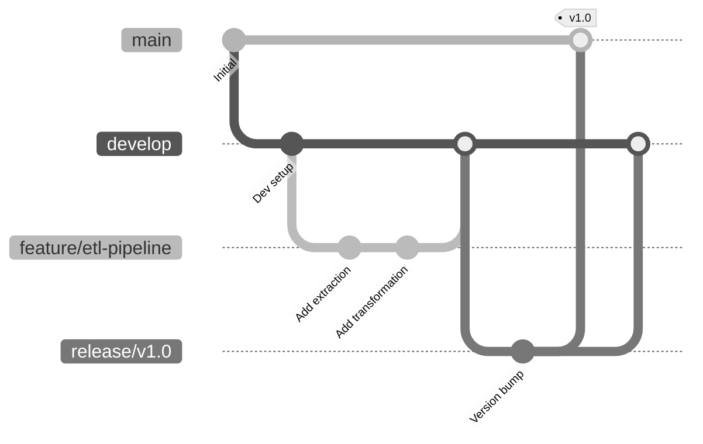
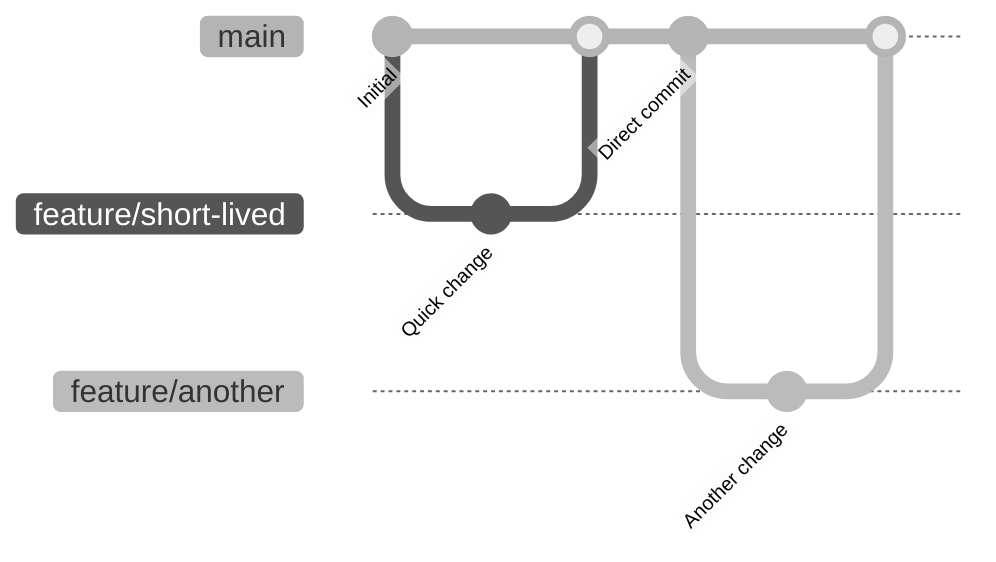
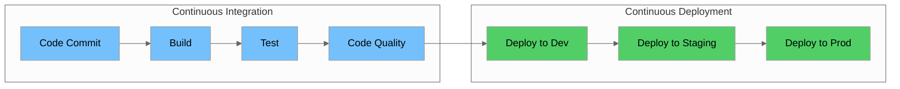
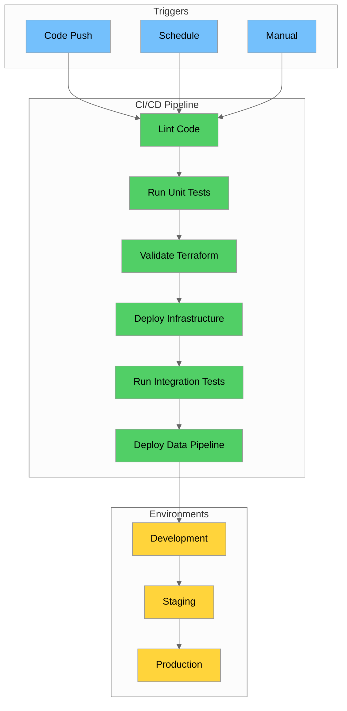
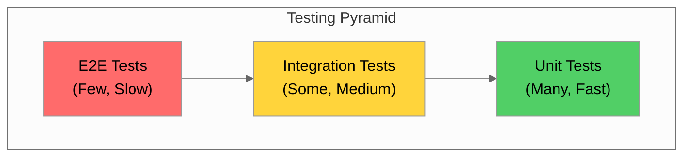
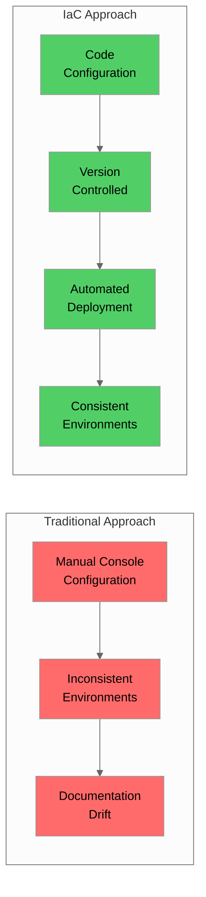
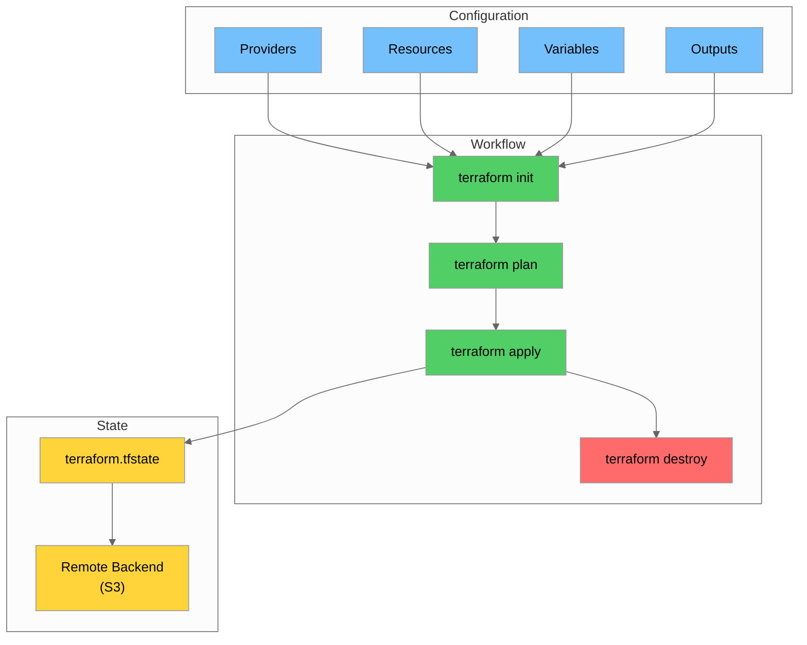
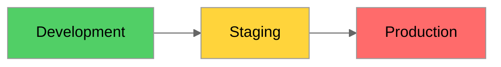
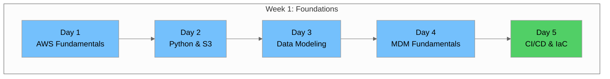

# Day 5: CI/CD & Infrastructure as Code

## Table of Contents

- [Introduction \& Learning Objectives](#introduction--learning-objectives)
- [Part 1: Git Workflows](#part-1-git-workflows)
- [Part 2: CI/CD Concepts](#part-2-cicd-concepts)
- [Part 3: Infrastructure as Code](#part-3-infrastructure-as-code)
- [Part 4: Hands-on Labs](#part-4-hands-on-labs)
- [Week 1 Summary \& Deliverables](#week-1-summary--deliverables)
- [Additional Resources \& References](#additional-resources--references)

---

## Introduction & Learning Objectives

### Overview

Day 5 marks the culmination of Week 1, focusing on **CI/CD (Continuous Integration/Continuous Deployment)** and **Infrastructure as Code (IaC)**. These practices are essential for modern data engineering, enabling teams to automate deployments, maintain consistency across environments, and ensure reproducibility of infrastructure.



### Prerequisites

Before starting Day 5, ensure you have completed:

- ✅ Day 1-4 materials:
  - Day 1: AWS Fundamentals
  - Day 2: Python & Boto3 for S3
  - Day 3: SQL & Data Modeling
  - Day 4: Master Data Management (MDM)
- ✅ AWS Free Tier account with IAM configured
- ✅ GitHub account created
- ✅ Basic understanding of command-line operations
- ✅ S3 buckets and RDS database from previous labs

### Learning Objectives

By the end of Day 5, you will be able to:

1. **Implement Git workflows** with branching strategies, pull requests, and code reviews
2. **Understand CI/CD concepts** and their benefits for data engineering
3. **Create GitHub Actions workflows** for automated data pipeline deployments
4. **Write Terraform configurations** for AWS resources (S3, Lambda, RDS)
5. **Understand CloudFormation** basics and when to use it
6. **Manage multiple environments** (dev/staging/prod) using IaC
7. **Deploy infrastructure** through automated CI/CD pipelines

---

## Part 1: Git Workflows

### 1.1 Git Fundamentals Review

Git is a distributed version control system that tracks changes in source code. For data engineering, Git is essential for:

- Tracking changes to ETL scripts, SQL queries, and configuration files
- Collaborating with team members on data pipelines
- Maintaining history of infrastructure changes
- Enabling rollback capabilities

#### Key Git Concepts

| Concept | Description | Data Engineering Use Case |
|---------|-------------|---------------------------|
| **Repository** | A project's folder containing all files and history | Store ETL code, Terraform configs, SQL scripts |
| **Commit** | A snapshot of changes at a point in time | Track pipeline modifications |
| **Branch** | An independent line of development | Develop new features without affecting production |
| **Merge** | Combining changes from different branches | Integrate tested changes into main codebase |
| **Remote** | A shared repository (e.g., GitHub) | Collaborate and backup code |

#### Essential Git Commands

```bash
# Initialize a new repository
git init

# Clone an existing repository
git clone https://github.com/username/repo.git

# Check status of working directory
git status

# Stage changes for commit
git add <file>           # Stage specific file
git add .                # Stage all changes

# Commit staged changes
git commit -m "Add ETL transformation for taxi data"

# Push changes to remote
git push origin <branch-name>

# Pull latest changes from remote
git pull origin <branch-name>

# View commit history
git log --oneline

# Create and switch to new branch
git checkout -b feature/new-etl-pipeline

# Switch to existing branch
git checkout main

# Merge branch into current branch
git merge feature/new-etl-pipeline
```

### 1.2 Branching Strategies

Choosing the right branching strategy is crucial for team collaboration. Here are the two most common strategies:

#### GitFlow



**GitFlow Branches:**

| Branch | Purpose | Lifetime |
|--------|---------|----------|
| `main` | Production-ready code | Permanent |
| `develop` | Integration branch for features | Permanent |
| `feature/*` | New features or enhancements | Temporary |
| `release/*` | Prepare for production release | Temporary |
| `hotfix/*` | Emergency production fixes | Temporary |

**Best for:** Larger teams, scheduled releases, complex projects

#### Trunk-Based Development



**Characteristics:**
- Single main branch (`main` or `trunk`)
- Short-lived feature branches (< 1 day)
- Frequent integration to main
- Feature flags for incomplete features

**Best for:** Smaller teams, continuous deployment, rapid iteration

#### Recommended Strategy for Data Engineering

For data engineering projects, a **simplified GitFlow** works well:

```
main (production)
  └── develop (integration)
        ├── feature/etl-taxi-data
        ├── feature/terraform-s3
        └── bugfix/data-quality-check
```

### 1.3 Pull Requests & Code Reviews

Pull Requests (PRs) are the gateway for code changes. They enable:

- **Code review** before merging
- **Discussion** about implementation
- **Automated testing** via CI/CD
- **Documentation** of changes

#### Creating an Effective Pull Request

**PR Title Format:**
```
[TYPE] Brief description of change

Examples:
[FEATURE] Add Glue ETL job for taxi data transformation
[BUGFIX] Fix null handling in zone lookup
[INFRA] Add Terraform config for S3 bucket
[DOCS] Update README with setup instructions
```

**PR Description Template:**

```markdown
## Description
Brief description of what this PR does.

## Type of Change
- [ ] New feature
- [ ] Bug fix
- [ ] Infrastructure change
- [ ] Documentation update

## Changes Made
- Added X
- Modified Y
- Removed Z

## Testing
- [ ] Unit tests pass
- [ ] Integration tests pass
- [ ] Manual testing completed

## Checklist
- [ ] Code follows project style guidelines
- [ ] Self-review completed
- [ ] Documentation updated
- [ ] No sensitive data exposed
```

#### Code Review Best Practices

**For Reviewers:**

1. **Be constructive** - Suggest improvements, don't just criticize
2. **Ask questions** - Understand the "why" behind changes
3. **Check for:**
   - Logic errors
   - Security vulnerabilities
   - Performance issues
   - Code style consistency
   - Test coverage

**Review Comment Examples:**

```markdown
# Good
"Consider using a parameterized query here to prevent SQL injection:
`cursor.execute('SELECT * FROM zones WHERE id = %s', (zone_id,))`"

# Not helpful
"This is wrong."
```

**For Authors:**

1. **Keep PRs small** - Easier to review (< 400 lines ideal)
2. **Self-review first** - Catch obvious issues
3. **Respond to feedback** - Address or discuss all comments
4. **Update based on feedback** - Push new commits to the PR

### 1.4 Merge Strategies

| Strategy | Description | When to Use |
|----------|-------------|-------------|
| **Merge Commit** | Creates a merge commit preserving history | Default, maintains full history |
| **Squash and Merge** | Combines all commits into one | Clean history, feature branches |
| **Rebase and Merge** | Replays commits on top of base | Linear history, advanced users |

**Recommended for Data Engineering:** Squash and Merge for feature branches to maintain clean history.

---

## Part 2: CI/CD Concepts

### 2.1 What is CI/CD?

**Continuous Integration (CI)** and **Continuous Deployment (CD)** are practices that automate the building, testing, and deployment of code.



#### Continuous Integration (CI)

**Definition:** The practice of frequently merging code changes into a shared repository, with automated builds and tests.

**Key Practices:**
- Commit code frequently (at least daily)
- Automated build on every commit
- Automated tests run on every build
- Fix broken builds immediately
- Keep the build fast (< 10 minutes ideal)

#### Continuous Deployment (CD)

**Definition:** The practice of automatically deploying code changes to production after passing all tests.

**Variations:**
- **Continuous Delivery:** Automated deployment to staging; manual approval for production
- **Continuous Deployment:** Fully automated deployment to production

### 2.2 Benefits of CI/CD for Data Engineering

| Benefit | Description | Example |
|---------|-------------|---------|
| **Faster Feedback** | Know immediately if changes break something | Failed test alerts within minutes |
| **Reduced Risk** | Small, frequent changes are easier to debug | Deploy daily instead of monthly |
| **Consistency** | Same process every time | Automated Terraform deployments |
| **Documentation** | Pipeline as code documents the process | GitHub Actions workflow files |
| **Collaboration** | Team visibility into deployments | PR status checks |

#### CI/CD for Data Pipelines



### 2.3 GitHub Actions for Data Pipelines

GitHub Actions is a CI/CD platform integrated directly into GitHub. It uses YAML files to define workflows.

#### Key Concepts

| Concept | Description |
|---------|-------------|
| **Workflow** | Automated process defined in YAML |
| **Event** | Trigger that starts a workflow (push, PR, schedule) |
| **Job** | Set of steps that run on the same runner |
| **Step** | Individual task within a job |
| **Action** | Reusable unit of code |
| **Runner** | Server that runs the workflow. GitHub provides hosted runners (Ubuntu, Windows, macOS) that are pre-configured virtual machines. You can also use self-hosted runners on your own infrastructure for more control or specialized requirements. |

#### Workflow File Structure

Workflows are stored in `.github/workflows/` directory:

```yaml
# .github/workflows/ci.yml
name: CI Pipeline

# When to run this workflow
on:
  push:
    branches: [main, develop]
  pull_request:
    branches: [main, develop]

# Environment variables available to all jobs
env:
  AWS_REGION: us-east-1
  PYTHON_VERSION: '3.11'

# Jobs to run
jobs:
  lint-and-test:
    name: Lint and Test
    runs-on: ubuntu-latest
    
    steps:
      # Checkout code
      - name: Checkout repository
        uses: actions/checkout@v4
      
      # Setup Python
      - name: Set up Python
        uses: actions/setup-python@v5
        with:
          python-version: ${{ env.PYTHON_VERSION }}
      
      # Install dependencies
      - name: Install dependencies
        run: |
          python -m pip install --upgrade pip
          pip install -r requirements.txt
          pip install pytest pylint black
      
      # Run linting
      - name: Run pylint
        run: pylint src/ --fail-under=8.0
      
      # Check formatting
      - name: Check formatting with black
        run: black --check src/
      
      # Run tests
      - name: Run tests
        run: pytest tests/ -v --cov=src/
```

#### Example: Data Pipeline CI/CD Workflow

```yaml
# .github/workflows/data-pipeline.yml
name: Data Pipeline CI/CD

on:
  push:
    branches: [main]
    paths:
      - 'src/**'
      - 'terraform/**'
      - '.github/workflows/data-pipeline.yml'
  pull_request:
    branches: [main]

env:
  AWS_REGION: us-east-1
  TF_VERSION: '1.6.0'

jobs:
  # Job 1: Test Python code
  test:
    name: Test Python Code
    runs-on: ubuntu-latest
    
    steps:
      - uses: actions/checkout@v4
      
      - name: Set up Python
        uses: actions/setup-python@v5
        with:
          python-version: '3.11'
      
      - name: Install dependencies
        run: |
          pip install -r requirements.txt
          pip install pytest pytest-cov
      
      - name: Run unit tests
        run: pytest tests/unit/ -v --cov=src/
      
      - name: Upload coverage report
        uses: actions/upload-artifact@v4
        with:
          name: coverage-report
          path: htmlcov/

  # Job 2: Validate Terraform
  terraform-validate:
    name: Validate Terraform
    runs-on: ubuntu-latest
    
    steps:
      - uses: actions/checkout@v4
      
      - name: Setup Terraform
        uses: hashicorp/setup-terraform@v3
        with:
          terraform_version: ${{ env.TF_VERSION }}
      
      - name: Terraform Format Check
        run: terraform fmt -check -recursive
        working-directory: terraform/
      
      - name: Terraform Init
        run: terraform init -backend=false
        working-directory: terraform/
      
      - name: Terraform Validate
        run: terraform validate
        working-directory: terraform/

  # Job 3: Deploy to Development (only on main branch)
  deploy-dev:
    name: Deploy to Development
    needs: [test, terraform-validate]
    if: github.ref == 'refs/heads/main'
    runs-on: ubuntu-latest
    environment: development
    
    steps:
      - uses: actions/checkout@v4
      
      - name: Configure AWS credentials
        uses: aws-actions/configure-aws-credentials@v4
        with:
          aws-access-key-id: ${{ secrets.AWS_ACCESS_KEY_ID }}
          aws-secret-access-key: ${{ secrets.AWS_SECRET_ACCESS_KEY }}
          aws-region: ${{ env.AWS_REGION }}
      
      - name: Setup Terraform
        uses: hashicorp/setup-terraform@v3
        with:
          terraform_version: ${{ env.TF_VERSION }}
      
      - name: Terraform Init
        run: terraform init
        working-directory: terraform/environments/dev/
      
      - name: Terraform Plan
        run: terraform plan -out=tfplan
        working-directory: terraform/environments/dev/
      
      - name: Terraform Apply
        run: terraform apply -auto-approve tfplan
        working-directory: terraform/environments/dev/
```

#### GitHub Actions Secrets

Store sensitive information as encrypted secrets:

1. Go to Repository → Settings → Secrets and variables → Actions
2. Click "New repository secret"
3. Add secrets like:
   - `AWS_ACCESS_KEY_ID`
   - `AWS_SECRET_ACCESS_KEY`
   - `DATABASE_PASSWORD`

Access in workflows:
```yaml
env:
  DB_PASSWORD: ${{ secrets.DATABASE_PASSWORD }}
```

### 2.4 Automated Testing in CI/CD

Testing is crucial for data pipelines. Here's a testing pyramid for data engineering:



#### Types of Tests for Data Pipelines

| Test Type | What It Tests | Example |
|-----------|---------------|---------|
| **Unit Tests** | Individual functions | Test transformation logic |
| **Integration Tests** | Component interactions | Test S3 to Glue connection |
| **Data Quality Tests** | Data correctness | Check for nulls, duplicates |
| **E2E Tests** | Full pipeline | Run complete ETL process |

#### Example: Unit Test for Data Transformation

```python
# tests/unit/test_transformations.py
import pytest
import pandas as pd
from src.transformations import (
    clean_taxi_data,
    calculate_trip_duration,
    validate_coordinates
)

class TestTaxiTransformations:
    """Unit tests for taxi data transformations."""
    
    @pytest.fixture
    def sample_taxi_data(self):
        """Create sample taxi data for testing."""
        return pd.DataFrame({
            'tpep_pickup_datetime': ['2024-01-01 08:00:00', '2024-01-01 09:00:00'],
            'tpep_dropoff_datetime': ['2024-01-01 08:30:00', '2024-01-01 09:45:00'],
            'pickup_longitude': [-73.98, -73.99],
            'pickup_latitude': [40.75, 40.76],
            'dropoff_longitude': [-73.97, -73.98],
            'dropoff_latitude': [40.76, 40.77],
            'passenger_count': [1, 2],
            'trip_distance': [2.5, 3.0],
            'fare_amount': [10.0, 15.0]
        })
    
    def test_calculate_trip_duration(self, sample_taxi_data):
        """Test trip duration calculation."""
        result = calculate_trip_duration(sample_taxi_data)
        
        assert 'trip_duration_minutes' in result.columns
        assert result['trip_duration_minutes'].iloc[0] == 30
        assert result['trip_duration_minutes'].iloc[1] == 45
    
    def test_validate_coordinates_valid(self, sample_taxi_data):
        """Test coordinate validation with valid data."""
        result = validate_coordinates(sample_taxi_data)
        
        assert result['coordinates_valid'].all()
    
    def test_validate_coordinates_invalid(self):
        """Test coordinate validation with invalid data."""
        invalid_data = pd.DataFrame({
            'pickup_longitude': [0, -200],  # Invalid coordinates
            'pickup_latitude': [0, 100],
            'dropoff_longitude': [-73.97, -73.98],
            'dropoff_latitude': [40.76, 40.77]
        })
        
        result = validate_coordinates(invalid_data)
        
        assert not result['coordinates_valid'].all()
    
    def test_clean_taxi_data_removes_nulls(self, sample_taxi_data):
        """Test that cleaning removes null values."""
        # Add null values
        sample_taxi_data.loc[0, 'fare_amount'] = None
        
        result = clean_taxi_data(sample_taxi_data)
        
        assert len(result) == 1
        assert result['fare_amount'].notna().all()
```

#### Example: Integration Test for AWS Services

```python
# tests/integration/test_s3_operations.py
import pytest
import boto3
from moto import mock_aws  # moto is a library that mocks AWS services for testing
from src.s3_operations import upload_to_s3, download_from_s3

# The @mock_aws decorator from moto creates a fake AWS environment
# This allows testing AWS code without making real API calls or incurring costs
@mock_aws
class TestS3Operations:
    """Integration tests for S3 operations using moto mock."""
    
    @pytest.fixture
    def s3_client(self):
        """Create mock S3 client and bucket."""
        s3 = boto3.client('s3', region_name='us-east-1')
        s3.create_bucket(Bucket='test-bucket')
        return s3
    
    def test_upload_to_s3(self, s3_client):
        """Test uploading file to S3."""
        test_data = b'test,data\n1,2\n3,4'
        
        result = upload_to_s3(
            bucket='test-bucket',
            key='test/data.csv',
            data=test_data
        )
        
        assert result['success'] is True
        
        # Verify file exists
        response = s3_client.get_object(
            Bucket='test-bucket',
            Key='test/data.csv'
        )
        assert response['Body'].read() == test_data
    
    def test_download_from_s3(self, s3_client):
        """Test downloading file from S3."""
        # Upload test file first
        s3_client.put_object(
            Bucket='test-bucket',
            Key='test/data.csv',
            Body=b'test,data\n1,2'
        )
        
        result = download_from_s3(
            bucket='test-bucket',
            key='test/data.csv'
        )
        
        assert result == b'test,data\n1,2'
```

#### Running Tests in CI/CD

```yaml
# In GitHub Actions workflow
- name: Run unit tests
  run: pytest tests/unit/ -v --cov=src/ --cov-report=xml

- name: Run integration tests
  run: pytest tests/integration/ -v

- name: Upload coverage to Codecov
  uses: codecov/codecov-action@v3
  with:
    files: ./coverage.xml
```

---

## Part 3: Infrastructure as Code

### 3.1 IaC Concepts & Benefits

**Infrastructure as Code (IaC)** is the practice of managing and provisioning infrastructure through machine-readable configuration files rather than manual processes.



#### Benefits of IaC

| Benefit | Description |
|---------|-------------|
| **Version Control** | Track changes, review history, rollback |
| **Consistency** | Same configuration across all environments |
| **Automation** | Deploy infrastructure with CI/CD |
| **Documentation** | Code serves as documentation |
| **Reusability** | Use modules for common patterns |
| **Cost Efficiency** | Easily spin up/down environments |
| **Disaster Recovery** | Quickly recreate infrastructure |

#### IaC Tools Comparison

| Tool | Provider | Language | State Management |
|------|----------|----------|------------------|
| **Terraform** | HashiCorp | HCL | Remote/Local state |
| **CloudFormation** | AWS | YAML/JSON | AWS-managed |
| **Pulumi** | Pulumi | Python/TS/Go | Pulumi Cloud |
| **CDK** | AWS | Python/TS/Java | CloudFormation |

### 3.2 Terraform Basics

Terraform is an open-source IaC tool that works with multiple cloud providers. It uses **HCL (HashiCorp Configuration Language)**, a declarative language designed to be human-readable and machine-friendly.

> **What is HCL?** HCL (HashiCorp Configuration Language) is a configuration language created by HashiCorp specifically for defining infrastructure. It looks similar to JSON but is designed to be more readable with support for comments, multi-line strings, and a cleaner syntax. HCL files use the `.tf` extension.

#### Core Concepts



#### Terraform File Structure

```
terraform/
├── main.tf           # Main configuration
├── variables.tf      # Input variables
├── outputs.tf        # Output values
├── providers.tf      # Provider configuration
├── versions.tf       # Version constraints
├── terraform.tfvars  # Variable values (don't commit secrets!)
└── modules/          # Reusable modules
    ├── s3/
    ├── lambda/
    └── rds/
```

#### Provider Configuration

```hcl
# providers.tf
terraform {
  required_version = ">= 1.6.0"
  
  required_providers {
    aws = {
      source  = "hashicorp/aws"
      version = "~> 5.0"
    }
  }
  
  # Remote backend for state storage
  # State is stored in S3 and DynamoDB is used for state locking
  #
  # WHY STATE LOCKING MATTERS:
  # When multiple team members run Terraform simultaneously, they could:
  # 1. Read the same state file at the same time
  # 2. Both make changes based on that state
  # 3. Overwrite each other's changes, corrupting infrastructure
  #
  # DynamoDB provides a "lock" - only one person can hold it at a time.
  # If someone else is running Terraform, you'll see:
  # "Error: Error acquiring the state lock"
  # and must wait for them to finish.
  backend "s3" {
    bucket         = "my-terraform-state-bucket"
    key            = "data-platform/terraform.tfstate"
    region         = "us-east-1"
    encrypt        = true
    dynamodb_table = "terraform-state-lock"  # DynamoDB table for state locking
  }
}

provider "aws" {
  region = var.aws_region
  
  default_tags {
    tags = {
      Project     = "DataPlatform"
      Environment = var.environment
      ManagedBy   = "Terraform"
    }
  }
}
```

#### Variables

```hcl
# variables.tf
variable "aws_region" {
  description = "AWS region for resources"
  type        = string
  default     = "us-east-1"
}

variable "environment" {
  description = "Environment name (dev, staging, prod)"
  type        = string
  
  validation {
    condition     = contains(["dev", "staging", "prod"], var.environment)
    error_message = "Environment must be dev, staging, or prod."
  }
}

variable "project_name" {
  description = "Name of the project"
  type        = string
  default     = "nyc-taxi-data"
}

variable "db_password" {
  description = "Database password"
  type        = string
  sensitive   = true  # Won't show in logs
}

# Complex variable types
variable "s3_buckets" {
  description = "S3 bucket configurations"
  type = map(object({
    versioning = bool
    lifecycle_days = number
  }))
  default = {
    raw = {
      versioning = true
      lifecycle_days = 90
    }
    processed = {
      versioning = true
      lifecycle_days = 365
    }
  }
}
```

#### Resources

```hcl
# main.tf

# S3 Bucket for Data Lake
resource "aws_s3_bucket" "data_lake" {
  bucket = "${var.project_name}-${var.environment}-data-lake"
  
  tags = {
    Name        = "Data Lake"
    DataZone    = "raw"
  }
}

resource "aws_s3_bucket_versioning" "data_lake" {
  bucket = aws_s3_bucket.data_lake.id
  
  versioning_configuration {
    status = "Enabled"
  }
}

resource "aws_s3_bucket_lifecycle_configuration" "data_lake" {
  bucket = aws_s3_bucket.data_lake.id
  
  rule {
    id     = "archive-old-data"
    status = "Enabled"
    
    transition {
      days          = 90
      storage_class = "STANDARD_IA"
    }
    
    transition {
      days          = 180
      storage_class = "GLACIER"
    }
    
    expiration {
      days = 365
    }
  }
}

# IAM Role for Lambda
resource "aws_iam_role" "lambda_role" {
  name = "${var.project_name}-${var.environment}-lambda-role"
  
  assume_role_policy = jsonencode({
    Version = "2012-10-17"
    Statement = [
      {
        Action = "sts:AssumeRole"
        Effect = "Allow"
        Principal = {
          Service = "lambda.amazonaws.com"
        }
      }
    ]
  })
}

# Lambda Function
resource "aws_lambda_function" "data_processor" {
  filename         = "${path.module}/lambda/data_processor.zip"
  function_name    = "${var.project_name}-${var.environment}-data-processor"
  role             = aws_iam_role.lambda_role.arn
  handler          = "handler.lambda_handler"
  runtime          = "python3.11"
  timeout          = 300
  memory_size      = 512
  
  environment {
    variables = {
      ENVIRONMENT = var.environment
      BUCKET_NAME = aws_s3_bucket.data_lake.id
    }
  }
}
```

#### Outputs

```hcl
# outputs.tf
output "data_lake_bucket_name" {
  description = "Name of the data lake S3 bucket"
  value       = aws_s3_bucket.data_lake.id
}

output "lambda_function_arn" {
  description = "ARN of the data processor Lambda function"
  value       = aws_lambda_function.data_processor.arn
}
```

#### Terraform Commands

```bash
# Initialize Terraform (download providers, setup backend)
terraform init

# Format code
terraform fmt -recursive

# Validate configuration
terraform validate

# Preview changes
terraform plan

# Apply changes
terraform apply

# Apply with auto-approve (use in CI/CD)
terraform apply -auto-approve

# Destroy infrastructure
terraform destroy

# Show current state
terraform show

# List resources in state
terraform state list
```

### 3.3 CloudFormation Overview

AWS CloudFormation is AWS's native IaC service. While Terraform is multi-cloud, CloudFormation is deeply integrated with AWS.

#### CloudFormation vs Terraform

| Feature | CloudFormation | Terraform |
|---------|----------------|-----------|
| **Provider** | AWS only | Multi-cloud |
| **Language** | YAML/JSON | HCL |
| **State** | AWS-managed | Self-managed |
| **Drift Detection** | Built-in | Requires plan |
| **Rollback** | Automatic | Manual |

#### CloudFormation Template Example

```yaml
# cloudformation/s3-bucket.yaml
AWSTemplateFormatVersion: '2010-09-09'
Description: 'S3 bucket for NYC Taxi Data Lake'

Parameters:
  Environment:
    Type: String
    AllowedValues: [dev, staging, prod]
  ProjectName:
    Type: String
    Default: nyc-taxi-data

Resources:
  DataLakeBucket:
    Type: AWS::S3::Bucket
    Properties:
      BucketName: !Sub '${ProjectName}-${Environment}-data-lake'
      VersioningConfiguration:
        Status: Enabled
      BucketEncryption:
        ServerSideEncryptionConfiguration:
          - ServerSideEncryptionByDefault:
              SSEAlgorithm: AES256

Outputs:
  BucketName:
    Value: !Ref DataLakeBucket
    Export:
      Name: !Sub '${AWS::StackName}-BucketName'
```

#### CloudFormation Commands

```bash
# Validate template
aws cloudformation validate-template --template-body file://s3-bucket.yaml

# Create stack
aws cloudformation create-stack \
  --stack-name nyc-taxi-data-lake-dev \
  --template-body file://s3-bucket.yaml \
  --parameters ParameterKey=Environment,ParameterValue=dev

# Update stack
aws cloudformation update-stack \
  --stack-name nyc-taxi-data-lake-dev \
  --template-body file://s3-bucket.yaml

# Delete stack
aws cloudformation delete-stack --stack-name nyc-taxi-data-lake-dev
```

### 3.4 Environment Management

Managing multiple environments (dev, staging, prod) is crucial for safe deployments.



#### Directory-Based Approach (Recommended)

```
terraform/
├── modules/
│   ├── s3/
│   ├── lambda/
│   └── rds/
├── environments/
│   ├── dev/
│   │   ├── main.tf
│   │   └── terraform.tfvars
│   ├── staging/
│   └── prod/
```

---

## Part 4: Hands-on Labs

### Lab 1: Create Terraform Templates for S3, Lambda, RDS

#### Step 1: Project Setup

```bash
mkdir -p terraform/{modules/{s3,lambda,rds},environments/{dev,prod}}
cd terraform
git init
echo "*.tfstate*" >> .gitignore
echo ".terraform/" >> .gitignore
```

#### Step 2: Create S3 Module

```hcl
# modules/s3/main.tf
resource "aws_s3_bucket" "data_lake" {
  bucket = "${var.project_name}-${var.environment}-data-lake"
  
  tags = {
    Name        = "${var.project_name} Data Lake"
    Environment = var.environment
  }
}

resource "aws_s3_bucket_versioning" "data_lake" {
  bucket = aws_s3_bucket.data_lake.id
  versioning_configuration {
    status = var.enable_versioning ? "Enabled" : "Disabled"
  }
}

resource "aws_s3_bucket_server_side_encryption_configuration" "data_lake" {
  bucket = aws_s3_bucket.data_lake.id
  rule {
    apply_server_side_encryption_by_default {
      sse_algorithm = "AES256"
    }
  }
}
```

```hcl
# modules/s3/variables.tf
variable "project_name" {
  type = string
}

variable "environment" {
  type = string
}

variable "enable_versioning" {
  type    = bool
  default = true
}
```

```hcl
# modules/s3/outputs.tf
output "bucket_id" {
  value = aws_s3_bucket.data_lake.id
}

output "bucket_arn" {
  value = aws_s3_bucket.data_lake.arn
}
```

#### Step 3: Create Lambda Module

```hcl
# modules/lambda/main.tf
resource "aws_iam_role" "lambda" {
  name = "${var.project_name}-${var.environment}-${var.function_name}-role"
  
  assume_role_policy = jsonencode({
    Version = "2012-10-17"
    Statement = [{
      Action = "sts:AssumeRole"
      Effect = "Allow"
      Principal = { Service = "lambda.amazonaws.com" }
    }]
  })
}

resource "aws_iam_role_policy_attachment" "lambda_basic" {
  role       = aws_iam_role.lambda.name
  policy_arn = "arn:aws:iam::aws:policy/service-role/AWSLambdaBasicExecutionRole"
}

resource "aws_iam_role_policy" "lambda_s3_access" {
  name = "${var.project_name}-${var.environment}-${var.function_name}-s3-policy"
  role = aws_iam_role.lambda.id

  policy = jsonencode({
    Version = "2012-10-17"
    Statement = [
      {
        Effect = "Allow"
        Action = [
          "s3:GetObject",
          "s3:PutObject",
          "s3:ListBucket"
        ]
        Resource = [
          var.s3_bucket_arn,
          "${var.s3_bucket_arn}/*"
        ]
      }
    ]
  })
}

resource "aws_lambda_function" "this" {
  filename         = data.archive_file.lambda.output_path
  source_code_hash = data.archive_file.lambda.output_base64sha256
  function_name    = "${var.project_name}-${var.environment}-${var.function_name}"
  role             = aws_iam_role.lambda.arn
  handler          = var.handler
  runtime          = var.runtime
  timeout          = var.timeout
  memory_size      = var.memory_size
}

data "archive_file" "lambda" {
  type        = "zip"
  output_path = "${path.module}/lambda.zip"
  source {
    content  = "def lambda_handler(event, context): return {'statusCode': 200}"
    filename = "handler.py"
  }
}
```

```hcl
# modules/lambda/variables.tf
variable "project_name" {
  description = "Name of the project"
  type        = string
}

variable "environment" {
  description = "Environment name"
  type        = string
}

variable "function_name" {
  description = "Name of the Lambda function"
  type        = string
}

variable "handler" {
  description = "Lambda handler function"
  type        = string
  default     = "handler.lambda_handler"
}

variable "runtime" {
  description = "Lambda runtime"
  type        = string
  default     = "python3.11"
}

variable "timeout" {
  description = "Lambda timeout in seconds"
  type        = number
  default     = 300
}

variable "memory_size" {
  description = "Lambda memory size in MB"
  type        = number
  default     = 512
}

variable "s3_bucket_arn" {
  description = "ARN of S3 bucket for Lambda access"
  type        = string
}
```

```hcl
# modules/lambda/outputs.tf
output "function_name" {
  description = "Name of the Lambda function"
  value       = aws_lambda_function.this.function_name
}

output "function_arn" {
  description = "ARN of the Lambda function"
  value       = aws_lambda_function.this.arn
}

output "role_arn" {
  description = "ARN of the Lambda IAM role"
  value       = aws_iam_role.lambda.arn
}
```

#### Step 4: Create RDS Module

```hcl
# modules/rds/main.tf
resource "aws_security_group" "rds" {
  name        = "${var.project_name}-${var.environment}-rds-sg"
  description = "Security group for RDS"
  vpc_id      = var.vpc_id
  
  ingress {
    from_port   = 5432
    to_port     = 5432
    protocol    = "tcp"
    cidr_blocks = var.allowed_cidr_blocks
  }
}

resource "aws_db_subnet_group" "this" {
  name       = "${var.project_name}-${var.environment}-db-subnet"
  subnet_ids = var.subnet_ids
}

resource "aws_db_instance" "this" {
  identifier           = "${var.project_name}-${var.environment}-postgres"
  engine               = "postgres"
  engine_version       = "15.4"
  instance_class       = var.instance_class
  allocated_storage    = var.allocated_storage
  storage_encrypted    = true
  db_name              = var.db_name
  username             = var.db_username
  password             = var.db_password
  db_subnet_group_name = aws_db_subnet_group.this.name
  vpc_security_group_ids = [aws_security_group.rds.id]
  skip_final_snapshot  = var.environment != "prod"
}
```

```hcl
# modules/rds/variables.tf
variable "project_name" {
  description = "Name of the project"
  type        = string
}

variable "environment" {
  description = "Environment name"
  type        = string
}

variable "vpc_id" {
  description = "VPC ID for the RDS instance"
  type        = string
}

variable "subnet_ids" {
  description = "List of subnet IDs for RDS"
  type        = list(string)
}

variable "allowed_cidr_blocks" {
  description = "CIDR blocks allowed to access RDS. CIDR (Classless Inter-Domain Routing) notation specifies IP address ranges. For example: '10.0.0.0/16' means all IPs from 10.0.0.0 to 10.0.255.255, '0.0.0.0/0' means ALL IP addresses (use only in dev!), '192.168.1.0/24' means 192.168.1.0 to 192.168.1.255"
  type        = list(string)
}

variable "instance_class" {
  description = "RDS instance class"
  type        = string
  default     = "db.t3.micro"
}

variable "allocated_storage" {
  description = "Allocated storage in GB"
  type        = number
  default     = 20
}

variable "db_name" {
  description = "Name of the database"
  type        = string
  default     = "dataplatform"
}

variable "db_username" {
  description = "Database master username"
  type        = string
  default     = "admin"
}

variable "db_password" {
  description = "Database master password"
  type        = string
  sensitive   = true
}
```

```hcl
# modules/rds/outputs.tf
output "endpoint" {
  description = "RDS instance endpoint"
  value       = aws_db_instance.this.endpoint
}

output "port" {
  description = "RDS instance port"
  value       = aws_db_instance.this.port
}

output "db_name" {
  description = "Database name"
  value       = aws_db_instance.this.db_name
}

output "security_group_id" {
  description = "ID of the RDS security group"
  value       = aws_security_group.rds.id
}
```

#### Step 5: Create Dev Environment

```hcl
# environments/dev/main.tf
terraform {
  required_version = ">= 1.6.0"
  required_providers {
    aws = { source = "hashicorp/aws", version = "~> 5.0" }
  }
}

provider "aws" {
  region = "us-east-1"
}

data "aws_vpc" "default" { default = true }
data "aws_subnets" "default" {
  filter { name = "vpc-id"; values = [data.aws_vpc.default.id] }
}

module "s3" {
  source       = "../../modules/s3"
  project_name = "nyc-taxi"
  environment  = "dev"
}

module "lambda" {
  source        = "../../modules/lambda"
  project_name  = "nyc-taxi"
  environment   = "dev"
  function_name = "data-processor"
  s3_bucket_arn = module.s3.bucket_arn
}

module "rds" {
  source              = "../../modules/rds"
  project_name        = "nyc-taxi"
  environment         = "dev"
  db_password         = var.db_password
  vpc_id              = data.aws_vpc.default.id
  subnet_ids          = data.aws_subnets.default.ids
  allowed_cidr_blocks = ["0.0.0.0/0"]  # ⚠️ DEV ONLY - restrict in staging/prod!
}

variable "db_password" { type = string; sensitive = true }

output "s3_bucket" { value = module.s3.bucket_id }
output "lambda_function" { value = module.lambda.function_name }
output "rds_endpoint" { value = module.rds.endpoint; sensitive = true }
```

#### Step 6: Deploy

> **Security Warning**: Passing passwords via command line exposes them in shell history and process listings.
>
> **❌ BAD - Avoid these practices:**
> ```bash
> # DON'T: Password visible in shell history
> terraform apply -var="db_password=YourPassword123!"
>
> # DON'T: Password in plain text file committed to git
> echo 'db_password = "secret"' > terraform.tfvars
> git add terraform.tfvars  # NEVER DO THIS!
> ```
>
> **✅ GOOD - Use these secure alternatives:**
> - **Environment variable** (recommended): `export TF_VAR_db_password="YourSecurePassword123!"`
> - **`.tfvars` file** (never commit to git): Create a `secrets.tfvars` file with `db_password = "YourSecurePassword123!"` and add it to `.gitignore`
> - **AWS Secrets Manager**: Retrieve secrets dynamically using Terraform's `aws_secretsmanager_secret_version` data source
> - **Interactive prompt**: Omit the `-var` flag and Terraform will prompt you for the value

```bash
cd environments/dev
terraform init

# Using environment variable (recommended)
export TF_VAR_db_password="YourSecurePassword123!"
terraform plan
terraform apply
```

### Lab 2: Deploy Infrastructure Through CI/CD

#### GitHub Actions Workflow

```yaml
# .github/workflows/terraform.yml
name: Terraform CI/CD

on:
  push:
    branches: [main]
    paths: ['terraform/**']
  pull_request:
    branches: [main]

env:
  TF_VERSION: '1.6.0'
  AWS_REGION: 'us-east-1'

jobs:
  validate:
    runs-on: ubuntu-latest
    steps:
      - uses: actions/checkout@v4
      - uses: hashicorp/setup-terraform@v3
        with: { terraform_version: '${{ env.TF_VERSION }}' }
      - run: terraform fmt -check -recursive
        working-directory: terraform/
      - run: terraform init -backend=false
        working-directory: terraform/environments/dev/
      - run: terraform validate
        working-directory: terraform/environments/dev/

  plan:
    needs: validate
    runs-on: ubuntu-latest
    steps:
      - uses: actions/checkout@v4
      - uses: aws-actions/configure-aws-credentials@v4
        with:
          aws-access-key-id: ${{ secrets.AWS_ACCESS_KEY_ID }}
          aws-secret-access-key: ${{ secrets.AWS_SECRET_ACCESS_KEY }}
          aws-region: ${{ env.AWS_REGION }}
      - uses: hashicorp/setup-terraform@v3
        with: { terraform_version: '${{ env.TF_VERSION }}' }
      - run: terraform init
        working-directory: terraform/environments/dev/
      - run: terraform plan -var="db_password=${{ secrets.DB_PASSWORD }}" -out=tfplan
        working-directory: terraform/environments/dev/
      - uses: actions/upload-artifact@v4
        with: { name: tfplan, path: terraform/environments/dev/tfplan }

  apply:
    needs: plan
    if: github.ref == 'refs/heads/main'
    runs-on: ubuntu-latest
    environment: development
    steps:
      - uses: actions/checkout@v4
      - uses: aws-actions/configure-aws-credentials@v4
        with:
          aws-access-key-id: ${{ secrets.AWS_ACCESS_KEY_ID }}
          aws-secret-access-key: ${{ secrets.AWS_SECRET_ACCESS_KEY }}
          aws-region: ${{ env.AWS_REGION }}
      - uses: hashicorp/setup-terraform@v3
        with: { terraform_version: '${{ env.TF_VERSION }}' }
      - uses: actions/download-artifact@v4
        with: { name: tfplan, path: terraform/environments/dev/ }
      - run: terraform init
        working-directory: terraform/environments/dev/
      - run: terraform apply -auto-approve tfplan
        working-directory: terraform/environments/dev/
```

---

## Week 1 Summary & Deliverables

### Week 1 Learning Recap



### Required Deliverables

By the end of Week 1, you should have completed:

| Deliverable | Description | Status |
|-------------|-------------|--------|
| **Week 1 Learnings Document** | Wiki documenting key concepts learned | ⬜ |
| **Data Processing Application** | Python application with CI/CD pipeline | ⬜ |
| **RDS Database** | PostgreSQL with master data schema | ⬜ |
| **MDM Governance Framework** | Document outlining data governance approach | ⬜ |
| **Terraform Infrastructure** | IaC for S3, Lambda, RDS | ⬜ |
| **CI/CD Pipeline** | GitHub Actions workflow for deployments | ⬜ |

### Week 1 Learnings Document Template

Create a document covering:

1. **AWS Services Used**
   - S3, Lambda, RDS, IAM, CloudWatch
   - Key configurations and best practices

2. **Data Engineering Concepts**
   - Data modeling principles
   - Master Data Management
   - Data quality dimensions

3. **DevOps Practices**
   - Git workflows
   - CI/CD pipelines
   - Infrastructure as Code

4. **Challenges & Solutions**
   - Issues encountered
   - How they were resolved

5. **Next Steps**
   - Areas for improvement
   - Week 2 preparation

---

## Additional Resources & References

### Official Documentation

| Resource | Link |
|----------|------|
| **Git Documentation** | https://git-scm.com/doc |
| **GitHub Actions** | https://docs.github.com/en/actions |
| **Terraform AWS Provider** | https://registry.terraform.io/providers/hashicorp/aws |
| **AWS CloudFormation** | https://docs.aws.amazon.com/cloudformation |

### Recommended Reading

- **"Infrastructure as Code" by Kief Morris** - Comprehensive IaC guide
- **"The DevOps Handbook"** - DevOps principles and practices
- **"Continuous Delivery" by Jez Humble** - CD fundamentals

### Practice Resources

| Platform | Focus Area |
|----------|------------|
| **GitHub Learning Lab** | Git and GitHub workflows |
| **HashiCorp Learn** | Terraform tutorials |
| **AWS Skill Builder** | CloudFormation and AWS services |

### Useful Tools

| Tool | Purpose |
|------|---------|
| **pre-commit** | Git hooks for code quality |
| **tflint** | Terraform linter |
| **checkov** | IaC security scanner |
| **act** | Run GitHub Actions locally |

---

## Quick Reference Card

### Git Commands
```bash
git checkout -b feature/name  # Create branch
git add . && git commit -m "" # Stage and commit
git push origin feature/name  # Push branch
git pull origin main          # Update from main
```

### Terraform Commands
```bash
terraform init      # Initialize
terraform plan      # Preview changes
terraform apply     # Apply changes
terraform destroy   # Destroy resources
```

### GitHub Actions Triggers
```yaml
on:
  push: { branches: [main] }
  pull_request: { branches: [main] }
  schedule: [{ cron: '0 0 * * *' }]
  workflow_dispatch: {}
```

---

**Congratulations on completing Week 1!** 🎉

You now have a solid foundation in AWS, data engineering concepts, and DevOps practices. In Week 2, you'll build on this foundation with data lakes, ETL pipelines, and advanced MDM techniques.