# Day 6: Data Lake Concepts & Modern Storage

## Table of Contents

- [Introduction \& Learning Objectives](#introduction--learning-objectives)
- [Part 1: Data Lake vs Data Warehouse vs Data Mart](#part-1-data-lake-vs-data-warehouse-vs-data-mart)
- [Part 2: Architecture Patterns - Raw/Processed/Curated Zones](#part-2-architecture-patterns---rawprocessedcurated-zones)
- [Part 3: AWS Lake Formation Basics](#part-3-aws-lake-formation-basics)
- [Part 4: Metadata Management and Cataloging](#part-4-metadata-management-and-cataloging)
- [Part 5: Master Data Layer in Data Lakes](#part-5-master-data-layer-in-data-lakes)
- [Part 6: File Formats Comparison](#part-6-file-formats-comparison)
- [Part 7: Delta Lake](#part-7-delta-lake)
- [Part 8: Apache Iceberg \& Hudi Overview](#part-8-apache-iceberg--hudi-overview)
- [Part 9: Lakehouse Architecture](#part-9-lakehouse-architecture)
- [Part 10: Hands-on Labs](#part-10-hands-on-labs)
- [Summary \& Key Takeaways](#summary--key-takeaways)
- [Additional Resources](#additional-resources)

---

## Introduction & Learning Objectives

### Overview

Day 6 marks the beginning of **Week 2** of your Data Engineering training. Today we dive deep into **Data Lake Concepts and Modern Storage** - the foundation of modern data platforms. You'll learn how to design scalable data architectures, understand different storage paradigms, and work with modern table formats that bring reliability to data lakes.

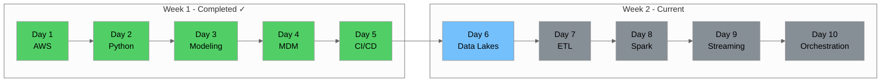

### Prerequisites

Before starting Day 6, ensure you have:

- ✅ Completed Week 1 (Days 1-5) of the training
- ✅ AWS account with S3 access configured
- ✅ Python environment with boto3 installed
- ✅ Basic understanding of data modeling concepts
- ✅ Familiarity with SQL and data formats

### Learning Objectives

By the end of Day 6, you will be able to:

1. **Differentiate** between data lakes, data warehouses, and data marts
2. **Design** a multi-zone data lake architecture (raw/processed/curated)
3. **Explain** AWS Lake Formation features and benefits
4. **Implement** metadata management using AWS Glue Data Catalog
5. **Compare** columnar file formats (Parquet, ORC, Avro)
6. **Use** Delta Lake for ACID transactions and time travel
7. **Understand** Apache Iceberg and Hudi table formats
8. **Describe** the Lakehouse architecture pattern

---

## Part 1: Data Lake vs Data Warehouse vs Data Mart

### 1.1 Understanding the Data Storage Landscape

Modern organizations use different storage paradigms for different purposes. Understanding when to use each is crucial for data engineers.

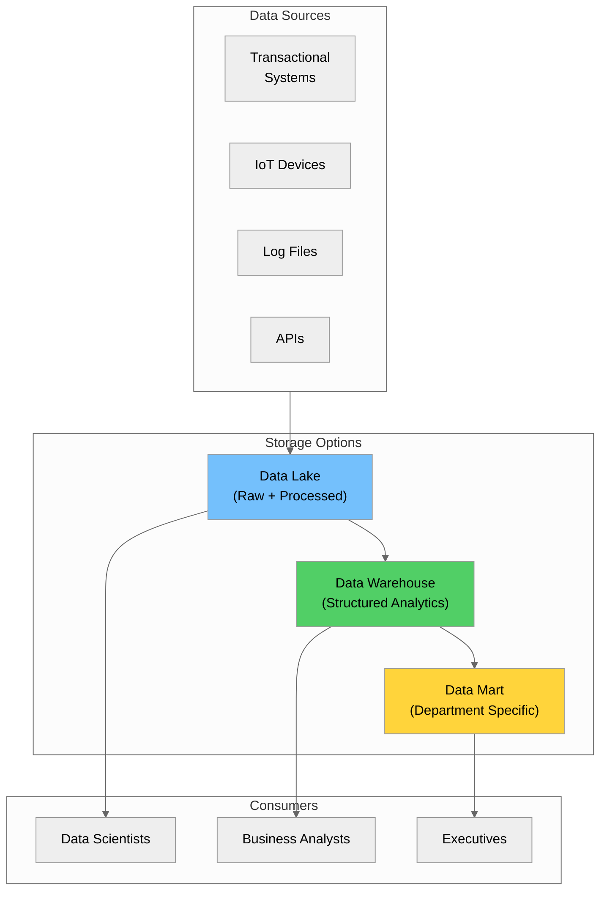

### 1.2 Data Lake

A **Data Lake** is a centralized repository that stores all structured, semi-structured, and unstructured data at any scale. Data is stored in its raw format and transformed only when needed (schema-on-read).

#### Key Characteristics

| Characteristic | Description |
|----------------|-------------|
| **Schema** | Schema-on-read (define schema when querying) |
| **Data Types** | All types: structured, semi-structured, unstructured |
| **Storage Cost** | Low (uses object storage like S3) |
| **Processing** | ELT (Extract, Load, Transform) |
| **Users** | Data scientists, data engineers |
| **Flexibility** | High - store now, analyze later |

#### NYC Taxi Data Example

For our NYC Yellow Taxi Trip data, a data lake would store:
- Raw Parquet files as ingested ([`yellow_tripdata_2025-08.parquet`](../data/yellow_tripdata_2025-08.parquet))
- Reference data ([`taxi_zone_lookup.csv`](../data/taxi_zone_lookup.csv))
- Data dictionaries and documentation
- Processed and aggregated datasets

```python
# Example: Data Lake structure for NYC Taxi data
data_lake_structure = {
    "raw": {
        "taxi_trips": "s3://taxi-data-lake/raw/yellow_tripdata/",
        "zone_lookup": "s3://taxi-data-lake/raw/reference/taxi_zones/",
        "data_dictionary": "s3://taxi-data-lake/raw/documentation/"
    },
    "processed": {
        "cleaned_trips": "s3://taxi-data-lake/processed/trips_cleaned/",
        "enriched_trips": "s3://taxi-data-lake/processed/trips_enriched/"
    },
    "curated": {
        "daily_metrics": "s3://taxi-data-lake/curated/daily_metrics/",
        "zone_analytics": "s3://taxi-data-lake/curated/zone_analytics/"
    }
}
```

### 1.3 Data Warehouse

A **Data Warehouse** is a structured, optimized repository for analytical queries. Data is cleaned, transformed, and organized into schemas before loading (schema-on-write).

#### Key Characteristics

| Characteristic | Description |
|----------------|-------------|
| **Schema** | Schema-on-write (define schema before loading) |
| **Data Types** | Structured data only |
| **Storage Cost** | Higher (optimized storage engines) |
| **Processing** | ETL (Extract, Transform, Load) |
| **Users** | Business analysts, BI tools |
| **Query Performance** | Optimized for complex analytical queries |

#### Common Data Warehouse Solutions

| Solution | Type | Best For |
|----------|------|----------|
| **Amazon Redshift** | Cloud | AWS ecosystem, large-scale analytics |
| **Snowflake** | Cloud | Multi-cloud, data sharing |
| **Google BigQuery** | Cloud | Serverless, ML integration |
| **Azure Synapse** | Cloud | Microsoft ecosystem |
| **Databricks SQL** | Cloud | Lakehouse architecture |

### 1.4 Data Mart

A **Data Mart** is a subset of a data warehouse focused on a specific business area, department, or use case.

#### Key Characteristics

| Characteristic | Description |
|----------------|-------------|
| **Scope** | Department or subject-specific |
| **Data Source** | Typically from data warehouse |
| **Size** | Smaller than data warehouse |
| **Users** | Specific business teams |
| **Purpose** | Focused analytics and reporting |

#### Types of Data Marts

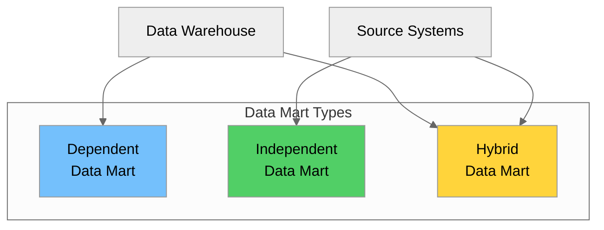

| Type | Description | Pros | Cons |
|------|-------------|------|------|
| **Dependent** | Created from data warehouse | Consistent data, governed | Requires DW infrastructure |
| **Independent** | Created directly from sources | Quick to implement | Data silos, inconsistency |
| **Hybrid** | Combines both approaches | Flexible | Complex to manage |

### 1.5 Comprehensive Comparison

| Aspect | Data Lake | Data Warehouse | Data Mart |
|--------|-----------|----------------|-----------|
| **Data Structure** | Raw, all formats | Processed, structured | Processed, structured |
| **Schema** | Schema-on-read | Schema-on-write | Schema-on-write |
| **Data Volume** | Petabytes+ | Terabytes to Petabytes | Gigabytes to Terabytes |
| **Users** | Data scientists, engineers | Analysts, BI users | Department users |
| **Cost** | Low storage, variable compute | Higher, predictable | Lower, focused |
| **Agility** | High | Medium | High (within scope) |
| **Data Quality** | Variable | High | High |
| **Query Performance** | Variable | Optimized | Highly optimized |
| **Use Cases** | ML, exploration, archival | Enterprise reporting | Department analytics |

### 1.6 When to Use Each

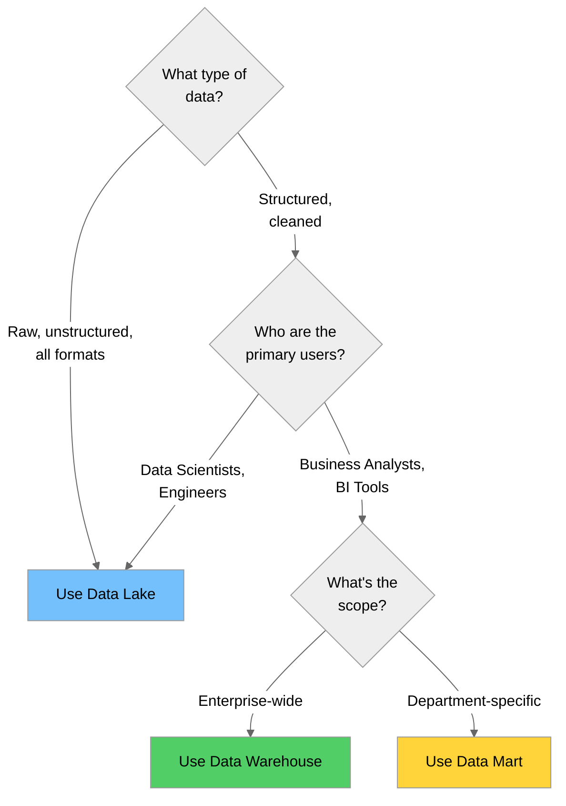

#### Decision Matrix

| Scenario | Recommended Solution |
|----------|---------------------|
| Store raw IoT sensor data for future analysis | Data Lake |
| Executive dashboard with KPIs | Data Warehouse → Data Mart |
| Machine learning model training | Data Lake |
| Finance department quarterly reports | Data Mart |
| Ad-hoc data exploration | Data Lake |
| Cross-department analytics | Data Warehouse |
| Real-time operational reporting | Data Warehouse |
| Archive historical data cost-effectively | Data Lake |

---

## Part 2: Architecture Patterns - Raw/Processed/Curated Zones

### 2.1 The Medallion Architecture

The **Medallion Architecture** (also called multi-hop or zone architecture) organizes data into layers based on quality and refinement level. This pattern is fundamental to modern data lake design.

```mermaid
%%{init: {'theme':'neutral'}}%%
flowchart LR
    subgraph Sources["Data Sources"]
        SRC1["APIs"]
        SRC2["Databases"]
        SRC3["Files"]
        SRC4["Streams"]
    end

    subgraph Bronze["Bronze Layer<br/>(Raw Zone)"]
        B1["Raw Data<br/>As-Is Ingestion"]
    end

    subgraph Silver["Silver Layer<br/>(Processed Zone)"]
        S1["Cleaned Data<br/>Validated & Conformed"]
    end

    subgraph Gold["Gold Layer<br/>(Curated Zone)"]
        G1["Business-Ready<br/>Aggregated & Enriched"]
    end

    subgraph Consumers["Consumers"]
        C1["BI Tools"]
        C2["ML Models"]
        C3["Applications"]
    end

    Sources --> Bronze --> Silver --> Gold --> Consumers

    style B1 fill:#cd7f32,color:#000
    style S1 fill:#c0c0c0,color:#000
    style G1 fill:#ffd700,color:#000
```

### 2.2 Bronze Layer (Raw Zone)

The **Bronze Layer** stores data exactly as received from source systems. No transformations are applied - this is your "single source of truth" for raw data.

#### Characteristics

| Aspect | Description |
|--------|-------------|
| **Data State** | Raw, unprocessed |
| **Schema** | Source schema preserved |
| **Quality** | No validation applied |
| **Format** | Original format or converted to efficient format |
| **Retention** | Long-term (often indefinite) |
| **Access** | Data engineers only |

#### NYC Taxi Data - Bronze Layer Example

```python
import boto3
from datetime import datetime

# Bronze layer structure for NYC Taxi data
bronze_config = {
    "bucket": "nyc-taxi-data-lake",
    "prefix": "bronze/",
    "partitioning": "year={year}/month={month}/",
    "format": "parquet",  # Keep original format
    "metadata": {
        "source": "nyc_tlc",
        "ingestion_timestamp": datetime.utcnow().isoformat(),
        "data_quality": "raw"
    }
}

def ingest_to_bronze(source_file: str, year: int, month: int) -> str:
    """
    Ingest raw taxi data to bronze layer.
    No transformations - just organize and catalog.
    """
    s3 = boto3.client('s3')
    
    # Construct destination path
    dest_key = (
        f"{bronze_config['prefix']}"
        f"yellow_tripdata/"
        f"year={year}/month={month:02d}/"
        f"yellow_tripdata_{year}-{month:02d}.parquet"
    )
    
    # Upload with metadata
    s3.upload_file(
        source_file,
        bronze_config['bucket'],
        dest_key,
        ExtraArgs={
            'Metadata': {
                'source': 'nyc_tlc',
                'ingestion_time': datetime.utcnow().isoformat(),
                'original_filename': source_file
            }
        }
    )
    
    return f"s3://{bronze_config['bucket']}/{dest_key}"

# Example usage
# bronze_path = ingest_to_bronze("data/yellow_tripdata_2025-08.parquet", 2025, 8)
```

### 2.3 Silver Layer (Processed Zone)

The **Silver Layer** contains cleaned, validated, and conformed data. This is where data quality rules are applied and data is standardized.

#### Characteristics

| Aspect | Description |
|--------|-------------|
| **Data State** | Cleaned, validated |
| **Schema** | Standardized, documented |
| **Quality** | Quality rules applied |
| **Format** | Optimized columnar (Parquet/Delta) |
| **Retention** | Medium to long-term |
| **Access** | Data engineers, advanced analysts |

#### Transformations Applied

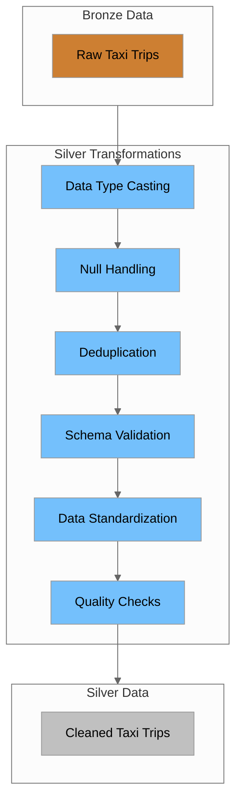

#### NYC Taxi Data - Silver Layer Example

```python
import pandas as pd
from typing import Dict, Tuple

def bronze_to_silver(bronze_path: str) -> Tuple[pd.DataFrame, Dict]:
    """
    Transform bronze taxi data to silver layer.
    Apply cleaning, validation, and standardization.
    """
    # Read bronze data
    df = pd.read_parquet(bronze_path)
    
    quality_report = {
        "input_rows": len(df),
        "issues_found": [],
        "rows_removed": 0
    }
    
    # 1. Data Type Casting
    df['tpep_pickup_datetime'] = pd.to_datetime(df['tpep_pickup_datetime'])
    df['tpep_dropoff_datetime'] = pd.to_datetime(df['tpep_dropoff_datetime'])
    
    # 2. Null Handling - Remove rows with critical nulls
    critical_columns = ['tpep_pickup_datetime', 'tpep_dropoff_datetime', 
                        'PULocationID', 'DOLocationID']
    null_mask = df[critical_columns].isnull().any(axis=1)
    null_count = null_mask.sum()
    if null_count > 0:
        quality_report["issues_found"].append(
            f"Removed {null_count} rows with null critical fields"
        )
        df = df[~null_mask]
        quality_report["rows_removed"] += null_count
    
    # 3. Deduplication
    initial_count = len(df)
    df = df.drop_duplicates()
    dupe_count = initial_count - len(df)
    if dupe_count > 0:
        quality_report["issues_found"].append(f"Removed {dupe_count} duplicate rows")
        quality_report["rows_removed"] += dupe_count
    
    # 4. Schema Validation - Ensure required columns exist
    required_columns = [
        'VendorID', 'tpep_pickup_datetime', 'tpep_dropoff_datetime',
        'passenger_count', 'trip_distance', 'PULocationID', 'DOLocationID',
        'payment_type', 'fare_amount', 'tip_amount', 'total_amount'
    ]
    missing_cols = set(required_columns) - set(df.columns)
    if missing_cols:
        raise ValueError(f"Missing required columns: {missing_cols}")
    
    # 5. Data Standardization - lowercase column names
    df.columns = df.columns.str.lower().str.replace(' ', '_')
    
    # 6. Quality Checks - Remove invalid records
    invalid_amounts = (df['fare_amount'] < 0) | (df['total_amount'] < 0)
    invalid_count = invalid_amounts.sum()
    if invalid_count > 0:
        quality_report["issues_found"].append(
            f"Removed {invalid_count} rows with negative amounts"
        )
        df = df[~invalid_amounts]
        quality_report["rows_removed"] += invalid_count
    
    # Add metadata columns
    df['_silver_processed_at'] = pd.Timestamp.utcnow()
    df['_source_file'] = bronze_path
    
    quality_report["output_rows"] = len(df)
    quality_report["quality_score"] = round(
        (quality_report["output_rows"] / quality_report["input_rows"]) * 100, 2
    )
    
    return df, quality_report
```

### 2.4 Gold Layer (Curated Zone)

The **Gold Layer** contains business-ready, aggregated, and enriched data optimized for specific use cases.

#### Characteristics

| Aspect | Description |
|--------|-------------|
| **Data State** | Aggregated, enriched, business-ready |
| **Schema** | Business-oriented, denormalized |
| **Quality** | Highest quality, validated |
| **Format** | Optimized for query patterns |
| **Retention** | Based on business requirements |
| **Access** | Business users, BI tools, applications |

#### NYC Taxi Data - Gold Layer Example

```python
import pandas as pd

def silver_to_gold_daily_metrics(silver_df: pd.DataFrame) -> pd.DataFrame:
    """
    Create gold layer daily metrics from silver taxi data.
    Business-ready aggregations for dashboards.
    """
    # Extract date from pickup datetime
    silver_df['trip_date'] = silver_df['tpep_pickup_datetime'].dt.date
    
    # Daily aggregations
    daily_metrics = silver_df.groupby('trip_date').agg({
        'vendorid': 'count',  # Total trips
        'passenger_count': 'sum',
        'trip_distance': ['sum', 'mean'],
        'fare_amount': ['sum', 'mean'],
        'tip_amount': ['sum', 'mean'],
        'total_amount': ['sum', 'mean']
    }).reset_index()
    
    # Flatten column names
    daily_metrics.columns = [
        'trip_date', 'total_trips', 'total_passengers',
        'total_distance', 'avg_distance',
        'total_fare', 'avg_fare',
        'total_tips', 'avg_tip',
        'total_revenue', 'avg_revenue'
    ]
    
    # Add derived metrics
    daily_metrics['avg_passengers_per_trip'] = (
        daily_metrics['total_passengers'] / daily_metrics['total_trips']
    ).round(2)
    daily_metrics['tip_percentage'] = (
        (daily_metrics['total_tips'] / daily_metrics['total_fare']) * 100
    ).round(2)
    
    return daily_metrics


def silver_to_gold_zone_analytics(
    silver_df: pd.DataFrame, 
    zone_lookup: pd.DataFrame
) -> pd.DataFrame:
    """
    Create gold layer zone analytics with enriched location data.
    """
    # Aggregate by pickup location
    zone_metrics = silver_df.groupby('pulocationid').agg({
        'vendorid': 'count',
        'trip_distance': 'mean',
        'total_amount': ['sum', 'mean'],
        'tip_amount': 'mean'
    }).reset_index()
    
    zone_metrics.columns = [
        'location_id', 'total_pickups', 'avg_trip_distance',
        'total_revenue', 'avg_fare', 'avg_tip'
    ]
    
    # Enrich with zone information
    zone_metrics = zone_metrics.merge(
        zone_lookup[['LocationID', 'Borough', 'Zone', 'service_zone']],
        left_on='location_id',
        right_on='LocationID',
        how='left'
    )
    
    return zone_metrics
```

### 2.5 Complete Zone Architecture

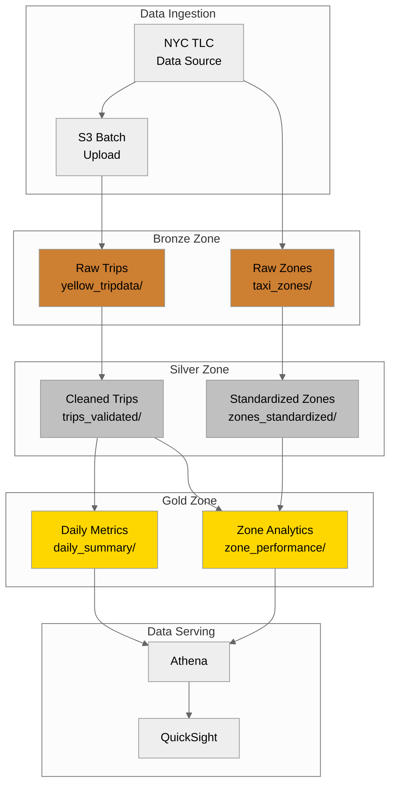

### 2.6 Zone Naming Conventions

| Convention | Bronze | Silver | Gold |
|------------|--------|--------|------|
| **Medallion** | Bronze | Silver | Gold |
| **Quality** | Raw | Processed | Curated |
| **Stage** | Landing | Staging | Production |
| **Refinement** | Raw | Refined | Aggregated |

---

## Part 3: AWS Lake Formation Basics

### 3.1 What is AWS Lake Formation?

**AWS Lake Formation** is a fully managed service that simplifies building, securing, and managing data lakes. It automates many complex manual steps including collecting, cleansing, cataloging, and securing data.

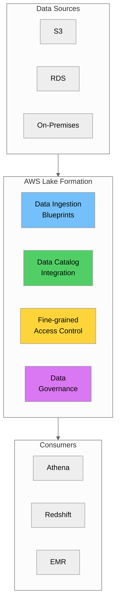

### 3.2 Key Features

| Feature | Description | Benefit |
|---------|-------------|---------|
| **Blueprints** | Pre-built templates for data ingestion | Faster setup, less code |
| **Crawlers** | Automatic schema discovery | No manual schema definition |
| **Data Catalog** | Centralized metadata repository | Single source of truth |
| **Fine-grained Access** | Column and row-level security | Granular data protection |
| **Cross-account Sharing** | Share data across AWS accounts | Collaboration without copying |
| **ACID Transactions** | Governed tables with transactions | Data consistency |

### 3.3 Lake Formation Architecture

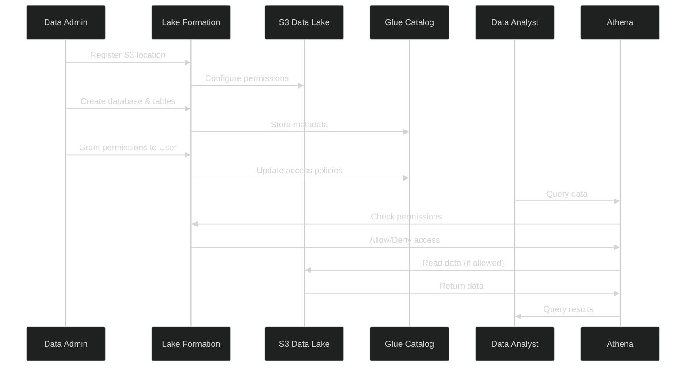

### 3.4 Setting Up Lake Formation

#### Step 1: Register Data Lake Administrator

```python
import boto3

lakeformation = boto3.client('lakeformation')

# Add data lake administrator
response = lakeformation.put_data_lake_settings(
    DataLakeSettings={
        'DataLakeAdmins': [
            {
                'DataLakePrincipalIdentifier': 'arn:aws:iam::123456789012:user/data-admin'
            }
        ],
        'CreateDatabaseDefaultPermissions': [],
        'CreateTableDefaultPermissions': []
    }
)
```

#### Step 2: Register S3 Location

```python
# Register S3 location with Lake Formation
response = lakeformation.register_resource(
    ResourceArn='arn:aws:s3:::nyc-taxi-data-lake',
    UseServiceLinkedRole=True
)
```

#### Step 3: Create Database

```python
glue = boto3.client('glue')

response = glue.create_database(
    DatabaseInput={
        'Name': 'nyc_taxi_lake',
        'Description': 'NYC Taxi Trip Data Lake',
        'LocationUri': 's3://nyc-taxi-data-lake/'
    }
)
```

#### Step 4: Grant Permissions

```python
# Grant permissions to a user or role
response = lakeformation.grant_permissions(
    Principal={
        'DataLakePrincipalIdentifier': 'arn:aws:iam::123456789012:role/DataAnalystRole'
    },
    Resource={
        'Table': {
            'DatabaseName': 'nyc_taxi_lake',
            'Name': 'yellow_trips_gold'
        }
    },
    Permissions=['SELECT'],
    PermissionsWithGrantOption=[]
)
```

### 3.5 Lake Formation vs Traditional IAM

| Aspect | Traditional IAM | Lake Formation |
|--------|-----------------|----------------|
| **Granularity** | Bucket/prefix level | Column/row level |
| **Management** | Multiple policies | Centralized |
| **Cross-account** | Complex setup | Built-in support |
| **Audit** | CloudTrail only | Integrated logging |
| **Catalog Integration** | Manual | Automatic |

---

## Part 4: Metadata Management and Cataloging

### 4.1 Why Metadata Matters

Metadata is "data about data" - it describes the structure, format, location, and meaning of your data. Without proper metadata management, data lakes become "data swamps."

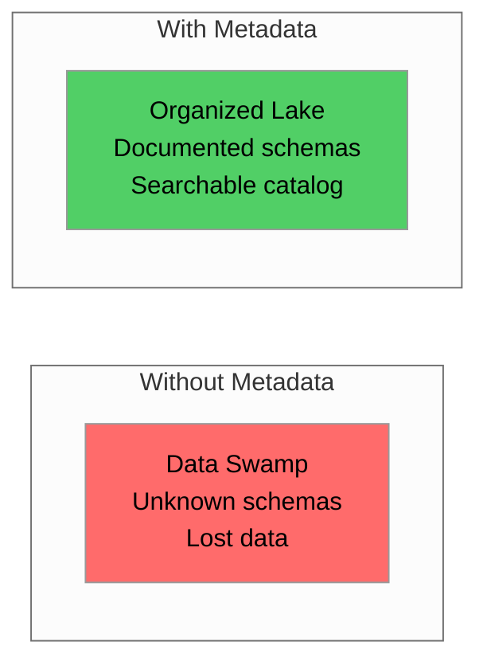

### 4.2 Types of Metadata

| Type | Description | Examples |
|------|-------------|----------|
| **Technical** | Schema, format, location | Column names, data types, S3 paths |
| **Business** | Meaning and context | Descriptions, owners, classifications |
| **Operational** | Processing information | Last updated, row counts, quality scores |
| **Administrative** | Governance information | Access policies, retention rules |

### 4.3 AWS Glue Data Catalog

The **AWS Glue Data Catalog** is a centralized metadata repository that stores table definitions, schema information, and other metadata.

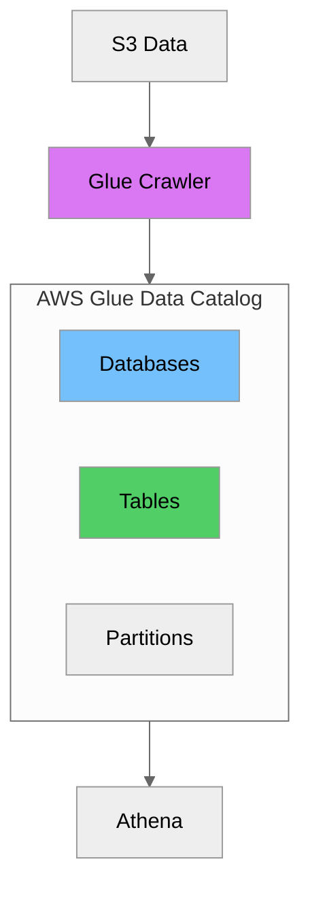

### 4.4 Creating a Glue Crawler

```python
import boto3

glue = boto3.client('glue')

# Create a crawler for NYC Taxi data
response = glue.create_crawler(
    Name='nyc-taxi-bronze-crawler',
    Role='arn:aws:iam::123456789012:role/GlueCrawlerRole',
    DatabaseName='nyc_taxi_lake',
    Description='Crawl bronze layer taxi data',
    Targets={
        'S3Targets': [
            {
                'Path': 's3://nyc-taxi-data-lake/bronze/yellow_tripdata/',
                'Exclusions': ['_temporary/**', '_spark_metadata/**']
            }
        ]
    },
    SchemaChangePolicy={
        'UpdateBehavior': 'UPDATE_IN_DATABASE',
        'DeleteBehavior': 'LOG'
    }
)

# Start the crawler
glue.start_crawler(Name='nyc-taxi-bronze-crawler')
```

### 4.5 Creating Tables Manually

```python
# Create a table definition for NYC Taxi trips
response = glue.create_table(
    DatabaseName='nyc_taxi_lake',
    TableInput={
        'Name': 'yellow_trips_bronze',
        'Description': 'Raw NYC Yellow Taxi trip data',
        'StorageDescriptor': {
            'Columns': [
                {'Name': 'vendorid', 'Type': 'bigint', 'Comment': 'Vendor ID'},
                {'Name': 'tpep_pickup_datetime', 'Type': 'timestamp'},
                {'Name': 'tpep_dropoff_datetime', 'Type': 'timestamp'},
                {'Name': 'passenger_count', 'Type': 'double'},
                {'Name': 'trip_distance', 'Type': 'double'},
                {'Name': 'pulocationid', 'Type': 'bigint'},
                {'Name': 'dolocationid', 'Type': 'bigint'},
                {'Name': 'payment_type', 'Type': 'bigint'},
                {'Name': 'fare_amount', 'Type': 'double'},
                {'Name': 'tip_amount', 'Type': 'double'},
                {'Name': 'total_amount', 'Type': 'double'}
            ],
            'Location': 's3://nyc-taxi-data-lake/bronze/yellow_tripdata/',
            'InputFormat': 'org.apache.hadoop.hive.ql.io.parquet.MapredParquetInputFormat',
            'OutputFormat': 'org.apache.hadoop.hive.ql.io.parquet.MapredParquetOutputFormat',
            'SerdeInfo': {
                'SerializationLibrary': 'org.apache.hadoop.hive.ql.io.parquet.serde.ParquetHiveSerDe'
            }
        },
        'PartitionKeys': [
            {'Name': 'year', 'Type': 'int'},
            {'Name': 'month', 'Type': 'int'}
        ],
        'TableType': 'EXTERNAL_TABLE'
    }
)
```

### 4.6 Querying the Data Catalog

```python
# List all databases
databases = glue.get_databases()
for db in databases['DatabaseList']:
    print(f"Database: {db['Name']}")

# Get table details
table = glue.get_table(
    DatabaseName='nyc_taxi_lake',
    Name='yellow_trips_bronze'
)
print(f"Table: {table['Table']['Name']}")
print(f"Location: {table['Table']['StorageDescriptor']['Location']}")

# Search tables
search_results = glue.search_tables(
    SearchText='taxi',
    MaxResults=10
)
for t in search_results['TableList']:
    print(f"Found: {t['DatabaseName']}.{t['Name']}")
```

---

## Part 5: Master Data Layer in Data Lakes

### 5.1 Master Data in Data Lake Context

Master Data Management (MDM) concepts from Day 4 apply to data lakes. The master data layer provides authoritative, consistent reference data across all zones.

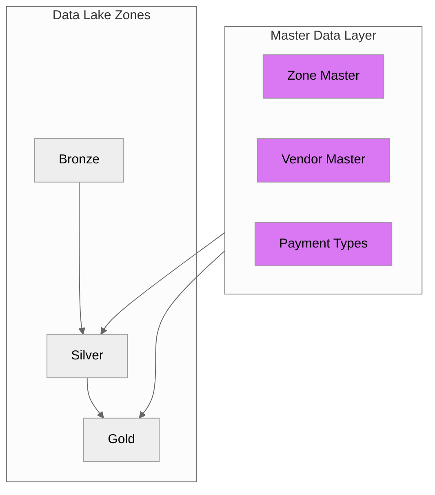

### 5.2 Master Data Structure for NYC Taxi

```python
import pandas as pd

# Vendor Master
vendor_master = pd.DataFrame([
    {"vendor_id": 1, "vendor_name": "Creative Mobile Technologies", "vendor_code": "CMT"},
    {"vendor_id": 2, "vendor_name": "VeriFone Inc", "vendor_code": "VTS"}
])

# Payment Type Master
payment_master = pd.DataFrame([
    {"payment_type_id": 1, "payment_name": "Credit Card", "is_electronic": True},
    {"payment_type_id": 2, "payment_name": "Cash", "is_electronic": False},
    {"payment_type_id": 3, "payment_name": "No Charge", "is_electronic": False},
    {"payment_type_id": 4, "payment_name": "Dispute", "is_electronic": False},
    {"payment_type_id": 5, "payment_name": "Unknown", "is_electronic": False},
    {"payment_type_id": 6, "payment_name": "Voided Trip", "is_electronic": False}
])

# Rate Code Master
rate_master = pd.DataFrame([
    {"rate_code_id": 1, "rate_name": "Standard Rate", "is_flat_rate": False},
    {"rate_code_id": 2, "rate_name": "JFK", "is_flat_rate": True},
    {"rate_code_id": 3, "rate_name": "Newark", "is_flat_rate": False},
    {"rate_code_id": 4, "rate_name": "Nassau/Westchester", "is_flat_rate": False},
    {"rate_code_id": 5, "rate_name": "Negotiated Fare", "is_flat_rate": True},
    {"rate_code_id": 6, "rate_name": "Group Ride", "is_flat_rate": False}
])

# Zone Master - from taxi_zone_lookup.csv
zone_master = pd.read_csv('data/taxi_zone_lookup.csv')
```

### 5.3 Enriching Data with Master Data

```python
def enrich_trips_with_master_data(
    trips_df: pd.DataFrame,
    zone_df: pd.DataFrame,
    vendor_df: pd.DataFrame,
    payment_df: pd.DataFrame
) -> pd.DataFrame:
    """Enrich trip data with master data attributes."""
    enriched = trips_df.copy()
    
    # Enrich with pickup zone
    enriched = enriched.merge(
        zone_df[['LocationID', 'Borough', 'Zone']].rename(columns={
            'LocationID': 'pulocationid',
            'Borough': 'pickup_borough',
            'Zone': 'pickup_zone'
        }),
        on='pulocationid',
        how='left'
    )
    
    # Enrich with dropoff zone
    enriched = enriched.merge(
        zone_df[['LocationID', 'Borough', 'Zone']].rename(columns={
            'LocationID': 'dolocationid',
            'Borough': 'dropoff_borough',
            'Zone': 'dropoff_zone'
        }),
        on='dolocationid',
        how='left'
    )
    
    # Enrich with vendor name
    enriched = enriched.merge(
        vendor_df[['vendor_id', 'vendor_name']],
        left_on='vendorid',
        right_on='vendor_id',
        how='left'
    )
    
    # Enrich with payment type
    enriched = enriched.merge(
        payment_df[['payment_type_id', 'payment_name']],
        left_on='payment_type',
        right_on='payment_type_id',
        how='left'
    )
    
    return enriched
```

---

## Part 6: File Formats Comparison

### 6.1 Overview of Columnar Formats

Modern data lakes use columnar file formats for efficient storage and query performance.

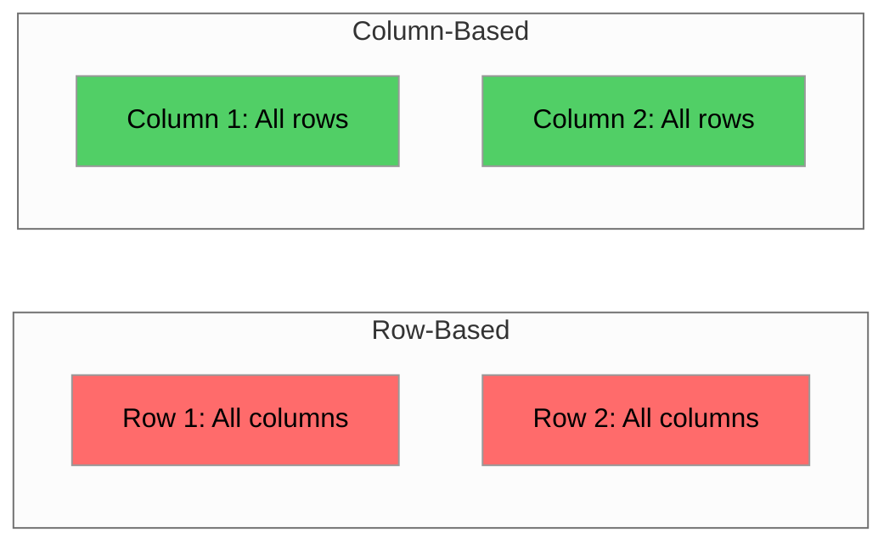

### 6.2 Apache Parquet

**Parquet** is a columnar storage format optimized for analytics workloads. It's the most popular format for data lakes.

#### Key Features

| Feature | Description |
|---------|-------------|
| **Columnar Storage** | Stores data by column for efficient analytics |
| **Compression** | Excellent compression (Snappy, GZIP, ZSTD) |
| **Schema Evolution** | Supports adding columns |
| **Predicate Pushdown** | Filter data at storage level |
| **Nested Data** | Supports complex nested structures |

#### Working with Parquet

```python
import pandas as pd
import pyarrow.parquet as pq

# Read NYC Taxi data
df = pd.read_parquet('data/yellow_tripdata_2025-08.parquet')

# Write with specific options
df.to_parquet(
    'output/taxi_trips.parquet',
    engine='pyarrow',
    compression='snappy',
    index=False
)

# Read with column selection (predicate pushdown)
selected_df = pd.read_parquet(
    'data/yellow_tripdata_2025-08.parquet',
    columns=['tpep_pickup_datetime', 'trip_distance', 'total_amount']
)

# Get Parquet metadata
parquet_file = pq.ParquetFile('data/yellow_tripdata_2025-08.parquet')
print(f"Row groups: {parquet_file.metadata.num_row_groups}")
print(f"Columns: {parquet_file.metadata.num_columns}")
print(f"Rows: {parquet_file.metadata.num_rows}")
```

### 6.3 Apache ORC

**ORC (Optimized Row Columnar)** is a columnar format originally developed for Hive.

| Feature | Description |
|---------|-------------|
| **Columnar Storage** | Highly optimized columnar format |
| **Compression** | ZLIB, Snappy, LZO, ZSTD |
| **Indexes** | Built-in bloom filters and indexes |
| **ACID Support** | Native ACID transaction support |

```python
import pyarrow.orc as orc

# Write to ORC
df.to_orc('output/taxi_trips.orc', compression='snappy')

# Read ORC file
df = pd.read_orc('output/taxi_trips.orc')
```

### 6.4 Apache Avro

**Avro** is a row-based format with compact binary encoding. Ideal for streaming.

| Feature | Description |
|---------|-------------|
| **Row-Based** | Stores data by row |
| **Schema Evolution** | Excellent schema evolution support |
| **Compact Binary** | Efficient binary encoding |
| **Streaming** | Ideal for Kafka and streaming |

```python
import fastavro

# Define Avro schema
taxi_schema = {
    "type": "record",
    "name": "TaxiTrip",
    "fields": [
        {"name": "vendorid", "type": ["null", "long"]},
        {"name": "trip_distance", "type": ["null", "double"]},
        {"name": "total_amount", "type": ["null", "double"]}
    ]
}

# Write to Avro
records = df.to_dict('records')
with open('output/taxi_trips.avro', 'wb') as f:
    fastavro.writer(f, taxi_schema, records)
```

### 6.5 Format Comparison

| Feature | Parquet | ORC | Avro |
|---------|---------|-----|------|
| **Storage Type** | Columnar | Columnar | Row-based |
| **Best For** | Analytics, Data Lakes | Hive/Presto | Streaming, Kafka |
| **Compression** | Excellent | Excellent | Good |
| **Schema Evolution** | Good | Good | Excellent |
| **Query Performance** | Excellent | Excellent | Moderate |
| **Write Performance** | Moderate | Moderate | Excellent |
| **Ecosystem** | Spark, Pandas, Athena | Hive, Presto | Kafka, Spark |

### 6.6 When to Use Each Format

| Scenario | Recommended Format |
|----------|-------------------|
| Data lake storage | Parquet |
| Athena queries | Parquet |
| Spark processing | Parquet |
| Hive data warehouse | ORC |
| Kafka streaming | Avro |
| Schema evolution critical | Avro |
| Maximum compression | ORC or Parquet |

---

## Part 7: Delta Lake

### 7.1 What is Delta Lake?

**Delta Lake** is an open-source storage layer that brings ACID transactions, scalable metadata handling, and data versioning to data lakes.

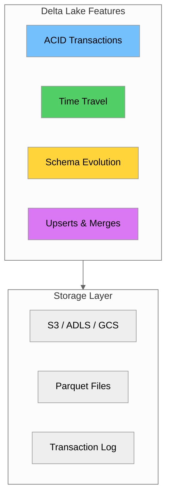

### 7.2 Key Features

| Feature | Description | Benefit |
|---------|-------------|---------|
| **ACID Transactions** | Atomic, consistent, isolated, durable | Data reliability |
| **Time Travel** | Query historical versions | Audit, rollback, debugging |
| **Schema Evolution** | Add/modify columns safely | Flexibility |
| **Upserts (MERGE)** | Update and insert in one operation | Efficient CDC |
| **Unified Batch/Streaming** | Same table for both | Simplified architecture |

### 7.3 Delta Lake Architecture

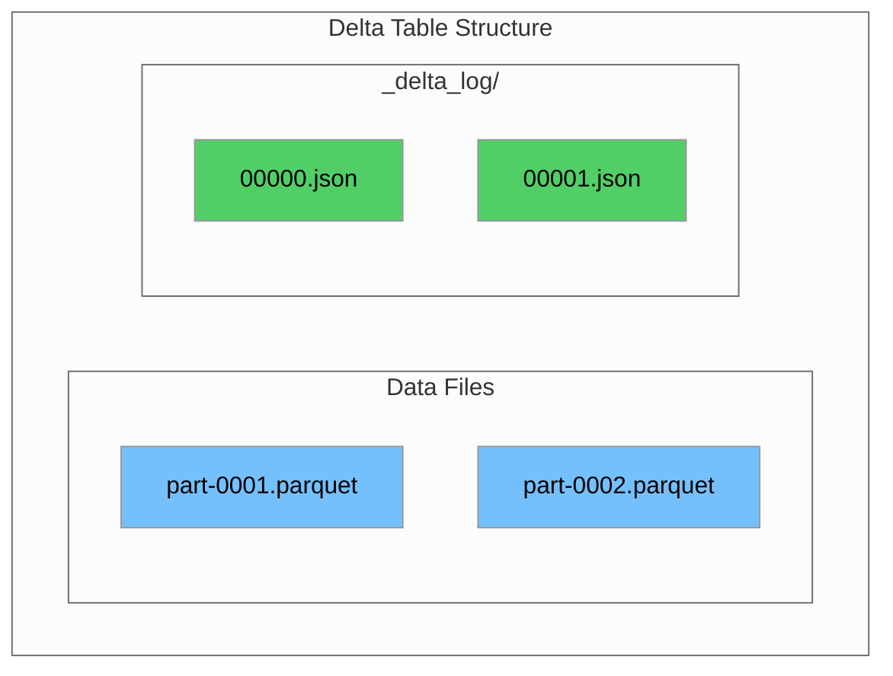

### 7.4 Working with Delta Lake in PySpark

```python
from pyspark.sql import SparkSession
from delta import configure_spark_with_delta_pip

# Create Spark session with Delta Lake
builder = SparkSession.builder \
    .appName("NYC Taxi Delta Lake") \
    .config("spark.sql.extensions", "io.delta.sql.DeltaSparkSessionExtension") \
    .config("spark.sql.catalog.spark_catalog",
            "org.apache.spark.sql.delta.catalog.DeltaCatalog")

spark = configure_spark_with_delta_pip(builder).getOrCreate()

# Read Parquet and write as Delta
df = spark.read.parquet("data/yellow_tripdata_2025-08.parquet")

# Write to Delta format
df.write.format("delta").mode("overwrite").save("delta/yellow_trips")

# Read Delta table
delta_df = spark.read.format("delta").load("delta/yellow_trips")
delta_df.show(5)
```

### 7.5 ACID Transactions

```python
from delta.tables import DeltaTable

# Atomic update - all or nothing
delta_table = DeltaTable.forPath(spark, "delta/yellow_trips")

# Update records atomically
delta_table.update(
    condition="trip_distance < 0",
    set={"trip_distance": "0"}
)

# Delete records atomically
delta_table.delete("total_amount < 0")
```

### 7.6 Time Travel

```python
# Read specific version
df_v0 = spark.read.format("delta") \
    .option("versionAsOf", 0) \
    .load("delta/yellow_trips")

# Read as of timestamp
df_yesterday = spark.read.format("delta") \
    .option("timestampAsOf", "2025-08-01 00:00:00") \
    .load("delta/yellow_trips")

# View history
delta_table = DeltaTable.forPath(spark, "delta/yellow_trips")
delta_table.history().select("version", "timestamp", "operation").show()

# Restore to previous version
delta_table.restoreToVersion(0)
```

### 7.7 Schema Evolution

```python
# Enable schema evolution
df_new = spark.read.parquet("data/new_taxi_data.parquet")

# Write with schema merge
df_new.write.format("delta") \
    .mode("append") \
    .option("mergeSchema", "true") \
    .save("delta/yellow_trips")
```

### 7.8 MERGE (Upsert) Operations

```python
from delta.tables import DeltaTable

delta_table = DeltaTable.forPath(spark, "delta/yellow_trips")
updates_df = spark.read.parquet("data/taxi_updates.parquet")

# Merge operation - upsert
delta_table.alias("target").merge(
    updates_df.alias("source"),
    "target.trip_id = source.trip_id"
).whenMatchedUpdate(set={
    "total_amount": "source.total_amount"
}).whenNotMatchedInsertAll().execute()
```

### 7.9 Delta Lake with Python (delta-rs)

```python
from deltalake import DeltaTable, write_deltalake
import pandas as pd

# Read existing data
df = pd.read_parquet('data/yellow_tripdata_2025-08.parquet')

# Write as Delta Lake table
write_deltalake("delta/yellow_trips", df, mode="overwrite")

# Read Delta table
dt = DeltaTable("delta/yellow_trips")
df = dt.to_pandas()

# Time travel
df_v0 = DeltaTable("delta/yellow_trips", version=0).to_pandas()

# View history
print(dt.history())
```

---

## Part 8: Apache Iceberg & Hudi Overview

### 8.1 Apache Iceberg

**Apache Iceberg** is an open table format for huge analytic datasets.

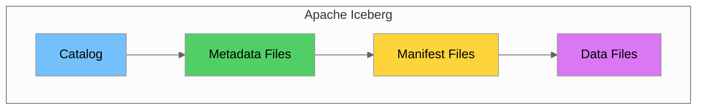

#### Key Features

| Feature | Description |
|---------|-------------|
| **Hidden Partitioning** | Partition evolution without rewriting |
| **Schema Evolution** | Add, drop, rename columns |
| **Time Travel** | Query historical snapshots |
| **ACID Transactions** | Serializable isolation |

#### Working with Iceberg

```python
from pyspark.sql import SparkSession

spark = SparkSession.builder \
    .appName("Iceberg Example") \
    .config("spark.sql.extensions",
            "org.apache.iceberg.spark.extensions.IcebergSparkSessionExtensions") \
    .config("spark.sql.catalog.local", "org.apache.iceberg.spark.SparkCatalog") \
    .config("spark.sql.catalog.local.type", "hadoop") \
    .config("spark.sql.catalog.local.warehouse", "iceberg/warehouse") \
    .getOrCreate()

# Create Iceberg table
spark.sql("""
    CREATE TABLE local.nyc_taxi.yellow_trips (
        vendorid BIGINT,
        tpep_pickup_datetime TIMESTAMP,
        trip_distance DOUBLE,
        total_amount DOUBLE
    )
    USING iceberg
    PARTITIONED BY (days(tpep_pickup_datetime))
""")

# Time travel
spark.sql("SELECT * FROM local.nyc_taxi.yellow_trips VERSION AS OF 1")
```

### 8.2 Apache Hudi

**Apache Hudi** is designed for incremental data processing.

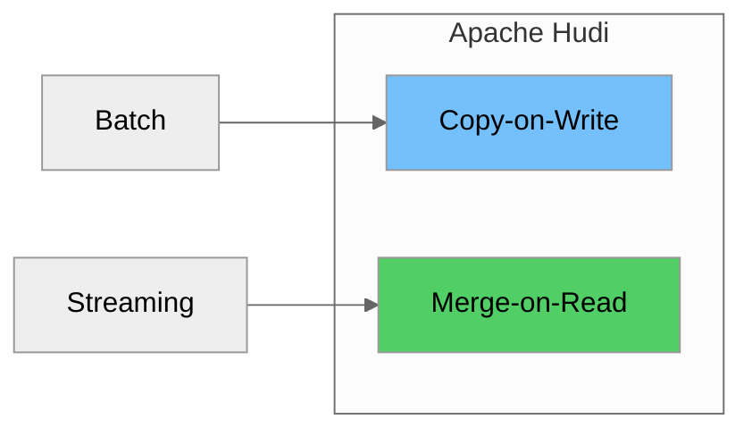

#### Key Features

| Feature | Description |
|---------|-------------|
| **Upserts** | Efficient record-level updates |
| **Incremental Queries** | Query only changed data |
| **Table Types** | Copy-on-Write and Merge-on-Read |

### 8.3 Comparison: Delta vs Iceberg vs Hudi

| Feature | Delta Lake | Iceberg | Hudi |
|---------|------------|---------|------|
| **Primary Use** | General purpose | Large analytics | Incremental |
| **ACID** | ✅ | ✅ | ✅ |
| **Time Travel** | ✅ | ✅ | ✅ |
| **Schema Evolution** | ✅ | ✅ (best) | ✅ |
| **Partition Evolution** | Limited | ✅ (best) | Limited |
| **Upserts** | ✅ | ✅ | ✅ (best) |
| **Streaming** | ✅ (best) | ✅ | ✅ |
| **AWS Integration** | Good | Excellent | Good |

---

## Part 9: Lakehouse Architecture

### 9.1 What is a Lakehouse?

A **Lakehouse** combines data lakes and data warehouses into a single architecture.

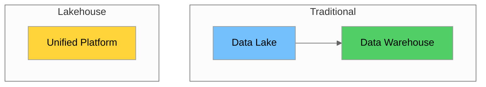

### 9.2 Key Characteristics

| Characteristic | Description |
|----------------|-------------|
| **Open Formats** | Parquet, Delta, Iceberg |
| **ACID Transactions** | Reliable operations |
| **Schema Enforcement** | Data quality at write |
| **BI Support** | Direct BI connectivity |
| **ML Support** | Native ML workloads |

### 9.3 Lakehouse on AWS

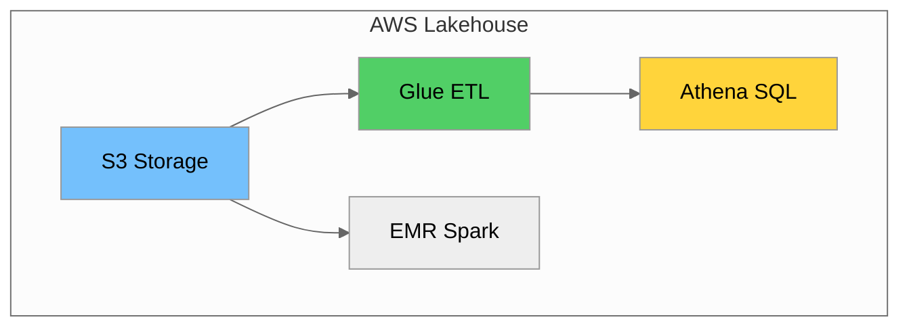

### 9.4 Benefits

| Benefit | Description |
|---------|-------------|
| **Cost Reduction** | Single storage layer |
| **Simplified Architecture** | One platform |
| **Real-time Analytics** | Unified batch/streaming |
| **Open Standards** | No vendor lock-in |

---

## Part 10: Hands-on Labs

### Lab 1: Design Data Lake Architecture

**Objective**: Design a data lake architecture for NYC Taxi data using Draw.io.

#### Instructions

1. Go to [draw.io](https://app.diagrams.net/)
2. Create a new diagram with these components:
   - Three zones: Bronze, Silver, Gold
   - Data sources: NYC TLC API, Reference files
   - Processing: AWS Glue ETL jobs
   - Serving: Athena, QuickSight
   - Governance: Lake Formation, Glue Catalog

**Example Structure:**

```
┌─────────────────────────────────────────────────────────────┐
│                     NYC Taxi Data Lake                       │
├─────────────────────────────────────────────────────────────┤
│  Sources          │  Bronze        │  Silver      │  Gold   │
│  ─────────        │  ──────        │  ──────      │  ────   │
│  NYC TLC API  ──► │  Raw Trips ──► │  Cleaned ──► │  Daily  │
│  Zone CSV    ──► │  Raw Zones     │  Validated   │  Metrics│
├─────────────────────────────────────────────────────────────┤
│  Governance: Lake Formation │ Catalog: Glue Data Catalog    │
└─────────────────────────────────────────────────────────────┘
```

### Lab 2: Implement Data Lake Zones in S3

**Objective**: Create S3 bucket structure for data lake zones.

```python
import boto3

def create_data_lake_structure(bucket_name: str):
    """Create data lake zone structure in S3."""
    s3 = boto3.client('s3')
    
    # Define zone structure
    zones = {
        'bronze': ['yellow_tripdata/', 'taxi_zones/'],
        'silver': ['trips_cleaned/', 'zones_standardized/'],
        'gold': ['daily_metrics/', 'zone_analytics/'],
        'master': ['vendors/', 'payment_types/']
    }
    
    # Create folder markers
    for zone, folders in zones.items():
        for folder in folders:
            key = f"{zone}/{folder}"
            s3.put_object(Bucket=bucket_name, Key=key)
            print(f"Created: s3://{bucket_name}/{key}")

# Usage
# create_data_lake_structure('nyc-taxi-data-lake-demo')
```

**AWS CLI Alternative:**

```bash
# Create bucket
aws s3 mb s3://nyc-taxi-data-lake-demo --region us-east-2

# Create zone structure
aws s3api put-object --bucket nyc-taxi-data-lake-demo --key bronze/yellow_tripdata/
aws s3api put-object --bucket nyc-taxi-data-lake-demo --key bronze/taxi_zones/
aws s3api put-object --bucket nyc-taxi-data-lake-demo --key silver/trips_cleaned/
aws s3api put-object --bucket nyc-taxi-data-lake-demo --key gold/daily_metrics/

# Upload sample data
aws s3 cp data/yellow_tripdata_2025-08.parquet \
    s3://nyc-taxi-data-lake-demo/bronze/yellow_tripdata/year=2025/month=08/

# List structure
aws s3 ls s3://nyc-taxi-data-lake-demo/ --recursive
```

### Lab 3: Convert Data to Delta Lake Format

**Objective**: Convert NYC Taxi Parquet data to Delta Lake format.

```python
from deltalake import write_deltalake, DeltaTable
import pandas as pd

# Read source data
df = pd.read_parquet('data/yellow_tripdata_2025-08.parquet')
print(f"Loaded {len(df)} records")

# Add partition columns
df['year'] = pd.to_datetime(df['tpep_pickup_datetime']).dt.year
df['month'] = pd.to_datetime(df['tpep_pickup_datetime']).dt.month

# Write as Delta Lake table
write_deltalake(
    "delta/yellow_trips",
    df,
    mode="overwrite",
    partition_by=["year", "month"]
)

print("Delta table created!")

# Verify
dt = DeltaTable("delta/yellow_trips")
print(f"Version: {dt.version()}")
print(f"Files: {len(dt.files())}")
```

### Lab 4: Use Delta Lake Time Travel

**Objective**: Explore Delta Lake time travel capabilities.

```python
from deltalake import DeltaTable, write_deltalake
import pandas as pd

# Setup: Create initial table
df = pd.read_parquet('data/yellow_tripdata_2025-08.parquet')
write_deltalake("delta/time_travel_demo", df.head(1000), mode="overwrite")

dt = DeltaTable("delta/time_travel_demo")
print(f"Initial version: {dt.version()}")

# Version 1: Add more data
write_deltalake("delta/time_travel_demo", df.head(2000), mode="append")
dt = DeltaTable("delta/time_travel_demo")
print(f"After append: version {dt.version()}")

# Version 2: Overwrite with filtered data
filtered_df = df[df['trip_distance'] > 1].head(500)
write_deltalake("delta/time_travel_demo", filtered_df, mode="overwrite")
dt = DeltaTable("delta/time_travel_demo")
print(f"After overwrite: version {dt.version()}")

# Time Travel: Read different versions
print("\n--- Time Travel Demo ---")

current_df = dt.to_pandas()
print(f"Current (v{dt.version()}): {len(current_df)} rows")

v0_df = DeltaTable("delta/time_travel_demo", version=0).to_pandas()
print(f"Version 0: {len(v0_df)} rows")

v1_df = DeltaTable("delta/time_travel_demo", version=1).to_pandas()
print(f"Version 1: {len(v1_df)} rows")

# View history
print("\n--- History ---")
for entry in dt.history():
    print(f"v{entry['version']}: {entry['operation']} at {entry['timestamp']}")
```

---

## Summary & Key Takeaways

### Concepts Checklist

- [ ] Understand Data Lake vs Data Warehouse vs Data Mart
- [ ] Design medallion architecture (Bronze/Silver/Gold)
- [ ] Configure AWS Lake Formation
- [ ] Use AWS Glue Data Catalog
- [ ] Implement master data layer
- [ ] Compare file formats: Parquet, ORC, Avro
- [ ] Use Delta Lake for ACID and time travel
- [ ] Understand Iceberg and Hudi
- [ ] Describe Lakehouse architecture

### Key Concepts Summary

| Concept | Description |
|---------|-------------|
| **Data Lake** | Raw data storage, schema-on-read |
| **Data Warehouse** | Structured analytics, schema-on-write |
| **Data Mart** | Department-specific subset |
| **Medallion Architecture** | Bronze → Silver → Gold zones |
| **Lake Formation** | AWS data lake governance |
| **Glue Data Catalog** | Centralized metadata |
| **Parquet** | Columnar format for analytics |
| **Delta Lake** | ACID + time travel for lakes |
| **Lakehouse** | Unified lake + warehouse |

### File Format Quick Reference

| Format | Type | Best For |
|--------|------|----------|
| **Parquet** | Columnar | Data lakes, Athena |
| **ORC** | Columnar | Hive, Presto |
| **Avro** | Row-based | Kafka, streaming |
| **Delta** | Table format | ACID, time travel |
| **Iceberg** | Table format | Large analytics |

### Architecture Decision Guide

| Requirement | Solution |
|-------------|----------|
| Store raw data cheaply | Data Lake (S3) |
| Fast analytical queries | Lakehouse |
| Department reports | Data Mart |
| ACID on lake | Delta Lake / Iceberg |
| Schema evolution | Avro or Iceberg |
| Time travel / audit | Delta Lake |

---

## Additional Resources

### Official Documentation

| Resource | Link |
|----------|------|
| **AWS Lake Formation** | https://docs.aws.amazon.com/lake-formation/ |
| **AWS Glue Data Catalog** | https://docs.aws.amazon.com/glue/ |
| **Delta Lake** | https://docs.delta.io/ |
| **Apache Iceberg** | https://iceberg.apache.org/docs/ |
| **Apache Hudi** | https://hudi.apache.org/docs/ |
| **Apache Parquet** | https://parquet.apache.org/docs/ |

### Tools and Libraries

| Tool | Purpose | Install |
|------|---------|---------|
| **delta-rs** | Delta Lake for Python | `pip install deltalake` |
| **pyarrow** | Parquet/ORC support | `pip install pyarrow` |
| **fastavro** | Avro support | `pip install fastavro` |
| **boto3** | AWS SDK | `pip install boto3` |

### Next Steps

1. Complete all hands-on labs
2. Design a data lake architecture for a real use case
3. Implement Delta Lake in your data pipeline
4. Explore AWS Lake Formation permissions
5. Prepare for Day 7: ETL Pipelines

---

*End of Day 6: Data Lake Concepts & Modern Storage*
