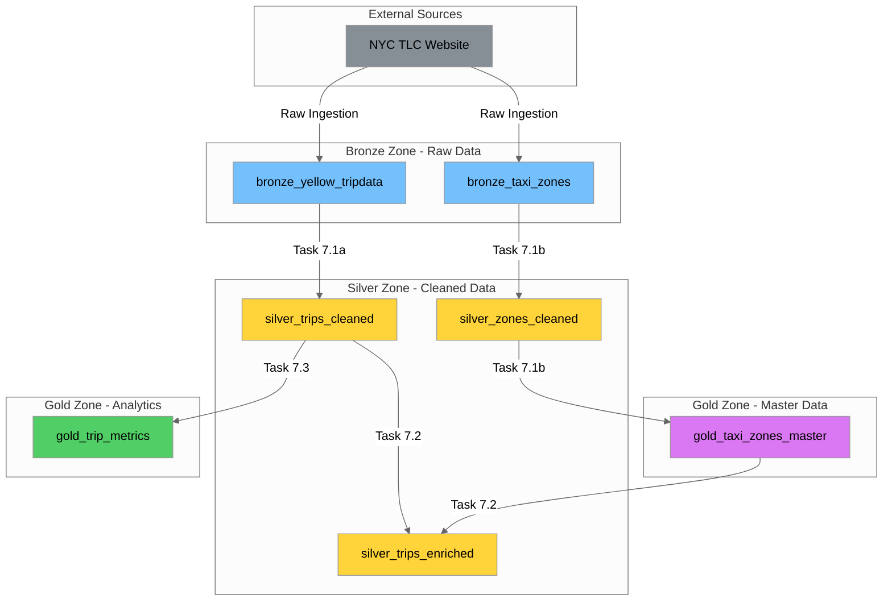
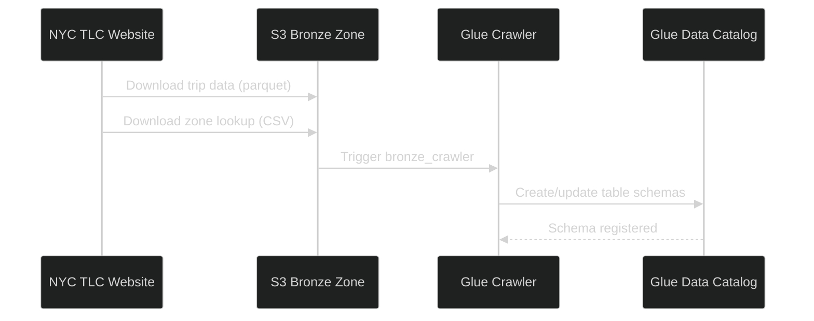
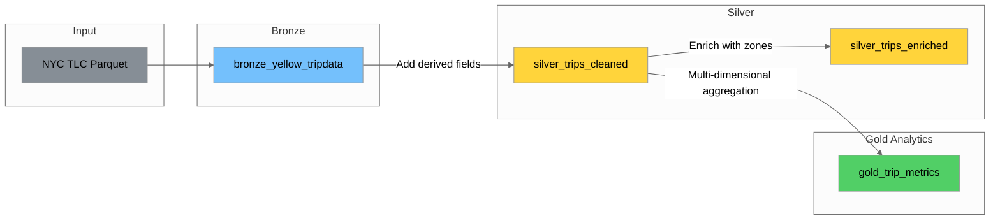

# Day 7 Task 7.6: Data Lineage Documentation

## Overview

This document provides comprehensive data lineage documentation for the NYC Taxi data pipeline, showing how data flows through all zones (Bronze → Silver → Gold) and the transformations applied at each step.

**Pipeline Purpose:** Transform raw NYC Yellow Taxi trip data into analytics-ready datasets and maintain master data for taxi zones.

**Data Lake Location:** `s3://day-6-datalake-nyc-data/`

---

## Data Lineage Diagram

**Legend:**
- 🔵 **Blue (#74c0fc):** Bronze Zone - Raw data
- 🟡 **Yellow (#ffd43b):** Silver Zone - Cleaned and enriched data
- 🟢 **Green (#51cf66):** Gold Zone - Analytics aggregations
- 🟣 **Purple (#da77f2):** Gold Zone - Master data (golden records)
- ⚫ **Gray (#868e96):** External sources

---

## Lineage Documentation Table

| Table | Source | Transformation | Destination |
|-------|--------|----------------|-------------|
| `bronze_yellow_tripdata` | NYC TLC Website | Raw ingestion (parquet) | `silver_trips_cleaned` |
| `bronze_taxi_zones` | NYC TLC Website | Raw ingestion (CSV/parquet) | `silver_zones_cleaned` |
| `silver_trips_cleaned` | `bronze_yellow_tripdata` | Derive fields, decode values, add business flags | `silver_trips_enriched`, `gold_trip_metrics` |
| `silver_zones_cleaned` | `bronze_taxi_zones` | Add zone_type, is_airport classification | `gold_taxi_zones_master` |
| `gold_taxi_zones_master` | `silver_zones_cleaned` | Add MDM governance fields (version, effective dates, steward) | `silver_trips_enriched` |
| `silver_trips_enriched` | `silver_trips_cleaned` + `gold_taxi_zones_master` | Broadcast join enrichment with zone info | End of pipeline |
| `gold_trip_metrics` | `silver_trips_cleaned` | Multi-dimensional aggregation (trip_date, trip_hour, PULocationID, payment_method) | End of pipeline |

---

## Source Systems and Ingestion

### External Source: NYC TLC Website

| Attribute | Value |
|-----------|-------|
| **Source URL** | https://www.nyc.gov/site/tlc/about/tlc-trip-record-data.page |
| **Data Owner** | NYC Taxi and Limousine Commission (TLC) |
| **Ingestion Frequency** | Monthly (new data released monthly) |
| **Data Format** | Parquet (trip data), CSV (zone lookup) |
| **Current Dataset** | August 2025 Yellow Taxi Trip Records |

### Ingestion Process

---

## Transformation Logic by Zone

### Bronze Zone (Raw Data)

**Purpose:** Store raw data exactly as received from source systems.

| Table | S3 Path | Format | Records | Description |
|-------|---------|--------|---------|-------------|
| `bronze_yellow_tripdata` | `s3://day-6-datalake-nyc-data/bronze/yellow_tripdata/` | Parquet | ~3.5M | Raw trip records |
| `bronze_taxi_zones` | `s3://day-6-datalake-nyc-data/bronze/taxi_zones/` | Parquet/CSV | 265 | Raw zone lookup |

**Transformations Applied:** None (raw data preserved)

---

### Silver Zone (Cleaned Data)

**Purpose:** Clean, validate, and enrich data with derived fields.

#### silver_trips_cleaned

**Source:** `bronze_yellow_tripdata`  
**Transformation Job:** [`pyspark-trip-transformations.py`](pyspark-trip-transformations.py)  
**S3 Path:** `s3://day-6-datalake-nyc-data/silver/trips_cleaned/`

**Transformations Applied:**

| Category | Field | Formula | Business Purpose |
|----------|-------|---------|------------------|
| **Time** | `trip_duration_minutes` | `(dropoff - pickup) / 60` | Trip length analysis |
| **Time** | `trip_hour` | `hour(pickup_datetime)` | Peak hour analysis |
| **Time** | `trip_day_of_week` | `dayofweek(pickup_datetime)` | Weekday vs weekend patterns |
| **Time** | `trip_date` | `date(pickup_datetime)` | Daily aggregations |
| **Efficiency** | `speed_mph` | `trip_distance / (duration_hours)` | Trip efficiency analysis |
| **Pricing** | `fare_per_mile` | `fare_amount / trip_distance` | Pricing analysis |
| **Pricing** | `fare_per_minute` | `fare_amount / trip_duration_minutes` | Time-based pricing |
| **Tipping** | `tip_percentage` | `tip_amount / fare_amount * 100` | Tipping behavior |
| **Flags** | `is_airport_trip` | `RatecodeID IN (2, 3)` | Airport trip identification |
| **Flags** | `is_rush_hour` | `trip_hour IN (7-9, 17-19)` | Rush hour identification |
| **Flags** | `is_weekend` | `dayofweek IN (1, 7)` | Weekend identification |
| **Decoded** | `payment_method` | Decode `payment_type` | Human-readable payment |
| **Decoded** | `vendor_name` | Decode `VendorID` | Human-readable vendor |
| **Decoded** | `rate_type` | Decode `RatecodeID` | Human-readable rate |
| **Metadata** | `processed_at` | `current_timestamp()` | Processing timestamp |

---

#### silver_zones_cleaned

**Source:** `bronze_taxi_zones`  
**Transformation Job:** [`pyspark-zone-transformations.py`](pyspark-zone-transformations.py)  
**S3 Path:** `s3://day-6-datalake-nyc-data/silver/zones_cleaned/`

**Transformations Applied:**

| Field | Formula | Business Purpose |
|-------|---------|------------------|
| `zone_type` | Decode `service_zone` to classification | Zone classification |
| `is_airport` | `service_zone IN ('Airports', 'EWR')` | Airport identification |
| `processed_at` | `current_timestamp()` | Processing timestamp |

**Zone Type Mapping:**

| service_zone | zone_type |
|--------------|-----------|
| Yellow Zone | Core Manhattan |
| Boro Zone | Outer Borough |
| Airports | Airport |
| EWR | Newark Airport |
| Other | Other |

---

#### silver_trips_enriched

**Sources:** `silver_trips_cleaned` + `gold_taxi_zones_master`  
**Transformation Job:** [`master-data-enrichment.py`](master-data-enrichment.py)  
**S3 Path:** `s3://day-6-datalake-nyc-data/silver/trips_enriched/`

**Transformations Applied:**

| Category | Fields Added | Join Type | Description |
|----------|--------------|-----------|-------------|
| **Pickup Zone** | `pickup_zone_name`, `pickup_borough`, `pickup_service_zone`, `pickup_zone_type`, `pickup_is_airport` | LEFT JOIN (broadcast) | Zone info for pickup location |
| **Dropoff Zone** | `dropoff_zone_name`, `dropoff_borough`, `dropoff_service_zone`, `dropoff_zone_type`, `dropoff_is_airport` | LEFT JOIN (broadcast) | Zone info for dropoff location |
| **Metadata** | `enriched_at` | N/A | Enrichment timestamp |

**Join Strategy:** Broadcast join used because zones table (~265 rows) is small enough to fit in memory on all executors.

---

### Gold Zone (Analytics + Master Data)

**Purpose:** Aggregated analytics datasets and master data (golden records).

#### gold_taxi_zones_master (Master Data)

**Source:** `silver_zones_cleaned`  
**Transformation Job:** [`pyspark-zone-transformations.py`](pyspark-zone-transformations.py)  
**S3 Path:** `s3://day-6-datalake-nyc-data/gold/taxi_zones_master/`

**MDM Governance Fields Added:**

| Field | Value | Purpose |
|-------|-------|---------|
| `golden_record_id` | `monotonically_increasing_id()` | Unique identifier for golden record |
| `effective_from` | `current_timestamp()` | Version start date |
| `effective_to` | `9999-12-31` | Version end date (current = far future) |
| `is_current` | `True` | Current version flag |
| `version` | `1` | Version number |
| `source_system` | `NYC TLC` | Origin system |
| `data_steward` | `MDM Team` | Responsible team |

---

#### gold_trip_metrics (Consolidated Analytics Fact Table)

**Source:** `silver_trips_cleaned`
**Transformation Job:** [`pyspark-aggregations.py`](pyspark-aggregations.py)
**S3 Path:** `s3://day-6-datalake-nyc-data/gold/trip_metrics/`
**Partition Key:** `trip_date`

**Dimensions:**

| Dimension | Description |
|-----------|-------------|
| `trip_date` | Date of pickup (partition key) |
| `trip_hour` | Hour of pickup (0-23) |
| `PULocationID` | Pickup zone ID |
| `payment_method` | Decoded payment type |

**Additive Metrics (safe for rollup):**

| Metric | Description |
|--------|-------------|
| `trip_count` | Number of trips |
| `sum_revenue` | Total revenue (total_amount) |
| `sum_fare` | Total fare amount |
| `sum_tips` | Total tip amount |
| `sum_distance` | Total distance traveled |
| `sum_duration_min` | Total trip duration in minutes |
| `sum_tip_pct` | Sum of tip percentages |

**Average Metrics (base level only - do NOT rollup):**

| Metric | Description |
|--------|-------------|
| `avg_fare` | Average fare amount |
| `avg_tip` | Average tip amount |
| `avg_tip_pct` | Average tip percentage |
| `avg_distance` | Average trip distance |
| `avg_duration_min` | Average trip duration |
| `avg_speed_mph` | Average speed |

**Business Purpose:** Consolidated multi-dimensional fact table enabling flexible analytics across zones, time periods, and payment methods. Replaces the previous 4 separate aggregation tables (`gold_trips_per_zone`, `gold_hourly_metrics`, `gold_daily_summary`, `gold_payment_analysis`).

**Query Examples:**
- Zone analysis: `GROUP BY PULocationID`
- Hourly patterns: `GROUP BY trip_hour`
- Daily summary: `GROUP BY trip_date`
- Payment analysis: `GROUP BY payment_method`
- Cross-dimensional: `GROUP BY trip_date, trip_hour, payment_method`

---

## Data Freshness SLAs

| Zone | Table | Refresh Frequency | SLA | Crawler Schedule |
|------|-------|-------------------|-----|------------------|
| Bronze | `bronze_yellow_tripdata` | Monthly | Within 24 hours of TLC release | Daily at 6 AM UTC |
| Bronze | `bronze_taxi_zones` | As needed | Within 24 hours of update | Daily at 6 AM UTC |
| Silver | `silver_trips_cleaned` | After Bronze refresh | Within 2 hours of Bronze update | Daily at 7 AM UTC |
| Silver | `silver_zones_cleaned` | After Bronze refresh | Within 2 hours of Bronze update | Daily at 7 AM UTC |
| Silver | `silver_trips_enriched` | After Silver refresh | Within 2 hours of Silver update | Daily at 7 AM UTC |
| Gold | `gold_taxi_zones_master` | After Silver refresh | Within 1 hour of Silver update | Daily at 8 AM UTC |
| Gold | `gold_trip_metrics` | After Silver refresh | Within 1 hour of Silver update | Daily at 8 AM UTC |

---

## Lineage in Glue Data Catalog

Lineage information is stored in AWS Glue Data Catalog table properties. This enables:
- Automated impact analysis
- Data discovery
- Governance compliance

### Table Properties for Lineage

Each table in the Glue Data Catalog includes the following lineage properties:

| Property | Description | Example |
|----------|-------------|---------|
| `source_tables` | Upstream tables this table depends on | `bronze_yellow_tripdata` |
| `derived_from` | External source system or file | `NYC TLC Website` |
| `transformation_job` | Glue/Spark job that creates this table | `pyspark-trip-transformations` |
| `downstream_tables` | Tables that depend on this table | `silver_trips_enriched,gold_trips_per_zone` |
| `lineage_updated` | Timestamp of last lineage update | `2026-01-04T10:00:00Z` |

### Lineage Metadata by Table

| Table | source_tables | transformation_job | downstream_tables |
|-------|---------------|-------------------|-------------------|
| `bronze_yellow_tripdata` | *(external)* | *(raw ingestion)* | `silver_trips_cleaned` |
| `bronze_taxi_zones` | *(external)* | *(raw ingestion)* | `silver_zones_cleaned`, `gold_taxi_zones_master` |
| `silver_trips_cleaned` | `bronze_yellow_tripdata` | `pyspark-trip-transformations` | `silver_trips_enriched`, `gold_trip_metrics` |
| `silver_zones_cleaned` | `bronze_taxi_zones` | `pyspark-zone-transformations` | `gold_taxi_zones_master` |
| `silver_trips_enriched` | `silver_trips_cleaned`, `gold_taxi_zones_master` | `master-data-enrichment` | *(end of pipeline)* |
| `gold_taxi_zones_master` | `silver_zones_cleaned` | `pyspark-zone-transformations` | `silver_trips_enriched` |
| `gold_trip_metrics` | `silver_trips_cleaned` | `pyspark-aggregations` | *(end of pipeline)* |

### Glue Catalog Setup

Lineage metadata is configured in [`glue-catalog-crawler-setup.py`](glue-catalog-crawler-setup.py) which:

1. Creates the `nyc_taxi_db` database
2. Creates crawlers for each zone (bronze, silver, gold)
3. Runs crawlers to auto-discover schemas
4. Adds governance and lineage metadata to all tables
5. Schedules crawlers for daily schema updates

---

## Data Flow Summary

### Trip Data Flow

### Zone Data Flow (Master Data)

```mermaid
%%{init: {'theme':'neutral'}}%%
flowchart LR
    subgraph Input["Input"]
        A["NYC TLC Zone Lookup"]
    end
    
    subgraph Bronze["Bronze"]
        B["bronze_taxi_zones"]
    end
    
    subgraph Silver["Silver"]
        C["silver_zones_cleaned"]
    end
    
    subgraph Gold["Gold Master"]
        D["gold_taxi_zones_master"]
    end
    
    subgraph Usage["Usage"]
        E["silver_trips_enriched"]
    end
    
    A --> B
    B -->|"Add zone_type, is_airport"| C
    C -->|"Add MDM governance fields"| D
    D -->|"Broadcast join"| E
    
    style A fill:#868e96,color:#000
    style B fill:#74c0fc,color:#000
    style C fill:#ffd43b,color:#000
    style D fill:#da77f2,color:#000
    style E fill:#ffd43b,color:#000
```

---

## Governance Metadata

### Data Classification

| Table | Classification | PII Flag | Retention |
|-------|---------------|----------|-----------|
| `bronze_yellow_tripdata` | Internal | No | 365 days |
| `bronze_taxi_zones` | Reference Data | No | Indefinite |
| `silver_trips_cleaned` | Internal | No | 365 days |
| `silver_zones_cleaned` | Reference Data | No | Indefinite |
| `silver_trips_enriched` | Internal | No | 365 days |
| `gold_taxi_zones_master` | Master Data | No | Indefinite |
| `gold_trip_metrics` | Analytics | No | 365 days |

### Data Ownership

| Table | Data Owner | Data Steward | Domain |
|-------|------------|--------------|--------|
| `bronze_yellow_tripdata` | NYC TLC | Data Engineering | Transportation |
| `bronze_taxi_zones` | NYC TLC | Data Engineering | Transportation |
| `silver_trips_cleaned` | Data Engineering | Data Engineering | Transportation |
| `silver_zones_cleaned` | Data Engineering | Data Engineering | Transportation |
| `silver_trips_enriched` | Data Engineering | Data Engineering | Transportation |
| `gold_taxi_zones_master` | MDM Team | MDM Team | Transportation |
| `gold_trip_metrics` | Analytics Team | Analytics Team | Transportation |

---

## Related Documentation

- [`pyspark-trip-transformations.py`](pyspark-trip-transformations.py) - Task 7.1a: Trip data transformations
- [`pyspark-zone-transformations.py`](pyspark-zone-transformations.py) - Task 7.1b: Zone data transformations
- [`master-data-enrichment.py`](master-data-enrichment.py) - Task 7.2: Master data enrichment
- [`pyspark-aggregations.py`](pyspark-aggregations.py) - Task 7.3: Aggregation transformations
- [`spark-optimization-notes.md`](spark-optimization-notes.md) - Task 7.4: Spark optimization techniques
- [`glue-catalog-crawler-setup.py`](glue-catalog-crawler-setup.py) - Task 7.5: Glue catalog and crawler setup

---

*Last updated: 2026-01-04*