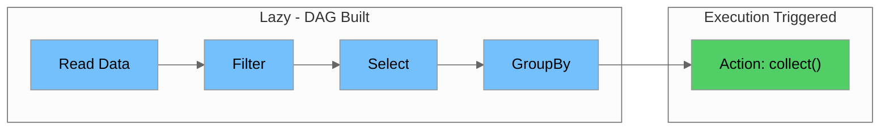
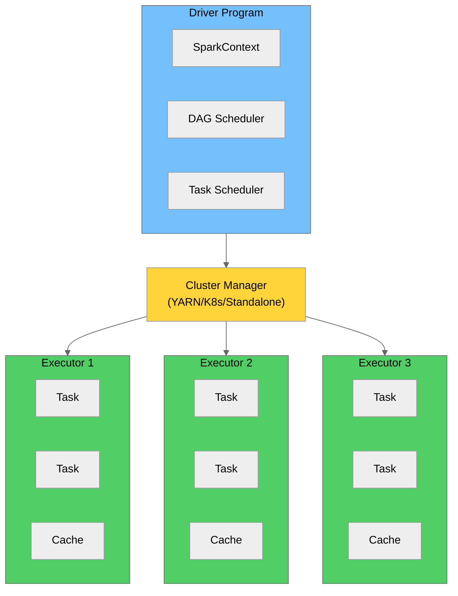
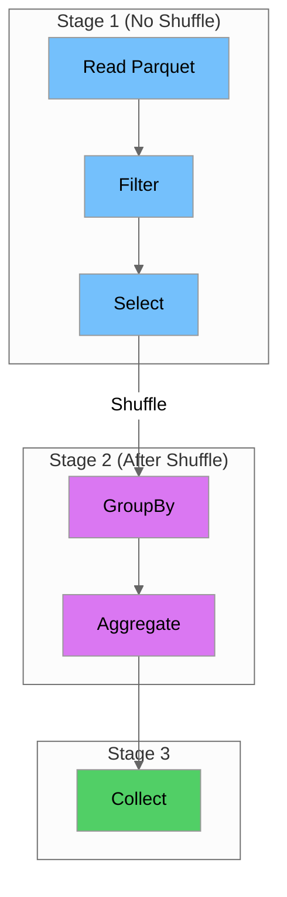
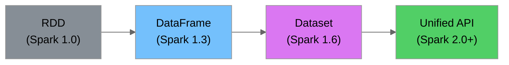
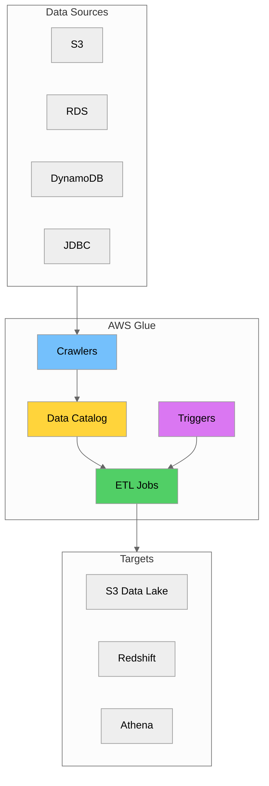
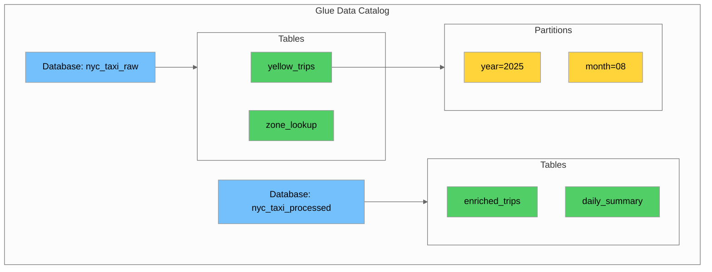
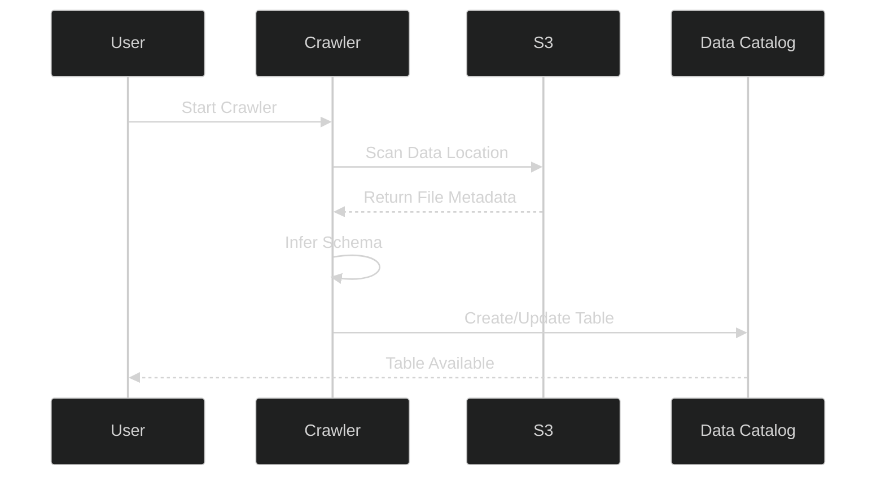
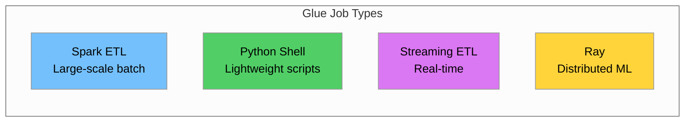

# Day 7: Introduction to Apache Spark and AWS Glue

## Table of Contents

- [Introduction \& Learning Objectives](#introduction--learning-objectives)
- [Part 1: Apache Spark Fundamentals](#part-1-apache-spark-fundamentals)
- [Part 2: Spark Architecture Deep Dive](#part-2-spark-architecture-deep-dive)
- [Part 3: RDDs, DataFrames, and Datasets](#part-3-rdds-dataframes-and-datasets)
- [Part 4: Spark Transformations and Actions](#part-4-spark-transformations-and-actions)
- [Part 5: AWS Glue Overview](#part-5-aws-glue-overview)
- [Part 6: Glue Data Catalog](#part-6-glue-data-catalog)
- [Part 7: Glue Crawlers](#part-7-glue-crawlers)
- [Part 8: Glue Job Types and DPUs](#part-8-glue-job-types-and-dpus)
- [Part 9: Built-in Transformations and Data Quality](#part-9-built-in-transformations-and-data-quality)
- [Part 10: Hands-on Labs](#part-10-hands-on-labs)
- [Summary \& Key Takeaways](#summary--key-takeaways)
- [Additional Resources](#additional-resources)

---

## Introduction & Learning Objectives

### Overview

Day 7 continues **Week 2** of your Data Engineering training. Today we explore **Apache Spark** - the industry-standard distributed computing framework - and **AWS Glue** - Amazon's fully managed ETL service. You'll learn how Spark processes data at scale, understand its lazy evaluation model, and discover how AWS Glue simplifies building and running ETL pipelines.

### Prerequisites

Before starting Day 7, ensure you have:

- ✅ Completed Day 6 (Data Lake Concepts & Modern Storage)
- ✅ AWS account with Glue and S3 access configured
- ✅ Python environment with PySpark installed
- ✅ Understanding of data lake architecture (Bronze/Silver/Gold zones)
- ✅ Familiarity with Parquet file format

### Learning Objectives

By the end of Day 7, you will be able to:

1. **Explain** Apache Spark's architecture and its main components (Driver, Executors, Cluster Manager)
2. **Understand** Spark's lazy evaluation and DAG execution model
3. **Differentiate** between RDDs, DataFrames, and Datasets
4. **Apply** Spark transformations and actions to process NYC taxi data
5. **Configure** AWS Glue Data Catalog for metadata management
6. **Create** and schedule Glue Crawlers for automatic schema discovery
7. **Choose** appropriate Glue job types (Spark, Python Shell, Streaming)
8. **Optimize** Spark jobs using partitioning, caching, and broadcast joins
9. **Implement** master data lookups and enrichment patterns

---

## Part 1: Apache Spark Fundamentals

### 1.1 What is Apache Spark?

**Apache Spark** is a unified analytics engine for large-scale data processing. It provides high-level APIs in Java, Scala, Python (PySpark), and R, along with an optimized engine that supports general execution graphs.

### 1.2 Why Spark?

| Feature | Description | Benefit |
|---------|-------------|---------|
| **Speed** | In-memory processing, 100x faster than Hadoop MapReduce | Faster insights |
| **Ease of Use** | High-level APIs in Python, Scala, Java, R | Developer productivity |
| **Unified Engine** | Batch, streaming, ML, graph processing | Single platform |
| **Fault Tolerance** | Automatic recovery from failures | Reliability |
| **Scalability** | Scales from single machine to thousands of nodes | Handle any data size |

### 1.3 Lazy Evaluation

**Lazy evaluation** is a core concept in Spark. Transformations are not executed immediately - instead, Spark builds a **Directed Acyclic Graph (DAG)** of operations and only executes when an **action** is called.



#### Benefits of Lazy Evaluation

| Benefit | Description |
|---------|-------------|
| **Optimization** | Spark can optimize the entire query plan before execution |
| **Efficiency** | Avoids unnecessary computations |
| **Pipelining** | Combines multiple operations into single passes over data |
| **Fault Tolerance** | Can recompute lost partitions from lineage |

#### Example: Lazy Evaluation in Action

\`\`\`python
from pyspark.sql import SparkSession

# Create Spark session
spark = SparkSession.builder \
    .appName("Lazy Evaluation Demo") \
    .getOrCreate()

# Read NYC Taxi data - NO execution yet
df = spark.read.parquet("data/yellow_tripdata_2025-08.parquet")

# Apply transformations - still NO execution
filtered_df = df.filter(df.trip_distance > 5)
selected_df = filtered_df.select("VendorID", "trip_distance", "total_amount")
grouped_df = selected_df.groupBy("VendorID").avg("total_amount")

# At this point, Spark has only built a DAG
# No data has been processed yet!

# Action triggers execution
result = grouped_df.collect()  # NOW Spark executes the entire DAG
print(result)
\`\`\`

---

## Part 2: Spark Architecture Deep Dive

### 2.1 Spark Cluster Architecture

A Spark application consists of a **Driver** program that coordinates the execution of tasks across a cluster of **Executors**.



### 2.2 Component Responsibilities

| Component | Responsibility |
|-----------|---------------|
| **Driver** | Runs the main() function, creates SparkContext, builds DAG, schedules tasks |
| **SparkContext** | Entry point to Spark functionality, coordinates with cluster manager |
| **Cluster Manager** | Allocates resources across applications (YARN, Kubernetes, Standalone) |
| **Executor** | JVM process that runs tasks and stores data in memory/disk |
| **Task** | Unit of work sent to an executor |

### 2.3 DAG Execution Model

When you call an action, Spark's DAG Scheduler converts the logical plan into a physical execution plan.



### 2.4 Stages and Shuffles

Spark divides the DAG into **stages** based on **shuffle boundaries**. A shuffle occurs when data needs to be redistributed across partitions (e.g., during groupBy, join, repartition).

### 2.5 Partitions

Data in Spark is divided into **partitions** - logical chunks that can be processed in parallel.

\`\`\`python
from pyspark.sql import SparkSession

spark = SparkSession.builder.appName("Partitions Demo").getOrCreate()

# Read NYC Taxi data
df = spark.read.parquet("data/yellow_tripdata_2025-08.parquet")

# Check number of partitions
print(f"Number of partitions: {df.rdd.getNumPartitions()}")

# Repartition for better parallelism
df_repartitioned = df.repartition(8)
print(f"After repartition: {df_repartitioned.rdd.getNumPartitions()}")

# Coalesce to reduce partitions (no shuffle)
df_coalesced = df_repartitioned.coalesce(4)
print(f"After coalesce: {df_coalesced.rdd.getNumPartitions()}")
\`\`\`

| Operation | Description | Shuffle? |
|-----------|-------------|----------|
| repartition(n) | Increase or decrease partitions | Yes |
| coalesce(n) | Decrease partitions only | No |
| partitionBy(col) | Partition by column values | Yes |

---

## Part 3: RDDs, DataFrames, and Datasets

### 3.1 Evolution of Spark APIs

Spark APIs have evolved from RDDs (Spark 1.0) to DataFrames (Spark 1.3) to Datasets (Spark 1.6) to the Unified API (Spark 2.0+).



### 3.2 RDD (Resilient Distributed Dataset)

**RDDs** are the fundamental data structure in Spark - an immutable, distributed collection of objects.

#### Characteristics

| Characteristic | Description |
|----------------|-------------|
| **Resilient** | Fault-tolerant through lineage |
| **Distributed** | Data spread across cluster nodes |
| **Immutable** | Cannot be modified after creation |
| **Lazy** | Transformations are not executed immediately |

### 3.3 DataFrame

**DataFrames** are distributed collections of data organized into named columns, similar to tables in a relational database.

#### Advantages over RDDs

| Advantage | Description |
|-----------|-------------|
| **Schema** | Named columns with data types |
| **Optimization** | Catalyst optimizer for query planning |
| **Performance** | Tungsten execution engine |
| **Interoperability** | Easy conversion to/from Pandas |

#### DataFrame Example with NYC Taxi Data

\`\`\`python
from pyspark.sql import SparkSession
from pyspark.sql.functions import col, avg, sum, count

spark = SparkSession.builder.appName("DataFrame Demo").getOrCreate()

# Read Parquet file as DataFrame
df = spark.read.parquet("data/yellow_tripdata_2025-08.parquet")

# Show schema
df.printSchema()

# Basic operations
df.select("VendorID", "trip_distance", "total_amount") \
    .filter(col("trip_distance") > 5) \
    .groupBy("VendorID") \
    .agg(
        count("*").alias("trip_count"),
        avg("total_amount").alias("avg_fare"),
        sum("total_amount").alias("total_revenue")
    ) \
    .show()
\`\`\`

### 3.4 Comparison Table

| Feature | RDD | DataFrame | Dataset |
|---------|-----|-----------|---------|
| **Type Safety** | Yes (compile-time) | No | Yes (Scala/Java) |
| **Optimization** | No | Yes (Catalyst) | Yes (Catalyst) |
| **Schema** | No | Yes | Yes |
| **Serialization** | Java/Kryo | Tungsten | Tungsten |
| **API** | Functional | Declarative | Both |
| **Use Case** | Low-level control | SQL-like operations | Type-safe operations |
| **Python Support** | Full | Full | Limited (Row-based) |

---

## Part 4: Spark Transformations and Actions

### 4.1 Transformations vs Actions

| Type | Description | Examples | Execution |
|------|-------------|----------|-----------|
| **Transformation** | Creates new RDD/DataFrame from existing one | filter, map, select, groupBy | Lazy |
| **Action** | Returns result to driver or writes to storage | count, collect, show, write | Immediate |

### 4.2 Common Transformations

#### Narrow Transformations (No Shuffle)

\`\`\`python
from pyspark.sql import SparkSession
from pyspark.sql.functions import col, when, lit

spark = SparkSession.builder.appName("Transformations").getOrCreate()
df = spark.read.parquet("data/yellow_tripdata_2025-08.parquet")

# filter() - Filter rows based on condition
long_trips = df.filter(col("trip_distance") > 10)

# select() - Select specific columns
selected = df.select("VendorID", "trip_distance", "total_amount")

# withColumn() - Add or modify column
with_category = df.withColumn(
    "trip_category",
    when(col("trip_distance") < 2, "short")
    .when(col("trip_distance") < 10, "medium")
    .otherwise("long")
)

# drop() - Remove columns
cleaned = df.drop("store_and_fwd_flag")

# withColumnRenamed() - Rename column
renamed = df.withColumnRenamed("VendorID", "vendor_id")
\`\`\`

#### Wide Transformations (Require Shuffle)

\`\`\`python
from pyspark.sql.functions import avg, sum, count, max, min

# groupBy() + aggregation
vendor_stats = df.groupBy("VendorID").agg(
    count("*").alias("trip_count"),
    avg("trip_distance").alias("avg_distance"),
    sum("total_amount").alias("total_revenue"),
    max("tip_amount").alias("max_tip")
)

# join() - Join two DataFrames
zone_df = spark.read.csv("data/taxi_zone_lookup.csv", header=True)
enriched = df.join(
    zone_df,
    df.PULocationID == zone_df.LocationID,
    "left"
)

# distinct() - Remove duplicates
unique_vendors = df.select("VendorID").distinct()

# orderBy() / sort() - Sort data
sorted_df = df.orderBy(col("total_amount").desc())
\`\`\`

### 4.3 Common Actions

\`\`\`python
# count() - Count rows
total_trips = df.count()
print(f"Total trips: {total_trips}")

# show() - Display rows
df.show(5)

# collect() - Return all rows to driver (use with caution!)
small_result = df.limit(10).collect()

# first() / head() - Return first row(s)
first_row = df.first()
first_five = df.head(5)

# take() - Return n rows
sample = df.take(10)

# describe() - Summary statistics
df.describe("trip_distance", "total_amount").show()

# write - Write to storage
df.write.parquet("output/processed_trips")
df.write.mode("overwrite").csv("output/trips_csv")
\`\`\`

### 4.4 NYC Taxi Data Transformation Pipeline

\`\`\`python
from pyspark.sql import SparkSession
from pyspark.sql.functions import (
    col, when, hour, dayofweek, 
    avg, sum, count, round as spark_round
)

spark = SparkSession.builder \
    .appName("NYC Taxi Transformations") \
    .getOrCreate()

# Read source data
trips_df = spark.read.parquet("data/yellow_tripdata_2025-08.parquet")
zones_df = spark.read.csv("data/taxi_zone_lookup.csv", header=True, inferSchema=True)

# Step 1: Clean and filter data
cleaned_df = trips_df \
    .filter(col("trip_distance") > 0) \
    .filter(col("total_amount") > 0) \
    .filter(col("passenger_count") > 0)

# Step 2: Add derived columns
enriched_df = cleaned_df \
    .withColumn("pickup_hour", hour(col("tpep_pickup_datetime"))) \
    .withColumn("pickup_day", dayofweek(col("tpep_pickup_datetime"))) \
    .withColumn(
        "time_of_day",
        when(col("pickup_hour").between(6, 11), "morning")
        .when(col("pickup_hour").between(12, 17), "afternoon")
        .when(col("pickup_hour").between(18, 21), "evening")
        .otherwise("night")
    ) \
    .withColumn(
        "tip_percentage",
        spark_round((col("tip_amount") / col("fare_amount")) * 100, 2)
    )

# Step 3: Join with zone lookup for pickup location
with_pickup_zone = enriched_df.join(
    zones_df.select(
        col("LocationID").alias("PULocationID"),
        col("Borough").alias("pickup_borough"),
        col("Zone").alias("pickup_zone")
    ),
    on="PULocationID",
    how="left"
)

# Step 4: Join with zone lookup for dropoff location
with_zones = with_pickup_zone.join(
    zones_df.select(
        col("LocationID").alias("DOLocationID"),
        col("Borough").alias("dropoff_borough"),
        col("Zone").alias("dropoff_zone")
    ),
    on="DOLocationID",
    how="left"
)

# Step 5: Aggregate by time of day and borough
daily_summary = with_zones.groupBy("time_of_day", "pickup_borough").agg(
    count("*").alias("trip_count"),
    spark_round(avg("trip_distance"), 2).alias("avg_distance"),
    spark_round(avg("total_amount"), 2).alias("avg_fare"),
    spark_round(avg("tip_percentage"), 2).alias("avg_tip_pct"),
    spark_round(sum("total_amount"), 2).alias("total_revenue")
).orderBy("pickup_borough", "time_of_day")

# Show results
daily_summary.show(20)

# Write to Parquet
with_zones.write \
    .mode("overwrite") \
    .partitionBy("pickup_borough") \
    .parquet("output/enriched_trips")
\`\`\`

---

## Part 5: AWS Glue Overview

### 5.1 What is AWS Glue?

**AWS Glue** is a fully managed extract, transform, and load (ETL) service that makes it easy to prepare and load data for analytics.



### 5.2 Key Features

| Feature | Description | Benefit |
|---------|-------------|---------|
| **Serverless** | No infrastructure to manage | Reduced operational overhead |
| **Data Catalog** | Central metadata repository | Single source of truth |
| **Crawlers** | Automatic schema discovery | No manual schema definition |
| **Visual ETL** | Drag-and-drop job authoring | Faster development |
| **Spark-based** | Built on Apache Spark | Scalable processing |
| **Pay-per-use** | Billed by DPU-hours | Cost-effective |

### 5.3 Glue vs EMR vs Athena

| Feature | AWS Glue | Amazon EMR | Amazon Athena |
|---------|----------|------------|---------------|
| **Type** | Managed ETL | Managed Hadoop/Spark | Serverless Query |
| **Use Case** | ETL pipelines | Complex processing | Ad-hoc queries |
| **Management** | Fully managed | Semi-managed | Fully managed |
| **Pricing** | DPU-hours | Instance hours | Per query (data scanned) |
| **Best For** | Scheduled ETL | Long-running clusters | Interactive analysis |

---

## Part 6: Glue Data Catalog

### 6.1 What is the Glue Data Catalog?

The **AWS Glue Data Catalog** is a centralized metadata repository that stores table definitions, schema information, and other metadata. It's compatible with Apache Hive Metastore.



### 6.2 Catalog Components

| Component | Description | Example |
|-----------|-------------|---------|
| **Database** | Logical grouping of tables | nyc_taxi_raw, nyc_taxi_processed |
| **Table** | Metadata definition for data | yellow_trips, zone_lookup |
| **Partition** | Subset of table data | year=2025/month=08 |
| **Column** | Field definition with type | trip_distance DOUBLE |
| **Connection** | Credentials for data sources | JDBC connection to RDS |

### 6.3 Creating a Database

\`\`\`python
import boto3

glue = boto3.client('glue')

# Create database for raw data
response = glue.create_database(
    DatabaseInput={
        'Name': 'nyc_taxi_raw',
        'Description': 'Raw NYC Taxi trip data - Bronze layer',
        'LocationUri': 's3://nyc-taxi-data-lake/bronze/',
        'Parameters': {
            'created_by': 'data_engineering_team',
            'layer': 'bronze'
        }
    }
)

print("Database created successfully!")
\`\`\`

### 6.4 Creating a Table Manually

\`\`\`python
import boto3

glue = boto3.client('glue')

# Create table for yellow taxi trips
response = glue.create_table(
    DatabaseName='nyc_taxi_raw',
    TableInput={
        'Name': 'yellow_trips',
        'Description': 'NYC Yellow Taxi trip records',
        'StorageDescriptor': {
            'Columns': [
                {'Name': 'vendorid', 'Type': 'bigint', 'Comment': 'TPEP provider code'},
                {'Name': 'tpep_pickup_datetime', 'Type': 'timestamp', 'Comment': 'Pickup time'},
                {'Name': 'tpep_dropoff_datetime', 'Type': 'timestamp', 'Comment': 'Dropoff time'},
                {'Name': 'passenger_count', 'Type': 'double', 'Comment': 'Number of passengers'},
                {'Name': 'trip_distance', 'Type': 'double', 'Comment': 'Trip distance in miles'},
                {'Name': 'pulocationid', 'Type': 'bigint', 'Comment': 'Pickup location ID'},
                {'Name': 'dolocationid', 'Type': 'bigint', 'Comment': 'Dropoff location ID'},
                {'Name': 'payment_type', 'Type': 'bigint', 'Comment': 'Payment type code'},
                {'Name': 'fare_amount', 'Type': 'double', 'Comment': 'Base fare'},
                {'Name': 'tip_amount', 'Type': 'double', 'Comment': 'Tip amount'},
                {'Name': 'total_amount', 'Type': 'double', 'Comment': 'Total amount'}
            ],
            'Location': 's3://nyc-taxi-data-lake/bronze/yellow_tripdata/',
            'InputFormat': 'org.apache.hadoop.hive.ql.io.parquet.MapredParquetInputFormat',
            'OutputFormat': 'org.apache.hadoop.hive.ql.io.parquet.MapredParquetOutputFormat',
            'SerdeInfo': {
                'SerializationLibrary': 'org.apache.hadoop.hive.ql.io.parquet.serde.ParquetHiveSerDe'
            }
        },
        'PartitionKeys': [
            {'Name': 'year', 'Type': 'int'},
            {'Name': 'month', 'Type': 'int'}
        ],
        'TableType': 'EXTERNAL_TABLE'
    }
)

print("Table created successfully!")
\`\`\`

---

## Part 7: Glue Crawlers

### 7.1 What are Glue Crawlers?

**Glue Crawlers** automatically discover data schemas by scanning data sources and populating the Data Catalog with table definitions.



### 7.2 Crawler Configuration Options

| Option | Description | Values |
|--------|-------------|--------|
| **Data Source** | Where to scan for data | S3, JDBC, DynamoDB, MongoDB |
| **IAM Role** | Permissions for crawler | Role with S3 and Glue access |
| **Database** | Target database for tables | Existing or new database |
| **Table Prefix** | Prefix for created tables | e.g., raw_, bronze_ |
| **Schedule** | When to run crawler | On-demand, hourly, daily, cron |
| **Schema Change Policy** | How to handle schema changes | Update, Add new columns, Ignore |

### 7.3 Creating a Crawler with boto3

\`\`\`python
import boto3

glue = boto3.client('glue')

# Create crawler for NYC Taxi bronze data
response = glue.create_crawler(
    Name='nyc-taxi-bronze-crawler',
    Role='arn:aws:iam::123456789012:role/GlueCrawlerRole',
    DatabaseName='nyc_taxi_raw',
    Description='Crawl bronze layer NYC taxi data',
    Targets={
        'S3Targets': [
            {
                'Path': 's3://nyc-taxi-data-lake/bronze/yellow_tripdata/',
                'Exclusions': [
                    '_temporary/**',
                    '_spark_metadata/**',
                    '*.crc'
                ]
            }
        ]
    },
    SchemaChangePolicy={
        'UpdateBehavior': 'UPDATE_IN_DATABASE',
        'DeleteBehavior': 'LOG'
    },
    Tags={
        'Environment': 'development',
        'Project': 'nyc-taxi-analytics'
    }
)

print(f"Crawler created: {response}")
\`\`\`

### 7.4 Running and Scheduling Crawlers

\`\`\`python
import boto3

glue = boto3.client('glue')

# Start the crawler
glue.start_crawler(Name='nyc-taxi-bronze-crawler')
print("Crawler started...")

# Update crawler with schedule (daily at 6 AM UTC)
glue.update_crawler(
    Name='nyc-taxi-bronze-crawler',
    Schedule='cron(0 6 * * ? *)'
)

# Common schedule expressions
schedules = {
    'hourly': 'cron(0 * * * ? *)',
    'daily_6am': 'cron(0 6 * * ? *)',
    'weekly_sunday': 'cron(0 0 ? * SUN *)',
    'monthly_first': 'cron(0 0 1 * ? *)'
}
\`\`\`

### 7.5 Schema Evolution Handling

| Policy | Behavior | Use Case |
|--------|----------|----------|
| **UPDATE_IN_DATABASE** | Update table with new schema | Evolving data sources |
| **LOG** | Log changes but don't modify | Audit trail needed |
| **DELETE_FROM_DATABASE** | Remove columns not in source | Strict schema enforcement |

---

## Part 8: Glue Job Types and DPUs

### 8.1 Glue Job Types Overview



| Job Type | Engine | Best For |
|----------|--------|----------|
| **Spark ETL** | Apache Spark | Large-scale batch processing |
| **Python Shell** | Python runtime | Lightweight scripts |
| **Streaming ETL** | Spark Structured Streaming | Real-time processing |
| **Ray** | Ray framework | Distributed ML workloads |

### 8.2 Spark ETL Jobs

**Spark ETL** jobs are the most common type, using Apache Spark for distributed data processing.

| Feature | Description |
|---------|-------------|
| **Engine** | Apache Spark |
| **Languages** | Python (PySpark), Scala |
| **DPU Range** | 2-100 DPUs (Standard), 0.0625-1 DPU (Flex) |
| **Best For** | Large-scale ETL, complex transformations |
| **Glue Version** | 4.0 (Spark 3.3), 3.0 (Spark 3.1) |

### 8.3 Python Shell Jobs

**Python Shell** jobs are lightweight, single-node jobs for simple ETL tasks.

| Feature | Description |
|---------|-------------|
| **Engine** | Python runtime |
| **DPU** | 0.0625 or 1 DPU |
| **Best For** | Small datasets, API calls, simple transforms |
| **Libraries** | pandas, numpy, boto3, requests |

### 8.4 Streaming ETL Jobs

**Streaming ETL** jobs process data in real-time from streaming sources.

| Feature | Description |
|---------|-------------|
| **Engine** | Spark Structured Streaming |
| **Sources** | Kinesis, Kafka, MSK |
| **Processing** | Micro-batch or continuous |
| **Best For** | Real-time analytics, CDC |

### 8.5 Understanding DPUs

A **DPU** (Data Processing Unit) is a measure of processing power in AWS Glue. Each DPU provides 4 vCPUs and 16 GB of memory.

| Worker Type | DPUs | vCPUs | Memory | Best For |
|-------------|------|-------|--------|----------|
| **Standard** | 1 | 4 | 16 GB | Legacy jobs |
| **G.1X** | 1 | 4 | 16 GB | Memory-intensive |
| **G.2X** | 2 | 8 | 32 GB | ML, large joins |
| **G.4X** | 4 | 16 | 64 GB | Very large datasets |
| **G.8X** | 8 | 32 | 128 GB | Extreme workloads |

### 8.6 Creating a Glue Job

\`\`\`python
import boto3

glue = boto3.client('glue')

# Create Spark ETL job
response = glue.create_job(
    Name='nyc-taxi-etl-spark',
    Description='Transform NYC taxi data from bronze to silver',
    Role='arn:aws:iam::123456789012:role/GlueETLRole',
    Command={
        'Name': 'glueetl',
        'ScriptLocation': 's3://nyc-taxi-scripts/etl/bronze_to_silver.py',
        'PythonVersion': '3'
    },
    DefaultArguments={
        '--job-language': 'python',
        '--job-bookmark-option': 'job-bookmark-enable',
        '--TempDir': 's3://nyc-taxi-temp/glue/',
        '--enable-metrics': 'true',
        '--enable-spark-ui': 'true',
        '--source_database': 'nyc_taxi_raw',
        '--source_table': 'yellow_trips',
        '--target_path': 's3://nyc-taxi-data-lake/silver/yellow_trips/'
    },
    GlueVersion='4.0',
    WorkerType='G.1X',
    NumberOfWorkers=10,
    Timeout=60
)

print(f"Job created: {response['Name']}")
\`\`\`

---

## Part 9: Built-in Transformations and Data Quality

### 9.1 AWS Glue Built-in Transformations

AWS Glue provides built-in transformations through the GlueContext and DynamicFrame APIs.

\`\`\`python
from awsglue.context import GlueContext
from awsglue.dynamicframe import DynamicFrame
from pyspark.context import SparkContext

# Initialize Glue context
sc = SparkContext()
glueContext = GlueContext(sc)

# Read from catalog
dynamic_frame = glueContext.create_dynamic_frame.from_catalog(
    database="nyc_taxi_raw",
    table_name="yellow_trips"
)

# Apply mapping - rename and cast columns
mapped_frame = dynamic_frame.apply_mapping([
    ("vendorid", "long", "vendor_id", "int"),
    ("tpep_pickup_datetime", "timestamp", "pickup_time", "timestamp"),
    ("trip_distance", "double", "distance_miles", "double"),
    ("total_amount", "double", "total_fare", "decimal(10,2)")
])

# Filter transformation
filtered_frame = mapped_frame.filter(
    f=lambda x: x["distance_miles"] > 0 and x["total_fare"] > 0
)

# Drop null fields
cleaned_frame = filtered_frame.drop_nulls(["vendor_id", "pickup_time"])
\`\`\`

### 9.2 Common DynamicFrame Transformations

| Transformation | Description | Example |
|----------------|-------------|---------|
| apply_mapping | Rename and cast columns | Change types, rename fields |
| drop_nulls | Remove rows with nulls | Clean data quality issues |
| filter | Filter rows by condition | Remove invalid records |
| join | Join two DynamicFrames | Enrich with lookup data |
| split_fields | Split into multiple frames | Separate nested structures |
| relationalize | Flatten nested data | Convert to relational format |

### 9.3
 Data Quality Rules

AWS Glue Data Quality allows you to define and enforce data quality rules.

```python
from awsglue.context import GlueContext
from awsgluedq.transforms import EvaluateDataQuality

# Define data quality rules
rules = """
    Rules = [
        ColumnExists "vendorid",
        ColumnExists "trip_distance",
        ColumnExists "total_amount",
        IsComplete "vendorid",
        IsComplete "trip_distance",
        ColumnValues "trip_distance" > 0,
        ColumnValues "total_amount" >= 0,
        ColumnValues "passenger_count" between 1 and 9,
        Uniqueness "vendorid" > 0.95
    ]
"""

# Evaluate data quality
dq_results = EvaluateDataQuality.apply(
    frame=dynamic_frame,
    ruleset=rules,
    publishing_options={
        "dataQualityEvaluationContext": "nyc_taxi_quality",
        "enableDataQualityCloudWatchMetrics": True
    }
)
```

### 9.4 Data Quality Rule Types

| Rule Type | Description | Example |
|-----------|-------------|---------|
| **ColumnExists** | Check column presence | ColumnExists "vendorid" |
| **IsComplete** | Check for non-null values | IsComplete "trip_distance" |
| **ColumnValues** | Validate value ranges | ColumnValues "amount" > 0 |
| **Uniqueness** | Check uniqueness ratio | Uniqueness "id" > 0.99 |
| **RowCount** | Validate row count | RowCount > 1000 |
| **CustomSql** | Custom SQL validation | CustomSql "SELECT ..." |

---

## Part 10: Hands-on Labs

### Lab 1: PySpark NYC Taxi Transformations

**Objective**: Write PySpark scripts to transform NYC taxi data with zone enrichment.

```python
from pyspark.sql import SparkSession
from pyspark.sql.functions import (
    col, when, hour, dayofweek, date_format,
    avg, sum, count, round as spark_round,
    broadcast
)

# Initialize Spark
spark = SparkSession.builder \
    .appName("NYC Taxi Lab 1") \
    .config("spark.sql.adaptive.enabled", "true") \
    .getOrCreate()

# Read data files
trips_df = spark.read.parquet("data/yellow_tripdata_2025-08.parquet")
zones_df = spark.read.csv("data/taxi_zone_lookup.csv", header=True, inferSchema=True)

print(f"Trips count: {trips_df.count()}")
print(f"Zones count: {zones_df.count()}")

# Step 1: Data Cleaning
cleaned_df = trips_df \
    .filter(col("trip_distance") > 0) \
    .filter(col("total_amount") > 0) \
    .filter(col("fare_amount") > 0) \
    .filter(col("passenger_count") > 0) \
    .filter(col("passenger_count") <= 9)

print(f"After cleaning: {cleaned_df.count()}")

# Step 2: Feature Engineering
enriched_df = cleaned_df \
    .withColumn("pickup_hour", hour("tpep_pickup_datetime")) \
    .withColumn("pickup_dayofweek", dayofweek("tpep_pickup_datetime")) \
    .withColumn("pickup_date", date_format("tpep_pickup_datetime", "yyyy-MM-dd")) \
    .withColumn(
        "time_period",
        when(col("pickup_hour").between(6, 9), "morning_rush")
        .when(col("pickup_hour").between(10, 15), "midday")
        .when(col("pickup_hour").between(16, 19), "evening_rush")
        .when(col("pickup_hour").between(20, 23), "evening")
        .otherwise("overnight")
    ) \
    .withColumn(
        "tip_percentage",
        spark_round((col("tip_amount") / col("fare_amount")) * 100, 2)
    ) \
    .withColumn(
        "trip_type",
        when(col("trip_distance") < 1, "very_short")
        .when(col("trip_distance") < 3, "short")
        .when(col("trip_distance") < 10, "medium")
        .otherwise("long")
    )

# Step 3: Zone Enrichment using Broadcast Join
zones_broadcast = broadcast(zones_df)

with_pickup = enriched_df.join(
    zones_broadcast.select(
        col("LocationID").alias("PULocationID"),
        col("Borough").alias("pickup_borough"),
        col("Zone").alias("pickup_zone"),
        col("service_zone").alias("pickup_service_zone")
    ),
    on="PULocationID",
    how="left"
)

with_zones = with_pickup.join(
    zones_broadcast.select(
        col("LocationID").alias("DOLocationID"),
        col("Borough").alias("dropoff_borough"),
        col("Zone").alias("dropoff_zone"),
        col("service_zone").alias("dropoff_service_zone")
    ),
    on="DOLocationID",
    how="left"
)

# Step 4: Aggregations
daily_borough_stats = with_zones.groupBy(
    "pickup_date", "pickup_borough", "time_period"
).agg(
    count("*").alias("trip_count"),
    spark_round(avg("trip_distance"), 2).alias("avg_distance"),
    spark_round(avg("total_amount"), 2).alias("avg_fare"),
    spark_round(avg("tip_percentage"), 2).alias("avg_tip_pct"),
    spark_round(sum("total_amount"), 2).alias("total_revenue"),
    spark_round(avg("passenger_count"), 2).alias("avg_passengers")
).orderBy("pickup_date", "pickup_borough", "time_period")

# Show results
daily_borough_stats.show(20)

# Write output
with_zones.write \
    .mode("overwrite") \
    .partitionBy("pickup_borough", "pickup_date") \
    .parquet("output/lab1_enriched_trips")

print("Lab 1 completed!")
```

### Lab 2: Master Data Lookups and Enrichment

**Objective**: Implement master data lookups for vendor and payment type enrichment.

```python
from pyspark.sql import SparkSession, Row
from pyspark.sql.functions import col, broadcast, coalesce, lit

spark = SparkSession.builder.appName("NYC Taxi Lab 2").getOrCreate()

# Create master data DataFrames
vendor_master = spark.createDataFrame([
    Row(vendor_id=1, vendor_name="Creative Mobile Technologies", vendor_code="CMT"),
    Row(vendor_id=2, vendor_name="Curb Mobility", vendor_code="CURB"),
    Row(vendor_id=6, vendor_name="Myle Technologies", vendor_code="MYLE"),
    Row(vendor_id=7, vendor_name="Helix", vendor_code="HELIX")
])

payment_master = spark.createDataFrame([
    Row(payment_type=0, payment_name="Flex Fare", is_electronic=True),
    Row(payment_type=1, payment_name="Credit Card", is_electronic=True),
    Row(payment_type=2, payment_name="Cash", is_electronic=False),
    Row(payment_type=3, payment_name="No Charge", is_electronic=False),
    Row(payment_type=4, payment_name="Dispute", is_electronic=False),
    Row(payment_type=5, payment_name="Unknown", is_electronic=False),
    Row(payment_type=6, payment_name="Voided Trip", is_electronic=False)
])

rate_master = spark.createDataFrame([
    Row(rate_code=1, rate_name="Standard Rate", is_flat_rate=False),
    Row(rate_code=2, rate_name="JFK", is_flat_rate=True),
    Row(rate_code=3, rate_name="Newark", is_flat_rate=False),
    Row(rate_code=4, rate_name="Nassau/Westchester", is_flat_rate=False),
    Row(rate_code=5, rate_name="Negotiated Fare", is_flat_rate=True),
    Row(rate_code=6, rate_name="Group Ride", is_flat_rate=False),
    Row(rate_code=99, rate_name="Unknown", is_flat_rate=False)
])

# Read trip data
trips_df = spark.read.parquet("data/yellow_tripdata_2025-08.parquet")

# Enrich with vendor master (broadcast small table)
with_vendor = trips_df.join(
    broadcast(vendor_master),
    trips_df.VendorID == vendor_master.vendor_id,
    "left"
).drop("vendor_id")

# Enrich with payment master
with_payment = with_vendor.join(
    broadcast(payment_master),
    with_vendor.payment_type == payment_master.payment_type,
    "left"
).withColumnRenamed("payment_type", "payment_type_id") \
 .drop(payment_master.payment_type)

# Enrich with rate master
with_rate = with_payment.join(
    broadcast(rate_master),
    with_payment.RatecodeID == rate_master.rate_code,
    "left"
).drop("rate_code")

# Handle nulls with defaults
enriched_df = with_rate \
    .withColumn("vendor_name", coalesce(col("vendor_name"), lit("Unknown Vendor"))) \
    .withColumn("payment_name", coalesce(col("payment_name"), lit("Unknown"))) \
    .withColumn("rate_name", coalesce(col("rate_name"), lit("Unknown")))

# Show enriched data
enriched_df.select(
    "VendorID", "vendor_name", "vendor_code",
    "payment_type_id", "payment_name", "is_electronic",
    "RatecodeID", "rate_name", "is_flat_rate",
    "trip_distance", "total_amount"
).show(10)

# Write enriched data
enriched_df.write \
    .mode("overwrite") \
    .parquet("output/lab2_master_enriched")

print("Lab 2 completed!")
```

### Lab 3: Spark Job Optimization

**Objective**: Optimize Spark jobs using partitioning, caching, and broadcast joins.

```python
from pyspark.sql import SparkSession
from pyspark.sql.functions import col, broadcast, count, avg, sum
import time

spark = SparkSession.builder \
    .appName("NYC Taxi Lab 3 - Optimization") \
    .config("spark.sql.adaptive.enabled", "true") \
    .config("spark.sql.adaptive.coalescePartitions.enabled", "true") \
    .config("spark.sql.shuffle.partitions", "200") \
    .getOrCreate()

# Read data
trips_df = spark.read.parquet("data/yellow_tripdata_2025-08.parquet")
zones_df = spark.read.csv("data/taxi_zone_lookup.csv", header=True, inferSchema=True)

# Optimization 1: Caching frequently used DataFrames
print("=== Optimization 1: Caching ===")

# Without caching
start = time.time()
trips_df.groupBy("VendorID").count().show()
trips_df.groupBy("payment_type").count().show()
print(f"Without cache: {time.time() - start:.2f}s")

# With caching
trips_df.cache()
trips_df.count()  # Materialize cache

start = time.time()
trips_df.groupBy("VendorID").count().show()
trips_df.groupBy("payment_type").count().show()
print(f"With cache: {time.time() - start:.2f}s")

# Optimization 2: Broadcast Joins
print("\n=== Optimization 2: Broadcast Joins ===")

# Without broadcast (shuffle join)
start = time.time()
regular_join = trips_df.join(
    zones_df,
    trips_df.PULocationID == zones_df.LocationID,
    "left"
)
regular_join.count()
print(f"Regular join: {time.time() - start:.2f}s")

# With broadcast (no shuffle)
start = time.time()
broadcast_join = trips_df.join(
    broadcast(zones_df),
    trips_df.PULocationID == zones_df.LocationID,
    "left"
)
broadcast_join.count()
print(f"Broadcast join: {time.time() - start:.2f}s")

# Optimization 3: Partitioning for writes
print("\n=== Optimization 3: Partitioning ===")

# Partition by frequently filtered columns
trips_df.write \
    .mode("overwrite") \
    .partitionBy("VendorID") \
    .parquet("output/lab3_partitioned")

# Optimization 4: Column Pruning
print("\n=== Optimization 4: Column Pruning ===")

# Select only needed columns early
start = time.time()
all_cols = trips_df.groupBy("VendorID").agg(
    count("*").alias("count"),
    avg("trip_distance").alias("avg_dist"),
    sum("total_amount").alias("total")
)
all_cols.show()
print(f"All columns: {time.time() - start:.2f}s")

start = time.time()
pruned = trips_df.select("VendorID", "trip_distance", "total_amount") \
    .groupBy("VendorID").agg(
        count("*").alias("count"),
        avg("trip_distance").alias("avg_dist"),
        sum("total_amount").alias("total")
    )
pruned.show()
print(f"Pruned columns: {time.time() - start:.2f}s")

# Clean up cache
trips_df.unpersist()

print("\nLab 3 completed!")
```

### Lab 4: AWS Glue Job Script

**Objective**: Create a complete AWS Glue ETL job script.

```python
# glue_etl_job.py - AWS Glue ETL Job Script
import sys
from awsglue.transforms import *
from awsglue.utils import getResolvedOptions
from pyspark.context import SparkContext
from awsglue.context import GlueContext
from awsglue.job import Job
from awsglue.dynamicframe import DynamicFrame
from pyspark.sql.functions import col, when, hour, broadcast

# Get job parameters
args = getResolvedOptions(sys.argv, [
    'JOB_NAME',
    'source_database',
    'source_table',
    'target_path',
    'zones_path'
])

# Initialize contexts
sc = SparkContext()
glueContext = GlueContext(sc)
spark = glueContext.spark_session
job = Job(glueContext)
job.init(args['JOB_NAME'], args)

# Read source data from catalog
print(f"Reading from {args['source_database']}.{args['source_table']}")
source_dyf = glueContext.create_dynamic_frame.from_catalog(
    database=args['source_database'],
    table_name=args['source_table'],
    transformation_ctx="source_dyf"
)

# Convert to DataFrame for complex transformations
source_df = source_dyf.toDF()

# Read zone lookup
zones_df = spark.read.csv(args['zones_path'], header=True, inferSchema=True)

# Apply transformations
# 1. Filter invalid records
cleaned_df = source_df \
    .filter(col("trip_distance") > 0) \
    .filter(col("total_amount") > 0) \
    .filter(col("passenger_count") > 0)

# 2. Add derived columns
enriched_df = cleaned_df \
    .withColumn("pickup_hour", hour("tpep_pickup_datetime")) \
    .withColumn(
        "time_of_day",
        when(col("pickup_hour").between(6, 11), "morning")
        .when(col("pickup_hour").between(12, 17), "afternoon")
        .when(col("pickup_hour").between(18, 21), "evening")
        .otherwise("night")
    )

# 3. Enrich with zone data using broadcast join
with_zones = enriched_df.join(
    broadcast(zones_df.select(
        col("LocationID").alias("PULocationID"),
        col("Borough").alias("pickup_borough"),
        col("Zone").alias("pickup_zone")
    )),
    on="PULocationID",
    how="left"
)

# Convert back to DynamicFrame
output_dyf = DynamicFrame.fromDF(with_zones, glueContext, "output_dyf")

# Write to S3 in Parquet format
print(f"Writing to {args['target_path']}")
glueContext.write_dynamic_frame.from_options(
    frame=output_dyf,
    connection_type="s3",
    connection_options={
        "path": args['target_path'],
        "partitionKeys": ["pickup_borough"]
    },
    format="parquet",
    transformation_ctx="output_sink"
)

# Commit job
job.commit()
print("Job completed successfully!")
```

---

## Summary & Key Takeaways

### Concepts Checklist

- [ ] Understand Apache Spark architecture (Driver, Executors, Cluster Manager)
- [ ] Explain lazy evaluation and DAG execution
- [ ] Differentiate RDDs, DataFrames, and Datasets
- [ ] Apply transformations and actions to process data
- [ ] Configure AWS Glue Data Catalog
- [ ] Create and schedule Glue Crawlers
- [ ] Choose appropriate Glue job types
- [ ] Optimize Spark jobs with caching and broadcast joins
- [ ] Implement master data lookups

### Key Concepts Summary

| Concept | Description |
|---------|-------------|
| **Lazy Evaluation** | Transformations build DAG, actions trigger execution |
| **Driver** | Coordinates Spark application, schedules tasks |
| **Executor** | Runs tasks, stores cached data |
| **DataFrame** | Distributed collection with schema, optimized by Catalyst |
| **Transformation** | Lazy operation creating new DataFrame |
| **Action** | Triggers execution, returns results |
| **Glue Data Catalog** | Central metadata repository |
| **Glue Crawler** | Automatic schema discovery |
| **DPU** | Data Processing Unit (4 vCPUs, 16 GB RAM) |

### Optimization Quick Reference

| Technique | When to Use | Benefit |
|-----------|-------------|---------|
| **Caching** | Reusing DataFrames multiple times | Avoid recomputation |
| **Broadcast Join** | Small table joins large table | Avoid shuffle |
| **Partitioning** | Filtering by specific columns | Reduce data scanned |
| **Column Pruning** | Only need subset of columns | Less I/O |
| **Coalesce** | Reducing output partitions | Fewer small files |

---

## Additional Resources

### Official Documentation

| Resource | Link |
|----------|------|
| **Apache Spark** | https://spark.apache.org/docs/latest/ |
| **PySpark API** | https://spark.apache.org/docs/latest/api/python/ |
| **AWS Glue** | https://docs.aws.amazon.com/glue/ |
| **Glue Data Catalog** | https://docs.aws.amazon.com/glue/latest/dg/catalog-and-crawler.html |
| **Glue ETL** | https://docs.aws.amazon.com/glue/latest/dg/aws-glue-programming.html |

### Tools and Libraries

| Tool | Purpose | Install |
|------|---------|---------|
| **PySpark** | Spark Python API | pip install pyspark |
| **boto3** | AWS SDK | pip install boto3 |
| **awsglue** | Glue libraries | Included in Glue environment |
| **delta-spark** | Delta Lake support | pip install delta-spark |

### Next Steps

1. Complete all hands-on labs
2. Create a Glue crawler for your data
3. Build an end-to-end ETL pipeline
4. Experiment with different worker types
5. Prepare for Day 8: Advanced ETL Patterns

---

*End of Day 7: Introduction to Apache Spark and AWS Glue*
