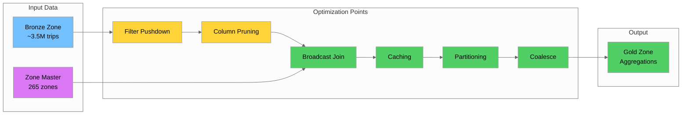
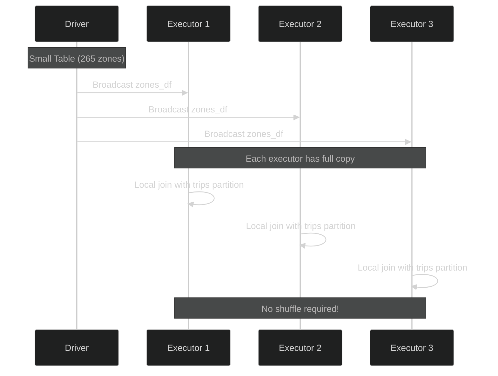
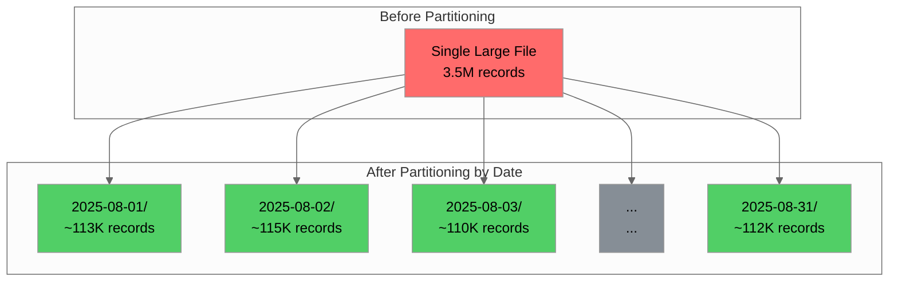
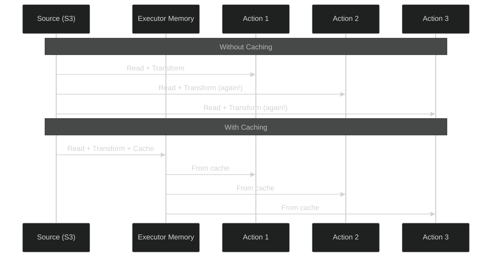
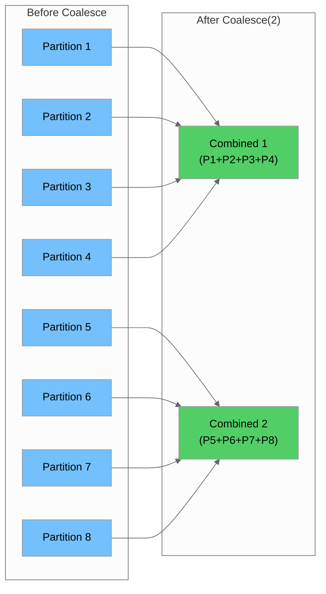
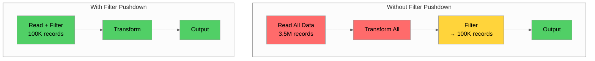
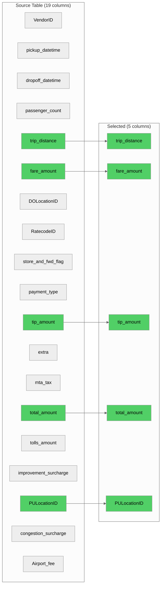
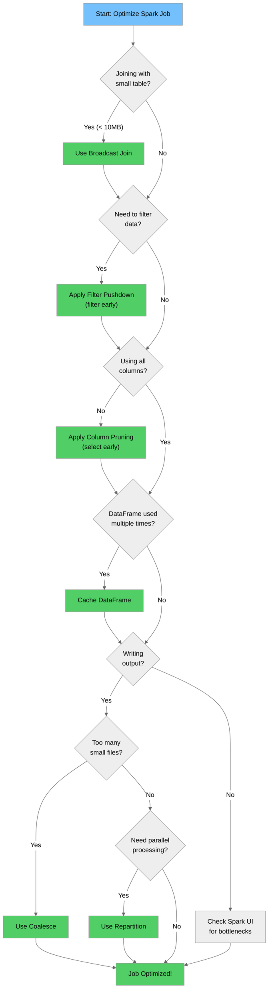

# Day 7 Task 7.4: Spark Optimization Notes

## Overview

This document covers essential Spark optimization techniques for efficient data processing. Each technique is explained with practical examples using NYC taxi data from our Day 7 transformations.

**S3 Bucket:** `day-6-datalake-nyc-data`

---

## Optimization Techniques Summary

| Technique | When to Use | Performance Impact | Example Use Case |
|-----------|-------------|-------------------|------------------|
| **Broadcast Join** | Small table < 10MB | 10-100x faster joins | Zone lookups |
| **Partitioning** | Large datasets | Parallel processing | Time-series data |
| **Caching** | Reused DataFrames | Avoid recomputation | Intermediate results |
| **Coalesce** | Reduce output files | Fewer small files | Final output |
| **Filter Pushdown** | Early filtering | Reduce data volume | Remove invalid records |
| **Column Pruning** | Select only needed columns | Reduce memory/IO | Analytics queries |

---

## Data Flow Context



---

## 1. Broadcast Join

### When to Use
- Small table (< 10MB, configurable via `spark.sql.autoBroadcastJoinThreshold`)
- Dimension/lookup tables
- Master data enrichment
- Avoiding shuffle operations

### Performance Impact
- **Without Broadcast:** Data shuffled across all nodes (expensive network I/O)
- **With Broadcast:** Small table copied to all executors (no shuffle)
- **Speedup:** 10-100x faster for qualifying joins

### How It Works



### Implementation

**From [`master-data-enrichment.py`](master-data-enrichment.py:131):**

```python
from pyspark.sql.functions import broadcast, col

# Configuration for broadcast threshold (default 10MB)
spark = (
    SparkSession.builder.appName("MasterDataEnrichment")
    .config("spark.sql.autoBroadcastJoinThreshold", "10485760")  # 10MB
    .getOrCreate()
)

# Zone master data is ~265 rows - perfect for broadcast
zones_df = spark.read.parquet(GOLD_ZONES_MASTER_PATH)

# Prepare pickup zone columns with aliases
pickup_zones = zones_df.select(
    col("LocationID").alias("pu_loc_id"),
    col("Zone").alias("pickup_zone_name"),
    col("Borough").alias("pickup_borough"),
    col("service_zone").alias("pickup_service_zone"),
    col("zone_type").alias("pickup_zone_type"),
    col("is_airport").alias("pickup_is_airport"),
)

# Broadcast join - zones table sent to all executors
enriched_df = trips_df.join(
    broadcast(pickup_zones),  # <-- Explicit broadcast hint
    trips_df.PULocationID == col("pu_loc_id"),
    "left"
).drop("pu_loc_id")
```

### Best Practices
- ✅ Use for tables < 10MB (configurable)
- ✅ Explicitly use `broadcast()` for clarity
- ✅ Perfect for dimension tables (zones, vendors, rate codes)
- ❌ Don't broadcast large tables (causes OOM on executors)
- ❌ Don't rely solely on auto-broadcast (may not trigger)

### Anti-Patterns

```python
# ❌ BAD: Broadcasting large table
large_trips_df = spark.read.parquet(TRIPS_PATH)  # 3.5M rows
result = small_df.join(broadcast(large_trips_df), ...)  # OOM!

# ✅ GOOD: Broadcast the small table
result = large_trips_df.join(broadcast(small_zones_df), ...)
```

---

## 2. Partitioning

### When to Use
- Large datasets that need parallel processing
- Time-series data (partition by date)
- Data that will be filtered by specific columns
- Improving query performance on specific columns

### Performance Impact
- **Without Partitioning:** Full table scan for every query
- **With Partitioning:** Only relevant partitions read
- **Speedup:** Proportional to partition selectivity

### How It Works



### Implementation

**Repartitioning for parallel processing:**

```python
from pyspark.sql.functions import col

# Read trip data
trips_df = spark.read.parquet(SILVER_TRIPS_PATH)

# Repartition by date for time-series analysis
# This redistributes data across partitions based on trip_date
trips_partitioned = trips_df.repartition(col("trip_date"))

# Write with partitioning - creates directory structure
trips_partitioned.write \
    .partitionBy("trip_date") \
    .mode("overwrite") \
    .parquet(f"s3://{S3_BUCKET}/silver/trips_by_date/")

# Result structure:
# s3://day-6-datalake-nyc-data/silver/trips_by_date/
# ├── trip_date=2025-08-01/
# │   └── part-00000.parquet
# ├── trip_date=2025-08-02/
# │   └── part-00000.parquet
# └── ...
```

**Repartitioning for specific number of partitions:**

```python
# Increase partitions for more parallelism
trips_df = trips_df.repartition(200)  # 200 partitions

# Repartition by multiple columns
trips_df = trips_df.repartition(col("trip_date"), col("PULocationID"))
```

### Best Practices
- ✅ Partition by frequently filtered columns (date, region)
- ✅ Choose partition column with moderate cardinality (30-1000 values)
- ✅ Use `repartition()` when increasing partitions or redistributing
- ❌ Don't partition by high-cardinality columns (creates too many small files)
- ❌ Don't over-partition (each partition should have >100MB data)

### Anti-Patterns

```python
# ❌ BAD: Partitioning by high-cardinality column
trips_df.write.partitionBy("trip_id").parquet(...)  # Millions of tiny files!

# ❌ BAD: Too many partition columns
trips_df.write.partitionBy("year", "month", "day", "hour", "zone").parquet(...)

# ✅ GOOD: Partition by date (31 partitions for a month)
trips_df.write.partitionBy("trip_date").parquet(...)
```

---

## 3. Caching

### When to Use
- DataFrame used multiple times in the same job
- Intermediate results in iterative algorithms
- After expensive transformations
- Before multiple aggregations on same data

### Performance Impact
- **Without Caching:** Recompute from source for each action
- **With Caching:** Compute once, reuse from memory/disk
- **Speedup:** Proportional to number of reuses

### How It Works



### Implementation

**From [`pyspark-aggregations.py`](pyspark-aggregations.py:329):**

```python
# Read cleaned trips from silver zone
trips_df, input_count = read_silver_trips(spark, SILVER_TRIPS_PATH)

# Cache the DataFrame since we'll use it for multiple aggregations
trips_df.cache()
print("DataFrame cached for multiple aggregations")

# Now use the cached DataFrame for 4 different aggregations
# Each aggregation reuses the cached data instead of re-reading from S3

# Aggregation 1: trips_per_zone
trips_per_zone = trips_df.groupBy("PULocationID").agg(...)

# Aggregation 2: hourly_metrics
hourly_metrics = trips_df.groupBy("trip_hour").agg(...)

# Aggregation 3: daily_summary
daily_summary = trips_df.groupBy("trip_date").agg(...)

# Aggregation 4: payment_analysis
payment_analysis = trips_df.groupBy("payment_method").agg(...)

# IMPORTANT: Unpersist when done to free memory
trips_df.unpersist()
```

### Storage Levels

```python
from pyspark import StorageLevel

# Default cache() - MEMORY_AND_DISK
trips_df.cache()

# Explicit persist with storage level
trips_df.persist(StorageLevel.MEMORY_ONLY)        # Fast, may spill
trips_df.persist(StorageLevel.MEMORY_AND_DISK)    # Default, balanced
trips_df.persist(StorageLevel.DISK_ONLY)          # Slow, saves memory
trips_df.persist(StorageLevel.MEMORY_ONLY_SER)    # Serialized, compact
```

| Storage Level | Speed | Memory Usage | When to Use |
|---------------|-------|--------------|-------------|
| `MEMORY_ONLY` | Fastest | High | Small DataFrames, fast iteration |
| `MEMORY_AND_DISK` | Fast | Medium | Default, balanced approach |
| `DISK_ONLY` | Slow | Low | Large DataFrames, memory constrained |
| `MEMORY_ONLY_SER` | Medium | Lower | Memory constrained, acceptable speed |

### Best Practices
- ✅ Cache DataFrames used multiple times
- ✅ Cache after expensive transformations (joins, aggregations)
- ✅ Always `unpersist()` when done
- ✅ Monitor cache usage in Spark UI
- ❌ Don't cache DataFrames used only once
- ❌ Don't cache very large DataFrames (may cause OOM)

### Anti-Patterns

```python
# ❌ BAD: Caching DataFrame used only once
trips_df.cache()
result = trips_df.groupBy("zone").count()
# Never used again - wasted memory!

# ❌ BAD: Forgetting to unpersist
trips_df.cache()
# ... multiple operations ...
# Memory leak - cache never released!

# ✅ GOOD: Cache with unpersist
trips_df.cache()
agg1 = trips_df.groupBy("zone").count()
agg2 = trips_df.groupBy("hour").count()
agg3 = trips_df.groupBy("date").count()
trips_df.unpersist()  # Release memory
```

---

## 4. Coalesce

### When to Use
- Reducing number of output files
- After filtering that significantly reduces data
- Before writing final output
- Avoiding small file problem

### Performance Impact
- **Without Coalesce:** Many small files (slow reads, metadata overhead)
- **With Coalesce:** Fewer, larger files (efficient reads)
- **Note:** Coalesce doesn't shuffle (unlike repartition)

### How It Works



### Implementation

```python
# After aggregation, we have small result sets
# Coalesce to reduce output files

# Zone aggregation: ~265 zones → 1 file is enough
trips_per_zone = trips_df.groupBy("PULocationID").agg(...)
trips_per_zone.coalesce(1).write.mode("overwrite").parquet(
    f"{GOLD_PATH}/trips_per_zone/"
)

# Hourly metrics: 24 hours → 1 file is enough
hourly_metrics = trips_df.groupBy("trip_hour").agg(...)
hourly_metrics.coalesce(1).write.mode("overwrite").parquet(
    f"{GOLD_PATH}/hourly_metrics/"
)

# Daily summary: ~31 days → 1 file is enough
daily_summary = trips_df.groupBy("trip_date").agg(...)
daily_summary.coalesce(1).write.mode("overwrite").parquet(
    f"{GOLD_PATH}/daily_summary/"
)

# For larger outputs, use more partitions
# Target: 100MB-1GB per file
large_output.coalesce(10).write.parquet(...)
```

### Coalesce vs Repartition

| Aspect | `coalesce(n)` | `repartition(n)` |
|--------|---------------|------------------|
| **Direction** | Only decrease partitions | Increase or decrease |
| **Shuffle** | No shuffle (narrow) | Full shuffle (wide) |
| **Data Distribution** | May be uneven | Even distribution |
| **Use Case** | Reduce output files | Redistribute data |
| **Performance** | Faster | Slower |

```python
# ✅ Use coalesce to reduce partitions (no shuffle)
df.coalesce(10).write.parquet(...)

# ✅ Use repartition to increase partitions or redistribute
df.repartition(200).write.parquet(...)
df.repartition(col("date")).write.parquet(...)
```

### Best Practices
- ✅ Use coalesce for reducing output files
- ✅ Target 100MB-1GB per output file
- ✅ Coalesce after filtering/aggregation
- ❌ Don't coalesce to 1 for large datasets (single-threaded write)
- ❌ Don't use coalesce to increase partitions (use repartition)

### Anti-Patterns

```python
# ❌ BAD: Coalescing large dataset to 1 file
large_df.coalesce(1).write.parquet(...)  # Single-threaded, slow!

# ❌ BAD: Using coalesce to increase partitions
df.coalesce(200)  # Does nothing if df has < 200 partitions!

# ✅ GOOD: Coalesce small aggregation results
small_agg.coalesce(1).write.parquet(...)

# ✅ GOOD: Reasonable coalesce for medium datasets
medium_df.coalesce(10).write.parquet(...)  # 10 files
```

---

## 5. Filter Pushdown

### When to Use
- Filtering data early in the pipeline
- Before expensive operations (joins, aggregations)
- When reading from partitioned data
- Reducing data volume as early as possible

### Performance Impact
- **Without Pushdown:** Process all data, then filter
- **With Pushdown:** Filter at source, process less data
- **Speedup:** Proportional to filter selectivity

### How It Works



### Implementation

**Filter before joins:**

```python
from pyspark.sql.functions import col

# Read trip data
trips_df = spark.read.parquet(BRONZE_TRIPS_PATH)

# ✅ GOOD: Filter early - before any transformations
# Remove records with invalid data before processing
trips_filtered = trips_df.filter(
    (col("trip_distance") > 0) &
    (col("fare_amount") > 0) &
    (col("passenger_count") > 0)
)

# Now do expensive operations on filtered data
trips_enriched = trips_filtered.join(
    broadcast(zones_df),
    trips_filtered.PULocationID == zones_df.LocationID,
    "left"
)
```

**Predicate pushdown with partitioned data:**

```python
# Data partitioned by trip_date
# s3://bucket/trips/trip_date=2025-08-01/
# s3://bucket/trips/trip_date=2025-08-02/
# ...

# Spark automatically pushes this filter to partition pruning
trips_df = spark.read.parquet("s3://bucket/trips/")

# Only reads partitions for August 15-20 (not all 31 days)
august_trips = trips_df.filter(
    (col("trip_date") >= "2025-08-15") &
    (col("trip_date") <= "2025-08-20")
)
```

**Filter pushdown with Parquet:**

```python
# Parquet supports predicate pushdown at file level
# Spark pushes filters to Parquet reader

trips_df = spark.read.parquet(TRIPS_PATH)

# These filters are pushed down to Parquet reader
# Only reads relevant row groups
filtered = trips_df.filter(
    (col("VendorID") == 1) &
    (col("payment_type") == 1)
)
```

### Best Practices
- ✅ Filter as early as possible in the pipeline
- ✅ Filter before joins (reduce join input size)
- ✅ Use partitioned data for time-based filters
- ✅ Use Parquet/Delta for predicate pushdown
- ❌ Don't filter after expensive operations
- ❌ Don't use UDFs in filters (prevents pushdown)

### Anti-Patterns

```python
# ❌ BAD: Filter after join
result = trips_df.join(zones_df, ...).filter(col("trip_distance") > 0)

# ✅ GOOD: Filter before join
filtered_trips = trips_df.filter(col("trip_distance") > 0)
result = filtered_trips.join(zones_df, ...)

# ❌ BAD: UDF prevents pushdown
from pyspark.sql.functions import udf
is_valid = udf(lambda x: x > 0)
trips_df.filter(is_valid(col("distance")))  # No pushdown!

# ✅ GOOD: Built-in function allows pushdown
trips_df.filter(col("distance") > 0)  # Pushdown works!
```

---

## 6. Column Pruning

### When to Use
- When only specific columns are needed
- Before joins (reduce shuffle data)
- For analytics queries on wide tables
- Reducing memory footprint

### Performance Impact
- **Without Pruning:** Read all columns (more I/O, more memory)
- **With Pruning:** Read only needed columns
- **Speedup:** Proportional to column selectivity

### How It Works



### Implementation

**Select only needed columns:**

```python
from pyspark.sql.functions import col

# ❌ BAD: Read all columns when only few needed
trips_df = spark.read.parquet(TRIPS_PATH)
result = trips_df.groupBy("PULocationID").agg(
    sum("total_amount").alias("revenue")
)

# ✅ GOOD: Select only needed columns early
trips_df = spark.read.parquet(TRIPS_PATH).select(
    "PULocationID",
    "total_amount"
)
result = trips_df.groupBy("PULocationID").agg(
    sum("total_amount").alias("revenue")
)
```

**Column pruning before joins:**

```python
# From master-data-enrichment.py - select only needed zone columns
pickup_zones = zones_df.select(
    col("LocationID").alias("pu_loc_id"),
    col("Zone").alias("pickup_zone_name"),
    col("Borough").alias("pickup_borough"),
    col("service_zone").alias("pickup_service_zone"),
    col("zone_type").alias("pickup_zone_type"),
    col("is_airport").alias("pickup_is_airport"),
)

# Join with pruned columns - less data shuffled
enriched_df = trips_df.join(
    broadcast(pickup_zones),
    trips_df.PULocationID == col("pu_loc_id"),
    "left"
)
```

**Column pruning for aggregations:**

```python
# From pyspark-aggregations.py - only select columns needed for aggregation

# For trips_per_zone, we only need these columns:
needed_columns = [
    "PULocationID",
    "total_amount",
    "fare_amount",
    "tip_percentage",
    "trip_duration_minutes",
    "trip_distance",
    "trip_date"
]

trips_df = spark.read.parquet(SILVER_TRIPS_PATH).select(needed_columns)

trips_per_zone = trips_df.groupBy("PULocationID").agg(
    count("*").alias("trip_count"),
    spark_round(spark_sum("total_amount"), 2).alias("total_revenue"),
    spark_round(avg("fare_amount"), 2).alias("avg_fare"),
    spark_round(avg("tip_percentage"), 2).alias("avg_tip_pct"),
    spark_round(avg("trip_duration_minutes"), 2).alias("avg_duration_min"),
    spark_round(avg("trip_distance"), 2).alias("avg_distance_miles"),
    countDistinct("trip_date").alias("active_days"),
)
```

### Best Practices
- ✅ Select only needed columns immediately after read
- ✅ Prune columns before joins (reduce shuffle)
- ✅ Use column pruning with Parquet (columnar format)
- ✅ Drop unnecessary columns after transformations
- ❌ Don't use `select("*")` when specific columns needed
- ❌ Don't carry unused columns through pipeline

### Anti-Patterns

```python
# ❌ BAD: Reading all columns, using few
trips_df = spark.read.parquet(TRIPS_PATH)  # 19 columns
result = trips_df.select("PULocationID").distinct()  # Only needed 1!

# ✅ GOOD: Read only what you need
trips_df = spark.read.parquet(TRIPS_PATH).select("PULocationID")
result = trips_df.distinct()

# ❌ BAD: Carrying unused columns through joins
full_trips = spark.read.parquet(TRIPS_PATH)  # 19 columns
full_zones = spark.read.parquet(ZONES_PATH)  # 10 columns
result = full_trips.join(full_zones, ...)  # 29 columns shuffled!

# ✅ GOOD: Prune before join
trips = spark.read.parquet(TRIPS_PATH).select("PULocationID", "fare_amount")
zones = spark.read.parquet(ZONES_PATH).select("LocationID", "Zone")
result = trips.join(zones, ...)  # Only 4 columns shuffled
```

---

## Optimization Decision Tree

Use this decision tree to choose the right optimization:



---

## Real-World Example: Optimized Pipeline

Here's how all optimizations work together in our taxi data pipeline:

```python
"""
Optimized Taxi Data Pipeline
Demonstrates all 6 optimization techniques working together
"""

from pyspark.sql import SparkSession
from pyspark.sql.functions import (
    broadcast, col, count, avg, sum as spark_sum,
    round as spark_round, countDistinct, to_date
)

# Configuration
S3_BUCKET = "day-6-datalake-nyc-data"
BRONZE_TRIPS_PATH = f"s3://{S3_BUCKET}/bronze/yellow_tripdata/"
GOLD_ZONES_MASTER_PATH = f"s3://{S3_BUCKET}/gold/taxi_zones_master/"
GOLD_OUTPUT_PATH = f"s3://{S3_BUCKET}/gold/optimized_analysis/"

# Initialize Spark with optimization configs
spark = (
    SparkSession.builder
    .appName("OptimizedTaxiPipeline")
    .config("spark.sql.adaptive.enabled", "true")
    .config("spark.sql.adaptive.coalescePartitions.enabled", "true")
    .config("spark.sql.autoBroadcastJoinThreshold", "10485760")  # 10MB
    .getOrCreate()
)

# ============================================
# OPTIMIZATION 1: Column Pruning
# Only read columns we need
# ============================================
trips_df = spark.read.parquet(BRONZE_TRIPS_PATH).select(
    "PULocationID",
    "DOLocationID",
    "trip_distance",
    "fare_amount",
    "tip_amount",
    "total_amount",
    "tpep_pickup_datetime"
)

# ============================================
# OPTIMIZATION 2: Filter Pushdown
# Filter early to reduce data volume
# ============================================
trips_filtered = trips_df.filter(
    (col("trip_distance") > 0) &
    (col("fare_amount") > 0) &
    (col("total_amount") > 0)
)

# ============================================
# OPTIMIZATION 3: Broadcast Join
# Zone table is small (~265 rows)
# ============================================
zones_df = spark.read.parquet(GOLD_ZONES_MASTER_PATH).select(
    col("LocationID").alias("zone_id"),
    col("Zone").alias("zone_name"),
    col("Borough").alias("borough")
)

trips_enriched = trips_filtered.join(
    broadcast(zones_df),  # Broadcast small table
    trips_filtered.PULocationID == col("zone_id"),
    "left"
).drop("zone_id")

# ============================================
# OPTIMIZATION 4: Caching
# DataFrame used for multiple aggregations
# ============================================
trips_enriched.cache()

# Aggregation 1: By Zone
zone_metrics = trips_enriched.groupBy("zone_name", "borough").agg(
    count("*").alias("trip_count"),
    spark_round(spark_sum("total_amount"), 2).alias("total_revenue"),
    spark_round(avg("fare_amount"), 2).alias("avg_fare")
)

# Aggregation 2: By Borough
borough_metrics = trips_enriched.groupBy("borough").agg(
    count("*").alias("trip_count"),
    spark_round(spark_sum("total_amount"), 2).alias("total_revenue")
)

# ============================================
# OPTIMIZATION 5: Coalesce
# Reduce output files for small results
# ============================================
zone_metrics.coalesce(1).write.mode("overwrite").parquet(
    f"{GOLD_OUTPUT_PATH}/zone_metrics/"
)

borough_metrics.coalesce(1).write.mode("overwrite").parquet(
    f"{GOLD_OUTPUT_PATH}/borough_metrics/"
)

# ============================================
# OPTIMIZATION 6: Partitioning
# For large time-series output
# ============================================
trips_with_date = trips_enriched.withColumn(
    "trip_date", to_date("tpep_pickup_datetime")
)

# Write partitioned by date for efficient time-based queries
trips_with_date.write \
    .partitionBy("trip_date") \
    .mode("overwrite") \
    .parquet(f"{GOLD_OUTPUT_PATH}/trips_by_date/")

# Clean up: Unpersist cached DataFrame
trips_enriched.unpersist()

spark.stop()
```

---

## Performance Monitoring

### Spark UI Metrics to Watch

| Metric | What to Look For | Action if High |
|--------|------------------|----------------|
| **Shuffle Read/Write** | Large shuffle sizes | Use broadcast joins, filter early |
| **Task Duration** | Uneven task times | Check for data skew, repartition |
| **GC Time** | High garbage collection | Reduce memory pressure, use serialization |
| **Spill (Memory/Disk)** | Data spilling to disk | Increase memory, reduce partition size |
| **Input Size** | Large input reads | Use column pruning, filter pushdown |

### Checking Execution Plan

```python
# View logical plan
trips_df.explain()

# View detailed physical plan
trips_df.explain(mode="extended")

# View formatted plan (Spark 3.0+)
trips_df.explain(mode="formatted")
```

**Example output showing broadcast join:**
```
== Physical Plan ==
*(2) BroadcastHashJoin [PULocationID#10], [zone_id#50], LeftOuter, BuildRight
:- *(2) Filter ((trip_distance#15 > 0) AND (fare_amount#20 > 0))
:  +- *(2) ColumnarToRow
:     +- FileScan parquet [PULocationID#10,trip_distance#15,fare_amount#20]
+- BroadcastExchange HashedRelationBroadcastMode(List(zone_id#50))
   +- *(1) Project [LocationID AS zone_id#50, Zone AS zone_name#51]
      +- *(1) FileScan parquet [LocationID#45,Zone#46]
```

---

## Configuration Reference

### Key Spark Configurations

```python
spark = (
    SparkSession.builder
    .appName("OptimizedJob")
    
    # Adaptive Query Execution (Spark 3.0+)
    .config("spark.sql.adaptive.enabled", "true")
    .config("spark.sql.adaptive.coalescePartitions.enabled", "true")
    .config("spark.sql.adaptive.skewJoin.enabled", "true")
    
    # Broadcast threshold (default 10MB)
    .config("spark.sql.autoBroadcastJoinThreshold", "10485760")
    
    # Shuffle partitions (default 200)
    .config("spark.sql.shuffle.partitions", "200")
    
    # Memory management
    .config("spark.memory.fraction", "0.6")
    .config("spark.memory.storageFraction", "0.5")
    
    # Compression
    .config("spark.sql.parquet.compression.codec", "snappy")
    
    .getOrCreate()
)
```

### Configuration Guidelines

| Configuration | Default | Recommendation |
|---------------|---------|----------------|
| `spark.sql.adaptive.enabled` | false | **true** (Spark 3.0+) |
| `spark.sql.autoBroadcastJoinThreshold` | 10MB | Increase for larger dimension tables |
| `spark.sql.shuffle.partitions` | 200 | 2-3x number of cores |
| `spark.memory.fraction` | 0.6 | Increase if caching heavily |
| `spark.sql.parquet.compression.codec` | snappy | snappy (speed) or zstd (compression) |

---

## Summary: Optimization Checklist

Before running any Spark job, verify these optimizations:

### Pre-Execution Checklist

- [ ] **Column Pruning**: Select only needed columns immediately after read
- [ ] **Filter Pushdown**: Apply filters as early as possible
- [ ] **Broadcast Joins**: Use `broadcast()` for tables < 10MB
- [ ] **Caching**: Cache DataFrames used multiple times
- [ ] **Partitioning**: Partition output by frequently filtered columns
- [ ] **Coalesce**: Reduce output files for small result sets

### Post-Execution Checklist

- [ ] Check Spark UI for shuffle sizes
- [ ] Verify no data skew (even task durations)
- [ ] Confirm broadcast joins are being used
- [ ] Validate output file sizes (100MB-1GB target)
- [ ] Unpersist cached DataFrames

---

## References

### Day 7 Scripts Using These Optimizations

| Script | Optimizations Used |
|--------|-------------------|
| [`pyspark-trip-transformations.py`](pyspark-trip-transformations.py) | Adaptive execution, column transformations |
| [`pyspark-zone-transformations.py`](pyspark-zone-transformations.py) | Adaptive execution, small dataset handling |
| [`master-data-enrichment.py`](master-data-enrichment.py) | **Broadcast join**, column pruning |
| [`pyspark-aggregations.py`](pyspark-aggregations.py) | **Caching**, multiple aggregations |

### External Resources

- [Spark Performance Tuning Guide](https://spark.apache.org/docs/latest/sql-performance-tuning.html)
- [Adaptive Query Execution](https://spark.apache.org/docs/latest/sql-performance-tuning.html#adaptive-query-execution)
- [Broadcast Joins](https://spark.apache.org/docs/latest/sql-performance-tuning.html#broadcast-hint-for-sql-queries)

---

*Last updated: 2026-01-04*