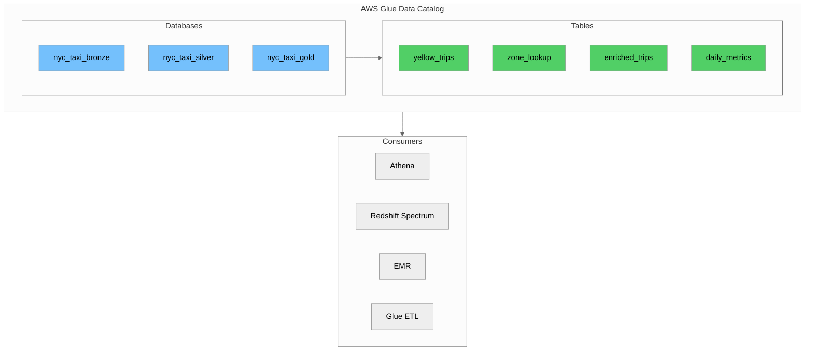
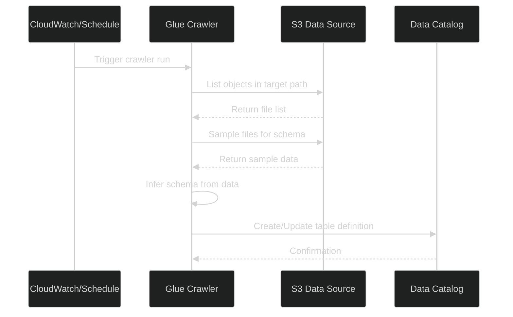
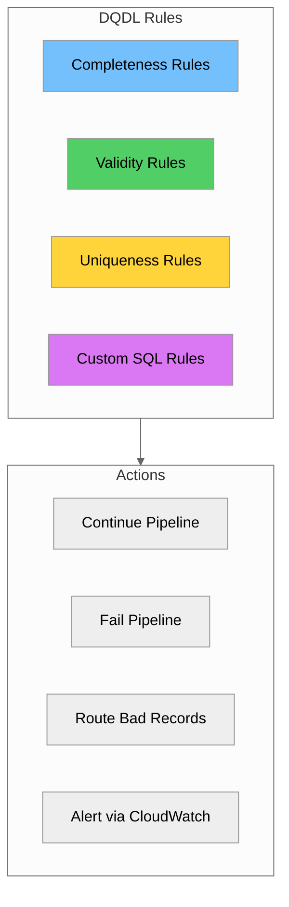
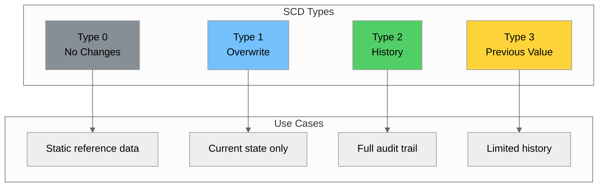
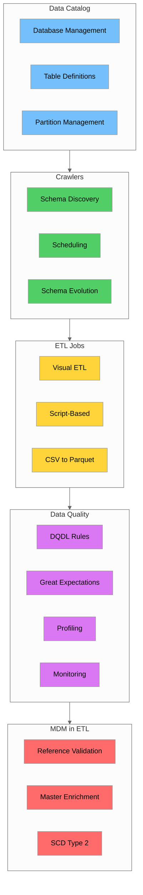

# Day 8: AWS Glue & Data Quality

## Table of Contents

- [Introduction \& Learning Objectives](#introduction--learning-objectives)
- [Part 1: AWS Glue Data Catalog Deep Dive](#part-1-aws-glue-data-catalog-deep-dive)
- [Part 2: Glue Crawlers - Schema Discovery \& Scheduling](#part-2-glue-crawlers---schema-discovery--scheduling)
- [Part 3: Glue ETL Jobs - Visual and Script-Based](#part-3-glue-etl-jobs---visual-and-script-based)
- [Part 4: AWS Glue Data Quality (DQDL)](#part-4-aws-glue-data-quality-dqdl)
- [Part 5: Great Expectations Framework](#part-5-great-expectations-framework)
- [Part 6: Data Profiling and Validation](#part-6-data-profiling-and-validation)
- [Part 7: Quality Monitoring and Alerting](#part-7-quality-monitoring-and-alerting)
- [Part 8: MDM in ETL Pipelines](#part-8-mdm-in-etl-pipelines)
- [Part 9: SCD Implementation in Glue](#part-9-scd-implementation-in-glue)
- [Part 10: Hands-on Labs](#part-10-hands-on-labs)
- [Summary \& Key Takeaways](#summary--key-takeaways)
- [Additional Resources](#additional-resources)

---

## Introduction & Learning Objectives

### Overview

Day 8 continues **Week 2** of your Data Engineering training. Today we dive deep into **AWS Glue** and **Data Quality** - essential components for building reliable, production-grade data pipelines. You'll learn how to set up and manage the Glue Data Catalog, create crawlers for automatic schema discovery, build ETL jobs using both visual and script-based approaches, and implement comprehensive data quality frameworks.

```mermaid
%%{init: {'theme':'neutral'}}%%
flowchart LR
    subgraph Week1["Week 1 - Completed ✓"]
        D1["Day 1<br/>AWS"]
        D2["Day 2<br/>Python"]
        D3["Day 3<br/>Modeling"]
        D4["Day 4<br/>MDM"]
        D5["Day 5<br/>CI/CD"]
    end

    subgraph Week2["Week 2 - Current"]
        D6["Day 6<br/>Data Lakes"]
        D7["Day 7<br/>Spark/Glue"]
        D8["Day 8<br/>Data Quality"]
        D9["Day 9<br/>Streaming"]
        D10["Day 10<br/>Orchestration"]
    end

    D1 --> D2 --> D3 --> D4 --> D5 --> D6
    D6 --> D7 --> D8 --> D9 --> D10

    style D1 fill:#51cf66,color:#000
    style D2 fill:#51cf66,color:#000
    style D3 fill:#51cf66,color:#000
    style D4 fill:#51cf66,color:#000
    style D5 fill:#51cf66,color:#000
    style D6 fill:#51cf66,color:#000
    style D7 fill:#51cf66,color:#000
    style D8 fill:#74c0fc,color:#000
    style D9 fill:#868e96,color:#000
    style D10 fill:#868e96,color:#000
```



### Prerequisites

Before starting Day 8, ensure you have:

- ✅ Completed Day 7 (Introduction to Apache Spark and AWS Glue)
- ✅ AWS account with Glue, S3, and CloudWatch access configured
- ✅ Python environment with PySpark and boto3 installed
- ✅ Understanding of Spark transformations and actions
- ✅ Familiarity with the Glue Data Catalog concepts

### Learning Objectives

By the end of Day 8, you will be able to:

1. **Configure** AWS Glue Data Catalog databases and tables programmatically
2. **Create** and schedule Glue Crawlers for automatic schema discovery
3. **Handle** schema evolution scenarios in crawlers
4. **Build** ETL jobs using both Glue Studio (visual) and script-based approaches
5. **Write** AWS Glue Data Quality rules using DQDL syntax
6. **Implement** Great Expectations for comprehensive data validation
7. **Profile** data to understand distributions and anomalies
8. **Set up** quality monitoring and alerting with CloudWatch
9. **Validate** transaction data against master tables
10. **Implement** Slowly Changing Dimensions (SCD) in Glue ETL jobs

---

## Part 1: AWS Glue Data Catalog Deep Dive

### 1.1 Understanding the Data Catalog

The **AWS Glue Data Catalog** is a fully managed, Apache Hive Metastore-compatible metadata repository. It serves as the central schema registry for your data lake, enabling services like Athena, Redshift Spectrum, and EMR to query data stored in S3.



### 1.2 Catalog Hierarchy

| Component | Description | Example |
|-----------|-------------|---------|
| **Catalog** | Top-level container (one per AWS account per region) | Default catalog |
| **Database** | Logical grouping of tables | `nyc_taxi_bronze`, `nyc_taxi_silver` |
| **Table** | Metadata definition pointing to data | `yellow_trips`, `zone_lookup` |
| **Partition** | Subset of table data by partition keys | `year=2025/month=08` |
| **Column** | Field definition with name and type | `trip_distance DOUBLE` |

### 1.3 Creating Databases with boto3

```python
import boto3
from datetime import datetime

glue = boto3.client('glue')

def create_data_catalog_databases():
    """Create databases for NYC Taxi data lake zones."""
    
    databases = [
        {
            'Name': 'nyc_taxi_bronze',
            'Description': 'Raw NYC Taxi data - Bronze layer',
            'LocationUri': 's3://nyc-taxi-data-lake/bronze/',
            'Parameters': {
                'created_by': 'data_engineering_team',
                'layer': 'bronze',
                'created_at': datetime.utcnow().isoformat()
            }
        },
        {
            'Name': 'nyc_taxi_silver',
            'Description': 'Cleaned and validated NYC Taxi data - Silver layer',
            'LocationUri': 's3://nyc-taxi-data-lake/silver/',
            'Parameters': {
                'created_by': 'data_engineering_team',
                'layer': 'silver'
            }
        },
        {
            'Name': 'nyc_taxi_gold',
            'Description': 'Business-ready aggregated data - Gold layer',
            'LocationUri': 's3://nyc-taxi-data-lake/gold/',
            'Parameters': {
                'created_by': 'data_engineering_team',
                'layer': 'gold'
            }
        }
    ]
    
    for db in databases:
        try:
            glue.create_database(DatabaseInput=db)
            print(f"Created database: {db['Name']}")
        except glue.exceptions.AlreadyExistsException:
            print(f"Database already exists: {db['Name']}")

# Execute: create_data_catalog_databases()
```

### 1.4 Creating Tables Programmatically

```python
def create_yellow_trips_table():
    """Create table definition for NYC Yellow Taxi trips."""
    
    columns = [
        {'Name': 'vendorid', 'Type': 'bigint', 'Comment': 'TPEP provider: 1=CMT, 2=Curb, 6=Myle, 7=Helix'},
        {'Name': 'tpep_pickup_datetime', 'Type': 'timestamp', 'Comment': 'Meter engagement time'},
        {'Name': 'tpep_dropoff_datetime', 'Type': 'timestamp', 'Comment': 'Meter disengagement time'},
        {'Name': 'passenger_count', 'Type': 'double', 'Comment': 'Number of passengers'},
        {'Name': 'trip_distance', 'Type': 'double', 'Comment': 'Trip distance in miles'},
        {'Name': 'ratecodeid', 'Type': 'bigint', 'Comment': 'Rate code: 1=Standard, 2=JFK, 3=Newark'},
        {'Name': 'pulocationid', 'Type': 'bigint', 'Comment': 'Pickup TLC Taxi Zone'},
        {'Name': 'dolocationid', 'Type': 'bigint', 'Comment': 'Dropoff TLC Taxi Zone'},
        {'Name': 'payment_type', 'Type': 'bigint', 'Comment': 'Payment: 0=Flex, 1=Credit, 2=Cash'},
        {'Name': 'fare_amount', 'Type': 'double', 'Comment': 'Time-and-distance fare'},
        {'Name': 'tip_amount', 'Type': 'double', 'Comment': 'Tip amount (credit card only)'},
        {'Name': 'total_amount', 'Type': 'double', 'Comment': 'Total amount charged'}
    ]
    
    table_input = {
        'Name': 'yellow_trips',
        'Description': 'NYC Yellow Taxi trip records from TLC',
        'StorageDescriptor': {
            'Columns': columns,
            'Location': 's3://nyc-taxi-data-lake/bronze/yellow_tripdata/',
            'InputFormat': 'org.apache.hadoop.hive.ql.io.parquet.MapredParquetInputFormat',
            'OutputFormat': 'org.apache.hadoop.hive.ql.io.parquet.MapredParquetOutputFormat',
            'SerdeInfo': {
                'SerializationLibrary': 'org.apache.hadoop.hive.ql.io.parquet.serde.ParquetHiveSerDe'
            }
        },
        'PartitionKeys': [
            {'Name': 'year', 'Type': 'int'},
            {'Name': 'month', 'Type': 'int'}
        ],
        'TableType': 'EXTERNAL_TABLE'
    }
    
    try:
        glue.create_table(DatabaseName='nyc_taxi_bronze', TableInput=table_input)
        print("Table 'yellow_trips' created successfully!")
    except glue.exceptions.AlreadyExistsException:
        print("Table 'yellow_trips' already exists")

# Execute: create_yellow_trips_table()
```

---

## Part 2: Glue Crawlers - Schema Discovery & Scheduling

### 2.1 How Crawlers Work

**Glue Crawlers** automatically discover data schemas by scanning data sources and populating the Data Catalog.



### 2.2 Creating Crawlers with boto3

```python
import boto3

glue = boto3.client('glue')

def create_bronze_crawler():
    """Create crawler for NYC Taxi bronze layer data."""
    
    crawler_config = {
        'Name': 'nyc-taxi-bronze-crawler',
        'Role': 'arn:aws:iam::123456789012:role/GlueCrawlerRole',
        'DatabaseName': 'nyc_taxi_bronze',
        'Description': 'Crawl bronze layer NYC taxi trip data',
        'Targets': {
            'S3Targets': [
                {
                    'Path': 's3://nyc-taxi-data-lake/bronze/yellow_tripdata/',
                    'Exclusions': ['_temporary/**', '_spark_metadata/**', '*.crc']
                }
            ]
        },
        'SchemaChangePolicy': {
            'UpdateBehavior': 'UPDATE_IN_DATABASE',
            'DeleteBehavior': 'LOG'
        },
        'RecrawlPolicy': {
            'RecrawlBehavior': 'CRAWL_NEW_FOLDERS_ONLY'
        }
    }
    
    try:
        glue.create_crawler(**crawler_config)
        print(f"Crawler '{crawler_config['Name']}' created successfully!")
    except glue.exceptions.AlreadyExistsException:
        print(f"Crawler '{crawler_config['Name']}' already exists")

# Execute: create_bronze_crawler()
```

### 2.3 Scheduling Crawlers

```python
def schedule_crawler(crawler_name: str, schedule_expression: str):
    """Update crawler with a schedule."""
    
    # Common schedule expressions
    schedules = {
        'hourly': 'cron(0 * * * ? *)',
        'daily_6am_utc': 'cron(0 6 * * ? *)',
        'weekly_sunday': 'cron(0 0 ? * SUN *)'
    }
    
    glue.update_crawler(Name=crawler_name, Schedule=schedule_expression)
    print(f"Crawler '{crawler_name}' scheduled: {schedule_expression}")

# Schedule: schedule_crawler('nyc-taxi-bronze-crawler', 'cron(0 6 * * ? *)')
```

### 2.4 Schema Evolution Handling

| Policy | New Columns | Type Changes | Removed Columns | Use Case |
|--------|-------------|--------------|-----------------|----------|
| **UPDATE_IN_DATABASE** | Added | Updated | Kept | Evolving schemas |
| **LOG** | Logged only | Logged only | Logged only | Audit trail |
| **DELETE_FROM_DATABASE** | Added | Updated | Removed | Strict schema |

---

## Part 3: Glue ETL Jobs - Visual and Script-Based

### 3.1 Glue Job Types Comparison

| Aspect | Glue Studio (Visual) | Script-Based |
|--------|---------------------|--------------|
| **Learning Curve** | Low | Medium-High |
| **Development Speed** | Fast for simple jobs | Slower initially |
| **Flexibility** | Limited | Full control |
| **Complex Logic** | Difficult | Easy |
| **Version Control** | Limited | Full Git integration |
| **Best For** | Simple ETL, prototyping | Production pipelines |

### 3.2 Script-Based ETL Job: CSV to Parquet

```python
# glue_csv_to_parquet.py
import sys
from awsglue.transforms import *
from awsglue.utils import getResolvedOptions
from pyspark.context import SparkContext
from awsglue.context import GlueContext
from awsglue.job import Job
from pyspark.sql.functions import col, current_timestamp, lit

args = getResolvedOptions(sys.argv, ['JOB_NAME', 'source_path', 'target_path'])

sc = SparkContext()
glueContext = GlueContext(sc)
spark = glueContext.spark_session
job = Job(glueContext)
job.init(args['JOB_NAME'], args)

# Read CSV source data
source_df = spark.read.option("header", "true").option("inferSchema", "true").csv(args['source_path'])

# Add metadata columns
transformed_df = source_df \
    .withColumn("_etl_loaded_at", current_timestamp()) \
    .withColumn("_etl_source", lit(args['source_path']))

# Write to Parquet
transformed_df.write.mode("overwrite").parquet(args['target_path'])

job.commit()
print("Job completed successfully!")
```

### 3.3 Complete ETL Job: Bronze to Silver

```python
# glue_bronze_to_silver.py
import sys
from awsglue.transforms import *
from awsglue.utils import getResolvedOptions
from pyspark.context import SparkContext
from awsglue.context import GlueContext
from awsglue.job import Job
from pyspark.sql.functions import col, when, hour, to_date, current_timestamp, lit

args = getResolvedOptions(sys.argv, ['JOB_NAME', 'source_database', 'source_table', 'target_path'])

sc = SparkContext()
glueContext = GlueContext(sc)
spark = glueContext.spark_session
job = Job(glueContext)
job.init(args['JOB_NAME'], args)

# Read from Glue Catalog
source_dyf = glueContext.create_dynamic_frame.from_catalog(
    database=args['source_database'],
    table_name=args['source_table']
)
source_df = source_dyf.toDF()

# Data Quality Filtering
cleaned_df = source_df \
    .filter(col("trip_distance") > 0) \
    .filter(col("trip_distance") < 500) \
    .filter(col("total_amount") > 0) \
    .filter(col("total_amount") < 10000) \
    .filter(col("passenger_count") > 0) \
    .filter(col("passenger_count") <= 9)

# Feature Engineering
enriched_df = cleaned_df \
    .withColumn("pickup_date", to_date("tpep_pickup_datetime")) \
    .withColumn("pickup_hour", hour("tpep_pickup_datetime")) \
    .withColumn("time_of_day",
        when(col("pickup_hour").between(6, 11), "morning")
        .when(col("pickup_hour").between(12, 17), "afternoon")
        .when(col("pickup_hour").between(18, 21), "evening")
        .otherwise("night")
    )

# Add ETL metadata
final_df = enriched_df \
    .withColumn("_etl_processed_at", current_timestamp()) \
    .withColumn("_etl_job_name", lit(args['JOB_NAME']))

# Write to Silver layer
final_df.write.mode("overwrite").partitionBy("pickup_date").parquet(args['target_path'])

job.commit()
print("Bronze to Silver transformation completed!")
```

---

## Part 4: AWS Glue Data Quality (DQDL)

### 4.1 Introduction to DQDL

**Data Quality Definition Language (DQDL)** is AWS Glue's domain-specific language for defining data quality rules.



### 4.2 DQDL Rule Types

| Rule Type | Description | Example |
|-----------|-------------|---------|
| **ColumnExists** | Check if column exists | `ColumnExists "vendorid"` |
| **IsComplete** | Check for non-null values | `IsComplete "trip_distance"` |
| **Completeness** | Percentage of non-null values | `Completeness "tip_amount" >= 0.95` |
| **ColumnValues** | Validate value constraints | `ColumnValues "passenger_count" between 1 and 9` |
| **Uniqueness** | Check uniqueness ratio | `Uniqueness "trip_id" > 0.99` |
| **RowCount** | Validate row count | `RowCount > 1000` |
| **CustomSql** | Custom SQL validation | `CustomSql "SELECT COUNT(*) FROM primary WHERE amount < 0" = 0` |

### 4.3 NYC Taxi Data Quality Rules

```python
nyc_taxi_dqdl_rules = """
Rules = [
    # Column existence checks
    ColumnExists "vendorid",
    ColumnExists "tpep_pickup_datetime",
    ColumnExists "trip_distance",
    ColumnExists "total_amount",
    
    # Completeness checks
    IsComplete "vendorid",
    IsComplete "tpep_pickup_datetime",
    Completeness "passenger_count" >= 0.95,
    Completeness "trip_distance" >= 0.99,
    
    # Value range validations
    ColumnValues "vendorid" in [1, 2, 6, 7],
    ColumnValues "passenger_count" between 0 and 9,
    ColumnValues "trip_distance" >= 0,
    ColumnValues "trip_distance" <= 500,
    ColumnValues "total_amount" >= 0,
    ColumnValues "payment_type" in [0, 1, 2, 3, 4, 5, 6],
    
    # Location ID validations (1-265 are valid zones)
    ColumnValues "pulocationid" between 1 and 265,
    ColumnValues "dolocationid" between 1 and 265,
    
    # Row count check
    RowCount > 0,
    
    # Custom SQL: Dropoff should be after pickup
    CustomSql "SELECT COUNT(*) FROM primary WHERE tpep_dropoff_datetime < tpep_pickup_datetime" = 0
]
"""
```

### 4.4 Implementing Data Quality in Glue Jobs

```python
from awsgluedq.transforms import EvaluateDataQuality

# Read source data
source_dyf = glueContext.create_dynamic_frame.from_catalog(
    database="nyc_taxi_bronze",
    table_name="yellow_trips"
)

# Define data quality rules
dq_ruleset = """
Rules = [
    IsComplete "vendorid",
    IsComplete "trip_distance",
    ColumnValues "trip_distance" >= 0,
    ColumnValues "total_amount" >= 0,
    ColumnValues "vendorid" in [1, 2, 6, 7],
    RowCount > 0
]
"""

# Evaluate data quality
dq_results = EvaluateDataQuality.apply(
    frame=source_dyf,
    ruleset=dq_ruleset,
    publishing_options={
        "dataQualityEvaluationContext": "nyc_taxi_bronze_quality",
        "enableDataQualityCloudWatchMetrics": True
    }
)

# Check results
dq_results_df = dq_results.toDF()
dq_results_df.show(truncate=False)
```

---

## Part 5: Great Expectations Framework

### 5.1 Introduction to Great Expectations

**Great Expectations** is an open-source Python library for data validation, documentation, and profiling.

### 5.2 Key Concepts

| Concept | Description |
|---------|-------------|
| **Data Context** | Central configuration object |
| **Expectation** | Single data quality assertion |
| **Expectation Suite** | Collection of expectations |
| **Checkpoint** | Validation run configuration |
| **Data Docs** | Auto-generated documentation |

### 5.3 Creating Expectations for NYC Taxi Data

```python
import great_expectations as gx
import pandas as pd

# Initialize context
context = gx.get_context()

# Read NYC Taxi data
df = pd.read_parquet("data/yellow_tripdata_2025-08.parquet")

# Create expectation suite
suite_name = "nyc_taxi_yellow_trips_suite"
suite = context.suites.add(gx.ExpectationSuite(name=suite_name))

# Get a validator
validator = context.get_validator(batch_request=batch_request, expectation_suite_name=suite_name)

# Add expectations
validator.expect_column_to_exist("VendorID")
validator.expect_column_to_exist("trip_distance")
validator.expect_column_to_exist("total_amount")

validator.expect_column_values_to_not_be_null("VendorID")
validator.expect_column_values_to_not_be_null("tpep_pickup_datetime")

validator.expect_column_values_to_be_in_set("VendorID", value_set=[1, 2, 6, 7])
validator.expect_column_values_to_be_between("passenger_count", min_value=0, max_value=9, mostly=0.99)
validator.expect_column_values_to_be_between("trip_distance", min_value=0, max_value=500, mostly=0.99)
validator.expect_column_values_to_be_between("PULocationID", min_value=1, max_value=265)

# Save the expectation suite
validator.save_expectation_suite(discard_failed_expectations=False)
print("Expectation suite created!")
```

### 5.4 Great Expectations vs DQDL Comparison

| Feature | Great Expectations | AWS Glue DQDL |
|---------|-------------------|---------------|
| **Deployment** | Self-managed | AWS managed |
| **Flexibility** | Very high | Medium |
| **Learning Curve** | Steeper | Easier |
| **Documentation** | Auto-generated Data Docs | CloudWatch metrics |
| **Integration** | Any Python environment | Glue jobs only |
| **Cost** | Open source | Included in Glue |

---

## Part 6: Data Profiling and Validation

### 6.1 Data Profiling with PySpark

```python
from pyspark.sql import SparkSession
from pyspark.sql.functions import col, count, countDistinct, min, max, avg, stddev, sum as spark_sum, when, isnull

spark = SparkSession.builder.appName("Data Profiling").getOrCreate()
df = spark.read.parquet("data/yellow_tripdata_2025-08.parquet")

def profile_dataframe(df):
    """Generate comprehensive data profile."""
    
    profile_results = []
    total_rows = df.count()
    
    for column in df.columns:
        col_type = str(df.schema[column].dataType)
        
        stats = df.agg(
            count(col(column)).alias("non_null_count"),
            countDistinct(col(column)).alias("distinct_count"),
            spark_sum(when(isnull(col(column)), 1).otherwise(0)).alias("null_count")
        ).collect()[0]
        
        profile_results.append({
            "column": column,
            "data_type": col_type,
            "total_rows": total_rows,
            "non_null_count": stats["non_null_count"],
            "null_count": stats["null_count"],
            "null_percentage": round(stats["null_count"] / total_rows * 100, 2),
            "distinct_count": stats["distinct_count"],
            "uniqueness": round(stats["distinct_count"] / total_rows * 100, 2)
        })
    
    return profile_results

# Run profiling
profile = profile_dataframe(df)
for col_profile in profile:
    print(f"{col_profile['column']}: {col_profile['null_percentage']}% null, {col_profile['distinct_count']} distinct")
```

---

## Part 7: Quality Monitoring and Alerting

### 7.1 CloudWatch Integration

```python
import boto3

cloudwatch = boto3.client('cloudwatch')

def publish_dq_metrics(rule_name: str, passed: bool, score: float):
    """Publish data quality metrics to CloudWatch."""
    
    cloudwatch.put_metric_data(
        Namespace='DataQuality/NYCTaxi',
        MetricData=[
            {
                'MetricName': 'RulePassRate',
                'Dimensions': [{'Name': 'RuleName', 'Value': rule_name}],
                'Value': 1.0 if passed else 0.0,
                'Unit': 'None'
            },
            {
                'MetricName': 'QualityScore',
                'Dimensions': [{'Name': 'RuleName', 'Value': rule_name}],
                'Value': score,
                'Unit': 'Percent'
            }
        ]
    )

# Example: publish_dq_metrics("completeness_check", True, 99.5)
```

### 7.2 Creating CloudWatch Alarms

```python
def create_dq_alarm(rule_name: str, threshold: float):
    """Create CloudWatch alarm for data quality rule."""
    
    cloudwatch.put_metric_alarm(
        AlarmName=f'DQ-{rule_name}-Failed',
        MetricName='RulePassRate',
        Namespace='DataQuality/NYCTaxi',
        Dimensions=[{'Name': 'RuleName', 'Value': rule_name}],
        Statistic='Average',
        Period=300,
        EvaluationPeriods=1,
        Threshold=threshold,
        ComparisonOperator='LessThanThreshold',
        AlarmActions=['arn:aws:sns:us-east-1:123456789012:data-quality-alerts']
    )

# Example: create_dq_alarm("completeness_check", 0.95)
```

---

## Part 8: MDM in ETL Pipelines

### 8.1 Reference Data Validation

```python
from pyspark.sql import SparkSession
from pyspark.sql.functions import col, broadcast

spark = SparkSession.builder.appName("MDM Validation").getOrCreate()

# Load trip data and zone lookup
trips_df = spark.read.parquet("data/yellow_tripdata_2025-08.parquet")
zones_df = spark.read.csv("data/taxi_zone_lookup.csv", header=True, inferSchema=True)

def validate_against_master(trips_df, zones_df):
    """Validate trip location IDs against zone master data."""
    
    valid_zone_ids = zones_df.select("LocationID").distinct()
    
    # Check pickup locations
    invalid_pickups = trips_df.join(
        broadcast(valid_zone_ids),
        trips_df.PULocationID == valid_zone_ids.LocationID,
        "left_anti"
    ).select("PULocationID").distinct()
    
    # Check dropoff locations
    invalid_dropoffs = trips_df.join(
        broadcast(valid_zone_ids),
        trips_df.DOLocationID == valid_zone_ids.LocationID,
        "left_anti"
    ).select("DOLocationID").distinct()
    
    invalid_pickup_count = invalid_pickups.count()
    invalid_dropoff_count = invalid_dropoffs.count()
    
    print(f"Invalid pickup location IDs: {invalid_pickup_count}")
    print(f"Invalid dropoff location IDs: {invalid_dropoff_count}")
    
    return invalid_pickup_count == 0 and invalid_dropoff_count == 0

# Execute validation
is_valid = validate_against_master(trips_df, zones_df)
print(f"Location validation passed: {is_valid}")
```

### 8.2 Master Data Enrichment

```python
def enrich_with_zone_names(trips_df, zones_df):
    """Enrich trip data with zone names from master data."""
    
    # Prepare zone lookup for pickup
    pickup_zones = zones_df.select(
        col("LocationID").alias("PULocationID"),
        col("Borough").alias("pickup_borough"),
        col("Zone").alias("pickup_zone"),
        col("service_zone").alias("pickup_service_zone")
    )
    
    # Prepare zone lookup for dropoff
    dropoff_zones = zones_df.select(
        col("LocationID").alias("DOLocationID"),
        col("Borough").alias("dropoff_borough"),
        col("Zone").alias("dropoff_zone"),
        col("service_zone").alias("dropoff_service_zone")
    )
    
    # Join with trip data
    enriched_df = trips_df \
        .join(broadcast(pickup_zones), "PULocationID", "left") \
        .join(broadcast(dropoff_zones), "DOLocationID", "left")
    
    return enriched_df

# Enrich trips with zone information
enriched_trips = enrich_with_zone_names(trips_df, zones_df)
enriched_trips.select(
    "PULocationID", "pickup_borough", "pickup_zone",
    "DOLocationID", "dropoff_borough", "dropoff_zone"
).show(5)
```

### 8.3 Vendor Master Data Validation

```python
# Define vendor master data
vendor_master = spark.createDataFrame([
    (1, "Creative Mobile Technologies", "CMT", True),
    (2, "Curb Mobility", "Curb", True),
    (6, "Myle Technologies", "Myle", True),
    (7, "Helix", "Helix", True)
], ["vendor_id", "vendor_name", "vendor_code", "is_active"])

def validate_vendors(trips_df, vendor_master):
    """Validate vendor IDs against master data."""
    
    valid_vendors = vendor_master.filter(col("is_active") == True).select("vendor_id")
    
    invalid_vendors = trips_df.join(
        broadcast(valid_vendors),
        trips_df.VendorID == valid_vendors.vendor_id,
        "left_anti"
    ).select("VendorID").distinct()
    
    invalid_count = invalid_vendors.count()
    
    if invalid_count > 0:
        print(f"Found {invalid_count} invalid vendor IDs:")
        invalid_vendors.show()
    else:
        print("All vendor IDs are valid!")
    
    return invalid_count == 0

# Validate vendors
validate_vendors(trips_df, vendor_master)
```

---

## Part 9: SCD Implementation in Glue

### 9.1 Understanding Slowly Changing Dimensions

**Slowly Changing Dimensions (SCD)** handle changes to dimension data over time.



### 9.2 SCD Type Comparison

| Type | Description | Pros | Cons | Use Case |
|------|-------------|------|------|----------|
| **Type 0** | Never update | Simple | No history | Static codes |
| **Type 1** | Overwrite | Simple, current | No history | Error corrections |
| **Type 2** | Add new row | Full history | Complex, storage | Audit requirements |
| **Type 3** | Previous column | Limited history | Schema changes | Recent changes only |

### 9.3 SCD Type 2 Implementation in PySpark

```python
from pyspark.sql import SparkSession
from pyspark.sql.functions import col, lit, current_timestamp, when, coalesce, md5, concat_ws
from pyspark.sql.types import BooleanType

spark = SparkSession.builder.appName("SCD Type 2").getOrCreate()

def implement_scd_type2(existing_dim_df, incoming_df, key_columns, tracked_columns):
    """
    Implement SCD Type 2 for dimension tables.
    
    Args:
        existing_dim_df: Current dimension table
        incoming_df: New/updated records
        key_columns: Business key columns (list)
        tracked_columns: Columns to track for changes (list)
    """
    
    # Create hash of tracked columns for change detection
    def create_hash(df, columns):
        return df.withColumn(
            "row_hash",
            md5(concat_ws("||", *[col(c).cast("string") for c in columns]))
        )
    
    existing_with_hash = create_hash(existing_dim_df, tracked_columns)
    incoming_with_hash = create_hash(incoming_df, tracked_columns)
    
    # Join on business key to find matches
    join_condition = [existing_with_hash[k] == incoming_with_hash[k] for k in key_columns]
    
    joined_df = existing_with_hash.alias("existing").join(
        incoming_with_hash.alias("incoming"),
        join_condition,
        "full_outer"
    )
    
    # Identify record types
    # 1. Unchanged records (hash matches, keep as-is)
    unchanged = joined_df.filter(
        (col("existing.row_hash") == col("incoming.row_hash")) &
        (col("existing.is_current") == True)
    ).select("existing.*")
    
    # 2. Changed records - close existing
    changed_existing = joined_df.filter(
        (col("existing.row_hash") != col("incoming.row_hash")) &
        (col("existing.is_current") == True)
    ).select("existing.*") \
        .withColumn("is_current", lit(False)) \
        .withColumn("effective_end_date", current_timestamp())
    
    # 3. Changed records - insert new version
    changed_new = joined_df.filter(
        (col("existing.row_hash") != col("incoming.row_hash")) &
        (col("existing.is_current") == True)
    ).select("incoming.*") \
        .withColumn("is_current", lit(True)) \
        .withColumn("effective_start_date", current_timestamp()) \
        .withColumn("effective_end_date", lit(None).cast("timestamp"))
    
    # 4. New records (no match in existing)
    new_records = joined_df.filter(
        col("existing.row_hash").isNull()
    ).select("incoming.*") \
        .withColumn("is_current", lit(True)) \
        .withColumn("effective_start_date", current_timestamp()) \
        .withColumn("effective_end_date", lit(None).cast("timestamp"))
    
    # 5. Historical records (already closed)
    historical = existing_with_hash.filter(col("is_current") == False)
    
    # Combine all records
    result_df = unchanged \
        .unionByName(changed_existing, allowMissingColumns=True) \
        .unionByName(changed_new, allowMissingColumns=True) \
        .unionByName(new_records, allowMissingColumns=True) \
        .unionByName(historical, allowMissingColumns=True)
    
    return result_df.drop("row_hash")

# Example: Zone dimension with SCD Type 2
zone_dim_schema = """
    zone_key BIGINT,
    location_id INT,
    borough STRING,
    zone_name STRING,
    service_zone STRING,
    is_current BOOLEAN,
    effective_start_date TIMESTAMP,
    effective_end_date TIMESTAMP
"""

# Apply SCD Type 2
updated_zone_dim = implement_scd_type2(
    existing_dim_df=existing_zones,
    incoming_df=new_zones,
    key_columns=["location_id"],
    tracked_columns=["borough", "zone_name", "service_zone"]
)
```

### 9.4 SCD Type 2 in Glue ETL Job

```python
# glue_scd_type2_job.py
import sys
from awsglue.transforms import *
from awsglue.utils import getResolvedOptions
from pyspark.context import SparkContext
from awsglue.context import GlueContext
from awsglue.job import Job
from pyspark.sql.functions import col, lit, current_timestamp, md5, concat_ws

args = getResolvedOptions(sys.argv, [
    'JOB_NAME',
    'source_database',
    'source_table',
    'dim_database',
    'dim_table',
    'target_path'
])

sc = SparkContext()
glueContext = GlueContext(sc)
spark = glueContext.spark_session
job = Job(glueContext)
job.init(args['JOB_NAME'], args)

# Read incoming data
incoming_dyf = glueContext.create_dynamic_frame.from_catalog(
    database=args['source_database'],
    table_name=args['source_table']
)
incoming_df = incoming_dyf.toDF()

# Read existing dimension
existing_dyf = glueContext.create_dynamic_frame.from_catalog(
    database=args['dim_database'],
    table_name=args['dim_table']
)
existing_df = existing_dyf.toDF()

# Define SCD configuration
key_columns = ["location_id"]
tracked_columns = ["borough", "zone_name", "service_zone"]

# Create hash for change detection
def add_hash(df, columns):
    return df.withColumn(
        "row_hash",
        md5(concat_ws("||", *[col(c).cast("string") for c in columns]))
    )

incoming_hashed = add_hash(incoming_df, tracked_columns)
existing_hashed = add_hash(existing_df, tracked_columns)

# Find changed records
current_records = existing_hashed.filter(col("is_current") == True)

changes = current_records.alias("e").join(
    incoming_hashed.alias("i"),
    col("e.location_id") == col("i.location_id"),
    "inner"
).filter(col("e.row_hash") != col("i.row_hash"))

# Close old records
closed_records = changes.select("e.*") \
    .withColumn("is_current", lit(False)) \
    .withColumn("effective_end_date", current_timestamp()) \
    .drop("row_hash")

# Create new versions
new_versions = changes.select("i.*") \
    .withColumn("is_current", lit(True)) \
    .withColumn("effective_start_date", current_timestamp()) \
    .withColumn("effective_end_date", lit(None).cast("timestamp")) \
    .drop("row_hash")

# Find truly new records
new_records = incoming_hashed.alias("i").join(
    existing_hashed.alias("e"),
    col("i.location_id") == col("e.location_id"),
    "left_anti"
).withColumn("is_current", lit(True)) \
    .withColumn("effective_start_date", current_timestamp()) \
    .withColumn("effective_end_date", lit(None).cast("timestamp")) \
    .drop("row_hash")

# Unchanged current records
unchanged = current_records.alias("e").join(
    incoming_hashed.alias("i"),
    (col("e.location_id") == col("i.location_id")) &
    (col("e.row_hash") == col("i.row_hash")),
    "inner"
).select("e.*").drop("row_hash")

# Historical records
historical = existing_df.filter(col("is_current") == False)

# Combine all
final_df = unchanged \
    .unionByName(closed_records, allowMissingColumns=True) \
    .unionByName(new_versions, allowMissingColumns=True) \
    .unionByName(new_records, allowMissingColumns=True) \
    .unionByName(historical, allowMissingColumns=True)

# Write result
final_df.write.mode("overwrite").parquet(args['target_path'])

job.commit()
print("SCD Type 2 processing completed!")
```

---

## Part 10: Hands-on Labs

### Lab 1: Create Glue Crawlers and Catalog

**Objective:** Set up Glue Data Catalog for NYC Taxi data

```python
# lab1_create_catalog.py
import boto3

glue = boto3.client('glue')

# Step 1: Create database
def create_database():
    try:
        glue.create_database(
            DatabaseInput={
                'Name': 'nyc_taxi_lab',
                'Description': 'Lab database for NYC Taxi data'
            }
        )
        print("Database 'nyc_taxi_lab' created!")
    except glue.exceptions.AlreadyExistsException:
        print("Database already exists")

# Step 2: Create crawler
def create_crawler():
    try:
        glue.create_crawler(
            Name='nyc-taxi-lab-crawler',
            Role='arn:aws:iam::YOUR_ACCOUNT:role/GlueCrawlerRole',
            DatabaseName='nyc_taxi_lab',
            Targets={
                'S3Targets': [
                    {'Path': 's3://your-bucket/data/yellow_tripdata/'}
                ]
            },
            SchemaChangePolicy={
                'UpdateBehavior': 'UPDATE_IN_DATABASE',
                'DeleteBehavior': 'LOG'
            }
        )
        print("Crawler created!")
    except glue.exceptions.AlreadyExistsException:
        print("Crawler already exists")

# Step 3: Run crawler
def run_crawler():
    glue.start_crawler(Name='nyc-taxi-lab-crawler')
    print("Crawler started!")

# Execute steps
create_database()
create_crawler()
run_crawler()
```

### Lab 2: Build ETL Job - CSV to Parquet

**Objective:** Convert taxi zone lookup CSV to Parquet format

```python
# lab2_csv_to_parquet.py
from pyspark.sql import SparkSession
from pyspark.sql.functions import col, current_timestamp, lit

spark = SparkSession.builder.appName("Lab2 CSV to Parquet").getOrCreate()

# Read CSV
zones_df = spark.read.csv("data/taxi_zone_lookup.csv", header=True, inferSchema=True)

# Display schema
print("Original Schema:")
zones_df.printSchema()

# Add metadata columns
enriched_df = zones_df \
    .withColumn("_loaded_at", current_timestamp()) \
    .withColumn("_source_file", lit("taxi_zone_lookup.csv"))

# Write to Parquet
output_path = "output/taxi_zones_parquet"
enriched_df.write.mode("overwrite").parquet(output_path)

print(f"Converted {zones_df.count()} records to Parquet at {output_path}")

# Verify
verification_df = spark.read.parquet(output_path)
verification_df.show(5)
```

### Lab 3: Implement Data Quality Checks

**Objective:** Create and run data quality rules for NYC Taxi data

```python
# lab3_data_quality.py
from pyspark.sql import SparkSession
from pyspark.sql.functions import col, count, when, isnull

spark = SparkSession.builder.appName("Lab3 Data Quality").getOrCreate()

# Read data
trips_df = spark.read.parquet("data/yellow_tripdata_2025-08.parquet")

def run_quality_checks(df):
    """Run comprehensive data quality checks."""
    
    total_rows = df.count()
    results = []
    
    # Check 1: Completeness of VendorID
    vendor_nulls = df.filter(isnull("VendorID")).count()
    vendor_completeness = (total_rows - vendor_nulls) / total_rows * 100
    results.append({
        "rule": "VendorID Completeness",
        "passed": vendor_completeness >= 99,
        "score": vendor_completeness
    })
    
    # Check 2: Valid VendorID values
    valid_vendors = df.filter(col("VendorID").isin([1, 2, 6, 7])).count()
    vendor_validity = valid_vendors / total_rows * 100
    results.append({
        "rule": "VendorID Validity",
        "passed": vendor_validity >= 99,
        "score": vendor_validity
    })
    
    # Check 3: Trip distance range
    valid_distance = df.filter(
        (col("trip_distance") >= 0) & (col("trip_distance") <= 500)
    ).count()
    distance_validity = valid_distance / total_rows * 100
    results.append({
        "rule": "Trip Distance Range",
        "passed": distance_validity >= 99,
        "score": distance_validity
    })
    
    # Check 4: Total amount positive
    valid_amount = df.filter(col("total_amount") >= 0).count()
    amount_validity = valid_amount / total_rows * 100
    results.append({
        "rule": "Total Amount Positive",
        "passed": amount_validity >= 99,
        "score": amount_validity
    })
    
    # Check 5: Location ID range (1-265)
    valid_pickup = df.filter(
        (col("PULocationID") >= 1) & (col("PULocationID") <= 265)
    ).count()
    pickup_validity = valid_pickup / total_rows * 100
    results.append({
        "rule": "Pickup Location Valid",
        "passed": pickup_validity >= 99,
        "score": pickup_validity
    })
    
    return results

# Run checks
quality_results = run_quality_checks(trips_df)

# Display results
print("\n" + "="*60)
print("DATA QUALITY REPORT")
print("="*60)
for result in quality_results:
    status = "✅ PASS" if result["passed"] else "❌ FAIL"
    print(f"{status} | {result['rule']}: {result['score']:.2f}%")
print("="*60)

overall_pass = all(r["passed"] for r in quality_results)
print(f"\nOverall Status: {'✅ ALL CHECKS PASSED' if overall_pass else '❌ SOME CHECKS FAILED'}")
```

### Lab 4: Validate Transaction Data Against Master Tables

**Objective:** Validate trip data against zone master data

```python
# lab4_master_validation.py
from pyspark.sql import SparkSession
from pyspark.sql.functions import col, broadcast, count

spark = SparkSession.builder.appName("Lab4 Master Validation").getOrCreate()

# Load data
trips_df = spark.read.parquet("data/yellow_tripdata_2025-08.parquet")
zones_df = spark.read.csv("data/taxi_zone_lookup.csv", header=True, inferSchema=True)

print(f"Total trips: {trips_df.count()}")
print(f"Total zones: {zones_df.count()}")

# Get valid zone IDs
valid_zones = zones_df.select(col("LocationID").cast("long")).distinct()

# Validate pickup locations
pickup_validation = trips_df.groupBy("PULocationID").agg(count("*").alias("trip_count"))
invalid_pickups = pickup_validation.join(
    broadcast(valid_zones),
    pickup_validation.PULocationID == valid_zones.LocationID,
    "left_anti"
)

print("\n--- Pickup Location Validation ---")
if invalid_pickups.count() > 0:
    print("Invalid pickup location IDs found:")
    invalid_pickups.orderBy(col("trip_count").desc()).show(10)
else:
    print("✅ All pickup locations are valid!")

# Validate dropoff locations
dropoff_validation = trips_df.groupBy("DOLocationID").agg(count("*").alias("trip_count"))
invalid_dropoffs = dropoff_validation.join(
    broadcast(valid_zones),
    dropoff_validation.DOLocationID == valid_zones.LocationID,
    "left_anti"
)

print("\n--- Dropoff Location Validation ---")
if invalid_dropoffs.count() > 0:
    print("Invalid dropoff location IDs found:")
    invalid_dropoffs.orderBy(col("trip_count").desc()).show(10)
else:
    print("✅ All dropoff locations are valid!")

# Enrich with zone names
enriched_trips = trips_df \
    .join(
        broadcast(zones_df.select(
            col("LocationID").alias("PULocationID"),
            col("Borough").alias("pickup_borough"),
            col("Zone").alias("pickup_zone")
        )),
        "PULocationID",
        "left"
    ) \
    .join(
        broadcast(zones_df.select(
            col("LocationID").alias("DOLocationID"),
            col("Borough").alias("dropoff_borough"),
            col("Zone").alias("dropoff_zone")
        )),
        "DOLocationID",
        "left"
    )

print("\n--- Sample Enriched Data ---")
enriched_trips.select(
    "VendorID", "pickup_borough", "pickup_zone",
    "dropoff_borough", "dropoff_zone", "total_amount"
).show(10)

# Summary by borough
print("\n--- Trip Summary by Pickup Borough ---")
enriched_trips.groupBy("pickup_borough") \
    .agg(count("*").alias("trip_count")) \
    .orderBy(col("trip_count").desc()) \
    .show()
```

---

## Summary & Key Takeaways

### What We Learned Today



### Key Takeaways

1. **AWS Glue Data Catalog** serves as the central metadata repository for your data lake, enabling schema management and discovery across AWS analytics services.

2. **Glue Crawlers** automate schema discovery and can handle schema evolution through configurable policies (UPDATE_IN_DATABASE, LOG, DELETE_FROM_DATABASE).

3. **Glue ETL Jobs** can be built visually (Glue Studio) for simple transformations or script-based (PySpark) for complex logic and full version control.

4. **DQDL (Data Quality Definition Language)** provides a declarative way to define data quality rules directly in Glue jobs with built-in CloudWatch integration.

5. **Great Expectations** offers a more flexible, open-source alternative for data validation with auto-generated documentation (Data Docs).

6. **Data Profiling** helps understand data distributions, identify anomalies, and inform quality rule creation.

7. **CloudWatch Integration** enables real-time monitoring and alerting for data quality metrics.

8. **Reference Data Validation** ensures transactional data integrity by validating against master tables (e.g., zone lookups).

9. **SCD Type 2** implementation in Glue enables full historical tracking of dimension changes with effective dates.

10. **Master Data Enrichment** adds business context to transactional data by joining with dimension tables.

### Preparation for Day 9

Tomorrow we'll cover **Real-time Data Streaming** with:
- Amazon Kinesis Data Streams and Firehose
- Apache Kafka fundamentals
- Stream processing with Spark Structured Streaming
- Real-time data quality monitoring
- Event-driven architectures

---

## Additional Resources

### AWS Documentation
- [AWS Glue Data Catalog](https://docs.aws.amazon.com/glue/latest/dg/catalog-and-crawler.html)
- [AWS Glue Crawlers](https://docs.aws.amazon.com/glue/latest/dg/add-crawler.html)
- [AWS Glue Data Quality](https://docs.aws.amazon.com/glue/latest/dg/data-quality.html)
- [DQDL Reference](https://docs.aws.amazon.com/glue/latest/dg/dqdl.html)

### Great Expectations
- [Great Expectations Documentation](https://docs.greatexpectations.io/)
- [Getting Started Guide](https://docs.greatexpectations.io/docs/tutorials/quickstart/)

### Data Quality Best Practices
- [Data Quality Dimensions](https://www.dataversity.net/what-is-data-quality/)
- [Building Data Quality Pipelines](https://aws.amazon.com/blogs/big-data/build-data-quality-pipelines-with-aws-glue/)

### NYC Taxi Data
- [TLC Trip Record Data](https://www.nyc.gov/site/tlc/about/tlc-trip-record-data.page)
- [Data Dictionary](https://www.nyc.gov/assets/tlc/downloads/pdf/data_dictionary_trip_records_yellow.pdf)

---

*Day 8 Complete - Continue to [Day 9: Real-time Data Streaming](../day-9/day-9-tutorial.md)*