# Day 9-10: Advanced MDM - Matching & APIs

## Table of Contents

- [Introduction \& Learning Objectives](#introduction--learning-objectives)
- [Part 1: Data Profiling Techniques](#part-1-data-profiling-techniques)
- [Part 2: Fuzzy Matching Algorithms](#part-2-fuzzy-matching-algorithms)
- [Part 3: Probabilistic Matching](#part-3-probabilistic-matching)
- [Part 4: ML-Based Entity Resolution](#part-4-ml-based-entity-resolution)
- [Part 5: Survivorship Rules](#part-5-survivorship-rules)
- [Part 6: RESTful API Design for Master Data](#part-6-restful-api-design-for-master-data)
- [Part 7: Authentication and Authorization](#part-7-authentication-and-authorization)
- [Part 8: API Documentation with OpenAPI/Swagger](#part-8-api-documentation-with-openapiswagger)
- [Part 9: Change Data Capture (CDC)](#part-9-change-data-capture-cdc)
- [Part 10: Hands-on Labs](#part-10-hands-on-labs)
- [Summary \& Key Takeaways](#summary--key-takeaways)
- [Additional Resources](#additional-resources)

---

## Glossary of Key Terms

Before diving into the tutorial, familiarize yourself with these key terms:

| Term | Definition |
|------|------------|
| **Fuzzy Matching** | Techniques for finding strings that are approximately equal, accounting for typos, misspellings, and variations |
| **Levenshtein Distance** | The minimum number of single-character edits (insertions, deletions, substitutions) needed to transform one string into another |
| **Jaro-Winkler Similarity** | A string similarity metric that gives higher scores to strings matching from the beginning, particularly effective for names |
| **Soundex** | A phonetic algorithm that encodes words by their sound, allowing matching of differently-spelled words that sound similar |
| **Golden Record** | The single, authoritative version of a record created by merging duplicate records using survivorship rules |
| **Survivorship Rules** | Business rules that determine which values to keep when merging duplicate records |
| **Blocking** | A technique to reduce comparison space by only comparing records that share certain attributes |
| **m-probability** | In probabilistic matching, the probability that two fields agree given the records truly match |
| **u-probability** | In probabilistic matching, the probability that two fields agree by chance (records don't match) |
| **HATEOAS** | Hypermedia as the Engine of Application State - a REST constraint where responses include links to related resources |
| **CDC (Change Data Capture)** | A pattern for tracking and capturing changes to data, enabling real-time synchronization between systems |
| **Idempotency** | The property where an operation produces the same result whether executed once or multiple times |
| **Union-Find** | A data structure (also called Disjoint Set Union) that tracks elements partitioned into non-overlapping sets, useful for clustering |
| **Transitive Matching** | If record A matches B, and B matches C, then A and C are also considered matches |

---

## Introduction & Learning Objectives

### Overview

Days 9-10 continue **Week 2** of your Data Engineering training. These two days focus on **Advanced Master Data Management (MDM)** - specifically data matching, deduplication techniques, and building APIs for master data access. You'll learn how to identify and merge duplicate records using various matching algorithms, implement survivorship rules to create "golden records," and design RESTful APIs for master data operations.

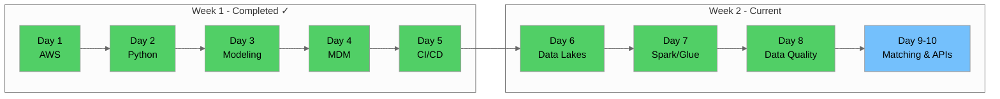

### Prerequisites

Before starting Days 9-10, ensure you have:

- ✅ Completed Day 8 (AWS Glue & Data Quality)
- ✅ Python environment with pandas, fuzzywuzzy, and recordlinkage installed
- ✅ Understanding of data quality concepts and profiling
- ✅ Familiarity with REST API concepts
- ✅ AWS account with Lambda and API Gateway access

### Learning Objectives

By the end of Days 9-10, you will be able to:

1. **Profile** data to understand quality, patterns, and distributions
2. **Implement** fuzzy matching algorithms (Levenshtein, Jaro-Winkler, Soundex)
3. **Apply** probabilistic matching with weights and thresholds
4. **Understand** ML-based approaches to entity resolution
5. **Design** survivorship rules for creating golden records
6. **Build** RESTful APIs for master data CRUD operations
7. **Implement** authentication and authorization for APIs
8. **Document** APIs using OpenAPI/Swagger specifications
9. **Configure** Change Data Capture for master data synchronization
10. **Create** a complete deduplication pipeline for vendor data

---

## Part 1: Data Profiling Techniques

### 1.1 What is Data Profiling?

**Data profiling** is the process of examining data to understand its structure, content, quality, and relationships. It's a critical first step before any matching or deduplication effort.

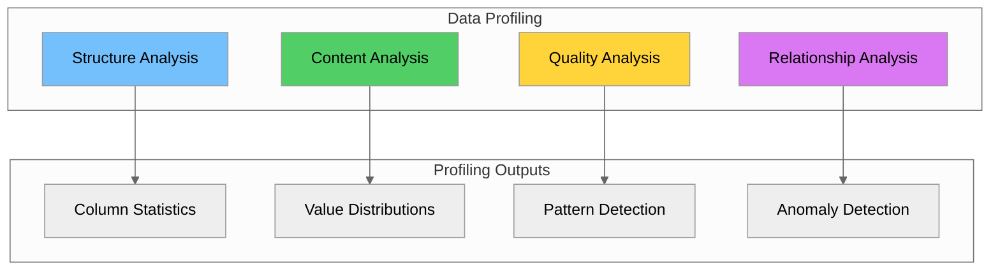

### 1.2 Key Profiling Dimensions

| Dimension | Description | Metrics |
|-----------|-------------|---------|
| **Completeness** | Presence of values | Null count, fill rate |
| **Uniqueness** | Distinctness of values | Cardinality, uniqueness ratio |
| **Validity** | Conformance to rules | Pattern match rate, range compliance |
| **Consistency** | Uniformity across records | Format consistency, cross-field validation |
| **Accuracy** | Correctness of values | Reference data match rate |
| **Timeliness** | Currency of data | Age of records, update frequency |

### 1.3 Data Profiling with Python

```python
import pandas as pd
import numpy as np
from collections import Counter
import re

def profile_dataframe(df: pd.DataFrame) -> pd.DataFrame:
    """
    Generate comprehensive data profile for a DataFrame.
    
    Args:
        df: Input DataFrame to profile
        
    Returns:
        DataFrame with profiling statistics for each column
    """
    profile_results = []
    total_rows = len(df)
    
    for column in df.columns:
        col_data = df[column]
        
        # Basic statistics
        non_null_count = col_data.count()
        null_count = col_data.isnull().sum()
        unique_count = col_data.nunique()
        
        # Calculate metrics
        completeness = (non_null_count / total_rows) * 100 if total_rows > 0 else 0
        uniqueness = (unique_count / non_null_count) * 100 if non_null_count > 0 else 0
        
        # Data type specific stats
        if pd.api.types.is_numeric_dtype(col_data):
            min_val = col_data.min()
            max_val = col_data.max()
            mean_val = col_data.mean()
            std_val = col_data.std()
        else:
            min_val = col_data.dropna().min() if non_null_count > 0 else None
            max_val = col_data.dropna().max() if non_null_count > 0 else None
            mean_val = None
            std_val = None
        
        # Most common values
        if non_null_count > 0:
            top_values = col_data.value_counts().head(3).to_dict()
        else:
            top_values = {}
        
        profile_results.append({
            'column': column,
            'data_type': str(col_data.dtype),
            'total_rows': total_rows,
            'non_null_count': non_null_count,
            'null_count': null_count,
            'completeness_pct': round(completeness, 2),
            'unique_count': unique_count,
            'uniqueness_pct': round(uniqueness, 2),
            'min_value': min_val,
            'max_value': max_val,
            'mean_value': round(mean_val, 2) if mean_val is not None else None,
            'std_value': round(std_val, 2) if std_val is not None else None,
            'top_values': str(top_values)
        })
    
    return pd.DataFrame(profile_results)


def detect_patterns(series: pd.Series) -> dict:
    """
    Detect common patterns in a string column.
    """
    patterns = {
        'email': r'^[\w\.-]+@[\w\.-]+\.\w+$',
        'phone_us': r'^\(?[0-9]{3}\)?[-.\s]?[0-9]{3}[-.\s]?[0-9]{4}$',
        'zip_code': r'^\d{5}(-\d{4})?$',
        'date_iso': r'^\d{4}-\d{2}-\d{2}$',
        'numeric': r'^\d+$',
        'alpha': r'^[a-zA-Z]+$',
        'alphanumeric': r'^[a-zA-Z0-9]+$'
    }
    
    results = {}
    non_null = series.dropna().astype(str)
    total = len(non_null)
    
    for pattern_name, pattern in patterns.items():
        matches = non_null.str.match(pattern).sum()
        results[pattern_name] = {
            'match_count': matches,
            'match_pct': round((matches / total) * 100, 2) if total > 0 else 0
        }
    
    return results


# Example usage with taxi zone data
zones_df = pd.read_csv('data/taxi_zone_lookup.csv')
profile = profile_dataframe(zones_df)
print(profile.to_string())
```

### 1.4 Profiling NYC Taxi Zone Data

```python
import pandas as pd

# Load taxi zone lookup data
zones_df = pd.read_csv('data/taxi_zone_lookup.csv')

print("=== NYC Taxi Zone Data Profile ===\n")

# Basic info
print(f"Total Records: {len(zones_df)}")
print(f"Total Columns: {len(zones_df.columns)}")
print(f"\nColumn Names: {list(zones_df.columns)}")

# Profile each column
print("\n=== Column Analysis ===")
for col in zones_df.columns:
    print(f"\n--- {col} ---")
    print(f"  Data Type: {zones_df[col].dtype}")
    print(f"  Non-Null Count: {zones_df[col].count()}")
    print(f"  Null Count: {zones_df[col].isnull().sum()}")
    print(f"  Unique Values: {zones_df[col].nunique()}")
    
    if zones_df[col].dtype == 'object':
        print(f"  Sample Values: {zones_df[col].head(3).tolist()}")
        print(f"  Value Counts (Top 5):")
        for val, count in zones_df[col].value_counts().head(5).items():
            print(f"    {val}: {count}")

# Borough distribution
print("\n=== Borough Distribution ===")
borough_dist = zones_df['Borough'].value_counts()
for borough, count in borough_dist.items():
    pct = (count / len(zones_df)) * 100
    print(f"  {borough}: {count} ({pct:.1f}%)")
```

---

## Part 2: Fuzzy Matching Algorithms

### 2.1 Introduction to Fuzzy Matching

**Fuzzy matching** (also called approximate string matching) finds strings that are approximately equal. This is essential for matching records where data entry errors, typos, or formatting differences exist.

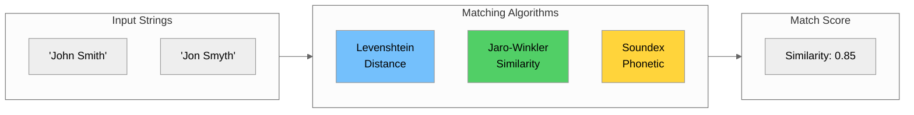

### 2.2 Levenshtein Distance (Edit Distance)

**Levenshtein distance** measures the minimum number of single-character edits (insertions, deletions, substitutions) required to transform one string into another.

```python
def levenshtein_distance(s1: str, s2: str) -> int:
    """
    Calculate Levenshtein distance between two strings.
    """
    if len(s1) < len(s2):
        return levenshtein_distance(s2, s1)
    
    if len(s2) == 0:
        return len(s1)
    
    previous_row = range(len(s2) + 1)
    
    for i, c1 in enumerate(s1):
        current_row = [i + 1]
        for j, c2 in enumerate(s2):
            insertions = previous_row[j + 1] + 1
            deletions = current_row[j] + 1
            substitutions = previous_row[j] + (c1 != c2)
            current_row.append(min(insertions, deletions, substitutions))
        previous_row = current_row
    
    return previous_row[-1]


def levenshtein_similarity(s1: str, s2: str) -> float:
    """
    Calculate Levenshtein similarity ratio (0 to 1).
    """
    distance = levenshtein_distance(s1, s2)
    max_len = max(len(s1), len(s2))
    if max_len == 0:
        return 1.0
    return 1 - (distance / max_len)


# Examples
examples = [
    ("Manhattan", "Manhatan"),
    ("Brooklyn", "Brooklin"),
    ("Queens", "Queens"),
    ("JFK Airport", "JFK Airprt"),
    ("Times Square", "Time Square")
]

print("=== Levenshtein Distance Examples ===\n")
for s1, s2 in examples:
    dist = levenshtein_distance(s1, s2)
    sim = levenshtein_similarity(s1, s2)
    print(f"'{s1}' vs '{s2}'")
    print(f"  Distance: {dist}, Similarity: {sim:.2%}\n")
```

### 2.3 Jaro-Winkler Similarity

**Jaro-Winkler** is particularly effective for short strings like names. It gives higher scores to strings that match from the beginning.

```python
def jaro_similarity(s1: str, s2: str) -> float:
    """Calculate Jaro similarity between two strings."""
    if s1 == s2:
        return 1.0
    
    len1, len2 = len(s1), len(s2)
    if len1 == 0 or len2 == 0:
        return 0.0
    
    match_distance = max(len1, len2) // 2 - 1
    if match_distance < 0:
        match_distance = 0
    
    s1_matches = [False] * len1
    s2_matches = [False] * len2
    matches = 0
    transpositions = 0
    
    for i in range(len1):
        start = max(0, i - match_distance)
        end = min(i + match_distance + 1, len2)
        
        for j in range(start, end):
            if s2_matches[j] or s1[i] != s2[j]:
                continue
            s1_matches[i] = True
            s2_matches[j] = True
            matches += 1
            break
    
    if matches == 0:
        return 0.0
    
    k = 0
    for i in range(len1):
        if not s1_matches[i]:
            continue
        while not s2_matches[k]:
            k += 1
        if s1[i] != s2[k]:
            transpositions += 1
        k += 1
    
    jaro = (matches / len1 + matches / len2 + 
            (matches - transpositions / 2) / matches) / 3
    return jaro


def jaro_winkler_similarity(s1: str, s2: str, p: float = 0.1) -> float:
    """Calculate Jaro-Winkler similarity between two strings."""
    jaro = jaro_similarity(s1, s2)
    
    prefix_len = 0
    for i in range(min(len(s1), len(s2), 4)):
        if s1[i] == s2[i]:
            prefix_len += 1
        else:
            break
    
    return jaro + prefix_len * p * (1 - jaro)
```

### 2.4 Soundex Phonetic Matching

**Soundex** encodes strings based on how they sound, making it useful for matching names with different spellings but similar pronunciations.

```python
def soundex(name: str) -> str:
    """Generate Soundex code for a string."""
    if not name:
        return "0000"
    
    name = name.upper()
    first_letter = name[0]
    
    mapping = {
        'B': '1', 'F': '1', 'P': '1', 'V': '1',
        'C': '2', 'G': '2', 'J': '2', 'K': '2', 'Q': '2', 'S': '2', 'X': '2', 'Z': '2',
        'D': '3', 'T': '3',
        'L': '4',
        'M': '5', 'N': '5',
        'R': '6'
    }
    
    coded = first_letter
    prev_code = mapping.get(first_letter, '0')
    
    for char in name[1:]:
        code = mapping.get(char, '')
        if code and code != prev_code:
            coded += code
        prev_code = code if code else prev_code
    
    coded = coded[:4].ljust(4, '0')
    return coded


# Examples
soundex_examples = [
    ("Smith", "Smyth"),
    ("Johnson", "Jonson"),
    ("Manhattan", "Manhatan"),
    ("Brooklyn", "Brooklin")
]

print("=== Soundex Examples ===\n")
for s1, s2 in soundex_examples:
    code1 = soundex(s1)
    code2 = soundex(s2)
    match = code1 == code2
    print(f"'{s1}' ({code1}) vs '{s2}' ({code2}) - Match: {match}")
```

### 2.5 Using FuzzyWuzzy Library

```python
from fuzzywuzzy import fuzz
from fuzzywuzzy import process

# Different matching methods
s1 = "Times Square/Theatre District"
s2 = "Times Sq Theatre District"

print("=== FuzzyWuzzy Matching Methods ===\n")
print(f"Comparing: '{s1}' vs '{s2}'\n")

print(f"Simple Ratio: {fuzz.ratio(s1, s2)}")
print(f"Partial Ratio: {fuzz.partial_ratio(s1, s2)}")
print(f"Token Sort Ratio: {fuzz.token_sort_ratio(s1, s2)}")
print(f"Token Set Ratio: {fuzz.token_set_ratio(s1, s2)}")

# Find best matches from a list
zones = [
    "Times Square/Theatre District",
    "Times Sq/Theatre District", 
    "Time Square Theatre",
    "Central Park",
    "Penn Station"
]

query = "Times Square Theatre"
print(f"\n=== Finding Best Matches for '{query}' ===\n")

matches = process.extract(query, zones, limit=3)
for match, score in matches:
    print(f"  {match}: {score}%")
```

### 2.6 Comparison of Matching Algorithms

| Algorithm | Best For | Pros | Cons |
|-----------|----------|------|------|
| **Levenshtein** | General text | Simple, intuitive | Slow for long strings |
| **Jaro-Winkler** | Short strings, names | Fast, prefix-weighted | Less effective for long text |
| **Soundex** | Names, phonetic matching | Language-aware | English-centric, coarse |
| **Token-based** | Multi-word strings | Order-independent | May miss character errors |

---

## Part 3: Probabilistic Matching

### 3.1 Introduction to Probabilistic Matching

**Probabilistic matching** (also called Fellegi-Sunter matching) uses statistical methods to calculate the probability that two records refer to the same entity. It assigns weights to matching and non-matching field values.

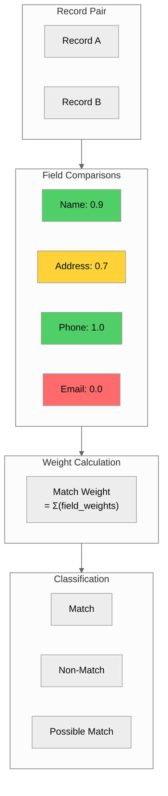

### 3.2 Fellegi-Sunter Model

The Fellegi-Sunter model calculates:
- **m-probability**: P(fields agree | records match)
- **u-probability**: P(fields agree | records don't match)
- **Match weight**: log2(m/u) when fields agree
- **Non-match weight**: log2((1-m)/(1-u)) when fields disagree

#### How to Estimate m and u Probabilities

**m-probability estimation:**
- Use labeled training data where you know which records match
- Calculate: m = (# of matching pairs where field agrees) / (total # of matching pairs)
- Example: If 95 out of 100 known matching pairs have the same name, m = 0.95

**u-probability estimation:**
- Calculate the probability of random agreement
- For exact matches: u ≈ 1 / (number of unique values in the field)
- Example: If there are 100 unique names, u ≈ 0.01

**Practical tips:**
- Start with reasonable estimates based on data characteristics
- Refine using labeled samples or domain expertise
- Higher m/u ratio = more discriminating field

```python
import math
from typing import Dict, Tuple

class ProbabilisticMatcher:
    """Probabilistic record matching using Fellegi-Sunter model."""
    
    def __init__(self, field_configs: Dict[str, Dict]):
        """
        Initialize matcher with field configurations.
        
        Args:
            field_configs: Dictionary with field names and their m/u probabilities
                Example: {'name': {'m': 0.95, 'u': 0.01}}
        """
        self.field_configs = field_configs
        self._calculate_weights()
    
    def _calculate_weights(self):
        """Calculate match and non-match weights for each field."""
        self.weights = {}
        
        for field, config in self.field_configs.items():
            m = config['m']
            u = config['u']
            
            match_weight = math.log2(m / u) if u > 0 else float('inf')
            non_match_weight = math.log2((1 - m) / (1 - u)) if (1 - u) > 0 else float('-inf')
            
            self.weights[field] = {
                'match': match_weight,
                'non_match': non_match_weight
            }
    
    def compare_records(self, record1: Dict, record2: Dict, 
                       comparators: Dict = None) -> Tuple[float, Dict]:
        """Compare two records and calculate match score."""
        if comparators is None:
            comparators = {}
        
        total_score = 0
        field_scores = {}
        
        for field in self.field_configs.keys():
            val1 = record1.get(field, '')
            val2 = record2.get(field, '')
            
            if field in comparators:
                similarity = comparators[field](val1, val2)
            else:
                similarity = 1.0 if val1 == val2 else 0.0
            
            if similarity >= 0.5:
                weight = self.weights[field]['match'] * similarity
            else:
                weight = self.weights[field]['non_match'] * (1 - similarity)
            
            total_score += weight
            field_scores[field] = {'similarity': similarity, 'weight': weight}
        
        return total_score, field_scores
    
    def classify(self, score: float, 
                match_threshold: float = 10.0,
                non_match_threshold: float = -5.0) -> str:
        """Classify a comparison score."""
        if score >= match_threshold:
            return 'match'
        elif score <= non_match_threshold:
            return 'non_match'
        else:
            return 'possible_match'


# Example usage
from fuzzywuzzy import fuzz

field_configs = {
    'zone_name': {'m': 0.95, 'u': 0.01},
    'borough': {'m': 0.90, 'u': 0.20},
    'service_zone': {'m': 0.85, 'u': 0.25}
}

matcher = ProbabilisticMatcher(field_configs)

record1 = {
    'zone_name': 'Times Square/Theatre District',
    'borough': 'Manhattan',
    'service_zone': 'Yellow Zone'
}

record2 = {
    'zone_name': 'Times Sq/Theatre District',
    'borough': 'Manhattan',
    'service_zone': 'Yellow Zone'
}

def fuzzy_compare(s1, s2):
    return fuzz.token_set_ratio(str(s1), str(s2)) / 100.0

comparators = {
    'zone_name': fuzzy_compare,
    'borough': fuzzy_compare,
    'service_zone': fuzzy_compare
}

score, field_scores = matcher.compare_records(record1, record2, comparators)
classification = matcher.classify(score)

print(f"Total Score: {score:.2f}")
print(f"Classification: {classification}")
```

### 3.3 Using RecordLinkage Library

The `recordlinkage` library provides a comprehensive framework for probabilistic matching.

```python
import pandas as pd
import recordlinkage
from recordlinkage.index import Block

# Create sample vendor data with potential duplicates
vendors = pd.DataFrame({
    'vendor_id': [1, 2, 3, 4, 5, 6],
    'vendor_name': [
        'Creative Mobile Technologies LLC',
        'Creative Mobile Tech',
        'Curb Mobility Inc',
        'Curb Mobility',
        'Myle Technologies Corp',
        'Helix Transportation'
    ],
    'city': ['New York', 'New York', 'New York', 'NYC', 'New York', 'New York'],
    'state': ['NY', 'NY', 'NY', 'NY', 'NY', 'NY']
})

# Create indexer to generate candidate pairs
indexer = recordlinkage.Index()
indexer.block('state')  # Only compare records with same state

# Generate candidate pairs
candidate_pairs = indexer.index(vendors)
print(f"Candidate pairs to compare: {len(candidate_pairs)}")

# Create comparison object
compare = recordlinkage.Compare()

# Add comparison rules
compare.string('vendor_name', 'vendor_name', method='jarowinkler', 
               threshold=0.85, label='vendor_name')
compare.string('city', 'city', method='levenshtein', 
               threshold=0.85, label='city')
compare.exact('state', 'state', label='state')

# Compute comparison vectors
features = compare.compute(candidate_pairs, vendors)
print("\nComparison Features:")
print(features)

# Find matches using threshold
matches = features[features.sum(axis=1) >= 2]
print(f"\nPotential Matches: {len(matches)}")
print(matches)
```

### 3.4 Blocking Strategies

**Blocking** reduces the number of comparisons by only comparing records that share certain attributes.

| Strategy | Description | Use Case |
|----------|-------------|----------|
| **Exact Block** | Same value in blocking field | State, country codes |
| **Sorted Neighborhood** | Records within window after sorting | Names, addresses |
| **Q-gram** | Share common character sequences | Misspelled names |
| **Canopy** | Cluster-based blocking | Large datasets |

```python
import recordlinkage

# Different blocking strategies
indexer1 = recordlinkage.Index()
indexer1.block('state')  # Exact blocking

indexer2 = recordlinkage.Index()
indexer2.sortedneighbourhood('vendor_name', window=3)  # Sorted neighborhood

indexer3 = recordlinkage.Index()
indexer3.full()  # Compare all pairs (expensive!)

# Compare pair counts
pairs1 = indexer1.index(vendors)
pairs2 = indexer2.index(vendors)
pairs3 = indexer3.index(vendors)

print(f"Block on state: {len(pairs1)} pairs")
print(f"Sorted neighborhood: {len(pairs2)} pairs")
print(f"Full comparison: {len(pairs3)} pairs")
```

---

## Part 4: ML-Based Entity Resolution

### 4.1 Overview of ML Approaches

Machine learning can improve entity resolution by learning patterns from labeled examples.

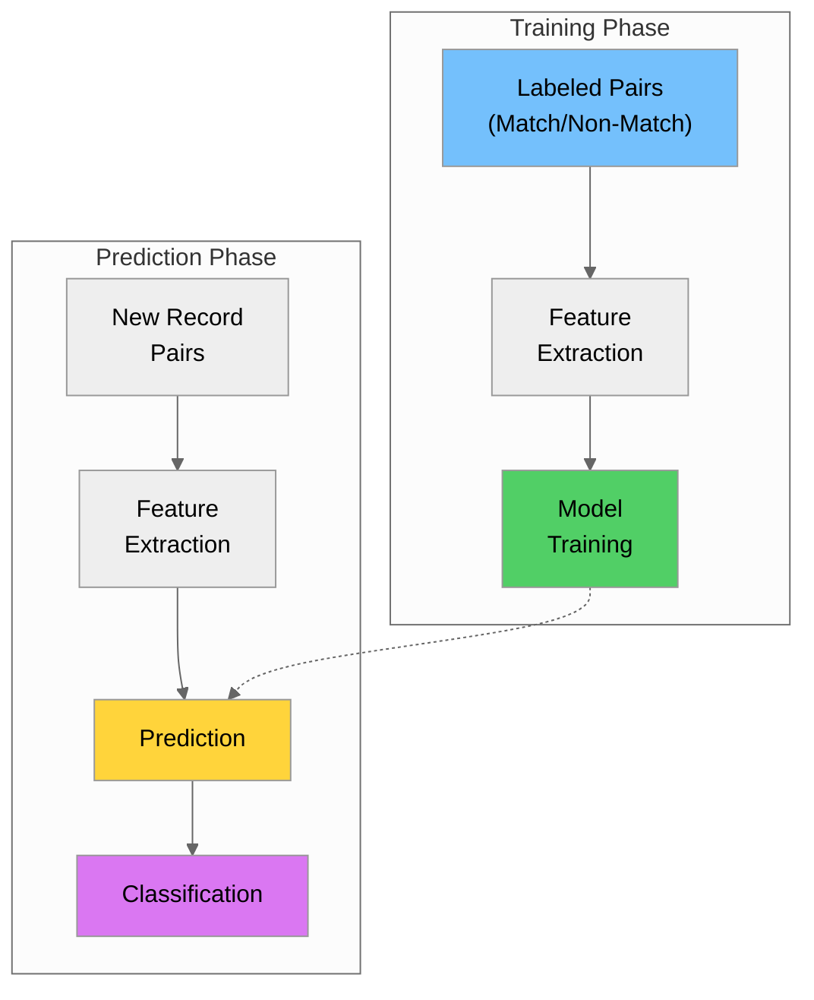

### 4.2 Feature Engineering for Entity Resolution

```python
import pandas as pd
import numpy as np
from fuzzywuzzy import fuzz
from sklearn.ensemble import RandomForestClassifier
from sklearn.model_selection import train_test_split
from sklearn.metrics import classification_report

def extract_features(record1: dict, record2: dict) -> dict:
    """Extract comparison features for a record pair."""
    features = {}
    
    # Name similarity features
    name1 = str(record1.get('name', ''))
    name2 = str(record2.get('name', ''))
    
    features['name_ratio'] = fuzz.ratio(name1, name2) / 100
    features['name_partial'] = fuzz.partial_ratio(name1, name2) / 100
    features['name_token_sort'] = fuzz.token_sort_ratio(name1, name2) / 100
    features['name_token_set'] = fuzz.token_set_ratio(name1, name2) / 100
    
    # Address similarity
    addr1 = str(record1.get('address', ''))
    addr2 = str(record2.get('address', ''))
    features['address_ratio'] = fuzz.ratio(addr1, addr2) / 100
    features['address_token_set'] = fuzz.token_set_ratio(addr1, addr2) / 100
    
    # City exact match
    features['city_match'] = 1 if record1.get('city') == record2.get('city') else 0
    
    # State exact match
    features['state_match'] = 1 if record1.get('state') == record2.get('state') else 0
    
    # Zip code similarity
    zip1 = str(record1.get('zip', ''))
    zip2 = str(record2.get('zip', ''))
    features['zip_match'] = 1 if zip1 == zip2 else 0
    features['zip_prefix_match'] = 1 if zip1[:3] == zip2[:3] else 0
    
    return features


# Create training data (in practice, this would be labeled by humans)
training_pairs = [
    ({'name': 'Creative Mobile Technologies', 'city': 'New York', 'state': 'NY'},
     {'name': 'Creative Mobile Tech', 'city': 'New York', 'state': 'NY'},
     1),  # Match
    ({'name': 'Curb Mobility Inc', 'city': 'New York', 'state': 'NY'},
     {'name': 'Curb Mobility', 'city': 'NYC', 'state': 'NY'},
     1),  # Match
    ({'name': 'Creative Mobile Technologies', 'city': 'New York', 'state': 'NY'},
     {'name': 'Helix Transportation', 'city': 'New York', 'state': 'NY'},
     0),  # Non-match
]

# Extract features
X = []
y = []
for r1, r2, label in training_pairs:
    features = extract_features(r1, r2)
    X.append(list(features.values()))
    y.append(label)

X = np.array(X)
y = np.array(y)

# Train model (with more data in practice)
model = RandomForestClassifier(n_estimators=100, random_state=42)
model.fit(X, y)

# Feature importance
feature_names = list(extract_features({}, {}).keys())
importance = pd.DataFrame({
    'feature': feature_names,
    'importance': model.feature_importances_
}).sort_values('importance', ascending=False)

print("Feature Importance:")
print(importance)
```

### 4.3 Active Learning for Entity Resolution

Active learning reduces labeling effort by selecting the most informative pairs for human review.

```python
from typing import List, Tuple
import numpy as np

class ActiveLearningMatcher:
    """Entity resolution with active learning."""
    
    def __init__(self, model):
        self.model = model
        self.labeled_pairs = []
    
    def select_uncertain_pairs(self, pairs: List[Tuple], 
                               features: np.ndarray, 
                               n_samples: int = 10) -> List[int]:
        """Select pairs where model is most uncertain."""
        # Get prediction probabilities
        probs = self.model.predict_proba(features)
        
        # Calculate uncertainty (entropy or distance from 0.5)
        uncertainty = np.abs(probs[:, 1] - 0.5)
        
        # Select most uncertain pairs
        uncertain_indices = np.argsort(uncertainty)[:n_samples]
        
        return uncertain_indices.tolist()
    
    def label_pair(self, pair_idx: int, label: int):
        """Add human label for a pair."""
        self.labeled_pairs.append((pair_idx, label))
    
    def retrain(self, X: np.ndarray, y: np.ndarray):
        """Retrain model with new labels."""
        self.model.fit(X, y)


# Usage example
print("Active Learning Workflow:")
print("1. Train initial model on small labeled set")
print("2. Select uncertain pairs for human review")
print("3. Human labels selected pairs")
print("4. Retrain model with new labels")
print("5. Repeat until performance is satisfactory")
```

### 4.4 Deep Learning Approaches

Modern entity resolution can use deep learning for better feature learning.

```python
# Conceptual example - requires TensorFlow/PyTorch
"""
Deep Learning Entity Resolution Architecture:

1. Siamese Networks
   - Two identical networks process each record
   - Learn embeddings that are similar for matches
   - Use contrastive loss or triplet loss

2. Transformer-based Models
   - Use pre-trained language models (BERT, RoBERTa)
   - Fine-tune on entity matching task
   - Better understanding of semantic similarity

3. Graph Neural Networks
   - Model relationships between entities
   - Propagate match information through graph
   - Handle transitive matches
"""

# Example architecture (pseudo-code)
class SiameseEntityMatcher:
    """
    Siamese network for entity matching.
    
    Architecture:
    - Embedding layer for text fields
    - LSTM/Transformer encoder
    - Similarity computation
    - Classification head
    """
    
    def __init__(self, vocab_size, embedding_dim, hidden_dim):
        # Initialize layers
        pass
    
    def encode(self, record):
        """Encode a record into a fixed-size vector."""
        pass
    
    def forward(self, record1, record2):
        """Compute match probability for a pair."""
        emb1 = self.encode(record1)
        emb2 = self.encode(record2)
        similarity = cosine_similarity(emb1, emb2)
        return similarity
```

---

## Part 5: Survivorship Rules

### 5.1 What are Survivorship Rules?

**Survivorship rules** determine which values to keep when merging duplicate records into a single "golden record."

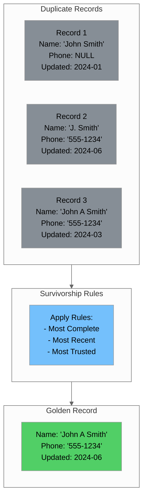

### 5.2 Common Survivorship Strategies

| Strategy | Description | Best For |
|----------|-------------|----------|
| **Most Recent** | Use value from most recently updated record | Frequently changing data |
| **Most Complete** | Use longest/most detailed value | Names, addresses |
| **Most Frequent** | Use most common value across duplicates | Categorical data |
| **Most Trusted** | Use value from highest-trust source | Multi-source data |
| **Aggregate** | Combine values (sum, average) | Numeric data |
| **Custom Logic** | Business-specific rules | Complex scenarios |

### 5.3 Implementing Survivorship Rules

```python
from typing import List, Dict, Any, Callable
from datetime import datetime
import pandas as pd

class SurvivorshipEngine:
    """Engine for applying survivorship rules to create golden records."""
    
    def __init__(self):
        self.rules = {}
        self.source_trust = {}
    
    def set_source_trust(self, trust_order: List[str]):
        """Set trust order for data sources (first = most trusted)."""
        self.source_trust = {source: i for i, source in enumerate(trust_order)}
    
    def add_rule(self, field: str, strategy: str, **kwargs):
        """Add survivorship rule for a field."""
        self.rules[field] = {'strategy': strategy, **kwargs}
    
    def _most_recent(self, records: List[Dict], field: str, 
                     date_field: str = 'updated_at') -> Any:
        """Return value from most recently updated record."""
        valid_records = [r for r in records if r.get(field) is not None]
        if not valid_records:
            return None
        
        sorted_records = sorted(valid_records, 
                               key=lambda x: x.get(date_field, ''), 
                               reverse=True)
        return sorted_records[0].get(field)
    
    def _most_complete(self, records: List[Dict], field: str) -> Any:
        """Return longest/most complete value."""
        values = [r.get(field) for r in records if r.get(field) is not None]
        if not values:
            return None
        
        # For strings, return longest
        if all(isinstance(v, str) for v in values):
            return max(values, key=len)
        
        return values[0]
    
    def _most_frequent(self, records: List[Dict], field: str) -> Any:
        """Return most common value."""
        values = [r.get(field) for r in records if r.get(field) is not None]
        if not values:
            return None
        
        from collections import Counter
        counter = Counter(values)
        return counter.most_common(1)[0][0]
    
    def _most_trusted(self, records: List[Dict], field: str,
                      source_field: str = 'source') -> Any:
        """Return value from most trusted source."""
        valid_records = [r for r in records if r.get(field) is not None]
        if not valid_records:
            return None
        
        sorted_records = sorted(
            valid_records,
            key=lambda x: self.source_trust.get(x.get(source_field), 999)
        )
        return sorted_records[0].get(field)
    
    def _aggregate_sum(self, records: List[Dict], field: str) -> Any:
        """Sum numeric values."""
        values = [r.get(field) for r in records if r.get(field) is not None]
        if not values:
            return None
        return sum(values)
    
    def _aggregate_avg(self, records: List[Dict], field: str) -> Any:
        """Average numeric values."""
        values = [r.get(field) for r in records if r.get(field) is not None]
        if not values:
            return None
        return sum(values) / len(values)
    
    def create_golden_record(self, records: List[Dict]) -> Dict:
        """Create golden record from duplicate records."""
        golden = {}
        
        for field, rule_config in self.rules.items():
            strategy = rule_config['strategy']
            
            if strategy == 'most_recent':
                date_field = rule_config.get('date_field', 'updated_at')
                golden[field] = self._most_recent(records, field, date_field)
            elif strategy == 'most_complete':
                golden[field] = self._most_complete(records, field)
            elif strategy == 'most_frequent':
                golden[field] = self._most_frequent(records, field)
            elif strategy == 'most_trusted':
                source_field = rule_config.get('source_field', 'source')
                golden[field] = self._most_trusted(records, field, source_field)
            elif strategy == 'sum':
                golden[field] = self._aggregate_sum(records, field)
            elif strategy == 'average':
                golden[field] = self._aggregate_avg(records, field)
            elif strategy == 'first':
                values = [r.get(field) for r in records if r.get(field)]
                golden[field] = values[0] if values else None
        
        return golden


# Example usage
engine = SurvivorshipEngine()

# Set source trust order
engine.set_source_trust(['CRM', 'ERP', 'Web', 'Manual'])

# Define rules for each field
engine.add_rule('vendor_name', 'most_complete')
engine.add_rule('vendor_code', 'most_trusted', source_field='source')
engine.add_rule('address', 'most_recent', date_field='updated_at')
engine.add_rule('phone', 'most_complete')
engine.add_rule('email', 'most_recent', date_field='updated_at')
engine.add_rule('total_orders', 'sum')
engine.add_rule('avg_order_value', 'average')

# Sample duplicate records
duplicates = [
    {
        'vendor_name': 'Creative Mobile Tech',
        'vendor_code': 'CMT',
        'address': '123 Main St',
        'phone': '555-1234',
        'email': 'info@cmt.com',
        'total_orders': 100,
        'avg_order_value': 50.0,
        'source': 'CRM',
        'updated_at': '2024-01-15'
    },
    {
        'vendor_name': 'Creative Mobile Technologies LLC',
        'vendor_code': 'CMT-001',
        'address': '123 Main Street, Suite 100',
        'phone': None,
        'email': 'contact@creativemobile.com',
        'total_orders': 50,
        'avg_order_value': 75.0,
        'source': 'ERP',
        'updated_at': '2024-06-20'
    },
    {
        'vendor_name': 'Creative Mobile',
        'vendor_code': None,
        'address': '123 Main St',
        'phone': '555-1234',
        'email': None,
        'total_orders': 25,
        'avg_order_value': 60.0,
        'source': 'Web',
        'updated_at': '2024-03-10'
    }
]

# Create golden record
golden = engine.create_golden_record(duplicates)

print("=== Golden Record ===")
for field, value in golden.items():
    print(f"  {field}: {value}")
```

### 5.4 Survivorship Rules for NYC Taxi Data

```python
# Survivorship rules for taxi zone master data
zone_survivorship = SurvivorshipEngine()

zone_survivorship.add_rule('LocationID', 'first')  # Keep original ID
zone_survivorship.add_rule('Zone', 'most_complete')  # Longest zone name
zone_survivorship.add_rule('Borough', 'most_frequent')  # Most common borough
zone_survivorship.add_rule('service_zone', 'most_trusted')  # From trusted source

# Example: Merging zone records from different sources
zone_duplicates = [
    {'LocationID': 230, 'Zone': 'Times Sq', 'Borough': 'Manhattan', 
     'service_zone': 'Yellow Zone', 'source': 'TLC'},
    {'LocationID': 230, 'Zone': 'Times Square/Theatre District', 
     'Borough': 'Manhattan', 'service_zone': 'Yellow Zone', 'source': 'NYC_Open'},
    {'LocationID': 230, 'Zone': 'Times Square', 'Borough': 'Manhattan', 
     'service_zone': 'Yellow', 'source': 'Manual'}
]

zone_survivorship.set_source_trust(['TLC', 'NYC_Open', 'Manual'])
golden_zone = zone_survivorship.create_golden_record(zone_duplicates)
print(f"Golden Zone Record: {golden_zone}")
```

---

## Part 6: RESTful API Design for Master Data

### 6.1 REST API Principles

**REST** (Representational State Transfer) is an architectural style for designing networked applications. RESTful APIs for master data should follow these principles:

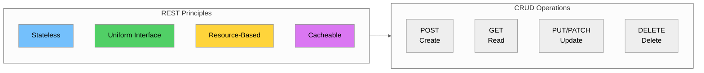

### 6.2 API Design Best Practices

| Practice | Description | Example |
|----------|-------------|---------|
| **Use nouns for resources** | Resources are things, not actions | `/zones` not `/getZones` |
| **Use plural names** | Consistent naming convention | `/vendors` not `/vendor` |
| **Use HTTP methods** | GET, POST, PUT, PATCH, DELETE | `GET /zones/123` |
| **Version your API** | Allow for evolution | `/v1/zones` |
| **Use query parameters** | For filtering and pagination | `/zones?borough=Manhattan` |
| **Return appropriate status codes** | Indicate success/failure | 200, 201, 400, 404, 500 |

### 6.3 Master Data API Endpoints

```
# Taxi Zone Master Data API

Base URL: https://api.example.com/v1

# Zone Endpoints
GET    /zones                    # List all zones
GET    /zones/{id}               # Get zone by ID
POST   /zones                    # Create new zone
PUT    /zones/{id}               # Update zone (full)
PATCH  /zones/{id}               # Update zone (partial)
DELETE /zones/{id}               # Delete zone

# Filtering and Pagination
GET    /zones?borough=Manhattan  # Filter by borough
GET    /zones?service_zone=Yellow%20Zone  # Filter by service zone
GET    /zones?page=1&limit=50    # Pagination
GET    /zones?sort=Zone&order=asc  # Sorting

# Bulk Operations
POST   /zones/bulk               # Create multiple zones
PUT    /zones/bulk               # Update multiple zones
DELETE /zones/bulk               # Delete multiple zones

# Search
GET    /zones/search?q=airport   # Search zones
```

### 6.4 Request/Response Examples

```python
# Example API responses

# GET /zones/230
{
    "id": 230,
    "zone": "Times Square/Theatre District",
    "borough": "Manhattan",
    "service_zone": "Yellow Zone",
    "created_at": "2024-01-01T00:00:00Z",
    "updated_at": "2024-06-15T10:30:00Z",
    "_links": {
        "self": "/v1/zones/230",
        "trips": "/v1/zones/230/trips"
    }
}

# GET /zones?borough=Manhattan&page=1&limit=10
{
    "data": [
        {"id": 4, "zone": "Alphabet City", "borough": "Manhattan", ...},
        {"id": 12, "zone": "Battery Park", "borough": "Manhattan", ...},
        ...
    ],
    "pagination": {
        "page": 1,
        "limit": 10,
        "total": 69,
        "total_pages": 7
    },
    "_links": {
        "self": "/v1/zones?borough=Manhattan&page=1&limit=10",
        "next": "/v1/zones?borough=Manhattan&page=2&limit=10",
        "last": "/v1/zones?borough=Manhattan&page=7&limit=10"
    }
}

# POST /zones
# Request Body:
{
    "zone": "New Zone Name",
    "borough": "Manhattan",
    "service_zone": "Yellow Zone"
}

# Response (201 Created):
{
    "id": 266,
    "zone": "New Zone Name",
    "borough": "Manhattan",
    "service_zone": "Yellow Zone",
    "created_at": "2024-06-20T14:30:00Z",
    "updated_at": "2024-06-20T14:30:00Z"
}

# Error Response (400 Bad Request):
{
    "error": {
        "code": "VALIDATION_ERROR",
        "message": "Invalid request body",
        "details": [
            {"field": "borough", "message": "Borough is required"},
            {"field": "zone", "message": "Zone name must be unique"}
        ]
    }
}
```

### 6.5 AWS Lambda Function for Zone API

```python
# lambda_function.py - AWS Lambda handler for Zone API

import json
import boto3
from decimal import Decimal
from typing import Dict, Any, Optional

# Initialize DynamoDB
dynamodb = boto3.resource('dynamodb')
table = dynamodb.Table('TaxiZones')

class DecimalEncoder(json.JSONEncoder):
    """Handle Decimal types from DynamoDB."""
    def default(self, obj):
        if isinstance(obj, Decimal):
            return int(obj) if obj % 1 == 0 else float(obj)
        return super().default(obj)


def create_response(status_code: int, body: Any) -> Dict:
    """Create API Gateway response."""
    return {
        'statusCode': status_code,
        'headers': {
            'Content-Type': 'application/json',
            'Access-Control-Allow-Origin': '*',
            'Access-Control-Allow-Methods': 'GET, POST, PUT, PATCH, DELETE, OPTIONS',
            'Access-Control-Allow-Headers': 'Content-Type, Authorization'
        },
        'body': json.dumps(body, cls=DecimalEncoder)
    }


def get_zone(zone_id: int) -> Dict:
    """Get a single zone by ID."""
    response = table.get_item(Key={'LocationID': zone_id})
    
    if 'Item' not in response:
        return create_response(404, {
            'error': {
                'code': 'NOT_FOUND',
                'message': f'Zone with ID {zone_id} not found'
            }
        })
    
    return create_response(200, response['Item'])


def list_zones(query_params: Optional[Dict] = None) -> Dict:
    """List zones with optional filtering."""
    if query_params is None:
        query_params = {}
    
    # Build filter expression
    filter_expression = None
    expression_values = {}
    
    if 'borough' in query_params:
        filter_expression = 'Borough = :borough'
        expression_values[':borough'] = query_params['borough']
    
    if 'service_zone' in query_params:
        if filter_expression:
            filter_expression += ' AND service_zone = :service_zone'
        else:
            filter_expression = 'service_zone = :service_zone'
        expression_values[':service_zone'] = query_params['service_zone']
    
    # Scan with filter
    scan_kwargs = {}
    if filter_expression:
        scan_kwargs['FilterExpression'] = filter_expression
        scan_kwargs['ExpressionAttributeValues'] = expression_values
    
    response = table.scan(**scan_kwargs)
    items = response.get('Items', [])
    
    # Pagination
    page = int(query_params.get('page', 1))
    limit = int(query_params.get('limit', 50))
    start = (page - 1) * limit
    end = start + limit
    
    paginated_items = items[start:end]
    
    return create_response(200, {
        'data': paginated_items,
        'pagination': {
            'page': page,
            'limit': limit,
            'total': len(items),
            'total_pages': (len(items) + limit - 1) // limit
        }
    })


def create_zone(body: Dict) -> Dict:
    """Create a new zone."""
    required_fields = ['zone', 'borough', 'service_zone']
    
    # Validate required fields
    missing = [f for f in required_fields if f not in body]
    if missing:
        return create_response(400, {
            'error': {
                'code': 'VALIDATION_ERROR',
                'message': 'Missing required fields',
                'details': [{'field': f, 'message': f'{f} is required'} for f in missing]
            }
        })
    
    # Generate new ID (in production, use a sequence or UUID)
    response = table.scan(ProjectionExpression='LocationID')
    max_id = max([item['LocationID'] for item in response['Items']], default=0)
    new_id = max_id + 1
    
    # Create item
    from datetime import datetime
    now = datetime.utcnow().isoformat() + 'Z'
    
    item = {
        'LocationID': new_id,
        'Zone': body['zone'],
        'Borough': body['borough'],
        'service_zone': body['service_zone'],
        'created_at': now,
        'updated_at': now
    }
    
    table.put_item(Item=item)
    
    return create_response(201, item)


def update_zone(zone_id: int, body: Dict, partial: bool = False) -> Dict:
    """Update a zone (full or partial)."""
    # Check if zone exists
    response = table.get_item(Key={'LocationID': zone_id})
    if 'Item' not in response:
        return create_response(404, {
            'error': {
                'code': 'NOT_FOUND',
                'message': f'Zone with ID {zone_id} not found'
            }
        })
    
    # Build update expression
    from datetime import datetime
    update_parts = []
    expression_values = {':updated_at': datetime.utcnow().isoformat() + 'Z'}
    expression_names = {}
    
    field_mapping = {
        'zone': 'Zone',
        'borough': 'Borough',
        'service_zone': 'service_zone'
    }
    
    for api_field, db_field in field_mapping.items():
        if api_field in body:
            placeholder = f':{api_field}'
            name_placeholder = f'#{api_field}'
            update_parts.append(f'{name_placeholder} = {placeholder}')
            expression_values[placeholder] = body[api_field]
            expression_names[name_placeholder] = db_field
    
    update_parts.append('#updated_at = :updated_at')
    expression_names['#updated_at'] = 'updated_at'
    
    update_expression = 'SET ' + ', '.join(update_parts)
    
    response = table.update_item(
        Key={'LocationID': zone_id},
        UpdateExpression=update_expression,
        ExpressionAttributeValues=expression_values,
        ExpressionAttributeNames=expression_names,
        ReturnValues='ALL_NEW'
    )
    
    return create_response(200, response['Attributes'])


def delete_zone(zone_id: int) -> Dict:
    """Delete a zone."""
    # Check if zone exists
    response = table.get_item(Key={'LocationID': zone_id})
    if 'Item' not in response:
        return create_response(404, {
            'error': {
                'code': 'NOT_FOUND',
                'message': f'Zone with ID {zone_id} not found'
            }
        })
    
    table.delete_item(Key={'LocationID': zone_id})
    
    return create_response(204, None)


def lambda_handler(event: Dict, context: Any) -> Dict:
    """Main Lambda handler."""
    http_method = event.get('httpMethod', '')
    path = event.get('path', '')
    path_params = event.get('pathParameters') or {}
    query_params = event.get('queryStringParameters') or {}
    
    try:
        body = json.loads(event.get('body', '{}')) if event.get('body') else {}
    except json.JSONDecodeError:
        return create_response(400, {
            'error': {
                'code': 'INVALID_JSON',
                'message': 'Request body is not valid JSON'
            }
        })
    
    # Route requests
    if path == '/v1/zones' or path == '/zones':
        if http_method == 'GET':
            return list_zones(query_params)
        elif http_method == 'POST':
            return create_zone(body)
    
    elif '/zones/' in path:
        zone_id = int(path_params.get('id', 0))
        
        if http_method == 'GET':
            return get_zone(zone_id)
        elif http_method == 'PUT':
            return update_zone(zone_id, body, partial=False)
        elif http_method == 'PATCH':
            return update_zone(zone_id, body, partial=True)
        elif http_method == 'DELETE':
            return delete_zone(zone_id)
    
    return create_response(404, {
        'error': {
            'code': 'NOT_FOUND',
            'message': 'Endpoint not found'
        }
    })
```

### 6.6 Bulk Operations

```python
def bulk_create_zones(body: Dict) -> Dict:
    """Create multiple zones in a single request."""
    zones = body.get('zones', [])
    
    if not zones:
        return create_response(400, {
            'error': {
                'code': 'VALIDATION_ERROR',
                'message': 'No zones provided'
            }
        })
    
    if len(zones) > 100:
        return create_response(400, {
            'error': {
                'code': 'LIMIT_EXCEEDED',
                'message': 'Maximum 100 zones per request'
            }
        })
    
    from datetime import datetime
    now = datetime.utcnow().isoformat() + 'Z'
    
    # Get max ID
    response = table.scan(ProjectionExpression='LocationID')
    max_id = max([item['LocationID'] for item in response['Items']], default=0)
    
    created = []
    errors = []
    
    with table.batch_writer() as batch:
        for i, zone in enumerate(zones):
            try:
                max_id += 1
                item = {
                    'LocationID': max_id,
                    'Zone': zone['zone'],
                    'Borough': zone['borough'],
                    'service_zone': zone['service_zone'],
                    'created_at': now,
                    'updated_at': now
                }
                batch.put_item(Item=item)
                created.append(item)
            except Exception as e:
                errors.append({
                    'index': i,
                    'error': str(e)
                })
    
    return create_response(201 if not errors else 207, {
        'created': created,
        'errors': errors,
        'summary': {
            'total': len(zones),
            'created': len(created),
            'failed': len(errors)
        }
    })


def bulk_update_zones(body: Dict) -> Dict:
    """Update multiple zones in a single request."""
    updates = body.get('updates', [])
    
    if not updates:
        return create_response(400, {
            'error': {
                'code': 'VALIDATION_ERROR',
                'message': 'No updates provided'
            }
        })
    
    from datetime import datetime
    now = datetime.utcnow().isoformat() + 'Z'
    
    updated = []
    errors = []
    
    for i, update in enumerate(updates):
        try:
            zone_id = update.get('id')
            if not zone_id:
                errors.append({'index': i, 'error': 'Missing zone ID'})
                continue
            
            # Update zone
            response = table.update_item(
                Key={'LocationID': zone_id},
                UpdateExpression='SET Zone = :zone, Borough = :borough, service_zone = :sz, updated_at = :ua',
                ExpressionAttributeValues={
                    ':zone': update.get('zone'),
                    ':borough': update.get('borough'),
                    ':sz': update.get('service_zone'),
                    ':ua': now
                },
                ReturnValues='ALL_NEW'
            )
            updated.append(response['Attributes'])
        except Exception as e:
            errors.append({'index': i, 'error': str(e)})
    
    return create_response(200 if not errors else 207, {
        'updated': updated,
        'errors': errors,
        'summary': {
            'total': len(updates),
            'updated': len(updated),
            'failed': len(errors)
        }
    })
```

---

## Part 7: Authentication and Authorization

### 7.1 Authentication Methods

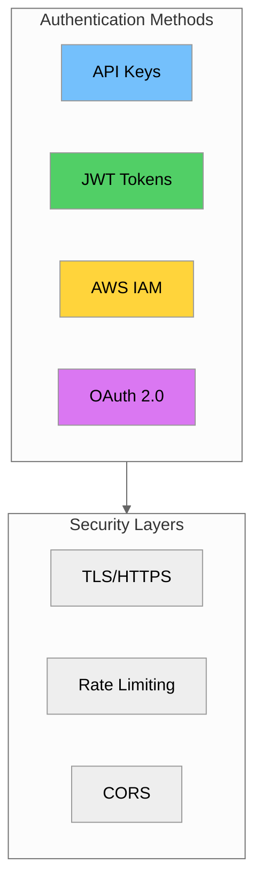

### 7.2 API Key Authentication

```python
import hashlib
import secrets
from functools import wraps

def generate_api_key() -> str:
    """Generate a secure API key."""
    return secrets.token_urlsafe(32)


def hash_api_key(api_key: str) -> str:
    """Hash API key for storage."""
    return hashlib.sha256(api_key.encode()).hexdigest()


# API Key validation decorator
def require_api_key(func):
    """Decorator to require API key authentication."""
    @wraps(func)
    def wrapper(event, context):
        # Get API key from header
        headers = event.get('headers', {})
        api_key = headers.get('X-API-Key') or headers.get('x-api-key')
        
        if not api_key:
            return create_response(401, {
                'error': {
                    'code': 'UNAUTHORIZED',
                    'message': 'API key is required'
                }
            })
        
        # Validate API key (check against stored hashes)
        key_hash = hash_api_key(api_key)
        
        # In production, retrieve from DynamoDB or AWS Secrets Manager
        def get_valid_api_keys():
            """Retrieve valid API key hashes from secure storage."""
            # Placeholder - implement with actual storage
            return set()
        
        valid_keys = get_valid_api_keys()  # Returns set of hashed keys
        
        if key_hash not in valid_keys:
            return create_response(403, {
                'error': {
                    'code': 'FORBIDDEN',
                    'message': 'Invalid API key'
                }
            })
        
        return func(event, context)
    
    return wrapper


# Usage
@require_api_key
def lambda_handler(event, context):
    # Handler code here
    pass
```

### 7.3 JWT Authentication

```python
import jwt
from datetime import datetime, timedelta
from typing import Optional, Dict

# JWT configuration
JWT_SECRET = 'your-secret-key'  # In production, use AWS Secrets Manager
JWT_ALGORITHM = 'HS256'
JWT_EXPIRATION_HOURS = 24


def create_jwt_token(user_id: str, roles: list) -> str:
    """Create a JWT token."""
    payload = {
        'sub': user_id,
        'roles': roles,
        'iat': datetime.utcnow(),
        'exp': datetime.utcnow() + timedelta(hours=JWT_EXPIRATION_HOURS)
    }
    return jwt.encode(payload, JWT_SECRET, algorithm=JWT_ALGORITHM)


def verify_jwt_token(token: str) -> Optional[Dict]:
    """Verify and decode a JWT token."""
    try:
        payload = jwt.decode(token, JWT_SECRET, algorithms=[JWT_ALGORITHM])
        return payload
    except jwt.ExpiredSignatureError:
        return None
    except jwt.InvalidTokenError:
        return None


def require_jwt(roles: list = None):
    """Decorator to require JWT authentication with optional role check."""
    def decorator(func):
        @wraps(func)
        def wrapper(event, context):
            # Get token from Authorization header
            headers = event.get('headers', {})
            auth_header = headers.get('Authorization') or headers.get('authorization')
            
            if not auth_header or not auth_header.startswith('Bearer '):
                return create_response(401, {
                    'error': {
                        'code': 'UNAUTHORIZED',
                        'message': 'Bearer token is required'
                    }
                })
            
            token = auth_header[7:]  # Remove 'Bearer ' prefix
            payload = verify_jwt_token(token)
            
            if not payload:
                return create_response(401, {
                    'error': {
                        'code': 'UNAUTHORIZED',
                        'message': 'Invalid or expired token'
                    }
                })
            
            # Check roles if specified
            if roles:
                user_roles = payload.get('roles', [])
                if not any(role in user_roles for role in roles):
                    return create_response(403, {
                        'error': {
                            'code': 'FORBIDDEN',
                            'message': 'Insufficient permissions'
                        }
                    })
            
            # Add user info to event
            event['user'] = payload
            
            return func(event, context)
        
        return wrapper
    return decorator


# Usage
@require_jwt(roles=['admin', 'editor'])
def update_zone_handler(event, context):
    user = event['user']
    print(f"User {user['sub']} is updating zone")
    # Handler code here
    pass
```

### 7.4 AWS IAM Authentication

```python
# API Gateway with IAM authentication
# serverless.yml or SAM template configuration

"""
# serverless.yml
functions:
  getZones:
    handler: handler.get_zones
    events:
      - http:
          path: /zones
          method: get
          authorizer: aws_iam

  createZone:
    handler: handler.create_zone
    events:
      - http:
          path: /zones
          method: post
          authorizer: aws_iam
"""

# IAM Policy for API access
iam_policy = {
    "Version": "2012-10-17",
    "Statement": [
        {
            "Effect": "Allow",
            "Action": [
                "execute-api:Invoke"
            ],
            "Resource": [
                "arn:aws:execute-api:us-east-1:123456789012:abc123def4/*/GET/zones",
                "arn:aws:execute-api:us-east-1:123456789012:abc123def4/*/GET/zones/*"
            ]
        },
        {
            "Effect": "Allow",
            "Action": [
                "execute-api:Invoke"
            ],
            "Resource": [
                "arn:aws:execute-api:us-east-1:123456789012:abc123def4/*/POST/zones",
                "arn:aws:execute-api:us-east-1:123456789012:abc123def4/*/PUT/zones/*",
                "arn:aws:execute-api:us-east-1:123456789012:abc123def4/*/DELETE/zones/*"
            ],
            "Condition": {
                "StringEquals": {
                    "aws:PrincipalTag/Role": "admin"
                }
            }
        }
    ]
}
```

### 7.5 Rate Limiting

```python
import time
from collections import defaultdict

class RateLimiter:
    """Simple in-memory rate limiter."""
    
    def __init__(self, requests_per_minute: int = 60):
        self.requests_per_minute = requests_per_minute
        self.requests = defaultdict(list)
    
    def is_allowed(self, client_id: str) -> bool:
        """Check if request is allowed."""
        now = time.time()
        minute_ago = now - 60
        
        # Clean old requests
        self.requests[client_id] = [
            t for t in self.requests[client_id] if t > minute_ago
        ]
        
        # Check limit
        if len(self.requests[client_id]) >= self.requests_per_minute:
            return False
        
        # Record request
        self.requests[client_id].append(now)
        return True
    
    # NOTE: This in-memory rate limiter won't work correctly in AWS Lambda
    # because each Lambda invocation may run in a different container.
    # For production, use API Gateway throttling or a distributed cache like ElastiCache Redis.
    
    def get_remaining(self, client_id: str) -> int:
        """Get remaining requests for client."""
        now = time.time()
        minute_ago = now - 60
        
        recent = [t for t in self.requests[client_id] if t > minute_ago]
        return max(0, self.requests_per_minute - len(recent))


# Rate limiting decorator
rate_limiter = RateLimiter(requests_per_minute=100)

def rate_limit(func):
    """Decorator to apply rate limiting."""
    @wraps(func)
    def wrapper(event, context):
        # Get client identifier (API key or IP)
        headers = event.get('headers', {})
        client_id = headers.get('X-API-Key') or event.get('requestContext', {}).get('identity', {}).get('sourceIp', 'unknown')
        
        if not rate_limiter.is_allowed(client_id):
            remaining = rate_limiter.get_remaining(client_id)
            return {
                'statusCode': 429,
                'headers': {
                    'X-RateLimit-Limit': str(rate_limiter.requests_per_minute),
                    'X-RateLimit-Remaining': str(remaining),
                    'Retry-After': '60'
                },
                'body': json.dumps({
                    'error': {
                        'code': 'RATE_LIMIT_EXCEEDED',
                        'message': 'Too many requests. Please try again later.'
                    }
                })
            }
        
        response = func(event, context)
        
        # Add rate limit headers
        remaining = rate_limiter.get_remaining(client_id)
        response['headers'] = response.get('headers', {})
        response['headers']['X-RateLimit-Limit'] = str(rate_limiter.requests_per_minute)
        response['headers']['X-RateLimit-Remaining'] = str(remaining)
        
        return response
    
    return wrapper
```

---

## Part 8: API Documentation with OpenAPI/Swagger

### 8.1 Introduction to OpenAPI

**OpenAPI** (formerly Swagger) is a specification for describing RESTful APIs. It enables automatic documentation generation, client SDK generation, and API testing.

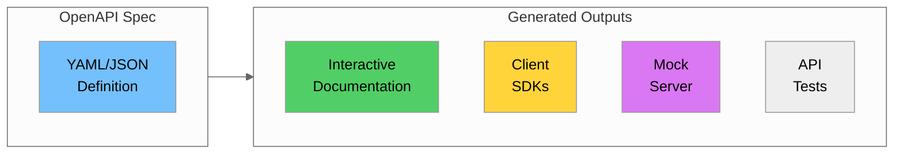

### 8.2 OpenAPI Specification for Zone API

```yaml
# openapi.yaml
openapi: 3.0.3
info:
  title: NYC Taxi Zone Master Data API
  description: |
    RESTful API for managing NYC Taxi Zone master data.
    
    ## Authentication
    This API supports two authentication methods:
    - **API Key**: Pass your API key in the `X-API-Key` header
    - **JWT**: Pass a Bearer token in the `Authorization` header
    
    ## Rate Limiting
    - 100 requests per minute per API key
    - Rate limit headers are included in all responses
  version: 1.0.0
  contact:
    name: Data Engineering Team
    email: data-engineering@example.com
  license:
    name: MIT
    url: https://opensource.org/licenses/MIT

servers:
  - url: https://api.example.com/v1
    description: Production server
  - url: https://api-staging.example.com/v1
    description: Staging server
  - url: http://localhost:3000/v1
    description: Local development

tags:
  - name: Zones
    description: Taxi zone management operations
  - name: Bulk Operations
    description: Bulk create, update, and delete operations
  - name: Search
    description: Search and filter operations

paths:
  /zones:
    get:
      tags:
        - Zones
      summary: List all zones
      description: Retrieve a paginated list of taxi zones with optional filtering
      operationId: listZones
      parameters:
        - name: borough
          in: query
          description: Filter by borough name
          schema:
            type: string
            enum: [Manhattan, Brooklyn, Queens, Bronx, Staten Island, EWR]
        - name: service_zone
          in: query
          description: Filter by service zone
          schema:
            type: string
            enum: [Yellow Zone, Boro Zone, Airports, EWR, N/A]
        - name: page
          in: query
          description: Page number (1-indexed)
          schema:
            type: integer
            minimum: 1
            default: 1
        - name: limit
          in: query
          description: Number of items per page
          schema:
            type: integer
            minimum: 1
            maximum: 100
            default: 50
        - name: sort
          in: query
          description: Field to sort by
          schema:
            type: string
            enum: [LocationID, Zone, Borough]
            default: LocationID
        - name: order
          in: query
          description: Sort order
          schema:
            type: string
            enum: [asc, desc]
            default: asc
      responses:
        '200':
          description: Successful response
          content:
            application/json:
              schema:
                $ref: '#/components/schemas/ZoneListResponse'
        '400':
          $ref: '#/components/responses/BadRequest'
        '401':
          $ref: '#/components/responses/Unauthorized'
        '429':
          $ref: '#/components/responses/RateLimitExceeded'
      security:
        - ApiKeyAuth: []
        - BearerAuth: []
    
    post:
      tags:
        - Zones
      summary: Create a new zone
      description: Create a new taxi zone record
      operationId: createZone
      requestBody:
        required: true
        content:
          application/json:
            schema:
              $ref: '#/components/schemas/ZoneCreate'
      responses:
        '201':
          description: Zone created successfully
          content:
            application/json:
              schema:
                $ref: '#/components/schemas/Zone'
        '400':
          $ref: '#/components/responses/BadRequest'
        '401':
          $ref: '#/components/responses/Unauthorized'
        '409':
          description: Zone already exists
          content:
            application/json:
              schema:
                $ref: '#/components/schemas/Error'
      security:
        - ApiKeyAuth: []
        - BearerAuth: []

  /zones/{id}:
    get:
      tags:
        - Zones
      summary: Get zone by ID
      description: Retrieve a single taxi zone by its LocationID
      operationId: getZone
      parameters:
        - $ref: '#/components/parameters/ZoneId'
      responses:
        '200':
          description: Successful response
          content:
            application/json:
              schema:
                $ref: '#/components/schemas/Zone'
        '404':
          $ref: '#/components/responses/NotFound'
      security:
        - ApiKeyAuth: []
        - BearerAuth: []
    
    put:
      tags:
        - Zones
      summary: Update zone (full)
      description: Replace all fields of a taxi zone
      operationId: updateZone
      parameters:
        - $ref: '#/components/parameters/ZoneId'
      requestBody:
        required: true
        content:
          application/json:
            schema:
              $ref: '#/components/schemas/ZoneUpdate'
      responses:
        '200':
          description: Zone updated successfully
          content:
            application/json:
              schema:
                $ref: '#/components/schemas/Zone'
        '400':
          $ref: '#/components/responses/BadRequest'
        '404':
          $ref: '#/components/responses/NotFound'
      security:
        - BearerAuth: []
    
    patch:
      tags:
        - Zones
      summary: Update zone (partial)
      description: Update specific fields of a taxi zone
      operationId: patchZone
      parameters:
        - $ref: '#/components/parameters/ZoneId'
      requestBody:
        required: true
        content:
          application/json:
            schema:
              $ref: '#/components/schemas/ZonePatch'
      responses:
        '200':
          description: Zone updated successfully
          content:
            application/json:
              schema:
                $ref: '#/components/schemas/Zone'
        '400':
          $ref: '#/components/responses/BadRequest'
        '404':
          $ref: '#/components/responses/NotFound'
      security:
        - BearerAuth: []
    
    delete:
      tags:
        - Zones
      summary: Delete zone
      description: Delete a taxi zone by ID
      operationId: deleteZone
      parameters:
        - $ref: '#/components/parameters/ZoneId'
      responses:
        '204':
          description: Zone deleted successfully
        '404':
          $ref: '#/components/responses/NotFound'
      security:
        - BearerAuth: []

  /zones/search:
    get:
      tags:
        - Search
      summary: Search zones
      description: Search zones by name or other criteria
      operationId: searchZones
      parameters:
        - name: q
          in: query
          required: true
          description: Search query
          schema:
            type: string
            minLength: 2
        - name: limit
          in: query
          schema:
            type: integer
            default: 10
            maximum: 50
      responses:
        '200':
          description: Search results
          content:
            application/json:
              schema:
                $ref: '#/components/schemas/ZoneSearchResponse'
      security:
        - ApiKeyAuth: []

  /zones/bulk:
    post:
      tags:
        - Bulk Operations
      summary: Bulk create zones
      description: Create multiple zones in a single request
      operationId: bulkCreateZones
      requestBody:
        required: true
        content:
          application/json:
            schema:
              $ref: '#/components/schemas/BulkCreateRequest'
      responses:
        '201':
          description: All zones created successfully
          content:
            application/json:
              schema:
                $ref: '#/components/schemas/BulkResponse'
        '207':
          description: Partial success
          content:
            application/json:
              schema:
                $ref: '#/components/schemas/BulkResponse'
      security:
        - BearerAuth: []

components:
  schemas:
    Zone:
      type: object
      properties:
        id:
          type: integer
          description: Unique location identifier
          example: 230
        zone:
          type: string
          description: Zone name
          example: "Times Square/Theatre District"
        borough:
          type: string
          description: NYC borough
          example: "Manhattan"
        service_zone:
          type: string
          description: Service zone classification
          example: "Yellow Zone"
        created_at:
          type: string
          format: date-time
          description: Record creation timestamp
        updated_at:
          type: string
          format: date-time
          description: Last update timestamp
        _links:
          type: object
          properties:
            self:
              type: string
              example: "/v1/zones/230"
            trips:
              type: string
              example: "/v1/zones/230/trips"
    
    ZoneCreate:
      type: object
      required:
        - zone
        - borough
        - service_zone
      properties:
        zone:
          type: string
          minLength: 1
          maxLength: 100
        borough:
          type: string
          enum: [Manhattan, Brooklyn, Queens, Bronx, Staten Island, EWR, Unknown, N/A]
        service_zone:
          type: string
          enum: [Yellow Zone, Boro Zone, Airports, EWR, N/A]
    
    ZoneUpdate:
      type: object
      required:
        - zone
        - borough
        - service_zone
      properties:
        zone:
          type: string
        borough:
          type: string
        service_zone:
          type: string
    
    ZonePatch:
      type: object
      properties:
        zone:
          type: string
        borough:
          type: string
        service_zone:
          type: string
    
    ZoneListResponse:
      type: object
      properties:
        data:
          type: array
          items:
            $ref: '#/components/schemas/Zone'
        pagination:
          $ref: '#/components/schemas/Pagination'
        _links:
          $ref: '#/components/schemas/PaginationLinks'
    
    ZoneSearchResponse:
      type: object
      properties:
        results:
          type: array
          items:
            allOf:
              - $ref: '#/components/schemas/Zone'
              - type: object
                properties:
                  score:
                    type: number
                    description: Search relevance score
        total:
          type: integer
    
    Pagination:
      type: object
      properties:
        page:
          type: integer
        limit:
          type: integer
        total:
          type: integer
        total_pages:
          type: integer
    
    PaginationLinks:
      type: object
      properties:
        self:
          type: string
        first:
          type: string
        prev:
          type: string
        next:
          type: string
        last:
          type: string
    
    BulkCreateRequest:
      type: object
      required:
        - zones
      properties:
        zones:
          type: array
          items:
            $ref: '#/components/schemas/ZoneCreate'
          maxItems: 100
    
    BulkResponse:
      type: object
      properties:
        created:
          type: array
          items:
            $ref: '#/components/schemas/Zone'
        errors:
          type: array
          items:
            type: object
            properties:
              index:
                type: integer
              error:
                type: string
        summary:
          type: object
          properties:
            total:
              type: integer
            created:
              type: integer
            failed:
              type: integer
    
    Error:
      type: object
      properties:
        error:
          type: object
          properties:
            code:
              type: string
            message:
              type: string
            details:
              type: array
              items:
                type: object
                properties:
                  field:
                    type: string
                  message:
                    type: string

  parameters:
    ZoneId:
      name: id
      in: path
      required: true
      description: Zone LocationID
      schema:
        type: integer

  responses:
    BadRequest:
      description: Bad request
      content:
        application/json:
          schema:
            $ref: '#/components/schemas/Error'
    
    Unauthorized:
      description: Authentication required
      content:
        application/json:
          schema:
            $ref: '#/components/schemas/Error'
    
    NotFound:
      description: Resource not found
      content:
        application/json:
          schema:
            $ref: '#/components/schemas/Error'
    
    RateLimitExceeded:
      description: Rate limit exceeded
      headers:
        X-RateLimit-Limit:
          schema:
            type: integer
        X-RateLimit-Remaining:
          schema:
            type: integer
        Retry-After:
          schema:
            type: integer
      content:
        application/json:
          schema:
            $ref: '#/components/schemas/Error'

  securitySchemes:
    ApiKeyAuth:
      type: apiKey
      in: header
      name: X-API-Key
    
    BearerAuth:
      type: http
      scheme: bearer
      bearerFormat: JWT
```

### 8.3 Generating Documentation

```python
# Using Flask with Swagger UI
from flask import Flask, jsonify
from flask_swagger_ui import get_swaggerui_blueprint

app = Flask(__name__)

# Swagger UI configuration
SWAGGER_URL = '/api/docs'
API_URL = '/static/openapi.yaml'

swaggerui_blueprint = get_swaggerui_blueprint(
    SWAGGER_URL,
    API_URL,
    config={
        'app_name': "NYC Taxi Zone API"
    }
)

app.register_blueprint(swaggerui_blueprint, url_prefix=SWAGGER_URL)

# Serve OpenAPI spec
@app.route('/static/openapi.yaml')
def serve_openapi():
    with open('openapi.yaml', 'r') as f:
        return f.read(), 200, {'Content-Type': 'text/yaml'}

if __name__ == '__main__':
    app.run(debug=True)
```

---

## Part 9: Change Data Capture (CDC)

### 9.1 What is CDC?

**Change Data Capture (CDC)** is a pattern for tracking and capturing changes to data, enabling real-time synchronization between systems.

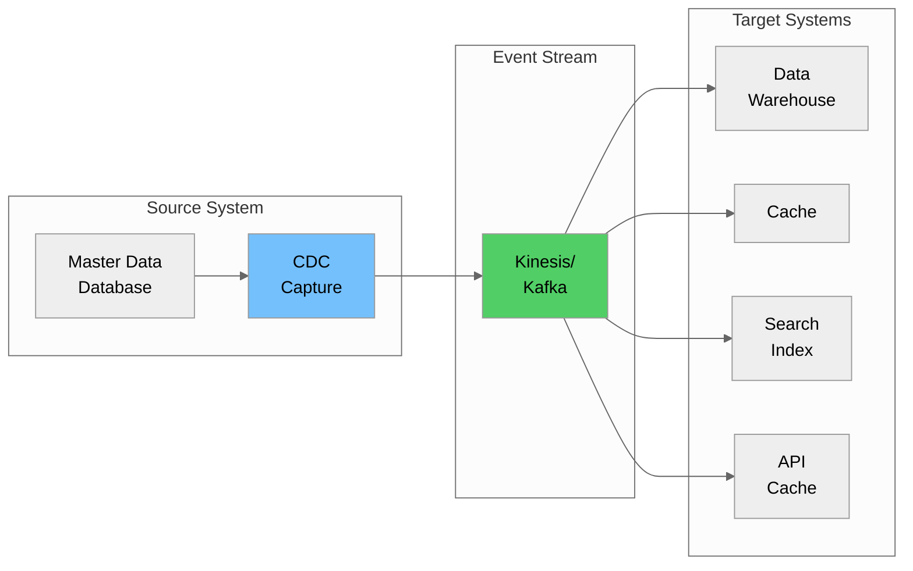

### 9.2 CDC Event Structure

```python
# CDC Event Schema
cdc_event_schema = {
    "event_id": "uuid",
    "event_type": "INSERT | UPDATE | DELETE",
    "table_name": "string",
    "timestamp": "ISO 8601 datetime",
    "before": {
        # Previous state (for UPDATE/DELETE)
    },
    "after": {
        # New state (for INSERT/UPDATE)
    },
    "metadata": {
        "source": "string",
        "transaction_id": "string",
        "user": "string"
    }
}

# Example CDC events
insert_event = {
    "event_id": "550e8400-e29b-41d4-a716-446655440000",
    "event_type": "INSERT",
    "table_name": "taxi_zones",
    "timestamp": "2024-06-20T14:30:00Z",
    "before": None,
    "after": {
        "LocationID": 266,
        "Zone": "New Zone",
        "Borough": "Manhattan",
        "service_zone": "Yellow Zone"
    },
    "metadata": {
        "source": "master_data_api",
        "transaction_id": "txn-12345",
        "user": "admin@example.com"
    }
}

update_event = {
    "event_id": "550e8400-e29b-41d4-a716-446655440001",
    "event_type": "UPDATE",
    "table_name": "taxi_zones",
    "timestamp": "2024-06-20T15:00:00Z",
    "before": {
        "LocationID": 230,
        "Zone": "Times Square",
        "Borough": "Manhattan",
        "service_zone": "Yellow Zone"
    },
    "after": {
        "LocationID": 230,
        "Zone": "Times Square/Theatre District",
        "Borough": "Manhattan",
        "service_zone": "Yellow Zone"
    },
    "metadata": {
        "source": "master_data_api",
        "transaction_id": "txn-12346",
        "user": "editor@example.com"
    }
}

delete_event = {
    "event_id": "550e8400-e29b-41d4-a716-446655440002",
    "event_type": "DELETE",
    "table_name": "taxi_zones",
    "timestamp": "2024-06-20T16:00:00Z",
    "before": {
        "LocationID": 266,
        "Zone": "New Zone",
        "Borough": "Manhattan",
        "service_zone": "Yellow Zone"
    },
    "after": None,
    "metadata": {
        "source": "master_data_api",
        "transaction_id": "txn-12347",
        "user": "admin@example.com"
    }
}
```

### 9.3 Implementing CDC with DynamoDB Streams

```python
import boto3
import json
from datetime import datetime

# Enable DynamoDB Streams on table
dynamodb = boto3.client('dynamodb')

# Create table with streams enabled
def create_table_with_streams():
    response = dynamodb.create_table(
        TableName='TaxiZones',
        KeySchema=[
            {'AttributeName': 'LocationID', 'KeyType': 'HASH'}
        ],
        AttributeDefinitions=[
            {'AttributeName': 'LocationID', 'AttributeType': 'N'}
        ],
        BillingMode='PAY_PER_REQUEST',
        StreamSpecification={
            'StreamEnabled': True,
            'StreamViewType': 'NEW_AND_OLD_IMAGES'  # Capture before and after
        }
    )
    return response


# Lambda function to process DynamoDB Stream events
def process_stream_event(event, context):
    """Process DynamoDB Stream events and publish to Kinesis."""
    
    kinesis = boto3.client('kinesis')
    
    for record in event['Records']:
        # Parse DynamoDB Stream record
        event_name = record['eventName']  # INSERT, MODIFY, REMOVE
        
        # Convert to CDC event format
        cdc_event = {
            'event_id': record['eventID'],
            'event_type': {
                'INSERT': 'INSERT',
                'MODIFY': 'UPDATE',
                'REMOVE': 'DELETE'
            }.get(event_name),
            'table_name': 'taxi_zones',
            'timestamp': datetime.utcnow().isoformat() + 'Z',
            'before': None,
            'after': None,
            'metadata': {
                'source': 'dynamodb_streams',
                'aws_region': record['awsRegion'],
                'event_source': record['eventSource']
            }
        }
        
        # Extract old and new images
        if 'OldImage' in record['dynamodb']:
            cdc_event['before'] = deserialize_dynamodb_item(
                record['dynamodb']['OldImage']
            )
        
        if 'NewImage' in record['dynamodb']:
            cdc_event['after'] = deserialize_dynamodb_item(
                record['dynamodb']['NewImage']
            )
        
        # Publish to Kinesis
        kinesis.put_record(
            StreamName='master-data-changes',
            Data=json.dumps(cdc_event),
            PartitionKey=str(cdc_event['after'].get('LocationID') or 
                           cdc_event['before'].get('LocationID'))
        )
        
        print(f"Published CDC event: {cdc_event['event_type']} for zone")
    
    return {'statusCode': 200, 'body': 'Processed successfully'}


def deserialize_dynamodb_item(item):
    """Convert DynamoDB item to regular Python dict."""
    deserializer = boto3.dynamodb.types.TypeDeserializer()
    return {k: deserializer.deserialize(v) for k, v in item.items()}
```

### 9.4 CDC Consumer for Data Warehouse

```python
import boto3
import json
from datetime import datetime

def process_cdc_for_warehouse(event, context):
    """
    Consume CDC events and apply to data warehouse.
    This Lambda is triggered by Kinesis.
    """
    import base64
    
    redshift = boto3.client('redshift-data')
    
    for record in event['Records']:
        # Decode Kinesis record
        payload = json.loads(
            base64.b64decode(record['kinesis']['data']).decode('utf-8')
        )
        
        event_type = payload['event_type']
        table_name = payload['table_name']
        
        # WARNING: In production, use parameterized queries to prevent SQL injection
        # This example uses string formatting for clarity only
        
        if event_type == 'INSERT':
            # Insert new record
            data = payload['after']
            sql = f"""
                INSERT INTO {table_name} (location_id, zone, borough, service_zone, created_at, updated_at)
                VALUES ({data['LocationID']}, '{data['Zone']}', '{data['Borough']}', 
                        '{data['service_zone']}', '{payload['timestamp']}', '{payload['timestamp']}')
            """
        
        elif event_type == 'UPDATE':
            # Update existing record
            data = payload['after']
            sql = f"""
                UPDATE {table_name}
                SET zone = '{data['Zone']}',
                    borough = '{data['Borough']}',
                    service_zone = '{data['service_zone']}',
                    updated_at = '{payload['timestamp']}'
                WHERE location_id = {data['LocationID']}
            """
        
        elif event_type == 'DELETE':
            # Soft delete (or hard delete based on requirements)
            data = payload['before']
            sql = f"""
                UPDATE {table_name}
                SET is_deleted = true,
                    deleted_at = '{payload['timestamp']}'
                WHERE location_id = {data['LocationID']}
            """
        
        # Execute SQL
        redshift.execute_statement(
            ClusterIdentifier='my-cluster',
            Database='master_data',
            Sql=sql
        )
        
        print(f"Applied {event_type} to warehouse for zone {data.get('LocationID')}")
    
    return {'statusCode': 200}
```

### 9.5 CDC for Cache Invalidation

```python
import boto3
import json
import redis

def invalidate_cache_on_change(event, context):
    """
    Invalidate cache entries when master data changes.
    """
    import base64
    
    # Connect to ElastiCache Redis
    cache = redis.Redis(
        host='master-data-cache.xxxxx.cache.amazonaws.com',
        port=6379,
        decode_responses=True
    )
    
    for record in event['Records']:
        payload = json.loads(
            base64.b64decode(record['kinesis']['data']).decode('utf-8')
        )
        
        event_type = payload['event_type']
        
        # Get zone ID
        zone_id = (payload.get('after') or payload.get('before')).get('LocationID')
        
        # Invalidate specific zone cache
        cache_key = f"zone:{zone_id}"
        cache.delete(cache_key)
        
        # Invalidate list caches that might contain this zone
        borough = (payload.get('after') or payload.get('before')).get('Borough')
        cache.delete(f"zones:borough:{borough}")
        cache.delete("zones:all")
        
        # For updates, optionally pre-populate cache with new data
        if event_type in ['INSERT', 'UPDATE']:
            new_data = payload['after']
            cache.setex(
                cache_key,
                3600,  # 1 hour TTL
                json.dumps(new_data)
            )
        
        print(f"Cache invalidated for zone {zone_id}")
    
    return {'statusCode': 200}
```

### 9.6 CDC Architecture Patterns

| Pattern | Description | Use Case |
|---------|-------------|----------|
| **Log-based CDC** | Read database transaction logs | Minimal impact on source |
| **Trigger-based CDC** | Database triggers capture changes | Simple implementation |
| **Query-based CDC** | Poll for changes using timestamps | Legacy systems |
| **Dual-write** | Write to both source and stream | Application-level control |

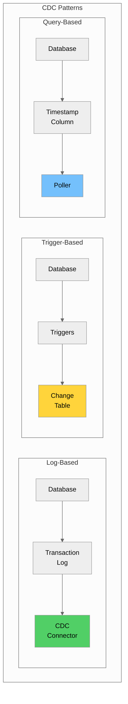

### Lab Prerequisites

Before starting the hands-on labs, ensure you have the following set up:

#### Required Python Packages
```bash
pip install pandas fuzzywuzzy python-Levenshtein recordlinkage boto3 flask flask-swagger-ui PyJWT
```

#### Required Data Files
Ensure these files exist in your `data/` directory:
- `taxi_zone_lookup.csv` - NYC taxi zone reference data

#### AWS Resources (for Lab 4)
- AWS account with appropriate permissions
- AWS CLI configured with credentials
- IAM role with Lambda and DynamoDB access

#### Verify Your Setup
```python
# Run this to verify all packages are installed
import pandas as pd
from fuzzywuzzy import fuzz
import recordlinkage
print("All required packages installed successfully!")
```

## Part 10: Hands-on Labs

### Lab 1: Fuzzy Matching with Python

**Objective**: Use fuzzywuzzy and recordlinkage libraries to match and deduplicate taxi zone data.

```python
# lab1_fuzzy_matching.py
"""
Lab 1: Fuzzy Matching with NYC Taxi Zone Data

This lab demonstrates various fuzzy matching techniques using
the taxi zone lookup data.
"""

import pandas as pd
from fuzzywuzzy import fuzz, process
import recordlinkage

# Load taxi zone data
print("=== Lab 1: Fuzzy Matching with NYC Taxi Zone Data ===\n")

zones_df = pd.read_csv('data/taxi_zone_lookup.csv')
print(f"Loaded {len(zones_df)} zones\n")

# Part 1: Basic Fuzzy Matching
print("--- Part 1: Basic Fuzzy Matching ---\n")

# Create some "dirty" zone names to match
dirty_names = [
    "Times Sq",
    "JFK Airprt",
    "Central Pk",
    "Penn Statn",
    "Brooklin Heights",
    "Manhatan Beach"
]

print("Finding best matches for dirty zone names:\n")
for dirty_name in dirty_names:
    # Find best match
    matches = process.extractBests(
        dirty_name, 
        zones_df['Zone'].tolist(), 
        scorer=fuzz.token_set_ratio,
        limit=3
    )
    
    print(f"'{dirty_name}':")
    for match, score in matches:
        print(f"  → {match} (score: {score})")
    print()


# Part 2: Comparing Different Matching Methods
print("\n--- Part 2: Comparing Matching Methods ---\n")

test_pairs = [
    ("Times Square/Theatre District", "Times Sq Theatre District"),
    ("JFK Airport", "John F Kennedy Airport"),
    ("Upper East Side North", "Upper East Side South"),
    ("Brooklyn Heights", "Brooklin Heights"),
]

print(f"{'Pair':<60} {'Ratio':>6} {'Partial':>8} {'Token Sort':>11} {'Token Set':>10}")
print("-" * 100)

for s1, s2 in test_pairs:
    pair_str = f"'{s1}' vs '{s2}'"[:58]
    ratio = fuzz.ratio(s1, s2)
    partial = fuzz.partial_ratio(s1, s2)
    token_sort = fuzz.token_sort_ratio(s1, s2)
    token_set = fuzz.token_set_ratio(s1, s2)
    
    print(f"{pair_str:<60} {ratio:>6} {partial:>8} {token_sort:>11} {token_set:>10}")


# Part 3: Finding Potential Duplicates in Zone Data
print("\n\n--- Part 3: Finding Potential Duplicates ---\n")

# Create indexer for blocking
indexer = recordlinkage.Index()
indexer.sortedneighbourhood('Zone', window=5)

# Generate candidate pairs
candidate_pairs = indexer.index(zones_df)
print(f"Generated {len(candidate_pairs)} candidate pairs to compare\n")

# Create comparison object
compare = recordlinkage.Compare()
compare.string('Zone', 'Zone', method='jarowinkler', threshold=0.85, label='zone_similarity')
compare.exact('Borough', 'Borough', label='same_borough')

# Compute comparison
features = compare.compute(candidate_pairs, zones_df)

# Find high-similarity pairs
high_similarity = features[features['zone_similarity'] >= 0.8]
print(f"Found {len(high_similarity)} pairs with zone similarity >= 0.8:\n")

for idx in high_similarity.index[:10]:  # Show first 10
    zone1 = zones_df.loc[idx[0], 'Zone']
    zone2 = zones_df.loc[idx[1], 'Zone']
    borough1 = zones_df.loc[idx[0], 'Borough']
    borough2 = zones_df.loc[idx[1], 'Borough']
    sim = high_similarity.loc[idx, 'zone_similarity']
    
    print(f"  {zone1} ({borough1})")
    print(f"  {zone2} ({borough2})")
    print(f"  Similarity: {sim:.2f}")
    print()


# Part 4: Threshold Analysis
print("\n--- Part 4: Threshold Analysis ---\n")

thresholds = [0.7, 0.75, 0.8, 0.85, 0.9, 0.95]
print("Matches at different thresholds:")
print(f"{'Threshold':>10} {'Matches':>10}")
print("-" * 22)

for threshold in thresholds:
    matches = features[features['zone_similarity'] >= threshold]
    print(f"{threshold:>10.2f} {len(matches):>10}")


print("\n=== Lab 1 Complete ===")
```

### Lab 2: Build Deduplication Pipeline for Vendors

**Objective**: Create a complete deduplication pipeline with matching and survivorship rules.

```python
# lab2_vendor_deduplication.py
"""
Lab 2: Vendor Deduplication Pipeline

This lab builds a complete pipeline to identify and merge
duplicate vendor records.
"""

import pandas as pd
from fuzzywuzzy import fuzz
from typing import List, Dict, Tuple
from collections import defaultdict
import uuid

print("=== Lab 2: Vendor Deduplication Pipeline ===\n")

# Sample vendor data with duplicates
vendors_data = [
    {'id': 1, 'name': 'Creative Mobile Technologies LLC', 'code': 'CMT', 
     'city': 'New York', 'state': 'NY', 'phone': '212-555-0100', 
     'email': 'info@cmt.com', 'source': 'CRM', 'updated': '2024-01-15'},
    {'id': 2, 'name': 'Creative Mobile Tech', 'code': 'CMT', 
     'city': 'New York', 'state': 'NY', 'phone': None, 
     'email': 'contact@creativemobile.com', 'source': 'ERP', 'updated': '2024-06-20'},
    {'id': 3, 'name': 'Curb Mobility Inc', 'code': 'CURB', 
     'city': 'New York', 'state': 'NY', 'phone': '212-555-0200', 
     'email': 'info@curb.com', 'source': 'CRM', 'updated': '2024-02-10'},
    {'id': 4, 'name': 'Curb Mobility', 'code': 'CURB-001', 
     'city': 'NYC', 'state': 'NY', 'phone': '212-555-0200', 
     'email': None, 'source': 'Web', 'updated': '2024-05-15'},
    {'id': 5, 'name': 'Myle Technologies Corp', 'code': 'MYLE', 
     'city': 'New York', 'state': 'NY', 'phone': '212-555-0300', 
     'email': 'hello@myle.com', 'source': 'CRM', 'updated': '2024-03-01'},
    {'id': 6, 'name': 'Helix Transportation', 'code': 'HELIX', 
     'city': 'New York', 'state': 'NY', 'phone': '212-555-0400', 
     'email': 'info@helix.com', 'source': 'CRM', 'updated': '2024-04-01'},
    {'id': 7, 'name': 'Helix Transport LLC', 'code': 'HLX', 
     'city': 'New York', 'state': 'NY', 'phone': '212-555-0401', 
     'email': 'contact@helixtransport.com', 'source': 'ERP', 'updated': '2024-06-01'},
]

vendors_df = pd.DataFrame(vendors_data)
print(f"Input: {len(vendors_df)} vendor records\n")
print(vendors_df[['id', 'name', 'code', 'source']].to_string())


# Step 1: Blocking
print("\n\n--- Step 1: Blocking by State ---\n")

def create_blocks(df: pd.DataFrame, block_field: str) -> Dict[str, List[int]]:
    """Group records by blocking field."""
    blocks = defaultdict(list)
    for idx, row in df.iterrows():
        block_key = str(row[block_field]).upper()
        blocks[block_key].append(idx)
    return dict(blocks)

blocks = create_blocks(vendors_df, 'state')
print(f"Created {len(blocks)} blocks:")
for block_key, indices in blocks.items():
    print(f"  {block_key}: {len(indices)} records")


# Step 2: Pairwise Comparison
print("\n--- Step 2: Pairwise Comparison ---\n")

def compare_vendors(v1: Dict, v2: Dict) -> Tuple[float, Dict]:
    """Compare two vendor records and return similarity score."""
    scores = {}
    
    # Name similarity (weighted heavily)
    name_sim = fuzz.token_set_ratio(
        str(v1.get('name', '')), 
        str(v2.get('name', ''))
    ) / 100
    scores['name'] = name_sim
    
    # Code similarity
    code1 = str(v1.get('code', '')).upper()
    code2 = str(v2.get('code', '')).upper()
    if code1 and code2:
        # Check if one code is prefix of another
        if code1.startswith(code2) or code2.startswith(code1):
            scores['code'] = 0.9
        elif code1 == code2:
            scores['code'] = 1.0
        else:
            scores['code'] = fuzz.ratio(code1, code2) / 100
    else:
        scores['code'] = 0.5  # Neutral if missing
    
    # Phone similarity
    phone1 = str(v1.get('phone', '')).replace('-', '').replace(' ', '')
    phone2 = str(v2.get('phone', '')).replace('-', '').replace(' ', '')
    if phone1 and phone2:
        scores['phone'] = 1.0 if phone1 == phone2 else 0.0
    else:
        scores['phone'] = 0.5  # Neutral if missing
    
    # City similarity
    city_sim = fuzz.ratio(
        str(v1.get('city', '')).upper(), 
        str(v2.get('city', '')).upper()
    ) / 100
    scores['city'] = city_sim
    
    # Calculate weighted total
    weights = {'name': 0.5, 'code': 0.2, 'phone': 0.2, 'city': 0.1}
    total = sum(scores[k] * weights[k] for k in weights)
    
    return total, scores


# Compare all pairs within blocks
candidate_matches = []
for block_key, indices in blocks.items():
    for i, idx1 in enumerate(indices):
        for idx2 in indices[i+1:]:
            v1 = vendors_df.loc[idx1].to_dict()
            v2 = vendors_df.loc[idx2].to_dict()
            
            score, details = compare_vendors(v1, v2)
            
            if score >= 0.7:  # Threshold
                candidate_matches.append({
                    'idx1': idx1,
                    'idx2': idx2,
                    'id1': v1['id'],
                    'id2': v2['id'],
                    'name1': v1['name'],
                    'name2': v2['name'],
                    'score': score,
                    'details': details
                })

print(f"Found {len(candidate_matches)} candidate matches:\n")
for match in candidate_matches:
    print(f"  {match['name1']}")
    print(f"  {match['name2']}")
    print(f"  Score: {match['score']:.2f} | Details: {match['details']}")
    print()


# Step 3: Clustering
print("\n--- Step 3: Clustering Matches ---\n")

def cluster_matches(matches: List[Dict], threshold: float = 0.8) -> List[set]:
    """Cluster matching records using Union-Find."""
    parent = {}
    
    def find(x):
        if x not in parent:
            parent[x] = x
        if parent[x] != x:
            parent[x] = find(parent[x])
        return parent[x]
    
    def union(x, y):
        px, py = find(x), find(y)
        if px != py:
            parent[px] = py
    
    # Union matching pairs
    for match in matches:
        if match['score'] >= threshold:
            union(match['idx1'], match['idx2'])
    
    # Group by cluster
    clusters = defaultdict(set)
    for idx in parent:
        clusters[find(idx)].add(idx)
    
    return [cluster for cluster in clusters.values() if len(cluster) > 1]

clusters = cluster_matches(candidate_matches, threshold=0.8)
print(f"Identified {len(clusters)} duplicate clusters:\n")

for i, cluster in enumerate(clusters, 1):
    print(f"Cluster {i}:")
    for idx in cluster:
        vendor = vendors_df.loc[idx]
        print(f"  ID {vendor['id']}: {vendor['name']} ({vendor['source']})")
    print()


# Step 4: Apply Survivorship Rules
print("\n--- Step 4: Apply Survivorship Rules ---\n")

def apply_survivorship(records: List[Dict]) -> Dict:
    """Apply survivorship rules to create golden record."""
    golden = {
        'golden_id': str(uuid.uuid4())[:8],
        'source_ids': [r['id'] for r in records]
    }
    
    # Name: Most complete (longest)
    names = [r['name'] for r in records if r.get('name')]
    golden['name'] = max(names, key=len) if names else None
    
    # Code: Most trusted source (CRM > ERP > Web)
    source_priority = {'CRM': 1, 'ERP': 2, 'Web': 3}
    sorted_by_source = sorted(records, key=lambda x: source_priority.get(x.get('source'), 99))
    golden['code'] = sorted_by_source[0].get('code')
    
    # Phone: First non-null
    phones = [r['phone'] for r in records if r.get('phone')]
    golden['phone'] = phones[0] if phones else None
    
    # Email: Most recent
    sorted_by_date = sorted(records, key=lambda x: x.get('updated', ''), reverse=True)
    emails = [r['email'] for r in sorted_by_date if r.get('email')]
    golden['email'] = emails[0] if emails else None
    
    # City: Most frequent
    cities = [r['city'] for r in records if r.get('city')]
    if cities:
        from collections import Counter
        golden['city'] = Counter(cities).most_common(1)[0][0]
    else:
        golden['city'] = None
    
    golden['state'] = records[0].get('state')
    
    return golden


# Create golden records
golden_records = []
processed_indices = set()

for cluster in clusters:
    cluster_records = [vendors_df.loc[idx].to_dict() for idx in cluster]
    golden = apply_survivorship(cluster_records)
    golden_records.append(golden)
    processed_indices.update(cluster)

# Add non-duplicate records
for idx, row in vendors_df.iterrows():
    if idx not in processed_indices:
        golden_records.append({
            'golden_id': str(uuid.uuid4())[:8],
            'source_ids': [row['id']],
            'name': row['name'],
            'code': row['code'],
            'phone': row['phone'],
            'email': row['email'],
            'city': row['city'],
            'state': row['state']
        })

print(f"Created {len(golden_records)} golden records:\n")
for gr in golden_records:
    print(f"Golden ID: {gr['golden_id']}")
    print(f"  Source IDs: {gr['source_ids']}")
    print(f"  Name: {gr['name']}")
    print(f"  Code: {gr['code']}")
    print(f"  Phone: {gr['phone']}")
    print(f"  Email: {gr['email']}")
    print()


print("\n=== Lab 2 Complete ===")
print(f"\nSummary:")
print(f"  Input records: {len(vendors_df)}")
print(f"  Duplicate clusters: {len(clusters)}")
print(f"  Golden records: {len(golden_records)}")
print(f"  Deduplication rate: {(1 - len(golden_records)/len(vendors_df))*100:.1f}%")
```

### Lab 3: Create Data Quality Scorecard

**Objective**: Build a scorecard that measures data quality dimensions.

```python
# lab3_quality_scorecard.py
"""
Lab 3: Data Quality Scorecard

This lab creates a comprehensive data quality scorecard
for the NYC taxi zone data.
"""

import pandas as pd
import numpy as np
from datetime import datetime
from typing import Dict, List, Any

print("=== Lab 3: Data Quality Scorecard ===\n")

# Load data
zones_df = pd.read_csv('data/taxi_zone_lookup.csv')
print(f"Analyzing {len(zones_df)} zone records\n")


class DataQualityScorecard:
    """Generate data quality scorecard for a DataFrame."""
    
    def __init__(self, df: pd.DataFrame, name: str = "Dataset"):
        self.df = df
        self.name = name
        self.scores = {}
        self.details = {}
    
    def check_completeness(self) -> float:
        """Calculate completeness score (% of non-null values)."""
        total_cells = self.df.size
        non_null_cells = self.df.count().sum()
        score = (non_null_cells / total_cells) * 100
        
        # Per-column details
        column_completeness = {}
        for col in self.df.columns:
            col_complete = (self.df[col].count() / len(self.df)) * 100
            column_completeness[col] = round(col_complete, 2)
        
        self.scores['completeness'] = round(score, 2)
        self.details['completeness'] = column_completeness
        return score
    
    def check_uniqueness(self, key_columns: List[str]) -> float:
        """Calculate uniqueness score for key columns."""
        if not key_columns:
            return 100.0
        
        total_rows = len(self.df)
        unique_rows = len(self.df.drop_duplicates(subset=key_columns))
        score = (unique_rows / total_rows) * 100
        
        # Find duplicates
        duplicates = self.df[self.df.duplicated(subset=key_columns, keep=False)]
        
        self.scores['uniqueness'] = round(score, 2)
        self.details['uniqueness'] = {
            'key_columns': key_columns,
            'total_rows': total_rows,
            'unique_rows': unique_rows,
            'duplicate_count': len(duplicates)
        }
        return score
    
    def check_validity(self, rules: Dict[str, callable]) -> float:
        """Check validity based on custom rules."""
        results = {}
        total_valid = 0
        total_checks = 0
        
        for column, rule in rules.items():
            if column not in self.df.columns:
                continue
            
            valid_count = self.df[column].apply(
                lambda x: rule(x) if pd.notna(x) else True
            ).sum()
            total = len(self.df)
            
            results[column] = {
                'valid': valid_count,
                'total': total,
                'percentage': round((valid_count / total) * 100, 2)
            }
            
            total_valid += valid_count
            total_checks += total
        
        score = (total_valid / total_checks) * 100 if total_checks > 0 else 100
        
        self.scores['validity'] = round(score, 2)
        self.details['validity'] = results
        return score
    
    def check_consistency(self, consistency_rules: List[Dict]) -> float:
        """Check cross-field consistency."""
        results = []
        total_consistent = 0
        total_checks = 0
        
        for rule in consistency_rules:
            name = rule['name']
            check_func = rule['check']
            
            consistent = self.df.apply(check_func, axis=1).sum()
            total = len(self.df)
            
            results.append({
                'rule': name,
                'consistent': consistent,
                'total': total,
                'percentage': round((consistent / total) * 100, 2)
            })
            
            total_consistent += consistent
            total_checks += total
        
        score = (total_consistent / total_checks) * 100 if total_checks > 0 else 100
        
        self.scores['consistency'] = round(score, 2)
        self.details['consistency'] = results
        return score
    
    def check_accuracy(self, reference_data: Dict[str, set], 
                       columns: List[str]) -> float:
        """Check accuracy against reference data."""
        results = {}
        total_accurate = 0
        total_checks = 0
        
        for column in columns:
            if column not in self.df.columns or column not in reference_data:
                continue
            
            valid_values = reference_data[column]
            accurate = self.df[column].apply(
                lambda x: x in valid_values if pd.notna(x) else True
            ).sum()
            total = len(self.df)
            
            results[column] = {
                'accurate': accurate,
                'total': total,
                'percentage': round((accurate / total) * 100, 2)
            }
            
            total_accurate += accurate
            total_checks += total
        
        score = (total_accurate / total_checks) * 100 if total_checks > 0 else 100
        
        self.scores['accuracy'] = round(score, 2)
        self.details['accuracy'] = results
        return score
    
    def calculate_overall_score(self, weights: Dict[str, float] = None) -> float:
        """Calculate weighted overall score."""
        if weights is None:
            weights = {
                'completeness': 0.25,
                'uniqueness': 0.25,
                'validity': 0.20,
                'consistency': 0.15,
                'accuracy': 0.15
            }
        
        overall = sum(
            self.scores.get(dim, 100) * weight 
            for dim, weight in weights.items()
        )
        
        self.scores['overall'] = round(overall, 2)
        return overall
    
    def generate_report(self) -> str:
        """Generate formatted scorecard report."""
        report = []
        report.append("=" * 60)
        report.append(f"DATA QUALITY SCORECARD: {self.name}")
        report.append(f"Generated: {datetime.now().strftime('%Y-%m-%d %H:%M:%S')}")
        report.append("=" * 60)
        
        # Overall Score
        overall = self.scores.get('overall', 0)
        grade = 'A' if overall >= 90 else 'B' if overall >= 80 else 'C' if overall >= 70 else 'D' if overall >= 60 else 'F'
        report.append(f"\nOVERALL SCORE: {overall:.1f}% (Grade: {grade})")
        report.append("-" * 40)
        
        # Dimension Scores
        report.append("\nDIMENSION SCORES:")
        for dim in ['completeness', 'uniqueness', 'validity', 'consistency', 'accuracy']:
            score = self.scores.get(dim, 'N/A')
            if isinstance(score, (int, float)):
                bar = '█' * int(score / 5) + '░' * (20 - int(score / 5))
                report.append(f"  {dim.capitalize():<15} {bar} {score:.1f}%")
        
        # Details
        report.append("\n" + "=" * 60)
        report.append("DETAILED ANALYSIS")
        report.append("=" * 60)
        
        # Completeness details
        if 'completeness' in self.details:
            report.append("\nCompleteness by Column:")
            for col, pct in self.details['completeness'].items():
                status = '✓' if pct >= 95 else '⚠' if pct >= 80 else '✗'
                report.append(f"  {status} {col}: {pct}%")
        
        # Uniqueness details
        if 'uniqueness' in self.details:
            details = self.details['uniqueness']
            report.append(f"\nUniqueness Check:")
            report.append(f"  Key columns: {details['key_columns']}")
            report.append(f"  Duplicate records: {details['duplicate_count']}")
        
        # Validity details
        if 'validity' in self.details:
            report.append("\nValidity by Column:")
            for col, info in self.details['validity'].items():
                status = '✓' if info['percentage'] >= 95 else '⚠' if info['percentage'] >= 80 else '✗'
                report.append(f"  {status} {col}: {info['percentage']}% valid")
        
        # Consistency details
        if 'consistency' in self.details:
            report.append("\nConsistency Rules:")
            for rule in self.details['consistency']:
                status = '✓' if rule['percentage'] >= 95 else '⚠' if rule['percentage'] >= 80 else '✗'
                report.append(f"  {status} {rule['rule']}: {rule['percentage']}%")
        
        report.append("\n" + "=" * 60)
        
        return "\n".join(report)


# Create scorecard for taxi zones
scorecard = DataQualityScorecard(zones_df, "NYC Taxi Zones")

# Check completeness
scorecard.check_completeness()

# Check uniqueness
scorecard.check_uniqueness(['LocationID'])

# Check validity
validity_rules = {
    'LocationID': lambda x: isinstance(x, (int, float)) and 1 <= x <= 300,
    'Borough': lambda x: x in ['Manhattan', 'Brooklyn', 'Queens', 'Bronx', 
                                'Staten Island', 'EWR', 'Unknown', 'N/A'],
    'service_zone': lambda x: x in ['Yellow Zone', 'Boro Zone', 'Airports', 'EWR', 'N/A']
}
scorecard.check_validity(validity_rules)

# Check consistency
consistency_rules = [
    {
        'name': 'EWR borough matches service zone',
        'check': lambda row: not (row['Borough'] == 'EWR') or (row['service_zone'] == 'EWR')
    },
    {
        'name': 'Airport zones have Airports service zone',
        'check': lambda row: not ('Airport' in str(row['Zone'])) or 
                            (row['service_zone'] in ['Airports', 'EWR'])
    }
]
scorecard.check_consistency(consistency_rules)

# Check accuracy
reference_data = {
    'Borough': {'Manhattan', 'Brooklyn', 'Queens', 'Bronx', 
                'Staten Island', 'EWR', 'Unknown', 'N/A'},
    'service_zone': {'Yellow Zone', 'Boro Zone', 'Airports', 'EWR', 'N/A'}
}
scorecard.check_accuracy(reference_data, ['Borough', 'service_zone'])

# Calculate overall score
scorecard.calculate_overall_score()

# Generate and print report
report = scorecard.generate_report()
print(report)

print("\n=== Lab 3 Complete ===")
```

### Lab 4: Build API with API Gateway + Lambda for Taxi Zones

**Objective**: Design and implement a RESTful API for taxi zone master data.

```python
# lab4_zone_api/lambda_function.py
"""
Lab 4: Taxi Zone Master Data API

This lab implements a complete REST API for taxi zone data
using AWS Lambda and API Gateway.
"""

import json
import boto3
from decimal import Decimal
from typing import Dict, Any, Optional
import csv
import io

# For local testing, load from CSV
# In production, this would use DynamoDB
ZONES_DATA = None

def load_zones_data():
    """Load zones from CSV file."""
    global ZONES_DATA
    if ZONES_DATA is None:
        ZONES_DATA = {}
        with open('data/taxi_zone_lookup.csv', 'r') as f:
            reader = csv.DictReader(f)
            for row in reader:
                zone_id = int(row['LocationID'])
                ZONES_DATA[zone_id] = {
                    'LocationID': zone_id,
                    'Zone': row['Zone'],
                    'Borough': row['Borough'],
                    'service_zone': row['service_zone']
                }
    return ZONES_DATA


class DecimalEncoder(json.JSONEncoder):
    def default(self, obj):
        if isinstance(obj, Decimal):
            return int(obj) if obj % 1 == 0 else float(obj)
        return super().default(obj)


def create_response(status_code: int, body: Any = None) -> Dict:
    """Create standardized API response."""
    response = {
        'statusCode': status_code,
        'headers': {
            'Content-Type': 'application/json',
            'Access-Control-Allow-Origin': '*',
            'Access-Control-Allow-Methods': 'GET, POST, PUT, PATCH, DELETE, OPTIONS',
            'Access-Control-Allow-Headers': 'Content-Type, Authorization, X-API-Key'
        }
    }
    
    if body is not None:
        response['body'] = json.dumps(body, cls=DecimalEncoder)
    
    return response


def list_zones(query_params: Optional[Dict] = None) -> Dict:
    """List all zones with optional filtering."""
    zones = load_zones_data()
    
    if query_params is None:
        query_params = {}
    
    # Filter by borough
    borough = query_params.get('borough')
    service_zone = query_params.get('service_zone')
    
    filtered = list(zones.values())
    
    if borough:
        filtered = [z for z in filtered if z['Borough'].lower() == borough.lower()]
    
    if service_zone:
        filtered = [z for z in filtered if z['service_zone'].lower() == service_zone.lower()]
    
    # Pagination
    page = int(query_params.get('page', 1))
    limit = int(query_params.get('limit', 50))
    start = (page - 1) * limit
    end = start + limit
    
    paginated = filtered[start:end]
    
    return create_response(200, {
        'data': paginated,
        'pagination': {
            'page': page,
            'limit': limit,
            'total': len(filtered),
            'total_pages': (len(filtered) + limit - 1) // limit
        }
    })


### Lab 4: Build API with API Gateway + Lambda (Continued)

```python
# lab4_zone_api/lambda_function.py (continued)

def list_zones(query_params: Optional[Dict] = None) -> Dict:
    """List all zones with optional filtering."""
    zones = load_zones_data()
    
    if query_params is None:
        query_params = {}
    
    # Filter by borough
    borough = query_params.get('borough')
    service_zone = query_params.get('service_zone')
    
    filtered = list(zones.values())
    
    if borough:
        filtered = [z for z in filtered if z['Borough'].lower() == borough.lower()]
    
    if service_zone:
        filtered = [z for z in filtered if z['service_zone'].lower() == service_zone.lower()]
    
    # Pagination
    page = int(query_params.get('page', 1))
    limit = int(query_params.get('limit', 50))
    start = (page - 1) * limit
    end = start + limit
    
    paginated = filtered[start:end]
    
    return create_response(200, {
        'data': paginated,
        'pagination': {
            'page': page,
            'limit': limit,
            'total': len(filtered),
            'total_pages': (len(filtered) + limit - 1) // limit
        }
    })


def get_zone(zone_id: int) -> Dict:
    """Get a single zone by ID."""
    zones = load_zones_data()
    
    if zone_id not in zones:
        return create_response(404, {
            'error': {
                'code': 'NOT_FOUND',
                'message': f'Zone with ID {zone_id} not found'
            }
        })
    
    return create_response(200, zones[zone_id])


def create_zone(body: Dict) -> Dict:
    """Create a new zone."""
    zones = load_zones_data()
    
    # Validate required fields
    required = ['zone', 'borough', 'service_zone']
    missing = [f for f in required if f not in body]
    
    if missing:
        return create_response(400, {
            'error': {
                'code': 'VALIDATION_ERROR',
                'message': 'Missing required fields',
                'details': [{'field': f, 'message': f'{f} is required'} for f in missing]
            }
        })
    
    # Generate new ID
    new_id = max(zones.keys()) + 1
    
    new_zone = {
        'LocationID': new_id,
        'Zone': body['zone'],
        'Borough': body['borough'],
        'service_zone': body['service_zone']
    }
    
    zones[new_id] = new_zone
    
    return create_response(201, new_zone)


def update_zone(zone_id: int, body: Dict) -> Dict:
    """Update an existing zone."""
    zones = load_zones_data()
    
    if zone_id not in zones:
        return create_response(404, {
            'error': {
                'code': 'NOT_FOUND',
                'message': f'Zone with ID {zone_id} not found'
            }
        })
    
    zone = zones[zone_id]
    
    if 'zone' in body:
        zone['Zone'] = body['zone']
    if 'borough' in body:
        zone['Borough'] = body['borough']
    if 'service_zone' in body:
        zone['service_zone'] = body['service_zone']
    
    return create_response(200, zone)


def delete_zone(zone_id: int) -> Dict:
    """Delete a zone."""
    zones = load_zones_data()
    
    if zone_id not in zones:
        return create_response(404, {
            'error': {
                'code': 'NOT_FOUND',
                'message': f'Zone with ID {zone_id} not found'
            }
        })
    
    del zones[zone_id]
    
    return create_response(204)


def search_zones(query: str, limit: int = 10) -> Dict:
    """Search zones by name."""
    from fuzzywuzzy import process
    
    zones = load_zones_data()
    zone_names = {z['LocationID']: z['Zone'] for z in zones.values()}
    
    # Find best matches
    matches = process.extract(query, zone_names, limit=limit)
    
    results = []
    for zone_name, score, zone_id in matches:
        zone = zones[zone_id].copy()
        zone['score'] = score
        results.append(zone)
    
    return create_response(200, {
        'results': results,
        'total': len(results)
    })


def lambda_handler(event: Dict, context: Any) -> Dict:
    """Main Lambda handler for API Gateway."""
    
    http_method = event.get('httpMethod', 'GET')
    path = event.get('path', '/')
    path_params = event.get('pathParameters') or {}
    query_params = event.get('queryStringParameters') or {}
    
    try:
        body = json.loads(event.get('body', '{}')) if event.get('body') else {}
    except json.JSONDecodeError:
        return create_response(400, {
            'error': {
                'code': 'INVALID_JSON',
                'message': 'Request body is not valid JSON'
            }
        })
    
    # Route requests
    if path == '/zones' or path == '/v1/zones':
        if http_method == 'GET':
            return list_zones(query_params)
        elif http_method == 'POST':
            return create_zone(body)
    
    elif path.startswith('/zones/search') or path.startswith('/v1/zones/search'):
        query = query_params.get('q', '')
        limit = int(query_params.get('limit', 10))
        return search_zones(query, limit)
    
    elif '/zones/' in path:
        zone_id = int(path_params.get('id', 0))
        
        if http_method == 'GET':
            return get_zone(zone_id)
        elif http_method == 'PUT':
            return update_zone(zone_id, body)
        elif http_method == 'PATCH':
            return update_zone(zone_id, body)
        elif http_method == 'DELETE':
            return delete_zone(zone_id)
    
    return create_response(404, {
        'error': {
            'code': 'NOT_FOUND',
            'message': 'Endpoint not found'
        }
    })


# Local testing
if __name__ == '__main__':
    print("=== Lab 4: Testing Zone API ===\n")
    
    # Test list zones
    print("--- GET /zones ---")
    response = lambda_handler({'httpMethod': 'GET', 'path': '/zones'}, None)
    data = json.loads(response['body'])
    print(f"Status: {response['statusCode']}")
    print(f"Total zones: {data['pagination']['total']}")
    print(f"First zone: {data['data'][0]}\n")
    
    # Test filter by borough
    print("--- GET /zones?borough=Manhattan ---")
    response = lambda_handler({
        'httpMethod': 'GET', 
        'path': '/zones',
        'queryStringParameters': {'borough': 'Manhattan'}
    }, None)
    data = json.loads(response['body'])
    print(f"Manhattan zones: {data['pagination']['total']}\n")
    
    # Test get single zone
    print("--- GET /zones/230 ---")
    response = lambda_handler({
        'httpMethod': 'GET',
        'path': '/zones/230',
        'pathParameters': {'id': '230'}
    }, None)
    print(f"Status: {response['statusCode']}")
    print(f"Zone: {json.loads(response['body'])}\n")
    
    # Test search
    print("--- GET /zones/search?q=times square ---")
    response = lambda_handler({
        'httpMethod': 'GET',
        'path': '/zones/search',
        'queryStringParameters': {'q': 'times square', 'limit': '5'}
    }, None)
    data = json.loads(response['body'])
    print(f"Search results:")
    for result in data['results']:
        print(f"  {result['Zone']} (score: {result['score']})")
    
    print("\n=== Lab 4 Complete ===")
```

### API Gateway Configuration (SAM Template)

```yaml
# template.yaml - AWS SAM template for Zone API

AWSTemplateFormatVersion: '2010-09-09'
Transform: AWS::Serverless-2016-10-31
Description: NYC Taxi Zone Master Data API

Globals:
  Function:
    Timeout: 30
    Runtime: python3.9
    MemorySize: 256
    Environment:
      Variables:
        TABLE_NAME: !Ref ZonesTable

Resources:
  # DynamoDB Table
  ZonesTable:
    Type: AWS::DynamoDB::Table
    Properties:
      TableName: TaxiZones
      BillingMode: PAY_PER_REQUEST
      AttributeDefinitions:
        - AttributeName: LocationID
          AttributeType: N
      KeySchema:
        - AttributeName: LocationID
          KeyType: HASH
      StreamSpecification:
        StreamViewType: NEW_AND_OLD_IMAGES

  # Lambda Function
  ZoneApiFunction:
    Type: AWS::Serverless::Function
    Properties:
      FunctionName: zone-api
      Handler: lambda_function.lambda_handler
      CodeUri: ./
      Policies:
        - DynamoDBCrudPolicy:
            TableName: !Ref ZonesTable
      Events:
        ListZones:
          Type: Api
          Properties:
            Path: /v1/zones
            Method: GET
        CreateZone:
          Type: Api
          Properties:
            Path: /v1/zones
            Method: POST
        GetZone:
          Type: Api
          Properties:
            Path: /v1/zones/{id}
            Method: GET
        UpdateZone:
          Type: Api
          Properties:
            Path: /v1/zones/{id}
            Method: PUT
        PatchZone:
          Type: Api
          Properties:
            Path: /v1/zones/{id}
            Method: PATCH
        DeleteZone:
          Type: Api
          Properties:
            Path: /v1/zones/{id}
            Method: DELETE
        SearchZones:
          Type: Api
          Properties:
            Path: /v1/zones/search
            Method: GET

  # API Key
  ApiKey:
    Type: AWS::ApiGateway::ApiKey
    Properties:
      Name: zone-api-key
      Enabled: true

  # Usage Plan
  UsagePlan:
    Type: AWS::ApiGateway::UsagePlan
    Properties:
      UsagePlanName: zone-api-usage-plan
      Throttle:
        BurstLimit: 100
        RateLimit: 50
      Quota:
        Limit: 10000
        Period: DAY

Outputs:
  ApiEndpoint:
    Description: API Gateway endpoint URL
    Value: !Sub "https://${ServerlessRestApi}.execute-api.${AWS::Region}.amazonaws.com/Prod/v1/"
  
  FunctionArn:
    Description: Lambda function ARN
    Value: !GetAtt ZoneApiFunction.Arn
```

---

## Summary & Key Takeaways

### What We Learned in Days 9-10

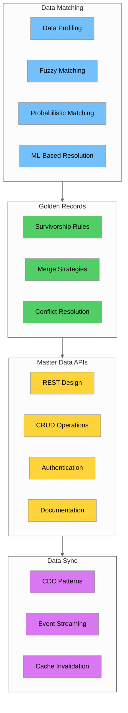

### Key Concepts Summary

| Concept | Description | Key Tools/Techniques |
|---------|-------------|---------------------|
| **Data Profiling** | Understanding data quality and patterns | pandas, completeness/uniqueness metrics |
| **Fuzzy Matching** | Approximate string matching | Levenshtein, Jaro-Winkler, Soundex |
| **Probabilistic Matching** | Statistical record linkage | Fellegi-Sunter, recordlinkage library |
| **ML Entity Resolution** | Learning-based matching | Feature engineering, Random Forest |
| **Survivorship Rules** | Creating golden records | Most recent, most complete, most trusted |
| **REST API Design** | Resource-based API architecture | HTTP methods, status codes, HATEOAS |
| **Authentication** | Securing API access | API keys, JWT, IAM |
| **OpenAPI/Swagger** | API documentation | YAML specification, Swagger UI |
| **CDC** | Change data capture | DynamoDB Streams, Kinesis |

### Matching Algorithm Selection Guide

| Scenario | Recommended Algorithm | Threshold |
|----------|----------------------|-----------|
| Short names (< 10 chars) | Jaro-Winkler | 0.85+ |
| Long text/addresses | Token Set Ratio | 80+ |
| Phonetic variations | Soundex + Levenshtein | Soundex match + 0.7 |
| Multi-field matching | Probabilistic | Score > 10 |
| Large datasets | Blocking + ML | Varies |

### API Design Checklist

- [ ] Use nouns for resource names
- [ ] Use plural names consistently
- [ ] Version your API (e.g., /v1/)
- [ ] Implement proper HTTP status codes
- [ ] Support filtering and pagination
- [ ] Include HATEOAS links
- [ ] Document with OpenAPI/Swagger
- [ ] Implement authentication
- [ ] Add rate limiting
- [ ] Enable CORS for web clients

### CDC Implementation Checklist

- [ ] Choose appropriate CDC pattern (log-based, trigger-based, query-based)
- [ ] Define event schema with before/after states
- [ ] Set up event streaming (Kinesis, Kafka)
- [ ] Implement consumers for each target system
- [ ] Handle out-of-order events
- [ ] Implement idempotency
- [ ] Monitor event lag and failures

---

## Additional Resources

### Libraries and Tools

| Tool | Purpose | Installation |
|------|---------|--------------|
| **fuzzywuzzy** | Fuzzy string matching | `pip install fuzzywuzzy python-Levenshtein` |
| **recordlinkage** | Record linkage framework | `pip install recordlinkage` |
| **pandas** | Data manipulation | `pip install pandas` |
| **Flask** | API development | `pip install flask` |
| **boto3** | AWS SDK | `pip install boto3` |
| **PyJWT** | JWT handling | `pip install PyJWT` |

### AWS Documentation

- [API Gateway Developer Guide](https://docs.aws.amazon.com/apigateway/latest/developerguide/)
- [Lambda Developer Guide](https://docs.aws.amazon.com/lambda/latest/dg/)
- [DynamoDB Streams](https://docs.aws.amazon.com/amazondynamodb/latest/developerguide/Streams.html)
- [Kinesis Data Streams](https://docs.aws.amazon.com/streams/latest/dev/)

### Further Reading

- [Fellegi-Sunter Model Paper](https://www.jstor.org/stable/2286061)
- [OpenAPI Specification](https://spec.openapis.org/oas/latest.html)
- [REST API Design Best Practices](https://restfulapi.net/)
- [Change Data Capture Patterns](https://martinfowler.com/articles/patterns-of-distributed-systems/change-data-capture.html)

### Next Steps

After completing Days 9-10, you should:

1. Practice implementing fuzzy matching on your own datasets
2. Build a complete deduplication pipeline for a real use case
3. Design and document an API for a master data domain
4. Implement CDC for real-time data synchronization
5. Prepare for Week 3: Advanced Data Engineering topics

---

*Days 9-10 Complete - Continue to Week 3: Advanced Topics*