# Week 3-4: Orchestration, Transformation, Data Warehousing & Analytics

## Table of Contents

1. [Overview](#overview)
2. [Prerequisites (from Weeks 1-2)](#prerequisites-from-weeks-1-2)
3. [Learning Path Diagram](#learning-path-diagram)
4. [Week 3: Orchestration, Transformation & Data Warehousing](#week-3-orchestration-transformation--data-warehousing)
   - [Day 11: Data Pipeline Orchestration & Monitoring](#day-11-data-pipeline-orchestration--monitoring)
   - [Day 12-13: Advanced SQL Transformations & Data Quality](#day-12-13-advanced-sql-transformations--data-quality)
   - [Day 14-15: SCD Deep Dive & Master Data Versioning](#day-14-15-scd-deep-dive--master-data-versioning)
   - [Week 3 Deliverables](#week-3-deliverables)
5. [Week 4: Data Warehousing & Analytics](#week-4-data-warehousing--analytics)
   - [Day 16: Amazon Redshift & Dimensional Modeling](#day-16-amazon-redshift--dimensional-modeling)
   - [Day 17: Athena & Serverless Analytics](#day-17-athena--serverless-analytics)
   - [Day 18: Monitoring, Observability & Performance](#day-18-monitoring-observability--performance)
   - [Day 19: Security, Compliance & MDM Governance](#day-19-security-compliance--mdm-governance)
   - [Day 20: Final Demo Day](#day-20-final-demo-day)
   - [Week 4 Deliverables](#week-4-deliverables)
6. [Skills Matrix](#skills-matrix)
7. [Quick Reference](#quick-reference)
8. [Additional Resources](#additional-resources)

---

## Overview

Weeks 3-4 of the Data Engineering training program focus on **production-ready data engineering** - taking the foundational skills from Weeks 1-2 and applying them to build enterprise-grade data pipelines with proper orchestration, transformation, warehousing, and governance.

### What You'll Build

By the end of these two weeks, you will have:

- **Orchestrated ETL pipelines** using AWS Step Functions with event-driven triggers
- **Advanced SQL transformations** with version control and automated testing
- **SCD Type 2 implementations** for master data versioning and history tracking
- **Dimensional data models** in Amazon Redshift for analytics
- **Serverless analytics** with Athena and QuickSight dashboards
- **Comprehensive monitoring** with CloudWatch, X-Ray, and data lineage
- **Security and governance** frameworks with KMS, IAM, and PII masking
- **A complete demo-ready platform** showcasing all components

### Training Timeline

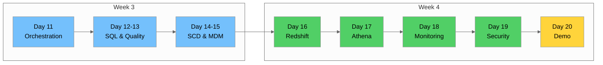

---

## Prerequisites (from Weeks 1-2)

Before starting Weeks 3-4, ensure you have completed the following from Weeks 1-2:

### Technical Prerequisites

| Skill | Description | Covered In |
|-------|-------------|------------|
| **AWS Fundamentals** | IAM, S3, basic CLI operations | Day 1-2 |
| **S3 Data Lake** | Bucket creation, data zones, metadata | Day 2-3 |
| **SQL Basics** | SELECT, JOIN, GROUP BY, window functions | Day 3-4 |
| **MDM Concepts** | Golden records, deduplication, matching | Day 4-5 |
| **Python/PySpark** | Basic data processing with Spark | Day 6-8 |
| **Delta Lake** | ACID transactions, time travel | Day 7-8 |
| **dbt Fundamentals** | Models, tests, documentation | Day 9-10 |

### Environment Setup

Ensure you have:

- [ ] AWS CLI configured with appropriate credentials
- [ ] Python 3.9+ with boto3, pandas, pyspark installed
- [ ] Access to AWS Console (Glue, Step Functions, Redshift, Athena, QuickSight)
- [ ] dbt installed and configured
- [ ] NYC Yellow Taxi dataset available in S3

### Data Assets Required

```
s3://your-bucket/
├── raw/
│   └── yellow_tripdata_*.parquet
├── processed/
│   └── trips_cleaned/
├── curated/
│   └── analytics/
└── master/
    └── golden_records/
```

---

## Learning Path Diagram

```mermaid
%%{init: {'theme':'neutral'}}%%
flowchart TB
    subgraph Foundation["📚 Foundation (Weeks 1-2)"]
        F1["AWS & S3"]
        F2["SQL & MDM"]
        F3["Spark & Delta"]
        F4["dbt"]
    end
    
    subgraph Orchestration["⚙️ Orchestration (Day 11)"]
        O1["Step Functions"]
        O2["EventBridge"]
        O3["Workflow Patterns"]
    end
    
    subgraph Transform["🔄 Transformation (Days 12-15)"]
        T1["Advanced SQL"]
        T2["Data Quality"]
        T3["SCD Types"]
        T4["MDM Versioning"]
    end
    
    subgraph Warehouse["📊 Warehousing (Days 16-17)"]
        W1["Redshift"]
        W2["Dimensional Model"]
        W3["Athena"]
        W4["QuickSight"]
    end
    
    subgraph Production["🚀 Production (Days 18-19)"]
        P1["CloudWatch"]
        P2["X-Ray"]
        P3["Data Lineage"]
        P4["Security"]
        P5["Governance"]
    end
    
    subgraph Demo["🎉 Demo (Day 20)"]
        D1["Final Presentation"]
    end
    
    Foundation --> Orchestration
    Orchestration --> Transform
    Transform --> Warehouse
    Warehouse --> Production
    Production --> Demo
    
    style F1 fill:#868e96,color:#000
    style F2 fill:#868e96,color:#000
    style F3 fill:#868e96,color:#000
    style F4 fill:#868e96,color:#000
    style O1 fill:#74c0fc,color:#000
    style O2 fill:#74c0fc,color:#000
    style T1 fill:#51cf66,color:#000
    style T2 fill:#51cf66,color:#000
    style T3 fill:#51cf66,color:#000
    style W1 fill:#ffd43b,color:#000
    style W2 fill:#ffd43b,color:#000
    style W3 fill:#ffd43b,color:#000
    style P1 fill:#da77f2,color:#000
    style P4 fill:#da77f2,color:#000
    style D1 fill:#ff6b6b,color:#000
```

---

## Week 3: Orchestration, Transformation & Data Warehousing

### Day 11: Data Pipeline Orchestration & Monitoring

📖 **Full Tutorial:** [`day-11/day-11-tutorial.md`](../day-11/day-11-tutorial.md)

#### Learning Objectives

- Understand AWS Step Functions and state machine concepts
- Implement event-driven pipeline triggers with EventBridge
- Apply workflow patterns (sequential, parallel, saga, idempotency)
- Set up CloudWatch monitoring with logs, metrics, and alarms
- Apply AWS Well-Architected Framework principles

#### Key Topics

| Topic | Description |
|-------|-------------|
| **Step Functions** | State machines with Task, Choice, Parallel, Wait, Pass, Fail, Succeed states |
| **Amazon States Language** | JSON-based DSL for defining workflows |
| **EventBridge** | Event-driven triggers, cron scheduling, event patterns |
| **Workflow Patterns** | Sequential, parallel, map state, saga pattern |
| **Idempotency** | Ensuring safe retries with idempotency tokens |
| **CloudWatch** | Logs, metrics, alarms, dashboards |
| **Structured Logging** | JSON logging with correlation IDs |

#### Architecture Overview

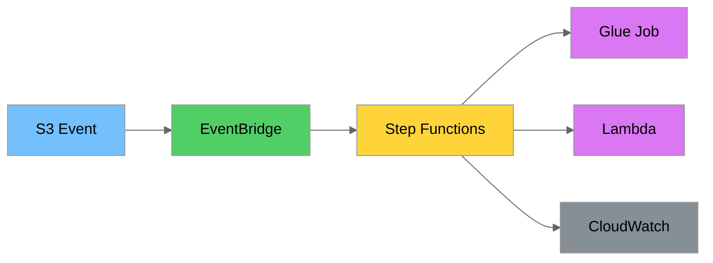

#### Hands-on Labs

1. Create a Step Functions state machine for taxi ETL
2. Configure EventBridge rules for S3 triggers
3. Implement parallel processing with Map state
4. Set up CloudWatch dashboard and alarms

---

### Day 12-13: Advanced SQL Transformations & Data Quality

📖 **Full Tutorial:** [`day-12-13/day-12-13-tutorial.md`](../day-12-13/day-12-13-tutorial.md)

#### Learning Objectives

- Master complex SQL patterns (self-joins, anti-joins, CTEs)
- Implement recursive CTEs for hierarchical data
- Create and manage SQL functions and stored procedures
- Use materialized views for performance optimization
- Implement comprehensive data quality checks
- Version control SQL scripts with Flyway migrations

#### Key Topics

| Topic | Description |
|-------|-------------|
| **Complex Joins** | Self-joins, anti-joins, cross joins, set operations |
| **CTEs** | Common Table Expressions, recursive CTEs |
| **Functions** | Scalar functions, table-valued functions, stored procedures |
| **Materialized Views** | Pre-computed query results for performance |
| **SQL Testing** | pgTAP framework for unit testing SQL |
| **Version Control** | Flyway migrations for schema versioning |
| **Data Quality** | Completeness, uniqueness, business rule validation |
| **Quality Scoring** | Weighted quality metrics and dashboards |

#### Data Quality Framework

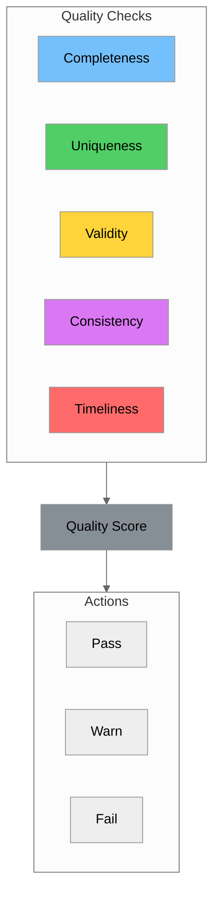

#### Hands-on Labs

1. Write complex SQL transformations with CTEs
2. Create stored procedures for data processing
3. Implement data quality checks with scoring
4. Set up Flyway migrations for version control

---

### Day 14-15: SCD Deep Dive & Master Data Versioning

📖 **Full Tutorial:** [`day-14-15/day-14-15-tutorial.md`](../day-14-15/day-14-15-tutorial.md)

#### Learning Objectives

- Understand all SCD types (0-6) and when to use each
- Implement temporal tables (system-time, application-time, bitemporal)
- Design surrogate key strategies
- Handle late-arriving data and incremental loading
- Build master data version control with approval workflows
- Implement audit trails and point-in-time queries

#### Key Topics

| Topic | Description |
|-------|-------------|
| **SCD Type 0** | Retain original value, never update |
| **SCD Type 1** | Overwrite, no history |
| **SCD Type 2** | Add new row with effective dates |
| **SCD Type 3** | Add previous value column |
| **SCD Type 4** | Separate history table |
| **SCD Type 6** | Hybrid (1+2+3) |
| **Temporal Tables** | System-time, application-time, bitemporal |
| **MERGE/UPSERT** | Efficient update-or-insert patterns |
| **Watermarks** | Incremental loading strategies |
| **Late-Arriving Data** | Handling out-of-order records |

#### SCD Type 2 Implementation

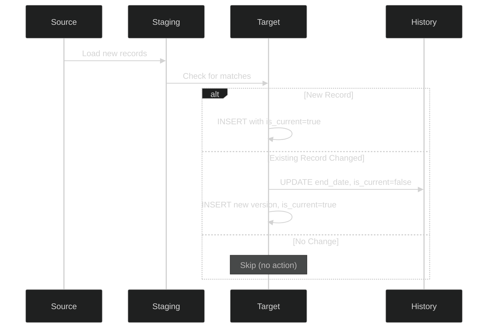

#### Hands-on Labs

1. Implement SCD Type 2 for driver dimension
2. Create temporal tables with AS OF queries
3. Build incremental loading with watermarks
4. Design master data approval workflow

---

### Week 3 Deliverables

By the end of Week 3, you should have completed:

| Deliverable | Description | Status |
|-------------|-------------|--------|
| **Step Functions Pipeline** | Orchestrated ETL workflow with error handling | ☐ |
| **EventBridge Rules** | Scheduled and event-driven triggers | ☐ |
| **CloudWatch Dashboard** | Monitoring dashboard with key metrics | ☐ |
| **SQL Transformation Scripts** | Version-controlled SQL with tests | ☐ |
| **Data Quality Framework** | Automated quality checks with scoring | ☐ |
| **SCD Type 2 Implementation** | History tracking for master data | ☐ |
| **Temporal Tables** | Point-in-time query capability | ☐ |

---

## Week 4: Data Warehousing & Analytics

### Day 16: Amazon Redshift & Dimensional Modeling

📖 **Full Tutorial:** [`day-16/day-16-tutorial.md`](../day-16/day-16-tutorial.md)

#### Learning Objectives

- Understand Redshift architecture (clusters, nodes, slices, MPP)
- Design optimal table distribution and sort keys
- Implement star and snowflake schemas
- Create fact and dimension tables for analytics
- Use Redshift Spectrum for querying S3 data
- Apply MDM principles in analytics context

#### Key Topics

| Topic | Description |
|-------|-------------|
| **Redshift Architecture** | Clusters, nodes, slices, columnar storage |
| **Distribution Styles** | KEY, ALL, EVEN, AUTO |
| **Sort Keys** | Compound, interleaved sort keys |
| **Compression** | Automatic and manual encoding |
| **COPY Command** | Bulk loading from S3 |
| **Redshift Spectrum** | Query S3 data directly |
| **Star Schema** | Fact tables surrounded by dimensions |
| **Snowflake Schema** | Normalized dimension tables |
| **Fact Table Types** | Transaction, periodic snapshot, accumulating |
| **Dimension Types** | Conformed, role-playing, junk, degenerate |

#### Dimensional Model

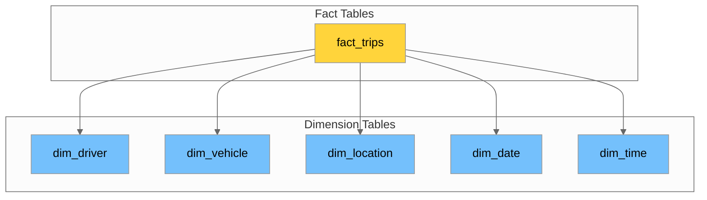

#### Hands-on Labs

1. Create Redshift cluster and configure networking
2. Design and implement star schema for taxi data
3. Load data using COPY command with best practices
4. Query external S3 data with Redshift Spectrum

---

### Day 17: Athena & Serverless Analytics

📖 **Full Tutorial:** [`day-17/day-17-tutorial.md`](../day-17/day-17-tutorial.md)

#### Learning Objectives

- Query S3 data with Athena's serverless architecture
- Create external tables with optimal partitioning
- Optimize queries for cost and performance
- Integrate with Glue Data Catalog
- Build QuickSight dashboards for visualization
- Apply dashboard design best practices

#### Key Topics

| Topic | Description |
|-------|-------------|
| **Athena Architecture** | Serverless Presto/Trino engine |
| **External Tables** | DDL syntax, SerDe options |
| **Partitioning** | MSCK REPAIR TABLE vs Partition Projection |
| **Query Optimization** | EXPLAIN, columnar formats, approximate functions |
| **Cost Management** | $5/TB scanned, optimization strategies |
| **Glue Data Catalog** | Centralized metadata repository |
| **QuickSight** | BI visualization and dashboards |
| **SPICE** | In-memory calculation engine |

#### Athena Query Flow

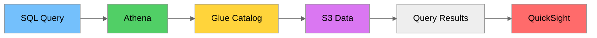

#### Hands-on Labs

1. Create partitioned external tables in Athena
2. Optimize queries with partition projection
3. Build QuickSight dashboard for taxi analytics
4. Implement cost monitoring for Athena queries

---

### Day 18: Monitoring, Observability & Performance

📖 **Full Tutorial:** [`day-18/day-18-tutorial.md`](../day-18/day-18-tutorial.md)

#### Learning Objectives

- Set up comprehensive CloudWatch monitoring
- Implement audit logging with CloudTrail
- Use X-Ray for distributed tracing
- Track data lineage across pipelines
- Apply data observability best practices
- Respond to data incidents effectively
- Optimize queries, Spark jobs, and storage

#### Key Topics

| Topic | Description |
|-------|-------------|
| **CloudWatch** | Logs, metrics, alarms, dashboards, Logs Insights |
| **CloudTrail** | Management events, data events, audit logging |
| **X-Ray** | Distributed tracing, segments, subsegments |
| **Data Lineage** | Table-level, column-level, row-level tracking |
| **OpenLineage** | Standard for lineage metadata |
| **Five Pillars** | Freshness, volume, schema, distribution, lineage |
| **Incident Response** | P1-P4 classification, runbooks, post-mortems |
| **Query Optimization** | EXPLAIN plans, anti-patterns |
| **Spark Optimization** | Partitioning, broadcast joins, AQE, caching |
| **Storage Optimization** | File sizing, compaction, tiering |

#### Data Observability Pillars

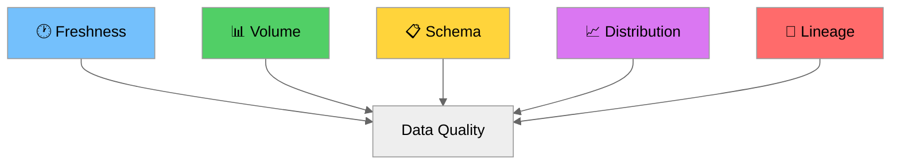

#### Hands-on Labs

1. Create CloudWatch dashboard for pipeline monitoring
2. Set up alarms for job failures and data quality
3. Implement data lineage tracking with OpenLineage
4. Optimize Spark jobs for performance

---

### Day 19: Security, Compliance & MDM Governance

📖 **Full Tutorial:** [`day-19/day-19-tutorial.md`](../day-19/day-19-tutorial.md)

#### Learning Objectives

- Implement encryption with AWS KMS and Secrets Manager
- Design IAM policies following least privilege
- Detect and mask PII using AWS Macie
- Understand complete data governance frameworks
- Evaluate MDM tools and multi-domain patterns
- Implement cross-domain relationships

#### Key Topics

| Topic | Description |
|-------|-------------|
| **AWS KMS** | CMKs, envelope encryption, key rotation |
| **Secrets Manager** | Credential storage, automatic rotation |
| **IAM Policies** | Identity-based, resource-based, permission boundaries |
| **SCPs** | Organization-level guardrails |
| **AWS Macie** | PII detection, custom data identifiers |
| **Data Masking** | Redaction, tokenization, hashing, pseudonymization |
| **Governance Framework** | Roles, classification, lifecycle management |
| **Lake Formation** | Centralized data lake governance |
| **Multi-Domain MDM** | Hub-and-spoke, federated patterns |

#### Security Architecture

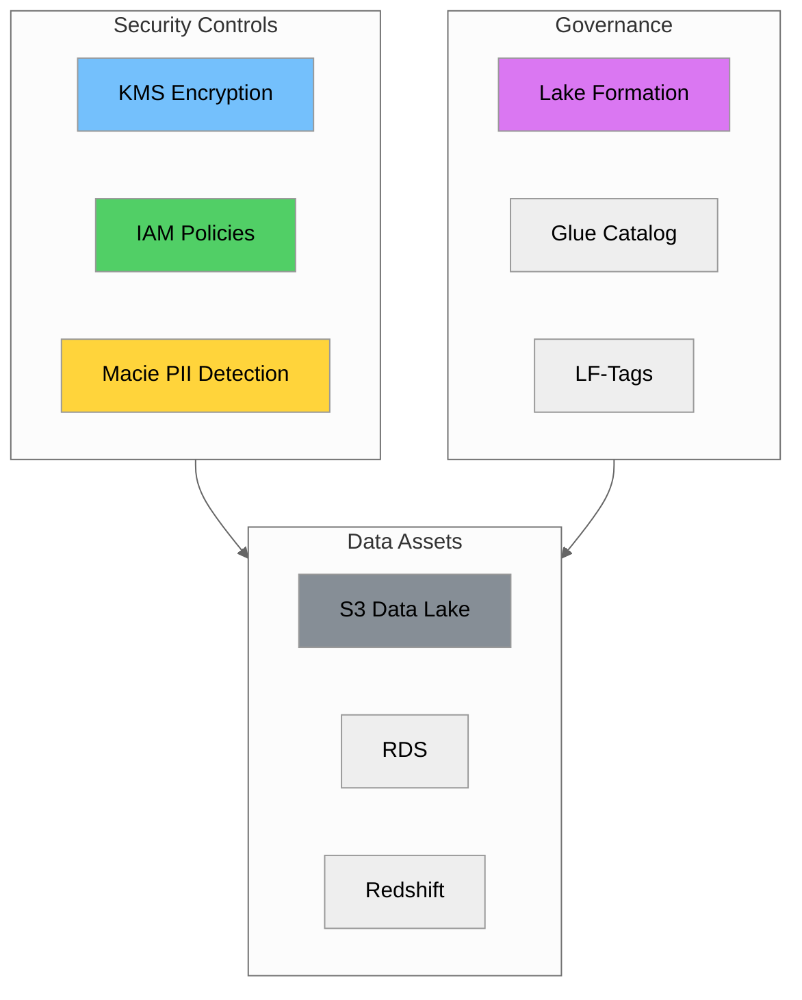

#### Hands-on Labs

1. Configure KMS encryption for S3 and RDS
2. Create IAM policies with least privilege
3. Implement PII masking pipeline
4. Design multi-domain MDM architecture

---

### Day 20: Final Demo Day

📖 **Full Tutorial:** [`day-20/day-20-tutorial.md`](../day-20/day-20-tutorial.md)

#### Learning Objectives

- Prepare comprehensive demo of the data platform
- Document architecture and operational procedures
- Present technical work effectively
- Handle Q&A with confidence
- Deliver post-demo documentation

#### Key Topics

| Topic | Description |
|-------|-------------|
| **Demo Checklist** | Infrastructure, data, application verification |
| **Demo Script** | 20-minute structured presentation |
| **Architecture Docs** | End-to-end system documentation |
| **Demo Scenarios** | ETL, SQL, MDM, Analytics, CI/CD |
| **Troubleshooting** | Common issues and solutions |
| **Presentation Tips** | Technical demo best practices |
| **Q&A Preparation** | Anticipated questions and answers |
| **Deliverables** | Documentation package requirements |

#### Demo Structure

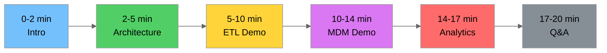

#### Hands-on Labs

1. Run demo readiness verification script
2. Practice demo script with timing
3. Prepare backup plans for each scenario
4. Complete documentation package

---

### Week 4 Deliverables

By the end of Week 4, you should have completed:

| Deliverable | Description | Status |
|-------------|-------------|--------|
| **Redshift Data Warehouse** | Star schema with fact and dimension tables | ☐ |
| **Athena External Tables** | Partitioned tables with projection | ☐ |
| **QuickSight Dashboard** | Interactive analytics dashboard | ☐ |
| **CloudWatch Monitoring** | Comprehensive observability setup | ☐ |
| **Security Configuration** | KMS, IAM, PII masking | ☐ |
| **Architecture Document** | Complete system documentation | ☐ |
| **Operational Runbook** | Procedures for common operations | ☐ |
| **Final Demo** | 20-minute presentation | ☐ |

---

## Skills Matrix

The following matrix shows which skills are covered on each day:

| Skill | Day 11 | Day 12-13 | Day 14-15 | Day 16 | Day 17 | Day 18 | Day 19 | Day 20 |
|-------|:------:|:---------:|:---------:|:------:|:------:|:------:|:------:|:------:|
| **AWS Step Functions** | ✅ | | | | | | | ✅ |
| **EventBridge** | ✅ | | | | | | | |
| **CloudWatch** | ✅ | | | | | ✅ | | |
| **Advanced SQL** | | ✅ | ✅ | ✅ | ✅ | | | |
| **CTEs & Window Functions** | | ✅ | | | | | | |
| **Data Quality Testing** | | ✅ | | | | ✅ | | |
| **SCD Implementation** | | | ✅ | | | | | |
| **Temporal Tables** | | | ✅ | | | | | |
| **Redshift** | | | | ✅ | | | | |
| **Dimensional Modeling** | | | | ✅ | | | | |
| **Athena** | | | | | ✅ | | | |
| **QuickSight** | | | | | ✅ | | | |
| **X-Ray Tracing** | | | | | | ✅ | | |
| **Data Lineage** | | | | | | ✅ | | |
| **Performance Tuning** | | | | | | ✅ | | |
| **KMS Encryption** | | | | | | | ✅ | |
| **IAM Policies** | | | | | | | ✅ | |
| **PII Masking** | | | | | | | ✅ | |
| **Data Governance** | | | | | | | ✅ | |
| **Technical Presentation** | | | | | | | | ✅ |
| **Documentation** | | | | | | | | ✅ |

---

## Quick Reference

### AWS Services Used

| Service | Purpose | Days |
|---------|---------|------|
| **S3** | Data lake storage | All |
| **Glue** | ETL processing, Data Catalog | 11, 12-13, 17 |
| **Step Functions** | Workflow orchestration | 11, 20 |
| **EventBridge** | Event-driven triggers | 11 |
| **Lambda** | Serverless compute | 11, 18 |
| **CloudWatch** | Monitoring, logging, alarms | 11, 18 |
| **CloudTrail** | Audit logging | 18 |
| **X-Ray** | Distributed tracing | 18 |
| **Redshift** | Data warehouse | 16 |
| **Athena** | Serverless SQL queries | 17 |
| **QuickSight** | BI dashboards | 17 |
| **KMS** | Encryption key management | 19 |
| **Secrets Manager** | Credential management | 19 |
| **Macie** | PII detection | 19 |
| **Lake Formation** | Data governance | 19 |
| **IAM** | Access control | 19 |

### Key Concepts Quick Reference

#### Step Functions State Types

| State | Purpose |
|-------|---------|
| `Task` | Execute work (Lambda, Glue, etc.) |
| `Choice` | Conditional branching |
| `Parallel` | Execute branches concurrently |
| `Map` | Iterate over array |
| `Wait` | Delay execution |
| `Pass` | Pass input to output |
| `Succeed` | Terminal success state |
| `Fail` | Terminal failure state |

#### SCD Types Summary

| Type | Description | Use Case |
|------|-------------|----------|
| **Type 0** | Retain original | Immutable attributes |
| **Type 1** | Overwrite | No history needed |
| **Type 2** | Add row with dates | Full history tracking |
| **Type 3** | Previous value column | Limited history |
| **Type 4** | Separate history table | Performance optimization |
| **Type 6** | Hybrid (1+2+3) | Complex requirements |

#### Redshift Distribution Styles

| Style | Description | Use Case |
|-------|-------------|----------|
| **KEY** | Distribute by column value | Large tables with joins |
| **ALL** | Copy to all nodes | Small dimension tables |
| **EVEN** | Round-robin distribution | No clear distribution key |
| **AUTO** | Redshift chooses | Default recommendation |

#### Data Quality Dimensions

| Dimension | Question |
|-----------|----------|
| **Completeness** | Are all required fields populated? |
| **Uniqueness** | Are there duplicate records? |
| **Validity** | Do values conform to expected formats? |
| **Consistency** | Are values consistent across systems? |
| **Timeliness** | Is data fresh enough for use? |
| **Accuracy** | Does data reflect reality? |

#### Incident Priority Levels

| Priority | Response Time | Example |
|----------|---------------|---------|
| **P1** | 15 minutes | Complete pipeline outage |
| **P2** | 1 hour | 50%+ invalid records |
| **P3** | 4 hours | Some columns missing |
| **P4** | 24 hours | Documentation update |

### Common CLI Commands

```bash
# Step Functions
aws stepfunctions start-execution \
    --state-machine-arn arn:aws:states:REGION:ACCOUNT:stateMachine:NAME \
    --input '{"key": "value"}'

# Glue Jobs
aws glue start-job-run --job-name JOB_NAME
aws glue get-job-runs --job-name JOB_NAME --max-results 5

# Athena Queries
aws athena start-query-execution \
    --query-string "SELECT * FROM table LIMIT 10" \
    --result-configuration OutputLocation=s3://bucket/results/

# CloudWatch Logs
aws logs filter-log-events \
    --log-group-name /aws/glue/jobs/JOB_NAME \
    --filter-pattern "ERROR"

# Redshift
aws redshift describe-clusters --cluster-identifier CLUSTER_NAME

# S3 Operations
aws s3 ls s3://bucket/prefix/ --recursive
aws s3 cp local-file s3://bucket/key
```

---

## Additional Resources

### AWS Documentation

- [AWS Step Functions Developer Guide](https://docs.aws.amazon.com/step-functions/latest/dg/)
- [Amazon Redshift Documentation](https://docs.aws.amazon.com/redshift/)
- [Amazon Athena User Guide](https://docs.aws.amazon.com/athena/)
- [Amazon QuickSight User Guide](https://docs.aws.amazon.com/quicksight/)
- [AWS CloudWatch Documentation](https://docs.aws.amazon.com/cloudwatch/)
- [AWS KMS Developer Guide](https://docs.aws.amazon.com/kms/)
- [AWS Lake Formation Developer Guide](https://docs.aws.amazon.com/lake-formation/)

### Data Engineering Resources

- [Delta Lake Documentation](https://docs.delta.io/)
- [dbt Documentation](https://docs.getdbt.com/)
- [Great Expectations Documentation](https://docs.greatexpectations.io/)
- [OpenLineage Specification](https://openlineage.io/)
- [Spark Performance Tuning](https://spark.apache.org/docs/latest/tuning.html)

### Best Practices

- [AWS Well-Architected Framework](https://aws.amazon.com/architecture/well-architected/)
- [Data Engineering Best Practices](https://aws.amazon.com/big-data/datalakes-and-analytics/)
- [DAMA-DMBOK (Data Management Body of Knowledge)](https://www.dama.org/cpages/body-of-knowledge)

### Security & Compliance

- [IAM Best Practices](https://docs.aws.amazon.com/IAM/latest/UserGuide/best-practices.html)
- [CIS AWS Foundations Benchmark](https://www.cisecurity.org/benchmark/amazon_web_services)
- [GDPR (General Data Protection Regulation)](https://gdpr.eu/)
- [PCI-DSS (Payment Card Industry Data Security Standard)](https://www.pcisecuritystandards.org/)

### Individual Day Tutorials

| Day | Tutorial | Topic |
|-----|----------|-------|
| 11 | [`day-11-tutorial.md`](../day-11/day-11-tutorial.md) | Data Pipeline Orchestration & Monitoring |
| 12-13 | [`day-12-13-tutorial.md`](../day-12-13/day-12-13-tutorial.md) | Advanced SQL Transformations & Data Quality |
| 14-15 | [`day-14-15-tutorial.md`](../day-14-15/day-14-15-tutorial.md) | SCD Deep Dive & Master Data Versioning |
| 16 | [`day-16-tutorial.md`](../day-16/day-16-tutorial.md) | Amazon Redshift & Dimensional Modeling |
| 17 | [`day-17-tutorial.md`](../day-17/day-17-tutorial.md) | Athena & Serverless Analytics |
| 18 | [`day-18-tutorial.md`](../day-18/day-18-tutorial.md) | Monitoring, Observability & Performance |
| 19 | [`day-19-tutorial.md`](../day-19/day-19-tutorial.md) | Security, Compliance & MDM Governance |
| 20 | [`day-20-tutorial.md`](../day-20/day-20-tutorial.md) | Final Demo Day |

---

## Summary

Weeks 3-4 transform you from a data engineering learner into a practitioner capable of building production-ready data platforms. The key themes are:

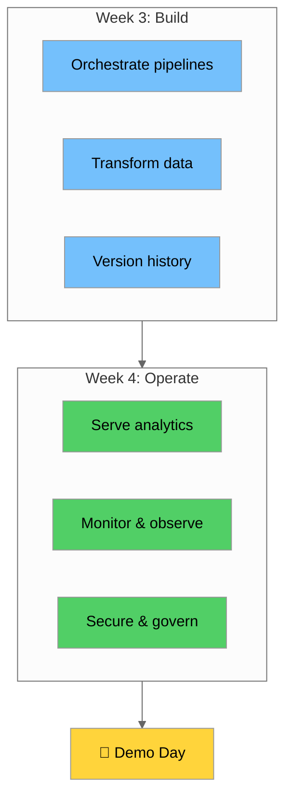

### Key Takeaways

1. **Orchestration is essential** - Step Functions and EventBridge enable reliable, scalable pipelines
2. **Data quality is non-negotiable** - Automated testing and monitoring catch issues early
3. **History matters** - SCD Type 2 and temporal tables enable point-in-time analysis
4. **Dimensional modeling enables analytics** - Star schemas in Redshift power business insights
5. **Serverless reduces operational burden** - Athena and Lambda scale automatically
6. **Observability enables reliability** - CloudWatch, X-Ray, and lineage tracking are critical
7. **Security is foundational** - KMS, IAM, and PII masking protect sensitive data
8. **Documentation enables handoff** - Architecture docs and runbooks ensure maintainability

### Next Steps

After completing Weeks 3-4:

1. **Practice** - Run through all hands-on labs multiple times
2. **Document** - Complete all deliverables and documentation
3. **Prepare** - Practice your demo presentation
4. **Present** - Deliver your final demo with confidence
5. **Continue Learning** - Explore streaming, ML pipelines, and advanced topics

---

*Good luck with your training! 🚀*